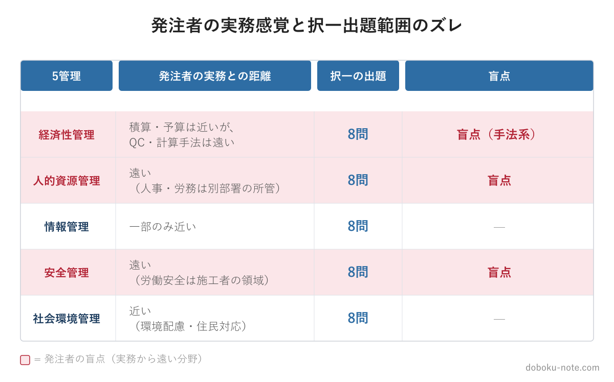

# 【総監択一】自治体の技術職員が総監択一でつまずく3つの盲点｜発注者業務と試験範囲のズレ

**こんな人におすすめ**

- 自治体の土木職など、発注者の立場で総監受験を考えている・勉強中
- 積算や工程監督は得意なのに、択一の点が思うように伸びない
- 5管理のうちどの分野に時間を割くべきか決めきれない
- 民間（施工者・コンサル）出身者と同じ勉強法でいいのか不安

**この記事でわかること**

- 発注者の日常業務と総監択一の出題範囲が「どこでズレるか」
- 自治体の技術職員が特に失点しやすい3つの盲点分野
- 盲点を踏まえた5管理の学習優先順位の付け方

---

総監択一は5管理から8問ずつ、合計40問が出ます。配点は5分野で完全に均等です。

ところが、自治体の技術職員──とりわけ発注者の立場で働いてきた人の日常業務は、5管理を均等には扱いません。私自身、地方自治体の土木職として長く発注者業務に携わってきましたが、現場の労働安全は施工者にお任せ、品質管理の細かい手法も施工者の領分、という感覚が長年染みついていました。

総監の勉強を始めて気づいたのは、その「発注者としての得意・不得意の地図」が、択一の出題範囲とかなりズレているということです。発注者業務の感覚のまま択一に臨むと、特定の分野でまとめて失点します。

この記事では、自治体の技術職員が特につまずきやすい3つの盲点を整理します。手薄な分野を効率的に埋めたい方のために、5管理を出題視点で優先度順に整理し直した精読ガイド（経済性・人的資源・情報・安全・社会環境の5本セット）も用意しています。

https://note.com/dobokunote/m/m607bf095b02a

## なぜ発注者業務と択一はズレるのか

発注者の技術職員が日常的に深く関わるのは、ざっくり言えば──積算・予算、契約・発注、工程の監督、完成検査、住民説明、環境影響への配慮、といった領域です。

これらは総監5管理のうち、経済性管理の一部（積算・原価）、社会環境管理（環境・住民対応）、安全管理のごく一部（安全管理計画の確認）に対応します。

逆に、発注者が日常業務でほとんど手を動かさない領域があります。施工現場の労働安全衛生、統計的な品質管理手法、工程の数理計算、組織の人事・労務、情報セキュリティの実務──これらは設計コンサルや施工者、あるいは人事・情報部門の担当範囲です。

択一はこのズレを容赦なく突いてきます。出題は5管理に均等に8問ずつ。発注者が「自分の仕事ではない」と感じてきた領域からも、確実に8問ずつ出るのです。以下、特にズレが大きい3つの盲点を見ていきます。

## 盲点1：安全管理を「施工者の世界」として素通りする

発注者にとって、工事中の安全は基本的に施工者（受注者）の責任です。労働災害の防止も、現場の安全教育も、施工計画に基づいて施工者が回します。発注者は安全管理計画を確認し指導する立場ではありますが、労働安全衛生の実務そのものを担うわけではありません。

この感覚のまま安全管理8問に臨むと、かなり苦戦します。択一の安全管理は、[労働安全衛生法](https://doboku-note.com/docs/pe-comprehensive-management-occupational-safety-act?utm_source=note&utm_medium=referral&utm_campaign=92-civil-servant-blindspots)の事業者責任の細部、[FMEA](https://doboku-note.com/docs/pe-comprehensive-management-fmea?utm_source=note&utm_medium=referral&utm_campaign=92-civil-servant-blindspots)・[FTA](https://doboku-note.com/docs/pe-comprehensive-management-fta?utm_source=note&utm_medium=referral&utm_campaign=92-civil-servant-blindspots)といった安全工学の解析手法、システム信頼性の計算──と、施工者・製造業側の知識が中心だからです。

「現場の安全は施工者がやること」という発注者の実務感覚は、ここでは通用しません。安全管理8問は、発注者にとって最も“自分の仕事から遠い”8問になりがちです。だからこそ、実務の延長で何となく解こうとせず、座学として正面から取り組む必要があります。

## 盲点2：経済性管理を「積算ができれば大丈夫」と思い込む

発注者の技術職員は、経済性管理に苦手意識を持たない人が多いはずです。積算、予算管理、契約事務は日常業務そのもの。「経済性管理は得意分野」と感じるのは自然なことです。

ところが、択一の経済性管理8問は、積算スキルとは別物です。出題の中心は、[QC7つ道具](https://doboku-note.com/docs/pe-comprehensive-management-quality-control?utm_source=note&utm_medium=referral&utm_campaign=92-civil-servant-blindspots)などの統計的品質管理、[PERT/CPM](https://doboku-note.com/docs/pe-comprehensive-management-pert-cpm?utm_source=note&utm_medium=referral&utm_campaign=92-civil-servant-blindspots)のネットワーク工程計算、[工程能力指数](https://doboku-note.com/docs/pe-comprehensive-management-process-capability-index?utm_source=note&utm_medium=referral&utm_campaign=92-civil-servant-blindspots)、財務諸表、設備保全──いずれも、施工者の品質・工程管理や、企業経営の世界の知識です。

発注者が積算で扱う「歩掛・単価・数量」と、択一が問う「工程能力指数の計算・クリティカルパスの算出」は、同じ経済性管理でもまったく別の引き出しにあります。「経済性は得意」という思い込みが、かえって対策を後回しにさせる──これが2つ目の盲点です。得意だと感じている分野ほど、過去問で一度実力を測ってみてください。

## 盲点3：人的資源管理を「人事の仕事」として後回しにする

人事異動、給与、組織設計、労務管理──自治体の技術職員にとって、これらは人事課・総務課の所管で、自分が動かす領域ではありません。

そのため人的資源管理は「自分の仕事ではない」と感じられ、勉強の優先順位が下がりがちです。しかし択一では、ここからも8問出ます。

しかも人的資源管理の択一は、[マズローの欲求階層](https://doboku-note.com/docs/pe-comprehensive-management-maslow-hierarchy-of-needs?utm_source=note&utm_medium=referral&utm_campaign=92-civil-servant-blindspots)・[ハーズバーグの二要因理論](https://doboku-note.com/docs/pe-comprehensive-management-herzberg-two-factor-theory?utm_source=note&utm_medium=referral&utm_campaign=92-civil-servant-blindspots)・[マグレガーのX理論Y理論](https://doboku-note.com/docs/pe-comprehensive-management-mcgregor-xy-theory?utm_source=note&utm_medium=referral&utm_campaign=92-civil-servant-blindspots)といった動機づけ理論、組織形態の比較、[労働基準法](https://doboku-note.com/docs/pe-comprehensive-management-labor-standards-act?utm_source=note&utm_medium=referral&utm_campaign=92-civil-servant-blindspots)の数値規定──と、実務経験が乏しくても座学の暗記で確実に得点できる分野でもあります。

裏を返せば、人的資源管理は「実務で触れないから後回し」にした人と、「暗記分野と割り切って詰めた人」とで最も差がつく8問です。発注者にとっては、手薄になりやすいが対策の費用対効果は高い分野と言えます。

## 盲点を踏まえた学習優先順位

3つの盲点（安全管理・経済性管理の手法系・人的資源管理）に共通するのは、発注者の実務感覚では縁が薄いために対策が薄くなる、という点です。一方で、社会環境管理や経済性管理の積算寄りの部分は、発注者ならある程度の下地があります。

つまり、自治体の技術職員の総監択一対策は「5分野を均等に」ではなく、**実務でカバーできている分野は軽く、盲点3分野に時間を寄せる**のが効率的です。

1. まず直近5年（R03〜R07）の択一過去問を5管理別に解き、自分の分野別正答率を出す（doboku-note で全問が解答解説つき）
2. 発注者の下地がある分野（社会環境管理、経済性管理の積算寄り）で取れているかを確認する
3. 盲点3分野（安全管理・経済性管理の手法系・人的資源管理）に学習時間を重点配分する
4. 各分野の頻出論点を、出題頻度の高い順に潰していく

学習の全体設計は[総合技術監理部門 合格戦略](https://doboku-note.com/docs/pe-comprehensive-management-exam-passing-strategy?utm_source=note&utm_medium=referral&utm_campaign=92-civil-servant-blindspots)も参考になります。発注者という立場の強みと弱みを正しく把握することが、限られた勉強時間を最も活かす出発点になります。

## 5管理を出題視点で整理した精読ガイド

盲点3分野を効率よく埋めるには、「キーワード集を頭から読む」より「出題視点で優先度を付けた教材」を使う方が早道です。

note の精読ガイドは、17年分の択一過去問680問を分析し、5管理それぞれの論点を「優先度: 高・中・低」で仕分け、択一の引っかけパターンまで明示しています。発注者が手薄になりがちな安全管理・人的資源管理についても、どこから手をつければよいかが一目で分かります。

**技術士 総監｜5管理 テキスト精読ガイド**

- 経済性・人的資源・情報・安全・社会環境の5本セット
- 各論点を「優先度: 高・中・低」で整理し、択一の引っかけパターンを明示
- doboku-note の該当キーワード解説ページへ直リンク（スマホ通勤学習に最適）

https://note.com/dobokunote/m/m607bf095b02a

---

## 総監対策をまとめて進めたい方へ

工程（型 → 設問(3) → 予想演習 → フル模範論文）を一気にそろえたい方には、全部入りの「完全パック」が最もお得です。

https://note.com/dobokunote/m/m171222175fac

各マガジンの全体像と「どれから読むか」は、はじめての方向けのロードマップ記事にまとめています。

https://note.com/dobokunote/n/n3d73729e6cc7

## 関連リソース

**doboku-note — 17年分の過去問 + 700キーワード解説**（無料）

https://doboku-note.com

- 17年分の択一式過去問（全問解答解説つき・分野別に演習可能）
- キーワード集2026の全項目をWeb検索可能
- 700以上のキーワード解説ページ（スマホ対応）

**note のおすすめ記事**

- 【総監択一】キーワード集を1周したのに点が取れない3つの理由｜5管理を「出題視点」で読み直す
- 【学習優先順位がわかる】総監択一式17年分680問を徹底分析（無料）

---

<!-- cta:tankan-mokuji -->
総監のほかの無料記事・有料マガジンは「総監もくじ」から一覧できます。

https://note.com/dobokunote/n/n3ed4c77ceed6
