# 参考資料3 防波堤と防潮堤による多重防護の活用

平成26年1月　水産庁漁港漁場整備部

## 1 はじめに

平成23年3月11日に発生した東日本大震災により被災した漁港は、北海道から千葉県までの7道県の319漁港に及んだ。これは全国の2,914漁港（震災発生当時）の約1割に相当する。特に、岩手県、宮城県、福島県の3県では、ほぼ全ての漁港で被害を受けた。

津波により多くの防波堤が倒壊した一方、倒壊を免れた防波堤については、津波浸水高や流速の低減による水産関係施設等の被害の低減、津波到達時間を遅延させたことによる避難時間の確保といった防災・減災に資する効果を発揮した事例もあることが確認されている。

また、中央防災会議では、2種類の津波（発生頻度の高い津波、最大クラスの津波）を想定し、発生頻度の高い津波については人命保護に加え、住民財産の保護、地域の経済活動の安定化等を図り、また最大クラスの津波については住民等の生命を守ることを最優先とし、住民の避難を軸に、とりうる手段を尽くした総合的な津波対策を図る方針が示されている。

このことを踏まえると、これまで防波堤は津波について十分に検討されていなかったが、今般の震災では防波堤による津波低減効果が確認できたことから、津波に対する防波堤の防災・減災に資する効果を最大限考慮することで、社会的な要請に適切に対応していくことが重要である。

こうした動きを受けて、水産庁では、学識経験者から構成される「漁港・漁村の津波防災・減災対策に関する専門部会（座長：磯部雅彦・高知工科大学副学長）」からの助言をいただきながら、防波堤と防潮堤による多重防護の考え方、効果及び具体的な対策や津波低減による漁港漁村への効果とその便益等について検討し、多重防護による漁港漁村の防災・減災対策をとりまとめたものである。

なお、本編では、防波堤による津波低減効果に主眼を置いて防災・減災対策の検討を行っており、漁港施設（防波堤等）を主とした対策についてとりまとめた。

**漁港・漁村の津波防災・減災対策に関する専門部会　委員**

| 区分 | 所属・役職 | 氏名 |
|:---:|:---|:---:|
| 委員長 | 高知工科大学　副学長 | 磯部 雅彦 |
| 委員 | 東京海洋大学　海洋科学部海洋環境学科　教授 | 岡安 章夫 |
| 委員 | 早稲田大学　創造理工学部社会環境工学科　教授 | 清宮 理 |
| 委員 | 防衛大学校　システム工学群建設環境工学科　教授 | 藤間 功司 |
| 委員 | 公立はこだて未来大学　名誉教授 | 長野 章 |

## 2 多重防護による漁港漁村の防災・減災対策のあり方

### 2.1 多重防護による防災・減災対策の目的

> 漁港漁村では、東日本大震災における津波によって、防波堤、岸壁等の漁港施設や市場・荷さばき所・加工場等の水産関連施設、背後集落の人家等も大きな被害を受けるとともに、多数の人命が失われた。また、復旧に長時間を要し、生活や生業（漁業活動等）の再開が遅れたことによって、地域経済や全国的な食料供給に多大な影響を及ぼした。
>
> このため、漁港漁村における防災・減災対策は、高潮・波浪に加えて、津波についてもより効果的なものとすることが重要であり、漁業活動の安定化及び水産物の生産・流通機能の確保と漁港漁村の人命・財産の防護の両方の観点から、主として、堤外地では水産関連施設・漁船等の被害軽減とともに、漁業関係者等の避難の確保を、堤内地では人家等財産の保全とともに、住民等の避難の確保を目的とする。

#### 【解説】

元来、漁港の防波堤は、台風や低気圧に伴う高潮・波浪に対して港内の静穏度の向上等を図り、漁船の安全性の確保、荷役作業等の港内作業の円滑化、岸壁・護岸等の港内施設や漁港の背後地（人家等）の防護を図ることを主たる目的としてきた。また、漁村については、防潮堤等によって、台風・低気圧に伴う高潮・波浪や津波から漁村の生命・財産を防護することを目的としてきた。

しかし、東日本大震災では、地震や来襲した大津波によって、防波堤・岸壁等の基本施設だけでなく、荷さばき所・製氷、冷凍及び冷蔵施設、加工場等の機能施設や背後の漁村も合わせて被災し、これに伴って漁業活動や地域の経済・生活、さらには国民に対する水産物の安定供給に多大な影響を及ぼした。

その一方で、完全な倒壊を免れた防波堤については、津波来襲時において、浸水時間遅延による避難時間の確保、流入量低減による被害の軽減、第2波以降の津波に対する減災等の効果が確認されている。

こうしたことから、漁港漁村においては、津波に対する防災・減災についても適切に対応することが社会的な要請でもあり、防波堤の津波低減効果を最大限に考慮して、対策を推進することが重要である。

### 2.2 防波堤と防潮堤による多重防護の考え方

> 防波堤と防潮堤による多重防護とは、防波堤によって堤外地の水産関連施設や漁船等の減災を図るとともに、防波堤と防潮堤を組み合わせて堤内地の人命・財産等の防災・減災を図ることである。
>
> 漁港漁村の中には、こうした多重防護を活用することで、津波に対して防災・減災対策を効率的かつ効果的に進めることができる場合があり、このような地域では積極的に多重防護を活用した防災・減災対策に取り組むことが重要である。

#### 【解説】

防波堤と防潮堤による多重防護のイメージを以下に示す。

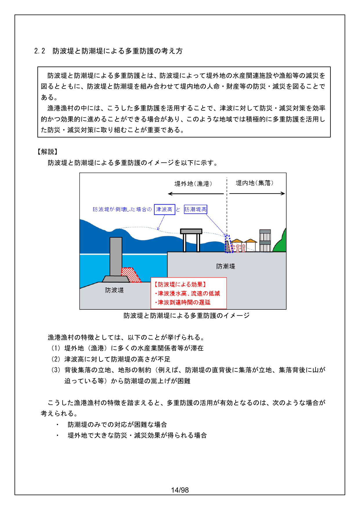

防波堤と防潮堤による多重防護のイメージ

漁港漁村の特徴としては、以下のことが挙げられる。

1. 堤外地（漁港）に多くの水産業関係者等が滞在
2. 津波高に対して防潮堤の高さが不足
3. 背後集落の立地、地形の制約（例えば、防潮堤の直背後に集落が立地、集落背後に山が迫っている等）から防潮堤の嵩上げが困難

こうした漁港漁村の特徴を踏まえると、多重防護の活用が有効となるのは、次のような場合が考えられる。

- 防潮堤のみでの対応が困難な場合
- 堤外地で大きな防災・減災効果が得られる場合

### 2.3 多重防護による主な効果

> 漁港漁村において防波堤と防潮堤による多重防護を活用することによって、堤外地では、防波堤が津波浸水高や流速を低減することによる水産関連施設・漁船等被害の低減、堤内地では防潮堤高さを抑えることによる背後用地の利活用、漁業活動・生活の利便性の向上、集落景観の維持、また、浸水範囲の減少等による一般資産被害の低減等の効果が期待できる。
>
> また、堤外地及び堤内地では、防波堤が津波到達時間を遅延し、避難時間が増加することによる避難可能人数の増大が期待できる。

#### 【解説】

漁港漁村において防波堤と防潮堤による多重防護を活用することによって、堤内・堤外地で以下に示すような効果が期待できる。

**【堤外地（主として漁港）での効果】**

1. 津波浸水高や流速を低減することによる、水産関連施設・漁船等被害の低減
2. 津波到達時間を遅延し、避難時間が増加することによる避難可能人数の増大

→ 堤外地の物的・人的被害の低減、水産業の早期再開

**【堤内地（主として集落）での効果】**

1. 防潮堤の高さを抑えることによる、背後用地の利活用、漁業活動・生活の利便性の向上、集落景観の維持
2. 浸水範囲の減少等による、家屋、事業所、家庭用品等の一般資産被害の低減
3. 津波到達時間を遅延し、避難時間が増加することによる避難可能人数の増大

→ 堤内地の物的・人的被害、地域に与える損害の低減

また、多重防護を活用することで、仮に片方が損壊しても、もう片方が残ることで完全に防護機能等が失われないリスク分散効果も期待できる。

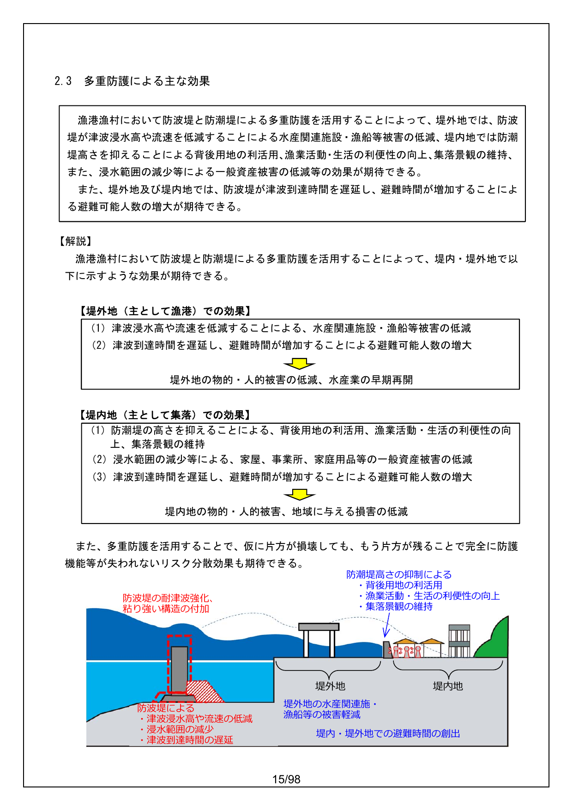

多重防護による主な効果のイメージ

### 2.4 多重防護における防災・減災目標の考え方

> 多重防護による防災・減災対策については、発生頻度の高い津波に対して、漁業活動の安定化及び水産物の生産・流通拠点の確保の観点並びに漁業関係者等の避難の確保の観点から、津波浸水高に対する被災率など過去の知見や避難シミュレーション等に基づき、堤外地では被害を低減できる高さまで津波を低減するとともに、堤内地では津波の浸入を防止し、また、堤外地及び堤内地では避難時間の確保に資するなど、適切な防災・減災目標の目安を設定することが望ましい。
>
> また、発生頻度の高い津波を超える津波についても、防波堤等へ粘り強い構造を付加することにより、発生頻度の高い津波と同様の観点から、堤内地及び堤外地では、被害を軽減できる高さまで津波を低減するとともに、避難時間の確保に資するなど、適切な減災目標の目安を設定することが望ましい。
>
> なお、多重防護における防災・減災目標の設定にあたっては、多重防護による減災効果を適切に評価し、対策に要する費用や得られる便益等を総合的に勘案することが重要である。

#### 【解説】

多重防護による防災・減災対策については、「発生頻度の高い津波」、「発生頻度の高い津波を超える津波」の2種類の津波を設定し、適切な防災・減災目標の設定することが望ましい。

「発生頻度の高い津波」に対しては、防波堤と防潮堤によって堤内地への津波の侵入を抑止し、背後集落の人命・財産を防護することに加え、防波堤によって堤外地での津波を低減し、水産関連施設等の被害軽減や漁港内の水産業従事者の避難時間の確保を図ることが基本的な考え方となる。

また、防波堤や防潮堤を粘り強い構造とすることで、発生頻度の高い津波（設計津波）を超える津波に対しても、可能な限り、堤外地・堤内地の水産関連施設・人家等の被害軽減や漁港内の水産業従事者や集落住民等の避難時間の確保を図ることができる。

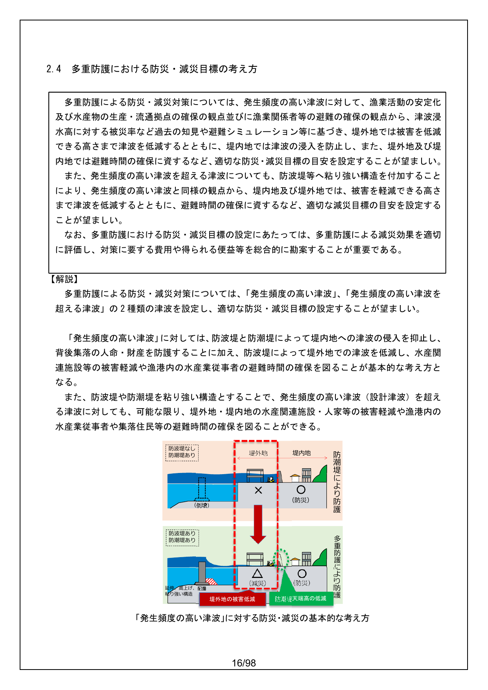

「発生頻度の高い津波」に対する防災・減災の基本的な考え方

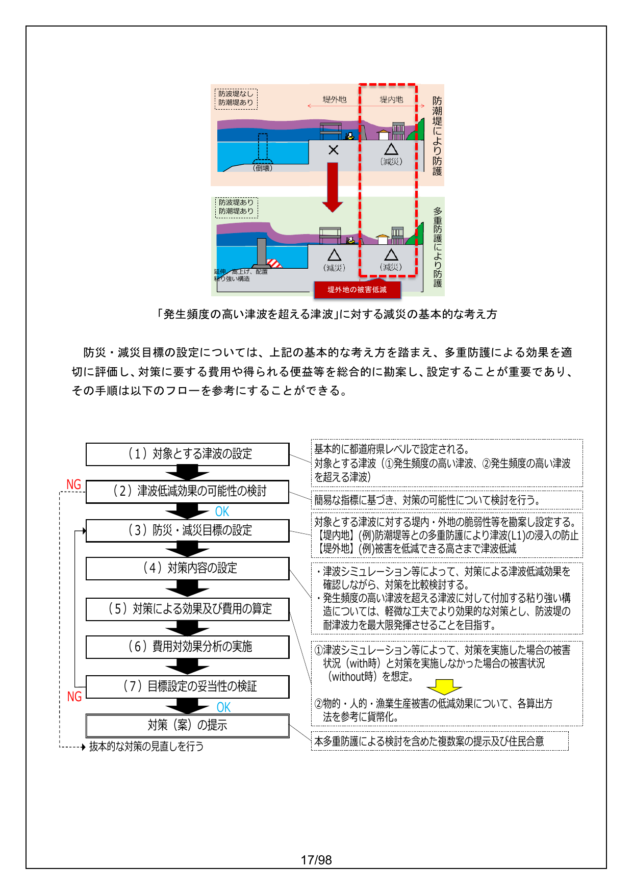

「発生頻度の高い津波を超える津波」に対する減災の基本的な考え方（上部）および防災・減災目標の設定フロー（下部）

防災・減災目標の設定については、上記の基本的な考え方を踏まえ、多重防護による効果を適切に評価し、対策に要する費用や得られる便益等を総合的に勘案し、設定することが重要であり、その手順は以下のフローを参考にすることができる。

1. **対象とする津波の設定** — 基本的に都道府県レベルで設定される。対象とする津波（(1)発生頻度の高い津波、(2)発生頻度の高い津波を超える津波）
2. **津波低減効果の可能性の検討** — 簡易な指標に基づき、対策の可能性について検討を行う。
3. **防災・減災目標の設定** — 対象とする津波に対する堤内・外地の脆弱性等を勘案し設定する。【堤内地】(例)防潮堤等との多重防護により津波(L1)の浸入の防止 【堤外地】(例)被害を低減できる高さまで津波低減
4. **対策内容の設定** — 津波シミュレーション等によって、対策による津波低減効果を確認しながら、対策を比較検討する。発生頻度の高い津波を超える津波に対して付加する粘り強い構造については、軽微な工夫でより効果的な対策とし、防波堤の耐津波力を最大限発揮させることを目指す。
5. **対策による効果及び費用の算定**
6. **費用対効果分析の実施** — (1)津波シミュレーション等によって、対策を実施した場合の被害状況（with時）と対策を実施しなかった場合の被害状況（without時）を想定。(2)物的・人的・漁業生産被害の低減効果について、各算出方法を参考に貨幣化。
7. **目標設定の妥当性の検証** — 本多重防護による検討を含めた複数案の提示及び住民合意

また、漁港漁村における具体的な目標設定については、漁港にある施設の中でも重要度の高い施設・場所を対象として、設定することが有効な方法と考えられる。

重要度の高い施設・場所としては、以下のものを挙げることができる。

1. 重要な施設（市場、種苗生産施設など）
2. 早期復旧に重要な施設
3. 来訪者が集まる場所　など

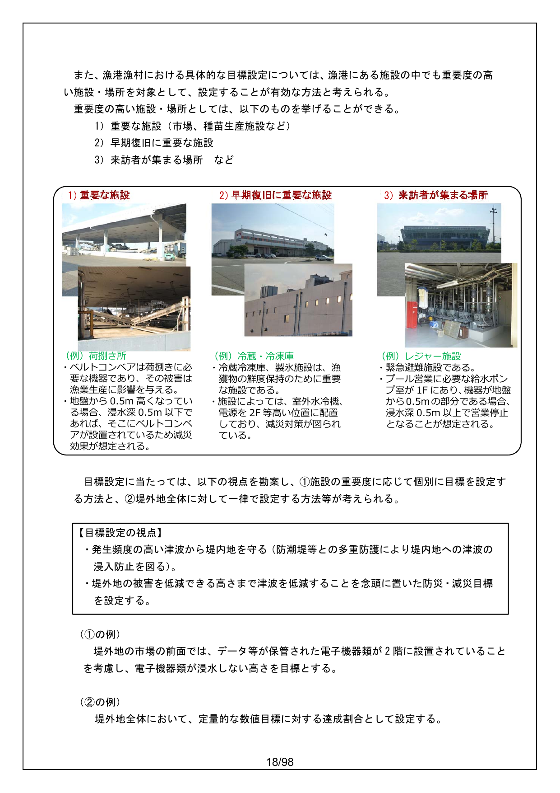

重要度の高い施設・場所の例

目標設定に当たっては、以下の視点を勘案し、(1)施設の重要度に応じて個別に目標を設定する方法と、(2)堤外地全体に対して一律で設定する方法等が考えられる。

> **【目標設定の視点】**
>
> - 発生頻度の高い津波から堤内地を守る（防潮堤等との多重防護により堤内地への津波の浸入防止を図る）。
> - 堤外地の被害を低減できる高さまで津波を低減することを念頭に置いた防災・減災目標を設定する。

**(1)の例）**

堤外地の市場の前面では、データ等が保管された電子機器類が2階に設置されていることを考慮し、電子機器類が浸水しない高さを目標とする。

**(2)の例）**

堤外地全体において、定量的な数値目標に対する達成割合として設定する。

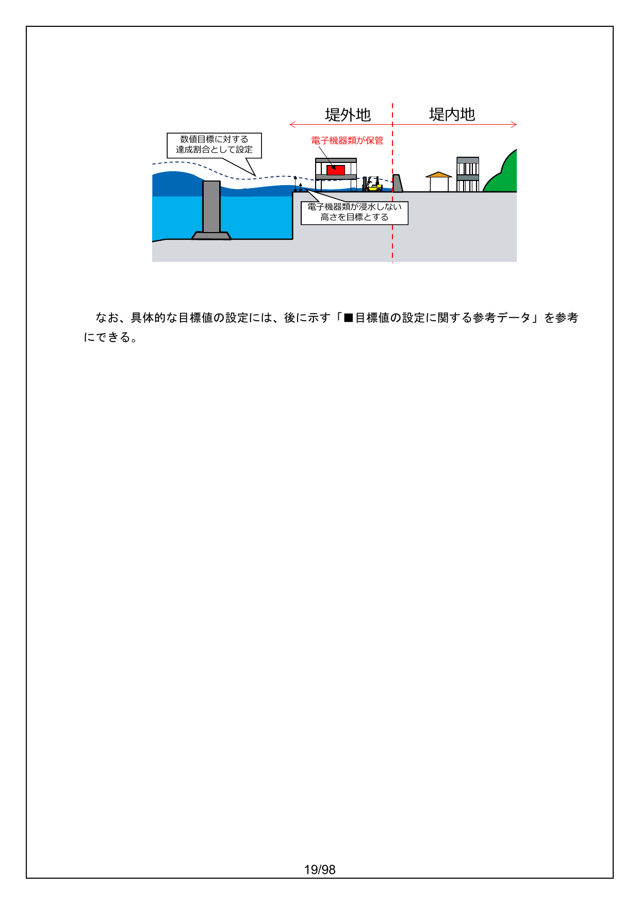

目標設定のイメージ

なお、具体的な目標値の設定には、後に示す「■目標値の設定に関する参考データ」を参考にできる。

---

また、水産基盤整備事業では、防波堤による津波低減効果によって、漁港漁村における水産業関係者や住民の避難に対しても効果が得られる場合があるので、その際には、下表で示す「多重防護による人的被害の範囲と必要となる避難施設の考え方」を参考にして、必要な避難対策を検討することが望ましい。

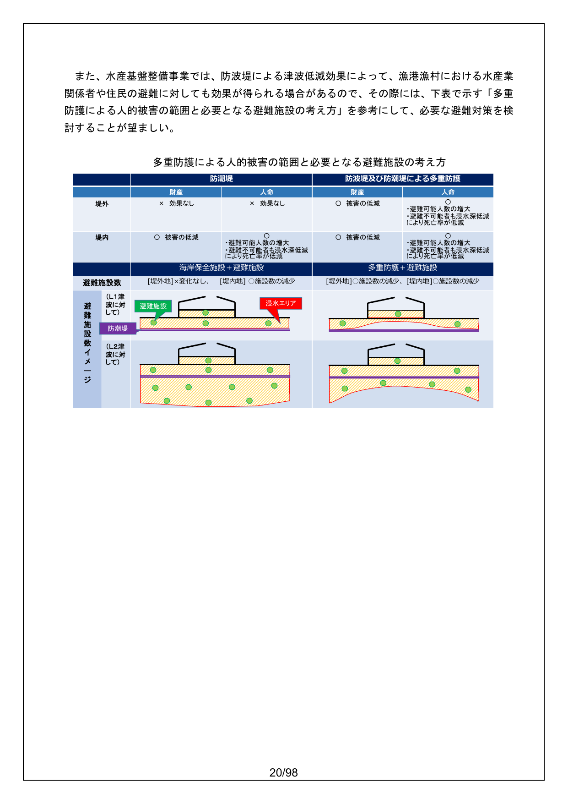

多重防護による人的被害の範囲と必要となる避難施設の考え方

#### ■目標値の設定に関する参考データ

- 東日本大震災による被災現況調査結果（第1次報告）によると「浸水深2m」を境に、被害状況に大きな差があり、浸水深2m以下の場合には建物が全壊となる割合は大幅に低下する傾向にあることが確認されたことから、津波浸水深「2m超」を市街地（集落）の壊滅的な被害をもたらす目安として設定している（図1）。
- 内閣府が設定した浸水深別の死者率関数によると、津波に巻き込まれた場合、津波浸水深「30cm超」を死亡者が発生する目安として設定している（図2）。
- 「津波強度と被害程度の関係（首藤）」では、津波高「2m超」を木造家屋が全面破壊する目安としている（図3）。
- 上記の既往実績を参考に、目標の目安を設定してもよい。
- また、津波浸水深ごとの建物被害率（中央防災会議）を参考に、目標の目安を設定してもよい（図4）。
- その他、堤外地における避難可能人数等の減災効果により目安を設定しても良い。

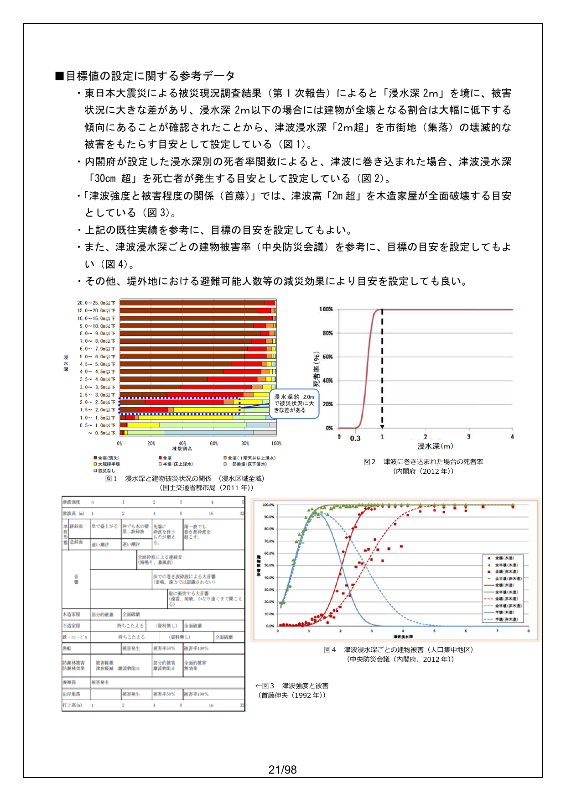

目標値の設定に関する参考データ（図1〜図4）

### 2.5 多重防護の具体的な対策

#### （1）多重防護による津波低減効果の発現特性

> 多重防護による津波低減効果の発現特性については、東日本大震災の事例を含めた既往の津波実績から、以下の傾向が見られる。
>
> 1. 津波低減効果は、漁港への津波の流入量と漁港の泊地の広さ等に大きく影響を受ける。
> 2. 漁港への津波の流入量は、来襲津波に対する防波堤等による平面遮蔽性（港口の狭さなど）、鉛直遮蔽性（防波堤の天端の高さや設置水深の深さ）が高いほど、低減される傾向がある。
> 3. 来襲する津波の周期にも大きく影響され、津波の周期が短いほど、低減される傾向がある。津波の片周期が10分以下であると、防波堤等による津波低減効果は大きくなる。
> 4. 防波堤背後の泊地面積が広いほど、津波低減効果が高くなる傾向がある。
> 5. 漁港背後の陸域では、漁港施設有りの場合、流速が全体的に減少する傾向がある。
> 6. 小規模な漁港においては、減災効果は得られにくい傾向がある。
>
> このように、防波堤による津波低減効果は、来襲する津波周期、高さ、漁港の形状、規模、位置する地形等によって発現特性が異なるため、津波シミュレーションや水理模型実験等による詳細な検討に先立って、既往の津波に基づいて検討された指標を用いた簡便な手法によって、津波低減効果の可能性を検討することが望ましい。
>
> また、既往の津波に基づいて検討された指標を用いた簡便な手法の詳細について今後とも調査・検討を行う必要がある。

#### 【解説】

防波堤等の漁港施設による津波低減効果については、以下に示す簡便な手法を活用することによって、津波低減の可能性を検討することができる。

- **手法1**：港内面積と開口部断面積比による効果把握
- **手法2**：津波水位と平均天端高比による効果把握
- **手法3**：流入量比による効果把握
- **手法4**：流入量比と開口比による効果把握

なお、これらの手法は、既存漁港による津波低減の可能性の検討に活用が可能であることはもとより、新たに防波堤等を整備（延伸）し、大きく港形を変えた場合や部分的に開口部を狭くした場合、さらには既存防波堤の天端高を高くした場合による津波低減の可能性の検討にも役立つものである。

---

**手法1：港内面積と開口部断面積比による効果把握**（明田ら（1994）より）

日本海中部地震、北海道南西沖地震の実績（明田ら（1994））を踏まえて、港内面積と開口部断面積比（下図）より漁港施設の効果を把握する。

**【傾向】**
- 港内面積が大きく、港口断面積が小さいほど効果がある。
- 港口断面積に対し港内面積が小さい港では、津波を増大させる場合がある。
- 小規模な港では、外郭施設による津波低減効果は期待できない。

**【留意点】**
- 港内面積と開口部断面積比が200未満のときに、効果の有無が判断し難い。

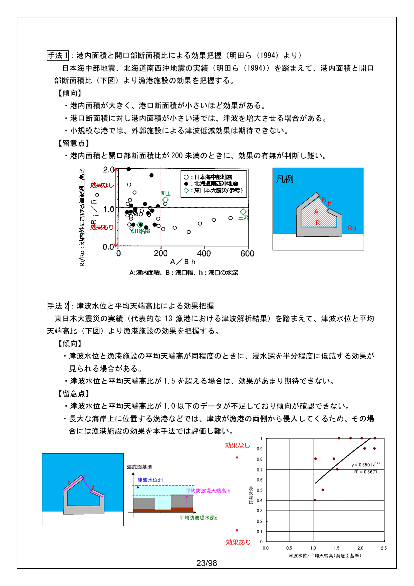

手法1：港内面積と開口部断面積比による効果把握（上部）および手法2：津波水位と平均天端高比による効果把握（下部）

---

**手法2：津波水位と平均天端高比による効果把握**

東日本大震災の実績（代表的な13漁港における津波解析結果）を踏まえて、津波水位と平均天端高比（下図）より漁港施設の効果を把握する。

**【傾向】**
- 津波水位と漁港施設の平均天端高が同程度のときに、浸水深を半分程度に低減する効果が見られる場合がある。
- 津波水位と平均天端高比が1.5を超える場合は、効果があまり期待できない。

**【留意点】**
- 津波水位と平均天端高比が1.0以下のデータが不足しており傾向が確認できない。
- 長大な海岸上に位置する漁港などでは、津波が漁港の両側から侵入してくるため、その場合には漁港施設の効果を本手法では評価し難い。

---

**手法3：流入量比による効果把握**

東日本大震災の実績（代表的な13漁港における津波解析結果）を踏まえて、漁港施設が有る場合と無い場合の流入量比（下式・下図）より漁港施設の効果を把握する。

**【傾向】**
- 流入量比が小さいと、浸水深比も小さくなり、津波低減効果が見られる傾向がある。

**【留意点】**
- 長大な海岸上に位置する漁港などでは、津波が漁港の両側から侵入してくるため、その場合には漁港施設の効果を本手法では評価し難い。
- 当該手法を用いると、津波低減効果を過大に評価する傾向がある。

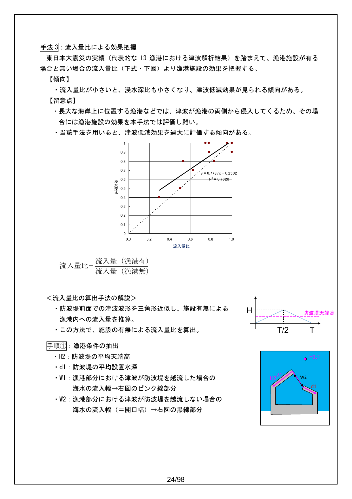

手法3：流入量比による効果把握および流入量比の算出手法

$$
\text{流入量比} = \frac{\text{流入量（漁港有）}}{\text{流入量（漁港無）}}
$$

**＜流入量比の算出手法の解説＞**

- 防波堤前面での津波波形を三角形近似し、施設有無による漁港内への流入量を推算。
- この方法で、施設の有無による流入量比を算出。

**手順(1)：漁港条件の抽出**
- H2：防波堤の平均天端高
- d1：防波堤の平均設置水深
- W1：漁港部分における津波が防波堤を越流した場合の海水の流入幅
- W2：漁港部分における津波が防波堤を越流しない場合の海水の流入幅（＝開口幅）

**手順(2)：津波外力の設定**
- 抽出水深 d2：既往の検討結果より設定。
- 前面津波高 H1：抽出水深が沖合であれば、グリーンの法則によって施設前面での津波高を算出。
- 津波周期 T（片周期）：既往の検討結果より設定。

**手順(3)：漁港への流入量を推算**

$$
Q1 = \int_0^T (H(t) + d1) \times H(t) \times \sqrt{g / (H(t) + d1)} \times (W1 \text{またはW2}) \, dt
$$

$$
Q2 = \int_0^T 0.35 \times (H(t) - H2) \sqrt{2g(H(t) - H2)} \times (W1 - W2) \, dt
$$

（本間の越流公式，完全越流）

---

**手法4：流入量比と開口比による効果把握**

手法2、手法3で用いた津波水位/平均天端や流入量比を含めた5つのパラメーター（流入量比、通過断面積比、津波水位/平均天端、開口比、湾の奥行/湾の幅）について、東日本大震災の実績（代表的な13漁港における津波解析結果）を基に多変量解析（重回帰分析）を実施した。（詳細については、「■ 5つのパラメーターによる多変量解析結果」を参照）

その結果、**流入量比**と**開口比**が津波シミュレーションから得られる浸水深比との相関の高いことが確認でき、流入量比（A）と開口比（D）の2つのパラメーターを用いた次式によって、より適切に津波減災効果指標となる浸水深比を把握することができる。

> 浸水深比＝0.923A－0.202D＋0.249
>
> なお、上式は、回帰統計上、重相関係数 R＝0.942、決定係数 R²＝0.887である。

ここで、多変量解析を実施した5つのパラメーターについて説明する。

**A：流入量比**

漁港施設が有る場合と無い場合の流入量の比である。前述の手法3を参照とする。

**B：通過面積比**

漁港施設が有る場合と無い場合の水塊の面積比であり、下図のとおりである。

**C：津波水位/平均天端**

来襲する津波水位と漁港施設の平均天端高との比である。前述の手法2を参照とする。

**D：開口比（W1/W2）**

漁港の港口幅（W2）と、漁港に対して津波が侵入（流入）する部分の幅（W1）との比であり、右図のとおりである。

**E：湾の奥行/奥の幅（L1/L2）**

湾の奥行（L1）と、湾の幅（L2）との比であり、右図のとおりである。

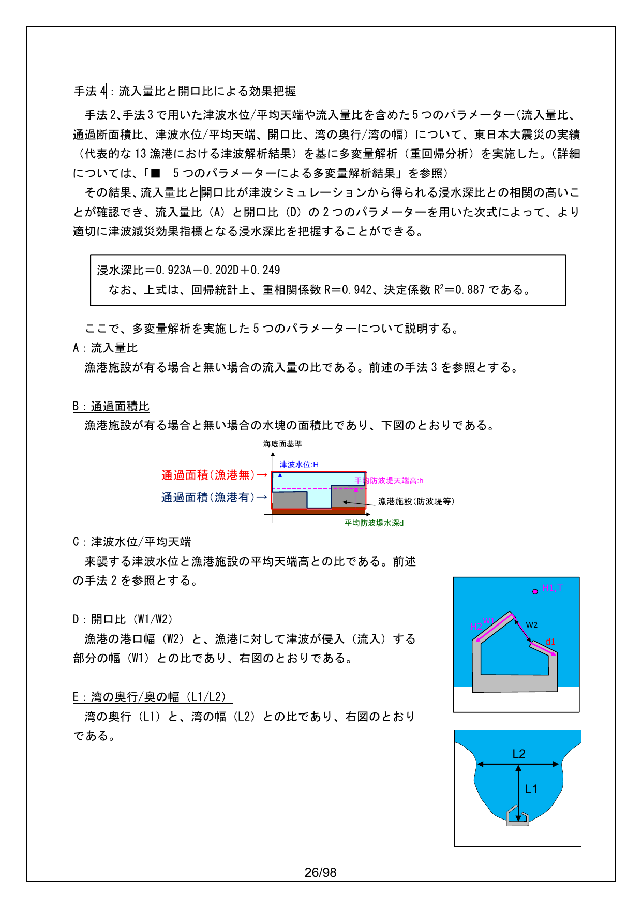

各パラメーターの概念図

#### ■ 5つのパラメーターによる多変量解析結果

| | 係数 | 標準誤差 | t | P-値 |
|:---|:---:|:---:|:---:|:---:|
| 切片 | 0.018 | 0.139 | 0.132 | 0.899 |
| A：流入量比 | 1.192 | 0.241 | 4.947 | 0.003 |
| B：通過面積比 | 0.347 | 0.228 | 1.521 | 0.179 |
| C：津波水位/平均天端 | −0.080 | 0.043 | −1.864 | 0.112 |
| D：開口比（W1/W2） | −0.161 | 0.065 | −2.498 | 0.047 |
| E：湾の奥行/湾の幅（L1/L2） | −0.017 | 0.013 | −1.357 | 0.224 |

5つのパラメーターによる解析結果より、浸水深比との相関の高い（P-値が小さい）2項目（A, D）で再度、重回帰分析を実施。

| | 係数 | 標準誤差 | t | P-値 |
|:---|:---:|:---:|:---:|:---:|
| 切片 | 0.249 | 0.079 | 3.135 | 0.012 |
| A：流入量比 | 0.923 | 0.110 | 8.404 | 0.000 |
| D：開口比（W1/W2） | −0.202 | 0.058 | −3.507 | 0.007 |

**回帰式＝0.923A－0.202D＋0.249**

| 回帰統計 | |
|:---|:---:|
| 重相関 R | 0.942 |
| 重決定 R2 | 0.887 |
| 補正 R2 | 0.862 |
| 標準誤差 | 0.077 |
| 観測数 | 12 |

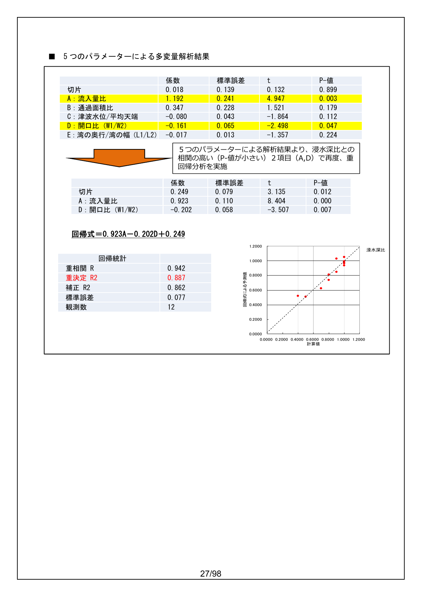

5つのパラメーターによる多変量解析結果

---

#### ■津波低減効果の算定手法と主な計算条件の設定

**1）津波低減効果の算定手法**

対策による効果の算定手法としては、津波シミュレーションや水理模型実験などがある。ここでは、津波シミュレーションによる津波低減効果の算定手法について述べる。

津波シミュレーションは、地震の断層モデルから計算された津波の発生プロセスを踏まえた初期水位のもとで、(1)外洋から沿岸への津波の伝播・到達、(2)沿岸から陸上への津波の遡上の一連の過程を連続して数値計算するものである。

津波シミュレーションは、海底での摩擦及び移流項を考慮した非線形長波理論（浅水理論）によることを基本とする。なお、シミュレーションに際しては、多重防護による津波低減の現象を適切に算定できるような条件設定を行うことが重要である。

津波浸水想定の設定の手引き（平成24年10月）では、主な計算条件の設定について次表の通り定めている。

**主な計算条件の設定**

| 計算条件 | 内容 |
|:---|:---|
| 津波の初期水位（断層モデル） | 津波の初期水位は、地震の断層モデルによって計算される海底基盤の鉛直変位分布（隆起や沈降）を海面に与える方法を用いることを基本とする。津波の初期水位を与える断層モデルは、中央防災会議や地震調査研究推進本部等の公的な機関が妥当性を検証したものとして発表している断層モデルがあればこれも参考にして設定することができる。 |
| 潮位（天文潮） | 津波浸水想定を設定するための津波シミュレーションにおける潮位（天文潮）は、朔望平均満潮位とすることを基本とする。 |
| 計算領域及び計算格子間隔※ | 津波シミュレーションの計算領域および計算格子間隔は、波源域の大きさ、津波の空間波形、海底・海岸地形の特徴、対象地区周辺の微地形、構造物等を考慮して、津波の挙動を精度良く推計できるよう適切に設定するものとする。 |
| 地形データ作成 | 海域や陸域の地形は津波の伝播や遡上に大きく影響を与えるため、こうした津波の挙動を予測するためには、地形に関する情報が不可欠であり、津波シミュレーションにおいても、格子状の数値情報からなる地形データを用いる。 |
| 粗度係数 | 津波が沿岸域に到達し、陸域に遡上する場合には、海底や地面による抵抗が無視できなくなるため、津波シミュレーションにおいて、粗度係数を用いて考慮することを基本とする。 |
| 地震による地盤変動 | 地震による陸域や海域の沈降が想定される場合、断層モデルから算出される沈降量を陸域や海域の地形データの高さから差し引くことを基本とする。地震による陸域の隆起が想定される場合には、断層モデルから算出される隆起量を考慮しない。一方、海域の隆起が想定される場合には、断層モデルから算出される隆起量を考慮することを基本とする。 |
| 計算時間及び計算時間間隔 | 津波シミュレーションの計算時間は、津波の特性等を考慮して、最大の浸水の区域及び水深が得られるように設定するものとする。津波シミュレーションの計算時間間隔は、計算の安定性等を考慮して適切に設定するものとする。 |

※ 多重防護による津波低減の現象を適切に算定するため、漁港周辺の計算格子間隔を小さくして（例えば5m格子）対策の内容（漁港施設の改良等）をシミュレーションで再現することが望ましい。

#### （2）多重防護の具体的な対策

> 多重防護の対策は、上記の津波低減効果の発現特性を十分に勘案した上で、検討することが重要である。
>
> 対策の実施にあたっては、来襲する津波の特性（方向、周期）や漁港の位置する地形、規模及び形状等によって、防波堤による津波低減効果が大きく変化することを踏まえ、津波シミュレーション等によってその効果の程度を確認し、対策を検討することが重要である。
>
> 具体的な対策としては、沖防波堤や港口部の水門の整備、防波堤の新設・延伸及び嵩上げなどに加え、防波堤や防潮堤への粘り強い構造の付加などの対策が考えられる。
>
> なお、防波堤の整備等によって、新たに津波が収斂する場所が発生する場合があること、水域の閉鎖性が強くなり水質環境の悪化させる場合があることに留意することが必要である。

#### 【解説】

多重防護の対策イメージは次のようなものが考えられる。

1. 防波堤の整備
2. 波堤の新設・延伸及び嵩上げ
3. 防波堤や防潮堤への粘り強い構造の付加
4. 港口部の水門の整備

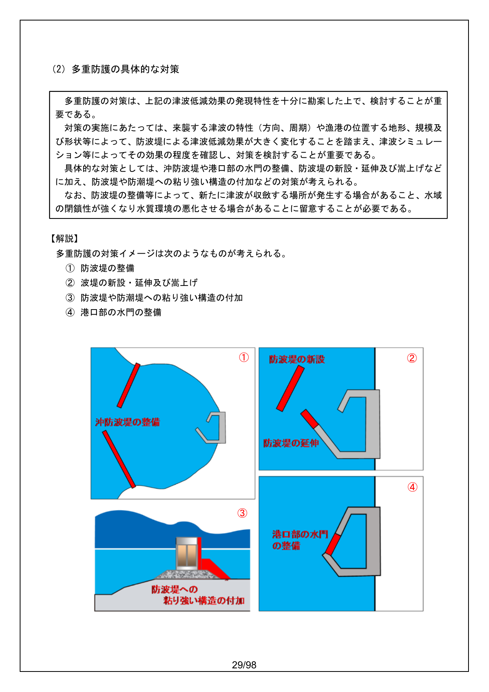

多重防護の対策イメージ

