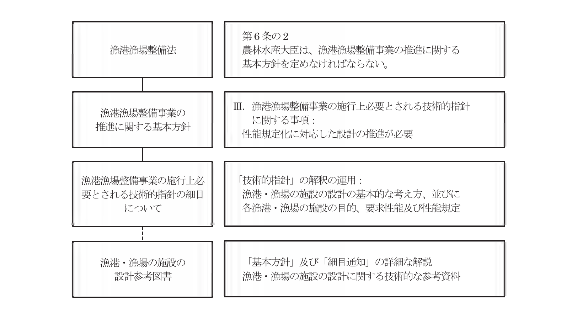
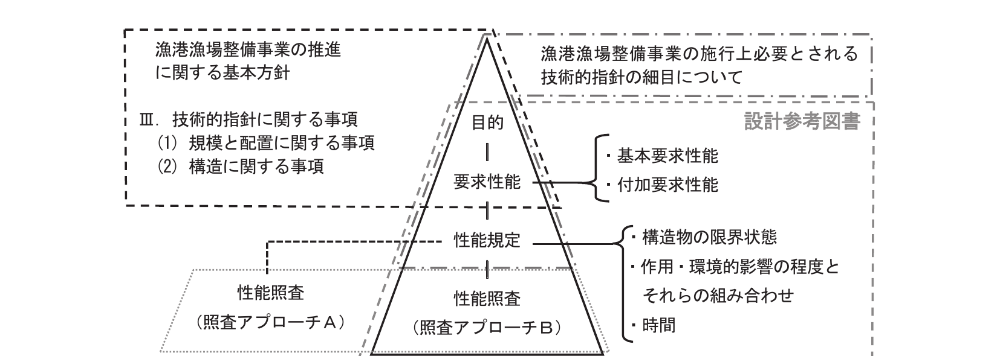

# 第1編 総論

## 第1章 目的

「漁港・漁場の施設の設計参考図書」は、「漁港漁場整備法」第6条の2の規定により定められた「漁港漁場整備事業の施行上必要とされる技術的指針に関する事項」及びその細目を定めた「漁港漁場整備事業の施行上必要とされる技術的指針の細目について」（水産庁長官通知）の理解を助け、的確かつ効率的な設計実務を可能にする技術的な参考図書として、漁港・漁場の施設の効率的・効果的な整備に資することを目的とする。

### 1.1 本書の主旨

「漁港漁場整備法」第6条の2の規定により、農林水産大臣が定めた「漁港漁場整備事業の推進に関する基本方針」（以下「基本方針」と記す。）のうち「III. 漁港漁場整備事業の施行上必要とされる技術的指針に関する事項」では、「漁港・漁場の施設などの設計における合理性、客観性及び説明責任の確保が求められており、それぞれの漁港・漁場の施設などの目的・機能に応じ、その目的の達成や機能の確保のために施設に備わるべき能力である「性能」を明確にし、性能規定による設計を推進することが必要である。」としている。

これを受けて、「漁港漁場整備事業の施行上必要とされる技術的指針の細目について」（以下「細目通知」と記す。）では、性能規定化に対応した漁港・漁場の施設の設計の基本的な考え方を明らかにするとともに、漁港・漁場の施設に備わるべき性能とその照査について、最低限の要件を示している。

この「漁港・漁場の施設の設計参考図書」（以下、「本書」と記す。）は、これらの「基本方針」及び「細目通知」を解説するとともに、漁港・漁場の施設の設計において参考となる技術的な知見を記載したものである。

なお、漁港・漁場の施設の性能規定を検討するにあたり、設計体系の基礎とした「包括設計コード（案）」（以下「包括設計コード」と記す。）では、設計者が性能照査の手法を広く選択できるように枠組みを体系化するように求めている。

「本書」でも、この考え方を踏まえ、漁港・漁場の施設の作用に対する安全性について標準的な考え方を示すとともに、それらを利用する人々の様々な要請に対応した機能についても留意し、設計者の柔軟な発想による創意工夫が図られるよう配慮している。

すなわち、個々の漁港・漁場の施設の設計にあたっては、「本書」に示す事項のみでは必ずしも十分でない場合がある他、今後の技術開発などにより新しい設計手法が開発される可能性もある。したがって、「本書」に記述のない事項及び新技術の適用にあたっては、「細目通知」を踏まえ、個々の要求性能に対して合致していること、技術的に妥当性があることを確認した上で、適切な方法を採用することができる。

一方で、既存の設計技術の多くを新しい手法に換えることは、設計業務などに不必要な混乱を招くとともに、技術的にも困難な作業を要するものである。「本書」では、現時点で技術的な問題となっている幾つかの事項についてのみ、その解決策を新たな手法として取り込み、その他の手法については、既存の設計技術を性能設計の枠組みに編入することとした。

このように「本書」は、既存の設計技術を生かしつつ、新しい技術も柔軟に取り込む姿勢を盛り込むことで、漁港・漁場の施設の効率的かつ効果的な整備に資するよう編集されている。

「本書」における漁港・漁場の施設の設計に係る法令に関係する体系は、図 1-1-1 に示すとおりである。

図 1-1-1 漁港・漁場の施設の設計に係る法令に関係する体系

### 1.2 本書における規定の分類

「本書」においては、表 1-1-1 に示すように性能記述の取り扱いに応じて文末の記載を3種類に分類している。

表 1-1-1 性能記述の取り扱いと文末記載

| 分類 | 性能記述の取り扱い | 文末の記載例 |
|------|--------------|----------|
| 分類1 | 明確な根拠に基づく規定、あるいは規格や取り扱いの統一性に鑑みた規定で、明確な反論がない限り従うべき方法。 | 「〜とする。」「〜でなければならない。」「〜とするものとする。」「〜とおりとする。」 |
| 分類2 | いくつかの代替的な方法の中で、最も推奨される方法。（特に問題がない限り従うべき規定） | 「〜を原則（標準）とする。」「〜とするのがよい。」「〜であることが望ましい。」 |
| 分類3 | 複数の代替的な方法、あるいは便宜的な簡便法。 | 「〜としてもよい。」「〜とすることができる。」 |

分類1は、原則として設計条件、材料及び諸係数、基礎、並びに漁港・漁場の施設の目的、要求性能及び性能規定として枠囲いに記述（「細目通知」において規定されたもの等）している。設計者は、原則として、これらの規定に従って性能照査を行わなければならない。

分類2及び分類3は、主に解説に用いており、設計者は、これらの手法に従うことで予め定められた要求性能を満足していることを照査できるとともに、この記述においては、「本書」に記載していない性能照査手法などを適用することを制限していない。

なお、解説であっても、性能照査手法などにおける一連のプロセスで必要不可欠な手順（設計・解析の理論上、必要なもの）については、分類1と同様の文末形式が用いられているものがある。

## 第2章 適用範囲

「漁港・漁場の施設の設計参考図書」は、対象となる漁港・漁場の施設の建設、改良及び維持・補修にあたって適用するものとする。

### 2.1 対象施設

「本書」の対象施設は、以下のとおりとする。

1. 漁港漁場整備法第3条に掲げる漁港施設のうち、水産基盤整備事業により整備される漁港施設及びその他の漁港漁場関連事業において整備される漁港の施設等
2. 漁港漁場整備法第4条第1項第2号の事業により整備される漁場の施設

漁港の施設は、表 1-2-1 に示すように基本施設と機能施設に区分されている。このうち、「本書」で対象としている施設は、基本施設の全てと機能施設の一部（輸送施設、漁港施設用地、荷さばき所、漁港浄化施設及び漁港環境整備施設）である。

また、その他の漁港の施設については、表 1-2-2 に示すとおり、防風施設及び漁業集落環境整備施設がある。

漁場の施設については、漁港漁場整備法第4条第1項第2号において、「優れた漁場として形成されるべき相当規模の水面において行う魚礁の設置、水産動植物の増殖場及び養殖場の造成その他水産動植物の増殖及び養殖を推進するための事業、並びに漁場としての効用の低下している水面におけるその効用を回復するためのたい積物の除去その他漁場の保全のための事業」として示されている魚礁、増殖場、養殖場及び漁場環境保全施設で、「本書」で対象としている施設は表 1-2-3 に示すとおりである。

表 1-2-1 漁港の施設と「本書」対象施設

| 分類 | | 漁港漁場整備法に記載された漁港の施設 | 「本書」対象施設 |
|------|------|------|:------:|
| 基本施設 | 外郭施設 | 防波堤、防砂堤、防潮堤、導流堤、水門、閘門、護岸、堤防、突堤及び胸壁 | ○ |
| | 係留施設 | 岸壁、物揚場、係船浮標、係船くい、桟橋、浮桟橋及び船揚場 | ○ |
| | 水域施設 | 航路及び泊地 | ○ |
| | 輸送施設 | 鉄道、道路、駐車場、橋、運河及びヘリポート | ○ |
| | 航行補助施設 | 航路標識並びに漁船の入出港のための信号施設及び照明施設 | |
| | 漁港施設用地 | 各種漁港施設の敷地※ | ○ |
| | 漁船漁具保全施設 | 漁船保管施設、漁船修理場及び漁具保修理施設 | |
| | 補給施設 | 漁船のための給水、給氷、給油及び給電施設 | |
| | 増殖及び養殖用施設 | 水産種苗生産施設、養殖用飼料保管調製施設、養殖用作業施設及び廃棄物処理施設 | |
| 機能施設 | 漁獲物の処理、保蔵及び加工施設 | 荷さばき所、荷役機械、蓄養施設、水産倉庫、野積場、製氷、冷凍及び冷蔵施設並びに加工場 | ○（荷さばき所に限る） |
| | 漁業用通信施設 | 陸上無線電信、陸上無線電話及び気象信号所 | |
| | 漁港厚生施設 | 漁港関係者の宿泊所、浴場、診療所その他の福利厚生施設 | |
| | 漁港管理施設 | 管理事務所、漁港管理用資材倉庫、船舶保管施設その他の漁港の管理のための施設 | |
| | 漁港浄化施設 | 公害の防止のための導水施設その他の浄化施設 | ○ |
| | 廃油処理施設 | 漁船内において生じた廃油の処理のための施設 | |
| | 廃船処理施設 | 漁船の破砕その他の処理のための施設 | |
| | 漁港環境整備施設 | 広場、植栽、休憩所その他の漁港の環境の整備のための施設 | ○ |

※各種漁港施設の敷地には、「人工地盤」が含まれる。

表 1-2-2 その他の漁港の施設と「本書」対象施設

| 分類 | その他の漁港漁場関連事業※において整備されるその他の漁港の施設等 | 「本書」対象施設 |
|------|------|:------:|
| 防風施設 | 防風施設 | ○ |
| 漁業集落環境整備施設 | 漁業集落道、水産飲料用水施設、漁業集落排水施設 | ○ |

※農山漁村地域整備交付金のうち、漁港漁村環境整備事業（漁業集落環境整備事業）等による。

表 1-2-3 漁場の施設と「本書」対象施設

| 分類 | | 漁港漁場整備法第4条第1項第2号の事業※により整備される漁場の施設 | 「本書」対象施設 |
|------|------|------|:------:|
| 漁場の施設 | 魚礁 | 沈設魚礁、浮魚礁 | ○ |
| | 増殖場 | 着定基質、消波施設、防氷堤、海水交流施設、中間育成施設、湧昇流発生構造物、循環流発生構造物、藻留施設 | ○ |
| | 養殖場 | 消波施設、防氷堤、海水交流施設、区画施設 | ○ |
| | 漁場環境保全施設 | 覆砂、しゅんせつ、耕うん、堆積物の除去、海水交流施設の設置、着定基質の設置、藻場・干潟の造成 | ○ |

※水産基盤整備事業のうち、水産環境整備事業による。

### 2.2 用語

#### 【性能設計体系に関する用語】

- **目的**: 漁港・漁場の施設を設置する理由について、事業者又は利用者（供用者）の観点から記述したものをいう。
- **要求性能**: 漁港・漁場の施設が目的を達成するために必要とされる性能をいう。
- **性能規定**: 性能照査を行えるよう、要求性能を具体的に記述したものをいう。
- **性能照査**: 漁港・漁場の施設が性能規定を満足していることを確認する行為をいう。

#### 【要求性能に関する用語】

- **基本要求性能**: 漁港・漁場の施設の設計において、設計対象施設が目的を達成するために不可欠な性能をいう。
- **利用性**: 漁港の施設の供用性及び利便性、並びに漁場の施設の蝟集性及び増殖性等の観点から設計対象施設が保有すべき性能をいう。
- **構造物の安全性**: 設計供用期間中に想定される作用によって生じる構造物の損傷等が、設計対象施設の機能を維持すること等に重大な影響を及ぼさない性能をいう。
- **付加要求性能**: 漁港・漁場の施設の設計において考慮することで、設計対象施設の付加価値を増加させる性能をいう。
- **維持管理性**: 供用期間中に生じる劣化損傷に対して行う点検・診断及び補修等により、設計対象施設に必要な機能を継続して確保できる性能をいう。
- **環境性**: 漁港・漁場の施設の設置箇所や周辺地域の経済的・社会的条件、自然環境、漁場環境及び生活環境に及ぼす影響又は効果に関する性能をいう。

#### 【性能規定に関する用語】

- **設計供用期間**: 漁港・漁場の施設の設計において、設計対象施設が要求性能を満足し続けることを想定する期間をいう。
- **再現期間**: 変動作用等の値を評価するための期間であり、想定した作用の値を上回る値が出現する平均的な年数をいう。
- **構造物の重要度**: 構造物を設置することにより生じる水産物の生産及び流通等に関する利益又は効果、防災上の必要性、建設費用、代替施設の有無などから設定される重要性の程度をいう。

#### 【作用に関する用語】

- **作用**: 構造物又は部材の性能照査において、力学的に取り扱われる力及び荷重、又はそれらを生起させ、若しくは影響を及ぼす全ての要因をいう。
- **永続作用**: 設計供用期間中、構造物又は部材に永続的に働く作用（自重、土圧、鋼材の腐食、生物の付着等）をいう。
- **変動作用**: 設計供用期間中、構造物又は部材に対して時間的変化をもって働く作用（波力、水圧、漁船のけん引力又は接岸力、レベル1地震動、流体力等）をいう。
- **偶発作用**: 設計供用期間中に生じる可能性は低いものの、一度生じると構造物又は部材に重大な影響を及ぼすと考えられる作用（津波、レベル2地震動、漁船の衝突、火災等）をいう。
- **設計状況**: 性能規定及び性能照査で想定する作用の組み合わせ等を明示するための物理的条件をいう。
- **設計波**: 漁港・漁場の施設を設置する箇所において発生すると想定される波のうち、設計対象施設の設計供用期間中に発生する可能性の高いものをいう。
- **設計津波**: 漁港・漁場の施設を設置する箇所において発生すると想定される津波のうち、設計対象施設の設計供用期間中に発生する可能性が低く、かつ設計対象施設に大きな影響を及ぼすものをいう。
- **レベル1地震動**: 漁港・漁場の施設を設置する箇所において発生すると想定される地震動のうち、設計対象施設の設計供用期間中に発生する可能性が高いものをいう。
- **レベル2地震動**: 漁港・漁場の施設を設置する箇所において発生すると想定される地震動のうち、最大規模の強さを有するものをいう。

#### 【その他の用語】

- **耐震強化岸壁**: 大規模な地震等の発生時に、被災直後の緊急物資や避難者の海上輸送等を考慮し、特に通常の岸壁よりも耐震性能を強化した岸壁をいう。
- **粘り強い構造**: 設計津波を超える規模の津波に対して被害を受けたとしても、可能な限り全壊しにくい、若しくは全壊に至るまでの時間を少しでも長く延ばすことができる、又は災害後に施設の早期復旧が可能となる構造上の工夫をいう。

## 第3章 単位系

漁港・漁場の施設の設計にあたっては、国際単位系を使用することを基本とする。

我が国の土木・建築の設計・施工の各段階で用いられる単位は、平成11年4月1日より国際単位系（SI: Système International d'Unités）を用いることを基本としていることから、「本書」においても国際単位系を使用する。

## 第4章 漁港・漁場の施設の設計

### 4.1 性能設計の導入

「基本方針」では、「施設の性能規定化により必要とされる性能を明示するとともに、規模、配置及び構造に関する事項について、より的確で合理性の高い照査方法の確立に努めていく」としており、「細目通知」では、それぞれの漁港・漁場の施設などの目的・機能に応じ、性能照査に必要となる性能規定などが記述されている。

性能規定を検討するにあたっては、土木学会が定めた「包括設計コード」を基礎とする性能記述の階層を構築することで、それぞれの漁港・漁場の施設の目的、要求性能及び性能規定の明確化を図っている。

「包括設計コード」は、法的な強制力はないものの、我が国の設計コード体系の基礎となるよう、また海外に対する我が国の構造物設計体系の説明性と透明性の向上、さらに次世代の技術者へ分かりやすい技術の継承に寄与することが大切であるとして土木学会によって定められたものである。

このような状況から、漁港・漁場の施設の設計にあたっても、「包括設計コード」を基礎としつつ、「土木・建築にかかる設計の基本」なども参照しながら、性能規定による設計体系（性能記述の階層）を構築することとしたものである。

### 4.2 性能記述の階層

漁港・漁場の施設の性能記述に関する階層は、図 1-4-1 に示すように目的、要求性能、性能規定及び性能照査で構成されている。

図 1-4-1 漁港・漁場の施設の性能記述の階層と性能照査

「基本方針」では、表 1-2-1 及び表 1-2-3 の分類に示された漁港・漁場の施設について、規模と配置及び構造に関する記述があり、これが各施設の目的、要求性能及び性能規定となっている。

さらに、「細目通知」では、施設区分や構造形式を細分化した目的、要求性能及び性能規定が示されている。

漁港・漁場の施設の設計にあたっては、設計対象施設の目的を明確にした上で、その目的を達成するために必要な要求性能を設定し、性能照査ができるように具体的に構造物の限界状態、作用・環境的影響の程度とそれらの組み合わせ及び時間などを性能規定として明示しなければならない。

性能照査は、この性能規定の内容に応じて行われることとなる。

また、性能照査には、「本書」において標準とする「照査アプローチB」とそれ以外の手法による「照査アプローチA」があり、これらを設計者が自由に選択できるように並列して位置づけている。

#### 4.2.1 目的

「目的」とは「漁港・漁場の施設を設置する理由について、事業者又は利用者（供用者）の観点から記述したもの」であり、「細目通知」において、表 1-2-1〜表 1-2-3 の分類に示された施設区分に対して規定している。

目的は、その施設を設置する理由であると同時に、要求性能を導き出す根拠として最も重要な項目として、性能記述の階層では最上位に位置している。この目的を根拠に、施設に必要とされる要求性能を定めていくこととなる。

#### 4.2.2 要求性能

「要求性能」とは「漁港・漁場の施設が目的を達成するために必要とされる性能」であり、「細目通知」において、表 1-2-1〜表 1-2-3 の分類に示された施設区分に対して規定している。

要求性能は、設計対象施設が目的を達成するために不可欠となる「基本要求性能」及び考慮することで施設の機能あるいは付加価値を増加させる「付加要求性能」に区分される。

##### (1) 基本要求性能

漁港・漁場の施設の設計においては、基本要求性能として「利用性」及び「構造物の安全性」を規定する。

**利用性**

利用性とは、「漁港の施設の供用性及び利便性、並びに漁場の施設の蝟集性及び増殖性等の観点から設計対象施設が保有すべき性能」であり、具体的には、設計対象施設が目的を達成するために以下のような事項について規定する。

- 施設利用に必要な規模を有し、かつ適切に配置されていること。
- 施設の供用に適した構造諸元（高さ、幅、長さ、水深、築造限界など）を有していること。
- 水域の静穏性や漁船の操船性が確保されていること。（主に漁港の施設）
- 流れ、水質・底質などの環境条件が所要の値を満足していること。（主に漁場の施設）
- 必要に応じて所要の付属設備や機能部材を有すること。

**構造物の安全性**

構造物の安全性とは、「設計供用期間中に想定される作用によって生じる構造物の損傷等が、設計対象施設の機能を維持すること等に重大な影響を及ぼさない性能」であり、具体的には、設計供用期間中に想定する設計状況に応じた使用限界又は修復限界を超えないよう、安全率又は許容値などを満たすべき照査項目について規定する。

**a) 構造物の限界状態**

限界状態には、終局限界状態、使用限界状態及び修復限界状態があり、表 1-4-1 に示すように要求性能としての安全性、使用性、修復性と関連づけて説明することができる。漁港・漁場の施設の設計においても、これらを同様に取り扱うことができる。

表 1-4-1 限界状態

| 限界状態 | 定義 |
|------|------|
| 終局限界状態（安全性） | 想定される作用により生ずることが予測される破壊や大変形等に対して、構造物の安定性が損なわれず、その内外の人命に対する安全性等を確保しうる限界の状態 |
| 使用限界状態（使用性） | 想定される作用により生ずることが予測される応答に対して、構造物の設置目的を達成するための機能が確保される限界の状態 |
| 修復限界状態（修復性） | 想定される作用により生ずることが予測される損傷に対して、適用可能な技術でかつ妥当な経費及び期間の範囲で修復を行えば、構造物の継続使用を可能とすることができる限界の状態 |

具体的な性能照査においては、性能規定ごとに適切な限界状態を設定することになる。

一般的な漁港・漁場の施設にあっては、原則として使用限界状態（使用性）を満足させることとし、耐震性能及び耐津波性能を強化する施設などの偶発作用（レベル2地震動及び設計津波など）に対してのみ修復限界状態（修復性）、又は終局限界状態（安全性）のいずれかを満足させるように性能照査を行う。

**b) 限界状態に対する語尾記載**

「本書」では、表 1-4-2 に示すように構造物の限界状態と要求性能を並列して整理し、これに対応した文末を記載することで区分している。

表 1-4-2 限界状態に対する要求性能の語尾記載の区分

| 限界状態 | 要求性能の語尾記載 |
|------|------|
| 使用限界（使用性） | 〜等の作用に対して、構造上安全なものとする。 |
| 修復限界（修復性） | （〜等の作用）によって構造物に発生する損傷が限定的なものにとどまり、軽微な補修により早期に機能が回復できるものとする。 |
| 終局限界（安全性） | （〜等の作用）によって構造物に発生する損傷が致命的なものに至らず、人命、財産等に影響を及ぼさないものとする。 |

##### (2) 付加要求性能

漁港・漁場の施設の設計においては、付加要求性能として、「維持管理性」、「環境性」、「施工性」及び「経済性」などを規定している。

「包括設計コード」では、付加的な性能として「構造物の付加価値を増加させるもの」としており、費用対効果分析などを検討することで、付加価値と事業費（コスト）のバランスについて検討することも重要としている。

**維持管理性**

維持管理性とは、「供用期間中に生じる劣化損傷に対して行う点検・診断及び補修等により、設計対象施設に必要な機能を継続して確保できる性能」であり、設計対象施設の設計供用期間中に想定される作用による劣化損傷に対して、技術的に可能で、かつ経済的に妥当な方法で補修・補強などを施すことにより、施設に求められる機能を維持し続けることができる性能である。

**環境性**

環境性とは、「漁港・漁場の施設の設置箇所や周辺地域の経済的・社会的条件、自然環境、漁場環境及び生活環境に及ぼす影響又は効果に関する性能」であり、設計対象施設を設置することによって、周辺に及ぼす影響に関して設定するものである。

**その他の付加要求性能**

その他の付加要求性能としては、施工性、経済性などがある。

- **施工性**: 地形、海象、水質、対象生物などの自然条件、設計対象施設の設置箇所や周辺地域の自然環境・漁場環境・生活環境などに鑑み、安全かつ円滑な工事が実施できる性能をいう。
- **経済性**: 狭義には、設計対象施設の建設に係る費用が妥当であることをいう。広義には、建設費用のほか、計画設計及び用地取得、補償に係る間接費用、また供用開始後の維持管理費（点検、補修等）を含めた総費用が妥当であることをいう。

#### 4.2.3 性能規定

「性能規定」とは「性能照査を行えるよう、要求性能を具体的に記述したもの」であり、設計状況、想定する作用の組み合わせ、照査項目とその指標を明示したものである。

##### (1) 利用性に関する性能規定

利用性に関する性能規定は、施設の配置や規模、構造的な諸元（高さ、水深、幅及び長さなど）、静穏度や漁場の環境条件などの照査項目とその指標（許容波高、目標環境条件など）について規定するものとする。

##### (2) 構造物の安全性に関する性能規定

構造物の安全性に関する性能規定は、施設の構造的な安定性に関して、照査項目とその指標（安全率や許容変位量など）について規定するものとする。

漁港・漁場の施設の性能照査においては、安全率法及び許容応力度法を照査アプローチBとしていることから、構造物の安全性に関する性能照査の指標は、安全率及び許容応力度を基本とするが、その他に矢板・杭構造や耐震性能の照査に適用する許容変位量などを用いることができる。

##### (3) 付加要求性能に関する性能規定

付加要求性能については、設計対象施設ごとに個別に規定するものとする。

#### 4.2.4 性能照査

##### (1) 性能照査手法

性能照査とは、漁港・漁場の施設が「性能規定を満足していることを確認する行為」である。

表 1-4-3 に漁港・漁場の施設の一般的な性能照査において考えられる標準的な照査方法を示す。これらは、確定的な照査手法として整理したものではなく、設計対象施設の構造形式や自然・利用及び社会条件などに鑑みて他の手法を用いることもあり得る。

表 1-4-3 漁港・漁場の施設の標準的な性能照査手法

| 要求性能 | 主たる照査項目 | 安全率法 | 許容応力度法 | 過去の経験に基づく方法 | 数値解析法 | 模型実験・現地試験 | 他の技術基準に基づく方法 |
|------|------|:------:|:------:|:------:|:------:|:------:|:------:|
| 利用性 | 規模・配置 | | ○ | ○ | ○ | ○ | ○ |
| | 構造物の諸元 | | ○ | ○ | ○ | ○ | ○ |
| 構造物の安全性 | 滑動・転倒 | ○ | | | | ○ | |
| | 施設の変位量 | | | | ○※ | ○ | |
| | 基礎の支持力 | ○ | | | | ○ | |
| | 地盤のすべり | ○ | | | | | |
| | 部材の応力等 | | ○ | | ○ | | ○ |

※レベル2地震動等による偶発作用に限る。

「本書」においては、安全率法、許容応力度法及び過去の経験に基づく方法などを標準的な性能照査の手法、すなわち照査アプローチBとして取り扱うこととする。また、数値解析法、模型実験・現地試験及び他の技術基準に基づく方法については、「本書」に記載されている手法に限り、照査アプローチBとして取り扱うことができる。

これ以外の性能照査手法については、照査アプローチAとして取り扱うものとし、設計者自らがその照査手法の信頼性を証明しなければならない。

##### (2) 部材の性能照査

部材の性能照査において、疲労限界状態（繰り返し荷重の作用）に対する検討が必要となる場合も想定されるが、漁港・漁場の施設の性能照査においては、許容応力度法を基本的な性能照査の手法（照査アプローチB）として位置づけている。

##### (3) 耐久性の照査

「耐久性」（想定される作用のもとで、構造物中の材料の劣化により生じる性能の経時的な低下に対して構造物が有する抵抗性）は、「使用性」「修復性」「安全性」のように、構造物の損傷の程度に対して位置づけるものではなく、交換不可能な部材については「設計供用期間」において、交換可能な部材については「その部材の性能を保証する期間」において、部材が構造物に求められる機能に影響を及ぼすような劣化・損傷を生じないことが基本となる。

##### (4) 構造ロバスト性

漁港・漁場の施設の設計にあたっては、構造物の強靭性あるいは堅牢性（構造ロバスト性：設計対象施設の性能規定及び性能照査において想定しない作用及び環境的影響が働いても施設の利用性及び構造物の安全性に重大な影響を及ぼさない性能）について、必要に応じて配慮してもよい。

##### (5) 規模及び配置の照査

「本書」は、漁港・漁場の施設の設計のうち、主に構造物の安全性に関して解説することを目的としていることから、漁港・漁場の施設の規模及び配置などに係る計画手法に関する記述については必要最小限にとどめている。

### 4.3 性能照査の基本

#### 4.3.1 性能照査の手順

漁港・漁場の施設の建設、改良及び維持・補修をする者（設計者）は、漁港・漁場の施設の性能照査にあたって、設計対象施設が目的を達成できるよう適切な要求性能及び性能規定を設定し、その性能規定が満足されることを照査しなければならない。

漁港・漁場の施設の性能照査は、次の手順によって進めることを基本とする。

- 手順1：目的及び要求性能の設定
- 手順2：性能規定の設定
- 手順3：性能照査手法の選択
- 手順4：性能照査の実施

##### (1) 目的及び要求性能の設定

設計者は、設計対象施設の性能照査に先立ち、設計対象施設の目的を明確にしなければならない。

目的は、「細目通知」において記載されたものに準じることができるほか、設計対象施設を設置する場所の自然条件、社会条件などを踏まえ、必要と判断される事項を個別の目的として設定することもできる。

設計者は、設計対象施設がその目的を達成できるよう、適切な要求性能を設定しなければならない。

要求性能は、「細目通知」において記載されたものに準じることができるが、設計対象施設の構造形式や自然条件、その他の条件に応じて必要と判断される全ての要求性能を設定する必要がある。

##### (2) 性能規定の設定

設計者は、設計対象施設の要求性能に応じた適切な性能規定を設定しなければならない。

性能規定の設定にあたっては、「構造物の限界状態（使用性、修復性及び安全性）」、「作用（環境的影響を含む）」とその組み合わせ及び「時間（設計供用期間と作用の再現期間）」を考慮することが望ましい。

##### (3) 性能照査手法の選択

設計者は、「本書」で規定する照査アプローチB又は設計者自らが妥当性を証明する必要がある照査アプローチAのいずれかより、性能照査の手法を選択することができる。

##### (4) 性能照査の実施

漁港・漁場の施設の構造物の安全性に関する性能照査にあたっては、設計対象施設の性能規定に鑑みて以下の項目について、適切に設定しなければならない。

1. 設計対象施設に働く主たる作用
2. 主たる作用に応じた設計状況及び従たる作用
3. 設計供用期間及び作用の再現期間
4. 性能照査項目及び照査指標

設計者は、設計対象施設の性能規定が満足されることを、信頼性のある適切な照査手法によって照査しなければならない。

#### 4.3.2 作用

作用とは、「構造物又は部材の性能照査において、力学的に取り扱われる力及び荷重、又はそれらを生起させ、あるいは影響を及ぼす全ての要因」のことであり、漁港・漁場の施設の設計においては主に、設計対象施設に集中あるいは分布して作用する力学的な力と考えてよい。

##### (1) 作用の分類

性能照査にあたっては、その大きさや時間的な変動、作用によって生じる施設の変状が周辺に与える影響などから永続作用、変動作用及び偶発作用に分類される。

漁港・漁場の施設の設計において考慮する主な作用は表 1-4-4 のように分類することができる。

表 1-4-4 性能照査に考慮する主な作用（例）

| 分類 | 作用（環境的影響を含む） |
|------|------|
| 永続作用 | 自重、土圧、鋼材の腐食 等 |
| 変動作用 | 風、潮位、波力、水圧、流れ、漁船によって生じる作用、レベル1地震動、載荷重、流体力、設置時の衝撃力 等 |
| 偶発作用 | 津波、レベル2地震動、漂流物による衝突 等 |

※その他の環境的影響としては、漂砂、水質・底質、地盤の沈下などがある。
※上記は、設計状況によって分類が変わる場合がある。

##### (2) 作用の再現期間

性能照査に用いる作用は、設計供用期間に対して適切な再現期間を設定する必要がある。

再現期間（年超過確率）は、その事象が確実に発生する期間を表したものではなく、実際にその事象が設計供用期間内に発生（遭遇）する確率とは異なることに留意する必要がある。

例えば、防波堤の性能照査では、再現期間30年の波力（変動作用）を考慮して安定性を照査するのが一般的であるが、重要度の高い施設では、それ以上の再現期間（50年あるいは100年など）の作用に対して性能照査を行うこともできる。

##### (3) 代表的な作用

**設計波**

設計波とは、「漁港・漁場の施設を設置する箇所において発生すると想定される波のうち、設計対象施設の設計供用期間中に発生する可能性の高いもの」であり、適切な波浪推算によって算出された沖波諸元、波浪変形計算から求められる換算沖波諸元、浅水域及び砕波帯内の波高変化を考慮した有義波高・最大波高などがある。

**地震動**

漁港の施設の耐震性能の照査においては、再現期間が概ね75年とされるレベル1地震動及び再現期間が数百年以上となるレベル2地震動、さらに、設計津波（発生頻度の高い津波）を発生させる地震動を設計対象施設の要求性能に応じて適用する。

**設計津波**

漁港・漁場の施設の設計における設計津波は「漁港・漁場の施設を設置する箇所において発生すると想定される津波のうち、設計対象施設の設計供用期間中に発生する可能性が低く、かつ設計対象施設に大きな影響を及ぼすもの」であり、原則として「発生頻度の高い津波」を用いる。

**地震動及び津波の作用の区分**

漁港・漁場の施設の設計においては、レベル1地震動を変動作用、レベル2地震動を偶発作用に区分し、津波については、発生頻度を問わず偶発作用に区分している。

##### (4) 環境的影響

環境的影響とは、構造物が周辺から受ける影響のうち、「構造物又は部材の性能を損なうおそれのある物理的、化学的又は生物的影響」のことであり、構造物の安全性に関しては、鋼材の腐食及び生物の付着による構造諸元への影響が想定され、利用性に関しては、潮位、流れ、漂砂、水質・底質などがある。

漁港・漁場の施設の設計にあたっては、これらの環境的影響を適切に評価し、必要に応じて考慮する必要がある。

#### 4.3.3 設計状況

##### (1) 設計状況の分類

設計状況とは、「性能規定及び性能照査で想定する作用の組み合わせ等を明示するための物理的条件」のことであり、漁港・漁場の施設の設計においては、想定する作用のうち、主たる作用の種類に応じて「波圧時」、「地震時」、「けん引時」（以上、主たる作用が変動作用）などに区分する。

また、主たる作用が永続作用である設計状況は「常時」とする。

なお、「地震時」は、主たる作用がレベル1地震動とする場合であり、耐震強化岸壁などでレベル2地震動を主たる作用とする場合は、「レベル2地震時」として、これらを区別する。

##### (2) 性能規定の書式

性能規定は、設計状況に応じて、常時、地震時、波圧時、けん引時などで区分して、必要な照査項目を関連づけて記述する。「本書」に記載する性能規定（「細目通知」に記載されたもの）は、標準的なものの例示であり、実際の性能照査にあたっては、それぞれの要求性能から設計状況を適切に設定し、照査項目を選択する必要がある。

具体的な性能規定の設定にあたっては、表 1-4-5 に示すような設計状況、作用、照査項目の一覧の他、性能照査の指標である安全率、許容応力度、許容変位量などを記述する。

表 1-4-5 漁港・漁場の施設の性能規定（例）

| 設計状況 | 作用（主たる） | 作用（従たる） | 照査項目 |
|------|------|------|------|
| 常時 | 自重 | 浮力 | 円形すべり |
| 波圧時 | 波 | 自重、浮力 | 堤体の滑動、転倒、基礎地盤の支持力 |
| 地震時 | L1地震動 | 自重、浮力 | 堤体の滑動、転倒、基礎地盤の支持力 |

※上記の作用は、代表的なものの例示であり、上記以外の作用（載荷重、漁船による作用など）についても実際の設計状況に応じて考慮する必要がある。

#### 4.3.4 設計供用期間

設計供用期間は、「設計対象施設が要求性能を満足し続けることを想定する期間」のことであり、実際に設計対象施設を供用する期間や性能照査で考慮する作用の再現期間（想定した作用の値を上回る値が出現する平均的な年数）とは定義が異なることに留意する必要がある。

ISO2394(1998)における設計供用期間の概念分類は下記のとおりであり、漁港・漁場の施設の設計においてもこれを参照することができる。

表 1-4-6 ISO2394(1998)における設計供用期間の概念分類

| クラス | 想定設計供用期間（年） | 例 |
|------|------|------|
| 1 | 1〜5 | 仮設構造物 |
| 2 | 25 | 交換構造要素、例えば橋台梁やベアリング |
| 3 | 50 | 建物と他の公共構造物、下記以外の構造物 |
| 4 | 100又はそれ以上 | 記念的建物、特別又は重要な構造物、大規模橋梁 |

漁港の施設の設計供用期間は、一般的な土木構造物として50年が標準とされるが、漁場の施設においては、30年あるいは10年とする場合があるなど、異なる施設もあるので注意が必要である。

#### 4.3.5 施設の重要度

構造物の重要度は、一般的には、構造物が生み出す利益の大きさ、緊急時の必要性、代替構造物の有無などに応じて決められるべき構造物の重要さの程度と定義されているが、漁港・漁場の施設においては、「構造物を設置することにより生じる水産物の生産及び流通等に関する利益又は効果、防災上の必要性、建設費用、代替施設の有無などから設定される重要性の程度」としている。

水産物の生産及び流通に関する利益又は効果には、漁獲や流通による直接的な利益の他、圏域に生じる様々な経済的効果も含まれることに留意する必要がある。また、地域防災計画上で重要な施設とされていたり、周辺に代替する施設が存在しないなど、地域経済に不可欠な施設の場合は、重要度を高く設定することが望ましい。

## 第5章 施設の維持及び補修

漁港・漁場の施設は、設計供用期間において、その目的・機能を達成するために必要な要求性能を満たすように適切な手法を用いて、維持・補修しなければならない。漁港の施設においては、施設の点検、診断及び補修等を計画的に行うものとする。また、漁場の施設においては、施設の適切な維持管理に努めるものとする。

1. 漁港の施設については、点検及び診断を行い、その結果を踏まえ補修や補強等の機能保全対策の検討を行い、それら診断結果や機能保全対策、日常管理等を定めた機能保全計画等の策定を行うことが望ましい。この機能保全計画等に基づき、計画的に機能保全対策を実施するとともに、日常的な点検を通じ施設の状況の把握を行うことが望ましい。こうした一連の情報を蓄積・活用し効率的な維持・管理を行うのが望ましい。

2. 漁場の施設のうち、消波堤等海面上にあり、日常的な点検等が可能な漁場の施設については、漁港の施設と同様、機能保全計画等に基づき、施設の点検、診断及び補修等を計画的に行うことが望ましい。他方、日常管理が困難な魚礁等水中の施設については、漁港の施設に比べ計画的な維持管理は技術的な困難を伴うことが多いものの、その目的・機能が発揮されるよう、利用状況を把握する等により必要な維持管理に努めていくのが望ましい。

3. 漁港の施設及び漁場の施設のうち消波堤等のための点検、診断及び補修等のための基本的な事項については、「水産基盤施設ストックマネジメントのためのガイドライン」や「機能保全計画策定の手引き」、「漁業集落排水施設におけるストックマネジメントの手引き」その他資料を参考にすることができる。
