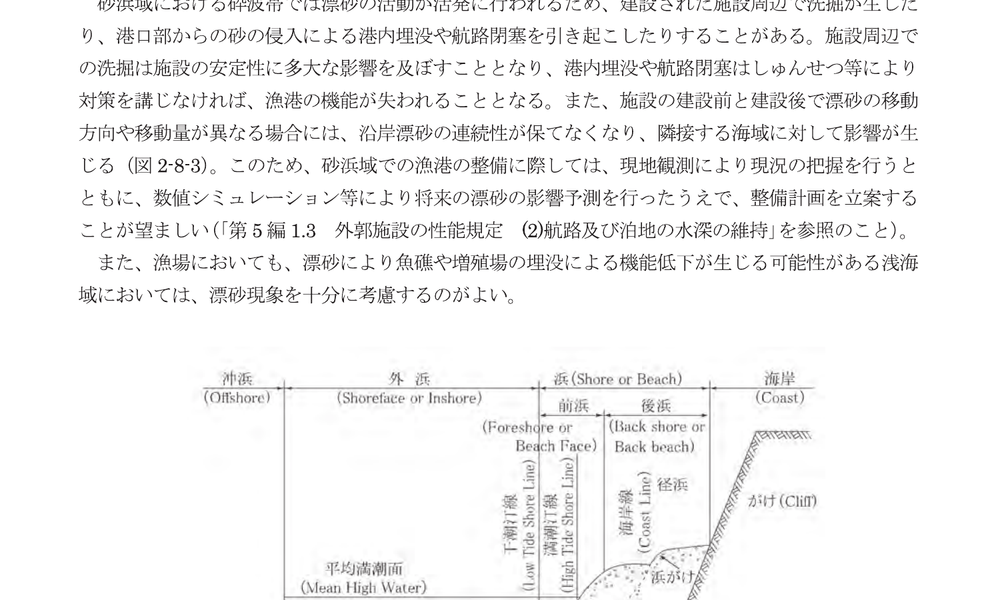
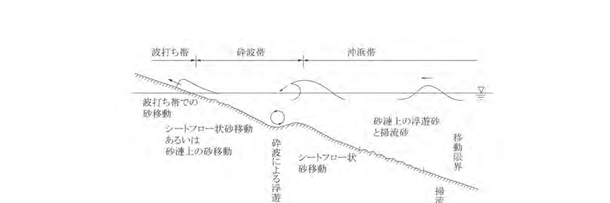
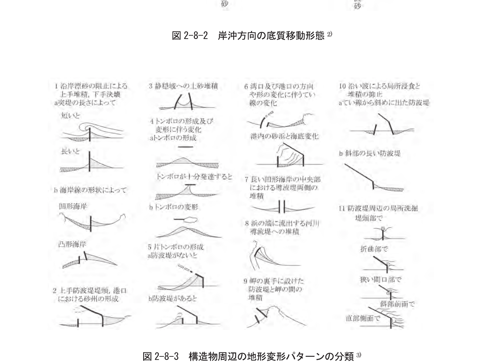
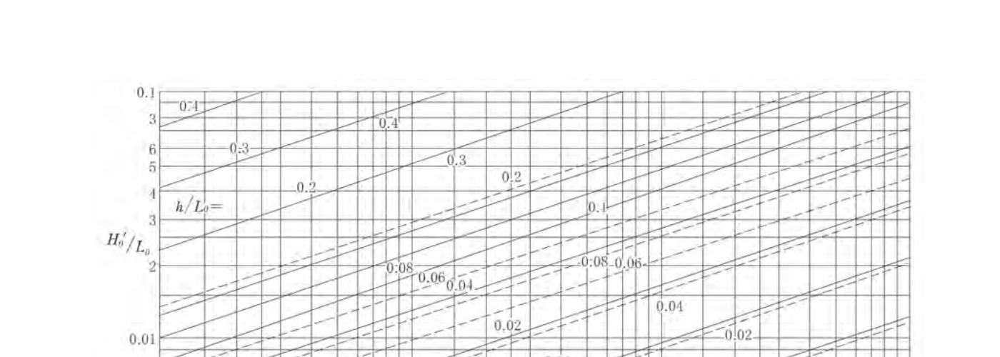
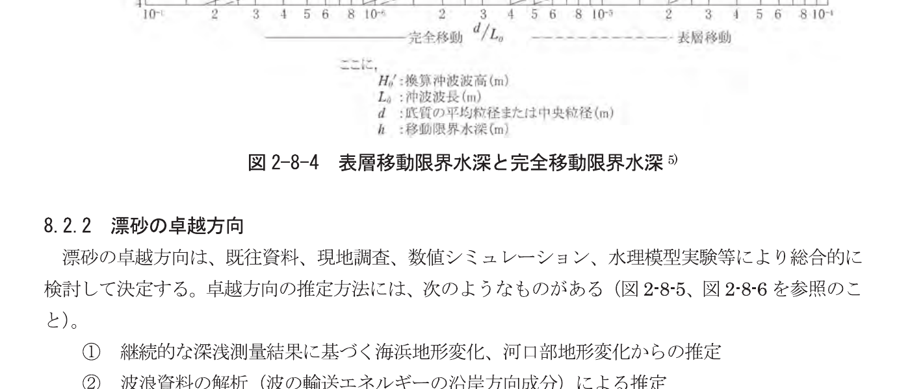
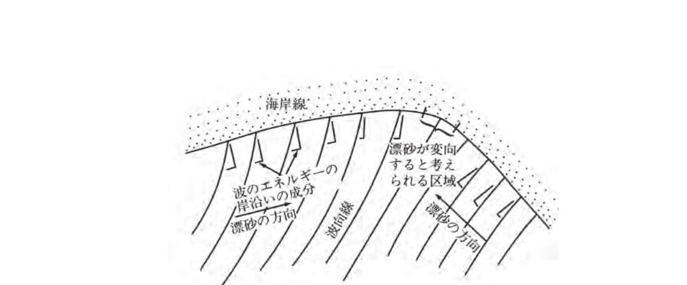

## 第8章 漂砂

### 8.1 漂砂の基本

漂砂は、実測値又は推算値をもとに当該海域における漂砂特性を把握するとともに、施設への影響並びに施設を建設することによる周辺への影響を適切な手法により評価するものとする。

図 2-8-1 海浜の一般的断面

図 2-8-2 岸沖方向の底質移動形態

図 2-8-3 構造物周辺の地形変形パターンの分類

### 8.2 漂砂の諸元

#### 8.2.1 漂砂の移動限界水深

図 2-8-4 表層移動限界水深と完全移動限界水深

#### 8.2.2 漂砂の卓越方向

図 2-8-5 沿岸漂砂の卓越方向を示す海岸地形

図 2-8-6 波向線により漂砂の方向を推定する方法

#### 8.2.7 全沿岸漂砂量の推定

CERC公式（式2-8-1）及び小笠・Bramptonの式（式2-8-2）が用いられる。

$$
Q_y = 0.77 \frac{1}{(\rho_s/\rho - 1)(1-\lambda)} \frac{1}{8} H_b^2 C_{gb} \sin\alpha_b \cos\alpha_b \tag{式 2-8-1}
$$

#### 8.2.8 シールズ（Shields）数

$$
\psi = \frac{u_*^2}{(\rho_s/\rho_0 - 1)gd} \tag{式 2-8-3}
$$

### 8.3 海浜変形予測

海浜変形の予測は、当該海域における漂砂の特性を考慮したうえで、数値シミュレーションや水理模型実験等の適切な手法を用いて、検討するのが望ましい。

#### 8.3.1 海浜変形予測手法

海浜変形予測手法の代表的な手法を表 2-8-11) に示す。このうち、漁港においては、3次元海浜変形モデルによる検討方法が一般に用いられる。3次元海浜変形モデルは、波浪や潮流による漂砂量を局所的に算出して平面的な水深変化を求めるものであり、漂港近くの沿岸漂砂量の推定などにより沿岸地形変化予測に有効な方法である。また、海岸線変化モデルは、CERC 公式や佐藤・Brampton の式などから沿岸漂砂量を算定するものであり、浅い海域や海岸における漂砂現象を把握する目的に用いられている。

表 2-8-1 代表的な海浜変形予測手法 1)

|  | 海岸線変化モデル | 3次元海浜変形モデル | エネルギー海底変化モデル |
|---|---|---|---|
| 1）前 | 主に砂質土と砂礫交互層の波浪による岸沖方向の漂砂 | 主に砂質土の波浪が卓越する場における平面的な漂砂 | 主に砂質土の波浪が卓越する場における地形変化の移動の予測 |
| 適用範囲 | 数 km、一般 1 km | 〜10 km、〜10Ha | 1〜80Ha |
| 外力の移動形態 | 底質の移動形態の分類を利用する | 底質移動形態の分類を利用する。その他推算する | 底質の移動形態を利用する。分類は利用しない |
| 予測に必要な波・流れ | 具体値、エネルギー流束 | エネルギー平衡方程式、波・放射応力から求める流れ・砕波位置 | エネルギー平衡方程式、砕波位置 |
| 地形モデル | 2 行わない | 1 行わない | 1 行うこともある |
| 見方表現と対比の計算 | 2 行わない | 1 行わない | 1 行う |
| 底質粒径 | ○直方体領域にて 1 種類の粒径交互層を取り扱いが可 | 1 行う | 1 行う |
| 計 算 | 表示の数値の変量の含まれる計算を意味する | 表示の数値の変量の含まれる計算を意味する | 表示の数値の変量の含まれる計算を意味する |

#### 8.3.2 水理模型実験

海岸部が急な場合や海底地形が複雑な場合には、数値計算により波浪や海浜変形を精度良く計算することができない。このような場合に、既定の条件下で波浪や海流を発生させ、その結果生じる海浜変形を予測する手法を用いることが考えられる。水理模型実験には、移動床模型（砕石砂にて実験）、固定床模型（長周期波など）があり、尺の関係からフルード相似が成り立ち、適切な短縮率を見積もることが可能であれば、現実の海浜変形を妥当に再現可能である。ただし、計算機性能及びリソースが有限であることから、以下の事項について十分留意しなければならない。

漂砂は規象として平滑状態のバリヤーを越えて平面形状態のフラックスモデルを適用し分ける必要があること、保守計画に用いる波浪式等の通過を適切に行うこと、特に落石等の原因により海浜変形予測においては、技術者の高度な知識を要する。したがって、モデルの適用範囲を十分理解したうえで、解析の条件、方法を適切に設定し、その結果を適切に評価することを原則とする。

漂砂の遡上・転動過程の予測に関しては、最近ブシネスク方程式による波浪数値計算と計算3次元モデルを予測して沿岸砂移動量を予測するのに有効な方法である13)。

### 参考文献

1. 堀川清司：海岸工学―海岸工学への序説―（1973），p.192
2. 堀川清司編：海岸環境工学（1985），p.148
3. 田中則男：日本石灰の漂砂特性と石灰構造物施設に伴う地形変化に関する研究，港湾技術研究所報告，No.453（1983），p.109
4. 土木学会海岸工学委員会海岸施設設計便覧小委員会：海岸施設設計便覧 2000 年版，土木学会（2000），p.265-274
5. 佐藤昭二：漂砂量と塩容量観測に比較した波砂の研究，港湾技術資料，No.5（1963）
6. Coastal Engineering Research Center: Shore Protection Manual, US Army Corps of Engineers, Vol.I, Chapter 4（1984）
7. 小笠博昭・Brampton, A.H.：漁港のある海岸のでの一線変化数値計算，港湾技術研究所報告，第 18 巻，第 4 号（1979），pp.77-104
8. Jonsson, I.G.: Wave boundary layers and friction factors, Proc. 10th Int. Coastal Eng. Conf.（1966），pp.127-148
9. 田中仁・Aug THU：全ての flow regime に適用可能な底・波共共存場摩擦抵抗，土木学会論文集，No.467，II-23（1993），pp.83-102
10. 土木学会海岸工学委員会海岸施設設計便覧小委員会：海岸施設設計便覧 2000 年版，土木学会（2000），p.146
11. 土木学会海岸工学委員会研究現況レビュー小委員会：海岸波動【岩・構造物・地盤の相互作用の解析法】，土木学会（1994），p.520
12. 土木学会海岸工学委員会研究現況レビュー小委員会：漂砂環境の創造に向けて，土木学会（1998），p.359
13. 中山仁範・牧野昌孝・新井靖之・大村智宏・小林学・田村仁・薗田和大・佐藤勝也，漂砂対策技術と地形変化予測モデルの開発，海岸工学論文集，第 53 巻（2006），pp.526-530
