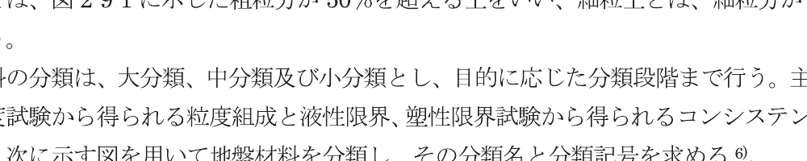
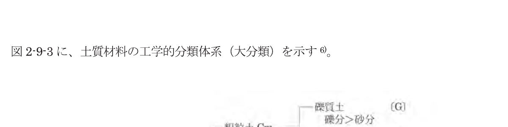
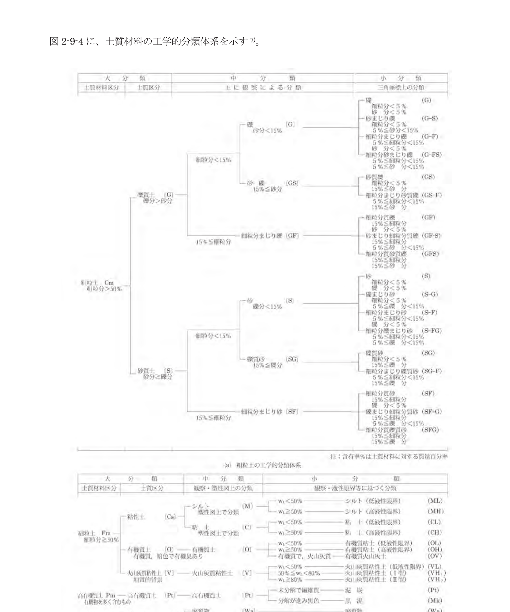
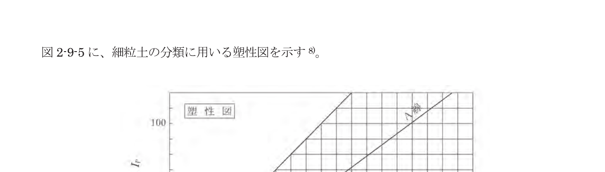
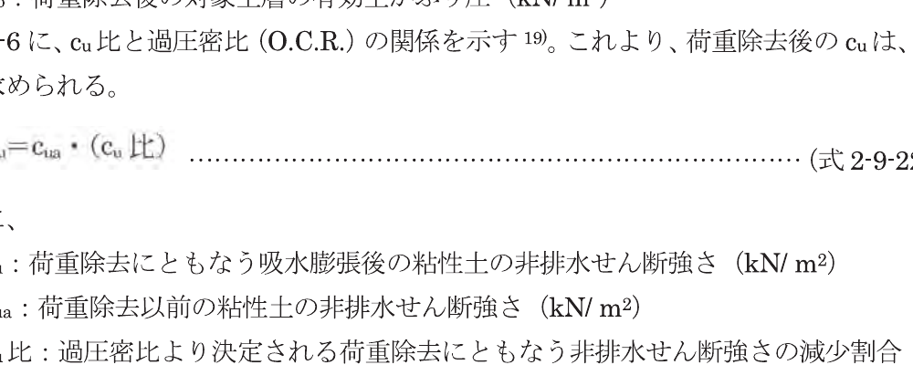

## 第9章 土の性質

### 9.1 地盤条件に関する基本

漁港・漁場の施設の設計に用いる地盤条件は、地盤調査及び土質試験の結果をもとに、設計に必要な成層状態、土の物理的性質、力学的特性等を適切に設定するものとする。

#### 9.1.1 土の特性

地盤は自然に生成されたものであり、その特性は場所によっても深さによっても異なる。また、土は、空気、水及び土粒子から成る三相構造をしており、土に力が働いたときに発生する内部の応力とそれに起因する変形は、過去に受けた応力履歴と現在の応力状態に依存し、その応力とひずみの関係は非線形性、時間依存性、ヒステレシス挙動などを示す。

#### 9.1.2 漁港・漁場の構造物又は施設に対する地盤調査の方法

① 対象水深は 0〜200m の範囲にあり、多くの場合は 0〜50m である。この水深は、ボーリングなどによる直接地盤調査可能水深（0〜30m）と、音波探査などによる間接地盤調査水深（30m 以深）に分けられる。

② 重力式防波堤などの重量構造物で、地盤の沈下、破壊がその構造物、及び周辺の施設に重大な影響を及ぼすものについては、直接的な方法により地盤調査を行うことを原則とする。直接地盤調査法として、現地より採取した土試料の物理試験（粒度試験、土粒子の密度試験など）、及び力学試験として、砂質土地盤では標準貫入試験を、粘性土地盤では現地より土試料を採取し、一軸圧縮試験、圧密試験を基本として行う。

③ 比較的軽量な構造物の場合、及び対象範囲の広い構造物では、ボーリング、乱した土試料採取などの点の調査法と音波による地盤探査などの線（面）の間接調査法の併用として、土の底質の物理試験結果を加味することが望ましい。

④ 水深が 30m を超える場合には、音響測深、音波による地層探査などの間接調査法を主体とし、これに採泥により得られた底質の物理試験結果を加味することが望ましい。

#### 9.1.3 地盤定数の決定

土の強度及び変形特性を把握するためには、調査目的及び経済性を考慮して、これらの土の特性に配慮した地盤調査及び土質試験を行うことを原則とする。

性能照査に用いる地盤の諸定数の決定に際して、対象とする構造物又は施設に応じて合理的な地盤の範囲及び深さにわたって必要な頻度で地盤調査を行う。また、得られた土試料について性能照査に必要な諸定数を合理的に決定するための土質試験を行う。

### 9.2 土の物理的性質

土の物理的性質は、その性質に応じて、現地より採取した乱れの少ない土試料、又は乱した土試料について行った試験より求めることを原則とする。

一般に、物理的性質とは、物理的測定方法を利用して求められる性質をいう。この考え方に基づくと、物理的性質は、物理試験から求められる物理的性質と力学試験から求められる力学的性質を含めたものを得ることになる。しかし、我が国の地盤工学では、土粒子の密度、粒度組成、コンシステンシー限界などの土に固有な性質及び含水比、土の密度、間隙比、飽和度などの土の状態を表す性質を物理的性質といい、これらの性質を求める試験を物理試験と呼んでいる。本文においては、土の物理的性質は上に述べた狭義の意味で用いるものとする。

#### 9.2.1 土の物理的性質を求める目的

土の物理的性質は、主に次の目的のために求める。

① 性能照査データとして直接利用する。

② 土の分類を行う。

③ 土の力学的性質を推定する。

#### 9.2.2 土の力学的性質に影響する物理的性質

土の強度や変形などの力学的性質は、粗粒土の場合は土の粒度特性、相対密度、細粒土の場合は土のコンシステンシー特性（液性限界、塑性限界など）と密接な関係がある。

我が国の港湾地域の物理的性質と力学的性質の関係については、文献 1)〜4) を参照するとよい。

#### 9.2.3 土の物理的性質の種類

種々の土の物理的性質の中から性能照査に必要なものを選択し、現地より採取した土試料について、合理的な試験方法を用いて求めることを原則とする。

表 2-9-1 に、土の物理的性質とそれを求めるための試験の名称、試験から求まる結果、結果の利用の方法を示す。表中の試験の名称は文献 5) に基づくもので、それらの試験法の内容は文献 26) を参照するとよい。

表 2-9-1 土の物理的性質一覧

| 物理的性質 | 試験の名称 | 試験結果から求められるもの | 記号 | 単位 | 試験結果の利用 |
|---|---|---|---|---|---|
| 土粒子の密度 | 土粒子の密度試験 | 土粒子の密度 | $\rho_s$ | t/m³ | 土の基本的性質（間隙比、飽和度）の算定 |
| 含水量 | 土の含水比試験 | 含水比 | $w$ | % | 土の基本的性質の計算 |
|  |  | 粒度加積曲線 | | | 土の分類 |
|  |  | 有効径 | $D_{10}$ | | 材料としての土の判定 |
| 粒径分布 | 土の粒度試験 | 10%粒径 | $D$ | mm | |
|  |  | 60%粒径 | $D_{60}$ | mm | |
|  |  | 均等係数 | $U_c$ | | |
| 土の締固め分布 | 土の締固め分布試験 | 土の締固め分布含有率 | $w_L$ | % | 細粒土と粗粒土の区分 |
| コンシステンシー | 土の液性限界・塑性限界試験 | 塑性限界 | $w_p$ | | 材料としての土の判定 |
|  |  | 液性指数 | $I_L$ | | |
| 砂の最大密度、最小密度 | 砂の最大密度・最小密度試験 | 最大密度、最小密度 | $\rho_{dmax}$, $\rho_{dmin}$ | t/m³ | 砂の相対密度の計算 |
| 密度 | 土の湿潤密度試験 | 湿潤密度 | $\rho_t$ | t/m³ | 土の基本的性質の計算 |

土の物理的性質に関する関係式を以下に示す。

$$
e = \left(1 + \frac{w}{100}\right)\frac{\rho_s}{\rho_t} - 1 \tag{式 2-9-1}
$$

$$
n = \left(1 - \frac{100}{100+w} \cdot \frac{\rho_t}{\rho_s}\right) \times 100 \tag{式 2-9-2}
$$

$$
S_r = \frac{w}{100} \cdot \frac{\rho_s}{\rho_w} \tag{式 2-9-3}
$$

$$
\gamma_t = \frac{\rho_s + \frac{S_r}{100}e\rho_w}{1+e}g = \frac{1+\frac{w}{100}}{1+e}\rho_s g \tag{式 2-9-4}
$$

$$
\gamma_d = \frac{\rho_s \times g}{1+e} = \frac{\gamma_t}{1+\frac{w}{100}} \tag{式 2-9-5}
$$

$$
\gamma' = \mu g = \rho_s \cdot g \tag{式 2-9-6}
$$

ここに、

- $e$：間隙比
- $n$：間隙率（%）
- $S_r$：飽和度（%）
- $\rho_w$：水の密度（t/m³）
- $\gamma_t$：土の湿潤単位体積重量（kN/m³）
- $\gamma_d$：土の乾燥単位体積重量（kN/m³）
- $\gamma'$：土の水中単位体積重量（kN/m³）
- $g$：重力加速度（m/s²）

その他の記号は、表 2-9-1 に準じる。

塑性指数 $I_p$、液性指数 $I_L$ は、それぞれ式 2-9-7、式 2-9-8 で表される。

$$
I_p = w_L - w_p \tag{式 2-9-7}
$$

$$
I_L = \frac{w - w_p}{I_p} \tag{式 2-9-8}
$$

式 2-9-7、式 2-9-8 中の記号は、表 2-9-1 に準じる。

液性指数 $I_L$ は、与えられた含水比 $w$ における相対的な稠度の目安のことで、ゼロに近いほど固い状態にあり、大きくなるほど軟らかく、1 に近ければ、塑性的な状態にあることを示す。

粒径加積曲線より求められる均等係数は、式 2-9-9 で表される。

$$
U_c = \frac{D_{60}}{D_{10}} \tag{式 2-9-9}
$$

式 2-9-9 中の記号は、表 2-9-1 に準じる。

均等係数 $U_c$ は粒径加積曲線の傾きを表し、$U_c$ が大きくなるほど、粒度分布が広いことを表す。磯粒分の含有率が 5% 未満の粗粒土において、$U_c$ ≧ 10 の場合、「粒径幅の広い」、$U_c$ < 10 の場合、「分級された」と呼ぶ。ただし、粒径分及び粒度判定の定義については、「第 2 編 9.3 土の分類」を参照のこと。

相対密度は砂の工学的性質を合理的に説明する指標であることが認められている。砂の相対密度は、式 2-9-10 により表される。

$$
D_r = \frac{e_{max} - e}{e_{max} - e_{min}} = \frac{\rho_d - \rho_{d\,min}}{\rho_{d\,max} - \rho_{d\,min}} \cdot \frac{\rho_{d\,max}}{\rho_d} \tag{式 2-9-10}
$$

ここに、

- $D_r$：相対密度
- $e_{max}$：最も緩い状態の間隙比
- $e_{min}$：最も密な状態の間隙比
- $e$：与えられた状態の間隙比
- $\rho_d$：乾燥密度（t/m³）

その他の記号は、表 2-9-1 に準じる。

### 9.3 土の分類

土の分類は、粗粒土については粒度によって、細粒土についてはコンシステンシー限界によって行うことを原則とする。

#### 9.3.1 地盤材料の工学的分類方法

地盤材料の工学的分類は、地盤工学会基準「地盤材料の工学的分類方法」（JGS0051:2000）6) にしたがって行うことを原則とする。

図 2-9-1 に、地盤材料の粒径区分とその呼び名を示す 6)。

図 2-9-1 粒径区分とその呼び名 6)

粗粒土とは、図 2-9-1 に示した粗粒分が 50% を超える土をいい、細粒土とは、細粒分が 50% 以上の土をいう。

地盤材料の分類は、大分類、中分類及び小分類と、目的に応じた分類段階まで行う。主に観察結果及び粒度試験から得られる粒度組成と液性限界、塑性限界試験から得られるコンシステンシー特性に基づき、次に示す図を用いて地盤材料を分類し、その分類名と分類記号を求める。

図 2-9-2 に、地盤材料の工学的分類体系を示す 6)。

図 2-9-2 地盤材料の工学的分類体系 6)

図 2-9-3 に、土質材料の工学的分類体系（大分類）を示す 6)。

図 2-9-3 土質材料の工学的分類体系（大分類）6)

図 2-9-4 に、土質材料の工学的分類体系を示す 7)。

図 2-9-4 土質材料の工学的分類体系 7)

図 2-9-5 に、細粒土の分類に用いる塑性図を示す 8)。

図 2-9-5 塑性図 8)

#### 9.3.2 照査に用いる土質定数の決定のための地盤の分類

照査に用いる地盤の土質定数を決定する際、次のように粒度により地盤を砂質土地盤と粘性土地盤に区分してよい。

**(1) 砂質土地盤**

粒径が 75 μm 以上の粒径の土粒子が 80% 以上の土より構成されている地盤で、地盤の強さ、土圧等は、土の内部摩擦角又は標準貫入試験より得られる N 値により評価する。

**(2) 粘性土地盤**

粒径が 75 μm 以上の粒径の土粒子が 80% 未満の土により構成されている地盤で、地盤の強さ、土圧等は、土の非排水せん断強さにより評価する。

### 9.4 土の変形特性

#### 9.4.1 土の弾性係数

土を弾性体として扱う場合は、土の非線形性を考慮して適切に弾性係数を設定することを原則とする。

土の弾性係数は、以下の（1）〜（4）によることができる。

**(1) 土の弾性係数の基本**

土を等方弾性体として扱う場合、弾性係数として変形係数（ヤング率）$E$ 及びポアソン比 $\nu$ が必要である。土の応力とひずみの関係は非線形であり、変形係数 $E$ は応力ひずみの依存性を有することに留意する。また、地盤を弾性体として扱う場合、作用により発生する地盤のひずみレベルに応じた弾性係数を設定することが望ましい。

**(2) 原位置試験による変形係数の測定**

変形係数は、次のような原位置試験にて求める場合がある。

① 原位置弾性波探査

② ボーリング孔内載荷試験

③ 平板載荷試験

これらの試験より求めた変形係数の使用にあたっては、試験ごとに測定時の地盤のひずみレベルが異なっていることを十分に考慮する。

**(3) 土の非排水せん断強さと変形係数の関係**

粘性土の場合ひずみレベルが 0.2〜0.3% に相当する変形係数として、初期接線係数 $E_i$ と割線係数 $E_{50}$ を求めることができる。これらの変形係数と粘性土の非排水せん断強さとの間の関係として、式 2-9-11、式 2-9-12 がみられている 9)。

$$
E_i = 210c_u \tag{式 2-9-11}
$$

$$
E_{50} = 180c_u \tag{式 2-9-12}
$$

ここに、

- $E_i$：初期接線係数（kN/m²）
- $E_{50}$：割線係数（kN/m²）
- $c_u$：粘性土の非排水せん断強さ（kN/m²）

ただし、式 2-9-11 は粘性の高い沖積粘性層に、構造の発達した粘性土については適合しないものである。

**(4) ポアソン比**

土のポアソン比の求め方については、確立した試験法がないのが現状である。一般的には、飽和粘性土の非排水条件で $\nu$ = 1/2 程度、その他は $\nu$ = 1/3〜1/2 とすることが多い。

#### 9.4.2 土の圧縮特性及び圧密特性

土の圧縮特性及び圧密特性については、適切な試験結果に基づいた諸係数を求め、適切な算定式により評価することを原則とする。

土の圧縮特性及び圧密特性は、以下の（1）〜（3）によることができる。

**(1) 土の圧縮特性及び圧密特性の基本**

土が一次元的に載荷されたとき、土粒子の骨格が変形して有効応力に相当して地盤の密度が低下する性質を圧縮性という。

土の間隙が水で飽和されている場合、土骨子骨格が圧縮するためには間隙水が排水されることが必要である。透水性の大きい砂質土地盤の場合、載荷直後に排水が完了して圧密が終了し、載荷されたのと同義である。粘性土地盤の場合は、地盤水が速やかに排水されず、載荷直後に載荷が完了する。透水係数に依存した速さで間隙水が排水される。この過程で圧縮が徐々に進行する。このように外力が載荷され、土中に発生した過剰間隙水圧の消散に伴い、長時間にわたって発生する地盤の圧縮定常を圧密という。

**(2) 土の圧密試験**

圧密特性は、現地より採取した乱れの少ない試料を用いて行った圧密試験により求める。土の圧密特性は、明に載荷に伴う地盤高の低下の占める割合がかなり大きいので、地盤沈下量の推定、特に圧密沈下量及び圧密時間の推定に用いる。圧密試験は段階載荷による圧密試験方法（JIS A 1217）、又は、「土のひずみ速度載荷による圧密試験方法」（JIS A 1227）に規定された試験方法により行う。

**(3) 圧密に関する諸係数**

土の圧密試験より得られる諸係数は、表 2-9-2 に示すように、各荷重段階ごとに得られるもの、及び全荷重段階にわたるデータより得られるものの 2 種類に分けられる。

表 2-9-2 圧密諸係数

| | 各荷重段階 | | 全荷重段階 |
|---|---|---|---|
| 外力増加時 | 体積圧縮係数 $m_v$ | m²/kN | |
| | 圧密係数 $c_v$ | m²/day | 圧密降伏応力 $\sigma'_c$ kN/m² |
| 圧密定数 | 圧密時間 | | |
| | 圧密係数 | m²/day | |

### 9.5 土のせん断強さ特性

#### 9.5.1 砂質土地盤のせん断強さ

砂質土地盤の主なせん断強さは、適切な地盤調査と土質試験及び算定式により評価することを原則とする。また、砂質土地盤の判別は、「第 2 編 9.3 土の分類」にしたがって行うことを原則とする。

砂質土地盤のせん断強さは、以下の（1）〜（3）によることができる。

**(1) 砂質土地盤のせん断強さの基本**

砂質土地盤は一般に透水性が大きいので、施設に覚さる過剰間隙水圧は速やかに消散する。有効応力の変化がなく、排水せん断強さにより評価する。

**(2) 砂質土地盤のせん断強さ**

一般に、砂質土地盤のせん断強さは、式 2-9-13 で表される。

$$
\tau_f = (\sigma - u)\tan\phi_d \tag{式 2-9-13}
$$

ここに、

- $\tau_f$：土のせん断強さ（kN/m²）
- $\sigma$：せん断面上の垂直応力（kN/m²）
- $u$：原位置における定常水圧（kN/m²）
- $\phi_d$：排水条件下で得られる砂質土の内部摩擦角（°）

**(3) 砂質土の内部摩擦角の決定方法**

砂質土の内部摩擦角は、三軸 CD（正規排水）試験によって求められる。しかし、三軸試験に必要な砂質土の乱れの少ない試料の採取は、多額の費用を要することから、砂質土の内部摩擦角は、標準貫入試験の N 値から推定する場合が多い。内部摩擦角を N 値から求める式として、式 2-9-14 より推定してよい 9)。

$$
\phi = 25 + 3.2\sqrt{\frac{100N}{70 + p_{w0}'}} \tag{式 2-9-14}
$$

ここに、

- $\phi$：照査に用いる砂質土の内部摩擦角（°）
- $N$：標準貫入試験より得られる N 値
- $p_{w0}'$：標準貫入試験の N 値を採取したときの有効土かぶり圧（kN/m²）

砂質土の内部摩擦角は、N 値と有効土かぶり圧の両方に依存することが分かっており、式 2-9-14 はこれを考慮して Meyerhof（マイヤーホフ）が提案したもので式 2-9-1612) と、式と整合性を持たせるため、従来より実績のあるダナム（Dunham）の式と整合性を持たせるため、やや大きい値を算出するように補正したものである。

$$
D_r = 21\left(\frac{100N}{70 + p_{w0}'}\right)^{0.5} \tag{式 2-9-15}
$$

$$
\phi = 28 + 0.15D_r \tag{式 2-9-16}
$$

ここに、

- $D_r$：砂の相対密度（%）

#### 9.5.2 粘性土地盤のせん断強さ

粘性土のせん断強さは、適切な土質試験及び算定式により評価することを原則とする。また、土地盤の判別は、「第 2 編 9.3 土の分類」にしたがって行うことを原則とする。粘性土地盤のせん断強さは、以下の（1）〜（6）によることができる。

**(1) 粘性土地盤のせん断強さの基本**

粘性土地盤は透水性が小さいため、載荷後に施工中に発生した過剰間隙水圧の速やかな消散が期待できない。このため、水で飽和した粘性土地盤では、施工中に有効応力の変化が起こらないものとみなし、せん断強さは原則として全応力により評価する。したがって、粘性土地盤のせん断強さについては、施工前の非排水せん断強さを用いることを原則とする。

**(2) 粘性土のせん断強さ**

粘性土のせん断強さは、一般に式 2-9-17 で求める。

$$
\tau_f = c_u \tag{式 2-9-17}
$$

ここに、

- $\tau_f$：土のせん断強さ（kN/m²）
- $c_u$：粘性土の非排水せん断強さ（kN/m²）

**(3) 粘性土の非排水せん断強さの決定方法**

粘性土の非排水せん断強さ $c_u$ は、一般に式 2-9-18 より求める。

$$
c_u = \frac{q_u}{2} \tag{式 2-9-18}
$$

ここに、

- $q_u$：一軸圧縮強さの平均値（kN/m²）

ただし、上の一軸圧縮試験は、「土の一軸圧縮試験方法」（JIS A 1216:2009）により求めるが、粘性土の一軸圧縮試験において、試験の乱れによる強度低下を適切に評価して、結果を補正する方法が提案されている 15)〜18)。

なお、粘性土地盤の N 値と一軸圧縮強さの関係については、テルツァーギ・ペック（Terzaghi-Peck）による関係式が示されている。しかし、テルツァーギ・ペック（Terzaghi-Peck）は、N 値と $q_u$ の対応については、はっきりと多くの疑義があることを示していることから、一軸圧縮試験の実施が困難な場合を除き、一軸圧縮強さを N 値から決定することは望ましくない。

**(4) 粘性土地盤の非排水せん断強さの表現**

粘性土地盤の非排水せん断強さは、深さとともに増加するのが一般的なため、この非排水せん断強さを式 2-9-19 のように表し、原点に用いることができる。

$$
c_u = c_{u0} + kz \tag{式 2-9-19}
$$

ここに、

- $z$：地表面からの深さ（m）
- $c_u$：深さ $z$ における粘性土地盤の非排水せん断強さ（kN/m²）
- $c_{u0}$：地表面における $c_u$ 値（kN/m²）
- $k$：深さに対する $c_u$ の増加割合（kN/m³）

**(5) 圧密による粘性土の強度増加**

粘性土の非排水せん断強さは、圧密荷重の増加、及び圧密荷重の進行に伴い圧密が終了して地盤が安定した後に増加する。この場合、粘性土地盤の強度増加量は、式 2-9-20 で算出してよい。

$$
\Delta c_u = \Delta p \cdot (c_u/p) \cdot U \tag{式 2-9-20}
$$

ここに、

- $\Delta c_u$：圧密による粘性土の非排水せん断強さの増加（kN/m²）
- $\Delta p$：荷重増分により発生した対象土層の鉛直応力の増分（kN/m²）
- $c_u/p$：粘性土の強度増加率
- $U$：考えている時点の対象土層の圧密度

我が国の沿岸域の沖積粘土の強度増加率 $c_u/p$ は、堅固なものは 0.28〜0.30 の範囲にある 10)。

**(6) 吸水膨張による粘性土の非排水せん断強さの減少**

圧密層に荷重の一部を除去すれば、粘性土は時間の経過とともに吸水膨張して非排水せん断強さが減少する。粘性土の吸水膨張に要する時間はかなり長いため、地盤改良を施した場所など、これらの地盤では吸水膨張による地盤強度低下への照査を行うことを原則とする。このときの粘性土の非排水せん断強さの減少割合は、式 2-9-21 に示した過圧密比（O.C.R.）により決定される。

$$
O.C.R. = \frac{p_c}{p_1} \tag{式 2-9-21}
$$

ここに、

- O.C.R.：過圧密比
- $p_c$：荷重除去以前の対象土層の有効土かぶり圧（kN/m²）
- $p_1$：荷重除去後の対象土層の有効土かぶり圧（kN/m²）

図 2-9-6 に、$c_u$ 比と過圧密比（O.C.R.）の関係を示す 18)。これより、荷重除去後の $c_{u1}$ は、式 2-9-22 により求められる。

$$
c_{u1} = c_{u0} \cdot (c_u \text{ 比}) \tag{式 2-9-22}
$$

ここに、

- $c_{u1}$：荷重除去にともなう吸水膨張後の粘性土の非排水せん断強さ（kN/m²）
- $c_{u0}$：荷重除去以前の非排水せん断強さ（kN/m²）
- $c_u$ 比：過圧密比により決定される非排水せん断強さの減少割合

図 2-9-6 $c_u$ 比と過圧密比（O.C.R.）の関係 18)

#### 9.5.3 サンプリング過程において乱れを受けやすい土試料の非排水せん断強さの決定

サンプリング過程において乱れを受けやすい土試料の非排水せん断強さは、以下の①〜④によることができる。

**① 中間土**

75 μm 以上の粒径の土粒子が 50% 以上、80% 未満のいわゆる中間土は、試料採取段階での試料の乱れの影響を受ける。一軸圧縮試験を実施した場合に、排水や試料の乱れにより結果のばらつきが大きくなることもあるため、次の方法を適切に考慮する必要がある。

a）$K_0$ 圧密三軸非排水試験から求める方法

b）等方圧密三軸圧縮試験と等方圧密三軸伸長試験を併用して求める方法 20)

c）一軸圧縮試験と等方圧密三軸試験を併用して求める方法 20)

**② 洪積粘土**

洪積粘土は応力除荷においてミクロな微小亀裂が生じる場合がある。適切な一軸圧縮強さを求める場合には、三圧縮試験を行い非排水せん断強さを求めることが望ましい。

**③ サンゴ混じり土**

サンゴ混じり土はサンプリング過程における機械的な粒子の応力破壊による影響がある。一軸圧縮強さを適切に評価することが重要である。この場合に三軸試験を行うことにより評価することが望ましい 25)。

**④ 火山灰質粘性土**

火山灰質粘性土は、火山灰、軽石、スコリアなどの一次火山堆積物や、それらの風化物をもち、粗粒分含有率が 50% 以上となっていないものを指す。したがって火山灰質粘性土のうち、いわゆる「しらす」という用語は九州の地域的な呼称で本来的には土性上では粗粒土に属するものが多い。

火山灰質粘性土の物理的性質は、給源火山、火山からの距離、堆積環境、風化の程度など、粒径によって変化に富む 26)。

せん断強さは文献 26) により三軸試験にて求めるとよい。また、乱れの少ない火山灰質粘性土の試料と乱れた試料の大きな構造の違いとその力学的特性に影響し、その影響は乱れた火山灰質粘性土（いわゆるしらす）が特に顕著であることに留意することが必要である。

試験事例によれば、乱れの少ない試料で 23〜33kN/m² という結果を示すが、乱す 4kN/m² 以下となっている 26)。また、乱した試料のすりつぶしたものの結果との差は通常ゼロに等しくなるため、しらすの力学特性を測定するために多孔質、粒子破砕が生じやすいことに留意が必要である。

### 参考文献

1. 地盤工学会：地盤材料試験の方法と解説，地盤工学会（2009），p.93
2. 藤田俊会・大嶺正紀・坪田幸雄・野口昌彦：土質調査結果よりみた漁港地域における主な土の工学的性質，第 32 回全国漁港建設技術研究発表会講演（1987），pp.78-95
3. 地盤工学会：地盤材料試験の方法と解説，地盤工学会（2009），pp.93-308
4. 地盤工学会：地盤材料試験の方法と解説，地盤工学会（2009），p.147
5. 地盤工学会：地盤材料試験の方法と解説，地盤工学会（2009），p.128
6. 地盤工学会：地盤材料試験の方法と解説，地盤工学会（2009），pp.54-59
7. 地盤工学会：地盤材料試験の方法と解説，地盤工学会（2009），p.56
8. 地盤工学会：地盤材料試験の方法と解説，地盤工学会（2009），p.57
9. 中瀬明男・小林正樹：N 値の有効土被り圧に対する補正と砂の内部摩擦角の推定，港湾技術研究所報告，Vol.11，No.2（1972），pp.243-259
10. 土木学会海岸工学委員会研究現況レビュー小委員会：海岸波動【岩・構造物・地盤の相互作用の解析法】，土木学会（1994），p.520
11. 日本港湾協会：港湾施設の設計における土の圧密について，日本港湾協会（1996），pp.245-246
12. G.G.Meyerhof: Discussion on soft soil properties and their measurement, Discussion 2, Proc. 8th International Conf. on Soil Mechanics and Foundation Engineering, Vol.III（1957），p.110
13. G.G.Meyerhof: Compaction of sands and bearing capacity of piles, ASCE, Vol.85, No.SM 6（1959），pp.1-29
14. 藤村和毅：粘土の乱れとサンプリングの応力に関する研究，港湾技術研究所，No.1983（1974）
15. 澁谷啓・大本紘司：三軸圧縮試験の品質評価方法，サンプリングシンポジウム論文集，土木学会（1985），pp.25-30
16. Nakase, A., Kusakabe, O. and Nomura, H.: A method for correcting undrained shear strength for sample disturbance, Soils and Foundations, Vol.25, No.1（1985），pp.52-64
17. 三田地利之・上嶋昌：サクション―一軸圧縮強度による粘土の非排水せん断強度推定法の適用，土木学会論文集，No.541/III-35（1996），pp.147-157
18. 土木学会：土質調査試験結果の解釈と適用 第 1 回改訂版，土木学会（1979），p.56
19. 田中洋行：ボーリングにおける過圧密粘土の非排水せん断強度測定法の適用，港湾技術研究所報告，Vol.33，No.4（1994），pp.2-17
20. 中野健二・本田克彦・山本定彦：広域堆積層における砂質粘性土の力学特性の推定，港湾技術研究所報告，Vol.8，No.4（1969），pp.103-143
21. 大標正紀・飯塚修平・坪田幸雄・山本竜太郎：不動結晶土及び中間土における非排水せん断強度，土と基礎，Vol.41，No.7（1993），pp.17-22
22. 大標正紀・飯塚修平・坪田幸雄・山本竜太郎：漁港地区のボーリングと中間土における非排水強度判定，水産工学研究所技報，第 13 号（1992），pp.31-56
23. 坪田幸雄・大標正紀・山本竜太郎・飯塚修平：三軸試験を利用した粘性土地盤及び中間土地盤の強度推定の決定法，第 37 回全国漁港建設技術研究発表会講演（1992），pp.102-121
24. 田中孝一・森谷・及川正：一軸圧縮試験と三圧試験を利用した粘性土の非排水せん断強度に関する検討，港湾技術研究所報告，Vol.28，No.3（1989），pp.1-45
25. 山本竜太郎・大慎正紀・鈴木芳政：サンゴ礫混じり土の強度算定に関する一考察，水産工学研究所技報（水産土木），第 15 号（1993），pp.65-91
26. 地盤工学会：地盤材料試験の方法と解説，地盤工学会（2009），pp.988-1007
