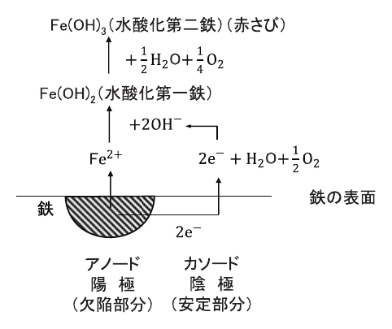
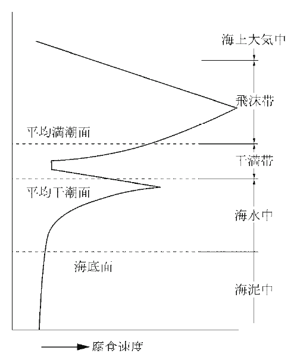
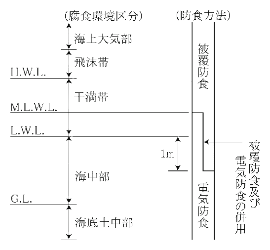

# 第3編 材料及び諸係数

## 第1章 材料の基本

### 1.1 材料の概要

> 漁港・漁場の施設に使用する材料は、想定する作用及び耐久性、施工性、経済性等を考慮して、適切に選定するものとする。

### 1.2 材料の単位体積重量等

各材料の単位体積重量は、その品質等により適切な値を用いることを原則とする。

照査に用いる各材料の密度及び単位体積重量は表 3-1-1 に示すものを用いることができる。記載されていないものは日本工業規格（JIS）に示されているものを用いることができる。

なお、軽量骨材、重量骨材などを使用した特殊用途のコンクリートは、配合条件により、また、石材は種類、産地により単位体積重量が異なることが多いため、実測値を用いるなど慎重に決定することが望ましい。

また、単位体積当たりの質量を密度というが、密度から単位体積重量の換算については、以下の式を用いるのがよい。

$$
\gamma = \rho g \tag{式 3-1-1}
$$

ここに、

- $\gamma$：単位体積重量（kN/m³）
- $\rho$：密度（t/m³）
- $g$：重力加速度（m/s²）

表-3-1-1 材料等の密度と単位体積重量

| 材料等 | 密度（t/m³） | 単位体積重量（kN/m³） | 材料等 | 密度（t/m³） | 単位体積重量（kN/m³） |
|------|-----------|---------------|------|-----------|---------------|
| 鋼・鋳鋼 | 7.85 | 77.0 | アスファルト舗装 | 2.3 | 22.6 |
| 鋳鉄 | 7.25 | 71.0 | 石材（花こう岩） | 2.6 | 26.0 |
| 鉄筋コンクリート | 2.45 | 24.0 | 石材（砂岩） | 2.5 | 25.0 |
| 無筋コンクリート | 2.3 | 22.6 | 砂、砂利、栗石（空中湿潤） | 1.8 | 18.0 |
| セメントモルタル | 2.2 | 21.0 | 砂、砂利、栗石（空中飽和） | 2.0 | 20.0 |
| 木材 | 0.8 | 7.8 | 海水 | 1.03 | 10.1 |

（注）裏込材の単位体積重量は「本編 4.2.3 裏込め材」を参照すること

## 第2章 鋼材

### 2.1 品質

鋼材は、日本工業規格（JIS）に適合するか、又はこれと同等以上の品質を有するものとすることを原則とする。

鋼材は、表 3-2-1 に示す規格に適合するものを使用することを標準とする。ここに示される鋼材は漁港構造物で比較的多く使用されているものをとりまとめたものであり、それぞれの JIS には、さらに多くの鋼種が規定されている。

表-3-2-1 標準とする鋼材（JIS）

<table>
<thead>
<tr><th>鋼材の種類</th><th>規格</th><th>名称</th><th>鋼材記号</th></tr>
</thead>
<tbody>
<tr><td rowSpan="3">構造用鋼材</td><td>JIS G 3101</td><td>一般構造用圧延鋼材</td><td>SS400, SS490</td></tr>
<tr><td>JIS G 3106</td><td>溶接構造用圧延鋼材</td><td>SM400, SM490, SM490Y, SM520</td></tr>
<tr><td>JIS G 3114</td><td>溶接構造用耐候性熱間圧延鋼材</td><td>SMA400, SMA490</td></tr>
<tr><td>鋼管</td><td>JIS G 3444</td><td>一般構造用炭素鋼管</td><td>STK400, STK490</td></tr>
<tr><td rowSpan="2">鋼杭</td><td>JIS A 5525</td><td>鋼管杭</td><td>SKK400, SKK490</td></tr>
<tr><td>JIS A 5526</td><td>H形鋼杭</td><td>SHK400, SHK400M, SHK490M</td></tr>
<tr><td rowSpan="3">矢板</td><td>JIS A 5523</td><td>溶接用熱間圧延鋼矢板</td><td>SYW295, SYW390</td></tr>
<tr><td>JIS A 5528</td><td>熱間圧延鋼矢板</td><td>SY295, SY390</td></tr>
<tr><td>JIS A 5530</td><td>鋼管矢板</td><td>SKY400, SKY490</td></tr>
<tr><td rowSpan="4">鋳鍛造品</td><td>JIS G 3201</td><td>炭素鋼鍛鋼品</td><td>SF490A, SF540A</td></tr>
<tr><td>JIS G 5101</td><td>炭素鋼鋳鋼品</td><td>SC450</td></tr>
<tr><td>JIS G 4051</td><td>機械構造用炭素鋼鋼材</td><td>S30C, S35C</td></tr>
<tr><td>JIS G 5501</td><td>ねずみ鋳鉄品</td><td>FC150, FC250</td></tr>
<tr><td rowSpan="4">溶接棒</td><td>JIS Z 3211</td><td>軟鋼、高張力鋼及び低温用鋼用被覆アーク溶接棒</td><td></td></tr>
<tr><td>JIS Z 3351</td><td>炭素鋼及び低合金鋼用サブマージアーク溶接ソリッドワイヤ</td><td></td></tr>
<tr><td>JIS Z 3352</td><td>炭素鋼及び低合金鋼用サブマージアーク溶接フラックス</td><td></td></tr>
<tr><td>JIS Z 3312</td><td>軟鋼及び高張力鋼マグ溶接用ソリッドワイヤ</td><td></td></tr>
<tr><td rowSpan="4">棒鋼</td><td>JIS G 3112</td><td>鉄筋コンクリート用棒鋼</td><td>SR235, SR295, SD295A, SD295B, SD345</td></tr>
<tr><td>JIS G 3117</td><td>鉄筋コンクリート用再生棒鋼</td><td>SRR235, SRR295, SDR235</td></tr>
<tr><td>JIS G 3109</td><td>PC鋼棒</td><td>SBPR785/1030, 930/1080, 930/1180, 1080/1230</td></tr>
<tr><td>JIS G 3137</td><td>細径異形PC鋼棒</td><td>SBPDN930/1080, 1080/1230, 1275/1420 SBPDL930/1080, 1080/1230, 1275/1420</td></tr>
</tbody>
</table>

### 2.2 性能照査に用いる鋼材の定数

鋼、鋳鋼及び鋳鉄の定数は適切な値を用いることを原則とする。一般の鋼及び鋳鋼の定数は下記の値を用いることができる。

- ヤング係数：$2.0 \times 10^5$ N/mm²
- せん断弾性係数：$7.7 \times 10^4$ N/mm²
- ポアソン比：0.30
- 線膨張係数：$12 \times 10^{-6}$ 1/℃

なお、鉄筋コンクリート及びプレストレストコンクリート等に用いる鋼材の定数に関しては、適切な文献に基づく値を用いることができる。

鋳鉄については、ヤング係数を $1.0 \times 10^5$ N/mm²、ポアソン比を 0.25 としてもよい。

### 2.3 許容応力度

鋼材の許容応力度は、形状、板厚、鋼種等により、適切な値を用いることを原則とする。

#### 2.3.1 構造用鋼材

(1) 構造用鋼材には、棒鋼、形鋼、鋼板、平鋼等の種類があり、板厚 40mm 以下の場合の許容応力度は表 3-2-2 に示す値を用いることができる。一般に漁港構造物に使用される鋼材については 40mm を超えることは希であるが、その場合の許容応力度は適切な文献に基づいて値を低減することができる。

(2) 一般に、漁港構造物では、構造用鋼材を主要部材として使用することは少なく、また、使用された場合でも座屈を生じる危険は少ないので、圧縮応力度は表 3-2-2 に示す値を用いるのがよい。しかし、鋼製の浮体構造物、鋼管構造物、ハイブリッド式防波堤等のように構造用鋼材を長いスパンで使用し、座屈の危険が予想される場合には、これに対し十分な考慮を払い、応力度の算出にあたっては適切な基準や文献等により定めることが望ましい。

表-3-2-2 構造用鋼材の許容応力度（N/mm²）

<table>
<thead>
<tr><th rowSpan="2">応力度の種類</th><th colSpan="4">鋼種</th></tr>
<tr><th>SS400 SM400 SMA400</th><th>SS490</th><th>SM490</th><th>SM490Y SM520 SMA490</th></tr>
</thead>
<tbody>
<tr><td>軸方向引張応力度（純断面積につき）</td><td>140</td><td>165</td><td>185</td><td>210</td></tr>
<tr><td>軸方向圧縮応力度（総断面積につき）</td><td>140</td><td>165</td><td>185</td><td>210</td></tr>
<tr><td>曲げ引張応力度（純断面積につき）</td><td>140</td><td>165</td><td>185</td><td>210</td></tr>
<tr><td>曲げ圧縮応力度（総断面積につき）</td><td>140</td><td>165</td><td>185</td><td>210</td></tr>
<tr><td>せん断応力度（総断面積につき）</td><td>80</td><td>100</td><td>105</td><td>120</td></tr>
<tr><td>支圧応力度（鋼板と鋼板）</td><td>210</td><td>—</td><td>280</td><td>315</td></tr>
</tbody>
</table>

#### 2.3.2 鋼杭及び鋼管矢板

(1) 鋼杭及び鋼管矢板に用いる鋼材の板厚 40mm 以下の場合の許容応力度は表 3-2-3 に示す値を用いることができる。一般に漁港構造物に使用される鋼材については 40mm を超えることは希であるが、その場合の許容応力度は適切な文献に基づいて値を低減することができる。

(2) 表 3-2-3 で示したものは、桟橋式係船岸、鋼管矢板式防波堤に用いられる鋼管杭、基礎工に用いられる鋼管杭やH形鋼杭等にも適用することができる。

(3) 軸方向と曲げモーメントの組み合わせが必要なときの許容応力度は、適切な基準や文献等を参考にして定めるのがよい。

表-3-2-3 鋼杭及び鋼管矢板材の許容応力度（N/mm²）

<table>
<thead>
<tr><th rowSpan="2">応力度の種類</th><th colSpan="3">鋼種</th></tr>
<tr><th>SMA400 SKK400, SHK400 SHK400M, SKY400</th><th>SKK490, SHK490M SKY490</th><th>SM490Y, SMA490</th></tr>
</thead>
<tbody>
<tr><td>軸方向引張応力度（純断面積につき）</td><td>140</td><td>185</td><td>210</td></tr>
<tr><td>軸方向圧縮応力度（総断面積につき）</td><td>(l/r≦18) 140 (18&lt;l/r≦92) 140−0.82 (l/r−18) (l/r&gt;92) 1,200,000 / [6,700+(l/r)²]</td><td>(l/r≦16) 185 (16&lt;l/r≦79) 185−1.2 (l/r−16) (l/r&gt;79) 1,200,000 / [5,000+(l/r)²]</td><td>(l/r≦15) 210 (15&lt;l/r≦75) 210−1.5 (l/r−15) (l/r&gt;75) 1,200,000 / [4,400+(l/r)²]</td></tr>
<tr><td>曲げ引張応力度（純断面積につき）</td><td>140</td><td>185</td><td>210</td></tr>
<tr><td>曲げ圧縮応力度（総断面積につき）</td><td>140</td><td>185</td><td>210</td></tr>
<tr><td>軸方向力及び曲げモーメントを受ける部材</td><td colSpan="3">(1) 軸方向力が引張の場合 σ_t + σ_bt ≦ σ_ta かつ σ_t + σ_bw ≦ σ_ba (2) 軸方向力が圧縮の場合 σ_c / σ_ca + σ_bw / σ_ba ≦ 1.0</td></tr>
<tr><td>せん断応力度（総断面積につき）</td><td>80</td><td>105</td><td>120</td></tr>
</tbody>
</table>

上表における記号は次のとおりである。

- l：部材の有効座屈長（cm）
- r：部材総断面の断面二次半径（cm）
- σ_t、σ_c：断面に作用する軸方向引張力による引張応力度及び軸方向圧縮力による圧縮応力度（N/mm²）
- σ_bt、σ_bw：断面に作用する曲げモーメントによる最大引張応力度及び最大圧縮応力度（N/mm²）
- σ_ta、σ_ca：許容引張応力度及び曲軸に関する許容軸方向圧縮応力度（N/mm²）
- σ_ba：許容曲げ圧縮応力度（N/mm²）

ここでいう部材の有効座屈長（l）とは、地上に突き出した部分の長さをいい、桟橋等では仮想表面から上の部材の長さをいう。

#### 2.3.3 鋼矢板材

鋼矢板材の許容応力度は、表 3-2-4 に示す値を用いることができる。

表-3-2-4 鋼矢板材の許容応力度（N/mm²）

<table>
<thead>
<tr><th rowSpan="2">応力度の種類</th><th colSpan="2">鋼種</th></tr>
<tr><th>SY295 SYW295</th><th>SY390 SYW390</th></tr>
</thead>
<tbody>
<tr><td>曲げ引張応力度（純断面積につき）</td><td>180</td><td>235</td></tr>
<tr><td>曲げ圧縮応力度（総断面積につき）</td><td>180</td><td>235</td></tr>
<tr><td>せん断応力度（総断面積につき）</td><td>100</td><td>125</td></tr>
</tbody>
</table>

#### 2.3.4 タイ材

タイロッドの許容応力度等は表 3-2-5 に示す値を用いることができる。タイロッドの許容引張応力度は、常時は保証降伏点応力度の 40%以下、地震時は 60%以下とすることができる。タイワイヤーについては、破断強度に対する安全率を、常時 3.8、異常時は 2.5 以上とすることができる。

ただし、0.2%の永久歪みを生ずる応力を降伏点応力とみなし、これの破断強度に対する比が 2/3 を下回らないこととする。

表-3-2-5 タイロッド材の特性

<table>
<thead>
<tr><th rowSpan="2">種類</th><th rowSpan="2">破断強度 （N/mm²）</th><th rowSpan="2">降伏点応力度 （N/mm²）</th><th colSpan="2">許容応力度（N/mm²）</th><th rowSpan="2">伸び （%）</th></tr>
<tr><th>常時</th><th>地震時</th></tr>
</thead>
<tbody>
<tr><td>SS400</td><td>402以上</td><td>（径40mm以下）235以上 （径40mmを超えるもの）215以上</td><td>94 86</td><td>141 129</td><td>24以上</td></tr>
<tr><td>SS490</td><td>490以上</td><td>（径40mm以下）275以上 （径40mmを超えるもの）255以上</td><td>110 102</td><td>165 153</td><td>21以上</td></tr>
<tr><td>高張力鋼490</td><td>490以上</td><td>325以上</td><td>130</td><td>195</td><td>24以上</td></tr>
<tr><td>高張力鋼590</td><td>590以上</td><td>390以上</td><td>156</td><td>234</td><td>22以上</td></tr>
<tr><td>高張力鋼690</td><td>690以上</td><td>440以上</td><td>176</td><td>264</td><td>20以上</td></tr>
</tbody>
</table>

#### 2.3.5 溶接材

溶接部の許容応力度は、表 3-2-6 に示す値を用いることができる。強度の異なる鋼材を接合するときには、強度の低い方の鋼材に対する値をとるものとしてもよい。十分な溶接を行えない場合は、表 3-2-6 の値の 85%とすることができる。十分な溶接を行えない場合とは、常に下向きで作業ができないような場合をいう。したがって、裏溶接ができない場合、裏当て材がない場合等もこれに含まれる。

近年は現場溶接の技術も向上し、十分な施工管理及び品質管理がされるようになった。「道路橋示方書・同解説Ⅱ鋼橋編 18.4.4 溶接施工法」に規定された工場溶接と同様の管理が行われるものとしたうえで、現場溶接も工場溶接と同等とした。ただし、鋼管杭や鋼管矢板などは良好な作業条件を確保することが困難な箇所があるため、現場溶接の許容応力度を工場溶接の 90%とした。

表-3-2-6 溶接部の許容応力度（N/mm²）

<table>
<thead>
<tr><th colSpan="2" rowSpan="2">溶接の種類</th><th rowSpan="2">応力度の種類</th><th colSpan="3">鋼種</th></tr>
<tr><th>SS400 SM400 SMA400</th><th>SM490</th><th>SM490Y SM520 SMA490</th></tr>
</thead>
<tbody>
<tr><td rowSpan="4">工場溶接</td><td rowSpan="3">突合せ溶接</td><td>圧縮</td><td>140</td><td>185</td><td>210</td></tr>
<tr><td>引張</td><td>140</td><td>185</td><td>210</td></tr>
<tr><td>せん断</td><td>80</td><td>105</td><td>120</td></tr>
<tr><td>すみ肉溶接</td><td>せん断</td><td>80</td><td>105</td><td>120</td></tr>
<tr><td colSpan="2">現場溶接</td><td colSpan="4">①原則として工場溶接と同じ値にする。 ②鋼管杭・鋼矢板については工場溶接の90%</td></tr>
</tbody>
</table>

#### 2.3.6 許容応力度の割増し

施設の照査に際して、表 3-2-7 に示すような場合には許容応力度を割増しすることができる。

表-3-2-7 鋼材の許容応力度の割増し

| 想定する荷重・外力の種別 | 割増係数 |
|---|---|
| 地震の影響を考える場合 | 1.50 |
| 一時的な荷重を考える場合 | 1.50 |

### 2.4 降伏応力度

鋼材の降伏応力度は、試験結果に基づいて適切に設定することを原則とする。

#### 2.4.1 構造用鋼材

構造用鋼材の降伏応力度は、一般に、鋼種及び板厚に応じて表 3-2-8 の値を用いることができる。

表-3-2-8 構造用鋼材の降伏応力度（JIS）

<table>
<thead>
<tr><th>鋼種</th><th>板厚 mm</th><th>引張降伏 応力度 N/mm²</th><th>圧縮降伏 応力度 N/mm²</th><th>せん断降伏 応力度 N/mm²</th><th>支圧降伏応力度 （鋼板と鋼板） N/mm²</th><th>引張強さ N/mm²</th></tr>
</thead>
<tbody>
<tr><td rowSpan="4">SS400</td><td>〜 16</td><td>245 以上</td><td>245 以上</td><td>141</td><td>368</td><td rowSpan="4">400〜510</td></tr>
<tr><td>16 〜 40</td><td>235 以上</td><td>235 以上</td><td>136</td><td>353</td></tr>
<tr><td>40 〜 100</td><td>215 以上</td><td>215 以上</td><td>124</td><td>323</td></tr>
<tr><td>100 〜</td><td>205 以上</td><td>205 以上</td><td>118</td><td>308</td></tr>
<tr><td rowSpan="5">SM400 SMA400</td><td>〜 16</td><td>245 以上</td><td>245 以上</td><td>141</td><td>368</td><td rowSpan="5">400〜510 （〜540）*1</td></tr>
<tr><td>16 〜 40</td><td>235 以上</td><td>235 以上</td><td>136</td><td>353</td></tr>
<tr><td>40 〜 75</td><td>215 以上</td><td>215 以上</td><td>124</td><td>323</td></tr>
<tr><td>75 〜 100</td><td>215 以上</td><td>215 以上</td><td>124</td><td>323</td></tr>
<tr><td>100 〜 160</td><td>205 以上</td><td>205 以上</td><td>118</td><td>308</td></tr>
<tr><td rowSpan="7">SM490</td><td>160 〜 200</td><td>195 以上</td><td>195 以上</td><td>113</td><td>293</td><td rowSpan="7">490〜610</td></tr>
<tr><td>〜 16</td><td>325 以上</td><td>325 以上</td><td>188</td><td>488</td></tr>
<tr><td>16 〜 40</td><td>315 以上</td><td>315 以上</td><td>182</td><td>473</td></tr>
<tr><td>40 〜 75</td><td>295 以上</td><td>295 以上</td><td>170</td><td>443</td></tr>
<tr><td>75 〜 100</td><td>295 以上</td><td>295 以上</td><td>170</td><td>443</td></tr>
<tr><td>100 〜 160</td><td>285 以上</td><td>285 以上</td><td>165</td><td>428</td></tr>
<tr><td>160 〜 200</td><td>275 以上</td><td>275 以上</td><td>159</td><td>413</td></tr>
<tr><td rowSpan="5">SM490Y SMA490</td><td>〜 16</td><td>365 以上</td><td>365 以上</td><td>211</td><td>548</td><td rowSpan="5">490〜610</td></tr>
<tr><td>16 〜 40</td><td>355 以上</td><td>355 以上</td><td>205</td><td>533</td></tr>
<tr><td>40 〜 75</td><td>335 以上</td><td>335 以上</td><td>193</td><td>503</td></tr>
<tr><td>75 〜 100</td><td>325 以上</td><td>325 以上</td><td>188</td><td>488</td></tr>
<tr><td>100 〜 160</td><td>305 以上</td><td>305 以上</td><td>176</td><td>458</td></tr>
<tr><td rowSpan="4">SM520</td><td>160 〜 200</td><td>295 以上</td><td>295 以上</td><td>170</td><td>443</td><td rowSpan="4">520〜720</td></tr>
<tr><td>〜 16</td><td>365 以上</td><td>365 以上</td><td>211</td><td>548</td></tr>
<tr><td>16 〜 40</td><td>355 以上</td><td>355 以上</td><td>205</td><td>533</td></tr>
<tr><td>40 〜 75</td><td>335 以上</td><td>335 以上</td><td>193</td><td>503</td></tr>
<tr><td></td><td>75 〜 100</td><td>325 以上</td><td>325 以上</td><td>188</td><td>488</td><td></td></tr>
</tbody>
</table>

＊1：（ ）内は、SMA400 材の値を示している。

#### 2.4.2 鋼杭及び鋼管矢板

(1) 鋼杭及び鋼管矢板の降伏応力度は、一般に、材質及び応力度の種類に応じて表 3-2-9 の値を用いることができる。

表-3-2-9 鋼杭及び鋼管矢板の降伏応力度（JIS）（N/mm²）

<table>
<thead>
<tr><th rowSpan="2">応力度の種類</th><th colSpan="2">鋼種</th></tr>
<tr><th>SKK400 SHK400 SHK400M SKY400</th><th>SKK490 SHK490M SKY490</th></tr>
</thead>
<tbody>
<tr><td>軸方向引張応力度（純断面積につき）</td><td>235</td><td>315</td></tr>
<tr><td>曲げ引張応力度（純断面積につき）</td><td>235</td><td>315</td></tr>
<tr><td>曲げ圧縮応力度（総断面積につき）</td><td>235</td><td>315</td></tr>
<tr><td>せん断応力度（総断面積につき）</td><td>136</td><td>182</td></tr>
</tbody>
</table>

(2) 軸方向とせん断の組合せが必要なときの降伏応力度は、道路橋示方書・同解説を参考にして定めることができる。

(3) 座屈強度については、部材の状態に依存するため、各施設の照査において、適切に定めることができる。

#### 2.4.3 鋼矢板材

鋼矢板の降伏応力度は、一般に、材質及び応力度の種類に応じて表 3-2-10 の値を用いることができる。

表-3-2-10 鋼矢板の降伏応力度（JIS）（N/mm²）

<table>
<thead>
<tr><th rowSpan="2">応力度の種類</th><th colSpan="2">鋼種</th></tr>
<tr><th>SY295</th><th>SY390</th></tr>
</thead>
<tbody>
<tr><td>曲げ引張応力度（純断面積につき）</td><td>295</td><td>390</td></tr>
<tr><td>曲げ圧縮応力度（総断面積につき）</td><td>295</td><td>390</td></tr>
<tr><td>せん断応力度（総断面積につき）</td><td>170</td><td>225</td></tr>
</tbody>
</table>

#### 2.4.4 タイ材

タイロッドの降伏応力度は、表 3-2-5 の値を用いることができる。

#### 2.4.5 溶接材

溶接部の降伏応力度は、材質及び応力度の種類に応じて表 3-2-11 の値を参考にすることができる。強度の異なる鋼材を接合するときには、一般に、強度の低い方の鋼材に対する値を用いてもよい。

表-3-2-11 溶接部の降伏応力度（JIS）（N/mm²）

<table>
<thead>
<tr><th colSpan="2" rowSpan="2">溶接の種類</th><th rowSpan="2">応力度の種類</th><th colSpan="3">鋼種</th></tr>
<tr><th>SM400 SMA400</th><th>SM490</th><th>SM490Y SM520 SMA490</th></tr>
</thead>
<tbody>
<tr><td rowSpan="4">工場溶接</td><td rowSpan="3">突合せ溶接</td><td>圧縮</td><td>235</td><td>315</td><td>355</td></tr>
<tr><td>引張</td><td>235</td><td>315</td><td>355</td></tr>
<tr><td>せん断</td><td>136</td><td>182</td><td>205</td></tr>
<tr><td>すみ肉溶接</td><td>せん断</td><td>136</td><td>182</td><td>205</td></tr>
<tr><td colSpan="2">現場溶接</td><td colSpan="4">①原則として工場溶接と同じ値とする。 ②鋼管杭・鋼管矢板については工場溶接の90%</td></tr>
</tbody>
</table>

### 2.5 防食

防食にあたっては、構造物の設置水深、潮位、海水の性質、温度、流速、波浪の腐食環境、維持補修及び経済性等を考慮し、適切な工法を選定することを原則とする。

#### 2.5.1 鋼材の腐食

(1) 鋼材の腐食は多種多様であるが、一般に漁港構造物が設置される海洋、淡水、土壌等 pH がほぼ中性とみなせる環境では、水と酸素量が鋼材の腐食に重要な役割を果たす。鋼材を中性の水溶液に浸すと、その表面にはアノード（陽極）とカソード（陰極）からなる無数の腐食電池が形成される。腐食電池のアノードとカソードでは、以下に示す化学反応が起こり腐食が進行する（図 3-2-1）。

$$
\text{Fe} \rightarrow \text{Fe}^{2+} + 2\text{e}^{-} \quad \text{（鋼材の溶解＝腐食のアノード反応）}
$$

$$
1/2\text{O}_2 + \text{H}_2\text{O} + 2\text{e}^{-} \rightarrow 2\text{OH}^{-} \quad \text{（酸素の還元＝腐食のカソード反応）}
$$

$$
\text{Fe} + 1/2\text{O}_2 + \text{H}_2\text{O} \rightarrow \text{Fe(OH)}_2 \quad \text{（鋼材の腐食反応）}
$$

上式の Fe(OH)₂ は鋼材表面に沈殿した後、更に酸化や脱水縮合を経て「さび」とよばれる複雑な水和酸化鉄になる。

図 3-2-1 鉄の腐食反応機構

(2) 海水中に打ち込まれた鋼材の深度方向の腐食速度の傾向は、一般に図 3-2-2 のように示されている。飛沫を浴び酸素の供給も十分な飛沫帯は特に腐食が著しく、中でも朔望平均満潮面（H.W.L.）直上部で腐食速度は最大となる。

一方、水没部分では干満帯直下部分の腐食の腐食が最も大きく、集中腐食が生じやすいが、この部分の腐食速度は長尺鋼材の環境条件や断面形状等によって非常に異なる。

図 3-2-2 海中鋼材の腐食速度の傾向

(3) 土壌中では、液体（海水、水等）、固体（土壌）、気体（空気、ガス等）が共存しているため、自然環境の中では最も複雑な腐食現象を示すが、海水中、大気中に比べ腐食速度は小さい。

土壌中における腐食は、本質的には淡水、海水、大気中の腐食と同じ電気化学的機構に支配されるものであるが、鋼管杭等の場合の腐食性は土質等の環境要因に多く支配される。土質として は、土壌の組成、pH、溶解成分（亜硫酸ガスや硫化水素等）、バクテリア（硫酸塩還元バクテリア）等の化学的要因のほか、土壌の粒径分布、通気性、含水量等の物理的要因も重要であるが、特に土壌の比抵抗と酸素とが腐食速度を決定することが多く、照査にあたっては留意が必要である。

#### 2.5.2 防食方法

鋼材の防食方法には、被覆防食工法、電気防食工法、腐食代付与による方法がある。新規、補修、更新時にその選定を行うにあたっては、他の構造物の状況、環境条件、腐食対策に要求される性能等の事項を十分に考慮するのが望ましい。

漁港の施設については、平均干潮面付近で集中腐食が生じるおそれがあることから、平均干潮面（M.L.W.L）よりも下の部分の海中部及び海底土中部においては電気防食工法、「朔望平均干潮面（L.W.L)以下1m」よりも上の部分においては被覆防食工法によることが望ましい（図 3-2-3）。電気防食の適用範囲は、電気防食の干満帯での効果がほぼ没水率に比例するので、効果の確実な平均干潮面以下が望ましい。なお、上部コンクリート下端レベルが平均干潮面以下の構造物の場合は、電気防食工法のみの適用としてもよい。

また、水面下にある漁場の施設及び構造物の背面土中部の防食については、腐食代付与による方法を原則とする。

各施設の設計供用期間を考慮し、工法の選定、仕様の決定を行うことが望ましい。被覆防食工法の耐用年数は、十分に把握されているとは言い難いが、港湾鋼構造物防食・補修マニュアルに一つの日安が示されている。その際、腐食の状況に応じて塗り替えを行う等維持管理を前提とした施設の設計を行うことが望ましい。

図 3-2-3 腐食環境区分ごとの防食方法

#### 2.5.3 被覆防食工法

被覆防食工法とは、被防食体を環境遮断することにより防食する方法で、塗装、有機被覆、無機被覆、金属被覆がある。被覆材には以下に示すような種類がある。主な工法とその特徴について「資料 3.1 被覆防食法に用いる主な工法とその特徴」に示す。このうち、塗装、又は有機被覆を使用するときは、特に鋼材面をブラストで入念に処理することが望ましい。

- (1) 無機被覆
  1. モルタル被覆
  2. コンクリート被覆
  3. 電着被覆
- (2) 金属被覆
  1. 金属溶射（アルミニウム等）
  2. 耐食性金属被覆（チタン、ステンレス等）
  3. 鋼板被覆
- (3) 塗装
  1. 無機型ジンクリッチペイント＋エポキシ樹脂塗料
  2. 無機型ジンクリッチペイント＋タールエポキシ樹脂塗料
  3. ガラスフレーク入り塗料
- (4) 有機被覆
  1. ポリエチレン被覆
  2. ウレタンエストラマー被覆
  3. 超厚膜形被覆
  4. 水中硬化型被覆
  5. 防食テープ被覆
  6. FRP被覆
  7. ゴム被覆
- (5) ペトロラタム被覆

なお、照査にあたっては、構造物の設置環境に応じて、適切な調査・研究成果や資料等を参考にして行うことができる。

#### 2.5.4 電気防食工法

電気防食は、通電方式によって流電陽極方式と外部電源方式とに分けられる。

流電陽極方式はアルミニウム（Al）、マグネシウム（Mg）、亜鉛（Zn）等の陽極を鋼構造物に接続し、両金属間の電位差で発生する電流を防食電流として利用する方法である。一般的に、アルミニウム（Al）が用いられている。また、主としてメンテナンスが容易なことから、電気防食としてはほとんどが流電陽極方式が用いられている。

外部電源方式は、外部の電極（正極）と鋼構造物（負極）とを直流電源に接続し、電流を流すことによって、外部の電極から鋼構造物に向かって防食電流を流入させる方式で、電流を流す電極としては海水中では鉛銀合金電極が多く使用される。外部電源方式では出力電圧を自由に調節できるので、高流速や河川水混入等で変化の激しい特殊な環境に対応できる。

なお、電気防食の照査にあたっては、構造物の設置環境に応じて、適合する基準、調査・研究成果や資料等を参考にして行うことができる。

#### 2.5.5 腐食代付与による方法

腐食代による防食方法とは、鋼材の腐食を抑えずに強度上必要な肉厚に腐食代として余剰肉厚を加算するものである。水面下にある漁場の施設の防食については、維持補修の難しさを考慮し、原則として腐食代付与による方法とするのがよい。また、構造物の背面土中部は、海側に比較して通常腐食速度が小さいことや、極端な集中腐食を生じないこと等から、腐食代付与による方法を原則とする。

ただし、裏込め土に廃棄物などを使用し、腐食性が強いと推察される場合は、事前に調査を行い適切な防食を講じるのが望ましい。

鋼材の平均腐食速度は表 3-2-12 の値を標準とする。ただし、捨石マウンドに覆われる部分や、砂による摩耗等、特別な条件を考慮する必要がある場合は、近傍の実例を調査するなどとして定めることができる。

腐食代は一般に｛平均腐食速度（mm／年）｝×｛防食期間（年）｝で算出される。

表-3-2-12 鋼材の平均腐食速度（片面）

<table>
<thead>
<tr><th colSpan="2">腐食環境</th><th>腐食速度（mm／年）</th></tr>
</thead>
<tbody>
<tr><td rowSpan="6">海側</td><td>H.W.L.以上</td><td>0.3</td></tr>
<tr><td>H.W.L.〜L.W.L.−1.0m</td><td>0.1〜0.3</td></tr>
<tr><td>L.W.L.−1.0m〜水深20m</td><td>0.1〜0.2</td></tr>
<tr><td>水深20〜50m</td><td>0.06</td></tr>
<tr><td>水深50m以深</td><td>0.045</td></tr>
<tr><td>海底泥対中</td><td>0.03</td></tr>
<tr><td rowSpan="3">陸側</td><td>陸上大気中</td><td>0.1</td></tr>
<tr><td>土中（残留水位上）</td><td>0.03</td></tr>
<tr><td>土中（残留水位下）</td><td>0.02</td></tr>
</tbody>
</table>

なお、寺島らは水深 50m 前後に設置した鋼製魚礁に係る腐食速度の経年変化を示しており参考にすることができる。

### 参考文献

1. 日本規格協会：JIS ハンドブック鉄鋼Ⅰ，Ⅱ−，日本規格協会（2014）
2. 日本道路協会：道路橋示方書・5鋼橋編−Ⅱ 共通編・Ⅱ鋼橋編，丸善（2012），pp.65-86
3. 土木学会：2012年制定コンクリート標準示方書・設計編，丸善（2012），pp.45-48
4. 日本道路協会：道路橋示方書・5鋼橋編−Ⅱ 共通編・Ⅱ鋼橋編，丸善（2012），pp.113-144
5. 日本道路協会：道路橋示方書・5鋼橋編−Ⅱ 共通編・Ⅱ鋼橋編，丸善（2012），pp.162-176
6. 日本道路協会：道路橋示方書・5鋼橋編−Ⅱ 共通編・Ⅱ鋼橋編，丸善（2012），pp.176-181
7. 日本道路協会：道路橋示方書・5鋼橋編−Ⅱ 共通編・Ⅱ鋼橋編，丸善（2012），p.123
8. 日本道路協会：道路橋示方書・5鋼橋編−Ⅱ 共通編・Ⅱ鋼橋編，丸善（2012），p.75
9. 日本規格協会：JIS ハンドブック 鉄鋼Ⅱ，日本規格協会（2014）
10. 西村昭・藤井学・渡辺嘉一・前川光弘・加宮賢一：最新土木材料学，森北出版（2014），p.134
11. 日本港湾協会：港湾の施設の技術上の基準・同解説（上巻），日本港湾協会（2007），pp.439-441
12. 鋼管杭・鋼矢板技術協会：鋼管杭−その設計と施工−，鋼管杭・鋼矢板技術協会（2000），pp.537-569
13. 沿岸技術研究センター：港湾鋼構造物防食・補修マニュアル，沿岸技術研究センター（2009），p.79
14. 沿岸技術研究センター：港湾鋼構造物防食・補修マニュアル，沿岸技術研究センター（2009），p.59
15. 沿岸技術研究センター：港湾鋼構造物防食・補修マニュアル，沿岸技術研究センター（2009）
16. 鋼管杭・鋼矢板技術協会：鋼管杭−その設計と施工−，鋼管杭・鋼矢板技術協会（2000），pp.537-569
17. 防食・補修工法研究会：港湾構造物の新しい防食工法・補修工法・維持管理実務ハンドブック 設計・施工編，維持管理編，付録編，防食・補修工法研究会（2013）
18. 鋼管杭・鋼矢板技術協会：防食ハンドブック−設計・施工・維持管理−，鋼管杭・鋼矢板技術協会（2011）
19. 日本港湾協会：港湾の施設の技術上の基準・同解説（上巻），日本港湾協会（2007），pp.439-441
20. 沿岸技術研究センター：港湾鋼構造物防食・補修マニュアル，沿岸技術研究センター（2009），p.52
21. 寺島知加・酒井龍市・堀川隼三・土北征男：鋼製魚礁の耐久性（第4報），2021年度日本水産工学会学術講演会学術講演論文集，鋼製魚礁の耐久性（第4報），pp.91-94

## 第3章 コンクリート

### 3.1 品質

コンクリートの品質は、構造物の種類、現場条件、部材断面等に応じて、所要の強度及び耐久性を有し、作業に適するワーカビリティーを有するよう定めることを原則とする。

#### 3.1.1 品質の基本

コンクリートは、用途に応じ十分な強度及び耐久性を有することが望ましい。

(1) コンクリートの品質は、構造物の種類、環境条件、部材断面等に応じて、所要の強度及び耐久性を有し、作業に適するワーカビリティーを有するように定めることが望ましい。また、コンクリートはレディーミクストコンクリートを用いることを標準とする。

(2) 水セメント比はコンクリートの所要の強度及び耐久性を考えてこれを定めることが望ましい。粗骨材は鉄筋の配筋や部材断面に支障のない限り、最大寸法のできるだけ大きいものを用いるのがよい。

(3) コンクリートのコンシステンシーは作業に適する範囲で、できるだけ小さいスランプのものであることが望ましい。コンクリートは、AEコンクリートを用いることを原則とし、空気量は 4.5%を標準とする。また、凍結融解作用の恐れのある地域では、この空気量を適切に設定するのが望ましい。

#### 3.1.2 塩化物総量規制

コンクリート中の塩化物含有量は、コンクリート中に含まれる塩化物イオンの総量で表すものとする。練り混ぜ時におけるコンクリート中の全塩化物イオン量は、原則として 0.30 kg/m³以下とするのが望ましい。

(1) 塩化物は塩素を組織成分とする化合物の総称であり、コンクリート用材料に含まれている塩化物としては、NaCl、KCl、CaCl、MgCl等がある。これらの塩化物がコンクリート中にある限度以上存在すると、コンクリート中の鋼材の腐食が促進され、構造物が早期に劣化する原因となる。

このため、コンクリート中の塩化物について総量規制を設けており、原則として 0.30 kg/m³以下とするのが望ましい。また、コンクリート中の全塩素イオン重量を 0.30 kg/m³以下とする場合は、細骨材の絶乾重量に対し塩化物量を 0.04%以下（NaCl換算）とするのが望ましい。

(2) 塩化物イオン量の少ない材料の入手が著しく困難な場合には、コンクリート中の全塩化物イオン量の許容値を 0.60 kg/m³以下とすることができる。ただし、この場合には水セメント比あるいは単位水量をできるだけ小さくすること、コンクリートの打ち込みを入念に行うこと等に特に配慮しながら注意深く施工を行う必要がある。

#### 3.1.3 アルカリ骨材反応対策

アルカリシリカ反応に対しては、以下に示す3つの抑制対策のうち、いずれか一つを講じることを原則とする。

(1) JIS A 1145「骨材のアルカリシリカ反応性試験方法（化学法）」又は JIS A 1146「骨材のアルカリシリカ反応性試験方法（モルタルバー法）」により無害であることが確認された骨材の使用。

(2) アルカリ骨材反応抑制効果をもつ混合セメントの使用（JIS R 5211 に規定する高炉セメントB種若しくはC種、又は JIS R 5213 に規定するフライアッシュセメントB種若しくはC種）

(3) コンクリートのアルカリ総量の規制（アルカリ総量を 3.0 kg/m³以下とする。）

#### 3.1.4 配合条件及び設計基準強度

一般的な配合条件及び設計基準強度は、現場の状況により決定することが望ましい。

(1) コンクリートの配合条件及び設計基準強度は、構造物に応じて適切な配合及び強度を設定することが望ましい。また、レディーミクストコンクリートを用いる場合は、JIS A 5308 によることを原則とする。

(2) 海洋環境における鉄筋コンクリート及びプレストレストコンクリート部材は経年とともに材料の劣化、鋼材の腐食等を生じる恐れがある。こうした過酷な作用に対して十分に耐久性を有するものとすることが望ましい。

### 3.2 許容応力度

無筋コンクリート及び鉄筋コンクリートに用いるコンクリートの許容応力度は、設計基準強度に基づいて、構造物の性質、使用目的、部材寸法、使用材料等を考慮して定めることを原則とする。

(1) 無筋コンクリート及び鉄筋コンクリートに用いるコンクリートの許容応力度は、一般にはそれぞれ表 3-3-1、表 3-3-2 に示した値を超えないのが望ましい。

(2) 表中に示されていない設計基準強度を用いる場合あるいは軽量骨材コンクリートの場合の許容応力度は、「コンクリート標準示方書」を参考にして定めるのがよい。なお、形鋼の許容付着応力度については、漁港等における実績を参考として、便宜上暫定的に表 3-3-2 のように定めた。

表-3-3-1 無筋コンクリートの許容応力度（N/mm²）

| 応力度の種類 | 許容応力度 | 許容応力度の上限値 |
|---|---|---|
| 許容圧縮応力度（σ'ca） | f'ck/4 | 5.4 |
| 許容曲げ引張応力度（σca） | ftk/7 | 0.29 |
| 許容支圧応力度（σ'ca） | 0.3f'ck | 5.9 |

（注）f'ck：設計基準強度、ftk：設計基準引張強度

表-3-3-2 鉄筋コンクリートの許容応力度（N/mm²）

<table>
<thead>
<tr><th rowSpan="2">応力度の種類</th><th colSpan="5">設計基準強度（f'ck）</th></tr>
<tr><th>18</th><th>21</th><th>24</th><th>30</th><th>40（以上）</th></tr>
</thead>
<tbody>
<tr><td>許容曲げ圧縮応力度（σ'ca）</td><td>7</td><td>8</td><td>9</td><td>11</td><td>14</td></tr>
<tr><td>許容せん断応力度（τa1）：斜め引張鉄筋の計算をしない場合 — はりの場合</td><td>0.4</td><td>0.42</td><td>0.45</td><td>0.5</td><td>0.55</td></tr>
<tr><td>許容せん断応力度（τa1）：斜め引張鉄筋の計算をしない場合 — スラブの場合</td><td>0.8</td><td>0.85</td><td>0.9</td><td>1.0</td><td>1.1</td></tr>
<tr><td>許容せん断応力度（τa2）：斜め引張鉄筋の計算をする場合 — せん断力のみの場合</td><td>1.8</td><td>1.9</td><td>2.0</td><td>2.2</td><td>2.4</td></tr>
<tr><td>許容付着応力度（τbk）— 形鋼</td><td>0.6</td><td>0.65</td><td>0.7</td><td>0.8</td><td>0.9</td></tr>
<tr><td>許容付着応力度（τbk）— 普通丸鋼</td><td>0.7</td><td>0.75</td><td>0.8</td><td>0.9</td><td>1.0</td></tr>
<tr><td>許容付着応力度（τbk）— 異形棒鋼</td><td>1.4</td><td>1.5</td><td>1.6</td><td>1.8</td><td>2.0</td></tr>
<tr><td>許容支圧応力度（σ'ca）</td><td colSpan="5">0.3f'ck</td></tr>
</tbody>
</table>

（注1）許容曲げ圧縮応力度の行以外は、設計基準強度が10N/mm²以上の意味である。

（注2）押し抜きせん断に対する値である。

（注3）ねじりの影響を考慮する場合にはこの値を割増してよい。

#### 3.2.1 許容応力度の割増し

施設の照査に際して、表 3-3-3 に示すような場合には許容応力度を割増しすることができる。

表-3-3-3 コンクリートと鉄筋の許容応力度の割増し

| 区別 | 想定する荷重・外力の種別 | 割増係数 |
|---|---|---|
| 無筋コンクリート | 一時的な荷重を考える場合 | 1.50 |
| 鉄筋コンクリート | 地震の影響を考える場合 | 1.50 |

#### 3.2.2 工場製品の許容応力度

工場製品の許容応力度は、現場施工に比較して品質のばらつきが少なく密実なコンクリートが得られるため、JISに定められた測定法による実測値に基づいて定めることが望ましい。

### 3.3 鉄筋の許容応力度

鉄筋の許容応力度は、鉄筋の種類、構造物の性質、使用目的等を考慮して適切に定めることを原則とする。

(1) 鉄筋の許容引張応力度は一般には表 3-3-4 に示した値を超えないものとする。表 3-3-3 に示すような場合には許容応力度を割増しすることができる。

(2) 高張力異形棒鋼を使用する場合には次の諸点を考慮するのが望ましい。

  1. コンクリートの強度が鉄筋の許容応力度に伴って増加しなければ、コンクリートの断面が大きくなって不経済な設計となる。
  2. 鉄筋の継手に溶接継手を用いる場合には、継手部の有効断面積を鉄筋断面積の 80%として照査するのがよい。

表-3-3-4 鉄筋の許容引張応力度（N/mm²）

<table>
<thead>
<tr><th>応力度の種類 鉄筋の種類</th><th>(a)一般の場合の許容 引張応力度</th><th>(b)降伏強度より定ま る許容引張応力度</th><th>(c)疲労強度より定ま る許容引張応力度</th></tr>
</thead>
<tbody>
<tr><td>SR235</td><td>137</td><td>137</td><td>137</td></tr>
<tr><td>SR295</td><td>157（147）</td><td>176</td><td>157（147）</td></tr>
<tr><td>SD295A、B</td><td>176</td><td>176</td><td>157</td></tr>
<tr><td>SD345</td><td>196</td><td>196</td><td>176</td></tr>
<tr><td>SD390</td><td>206</td><td>216</td><td>176</td></tr>
</tbody>
</table>

（注1）SR295に対する（ ）内は、軽量骨材コンクリートに対する値である。

（注2）(c)は、地震時の影響を考える場合、鉄筋の重ね長さや定着長さを計算する場合等に用いる。

### 3.4 かぶり

鉄筋コンクリート部材の鉄筋のかぶりは、構造物の種類、施工条件、構造物設置位置における自然条件等を考慮し、適切に定めることを原則とする。

鉄筋コンクリート部材の鉄筋のかぶりは表 3-3-5 の値以上とすることができる。なお、コンクリート工場製品（ポール、パイル等）では、コンクリートの品質が安定しており、締固め、養生等の施工管理も現場打ちコンクリートに比較して確実になされているときには、十分な検討を行った後、表 3-3-5 の値を低減してもよい。しかし、蒸気養生を行う場合には、例えば養生後の急冷によりひびわれを誘発し、コンクリートの耐海水性に問題が生じるおそれもあるので、入念な施工管理が求められる。

また、かぶりが不足すると、コンクリート中の鉄筋の腐食が起こりやすくなるので、設計・施工に十分な配慮を行う必要がある。

表-3-3-5 鉄筋のかぶり

| 条件 | かぶり |
|---|---|
| (1) 海水に直接する部分、海水で洗われる部分、及び激しい潮風を受ける部分 | 7 cm以上 |
| (2) 上記以外の部分 | 5 cm以上 |

### 3.5 プレストレストコンクリート

プレストレストコンクリート構造を使用する場合には、構造の特性を十分発揮できる部材、構造物に適用することが望ましい。

#### 3.5.1 適用

プレストレストコンクリート（以下、PCという）構造の使用にあたっては、PC構造の特性を十分発揮できる部材、構造物へ適用することにより、その構造物の使用目的、安全性、耐久性、施工性、経済性等が確保できるのが望ましい。

#### 3.5.2 防食

コンクリート構造物にPCを用いる場合には、PC鋼材の腐食について考慮することが望ましい。

#### 3.5.3 PCの照査

PCの照査は、「コンクリート標準示方書」によって行うことを原則とする。

#### 3.5.4 PC構造の特性

(1) PCは高強度のコンクリートと高強度の鋼材を有効利用した工法であり、このことだけで軽量化できる。さらにPC鋼材の配置の仕方により、死荷重と反対の方向に曲げモーメント及びせん断力を与えることが容易となり、死荷重の占める割合の大きい長スパンの部材への適用で、その特性がより有効となる。

(2) プレストレスにより、コンクリートのひび割れを抑止したり、ひび割れ幅を制御することもできる。また、照査で考慮した以上の大きな荷重が作用してコンクリートにひび割れが生じても、この荷重がなくなればひび割れはプレストレスにより閉じてしまう復元性を有しており、これらの特性は耐久性あるいは水密性に関して非常に有効である。

(3) PC部材は工場製作と現場製作が合理的に選定できる。工場製作は部材の製品化、プレキャスト化を行うものであり、品質管理や施工管理に優れ、現場製作に比べ安価な製品が短期間に大量に生産できる。現場製作はプレキャスト化に適さない比較的大型の部材や構造物を製作するものであり、曲線部材等多様な部材形状が容易に製作可能である。

(4) PC工法は部材どうしあるいは構造物どうしの接合方法としても適用できるので、プレキャスト工法や洋上接合工法への対応ができる。したがって、形状の複雑な構造物や大型構造物の建造が容易に可能となる。

(5) プレキャスト工法の適用により、全体工期の短縮や現場施工の省力化が可能となる。特に海上施工における工期短縮や省力化は、施工性、安全性及び経済性においても有効となる。

(6) PC部材あるいはPC構造物はスレンダーな部材、曲線部材、円筒構造、その他複雑な形状にも対応が比較的容易であり、形状に対する自由度が高いので、美観を考慮した構造物への適用性が高い。

(7) その他の構造特性として耐疲労性能、耐衝撃性能が鉄筋コンクリート構造に比べ、一般に優れている。

### 参考文献

1. 土木学会：2012年制定コンクリート標準示方書−施工編−，丸善（2012），p.82
2. 土木学会：2012年制定コンクリート標準示方書−施工編−，丸善（2012），pp.39-60
3. 土木学会：2012年制定コンクリート標準示方書−施工編−，丸善（2012），pp.68-70
4. 土木学会：2002年制定コンクリート標準示方書−構造性能照査編−，丸善（2002），pp.242-248
5. 土木学会：2012年制定コンクリート標準示方書−設計編−，丸善（2012），pp.381-438

## 第4章 その他の材料

### 4.1 瀝青材料

#### 4.1.1 アスファルトマット

アスファルトマットは、使用目的、施工箇所、施工条件等を考慮して、必要な強度、自重、たわみ性等が得られるよう適切に定めることを原則とする。

漁港におけるアスファルトマットは、主に摩擦増大用、洗掘防止用、吸出防止用として用いられることが多い。アスファルトマットの適用にあたっては、使用目的や使用環境等に合わせて、品質、長期耐久性、施工性等を十分に検討することが望ましい。

**(1) 材料**

① アスファルト

JIS K 2207 石油アスファルトの規定に適合したストレートアスファルトの 40〜60、60〜80、80〜100 若しくはブローンアスファルトの 10〜20、20〜30、30〜40 のいずれか、又はこれらを混合したものを用いることができる。アスファルトマットでは、一般にストレートアスファルトとブローンアスファルトを、所要の性状が得られるように混合して使用され、この場合のアスファルトの針入度は、ストレートアスファルトが 40〜100、ブローンアスファルトが 10〜40 の範囲で用いるのがよい。

② 砂

ごみ、泥、有機物等の有害物を含まない清浄な砂を用いるものとし、最大粒径は 2.5mm とすることができる。

③ フィラー

JIS A 5008 舗装用石灰石粉の規定に適合したものを用いることが望ましい。

④ 砕石

JIS A 5001 道路用砕石の規定に適合するものを用いるものとし、粒径は 2.5〜20mm とすることができる。また、砕石は合材の粗骨材であって、アスファルトマットの強度に重要な影響を与えるので、十分良質のものであることが望ましい。砕石の最大粒径は、施工上からマットの厚さの 1/6 以下とするのが望ましいが、摩擦抵抗増大用のマットには大きな圧力が作用するので、これより大きい粒径のものが用いられることが多い。

⑤ 補強材

アスファルトマットの補強材として、一般にガラス繊維を目の間隔 1〜4cm でネット状に編み、アスファルト又は樹脂で処理したガラス繊維テープ網やガラス繊維ネット等が用いられている。

**(2)** 混成堤マウンドの洗掘防止用のアスファルトマットは、被覆材の重量に対し十分な強度を有することが望ましい。

**(3)** 洗掘防止用のアスファルトマットはできるだけ目地を少なくすることが望ましいので、その寸法は施工方法、施工設備の許す範囲内で大きいものがよい。

**(4)** アスファルトマットの厚さは、その用途並びに要求される強さ及びたわみ性を考慮して決定することが望ましい。

#### 4.1.2 舗装用瀝青材料

舗装用瀝青材料は、使用目的、施工箇所、施工条件を考慮して、適切な配合を選定することを原則とする。また、舗装用瀝青材料については、舗装設計施工指針等を参考にして、適切な材料を選定することが望ましい。

### 4.2 石材

#### 4.2.1 石材の基本

石材は、その使用目的に必要な強度、比重、耐久性等を有するとともに、工期、工費及び需給関係を考慮して、適切なものを選定することを原則とする。

一般に、石材は防波堤、係船岸等の構造物に多量に用いられる材料である。石材の選定は、構造物の安定性及び工費に大きな影響を与えるので、十分に配慮するのが望ましい。

#### 4.2.2 捨石及び被覆石

捨石及び被覆石は扁平細長でなく堅硬、緻密で耐久性があり、風化凍壊のおそれのないものとすることを原則とする。

#### 4.2.3 裏込材

裏込材は、適切な強度、耐久性及び比重を有しているものを選定することを原則とする。

(1) 裏込材の選定にあたっては、内部摩擦角が大きくかつ比重の小さいものが望ましい。

(2) 一般に裏込材には、割石、切込砂利、玉石等が用いられる。

(3) 裏込材の内部摩擦角及び単位体積重量は、土質試験によって決定するのが望ましいが、それによらない場合は、便宜的に表 3-4-1 の値を参照してもよい。

表-3-4-1 裏込材の標準値

<table>
<thead>
<tr><th rowSpan="2">材料</th><th rowSpan="2">内部摩擦角（°）</th><th colSpan="2">単位体積重量</th></tr>
<tr><th>残留水位上（kN/m³）</th><th>残留水位下（kN/m³）</th></tr>
</thead>
<tbody>
<tr><td>割石 　一般のもの 　もろい材質のもの</td><td> 40 35</td><td> 18 16</td><td> 10 9</td></tr>
<tr><td>玉石</td><td>35</td><td>18</td><td>10</td></tr>
<tr><td>きれいな砂または砂利</td><td>35</td><td>18</td><td>10</td></tr>
<tr><td>切込砂利</td><td>30</td><td>18</td><td>10</td></tr>
</tbody>
</table>

（注）切込砂利とは選別されていない砂利で、砂と砂利が半々くらい混じっているものをいう。

#### 4.2.4 路盤材料

路盤材料は所定の支持力が得られるものであって、締固めが容易で耐久性に富むものとすることを原則とする。

(1) 路盤は上部から伝達される載荷重を分散して、路床に伝える役割を果たすものである。通常下層路盤と上層路盤に分けられる。

- 下層路盤：比較的支持力が小さく安価な材料を用いるのがよい。
- 上層路盤：支持力の大きい良質材料を用いるのがよい。

(2) 路盤としての所要支持力及び使用材料については、舗装設計施工指針等により選定することができる。

### 4.3 再生資源

再生資源は、材料の特性及び構造物の特性に応じて適切なものを使用することを原則とする。

再生資源は、産業活動等によって生じる副産物のうち、再生利用できるものであり、漁港・漁場の施設に使用される再生資源としては、カキ殻、ホタテ貝殻、コンクリート塊、しゅんせつ土、スラグ、石炭灰等がある。

再生資源は、その物理的・化学的性質、供給量等を十分に調査のうえ使用することが望ましい。なお、漁港・漁場の施設整備において再生資源を使用する際に関係する法律として、「資源の有効な利用の促進に関する法律（平成3年法律第48号）」、「廃棄物の処理及び清掃に関する法律（昭和45年法律第137号）」、「海洋汚染及び海上災害の防止に関する法律（昭和45年法律第136号）」等があり、再生資源の取り扱いについては十分留意するものとする。

また、再生資源利用の際の照査等は、港湾・空港等整備におけるリサイクル技術指針を参考にすることができる。FRP漁船を魚礁として利用する場合には、FRP沈船魚礁化ガイドラインを参考にすることができる。

#### 4.3.1 カキ殻及びホタテ貝殻

水産系副産物であるカキ殻やホタテ貝殻は、品質の安定、悪臭や海洋汚染の回避の観点から、天日干し、加熱処理等により付着物を除去したうえで使用するのが望ましい。

利用方法としては、原形のまま餌料培養基質として増殖礁の構成材料等に使用されるほか、粉砕後、埋立材、骨材等として使用されている。

照査にあたっては、適合する基準、調査・研究成果や資料等を参考にして行うことができる。

#### 4.3.2 コンクリート塊

コンクリート塊は、大型ブレーカーや破砕機で小割りにし、破砕した後、路床・路盤材、漁港の施設の基礎材・裏込材・中詰材、道路や用地の凍上抑制層、用地の埋立材で使用されている。なお、粒度分布を整えるために細粒分を補う場合がある。また、漁場への利用については、漁場施設への災害廃棄物等再生利用の手引きを参考にすることができる。

#### 4.3.3 しゅんせつ土

埋立用土砂に使う際は、しゅんせつ土の粒度が粘土分に富むことを確認したうえで、固化材や軽量化材を添加して練り混ぜ、裏埋土や埋立用盛土材として使用することが望ましい。ケーソンの中詰材とする場合は、比重試験により所要の比重があるか確認して使用することが望ましい。

なお、しゅんせつ土の有効活用については、カルシア改質技術等民間企業等の最新の知見を参考にしてもよい。

#### 4.3.4 スラグ

必要によりエージング（出荷前に化学変化を進行させてスラグを安定なものにする処理）を行った後に使用されることが望ましい。消波ブロックのコンクリート材料としては、蒸気エージング（水蒸気をあてることで水和反応による膨張を進行させる処理）を行い、石炭灰とともに使用されることが望ましい。また、ケーソン中詰材や、海上SCP（サンドコンパクションパイル工法）、舗装用材にも使用されている。

### 4.4 FRP

FRPの工学的特性値は、信頼性を十分考慮したうえで、同様の使用材料や成形加工法における試験値を用いることを原則とする。

FRP（Fiber Reinforced Plastics、（繊維）強化プラスチック）は軽量性、耐食性、成形性に優れた構造材料であるが、主要素材である熱硬化性樹脂、繊維強化材と硬化剤、促進剤、成形添加剤などの組み合わせ並びに成形加工法により、その工学的特性値は著しく異なる。そこで、FRPの工学的特性値は、信頼できる試験研究機関において試験された数値を用いることが望ましい。なお、構造材料に使用されるFRPの安全率は3とすることができる。表 3-4-2 に代表的な成形法とガラス補強材の組み合わせによる工学的特性値の例を示す。製品によってはこれ以外の成形法を用いるものも多数ある。また、製品によってはガラス含量が大きく異なる場合がある。

表-3-4-2 FRPの成形法と工学的特性値の例

<table>
<thead>
<tr><th>成形法 単位</th><th>ハンドレイアップ</th><th>ハンドレイアップ スプレーアップ</th><th>プルトリュージョン</th><th>プルトリュージョン</th><th>FW</th></tr>
</thead>
<tbody>
<tr><td>ガラス補強材</td><td>チョップドストランドマット</td><td>ガラスマット・ランドマット・ロービングクロス積層品</td><td>ロービング・マット</td><td>ロービング</td><td>ロービング</td></tr>
<tr><td>ガラス含量（重量%）</td><td>30</td><td>40〜45</td><td>45〜75</td><td>55〜85</td><td>65〜70</td></tr>
<tr><td>比重</td><td>1.4</td><td>1.5〜1.6</td><td>1.7〜2.0</td><td>1.8〜2.2</td><td>1.8〜2.0</td></tr>
<tr><td>引張強度 MPa(10⁶N/m²)</td><td>80〜120</td><td>150〜200</td><td>200〜550</td><td>500〜900</td><td>300〜450</td></tr>
<tr><td>曲げ強度 MPa(10⁶N/m²)</td><td>120〜180</td><td>200〜250</td><td>200〜700</td><td>590〜900</td><td>300〜450</td></tr>
<tr><td>曲げ弾性率 GPa(10⁹N/m²)</td><td>7〜9</td><td>9〜12</td><td>10〜25</td><td>20〜35</td><td>20〜30</td></tr>
<tr><td>圧縮強度 MPa(10⁶N/m²)</td><td>120〜170</td><td>100〜200</td><td>150〜500</td><td>250〜500</td><td>200〜400</td></tr>
</tbody>
</table>

### 4.5 木材

木材は、使用目的、施工箇所等を考慮して、必要な強度、機能が得られるよう適切に選定することが望ましい。また、木材利用の利点として、軽く取扱が容易であり利用し易いこと、周りの環境と調和し景観に配慮した施設となること、持続的な地域資源でありその利用は地域活性化・循環型社会の形成につながること等があげられる。

木材の強度の特定値や部材としての耐力については、日本建築学会木質構造設計基準・同解説：許容応力度・許容耐力設計法や木質構造限界状態設計指針（案）・同解説に基づいて行うことができる。

木材の劣化要因は使用環境によって以下のように異なる。

(1) 海水と常時接触する環境では、海虫が主な劣化要因となる。

(2) 海水からの干出が生じる干満帯（潮間帯）では、海虫、風化、波浪作用が主な劣化要因となる。

(3) 海水の飛沫を受ける環境（飛沫帯）では、風化が主な劣化要因となる。

(4) 海底の土中では、一般に劣化を考慮しなくて良い。

海虫については、フナクイムシやキクイムシの食害が大きな問題となる。

木材の利用にあたっては、劣化状況を考慮し、適切な木材の点検・診断を行うとともに、部材の交換・補修補強等を行うのが望ましい。劣化対策として高耐久材の利用、木材保存剤や樹脂処理・熱処理や塗装及び被覆処理による木材の処理等がある。

また、海中での木材は、海洋生物の餌料生産及び魚類蝟集において優れていることから、魚礁や増殖場の造成に機能部材として利用されており、その照査にあたっては、魚礁への間伐材利用の手引きを参考にすることができる。

### 参考文献

1. 日本道路協会：舗装施工便覧，丸善（2006）
2. 日本道路協会：舗装設計施工指針，丸善（2006）
3. 港湾・空港等リサイクル推進協議会：港湾・空港等整備におけるリサイクル技術指針，港湾・空港等リサイクル推進協議会（2004）http://www.mlit.go.jp/kowan/kaigan_fnt_000008.html
4. FRP漁船処理ガイドライン，水産庁（2014）http://www.jfa.maff.go.jp/j/koho/bunyabetsuinfo/gurusengyoson.html
5. 水産庁：平成14年度水産基盤整備事業における産廃棄物等の再利用技術の手引の検討，水産庁（2003）
6. 漁港漁場における水産系副産物（リサイクルガイドライン），水産庁（2006）
7. カキ殻の有効利用に係るガイドライン，岡山県（2006）
8. カキ殻を利用した総合的な底質改良技術ガイドライン，岡山県（2011）http://www.pref.okayama.jp/page/338186.html
9. 小倉良幸ら：若松市沿岸海域等の改善，広島県（1980.10 報告〜2000.4 までの報告）http://www.pref.hiroshima.lg.jp/soshiki/suisan-kaijou/gaizan-zouyou/sooriyouyou.html
10. 北海道ホタテ貝殻による漁場造成ガイドライン，水産庁/沿岸漁場漁場整備課（2007）http://www.pref.hokkaido.lg.jp/sr/ske/hotatesyoukou.htm
11. ホタテガイ貝殻を活用した豊かな海づくり−ホタテガイ貝殻製品による漁場造成ガイドラインー，青森県（2008）
12. 水産庁：漁場施設等再生利用の手引き，水産庁（2012）http://www.jfa.maff.go.jp/j/pressrelease/131076html
13. 沿岸技術研究センター：港湾鋼構造物防食・補修マニュアル，沿岸技術研究センター（2009）
14. 鉄よん，港湾開発技術研究会：水産公共施設利用技術前調審査・評価報告書（第14-A-001-01 カルシア改良技術）
15. 強化プラスチック協会：だれでも使える FRP−FRP 入門−，強化プラスチック協会（2002），p.101
16. 日本建築学会：木質構造設計基準・同解説−許容応力度・許容耐力設計法，日本建築学会（2006）
17. 日本建築学会：木質構造限界状態設計指針（案）・同解説，日本建築学会（2003）
18. 森林総合研究所：農林水産省実用技術開発事業 「フロンティア環境における間伐材利用技術の開発」成果報告書，森林総合研究所（2013）http://www.ffpri.affrc.go.jp/pubs/chukiseika/documents/3rd-chuukiseika6.pdf
19. 日本木材保存協会：木製外構材のメンテナンスマニュアル，日本木材保存協会（2008）
20. 水産庁漁港漁場整備部：魚礁への間伐材利用の手引き，水産庁漁港漁場整備部（2006）http://www.jfa.maff.go.jp/j/gyoko_gyozyo/g_thema/sub37.html

## 第5章 諸係数

### 5.1 摩擦係数

> 構造物の滑動に対する安全性の照査に用いる静止摩擦係数は、対象施設や材料の特性等を考慮して、適切な値を設定するものとする。

漁港・漁場の施設の滑動抵抗に関する性能照査に用いる摩擦係数は、表 3-5-1 に示す静止摩擦係数を用いることができる。

表-3-5-1 静止摩擦係数

| 組み合わせ | 摩擦係数 |
|---|---|
| プレキャストコンクリートと捨石 | 0.6 |
| プレキャストコンクリートと岩盤 | 0.5 |
| プレキャストコンクリートとプレキャストコンクリート | 0.5 |
| 水中コンクリートと捨石 | 0.7 |
| 水中コンクリートと岩盤 | 0.7〜0.8 |
| 場所打ちコンクリートと捨石 | 0.8 |
| 場所打ちコンクリートと岩盤 | 0.8 |
| 場所打ちコンクリートとプレキャストコンクリート | 0.7 |
| 捨石と捨石 | 0.8 |
| 摩擦増大マットと捨石 | 0.7〜0.8 |

表 3-5-1 に示す値は、経験的に用いられてきた値であるが、これらは一般的な材料を用いた構造物であれば、過去の設計事例等から経験的に信頼性があると考えられる。したがって、上記以外の材料を用いた場合の摩擦係数については、実験等により定めることが望ましい。

なお、表 3-5-1 の静止摩擦係数は、杭の支持力計算に用いる周面摩擦、土圧算定に用いる壁面摩擦及び移動している物体の摩擦に対しては適用できない。

**(1) 水中コンクリート**

水中コンクリートの摩擦係数は、堅硬、緻密な岩盤の場合に 0.8 とすることができるが、岩盤が脆弱あるいは亀裂が多い場合、又は岩盤上の漂砂移動が激しい場合は 0.7 とすることが望ましい。

また、水中コンクリートと場所打ちコンクリートで、水中コンクリート打設後、一定の強度が確保されてから場所打ちコンクリートを打設する場合は、場所打ちコンクリートとプレキャストコンクリートの値を用いて照査することができる。

**(2) プレパックドコンクリート**

プレパックドコンクリートの滑動抵抗については、摩擦抵抗の他、コンクリートの付着力や摩擦面の凹凸によるせん断抵抗、基礎の性状、施工精度等が複雑に関係している。これらの要因を個々に評価することは難しいが、漁港漁場施設の性能照査においては、過去の実績を鑑みて実務上、水中コンクリートの値を用いて照査してよい。

**(3) 摩擦増大マット**

摩擦増大マットの摩擦係数は、材料特性、必要とされる強度、品質、耐久性等を試験及び調査等により確認し、自然条件及び施工条件等を十分考慮したうえで定めることを標準とする。

一般的には、摩擦係数として 0.75 を採用することが多いが、信頼性のある認証を受けた摩擦増大マットについては 0.80 を採用することもできる。摩擦増大マットの採用に当たっては、通常のコンクリートと捨石（摩擦係数 0.6）及び摩擦増大マットと捨石（摩擦係数 0.75 又は 0.80）について経済性等を比較検討すればよい。

なお、摩擦増大マットの摩擦係数は、材質（アスファルト系又はゴム系）や配置（全面張り又は部分張り）によって変わるため、複数案を検討する場合においては、案ごとで摩擦係数が異なる場合もあることに留意する必要がある。

**(4) セルラーブロック**

セルラーブロック形式の摩擦係数は、プレキャストコンクリートと捨石の滑動面における面積比から求めることが望ましいが、面積比が確定的でなく、計算が煩雑となる場合があるので、底版を持たないセルラーブロックの滑動面に関しては、経験的に 0.7 を用いることができる。

なお、底版については、プレキャストコンクリートと捨石の値を用いて照査することができる。

**(5) 擁壁の摩擦抵抗**

擁壁の性能照査に用いる摩擦係数にあっては、「道路土工−擁壁工指針」を参考にすることができる。

**(6) 摩擦係数を実験で求める場合の留意点**

同一条件の下で繰り返し摩擦係数を実測する場合、一般にばらつきが多くなることがあるので、実験で摩擦係数を求める場合は、実験条件、測定回数等に十分留意する必要がある。

### 5.2 粗度係数

> 流速又は抗力の算定に用いる粗度係数は、構造物の形状、材料特性及び環境的影響等を考慮して、適切な値を設定するものとする。

#### 5.2.1 マニングの粗度係数

平均流速公式に用いる粗度係数は、水路の形状及び状況に応じて表 3-5-2 に示すマニングの粗度係数を用いることができる。

表-3-5-2 マニングの粗度係数 n

<table>
<thead>
<tr><th>水路の形式</th><th>水路の状況</th><th>nの範囲</th><th>nの標準値</th></tr>
</thead>
<tbody>
<tr><td rowSpan="6">カルバート</td><td>場所打ちコンクリート</td><td></td><td>0.015</td></tr>
<tr><td>コンクリート管</td><td></td><td>0.013</td></tr>
<tr><td>コルゲートメタル管（1形）</td><td></td><td>0.024</td></tr>
<tr><td>（2形）</td><td></td><td>0.033</td></tr>
<tr><td>（ペービングあり）</td><td></td><td>0.012</td></tr>
<tr><td>塩化ビニール管</td><td></td><td>0.010</td></tr>
<tr><td rowSpan="8">ライニングした水路</td><td>コンクリート二次製品</td><td></td><td>0.013</td></tr>
<tr><td>鋼、塗装なし、平滑</td><td>0.011〜0.014</td><td>0.012</td></tr>
<tr><td>モルタル</td><td>0.011〜0.015</td><td>0.013</td></tr>
<tr><td>木、かんな仕上げ</td><td>0.012〜0.018</td><td>0.015</td></tr>
<tr><td>コンクリート、コテ仕上げ</td><td>0.011〜0.015</td><td>0.015</td></tr>
<tr><td>コンクリート、底面砂利</td><td>0.015〜0.020</td><td>0.017</td></tr>
<tr><td>石積み、モルタル目地</td><td>0.017〜0.030</td><td>0.025</td></tr>
<tr><td>空石積み</td><td>0.023〜0.035</td><td>0.032</td></tr>
<tr><td rowSpan="4">ライニングなし水路</td><td>アスファルト、平滑</td><td></td><td>0.013</td></tr>
<tr><td>土、直線、等断面水路</td><td>0.016〜0.025</td><td>0.022</td></tr>
<tr><td>土、直線水路、雑草あり</td><td>0.022〜0.033</td><td>0.027</td></tr>
<tr><td>砂利、直線水路</td><td>0.022〜0.030</td><td>0.025</td></tr>
<tr><td rowSpan="3">自然水路</td><td>岩盤直線水路</td><td>0.025〜0.040</td><td>0.035</td></tr>
<tr><td>整正断面水路</td><td>0.025〜0.033</td><td>0.030</td></tr>
<tr><td>非常に不整正な断面、雑草、立木多し</td><td>0.075〜0.150</td><td>0.100</td></tr>
</tbody>
</table>

平均流速公式には複数の公式が存在するが、いずれの公式も単純な断面で潤辺内の粗度が一様な状況を想定したものである。一般的な土木施設にあっては、表 3-5-2 に示す粗度係数ではほとんどの性能照査が可能であるが、その他の粗度係数については「水理公式集［平成11年版］」などを参考とすることができる。

一般に「粗度係数」と呼ぶ場合、表 3-5-2 に示すマニングの粗度係数をさす場合が多い。

マニングの平均流速公式は、以下に示すとおりである。

$$
v = \frac{1}{n} R^{2/3} i^{1/2} \tag{式 3-5-1}
$$

ここに、

- $v$：平均流速（m/sec）
- $n$：粗度係数（sec/m^{1/3}）
- $R$：径深（=A/P；A：通水断面積、P：潤辺長）（m）
- $i$：水路縦断勾配

### 参考文献

1. 日本道路協会：道路土工−擁壁工指針，丸善（2012），p.69-70
2. 日本道路協会：道路土工要綱，丸善（2009），p.137
3. 土木学会：水理公式集「平成11年版」，丸善（1999），p.89
