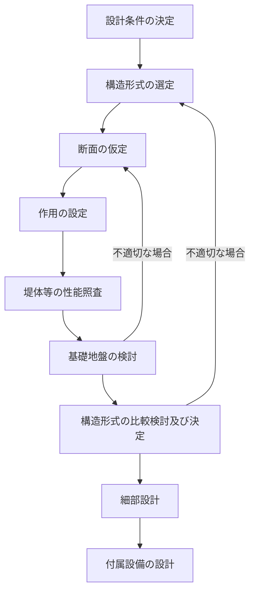
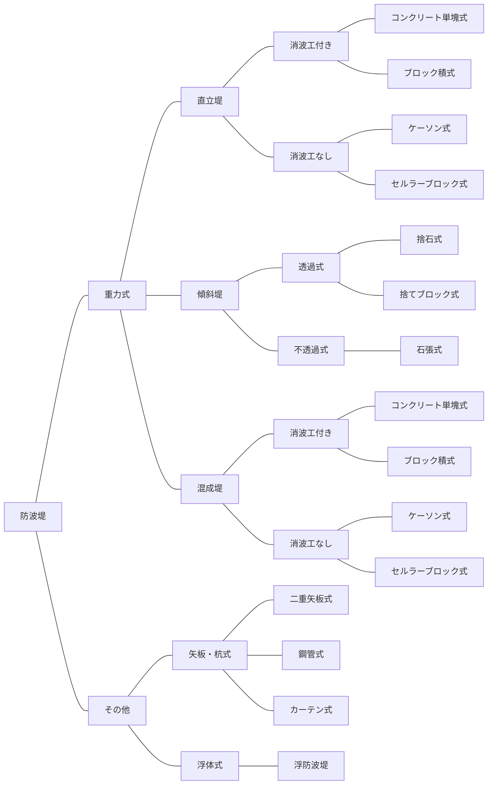

# 第5編 外郭施設

## 第1章 外郭施設の概要

### 1.1 目的

> 外郭施設の目的は、漁港区域内の係留施設、水域施設、機能施設等を波、漂砂、潮汐、河川流、風等による悪影響から防護し、漁船の安全及び円滑な漁港利用を確保することを基本とする。

外郭施設は、自然条件、経済的・社会的条件、周辺の環境に及ぼす影響、経済性、防護される漁港・漁場の施設の利用状況等を考慮して、構造上安全なものとするとともに、求められる機能と的確な工事の実施が確保されるよう設計することを原則とする。

#### (1) 機能と種類

外郭施設は、漁港区域内の漁港・漁場の施設や土地を、波、高潮、漂砂等から防護するための施設の総称であり、漁港漁場整備法第3条に規定される種類としては、防波堤、突堤、護岸、堤防、導流堤、防砂堤、防潮堤、水門、閘門、胸壁がある。

機能上からは、次のように分類できる。

① 港内静穏度の向上……主として防波堤、突堤

② 航路及び泊地の水深の維持……主として防砂堤、導流堤

③ 漁港区域内の土地への波・高潮等による海水の進入の防止……主として護岸、堤防、防潮堤、水門、胸壁

④ 海岸の決壊の防止……主として突堤、堤防、護岸

⑤ 水位調整……閘門

#### (2) 設計上の考慮事項

外郭施設の設計にあたっては、外郭施設が漁港の施設の中でも周辺の自然環境や漁村の景観に影響を与えることが最も懸念される施設であることを斟案しつつ、求められる機能が十分発揮されるよう次の事項について考慮することを原則とする。

① 自然条件

気象・海象条件、地形・地質条件、漂砂の状況、生物の生息状況など

② 経済的・社会的条件

漁業の操業実態、漁船の航行、漁船の諸元、周辺水域における増養殖等の水面の利用状況など

③ 周辺の環境に及ぼす影響

沿岸域における動植物の生態系、自然及び漁村の景観、海浜地形、水質への影響など

④ 工事や施設の維持管理に係る経済性

⑤ 外郭施設によって防護される漁港・漁場の施設の利用状況

係留漁船数、陸揚げ状況など

外郭施設は、前記の事項を考慮しつつ、構造上の安全性を確保するとともに、親水機能を付加する場合にあっては、安全かつ円滑な利用へ配慮した構造とすることが望ましい。

### 1.2 外郭施設の要求性能

> 外郭施設に共通する要求性能は、漁港区域内の係留施設、水域施設、機能施設等に対する波、漂砂、潮汐、河川流、風等による悪影響を低減できるよう十分な機能を有することとする。

外郭施設の設計は、一般に図 5-1-1 の手順により行うことを原則とする。

① 配置の決定 → ② 設計条件の決定 → ③ 構造形式の設定 → ④ 作用の設定 → ⑤ 性能照査 → ⑥ 構造形式の比較検討及び決定 → ⑦ 細部設計 → ⑧ 付属設備の設計

<p className="text-center">図 5-1-1 外郭施設の設計フロー</p>

① 配置の決定

外郭施設の配置によっては、波の収斂を起こしたり、港内の副振動などが生じることがあり、係留施設、水域施設、背後の他の漁港・漁場の施設に悪影響を及ぼす恐れがあるので、十分に検討し配置を決定する。

② 設計条件の決定

設計条件については、「第2編 設計条件」を参照する。

③ 構造形式の設定

設計条件や施工条件等に応じた適切な構造形式を複数設定する。

④ 作用の設定

性能照査に用いる作用には、自重、波力、浮力、土圧、地震力等がある。

⑤ 性能照査

各仮定構造断面の性能照査を行うが、構造断面が決定されるまでには、通常数回に及ぶトライアル計算を行う。

計画地点の自然条件等によって、経済性や安定性の観点のみならず、景観、維持管理、機能性等を考慮した断面とする場合もある。

⑥ 各構造形式の比較検討及び決定

③から⑤の結果を踏まえて、各構造形式について安全性、経済性、施工性、周辺の環境との調和等を検討項目として総合的に評価し、適切な断面を決定する。

⑦ 細部設計

配筋計算、鋼管の継手部分等の細部設計を行う。

⑧ 付帯設備の設計

防波堤を係留施設兼用として使用する場合などは、係船環等の必要な付帯設備の設計を行う。

### 1.3 外郭施設の性能規定

> 外郭施設に共通する性能規定は、以下に定めるとおりとする。
>
> 1.水域環境の保全のための海水交換機能を必要とする外郭施設にあっては、水域の利用形態、流れ及び水質の変化を考慮して、求められる海水交換ができること。
>
> 2.周辺の良好な天然藻場に配慮する必要がある外郭施設にあっては、設計対象施設において、藻場を造成させる機能を有すること。

外郭施設の配置に伴う海浜変形、海水流動環境などの変化を適切な手法で予測し、施設の機能を確保しつつ、周辺の藻場、水質、海水流動などの自然環境に可能な限り影響を及ぼさないよう適切な処置を講じることが望ましい。

環境への配慮については、「本編 12.2 水域環境への配慮」及び「本編 12.3 周辺の藻場への配慮」を参照する。

### 1.4 外郭施設の配置

> 外郭施設の配置については、自然条件、水域の利用状況、漁船の航行、周辺の自然環境への影響等を考慮して、適切に定めることを原則とする。

外郭施設の主要な機能である①港内静穏度の向上、②航路及び泊地の水深の維持のための施設の配置については、次の点を考慮して決定することを原則とする。

#### (1) 港内静穏度の向上

漁港を利用する多くの船舶は小型漁船であることから、港内静穏度の確保について十分配慮する必要がある。

① 最も波高の大きい波浪や発生頻度の高い波浪など港内静穏度に悪影響を及ぼす波浪の方向について考慮する。

② 航路や泊地に反射波や沿い波による悪影響が及ばないようにする。これは漁船のみならず、蓄養・中間育成・養殖施設についても考慮する必要がある。


<p className="text-center">図 5-1-2 反射波、沿い波</p>

③ 海底勾配の急な所で、その直背後に等深線に平行に配置すると、衝撃砕波力や基部の洗掘が発生しやすいので注意を要する。

④ 副振動の起こりやすい配置とならないように留意する（「第2編第2章 潮位」を参照のこと）。

⑤ 屈曲部を設けると、波の集中を招き強大な波力を受ける恐れがあることから、なるべく設けないように留意する。


<p className="text-center">図 5-1-3 屈曲部の設置例</p>

⑥ 島、岬、湾などの自然の地形や水深を有効に利用する。


<p className="text-center">図 5-1-4 島、岬、湾を有効活用した例</p>

#### (2) 航路及び泊地の水深の維持

外洋に面した砂浜海岸に位置する漁港では、漂砂により航路や泊地に土砂が堆積し漁船の安全な航行や停泊に悪影響を及ぼす恐れがあることから、以下の点を考慮して配置を決定するのがよい。

なお、漂砂対策に関しては、近視眼的に漁港周辺のみの漂砂の状況を見るだけでなく、周辺海域における全体的な土砂の移動状況を総合的に判断する必要がある。

① 配置を決定する前に漂砂調査を行い、外郭施設建設に伴う海浜変形や、航路・泊地の埋没現象等を予測する。

② 沿岸流とそれによる漂砂は、砕波帯内で顕著になることから、港口は比較的出現頻度の高い高波浪時の砕波帯の外に設けることが望ましい。港口水深は、移動限界水深（例えば荒天時における完全移動限界水深）を超えることが望ましく、移動限界水深の設定については、波浪の状況（常時の漂砂が問題となっているのか異常荒天時の漂砂が問題となるのか）や、漂砂の状況（浮遊砂が問題となるのか掃流砂が問題となるのか）などによって異なることから、現地の漂砂調査等を行って決定する。

③ 港口からの波による流入土砂量は、おおよそ波高の2〜3乗に比例し、また水深に反比例して増大することから、沿岸流や循環流によって港口水深が浅くならないよう施設配置に注意する。


<p className="text-center">図 5-1-5 港口、航路埋没の模式図</p>

④ 港口の埋没防止のため、漂砂の上手側に突堤などを配置することが有効な場合もある。


<p className="text-center">図 5-1-6 漂砂上手側の漂砂対策例</p>

⑤ 防波堤の遮蔽域では波高分布に起因する港口に向かう循環流が発達し、それに伴う漂砂により港口や航路への土砂の堆積が生じることから、防波堤を副堤にかぶせすぎないようにすることが望ましい。また、下手側に突堤（防砂堤）を設けて循環流を制御することも重要であるが、この場合突堤の位置は、防波堤による回折係数が1.0となる付近に設置するのがよい。


<p className="text-center">図 5-1-7 防波堤の遮蔽域と下手側突堤の設置位置</p>

⑥ 必要に応じてサンドバイパスを実施する。この場合、維持管理費を含めたトータルコストや、周辺の漂砂現象の状況等を十分に検討する必要がある。


<p className="text-center">図 5-1-8 サンドバイパスの模式図</p>

⑦ 漂砂移動の少ない沖側に人工島形式で漁港を建設する場合には、漁港の規模と離岸距離によっては背後の静穏域に海浜循環流と、それによる土砂の堆積を生じたり、周辺海浜の侵食を引き起こす恐れもあるので、事前の漂砂調査を十分に行う必要がある。

また、建設コストが増大し、それに伴い工事が長期間にわたることが多いことから、将来の需要予測等を十分に検討してから計画を決定することが望ましい。


<p className="text-center">図 5-1-9 沖出し人工島形式の例（北海道国縫漁港）</p>

## 第2章 防波堤

### 2.1 防波堤の基本

#### 2.1.1 防波堤の要求性能

> 防波堤の要求性能は、構造形式に応じて、以下の要件を満たしていることとする。
>
> 1.漁港内に侵入する波を低減することができるよう適切なものとする。
>
> 2.自重、浮力、波等の作用に対して構造上安全なものとする。
>
> 3.不特定多数の利用者に供する防波堤にあっては、利用者の安全を確保できるよう適切なものとする。
>
> 4.耐震性能を強化する防波堤にあっては、レベル1地震動又は発生頻度の高い津波を生じさせる地震動に対して構造上安全なものとする。
>
> 5.耐津波性能を強化する防波堤にあっては、設計津波の作用に対して構造上安全なものとする。
>
> 6.特に重要な施設にあっては、設計津波を超える津波に対して、粘り強い構造であることとする。

防波堤は、自然条件、経済的・社会的条件、周辺の環境に及ぼす影響、経済性、防護される漁港・漁場の施設の利用状況等を考慮し、求められる機能が十分発揮できるように設計することを原則とする。

防波堤は、航路や泊地の静穏度の確保を図るための施設であり、その建設により、漁船等の出入港や港内での操船・停泊が容易になり、漁船等の安全を確保することができる。また、陸揚げ作業等の港内作業の円滑化が図られるとともに、岸壁・護岸等の港内施設や漁港の背後地が防護される。さらには、港内の設計条件が緩和され、港内施設の建設費の低減が図られることとなる。

防波堤の配置や設計にあたっては、漁獲物の品質・衛生管理の向上の観点からの港内水質の保全、動植物の生息環境への影響、漂砂による航路・泊地の埋没や周辺の海浜地形への影響、反射波による漁船等の航行への影響等についても十分考慮することを原則とする。

特に、漁港においては、利用する船舶の多くが小型漁船であるため、航行時や停泊時に風や波浪などの影響を受けやすいことから、航路や泊地の静穏度を確保するとともに、必要に応じて防風対策を講じる必要がある。また、一般的に泊地面積が狭いところが多いため、天端高を高くしたり消波工を設置するなどして越波を防止する必要がある。

東日本大震災において、倒壊を免れた防波堤については、津波来襲時において、浸水開始時間遅延による避難時間の確保、流入量低減による被害の軽減、第2波以降の津波に対する減災等の効果が現れたと考えられる他、被災後の施設の早期復旧や漁港の暫定的な利用再開時における港内の静穏度の確保、台風・高潮等に対する二次災害の防止といった一定の機能を発揮している。一方、倒壊した防波堤については、こうした効果が低いことが確認された。また、施設の復旧までに長期間を要しているほか、倒壊施設の取り壊しにより発生した災害廃棄物の処分等の課題ばかりでなく、漁業利用に支障を生じ、漁業活動再開の遅れによる地域経済への影響だけでなく全国的な食料供給に多大な影響を及ぼした。

こうした経験を踏まえ、水産物生産・流通拠点漁港及び防災拠点漁港等においては、大きな被害をもたらす地震やその地震に伴って発生する津波に対しても考慮することとし、漁業活動の安定化や効率的な生産・流通拠点の確保の観点から、漁港の施設の被害を最小限に抑えるとともに、地震・津波の発生後も波浪等に対して漁港の施設の機能を維持できるよう、漁業活動の早期かつ安定した再開に寄与する対策に重点をおくことが望ましい。

なお、設計のフローについては、「本編 1.2　外郭施設の要求性能」の設計のフローに準じることを原則とする。

#### 2.1.2 防波堤の性能規定

> 防波堤に共通する性能規定は、以下に定めるとおりとする。
>
> 1.航路及び泊地の静穏度を満足するように適切に配置され、かつ、所要の諸元を有すること。
>
> 2.消波構造の防波堤にあっては、所要の消波機能を発揮できるよう所要の諸元を有すること。
>
> 3.不特定多数の利用者に供する防波堤にあっては、風、波等の自然状況及び設計対象施設の利用方法等に応じて、利用者の安全を確保できるよう所要の諸元を有すること。
>
> 4.耐震性能を強化する防波堤にあっては、レベル1地震動又は発生頻度の高い津波を生じさせる地震動の作用に対して構造形式に応じた構造の安定性が満足されること。
>
> 5.耐津波性能を強化する防波堤にあっては、設計津波による漁港内の水位上昇及び流速を低減できるよう適切に配置され、かつ、設計津波による作用に対して構造形式に応じた構造の安定性が満足されること。
>
> 6.特に重要な施設にあっては、設計津波を超える津波による作用に対して、可能な限り安定が保たれる構造上の工夫が施されていること。

#### 2.1.3 防波堤の性能照査の基本

**(1) 性能照査の手順**

防波堤の構造形式は、配置条件、自然条件、材料条件、施工条件、経済性等を考慮し、適切に設定することを原則とする。

防波堤を設計するうえで考慮する事項としては、自然条件（潮位、波、流れ等）、材料条件（石材、コンクリート、鉄筋等の強度等）、施工条件（施工期間、施工時期、工事用船舶の諸元等）等があるが、これらを十分に検討したうえで、防波堤本来の機能（背後の漁港の施設や利用漁船等を波浪などの悪影響から防護する）を、十分発揮できるような構造とする必要がある。

防波堤の設計は、一般に次の手順により行うことを原則とする。


<p className="text-center">図 5-2-1 防波堤設計のフロー</p>

**(2) 構造形式の設定**

防波堤の構造形式は、図 5-2-2 のとおり、重力式とその他に大別できる。重力式は波力等の作用に対してコンクリートや石材等の質量で抵抗し安定させるものであり、その他には矢板・杭式及び浮体式の防波堤がある。


<p className="text-center">図 5-2-2 防波堤の構造形式別分類</p>

構造形式は、下記①と②を参考として、適切に選定することを標準とする。

**① 重力式防波堤**

重力式防波堤を構造形式で大別すれば、直立堤、傾斜堤、混成堤の3タイプに分けられる。それぞれの形式における配置条件、自然条件、材料条件及び施工条件の特徴を表 5-2-1 に示す。

<p className="table-title">表 5-2-1 重力式防波堤の特徴</p>

<div className="table-wrapper">

|  | 直立堤 | 傾斜堤 | 混成堤 |
|:---:|:---|:---|:---|
| 配置条件 | 反射波が大きく、配置によっては波の収斂が起こることがある。係船を兼ねる場合に適している。 | 堤敷きが大きいので、港口の幅や利用水域が狭くなる。反射波は少ない。全断面ブロックの場合は透過波が大きくなる。 | 直立堤とほぼ同じである。 |
| 自然条件 | 底面反力が大きく、また水深の浅い箇所では洗掘の恐れもあるので、地盤は堅固でなければならない。強大な波力を受ける箇所に適するものもある。 | 地盤の凹凸、軟弱度合いにさほど関係なく施工できる。ある程度以上強大な波力を受ける箇所では、材料の制約により適さなくなることがある。 | 直立堤や傾斜堤の長所を備えているが、捨石部が洗掘されやすい。水深の大なる箇所に多く用いられる。基礎捨石部の高さ及び肩幅のいかんによっては大きな波力を受けることがある。 |
| 材料条件 | 一般にコンクリート用骨材が容易に入手できることが必要である。 | 水深が大となると多量の石材を必要とする。 | 直立堤と傾斜堤の両形式の特徴をおおね備えている。捨石部の高さを適当に選ぶことによって、材料の供給能力に適合させることができる。 |
| 施工条件 | ケーソン式、ブロック積式ではヤード、積出し施設やその他相当の設備を必要とする。 | ヤード、積出し施設等が必要となる。 | ケーソン式、ブロック積式ではヤード、積出し施設やその他相当の設備を必要とする。基礎部については手戻りが生じやすい。 |

</div>

（注）直立消波堤等特殊構造の防波堤は含まない。

**② その他の防波堤**

その他の防波堤には、矢板・杭式と浮体式がある。主に軟弱地盤が厚く堆積しているところで適用されるが、耐波性能等の観点から波力の強大なところにはあまり適用されない。

<p className="table-title">表 5-2-2 その他の防波堤の特徴</p>

<div className="table-wrapper">

|  | 鋼管式・カーテン式 | 浮体式 |
|:---:|:---|:---|
| 配置条件 | 上部工で利用上十分な幅を確保することが難しい。カーテン式は透過波がある。 | 波高により消波効果が異なる。海水の交流を妨げない。 |
| 自然条件 | 比較的波高の小さい箇所で、軟弱地盤に適用される。地盤の凹凸に関係なく施工できる。 | 大水深、軟弱地盤に適用される。漂砂の移動を妨げない。地盤の凹凸に関係なく施工できる。 |
| 材料条件 | 水深が大きくなると多量の石材を必要とする場合がある。 | 規模が大きくなると、製作場所が限定される。 |
| 施工条件 | 鋼材の打ち込み機械等の相当の設備を必要とする。腐食を十分考慮する必要がある。 | 浮体の設置方法によっては、ヤード、積出し施設等が必要となる。波高の小さい時期に設置する必要がある。 |

</div>

防波堤の構造形式別の模式図を図 5-2-3 に示す。


<p className="text-center">図 5-2-3 構造形式別防波堤模式図</p>

#### 2.1.4 防波堤の性能照査に用いる主な作用

防波堤の性能照査に用いる主な作用については、潮位、波及び波力、漂砂、流れ及び流れの力等がある。設計条件としては、これらの作用及び、土質及び基礎、材料等を考慮することを標準とする。

(1) 潮位については、「第2編第2章　潮位」を参照する。

(2) 波及び波力については、「第2編第3章　波」「第2編第4章　波力」を参照する。

(3) 漂砂の卓越した箇所では、漂砂による影響を考慮する必要がある（「第2編第8章　漂砂」を参照）。

(4) 流れの卓越した箇所では、流れ及び流れの力を考慮する必要がある（「第2編第6章　流れ」を参照）。

(5) 土質及び基礎については、「第2編第9章　土の性質」「第2編第10章　土圧及び水圧」及び「第4編　基礎」を参照する。なお、緩い砂質土地盤においては堤体設置直後の即時沈下が重要となるので留意する必要がある（「第4編 4.5　即時沈下」参照）。

(6) 材料については、「第3編　材料及び諸係数」を参照する。

(7) 漁港の利用状況等により、やむを得ず防波堤に係船するケースもあるが、この場合、荷重や利用漁船により生じるけん引力等の作用を考慮する必要がある（「第2編第13章　荷重」「第2編第14章　漁船」を参照）。

(8) 次の防波堤については、耐震性能・耐津波性能の強化を行うことを原則とする。

- 「第1編 2.2.5（1）耐震強化型の岸壁」の「表 1-2-6　耐震強化型の岸壁の区分」に示された各岸壁の前面の泊地や航路の安全な利用を確保するために必要な主要な防波堤
- 海岸保全施設（防潮堤）と組み合わせた総合的な防災対策が不可欠な防波堤

津波・地震力については、「第2編第5章　津波」「第2編第11章　地震力」を参照する。

また、風対策を講じる必要のある箇所においては、風及び風圧力を考慮する必要がある（「第2編第7章　風」を参照）。

さらに自然環境との調和を図る必要のある箇所では、自然環境に配慮した設計とすることが望ましい。

#### 2.1.5 防波堤の性能照査

**(1) 利用性に関する性能照査**

防波堤の天端高については、防波堤背後の水域の利用等、求められる機能等を考慮して決定することを原則とする。

天端高の決定にあたっては、利用漁船の安全な航行及び安全な停泊上必要な天端高とし、朔望平均満潮面（高潮又は砕波による水位上昇が推定される水域については、適切な偏差を加えた潮位をとる）に、式 5-2-1 に示す高さ（$R_L$）を加えた高さを標準とする（図 5-2-4 参照）。

<div className="scroll-equation">

$$
R_L = 1.0H \tag{式 5-2-1}
$$

</div>

ここに、

- $R_L$：朔望平均満潮面（＋偏差）上の天端高
- $H$：壁体前面の有義波高

越波を阻止したい場合には原則として堤体前面に消波工を設置する。その際の堤体直立部及び消波工の天端高は式 5-2-1 に準じることを原則とする。

ただし、泊地面積が狭く、著しい越波を阻止したい場合の $R_L$ としては、式 5-2-2 を適用してもよい。

<div className="scroll-equation">

$$
R_L = 1.25H \tag{式 5-2-2}
$$

</div>

なお、泊地や航路を確保している防波堤の沖側に、さらに港内の静穏度を向上させるために設置される防波堤において、ある程度の越波を許容しても泊地や航路の静穏度に支障がない場合には、$R_L$ を $0.6H$ まで下げてもよい。

また、海底地形の複雑な箇所等において、上述の算定式に拠りがたい場合には、水理模型実験により、天端高を決定してもよい。


<p className="text-center">図 5-2-4 防波堤の天端高</p>

**(2) 安全性に関する性能照査**

防波堤の安全性に関する性能照査については、原則として「本編 2.2～2.5」の各構造形式の性能照査、及び以下の共通項目を参照する。

**① 防波堤の堤頭部**

> 防波堤の堤頭部は、波の集中と波の複雑な変化を考慮して性能照査することを原則とする。

防波堤の堤頭部は、波の集中や巻波の発生及び地形条件等による急激な流れ等が発生することがあり、標準部に比べて基礎の洗掘や消波ブロックの飛散等が生じる可能性が高い。したがって、堤頭部の被覆石・被覆ブロックや消波ブロックの質量は標準部の質量を割り増したものを用いることが望ましい。なお、消波ブロックで覆われた被覆石・被覆ブロックが、消波ブロックの間隙からの抜け出しや飛散の恐れがない場合には、被覆石・被覆ブロックの質量の割り増しは行わなくてもよい。

直立堤や混成堤を消波ブロックで被覆する場合の消波ブロックの割り増し範囲については、波向、波の収斂範囲及び波のエネルギー分布等を考慮して決定する必要があるが、必要に応じ水理模型実験を行うことが望ましい。

堤頭部の検討にあたっては、次の事項を参考にしてもよい。

a）堤頭部の被覆石・被覆ブロックや消波ブロックの質量は、標準部の質量の 1.5 倍以上としている事例が多い。

b）消波工付直立堤又は混成堤における消波ブロックの割り増し範囲については、消波工の天端で、割り増しするブロックの2個分以上としている例が多いが、ケーソン堤やセルラーブロック堤については、安全性の観点から少なくとも堤頭函分の長さについて消波ブロックを割り増ししている例が多い。

また、堤頭部における消波ブロックの処理（巻立て）方法については、波向、波のエネルギー分布、防波堤の位置、航路への影響、港内進入波、巻波の発生状況、堤体及び消波ブロックの大きさ等を勘案し決定することが望ましいが、堤頭部は、波が複雑に変化し、その現象は未だ定量的に解明されていないのが実状である。このため、設計計算では考慮できない不測の波による被災を防止する目的で、堤頭部の巻立ては図 5-2-5 により行ってもよい。


<p className="text-center">図 5-2-5 消波ブロックの巻立て方法（ブロック2個分割り増す場合）</p>

図 5-2-5 の各ケース選定にあたっては、波の主方向、波のエネルギー分布及び巻波の発生状況を考慮し、以下を参考として適切なものを選定する必要がある。

1）図 5-2-5 の各ケースの選定にあたっては、防波堤法線と波の主方向とのなす角度により、図 5-2-6 を目安としてよい。


<p className="text-center">図 5-2-6 防波堤法線と波の主方向とのなす角度による巻立て方法選定の目安</p>

2）設計条件が類似の近隣の防波堤等の堤頭部において、巻波がかなり激しく発生していたり、堤頭部への波の集中度が高くなる状況が確認される場合等においては、1）によらずケースⅠやケースⅡを選択してもよい。

3）航路への反射波の影響や進入波の港内施設への影響が大きい場合には、1）によらず適宜ケースを選定してもよい。

c）消波工なしの直立堤や混成堤における被覆石・被覆ブロックの割り増し（1.5 倍以上）の範囲については、堤体幅分以上としている例が多い。

d）傾斜堤における消波ブロックの割り増し（1.5 倍以上）の範囲については、傾斜堤の天端で、割り増しするブロックの3個分以上としている例が多い。

e）防波堤堤頭部には、航路標識（燈台や灯標等）が設置されるが、航路標識の管理者と事前調整を十分行ったうえで、航路標識及び防波堤の機能等が損なわれないように、堤頭部の構造を検討する必要がある。

**② 防波堤の隅角部**

> 防波堤の隅角部の性能照査にあたっては、波の集中等による波高の増大を考慮することを原則とする。

**a) 隅角部の波高増大を考慮する条件**

防波堤の隅角部周辺では、傾斜堤や消波工付防波堤の場合を除き、波の集中等により波高が増大するため、このことに十分留意して照査することが望ましい。波高の増大を考慮する条件は、次の 1)、2)の両方を満足する場合とする（図 5-2-7 参照）。

1）隅角部の角度が 165°より小さいこと

2）ハネ堤の長さが隅角部地点の波長の 1/2 より長い凹状の隅角部であること


<p className="text-center">図 5-2-7 防波堤の隅角部</p>

**b) 隅角部の照査**

隅角部が砕波の影響を受ける領域にあるかどうかによって、次のように検討を行うことができる。ここで、砕波の影響を受ける領域は「第2編 3.5.3(1)　波高変化の算定」において 2%減衰線より左側の領域とする。

**1）隅角部が砕波の影響を受けない領域の場合**

砕波の影響を受けない領域における防波堤の隅角部付近の波高分布には、隅角部の角度、波の入射角、ハネ堤等の長さによって防波堤沿いに 1～2 波長（$1L$～$2L$）の長さにわたり隅角部の影響があることが、理論的にも実験的にも確かめられている<sup>1)</sup>。

この影響範囲全てに何らかの対策を講じるには莫大な建設コストを要することから、特に影響の著しい法線変化点の両側それぞれ $L/2$ の範囲について消波工を設置することを標準とする。

ただし、沖防波堤等で背後への越波をある程度許容できる場合については、経済性、施工性の観点から消波工は設置しなくてもよい。この場合、天端高の決定においては、標準部と同一の波高を用い、堤体の性能照査においてのみ、標準部の 1.3 倍の設計波高を用いることを標準とする。

**2）隅角部が砕波の影響を受ける領域の場合**

隅角部が砕波の影響を受ける領域にある場合には、法線変化点の両側 $L/2$ の範囲に消波工を設置する必要がある。なお、堤体の性能照査においては、設計波高の割り増しを行わず、波圧公式については「第2編 4.2.1　直立壁に作用する波力」（消波工なし）を参照する。また、消波工の質量算定に用いる波高についても波高の割り増しをしない。

**③ 耐津波性能の照査**

> 防波堤は、必要に応じて適切な耐津波性能の照査を行うことを原則とする。

「本編 2.1.4 防波堤の性能照査に用いる主な作用（8）」に示した、耐震性能・耐津波性能の強化を行う防波堤については、図 5-2-8 に示す方法により構造形式・断面を決定することを原則とする。

発生頻度の高い津波に対しては、波力及び流体力に対する堤体の安定性（滑動、転倒及び基礎の支持力）や捨石・根固ブロック等の安定性を確保する。さらに、発生頻度の高い津波を超える津波に対しても、施設の機能を維持し続けることで減災効果を期待する観点から、粘り強い構造（堤体の滑動・転倒の抑制及び基礎部分の洗掘防止等の対策）について検討し、必要に応じて対策を講じる。なお、粘り強い構造の検討にあたっては、漁港の施設の利用状況、工事施工上の制約、費用対効果等を総合的に勘案し、効果が高いものを採用する。


<p className="text-center">図 5-2-8 津波に対する防波堤の性能照査フロー</p>

**④ 耐震性能の照査**

> 防波堤は、必要に応じて適切な耐震性能の照査を行うことを原則とする。

「本編 2.1.4 防波堤の性能照査に用いる主な作用(8)」に示した、耐震性能・耐津波性能の強化を行う防波堤については、図 5-2-9 に示す方法で耐震性能の照査を行うことを原則とする。ここで、重力式以外の構造形式の場合、及び「第2編 11.2　耐震性能の照査に用いる震度」表 2-11-1 の外郭施設の設計水平震度が発生頻度の高い津波を生じさせる地震動から求まる設計水平震度よりも大きく、さらに防波堤の断面が耐波性能の照査において滑動に対する安定性で決まっている場合にあっては、耐震性能の照査は省略できる。

上記のほか、内海等で設計波高が小さいが、設置水深が深いため、スレンダーな設計断面となる重力式防波堤については、「第2編第11章　地震力」を参照して、設計水平震度を考慮した設計を行うことを原則とする。ただし、防波堤の断面が波圧時の滑動に対する安定性で決まる場合や重力式以外の構造形式の場合には、耐震性能の照査は省略できる。

地震時に作用する動水圧については、「第2編 10.2.2　動水圧」により、必要に応じて考慮するのがよい。

なお、図 5-2-9 における発生頻度の高い津波を生じさせる地震動の設定にあたっては、中央防災会議等により適切な方法で設定された地震動を用いる。中央防災会議等により地震動が設定されていない場合には、「資料 6.1　地震動及び設計水平震度の算定方法　2.工学的基盤の地震動波形の設定方法（モデル波形を振幅調整する方法）」に示されている手順に基づき地震動を設定してもよい。ただし、この手順を用いる際は、地震学、地盤工学等の専門家のもとで発生頻度の高い津波を生じさせる地震動を引き起こす断層モデルのパラメータ（断層位置、断層の傾き、断層の長さ、マグニチュードなど）の妥当性を確認することを原則とする。

図 5-2-9 における発生頻度の高い津波を生じさせる地震動の設計水平震度の算出は、「第6編 5.4.3　耐震性能に関する性能照査（3）耐震性能に関する性能照査の補足事項　④設計水平震度」によることができる。


<p className="text-center">図 5-2-9 地震に対する防波堤の性能照査フロー</p>

### 2.2 重力式防波堤

#### 2.2.1 重力式防波堤の性能規定

> 重力式防波堤の性能規定は、以下に定めるとおりとする。
>
> 1. 自重、浮力、波等の作用に対して、堤体の滑動及び転倒、基礎の支持力、地盤のすべり破壊等、構造の安定性が満足されること。
> 2. レベル1地震動による影響が想定される重力式防波堤にあっては、自重、浮力、レベル1地震動等の作用に対して、堤体の滑動及び転倒、基礎の支持力等、構造の安定性が満足されること。

#### 2.2.2 重力式防波堤の性能照査の基本

重力式防波堤は、自然条件、材料条件、施工条件、経済性、周辺への影響等を考慮し、求められる機能が十分発揮できるように設計することを原則とする。

重力式防波堤の性能照査の手順及び構造形式の設定については、「本編 2.1.3　防波堤の性能照査の基本」を参照する。

#### 2.2.3 重力式防波堤の性能照査に用いる主な作用

重力式防波堤の性能照査に用いる主な作用は、「本編 2.1.4　防波堤の性能照査に用いる主な作用」を参照する。

#### 2.2.4 重力式防波堤の性能照査

**(1)　利用性に関する性能照査**

重力式防波堤の利用性に関する性能照査については、「本編 2.1.5(1)　利用性に関する性能照査」を参照する。

**(2)　安全性に関する性能照査**

重力式防波堤の安全性に関する性能照査においては、堤体の滑動、転倒、基礎の支持力等について検討することを原則とする。

**① 堤体の滑動に対する検討**

堤体の滑動に対する性能照査は、図 5-2-10 を参照して式 5-2-3 により検討することを標準とする。

<div className="scroll-equation">

$$
F \leqq \frac{\mu W}{P} \tag{式 5-2-3}
$$

</div>

ここに、

- $W$：浮力及び揚圧力を差し引いた堤体重量（地震時の場合は浮力のみ差し引く）（kN）
- $P$：堤体に働く波圧合力あるいは地震時水平力（kN）
- $\mu$：静止摩擦係数（「第3編第5章　諸係数　5.1　摩擦係数」を参照のこと）
- $F$：安全率（1.2 以上）

津波に対する性能照査を行う場合、堤体重量 $W$ としては、谷本式を用いる場合は浮力及び揚圧力を差し引いた重量、水工研式を用いる場合は揚圧力合力（浮力を含む）を差し引いた重量とする。（「第2編 5.2　津波の波力」参照のこと）

なお、コンクリートの打継ぎ目や上部工と堤体工の間等の各層について、原則として同様の計算を行うこととする。またブロック積式、セルラーブロック式の場合の各層についても同様の計算を行うことを原則とする。


<p className="text-center">図 5-2-10 滑動の概念図</p>

**② 堤体の転倒**

堤体の転倒に対する性能照査は、式 5-2-4 により検討することを標準とする。

<div className="scroll-equation">

$$
F \leqq \frac{Wt}{P\ell} \tag{式 5-2-4}
$$

</div>

ここに、

- $W$：浮力及び揚圧力を差し引いた堤体重量（地震時の場合は浮力のみ差し引く）（kN）
- $P$：堤体に働く波圧合力あるいは地震時水平力（kN）
- $t$：堤後趾より $W$ の作用線までの距離（m）
- $\ell$：堤体の底面から堤体に働く波圧合力の作用点までの距離（m）
- $F$：安全率（1.2 以上）

津波に対する性能照査を行う場合、堤体重量 $W$ としては、谷本式を用いる場合は浮力及び揚圧力を差し引いた重量、水工研式を用いる場合は揚圧力合力（浮力を含む）を差し引いた重量とする。（「第2編 5.2　津波の波力」参照のこと）

なお、コンクリートの打継ぎ目や上部工と堤体工の間等の各層について、原則として同様の計算を行うこととする。またブロック積式、セルラーブロック式の場合の各層についても同様の計算を行うことを原則とする。


<p className="text-center">図 5-2-11 転倒の概念図</p>

**③ 基礎の支持力に対する検討**

基礎の支持力に対する検討は「第4編第2章　平面基礎の支持力」により行うことを標準とする。

**④ セルラーブロック式の中詰の抜け出しの検討**

一般に重力式防波堤の性能照査には、堤体の滑り出し、堤体の転倒、基礎の支持力の検討を行っているが、セルラーブロック式については、中詰が抜け出す可能性があるため、底版の有無にかかわらず転倒に対して中詰の抜け出しを考慮した式 5-2-5 を満足することを原則とする。

<div className="scroll-equation">

$$
F = \frac{W \cdot t + M_f}{P \cdot h} \tag{式 5-2-5}
$$

</div>

ここに、

- $W$：壁体に作用する中詰重量を除いた全鉛直力（kN/m）
- $P$：壁体に作用する全水平力（kN/m）
- $t$：壁体に作用する中詰重量を除いた全鉛直力の合力の作用線の壁体後趾からの距離（m）
- $h$：壁体に作用する全水平力の合力の作用線の壁体底面からの高さ（m）
- $F$：安全率（波圧作用時及び津波時 1.2、地震時 1.1）
- $M_f$：中詰による壁面摩擦によって生じる抵抗モーメント（kN・m/m）

<div className="scroll-equation">

$$
M_f = l_1 F_1 + l_2 F_2 \tag{式 5-2-6}
$$

</div>

<div className="scroll-equation">

$$
F_{1or2} = P_{1or2} \cdot f \tag{式 5-2-7}
$$

</div>


<p className="text-center">図 5-2-12 中詰土圧</p>

$H$：$H = b$ とする

$p$：中詰材による土圧強度　$p = KH\gamma$

$K$：土圧係数

$\gamma$：中詰材の単位体積重量

$P_1$, $P_2$：土圧合力

$f$：中詰材と壁面との摩擦係数（0.7）

ただし、セルラーブロックの側面にかかる抵抗力は考慮しない。

また、セルラーブロック内部に対して載荷を伝えない上部コンクリートがある場合には載荷重を考慮しない。

#### 2.2.5 直立堤

直立堤における構造形式は、自然条件、材料条件、施工条件、経済性等を考慮し、適切なものを選定することを原則とする。

天端高については、防波堤背後の水域の利用等、求められる機能等を考慮して決定することを原則とする。

**(1)　構造形式の設定**

直立堤における構造形式には、大別してコンクリート単塊式、ブロック積式、ケーソン式、セルラーブロック式の4つに分けられる。構造形式の選定にあたっては、自然条件、材料条件、施工条件等を考慮し、適切な形式を選定する必要がある。各形式ごとの特徴は表 5-2-3 に示すとおりである。

<p className="table-title">表 5-2-3 直立堤の特徴</p>

<div className="table-wrapper">

|  | 自然条件 | 材料条件 | 施工条件 |
|---|---|---|---|
| コンクリート単塊式 | 岩盤等の堅固な地盤に適する。 | —— | 水中施工の正確を期すため熟練技能者を要する。水深の大なる箇所には適さない。 |
| ブロック積式 | 波浪の強大な箇所には適さない。 | —— | 製作設備が簡単でその補修も比較的容易である。施工も容易であるが海上作業日数が長い。広いブロックヤードが必要である。 |
| ケーソン式 | 大きな波力を受ける箇所に適する。水深の深い箇所に適する。 | 中詰材料を安価に入手できる箇所では、工費節約の点で有利である。 | 施工が確実で海上作業日数を短縮することができる。ケーソンヤード等相当の設備を要する。運搬据付に喫水以上の水深を必要とする。荒天日数が多いと施工日数が著しく制約される。 |
| セルラーブロック式 | 波浪の強大な箇所には適さない。目安として設計波高が3m以上に及ぶ場合には採用をさけた方がよい。 | 中詰材料を安価に入手できる箇所では、工費節約の点で有利である。 |  |

</div>

形式選定にあたっては次の点に留意する必要がある。

**① コンクリート単塊式**

コンクリートの打設現場が洋上の場合、コンクリートの運搬に際して、運搬時間及び運搬量に制約が生じることから、現場条件を十分検討のうえ、採用の適否を検討することが望ましい。特に運搬量については、日当たり打設量を十分に検討しないと、気象・海象の変化から工事に手戻りが生じる恐れがある。

**② ブロック積式**

設計波高の大きい箇所においてブロック積式を採用する場合には、ブロック1個当たりの重量が大きくなり、陸上クレーンや起重機船の吊り上げ能力の関係から施工性が著しく低下する可能性が高い。また、1個あたりの重量低減のために横断方向に2～3個のブロックを並べる方法もあるが、ブロックの全体個数が多くなり、施工日数がかなり長くなる。さらに、堤端部において、波浪等による手戻りも生じやすいことから、一般には設計波高の大きいところでは、採用されていない。

**③ ケーソン式**

ケーソン製作を陸上の製作ヤードで行う場合、製作ヤードのある港が限定されているため、そこから設置箇所までケーソンを曳航しなければならないことから、曳航する海域の気象・海象の状況を把握し、採用の適否を検討する必要がある。また、フローティングドッグやドルフィンドッグにより港内泊地において製作する場合、航路・泊地の水深とケーソンの喫水の関係を明らかにしたうえで、採用の適否を決定する必要がある。

同一漁港内で製作する場合においても、ケーソンの規模にもよるが、ケーソン浮上→曳航→ケーソン据え付け→中詰石投入→中詰石均し→ケーソン蓋据え付け→間詰めコンクリート打設の一連の工程には連続2～3日程度の日数を要することから、設置箇所の気象・海象の状況を把握し、採用の適否を検討する必要がある。

また、ケーソン堤の近年における被災例を見るに、堤体が割れるなどのケースがある。特に設計波高が大きい箇所で、岩盤などを薄く掘削（1m程度）して捨石マウンドを設ける場合において、このような事例が報告されている。被災原因としては捨石部の一部が洗掘されてケーソンが片持梁状態となり堤体が支点から割れたものと推定される。堤体の大きなケーソンは、建設費や復旧費用がかなり大きくなることから、基礎部が波力に対して十分安定であることを確認しつつ、基礎の洗掘が多少生じ、堤体が不安定になっても堤体そのものが破壊しないような構造とすることが望ましい。

**④ セルラーブロック式**

セルラーブロックを据え付ける際には、中詰を投入するまで堤体が不安定であること、あるいはセルラーブロックの動揺に対して中詰が抜け出す恐れがあるなど、施工中も安全が確保できる程度の静穏になる日が連続して確保できないと施工上問題となる。これらの理由から設計波高が大きい場合には、セルラーブロックは採用されていないのが現状である。

**(2)　直立堤の性能照査**

直立堤の性能照査については、「本編 2.1.5　防波堤の性能照査」及び「本編 2.2.4　重力式防波堤の性能照査」を参照する。

**(3)　構造細目**

①に共通する項目、②以降に各形式別の項目を示す。

**① 上部工及び消波工付きの消波工の形状**

上部工の断面形状や、打継ぎ面は、利用形態、施工性、安定性、経済性等を考慮して決定することを原則とする。また、基礎工は、洗掘に対して十分な洗掘防止工を講じるとともに、消波工付きの場合の消波工の形状は、十分な天端高及び天端幅を有することを原則とする。

a）防波堤は、外海から来襲する波を遮り港内を静穏に保ち、かつ漂砂、潮汐の影響を防ぐための施設であるが、漁港の整備の遅れや漁船の増加等により、泊地や保留施設が不足している漁港もあり、やむを得ず漁船を防波堤に係留している場合がある。このような漁港において防波堤の断面形状を検討する場合、防波堤の第1義的な目的を達成することはいうまでもないが、上部工の断面形状決定にあたっては、円滑な漁業活動に支障をきたさないように、必要な平場を上部工に確保することが望ましい。

b）上部工のパラペット部に、ほぞをつくる場合のパラペット部の滑動や転倒に対する性能照査は、図 5-2-13 に示す打継ぎ面で行うことを標準とする。


<p className="text-center">図 5-2-13 パラペット部</p>

また、パラペットの安定のため、鉄筋や形鋼により補強する場合があるが、適切な性能照査により、必要鉄筋量・形鋼の数量や規格等を決定するのがよい。

c）根固めブロックの質量及び形状寸法については、類似実施例や「第2編 4.4　波力に対するブロック等の安定質量」に記述してある質量算定式を参考として決定してもよい。なお、波力の強大な箇所においては、必要に応じ水理模型実験により決定することが望ましい。

d）マウンドのり尻部について、港外側では波高の1.5倍程度の深さまで波の影響が及ぶため、底質が砂質土系の場合には、洗掘及び吸い出し等が生じる恐れがあるので、捨石、グラベルマット、アスファルトマット等の洗掘防止工を行うことが望ましい。また、消波工で被覆された場合には、消波工の下面に設置される捨石の沈下及び洗掘等を考慮し、捨石部に余裕幅を設けるのがよい。

隅角を形成するところなどでは、港外側に洗掘防止として使用したアスファルトマットが、波浪によってめくり上がり、先崩れが生じることもあるので留意する必要がある。

e）消波ブロックで被覆された直立壁に作用する波圧は、「第2編 4.2.2　消波工で被覆された直立壁に作用する波力」に記述されているが、合田式を準用し、消波ブロック被覆堤に応じた波圧補正係数を与えている。これは、消波ブロックの天端が十分に高く広い場合に適用できるものであり、消波工の断面が不足すると消波工へ波が乗り上げることによって波力が逆に増大することがある。したがって消波工付き防波堤の消波工の天端高は、堤体部上部工の天端と同じ高さ、天端幅については安定性、施工性等を考慮し、適切な幅とする必要がある。

また、海底地形の複雑な箇所や特に越波を防止したい箇所で上記に拠りがたい場合は、水理模型実験により消波ブロックの天端高及び天端幅を決定してもよい。

そのほか、次の事項を参考にすることができる。

f）陸側から沖に向かって一文字に延びる防波堤等において、陸上機械による片押し施工が可能なスペースを確保した上部工の断面形状にすると、海上機械を使用して施工するより、建設コストが安価になる場合がある。

g）上部工の厚さは、設計波高や越波量等を考慮し適切に決定する必要があるが、一般に設計波高2m以上の場合は1m以上、設計波高2m未満の場合、50cm以上とすることが望ましい。

h）根固方塊については、洗掘力がそれほど大きくないと考えられる場合（波高4m程度より小さい場合）には1個当たり5～20t程度、波の荒いところでは（波高5m程度より大きい場合）1個当たり30t程度以上の質量を用いている事例が多い。ただし、港内側においては、港内波浪や施工時波浪等を考慮して、質量を1/2程度に低減している事例が多い。

i）消波工の天端幅について、消波効果及び実施例を参考として天端でのブロック個数は2個を標準としている。なお、消波工付き防波堤に作用する波力は、消波工の天端高、天端幅のみならず、波長などにも影響を受けるので、波圧低減効果は来襲する波の波長に対して十分な消波工の幅が必要である。山本の研究 <sup>2)</sup>では、ブロックの設計潮位面上での幅 $B_0$ については波長 $L$ に対して $B_0 > 0.05L$ を満足することが必要であることが示されている。

j）防波堤の堤頭部については、「本編 2.1.5(2) ① 防波堤の堤頭部」を参照する。

k）防波堤の隅角部については、「本編 2.1.5(2) ② 防波堤の隅角部」を参照する。

l）安定性に関するほぞの効果及び鉄筋等により補強する場合の効果については、現地実験等によりその効果を定量的に把握できる場合には、性能照査上考慮してもよい。

**② コンクリート単塊式**

コンクリート単塊式防波堤の細部設計にあたっては、施工条件等を考慮し、適切な形式を用いることを原則とする。

基礎形式にはフラット型とオベリスク型があり、一般には施工性の観点からフラット型が多く用いられている。岩盤が水の影響により強度低下を起こすと想定される場合には、埋め戻しを実施することが望ましい。床掘及び埋め戻しの断面形状については、図 5-2-14 を参考として行ってもよい。

なお、埋め戻しは原則として水中コンクリート又は陸上コンクリートとし、これに拠りがたい場合には袋詰めコンクリートとするのが望ましい。


<p className="text-center">図 5-2-14 水中コンクリート岩着式の基礎形式</p>

また、壁体の滑り出し、壁体の転倒、端趾圧等の検討については、両型ともに図 5-2-14 の B-B 断面で行うものとし、埋め戻しを行う場合の波圧の作用下端は、埋め戻し方法に応じて次のようにすることを標準とする。

a）水中コンクリート又は陸上コンクリートで行う場合には、両型とも図 5-2-14 の A-A 断面まで作用させる。

b）袋詰めコンクリートで行う場合は、両型とも B-B 断面で行う。

**③ ブロック積式**

ブロック積式防波堤の細部設計にあたっては、吊り上げ時、据え付け時及び完成後のそれぞれの状況に応じた作用等を考慮し、構造や形状を決定することを原則とする。

a）ブロックの積み方は水平積みを原則とする。また、ブロックの安定質量は、波力等の作用に対して滑り出し、転倒などを検討して算出されるが、より安全性を高める観点から横断目地を通さないよう設計する必要がある。ただし、不等沈下の恐れがある場合には、連れ込み沈下の影響を軽減するため、横断目地を数十メートル間隔で設けることが望ましい。

b）上部工の場所打ちコンクリートを打設する場合、型枠の取り付け、取り外し及びコンクリート打設時において、施工性を高める観点から最上段のブロックの頂部を平均水面上に出るように設計することが望ましい。また、そうすることにより、より経済的な断面になるケースが多い。

c）ブロックの各層における安全性を高める観点から、ブロックにほぞを設けることが望ましいが、その場合の各層におけるブロックの安定質量算定にあたっては、ほぞなしで計算することを原則とする。

ほぞの断面形状については、一般に図 5-2-15 のようにしているが、ブロックの寸法によっては、これに拠らなくともよい。


<p className="text-center">図 5-2-15 ブロックの一般的形状</p>

d）吊り上げ部に作用する荷重は、ブロック自重、底面付着力、衝撃力とするが、原則として、設計に際しては、底面付着力、衝撃力は一時荷重として同時には作用しないとする。

e）つり鉄筋に作用する荷重及びつり筋の径、埋込み長は次の手順にしたがって決定することができる。

1）つり筋1本当たりに作用する荷重

<div className="scroll-equation">

$$
P = \frac{(W + W' + F)}{N} K \tag{式 5-2-8}
$$

</div>

ここに、

- $P$：つり筋1本当たりに作用する荷重（t／本）
- $W$：ブロック1個当たりの設計質量（t）
- $W'$：ブロック1個当たりの膨らみによる増加質量（t）
- $F$：底面付着力（t）
- $K$：不均等係数（1.8 を標準とする）
- $N$：ブロック1個当たりのつり筋の本数（本）

なお、不均等係数については、つり筋の本数によって値が異なることから、吊り下げ試験などにより適切に求めることが望ましい。一般に、つり筋の本数が少ない場合には不均等係数は小さくなる傾向がある。

2）つり筋の径

i）軸方向引張力からの所要径 $D$（cm）

<div className="scroll-equation">

$$
D = \sqrt{\frac{2P}{\pi \sigma_{sa}}} \tag{式 5-2-9}
$$

</div>

ここに、

- $\sigma_{sa}$：つり筋の許容引張応力度（N/cm<sup>2</sup>）

ii）せん断力からの所要径 $D$（cm）

<div className="scroll-equation">

$$
D = \sqrt{\frac{2P}{\pi \tau_{sa}}} \tag{式 5-2-10}
$$

</div>

ここに、

- $\tau_{sa}$：つり筋の許容せん断応力度（N/cm<sup>2</sup>）

3）吊り筋の埋込み長 $l$（cm）

<div className="scroll-equation">

$$
l \geqq \frac{P}{2\pi D \tau_{0a} m} \tag{式 5-2-11}
$$

</div>

ここに、

- $\tau_{0a}$：吊り上げ時のコンクリートの許容付着応力度（N/cm<sup>2</sup>）
- $m$：フックの効果（1.5）

なお、鉄筋に作用する応力として、上記以外に検討すべきものがあれば、それらも考慮して、材質、寸法を決定する必要がある。

**④ ケーソン式**

ケーソン式防波堤の細部設計にあたっては、進水時、浮揚時、曳航時、据え付け時及び完成後のそれぞれの状況に応じた作用等を考慮し、構造や形状等を決定することを原則とする。

ケーソンの据え付けに際しケーソンを水中に浮揚し曳航する場合には、傾いたり転覆しないような構造とする必要がある。また、ケーソン底面の捨石マウンドが不等沈下を生じる恐れがある場合には、必要に応じてケーソン自体を梁とみなし、その一体性について検討を行うことを原則とする。

なお、吊り上げ式でつり鉄筋を用いる場合については「本編 2.2.5(3)③　ブロック積式」に準じることを原則とする。

a）作用の設定

ケーソンの細部設計を行う場合には、進水時、浮遊時、曳航時、据え付け時及び完成後のそれぞれの状況に応じた作用を設定する必要がある。

b）部材の設計

側壁、隔壁は、三辺固定版として設計することを標準とする。ただし、完成時（上部工設置時）の検討は四辺固定版として設計する必要がある。底版は、四辺固定版として設計することを原則とする。

近年砕波帯内に築造されるケーソンの壁が波浪により破壊される事例が多くなってきている。砕波帯内に計画されるケーソンで、設計波高が比較的大きい場合には、必要に応じ有限要素法等の詳細な構造解析手法によって、壁の安全性を検討することが望ましい。また、法線平行方向から入射する波浪が大きい場合は、堤頭函の法線直角方向の側壁についても波浪に対する安定性の検討を行うことが望ましい。

なお、上部工がかなり厚くなる場合には、上部工による荷重がケーソンの構造に重大な影響を及ぼす可能性もあることから、有限要素法等の詳細な構造解析手法により検討してもよい。

**⑤ セルラーブロック式**

セルラーブロック式防波堤の細部設計にあたっては、施工時、完成後における適切な作用等を設定し、構造や形状等を決定することを原則とする。

a）セルラーブロック式において底版を設置しない場合、波浪等によりセルラーブロックの下部から中詰材が吸い出されることにより転倒したりするケースが過去に多く発生している。このような状況を考慮し、セルラーブロック式においては、底版を設けることが望ましい。

b）セルラーブロックを多段積みする場合は、設計条件、施工条件等を考慮し適切な段数とする。また、多段積みにおける水平継目には凹凸を設けることが望ましい。

c）吊り上げ部に作用する荷重及びつり鉄筋を用いる場合については「本編 2.2.5(3)③　ブロック積式」に準じることを標準とする。

#### 2.2.6 傾斜堤

傾斜堤の構造形式は、自然条件、材料条件、施工条件、経済性等を考慮のうえ、適切なものを選定することを原則とする。

天端高及び天端幅については、堤体の安定や背後の利用状況を考慮し、決定することを原則とする。

**(1)　構造形式の設定**

傾斜堤の構造形式は、大別して捨石式と捨てブロック式の2つに分けられる。構造形式の選定にあたっては、自然条件、材料条件、施工条件等を考慮し、適切な形式を選定する必要がある。各形式ごとの特徴を表 5-2-4 に示すが、この表をもとに比較検討し構造形式を決定することが望ましい。

<p className="table-title">表 5-2-4 傾斜堤の特徴</p>

<div className="table-wrapper">

|  | 自然条件 | 材料条件 | 施工条件 |
|---|---|---|---|
| 捨石式 | 耐波性に限界がある。 | 多量の石材を必要とする。 | —— |
| 捨てブロック式 | 捨石式より大きな波浪が来襲する箇所にも適用しうる。 | 施工設備さえあればブロックの質量を大きくすることができる。 | ブロックヤード及び粘出し設備が必要である。 |

</div>

捨石式には、全断面捨石式と、捨石の表面に被覆ブロックを設置するものがある。また、捨てブロック式には、全断面消波ブロックと、中詰に捨石等を用いたものがある。

なお、傾斜堤の天端高が静水面以下とした形式、いわゆる潜堤形式の構造も近年実施事例が増加してきている。


<p className="text-center">図 5-2-16 傾斜堤及び潜堤の模式断面</p>

**(2)　性能照査**

傾斜堤の性能照査においては、捨石、消波ブロック、被覆材の波力に対する安定質量、基礎の支持力等について検討することを原則とする。

**① 利用性に関する性能照査**

a）天端高

傾斜堤の天端高については、「本編 2.2.5　直立堤」に準じることを原則とするが、潜堤形式の天端高については、所要の波浪低減効果等が得られる高さとすることを標準とする。

b）天端幅

波力等の作用に対し堤体が安定する幅とする必要があるが、背後の航路、泊地の保全あるいは利用漁船、蓄養施設等の保全などについても考慮し、適切な天端幅とする必要がある。

傾斜堤の場合、越波が著しい箇所では天端部分が弱点となりやすい。捨石式の場合には作用する波力等の作用により、すべり等が生じない天端幅とする必要がある。また捨てブロック式の場合には各種実験結果により、ブロック3個並び以上を標準としている。

なお、傾斜堤の伝達波高の算定にあたっては、「第2編 3.7.3　伝達波高」を参照する。

**② 安全性に関する性能照査**

a）捨石及び捨てブロックの波力に対する安定質量

「第2編 4.4　波力に対するブロック等の安定質量」により捨石、消波ブロック、被覆材の安定質量を算定する必要がある。$K_D$ 値や $N_s$ 値については、当該設計条件に適合する不規則波による水理模型実験に基づく適切な値を使用する必要があり、適切な係数がない場合は水理模型実験を行い決定することが望ましい。

b）基礎の支持力

「第4編第2章　平面基礎の支持力」「第4章　基礎地盤の沈下」及び「第5章　斜面の安定」により検討することを原則とする。

**(3)　構造細目**

法面先の基礎部分が洗掘される恐れがある場合には、適切な洗掘防止工を行う必要がある。また、堤体の内部の捨石やブロックは、波力によって吸い出しを受けないように、質量並びに被覆層の厚さ等を定めることを原則とする。

① 天端コンクリートには、傾斜堤の構造特性により、大きな揚圧力が作用する場合があることから、揚圧力軽減のために潮抜孔を設ける必要がある。

② 法面勾配は、性能照査により算定することを原則とする。

③ 底質が砂質土などの侵食を受けやすい地盤で、波浪の激しい箇所や流れの影響が大きい箇所では、法先が洗掘を受け堤体の沈下が生じやすい。このような箇所においては、法先に捨てブロックや洗掘防止マット等を設置する必要がある。洗掘防止用アスファルトマットを用いる場合、その必要厚さや張り出し長等については、民間企業等の最新の知見 <sup>3)</sup>を参考にしてもよい。

④ 堤体の内部は直接波浪の影響を受けないことから、経済性を考慮して、安定質量より小さい質量のものを使用してもよい。ただし、被覆層については、被覆ブロック等の特性を考慮し、中詰材が吸い出しを受けないような対策が必要である（「第2編 4.4　波力に対するブロック等の安定質量」参照のこと）。

そのほか、次の事項を参考にすることができる。

① 法面の勾配は性能照査により決定するが、捨石式での実施例では、港外側1：2程度、港内側1：1.5程度、捨てブロックの場合は1：1.3～1.5程度で実施している例が多い。なお、捨石式でも表層を捨てブロックで被覆する場合は捨てブロック式の勾配で実施している。

② 捨てブロック式の下部に捨石を敷く場合には、図 5-2-17 のとおり余裕幅を設ける必要がある。幅の値については、基礎地盤の沈下あるいは洗掘状況等に応じて決定することが望ましいが一般には1～2m程度としている場合が多い。


<p className="text-center">図 5-2-17 捨てブロック式下部捨石の余裕幅</p>

#### 2.2.7 混成堤

> 混成堤における構造形式は、自然条件、材料条件、施工条件、地盤特性、経済性等を考慮し、適切なものを選定することを原則とする。

> 天端高の算定にあたっては、背後の水域の利用等、求められる機能等を考慮して決定することを原則とする。

混成堤は、捨石部の上に直立壁を設けたもので、波高に比べ捨石の天端高が浅い場合には傾斜堤の機能に近く、深い場合には直立壁の機能に近くなる。特徴としては、直立堤に比べて荷重分散ができることから比較的軟弱な地盤にも適用できること、捨石部の厚さの調整により水深に応じて経済的な断面にできる等の長所がある。一方で堤体直立壁で反射した波によって捨石部が洗掘されやすいという短所がある。

また混成堤における背後への伝達波高は「第2編 3.7.3 伝達波高」を参照する。

##### (1) 性能照査

> 混成堤の性能照査においては、堤体の滑り出し、堤体の転倒、基礎地盤の支持力、円弧すべり、直線すべり及び沈下量等について検討することを原則とする。

混成堤の性能照査については、それぞれ「本編 **2.2.5** 直立堤」「**2.2.6** 傾斜堤」に準じて行うことを標準とする。

##### (2) 構造細目

> 上部工の断面形状や打継ぎ面は、利用形態、施工条件、安定性、経済性等を考慮して決定することを原則とする。また、消波工付きの場合の消波工の形状は、十分な天端高及び天端幅を有し、基礎マウンドについては、衝撃砕波力や洗掘等が生じないよう、適切に定めることを原則とする。

① 上部工及び消波工付きの消波工の形状、及び各形式別の構造細目については、「本編 **2.2.5** 直立堤」に準じることを原則とする。

② 基礎マウンドの肩幅

混成堤におけるマウンド肩幅については、円弧すべり等に対して安全性が確保できる幅以上の十分な長さとすることを原則とする。また、マウンドの被覆の必要性がある場合には被覆ブロックの個数、幅等を考慮に入れる必要がある。

ただし、港外側において捨石マウンドの肩幅を極端に広くとると、マウンド高、波形勾配等によっては、衝撃砕波圧の発生原因となるので十分な注意が必要である。

③ 被覆材の所要質量の算定

被覆材の所要質量算定にあたっては、適切な算定式を用いて求めるとともに、中詰材が吸い出しを受けないような対策が必要である。

そのほか、次の点について留意する必要がある。

① 基礎マウンドの肩幅は、一般に設計波高に応じて表 5-2-5 のように行っているケースが多い。

<p className="table-title">表 5-2-5 基礎マウンドの一般的な天端幅</p>
<div className="table-wrapper">

| 設計波高 H | 基礎マウンド肩幅（港外側） | 基礎マウンド肩幅（港内側） |
|:---:|:---:|:---:|
| H＜3.5m | 3 m以上 | 2 m以上 |
| H≧3.5m | 5 m以上 | 3 m以上 |

</div>

なお、偏心傾斜荷重の性能照査でビショップ法を用いる場合には、ビショップ法で計算された所要の肩幅を満足することを標準とする。

② 被覆材の所要質量の算定にあたっては、「第2編 4.4 波力によるブロック等の安定質量」を参考とする。

地形条件等により算定式に拠りがたい場合には、必要に応じ水理模型実験を行うことが望ましい。

③ 基礎マウンドの厚さは、直立部の荷重を地盤に広く分布させること、及び波による地盤の洗掘を防止するため、一般には 1 m 以上としている。ただし、基礎地盤が岩盤で、岩盤を床掘して捨石を敷きならす場合において、洗掘の恐れが少ないと判断できる箇所については、基礎マウンドの厚さを 50 cm 以上としてもよい。ただし、この場合、使用する石材の寸法を考慮して厚さを決定する必要がある。

④ 直立部付近が洗掘される危険のある場合には、根固方塊で基礎マウンドを保護することが望ましい。

⑤ 津波に対し粘り強い防波堤への補強工法の検討に当たっては、民間企業等の最新の知見 <sup>4)</sup> を参考にしてもよい。

#### 2.2.8 特殊構造重力式防波堤

##### (1) 直立消波ブロック式防波堤

> 直立消波ブロック式防波堤の設計にあたっては、自然条件、施工条件、機能性、ブロック特性等を考慮することを原則とする。

直立消波ブロック式防波堤において使用するブロックは、自然条件、施工条件、機能性、消波特性等を考慮し、適切なものを選定することを原則とする。

直立消波ブロック式防波堤は、図 5-2-18 に示すように消波機能を有した特殊なブロックを直積みするものである。形状としては、直立堤及び混成堤のタイプがある。

直立消波ブロック式の特徴としては、次のような事項が挙げられる。

a）直立堤に比べて反射波高、伝達波高、波力を軽減できるが、一般の消波工付き重力式防波堤よりは、大きくなる。

b）航路や泊地が狭隘な漁港内で消波機能が必要な内港防波堤などに適用されている場合が多い。また、前面の漁場などへの反射波を防止したい場合や軟弱地盤で消波工を設置すると建設費が大幅に上昇する場合において、波高が比較的小さい箇所で用いられていることが多い。

c）特殊な大型のブロックを除き、一般には波高の小さいところで適用されているケースが多い。また、直立消波ブロック式防波堤における消波・反射構造は、各ブロックによって異なっており、設置箇所の波高や周期を十分検討する必要がある。特に周期によって、消波機能等は大きく異なるので、適切な水理模型実験を行うことが望ましい。

直立消波ブロック式防波堤の設計に際しては、「本編 **2.1.4** 防波堤の性能照査に用いる主な作用」「**2.2.5** 直立堤」「**2.2.7** 混成堤」に準じることを原則とする。また、作用する波力の算定にあたっては、「第2編 4.2.5 直立消波ブロック堤に作用する波力」を用いることを基本とする。


<p className="text-center">図 5-2-18 直立消波ブロック堤</p>

このほか、次の点について留意する必要がある。

a）越波量

直立消波ブロック式防波堤背後への越波量については、直立堤と比較し越波量の低減効果があるといわれている。越波量は、各種ブロックの形状によって異なることから、適切な水理模型実験や算定式等により決定することが望ましい。なお、波浪条件、海底地形の形状、波浪に対する防波堤の角度及び防波堤ブロックの形状などによって一概にはいえないが、越波量は、直立壁と消波工付き直立堤の間となると推定される。

b）直立消波ブロック式の堤体工天端高

直立消波ブロック式の堤体工天端高は、図 5-2-19 に示すように、H.W.L＋0.5H より高く、下端高は L.W.L－2.0H程度以深まで確保することが望ましい。ただし、各直立消波ブロックの実験データが信頼のおけるものである場合には、それぞれのデータによることができる。なお、直立消波ブロック式の堤体工天端高を決定する際には、上部コンクリートが構造上必要な厚さを確保できるよう留意する。また、性能照査で用いる波と消波機能を検討する際に用いる波は異なる場合が多いことに留意する。


<p className="text-center">図 5-2-19 直立消波ブロックの天端高</p>

c）上部工

上部工には局所的に大きな揚圧力が作用することがあるので、必要に応じて上部工下面に作用する揚圧力を水理模型実験によって求めてもよい。

##### (2) 直立消波ケーソン（スリットケーソン）式防波堤

> 直立消波ケーソン式防波堤の設計にあたっては、自然条件、施工条件、機能性、ケーソンの特性等を考慮することを原則とする。

> また、直立消波ケーソンは、自然条件、施工条件、機能性、消波特性等を考慮し、適切なものを選定することを原則とする。

直立消波ケーソン式防波堤は、構造形式上の分類からいえばケーソン式に属するが、その構造は透過部材と遊水部を組み合わせた直立消波部をケーソンの前面に有し、背面のケーソンと一体構造としたものである。形状としては、直立堤及び混成堤のタイプがある。

直立消波ケーソン式防波堤の特徴としては次の事項が挙げられる。

a）直立堤に比べて反射波高、伝達波高、波力を軽減できるが、一般の消波工付き防波堤よりは、大きくなる。

b）ケーソン式であるため、比較的波力の大きい箇所や水深の深い箇所に設置されることが多い。

c）前面の漁場などへの反射波を防止したい場合で、かつ軟弱地盤で消波工を設置すると建設費が大幅に上昇する場合などの箇所で用いられていることが多い。

d）構造の特殊性により製作場所及び曳航の方法等に制限されるため、設計にあたっては、施工計画を十分検討する必要がある。

また、直立消波ケーソン式防波堤における消波・反射構造は、スリット及び遊水室の形状によって異なっており、設置箇所の波高や周期を十分検討する必要がある。

直立消波ケーソン式防波堤の代表的なものには、図 5-2-20 に示す縦スリット型がある。

なお、直立消波ケーソン式防波堤の設計に際しては、「本編 **2.1.4** 防波堤の性能照査に用いる主な作用」「**2.2.5** 直立堤」「**2.2.7** 混成堤」に準じることを原則とする。また、作用する波力の算定にあたっては、「第2編 4.2.6 直立消波ケーソン（スリットケーソン）に作用する波力」を用いることを基本とする。


<p className="text-center">図 5-2-20 直立消波ケーソン式防波堤</p>

##### (3) 合成版式ケーソン（ハイブリッドケーソン）式防波堤

> 合成版式ケーソン防波堤の設計にあたっては、自然条件、施工条件、機能性、ケーソンの特性等を考慮することを原則とする。

> また、合成版式ケーソンのねじれ、水平ずれ力、張り出し部については、十分留意することを原則とする。

図 5-2-21 に示す合成版式ケーソン（ハイブリッドケーソン）防波堤は、鋼板と鉄筋コンクリートをずれ止め用のスタッドで一体化した合成版による外壁及び底版と鋼板の隔壁で構成されているケーソンである。広く用いられている鉄筋コンクリートケーソンに比べて一般に次のような特徴がある。

a）同一版厚であれば大きな部材強度が得られる。

b）版厚を薄くでき、軽量化による長大化、また浮遊時の喫水の減少が図れる。

c）鉄筋コンクリートケーソン式防波堤（以下 RC ケーソン式防波堤という。）の場合には、フーチングの張り出しは通常 1.5 m 程度までであるが、合成版式ケーソン防波堤の場合のフーチングの張り出しは、これ以上に大きくでき、張り出し長による底面反力の調整により軟弱地盤への適合性が高い。これまでの施工実績によれば、張り出し長を 5 m 程度にした例がある。

また合成版式ケーソン防波堤の設計については、通常の RC ケーソン式防波堤と同じ設計手順にて行うことを原則とするが、次の点に留意して設計する必要がある。

a）在来の RC ケーソン式防波堤に比べて、以下のように異なった形状あるいは寸法を設計する場合には、特にねじれに注意して設計する必要がある。RC ケーソン式においては、一般に $\boxtimes$（幅）／$\boxtimes$（長さ）が 0.5〜2.0 の範囲内にある。この範囲に収まらない形状とする場合にはねじれの影響について検討することが望ましい。

b）外壁、底版における合成版の版厚は応力計算により定める必要があるが、一般には外壁 30 cm、底版 40 cm 程度のものが施工実績として多い。

c）フーチングの張り出しが大きくなった場合の揚圧力の算定は、通常の RC ケーソン式と同じ考え方で行ってもよい。

d）ずれ止め用には、頭付きスタッド（JISB1198に規定）を使用している例が多い。

スタッドの本数は、（水平ずれ応力）／（スタッドの許容ずれ力）により求める必要がある。

スタッドの許容ずれ力は表 5-2-6 に示す値を安全率 3 で除した値を用いてもよい。

スタッドの径 $\phi$ と鋼板厚 $t$ の関係は、施工性を考慮し、$\phi \leqq 2.5t$ としている。また、スタッドの最大間隔は、合成版ないし、60 cm を超えないものとして設計している例が多く、最小間隔としては、施工性により 8 cm 以上としている。

ずれ止めとしては、突起鋼板を使用するケースもあるが、許容付着力については、実験により定めることが望ましい。

<p className="table-title">表 5-2-6 スタッドの耐力（N/本）</p>
<div className="table-wrapper">

| スタッドのサイズ（mm） | $\sigma_{ck}$ = 180 N/cm² | $\sigma_{ck}$ = 240 N/cm² | $\sigma_{ck}$ = 300 N/cm² | $\sigma_{ck}$ = 400 N/cm² |
|:---:|:---:|:---:|:---:|:---:|
| 13φ×65 以上 | 4.4 | 4.7 | 5.0 | 5.6 |
| 16φ×75 以上 | 6.7 | 7.3 | 7.8 | 8.8 |
| 19φ×75 以上 | 8.0 | 8.6 | 9.2 | 10.2 |
| 19φ×100 以上 | 9.2 | 9.9 | 10.5 | 11.6 |
| 22φ×100 以上 | 11.4 | 12.4 | 13.3 | 14.9 |
| 25φ×100 以上 | 14.3 | 15.3 | 16.3 | 18.0 |

</div>

e）水平ずれ力については式 5-2-12 により、算定することができる。

<div className="scroll-equation">

$$
\tau = \frac{Q}{b} = \frac{SG}{bI} \text{ (N/cm}^2\text{)} \tag{式 5-2-12}
$$

</div>

ここに、

- $\tau$：水平ずれ応力度（N/cm²）
- $Q$：せん断力（N）
- $S$：水平ずれ力（N/cm）
- $G$：着目断面より外側にある総断面積の中立軸回りの断面1次モーメント（cm³）（コンクリート換算）
- $b$：着目幅（cm）
- $I$：総断面積の中立軸回りの断面2次モーメント（cm⁴）（コンクリート換算）

なお、正の曲げモーメント（鋼板に引っ張り力が作用）位置では、水平ずれ力算定にあたって式 5-2-13 を用いてもよい。

<div className="scroll-equation">

$$
\tau = \frac{Q}{b} = \frac{S}{jb^2} \tag{式 5-2-13}
$$

</div>

負の曲げモーメント（鋼板に圧縮力が作用）位置では、鋼板の圧縮に対する安全性を検討する必要がある。

f）合成版式ケーソン防波堤の設計に際しては、「本編 **2.1.4** 防波堤の性能照査に用いる主な作用」「**2.2.5** 直立堤」「**2.2.7** 混成堤」に準じることを原則とする。また、作用する波力の算定にあたっては、「第2編第4章 波力」を用いることを基本とする。

g）鋼板隔壁には、一般に補剛材を設けている。鋼板隔壁の設計に際しては、「道路橋示方書・同解説Ⅱ 鋼橋編」<sup>5)</sup>などを参考として設計してもよい。

h）溶接部の設計に際しては、「道路橋示方書・同解説Ⅱ 鋼橋編」<sup>5)</sup>に準じることを基本とする。

i）その他設計細目については、「本編 **2.2.5(3)④** ケーソン式」に準じることを基本とする。

j）合成版ケーソンは、波圧が作用する面は直立のものが多かったが、近年において前面にスリットを設けたものが出てきている。よって合成版ケーソンの形状により、適切な算定式を用いる必要がある。


<p className="text-center">図 5-2-21 合成版ケーソン（ハイブリッドケーソン）式防波堤</p>

なお、さらに細部の設計については、既往の調査研究成果 <sup>6)</sup>等を参照することができる。

##### (4) 遊水部付き消波工を有する防波堤

> 遊水部付き消波工を有する防波堤の設計にあたっては、自然条件、施工条件、機能性、遊水部の長さ、消波工の形状等を考慮することを原則とする。

> 消波工の天端の高さ及び遊水部の長さについては、衝撃砕波力が発生しないよう十分留意することを原則とする。

遊水部付き消波工を有する防波堤は、直立壁前面から直立壁設置水深における波長の 1 割程度の距離において消波工を設置したもので、越波を抑制するのに効果がある。また施工するうえでは通常消波工を先行して実施するため、波浪条件の厳しい箇所にも適している。

消波工の天端が低い場合には、条件によって衝撃砕波力が発生するため、直立壁に作用する波圧が大きくなることがある。また、遊水部の長さは、0.1L（L：波長）程度までは長くなるに従い防波堤に作用する波圧が減少する傾向が見られるが、それ以上長くしても波圧の減少は少ないので 0.1L程度が適切である。

消波工の天端高については、「第2編第4章 波力」に拠ることを原則とするが、必要に応じて水理模型実験を行うことが望ましい。

また、消波工のブロック質量算定にあたっては、消波工の法先水深における進行波としての有義波高を別途算定して用いることを原則とする。

遊水部付き消波工を有する防波堤の設計に際しては、「本編 **2.1.4** 防波堤の性能照査に用いる主な作用」「**2.2.5** 直立堤」「**2.2.6** 傾斜堤」「**2.2.7** 混成堤」に準じることを原則とするが、必要に応じて水理模型実験を行うことが望ましい。

直立壁天端の高さについては、「本編 **2.1.5(1)** 利用性に関する性能照査」に準じることを原則とするが、必要に応じて水理模型実験を行う必要がある。

直立壁に作用する波力の算定にあたっては、「第2編 4.2.3 遊水部付き消波工を有する直立壁に作用する波力」を用いることを基本とする。

このタイプの防波堤を採用するケースとしては、自然条件、施工条件等により種々あるが、代表的なケースとして次の 2 点が挙げられる。

a）既設防波堤の天端高を嵩上げせずに越波を抑えたい場合

b）防波堤直下の地盤が軟弱であり、防波堤体直前面に消波工を設置すると建設コストがかなり大きくなる場合

##### (5) 潜堤を有する防波堤

> 潜堤を有する防波堤の設計にあたっては、自然条件、施工条件、機能性、遊水部の長さ、潜堤の形状等を考慮することを原則とする。

> また、潜堤の天端の高さ及び遊水部の長さについては、衝撃砕波力が発生しないよう十分留意することを原則とする。

潜堤を有する防波堤は、直立壁前面に潜堤を設置したもので、越波を抑制するのに効果がある。また適切な条件であれば「本編 **2.2.8(4)** 遊水部付き消波工を有する防波堤」と同様に、波浪条件の厳しい箇所にも適用できる。

潜堤の天端高と設置水深の関係及び潜堤と直立壁の設置位置の関係が「第2編 4.2.4 潜堤を有する直立壁に作用する波力」に示す範囲にない場合には、条件によって衝撃砕波力が発生するため、この範囲内とする必要がある。

また、潜堤の天端高、天端幅及び安定質量の算定については、「本編 **2.2.6** 傾斜堤」に準じることを原則とする。

潜堤のブロックや被覆材の質量算定にあたっては、潜堤の法先水深における進行波としての有義波高を別途算出して用いることが望ましい。

遊水部付き潜堤を有する防波堤の設計に際しては、「本編 **2.1.4** 防波堤の性能照査に用いる主な作用」「**2.2.5** 直立堤」「**2.2.6** 傾斜堤」「**2.2.7** 混成堤」に準じることを原則とするが、必要に応じて水理模型実験を行うことが望ましい。

直立壁に作用する波力の算定にあたっては、「第2編 4.2.4 潜堤を有する直立壁に作用する波力」を用いることを基本とする。

#### 2.2.9 付属設備

> 防波堤の付属設備は、安全上あるいは利用上等の観点から必要な施設を設置することを原則とする。

灯台、標識灯等の施設は利用漁船の安全な航行上必要不可欠なものである。これらの施設の配置、構造等については、海上保安部と十分協議し、防波堤の安全性と併せて検討のうえ設置する必要がある。

係船柱、係船環、防衝施設、はしご、防護柵、車止め、照明設備等の施設は、防波堤を係留施設兼用として使用する場合に設置される。その配置や規格等については、「第6編 10.1 付属設備」を参考とする。

### 2.3 矢板・杭式防波堤

#### 2.3.1 矢板・杭式防波堤の性能規定

> 矢板・杭式防波堤の性能規定は、以下に定めるとおりとする。
>
> 1. 自重、波等の作用に対して、矢板又は杭が構造の安定に必要な根入れ長を有し、かつ、矢板又は杭に生じる応力が許容値以下となるよう所要の諸元を有すること。また、杭に作用する軸方向力が地盤の許容支持力以下となること。
>
> 2. レベル 1 地震動による影響が想定される矢板・杭式防波堤にあっては、自重、レベル 1 地震動等の作用に対して、矢板又は杭が構造の安定に必要な根入れ長を有し、かつ、矢板又は杭に生じる応力が許容値以下となること。また、杭に作用する軸方向力が地盤の許容支持力以下となること。

#### 2.3.2 鋼管式防波堤

> 鋼管式防波堤は、自然条件、施工条件、経済性などを考慮して、求められる機能が十分発揮できるように設計することを原則とする。

##### (1) 性能照査の基本

① 性能照査の手順

鋼管式防波堤の設計の標準的な手順を図 5-2-22 に示す。

```
設計条件の決定
　　↓
断面の仮定　←─┐
　　↓　　　　　│
外力の設定　　　│
　　↓　　　　　│
杭断面応力の検討─┘
　　↓
杭根入れ長の検討─┐
　　↓　　　　　　│
基礎地盤の検討　←┘
　　↓
構造諸元の決定
　　↓
杭頭部の設計
　　↓
上部工の設計
　　↓
その他細部設計
　　↓
付属設備の設計
```

<p className="text-center">図 5-2-22 鋼管式防波堤の設計フロー</p>

② 構造形式の設定

鋼管式防波堤は、鋼管杭又は鋼管矢板を法線方向に連続して打ち込み、杭頭を鉄筋コンクリートで緊結したもので、地盤が軟弱で、水深が深く、かつ、波高が比較的小さい箇所（2〜3m 以下）に用いられることが多い。

鋼管式防波堤には、以下のような特徴が挙げられる。

- 施工が容易である。
- 上部工において利用上必要とする十分な幅を確保することが難しい。
- 波浪による水平力に対して変位が大きくなりやすい。

鋼管式防波堤の事例を図 5-2-23 に示す。


<p className="text-center">図 5-2-23 鋼管式防波堤の事例</p>

##### (2) 性能照査に用いる主な作用

鋼管式防波堤の設計条件については、設計波浪（波高、周期、波向）、潮位及び水深、地盤条件、漁船の利用の有無等を考慮するのがよい。

鋼管式防波堤に作用する外力については、波高、周期、波向などの設計波浪及び潮位、水深などの条件から、構造物に最も危険側に作用する条件を抽出し、「第2編 3.2 設計に用いる波の決定方針」に準じて条件設定及び外力算出を行うのがよい。

設定された外力に対し、杭構造としての検討、すなわち軸直角方向の安定性、根入れ長、軸方向支持力、杭頭変位に関する検討を行うのがよい。このため、「第4編 3.3 杭の軸方向の許容支持力」、「3.4 杭の許容引抜き力」及び「3.5 杭の軸直角方向に働く力による杭の挙動」により基礎部の設計を行ってもよい。

##### (3) 性能照査

① 利用性に関する性能照査

上部工については漁船などが利用する場合もあり、現地の利用状況を十分に考慮して、形状を設定するのがよい。なお、その際の漁船の諸元などについては、「第2編 14.1 漁船等の諸元」により決定してよい。

② 構造物の安全性に関する性能照査

a）堤体の設計

堤体は、地上に突出している杭として、波浪による水平力などの外力に対して十分抵抗できるものとするのがよい。

波圧の算定は、設計波浪を用いて「第2編 4.2 直立壁に作用する波力」により、堤体に最も大きな波力を与える潮位において行うのがよい。なお、砕波の作用するところに用いるのは避けた方がよい。

津波に対する性能照査を行う場合、「第2編 5.2 津波の波力」により波力を算定し、異常時としての安全率、許容応力度により設計するのがよい。

鋼管部の設計は、「第4編第3章 杭基礎の支持力」に示される手法により、軸方向支持力断面の応力度及び杭頭の変位量を照査してもよい。この場合、地上に突出している杭のモデルを用いるものとする。また、考慮する外力としては、主に波浪であり、その他の外力は必要に応じて与えてよい。

杭の横抵抗に対し必要な根入れ長は、「第4編 3.5 杭の軸直角方向に働く力による杭の挙動」に示される次式で定めてもよい。

<div className="scroll-equation">

$$
L \geqq \frac{3}{\beta} \tag{式 5-2-14}
$$

</div>

ここに、

- $L$：杭の必要根入れ長（地表面下の長さ）（m）
- $\beta$：チャンの方法による特性値（/m）

ただし、海底面付近に軟弱層が深く広がっている場合は、図 5-2-24 のように表層を砂・捨石で置き換えるか、又は N 値=0 の軟弱層の横方向抵抗を無視して根入れ長を決定してよい。

また、杭の先端下近くに支持層がある場合には、そこまで根入れしてよい。


<p className="text-center">図 5-2-24 軟弱層が存在する場合の根入れ長の決め方</p>

杭頭の変位は、次の方法により算定してよい。

波圧合力作用位置での水平変位を次式で求める。

<div className="scroll-equation">

$$
y_1 = \frac{2(1 + \beta h)^3 + 1}{6EI\beta^3} H \tag{式 5-2-15}
$$

</div>

ここに、

- $y_1$：波圧合力作用位置での水平変位（m）
- $\beta$：チャンの方法による特性値（/m）
- $h$：天端面から波圧合力作用点までの高さ（m）
- $H$：波圧合力の大きさ（kN）
- $EI$：杭の曲げ剛性（kN・m²）

波圧合力作用位置でのたわみ角を次式で求めてよい。

<div className="scroll-equation">

$$
\theta_1 = \frac{(1 + \beta h)^2}{2EI\beta^2} H \tag{式 5-2-16}
$$

</div>

ここに、

- $\theta_1$：波圧合力作用位置でのたわみ角

杭頭変位を次式で求めてよい。

<div className="scroll-equation">

$$
y_{top} = y_1 + l \cdot \theta_1 \tag{式 5-2-17}
$$

</div>

ここに、

- $y_{top}$：杭頭変位（m）
- $l$：波圧合力作用位置から杭頭までの長さ（m）

杭頭変位図の例を図 5-2-25 に示す。


<p className="text-center">図 5-2-25 杭頭変位図の例</p>

捨石部は、地盤強度を増し、杭の支持力を増加させる効果がある。捨石層の設計は、以下の方法により行ってもよい。

捨石層の層厚は、$1/\beta$ 以上を必要とする。なお、原地盤が軟弱でなく層厚が $1/\beta$ または、$l_{m1}/2$ 以上あれば一層厚として取り扱ってよい。ここで $l_{m1}$ は、曲げモーメント第一ゼロ点の深さを表す。

捨石の天端幅は、$2L_1$ 以上とし、$L_1$ は次式により求めてよい。

<div className="scroll-equation">

$$
L_1 \geqq \frac{1}{3} l_{m1} \cot \zeta_p \tag{式 5-2-18}
$$

</div>

ここに、

- $\zeta_p$：受働崩壊角（45°－$\phi$/2）
- $\phi$：捨石の内部摩擦角

捨石の質量は、「第2編 4.4 波力に対するブロック等の安定質量」により求めてよい。また、捨石の載荷による圧密沈下の発生と、これに伴う負の周面摩擦力の発生について、「第4編第3章 杭基礎の支持力」、「第4編第4章 基礎地盤の沈下」により適切に考慮するのがよい。

洗掘により構造物の安定が損なわれないよう配慮するのがよい。

b）上部工の設計

上部工の形状は、安全性や防波堤背後の利用などを考慮し、配筋設計は、外力と自重を考慮して行うものとするのがよい。

上部工のコンクリートから杭の軸方向への荷重の伝達については、コンクリートと杭の外周面の間に働く付着応力度が許容応力度以内になるようにする。

なお、上部工の配筋事例を図 5-2-26 に示す。


<p className="text-center">図 5-2-26 上部コンクリートの配筋事例</p>

#### 2.3.3 カーテン式防波堤

> カーテン式防波堤は、自然条件、施工条件、経済性などを考慮して、求められる機能が十分発揮できるように設計することを原則とする。

##### (1) 性能照査の基本

① 性能照査の手順

カーテン式防波堤の設計の標準的な手順を図 5-2-27 に示す。

```
設計条件の決定
　　↓
断面の仮定　←─┐
　　↓　　　　　│
外力の設定　　　│
　　↓　　　　　│
杭断面応力の検討─┘
　　↓
杭根入れ長の検討─┐
　　↓　　　　　　│
基礎地盤の検討　←┘
　　↓
断面の決定
　　↓
杭頭部の設計
　　↓
上部工の設計
　　↓
その他細部設計
　　↓
付属設備の設計
```

<p className="text-center">図 5-2-27 カーテン式防波堤の設計フロー</p>

② 構造形式の設定

カーテン式防波堤は、鋼管杭または H 型鋼杭を打ち込み、水面付近にだけ直立壁を設けた構造である。大きな波が来襲するような箇所でなく、港内または入江等で特に地盤の軟弱なところに適する。

カーテン式防波堤は一般に、以下のような特徴を有す。

- 海水交流効果が大きい。
- 背後を係船岸として使いにくい。
- 波浪が大きい箇所、あるいは波長の長い波が侵入する箇所には適さない。
- カーテンウォール下部の流速が大きくなることもあるので、この場合は適当な洗掘防止の対策を考慮する必要がある。

カーテン式防波堤の事例を図 5-2-28 に示す。


<p className="text-center">図 5-2-28 カーテン式防波堤の事例</p>

##### (2) 性能照査に用いる主な作用

カーテン式防波堤の設計条件は、波力、潮位、地盤条件、消波特性（伝達率及び反射率）などを考慮するのがよい。

カーテン式防波堤は、消波性能を有するカーテン壁とそれを支持する支持構造物（一般には鋼管杭構造）及び上部工により構成されている。

a）カーテン式防波堤の機能に係る設計条件

- 伝達・消波の対象波浪（波高、周期、波向）
- 潮位及び水深
- 港内許容波高

b）カーテン式防波堤の安定性に係る設計条件

- 設計波浪（波高、周期、波向）
- 潮位及び水深
- 地盤条件

##### (3) 性能照査

① 利用性に関する性能照査

対象波浪の波高と、利用上の観点から与えられる港内許容波高の比として波高伝達率が定まる。水深、潮位及び波高伝達率より、カーテンに必要な天端高及び下端高を決定するのがよい。

② 構造物の安全性に関する性能照査

支持構造物及び支持構造物とカーテン壁の固定部は、カーテン壁が受ける波力に対して、部材強度及び支持力を有するように設計を行う。

津波に対する性能照査を行う場合、「第2編 5.2 津波の波力」により波力を算定し、異常時としての安全率、許容応力度により設計するのがよい。

a）カーテン壁の設計

カーテン壁の設計にあたっては、対象波に対して必要とする消波性能、伝達性能を確保するとともに、波浪などによる水平力などの外力に対して安定するものとするのがよい。

カーテン式防波堤はカーテン部のスリット又は前後カーテン間の遊水部で消波する働きを持つものであるから、その形状及び来襲波浪の特性によって作用する波力も異なる。このため、現在のところ、汎用的な波力の算定式がなく、設計にあたって水理模型実験などで確認することを原則とする。

ただし、一般に一重カーテン式の場合の波圧の算定については、「第2編 4.2 直立壁に作用する波力」により、堤体に最も大きな波力を与える潮位に対して行ってもよい。波力は港外側からの場合と港内側からの場合があり、最も危険な場合について求めるのがよい。

一重カーテン壁の天端高の決定には、図 5-2-29 <sup>7)</sup>を用いてよい。ただし、図 5-2-29 は、d/h=1.0 で R/H=1.25 となるように修正した、一重カーテンに対する図であり、完全に越波を防止できる天端を示したものではない。

カーテン壁の下端高も、模型実験により求めるのが望ましい。ただし、一重カーテンの場合、港内許容波高をもとにカーテン式防波堤が有すべき波高伝達率を算定すれば、図 5-2-30 <sup>7)</sup>により下端高を決定できる。また、防波堤天端よりの越波を許す場合は、天端からの越波による波高伝達率も考慮に加えて算定するのがよい。なお、図 5-2-30 は規則波による実験結果に基づくものであるが、換算沖波波高の 0.5 倍程度の水深より深い箇所においては、不規則波として算定される波高が規則波とほぼ等しいことから、本図を適用して構わない。ただし、水深がそれよりも浅い箇所にカーテン式防波堤が設置される場合など、本図によりがたい場合は、模型実験などによって評価することが望ましい。

カーテン式防波堤は、浅海波領域では波高伝達率が大きくなるため不向きであり、水深波長比（h/L）が 0.2 程度より大きい中間領域から深海波領域に適する。

カーテン壁の材料は一般に鋼矢板版かプレキャスト版を用いるのがよい。プレキャスト PC 版とした場合、耐久性の向上や軽量化が図れる。また、工期の短縮、作業の省力化が可能となる一方、杭打設の施工精度、杭との取り付け方法には十分配慮することが望ましい。

支持構造物とカーテン壁との接合方法で広く用いられている方法として、バンドによる固定方法とモルタルによる固定方法があり、この事例を図 5-2-31 に示す。

上部工の下端高さは、特にコンクリートの施工性の観点から平均水面より上とするのが望ましく、また杭の押込み、引抜きに対する安定性を念頭に置いて定めるのがよい。干満差などに影響されるため箇所ごとに検討するのがよいが、一般には平均水面から H.W.L.の間としていることが多い。


<p className="text-center">図 5-2-29 カーテン式防波堤の天端高算定曲線</p>


<p className="text-center">図 5-2-30 波高伝達率と d/h の関係</p>


<p className="text-center">図 5-2-31(a) カーテン壁のバンドによる固定方法事例</p>


<p className="text-center">図 5-2-31(b) カーテン壁のモルタルによる固定方法事例</p>

b）堤体の設計

堤体の設計は、設計条件などを考慮して適切な方法により行うのがよい。

カーテン壁の支持構造は一般に鋼管杭からなり、カーテン壁に作用する波力に対して十分な部材強度及び杭の支持力を有しているものとするのがよい。さらに、施工時においても十分な強度を有することを確認するものとするのがよい。

考慮すべき外力としては、上部工自重、上載荷重（常時、異常時）、杭の自重（中詰砂を含む）、波力（港外、港内より）、浮力（杭及び上部工に作用）、漁船の接岸及びけん引時荷重、揚圧力がある。

港内側にカーテン壁がなく、かつ上部工の幅が広くなると揚圧力の作用が考えられるので、防波堤の断面形状によっては、港内側からの波圧作用時に上部工に作用する揚圧力を考慮するのがよい。

揚圧力は、等分布の静荷重に換算した次式により求めてよい。

<div className="scroll-equation">

$$
p_u = 4wH \tag{式 5-2-19}
$$

</div>

ここに、

- $p_u$：揚圧力強度（kN/m²）
- $w$：海水の単位体積重量（kN/m³）
- $H$：堤体設置位置での進行波としての波高（m）

揚圧力を考慮した場合には、異常時としての安全率、許容応力度により設計するのがよい。

杭部の設計は、杭式ラーメン法、変位法、簡略法（組杭式）などいくつかの方法があるが、設計条件に応じた適切な応力設計法を用いるのがよい。

表 5-2-7 に各々の設計における特徴を示すが、具体的な設計方法については、杭式ラーメン法のうち杭の計算は「第6編 4.7 杭の照査」により、簡略法については「第4編 3.2 杭に働く荷重」により、設計を行ってもよい。


<p className="text-center">表 5-2-7 杭部の設計方法別の特徴</p>

k<sub>h</sub> は、「第4編 3.5 杭の軸直角方向に働く力による杭の挙動」を参考にして定めるのがよい。

ただし、斜杭に用いる横方向地盤反力係数 k<sub>h</sub> は、杭の傾斜角に応じて図 5-2-32<sup>8)</sup> 及び表 5-2-8<sup>8)</sup> により補正した値を用いるのがよい。特性値 $\beta$ は、次式により求めてよい。

<div className="scroll-equation">

$$
E_s = k_h B \tag{式 5-2-20}
$$

</div>

<div className="scroll-equation">

$$
\beta = \sqrt[4]{\frac{E_s}{4EI}} \tag{式 5-2-21}
$$

</div>

ここに、

- $B$：杭の幅または径（m）
- $k_h$：横方向地盤反力係数（kN/m³）
- $EI$：杭の曲げ剛性（kN・m²）
- $\beta$：杭の特性値（m⁻¹）
- $E_s$：地盤の弾性係数（kN/m²）


<p className="text-center">図 5-2-32 杭の傾斜角θと k<sub>h</sub> との関係</p>

<p className="table-title">表 5-2-8 斜杭の横方向地盤反力係数算定式</p>

<div className="table-wrapper">

| 斜杭の傾き（度） | 算定式 |
|---|---|
| $-30° < \theta \leqq -20°$ | $k_h' = Kk_h = k_h \times (-0.051\theta + 0.71)$ |
| $-20° < \theta \leqq -10°$ | $k_h' = Kk_h = k_h \times (-0.039\theta + 0.95)$ |
| $-10° < \theta < 0°$ | $k_h' = Kk_h = k_h \times (-0.034\theta + 1.00)$ |
| $0° < \theta < 10°$ | $k_h' = Kk_h = k_h \times (-0.026\theta + 1.00)$ |
| $10° \leqq \theta < 20°$ | $k_h' = Kk_h = k_h \times (-0.024\theta + 0.98)$ |
| $20° \leqq \theta < 30°$ | $k_h' = Kk_h = k_h \times (-0.017\theta + 0.84)$ |

</div>

#### c）上部工の設計

上部工の配筋設計は、外力と自重を考慮して行うのがよい。

上部工の定着構造の事例を図 5-2-33 に示す。


<p className="text-center">図 5-2-33 上部工の定着構造事例</p>

### 2.3.4 傾斜板式防波堤

傾斜板式防波堤は、自然条件、施工条件、経済性等を考慮して、求められる機能が十分発揮できるものとすることを原則とする。

また、消波特性や安定性の検討は、適切な算定式及び水理模型実験により行うことを原則とする。

#### (1) 性能照査の基本

##### ① 性能照査の手順

設計の標準的なフローを図 5-2-34 に示す。ここで、消波対象波とは、防波堤に要求される消波機能を発揮すべき対象の波を指し、構造設計波とは、構造物の設計に用いる設計波の最大波をさす。


<p className="text-center">図 5-2-34 傾斜板式防波堤の設計フロー</p>

##### ② 構造形式の設定

傾斜板式防波堤は、水面付近に緩い角度で配置された傾斜板（波砕板コンクリート製もしくは鋼板）とジャケット（鋼製トラス構造）と鋼管杭で主に構成されている。

鋼管杭で海底地盤に打ち込まれたジャケットに傾斜板が固定されているので、底面に反射波を起こすことがなく、また、構造物自体が波浪によって変形するため波の反射が小さい。

さらに、傾斜板式防波堤の構造を適切に設計することで、水深方向の波の波圧力を低減できるので、ジャケットをフローティング方式として水底に着座する型式とすることもでき、鋼管杭のみで支持することもできる。

傾斜板式防波堤の事例を図 5-2-35 に示す。


<p className="text-center">図 5-2-35 傾斜板式防波堤の事例</p>

#### (2) 性能照査に用いる主な作用

傾斜板式防波堤には、防波堤を支持する構造体に自重等の作用力に加えて主として波力が作用する。傾斜板式防波堤の作用については、自重及び外力を作用力とする構造解析（一般にはジャケット）により検討する。

傾斜板式防波堤の設計にあたっては、以下の項目を考慮するのがよい。

**a）傾斜板式防波堤の機能に係る項目**

- 伝達波・反射波の計測結果（波高、周期、周向）
- 部材背面に作用する洗浄波
- 要求される伝達率及び反射率

**b）傾斜板式防波堤の安定性に係る項目**

- 構造設計の対象事象（波高、周期、潮位）
- 鋼管杭の支持力

#### (3) 性能照査

##### ① 利用性に関する性能照査

利用上必要な港内外の設計条件に基づいて、設計上考慮すべき傾斜板の配置、鋼管杭の設置位置、伝達波の特性やその効果に関する項目などを水理実験等により検討するのがよい。

##### ② 構造物の安全性に関する性能照査

**a）傾斜板の設計**

傾斜板の設計にあたっては、対象波に対して度重なる波の道押性状を維持することにし、衝撃力が作用しない範囲で設計するのがよい。

傾斜板に作用する波力としては、鋼管杭に取り付けた複数の圧力計を使った水理模型実験を行い、傾斜板波圧の時空間分布を求めて設計荷重を定めるのがよい。

傾斜板の材料としては、鉄筋コンクリートにより、傾斜板式防波堤においては一般に交番的に力が加わるので、ステンレスの鉄筋に耐食性のある素材を配置するのがよい。

**b）躯体の設計**

躯体の設計は、設計条件や今までの実績で適切な方法により行うのがよい。

傾斜板支持構造は、ジャケット、鋼管杭などからなる。これらは構造設計に対して十分な部材強度及び杭の支持力を有しているものとする。

設計にあたっては、地震力と潮流力を考慮してよい。

傾斜板支持構造をジャケットに作成する場合は、通常は設計波圧において次の状態を確認して構造部材のラーメン法による設計を行うのがよい。

躯体部の鋼構造の躯体となる支持構造を構成するジャケットの場合は、陸上及び水中での施工手順を考慮して検討を行う。躯体の設計にあたっては主に鋼管部材で構成されるため、中空部の側柱部により地震力を含む外力に対する杭の照査を行い、必要に応じ鋼管杭の根入れ長を見直す。

傾斜板支持構造における鋼架台内は、荷重作用に応じ合計で鋼鉄材と一体化できるように、例えば次のおおむねで確認する。

- 製作時
- 輸送時
- 設置時


<p className="text-center">図 5-2-36 傾斜板支持構造の平面骨組解析モデルの例</p>

**c）接合部の設計**

ジャケット鋼管杭の接合部の設計にあたっては、所要の確実な伝達ができるものとするのがよい。

ジャケット鋼管杭は一般に現場で一体化される。また、傾斜板とジャケット構造とは現場で一体化するのがよいので、これらの接合部には、荷重の確実な伝達を確保する鋼接合形式を選定するのがよい。

ジャケットと鋼管杭の接合方式は構造特性に応じて、二重管式と現場溶接によるフランジ方式を選定し、鋼管の接合部長については、適切な方法で決定するのがよい。

鋼管の接合部長に対する平板をリングプレートで水中において、テプラーで応力のまわり移動などを補償して確保される方式によるフランジ方式の場合、鋼管杭に適切な方式による工事を行うのがよい。また、ジャケット方式の場合には、さや管によるフランジ方式の場合は施工業者による施工法によるのがよい。

### 2.4 二重矢板式防波堤

#### 2.4.1 二重矢板式防波堤の性能規定

二重矢板式防波堤の性能規定は、以下に定めるとおりとする。

> 1. 自重、浮力、波等の作用に対して、矢板が構造の安定に必要な根入れ長を有し、かつ矢板に生じる応力が許容値以下となること。
> 2. 自重、土圧等の作用に対して、タイ材及び腹起こしに生じる応力が許容値以下となること。
> 3. 矢板の下端を底面と見なした重力式構造として、自重、浮力、波等の作用に対して、堤体の滑動及び転倒、基礎の支持力等、構造の安定性が満足されること。
> 4. レベル1地震動による影響が想定される二重矢板式防波堤にあっては、自重、浮力、レベル1地震動等の作用に対して、第1項～第3項の規定が満足されること。

二重矢板式防波堤は、自然条件、施工条件、経済性等を考慮して、求められる機能が十分発揮できるように設計することを原則とする。

#### (1) 性能照査の基本

##### ① 性能照査の手順

設計の標準的なフローを図 5-2-37 に示す。


<p className="text-center">図 5-2-37 二重矢板式防波堤の設計フロー</p>

##### ② 構造形式の設定

二重矢板式防波堤は、鋼矢板を法面方向に2列並設して打ち込み、タイ材などで結合したものに、中詰材を充てんした構造として、鋼管杭又は陸上製作した上部にH型コンクリートを載荷したものである。

中詰材を考えた場合には主として次の組合せで適用される。

- 鋼矢板と中詰砂が一体となって外力に抵抗するもの。
- 堤体部に比較的強い杭が入らないため、潮汐の上方から堤体として行動するもの。
- 矢板間の中詰部下までは構造体として安定性が低いため、設計上大きい掘削での確保で注意を要するもの。
- 矢板基部に比較的大きな変位が発生し易い。

二重矢板式防波堤の事例を図 5-2-38 に示す。


<p className="text-center">図 5-2-38 二重矢板式防波堤の事例</p>

#### (2) 性能照査に用いる主な作用

二重矢板式防波堤の設計で考慮する外力としては、波力、潮位、地盤条件を考慮するのがよい。

土圧、設計波圧は（波高、周期）、潮位（干潮位）、水圧、地盤条件、漂砂の傾向など合理的な荷重を考慮するのがよい。

二重矢板式防波堤を設計する場合には、設計波圧、対流荷重、鉛直、潮位等の条件のうち、構造設計に遭遇し最も厳密な設計条件であるかの検討を行うこと。

二重矢板式防波堤に波力を作用させる場合の、設計部分の高さの設定については、「第2編 3.2 設計に用いる波の決定方法」によるものとし、別途波圧分布により各外力算出を行うものとする。

津波に対する性能照査を行う場合、「第2編 5.2 津波の波力」により波力を算定し、異常時としての安全率、許容応力度により設計するのがよい。

構造物の安定性の検討は、上記の外力によるせん断変形への抵抗、地盤支持力、矢板の根入れ長及びタイロッドの張力に対して検討することを標準とする。このため、「第4編第2章 平面基礎の支持力」、「第6編 3.5 普通矢板式係船岸」も参照して設計を行うのがよい。

#### (3) 性能照査

##### ① 利用性に関する性能照査

上部工は漁船等が利用する場合もあるので、現地の利用状況を十分に考慮して形状を設定してよい。なお、その際の漁船の諸元等については、「第2編第14章 漁船」によるものとしてよい。

##### ② 構造物の安全性に関する性能照査

**a）堤体の設計**

堤体の設計は、設計条件などを考慮して適切な方法により行うのがよい。

二重矢板式構造物の設計方法は、現在までに慣用的にいくつか提案されている。基本的には表 5-2-9 のとおり2通りに分類されるが、ここでは、比較的取り扱いの簡便な、ラーメン式構造物としての設計手順について記述する。なお、使用目的・設計条件などにより他の設計法に準じた方が適切な場合もあるので、実際に設計する場合にはこれ以外の設計法を適宜用いてもよい。

なお、矢板については有効抵抗の計算から矢板部の設計までは腐食前と腐食後の双方の諸元で検討するのがよい。


<p className="text-center">表 5-2-9 二重矢板式構造物の設計法</p>

- **有効堤高の計算**

ここでいう有効堤高とは、堤体のうち外力による主耐荷モーメントに対して有効な壁体部分の高さを表す。

堤体を堤幅方向に位置する片面のせん断変形を求め、壁体全長のうちの余分な堤幅と比較し、壁体全長のうち有効な壁体の長さを有効堤高と定義する。有効堤高 h<sub>e</sub> は、式 5-2-22 により求めてよい。

<div className="scroll-equation">

$$
h_e = h_w - \frac{1}{\beta} \tag{式 5-2-22}
$$

</div>

ここに、

- $h_e$：有効堤高（m）
- $h_w$：構造高さ（上部コンクリート下端までの高さ）（m）

ここに、$\beta$ は矢板の特性値であり、地盤の弾性係数により次式で求めてよい。

<div className="scroll-equation">

$$
\beta = \sqrt[4]{\frac{E_s}{4EI}} \tag{式 5-2-23}
$$

</div>

<div className="scroll-equation">

$$
E_s = k_h B_0 \tag{式 5-2-23}
$$

</div>

ここに、

- $EI$：矢板の壁幅1m当たりの曲げ剛性（kN・m²）
- $B_0$：堤体の単位幅（=1m）
- $k_h$：横方向地盤反力係数（kN/m³）
- $E_s$：地盤の弾性係数（kN/m²）
- $\beta$：矢板の特性値（/m）


<p className="text-center">図 5-2-39 有効堤高（h<sub>e</sub>）</p>

- **外力によるせん断変形モーメントの計算**

外力（波圧）によるせん断変形モーメント M<sub>o</sub> を、次式により求めてよい。

<div className="scroll-equation">

$$
M_o = \Sigma (P_i \cdot y_i) \tag{式 5-2-24}
$$

</div>

ここに、

- $P_i$：壁幅1m当たりの外力（kN/m）
- $y_i$：有効堤高下端から外力の作用点までの距離（m）
- $M_o$：外力によるせん断変形モーメント（kN・m/m）

- **中詰砂の抵抗モーメントの計算**

中詰砂による抵抗モーメント M<sub>r</sub> を、次式により求めてよい。

<div className="scroll-equation">

$$
M_r = \frac{1}{6} \gamma' h_e B^2 (3 - \frac{B}{h_e} \cos\phi) \sin\phi \tag{式 5-2-25}
$$

</div>

ここに、

- $\gamma'$：中詰砂の水中での単位体積重量（kN/m³）
- $h_e$：有効堤高（m）
- $B$：堤体幅（矢板の中心間距離）（m）
- $\phi$：中詰砂の内部摩擦角（°）
- $M_r$：中詰砂のせん断抵抗による抵抗モーメント（kN・m/m）

- **矢板の抵抗モーメントの計算**

外力によるせん断変形モーメントに対し、中詰砂と矢板によって抵抗させる。したがって、矢板の受け持つ抵抗モーメント M<sub>s</sub> は、次式により求めてよい。

<div className="scroll-equation">

$$
M_s = 1.2 M_o - M_r \tag{式 5-2-26}
$$

</div>

ここに、

- $M_s$：矢板の受け持つ抵抗モーメント（kN・m/m）

**b）矢板部の設計**

矢板に生じる最大曲げモーメント M<sub>max</sub> を、頭部変位量 Y<sub>top</sub> を用いて次式により求めてよい。

<div className="scroll-equation">

$$
M_{max} = EI \beta^2 Y_{top} \tag{式 5-2-27}
$$

</div>

<div className="scroll-equation">

$$
Y_{top} = \frac{M_s h_e^2}{24EI} \tag{式 5-2-28}
$$

</div>

ここに、

- $M_{max}$：矢板に生じる最大曲げモーメント（kN・m/m）
- $Y_{top}$：頭部変位量（m）

矢板の応力度 $\sigma$ を、次式により求めてよい。

<div className="scroll-equation">

$$
\sigma = \frac{M_{max}}{Z} \tag{式 5-2-29}
$$

</div>

ここに、

- $Z$：矢板の壁幅1m当たりの断面係数（m³/m）
- $\sigma$：矢板の応力度（kN/m²）

矢板の応力度は、許容応力度以下とするのがよい。


<p className="text-center">図 5-2-40 頭部変位量（Y<sub>top</sub>）</p>

ただし、矢板の受け持つ抵抗モーメント M<sub>s</sub> が非常に大きくなる場合（負になる場合もある）には、鋼矢板の部材をより大きなものとして検討するのがよい。

- **矢板の根入れ長の計算**

矢板の海底面以深の根入れ長 D<sub>1</sub> は、次式により求めてよい。

<div className="scroll-equation">

$$
D_1 = \frac{1}{\beta} + h_e \tag{式 5-2-30}
$$

</div>

ここに、

- $D_1$：矢板の海底面以深の根入れ長（m）
- $\beta$：矢板の特性値（腐食前）（/m）

ここで、矢板の根入れ長 D<sub>1</sub> は、腐食前の矢板諸元で計算した方が長くなるので、式 5-2-30 の $\beta$ は腐食前の矢板の諸元を用いて算出してよい。

- **地盤支持力の検討**

一般には、根入れの短い平面基礎と見なす。矢板の下端を基礎面と見なして「第4編第2章 平面基礎の支持力」、「第6編 3.5 普通矢板式係船岸」の考え方を参考にして検討するのがよい。

大きな反力が発生しやすい場合には基礎の中詰砂下にそれぞれ捨石を入れて補強するなど、対応策を考慮するのがよい。また、矢板の先端にC型鋼を溶接し、矢板間からの中詰砂の流出を防止するなどの措置をとるとよい。いずれの方式の場合にも、矢板のインターロック部の離脱防止の施工上の配慮も行うのがよい。

なお、滑動に対しては、矢板の根入れにより水平抵抗力が基礎前面に作用するのと矢板間の摩擦力が発生することより矢板を除けた場合と比較してかなり高い抵抗力が得られ、転倒に対してはタイ材やタイロッドは回転軸からの離れもあり、また腹壁組は、鉛直タイロッド固定により中詰材による側圧に抵抗する部分もあるので、確認して安全率の検討を行うのがよい。

施工する際に、アスファルトマット、合成樹脂布等、洗掘や安定した埋設構造のものがよい。

**c）上部工の設計**

上部工の形状は、安全性や防波堤背後の利用などを考慮し、配筋設計は、外力と自重を考慮して行うものとするのがよい。

上部コンクリートは、一般に無筋コンクリートでよいが、矢板頭部は鉄筋コンクリートとする場合が多い。

コーナー部には異形矢板を使用する。また、コーナー近くに隔壁を設けることが望ましい。

タイ材及び腹起こしの設計は、それぞれ「第6編 3.5.9 タイ材の断面」、「3.5.10 腹起こしの断面」によるものとしてよい。

一般部、終点部、コーナー部の設計事例を図 5-2-41 に示す。


<p className="text-center">図 5-2-41 一般部、終点部、コーナー部の設計事例</p>

### 2.5 浮防波堤

#### 2.5.1 浮防波堤の性能規定

浮防波堤の性能規定は、以下に定めるとおりとする。

> 1. 自重、浮力、波、風等の作用に対して、浮体構造として安定であること。
> 2. 自重、風、波等の作用に対して、係留装置を含む全ての力量部材がアンカーに働く張力の許容値以下であること。

浮防波堤の設計にあたっては、消波性能、安定性等を考慮し、求められる機能が十分に発揮できるものとすることを原則とする。

#### (1) 性能照査の基本

##### ① 性能照査の手順

浮防波堤の一般的な設計手順としては、まず、消波の対象となる波の条件に対して、所定の波を抑制できるよう浮体諸元を決定し、計画どおりの消波機能が浮体構造の概略設計から得られるものとする。設計の全体的な方法は、水理模型実験方法を用いてもよい。

浮防波堤の設計フローを図 5-2-42 に示す。

なお、浮防波堤の設計にあたっては、既刊の調査、研究成果 <sup>14)</sup> を参考とすることができる。


<p className="text-center">図 5-2-42 浮防波堤の設計フロー</p>

##### ② 構造形式の設定

浮防波堤は、浮体、係留索、係留基盤などにより構成され、一般的な特徴は、次のとおりである。

- 消波能力が高く、完全に干潮位対策が見える。
- 高水交差面と離船施設の効果によって耐波特性、施工上の容易さを確保する。
- 水面の透光なく一部だけで完全に沈ませていた場合にも水域に対して確保される。
- 橋の端部において隔岸との接続の強度を確保する。

これまでに適用されている浮防波堤の形式は、消波特性の機能の上からまとめると、大きく次のようなタイプに分類される。

これまでに適用されている浮防波堤は主として以下の方式がある。

- 反射式：浮体の存在による反射で港内側への波の通過を減少させるもの。
- 消波方式：浮体に設置した格柵板・格子材などによる消波を施設に使う消波効果を利用するもの。
- フラップ式：波力を受けて浮体とともに動くフラップ板の運動性を利用するもの。
- カウンター式：反射式と消波方式の混合タイプ。

浮防波堤の設計条件は、使用目的、設計波、風、潮位、地盤条件、消波性能（伝達率等を考慮するのがよい）、浮防波堤の設計条件の項目を、表 5-2-10 に示す。

<p className="table-title">表 5-2-10 浮防波堤の設計条件</p>

<div className="table-wrapper">

| 種類 | 設計条件 |
|---|---|
| 機能上の条件 | 浮体の配置（延長、位置、間隔） |
| 安定性の条件 | 浮防波堤・浮体に作用する波力 |
| | 係留力 |
| | 設計波（波高、周期、波向） |

</div>

#### (2) 性能照査に用いる主な作用

波浪に対する性能照査を行う場合、水理模型実験に基づいて設計上考慮する項目については、表 5-2-10 を参考にして、静穏度に対する設計を行うのがよい。

##### a）消波対象波について

消波対象波は、作業の都度を考慮して消波すべき波波で消波波、消波材全てにおける波の分散を考慮して設計するのがよい。消波堤通過時間、波浪の計測後における波の到達に生じる波のピークを考慮して設計するのがよい。

##### b）設計波について

設計波は、係留施設の設計に用いる波であり、耐力強度に対しての検討に用いる波の設定を行うものとする。

これらの波の設定方法は、既往の設計条件にも基づくのがよい。ただし、水深がポイントの沖方向の 1/3 以上でかつ 10m 以上とした場合には、浮防波堤の設計にあたっては波の作用に影響するので、検討を行う。

#### (3) 性能照査

##### ① 耐用性に関する性能照査

浮防波堤の耐用性については、鋼の特性を考慮して、必要な管理方法により設計するのがよい。また、必要であれば水理模型実験を行うのがよい。

浮防波堤の設計諸元は、以下の項目について検討するのがよい。

##### ② 構造物の安全性に関する性能照査

浮体の諸元の決定にあたっては、消波性能、浮体の安定性能、浮体の強度、浮体の種類の選定とその効果の配置を考慮するのがよい。

**a）浮体幅**

浮体の諸元のうち浮体幅は、浮防波堤の設計条件の中でも特に重要な要素で、浮体幅は大きいと消波効果が高い反面、相対的に浮体が大きくなり、波圧力に対する耐久性が減少し、波の反射が大きくなりやすい。

浮体幅は、防波堤の諸元の中で、浮体幅が主にその消波機能を支配する。具体的には、浮防波堤の換算波長と浮体幅の比率により消波効果が主に決定されるため、消波幅と浮体幅を 0.1 以上とした値を考慮して定める。さらには浮体幅が小さくなると消波効果が小さくなるため、最も適正な消波幅の区分のためには、高さは1.0以上を標準として考慮して定めるのがよい。

浮体幅の決定には、「第3編 2.5 防食」の基準を考慮するのがよい。

**b）浮体高**

浮体高を決定するにあたっては、要求される消波率から消波性能曲線を用いて必要最低高を推算し、さらには波の遡上による水没高なども考慮する場合が多い。

**c）浮体高さ**

浮体の喫水位が明確に、等しく設定した浮体幅と、消波性能の水理模型実験に基づいて、浮体の水面区割を設定する。

**d）浮体間隔**

浮体を複数設置する場合や、桁の構造物に隣接して設置する場合の間隔はよく検討するのがよい。

**e）浮体幅の決定について**

消波反射率が周波の入射する場合は、大封材料が小さくなるしたがって適宜される諸条件によるのがよい。ただし、外封材料にこれに入り、浮体幅を確保する場合は、式 5-2-31 に示す算式で浮体幅の判定を行うこととする。

<div className="scroll-equation">

$$
L_o = L_o \sin\theta \tag{式 5-2-31}
$$

</div>

ここに、

- $L_o$：換算波長（m）
- $L_o$：入射波長（m）
- $\theta$：入射角（°）


<p className="text-center">図 5-2-43 換算波長</p>

**f）浮体数について**

浮体の数は、配列すると消波効果が高まり、高さとともに消波性能は向上し、消すことで結合させる。これまでの経験では、消波効率の良い設計としては、消波体幅を最大としている。したがって、最大限に消波波の分布の差が大きくなる箇所の場所を確保するのがよい。

**g）浮体間隔について**

浮体間隔については上部形式の問題としての移動制限で、特に移動の度合いのやや厳しいが、実施を行わない場合は、移動制限に合わせた方を設計に含めるのがよい。

<div className="scroll-equation">

$$
\delta \leqq L \tag{式 5-2-32}
$$

</div>

ここに、

- $\delta$：浮体間隔（m）
- $L$：浮体間隔を含む消波施設の総延長（m）

**h）係留部の設計**

浮体の係留は、定常波力と浮体の運動を考慮して設計するものとし、係留部の波力の設計は、発生する能力に対して安全であることを標準とする。

浮防波堤の係留部の設計は、設計の検討フローを図 5-2-44 に示す。一般には設計条件に対応する静穏なシミュレーションとすべり判定のものを用いて、一般には図 5-2-44 に示す手順にしたがって設計するのがよい。


<p className="text-center">図 5-2-44 係留部の設計フロー</p>

**i）係留配置**

係留装置の決定にあたっては、係留装置の水深、大手線部位、波浪との組合せ、係留波線部位への設計検討を行うにあたって、様々な検討に基づいて設計するのがよい。大きな方向の力が発生しやすい状況で係留部を設けてより確実に機動することで、種別形式のあり方を検討して確保する。係留配置は、水深が重要な条件であり、十分な水深を確保する場合に設計するのがよい。

**j）定常漂流力**

定常漂流力として、次の外力が浮体に作用するものとするのがよい。

① 波による波漂流力

「第3編 水の構造体に作用する漂流力」により算定してよい。

② 定常流による漂流力

水理実験等に基づく定式にもとづく、次式を式 5-2-33 として算定してよい。

<div className="scroll-equation">

$$
R_o = \frac{w_o}{2g} (1 - K_T^2) H_d \tag{式 5-2-33}
$$

</div>

ここに、

- $w_o$：海水の単位体積重量（kN/m³）
- $K_T$：有効波高に対する浮体下方の通過波の波高透過率
- $H_d$：設計有効波高（m）

**k）浮体の動揺量**

浮体の動揺は、規則波及び不規則波に関して、サージング（長周期動揺）、スウェイング（左右揺動）、ヒービング（上下動揺）、ローリング（横傾動揺）、ピッチング（縦傾動揺）、ヨーイング（旋回動揺）の6成分について検討するのがよい。

浮防波堤の設計にあたっては、規則解析又は水理模型実験を行って把握するのがよい。

<div className="scroll-equation">

$$
Y_{max} = 1.0 H_d \tag{式 5-2-35}
$$

</div>

<div className="scroll-equation">

$$
Y_{max} = Y_{dr} \tag{式 5-2-35}
$$

</div>


<p className="text-center">図 5-2-45 浮体の運動成分</p>

**l）係留緊張力**

係留波の決定方法にあたっては、係留装置の波高量、係留装置の伸びなどを考慮するのがよい。

**m）カテナリー特性**

設計に対する係留計算においてはカテナリー曲線を用いて、係留部の能力を算出し、浮体の波力とその作用点のずれを定量化してよい。図 5-2-46 にチェーンカテナリー方式による係留索の設計を示す。

- 浮体の浮遊方向の重量がない場合には、角力の有用でない範囲で利用を確保するのがよい
- 定常波力が浮体に作用し、係留部の能力を確保してよい
- 波の周期的な運動によって生じる浮体の動揺等の変動に沿って変化する変動係留力


<p className="text-center">図 5-2-46 チェーンカテナリー方式による係留索の設計</p>

**n）係留索の設計**

係留索の張力は式 5-2-36 を満足するものとしてよい。

<div className="scroll-equation">

$$
\frac{F_b}{F_{bc}} \leqq 1 \tag{式 5-2-36}
$$

</div>

ここに、

- $F_b$：係留索の切断時の設計荷重（kN）
- $F_{bc}$：係留索の最大張力（kN）

係留部にチェーンを使用する場合の安全率は、3.0 以上としてよい。チェーンの切断時の設計荷重の値は、式 5-2-37 により算定してよい。JIS F3303 対1号と1号を参照するのがよい。

<div className="scroll-equation">

$$
F_{bc} = aF \tag{式 5-2-37}
$$

</div>

ここに、

<p className="table-title">表 5-2-11 チェーンの規格値</p>

<div className="table-wrapper">

| チェーンの種類 | 切削強度（N） |
|---|---|
| 第1種チェーン | $9.81d^2 \times (44 - 0.08d)$ |
| 第2種チェーン | $9.81d^2 \times (56 - 0.08d)$ |
| 第3種チェーン | $14.8d^2 \times (56 - 0.08d)$ |

</div>

ここに、

- $d$：チェーンの呼び径（mm）

**o）浮体の移動量の検討**

浮体方向の移動量は、浮体吊又は装備する索力式測定電力などの固定値等に影響しないよう、以下の条件を用いた方を用いるのがよい。

- 浮体長に対して $\leqq 2\delta$ とし
- $\delta$：定常漂流力による移動量（m）
- $\delta_d$：動的装置の片振幅（m）

浮体が孤独の場合で設置する構造物が周辺にない場合に浮体の応力度の移動量、変位に起因する外力の検討はよい。

**p）係留基礎**

係留基礎は、重力、抜型力が部材に影響を与えるのがよい。また、重力が不足する場合には基礎のコンクリートブロックで確保するのがよい。式 5-2-38 は主に基礎を利用するための安定を計る式で、式 5-2-38 として定めてよい。

<div className="scroll-equation">

$$
\frac{(W_o - T_U)}{\mu T_H} \geqq F \tag{式 5-2-38}
$$

</div>

ここに、

- $\mu$：摩擦係数
- $W_o$：係留基礎の水中重量（kN）
- $T_H$：係留基礎における係留索の最大張力の水平成分（kN）
- $T_U$：係留基礎における係留索の最大張力の水平成分（kN）
- $F$：滑動に対する安全率（$\geqq$ 1）

コンクリートブロックを海底被覆等に押出された場合には、水平抵抗力として（設置抵抗力としての効力を含む）ブロックのすべりに対する抵抗力が確保される。また別途滑動に対する検討も行って（ブロックのすべり安定の検討）検討するのがよい。

重力式の係留基礎を設計する場合は、十分な支持力をもっている場合には十分に安定性を持てるよう確認して検討するのがよい。なお、鋼管杭等で十分な支持力による打込を行い、岩やマウンドの設置、砂や検案による長期構造のものについて検討を行うのがよい。

把駐力式は、錨のように海底地盤に埋込むか、若しくは掛けて水平抵抗力を得る方式であり、鉛直上向きの力に対する抵抗力はほとんど期待できない。したがって、把駐力式を用いる場合は、係留索の設計において、基礎部では鉛直張力を発生させないようにするのが望ましい。把駐力は以下の式により求めるとよい。係留基礎部における係留索の張力に対する把駐力の安全率は **1.2** としてよい。

<div className="scroll-equation">

$$
軟泥 \quad T_A = 17 W_A^{2/3} \tag{式 5-2-39}
$$

</div>

<div className="scroll-equation">

$$
硬泥 \quad T_A = 10 W_A^{2/3} \tag{式 5-2-40}
$$

</div>

<div className="scroll-equation">

$$
砂 \quad T_A = 3 W_A \tag{式 5-2-41}
$$

</div>

<div className="scroll-equation">

$$
平岩 \quad T_A = 0.4 W_A \tag{式 5-2-42}
$$

</div>

ここに、

- $T_A$：把駐力（kN）
- $W_A$：係留基礎の水中重量（kN）

**q）浮体設計**

浮体は、浮遊時において安定であるとともに、製作・曳航・据え付け及び完成時に作用する外力に対して、安全な構造であるものとするのがよい。また、浮体のフロート部は十分な水密性を有しているのがよい。

浮体の設計は、図 5-2-48 に示す手順で行うものとしてよい。

{/* 図 5-2-48 浮体の設計フロー */}

**r）浮体断面の設定**

浮体断面の設定において、使用材料、部材厚などを決定するにあたっては、以下の点に留意するとよい。

**s）鋼材の防食**

鋼製浮体の主要構造部の防食法は、「第3編 2.5 防食」によるものとしてよい。鋼製浮体の主要構造部の防食は実測に基づいて仕様を定めるのが望ましいが、表 5-2-11 を参考としてよい。

<p className="table-title">表 5-2-11 鋼製浮体の防食仕様例</p>

<div className="table-wrapper">

| 防食部位 | 防食仕様 |
|---|---|
| 外面（飛沫帯） | 塗装3年＋腐食しろ 27年（0.3mm/年） |
| 外面（水中） | 電気防食 30年（ただし、電流効率を考慮して 0.02mm/年の腐食しろを見込む） |
| 内面 | 塗装または腐食しろ（0.05mm/年） |

</div>

**t）鉄筋のかぶり <sup>16)</sup>**

コンクリート製浮体の鉄筋のかぶりは、式 5-2-43 によるものとしてよい。

<div className="scroll-equation">

$$
C_{min} = \alpha C_0 \tag{式 5-2-43}
$$

</div>

ここに、

- $C_{min}$：最小かぶり
- $\alpha$：コンクリートの設計基準強度 $f'_{ck}$ に応じ次の値としてよい。
  - 18N/mm² $< f'_{ck} <$ 34N/mm² の場合 $\alpha = 1.0$
  - 34N/mm² $\leqq f'_{ck}$ の場合 $\alpha = 0.8$
- $C_0$：基本のかぶりで、表 5-2-12 の値としてよい。

<p className="table-title">表 5-2-12 C<sub>0</sub> の値</p>

<div className="table-wrapper">

| 部位 | $C_0$（cm） |
|---|---|
| 外面（飛沫帯） | 6.0 |
| 外面（水中） | 5.0 |
| 内面 | 3.0 |

</div>

**u）生物付着**

浮体重量の算定にあたっては、海中生物の付着重量を考慮するとよい。生物付着量は、設置海域での実測値を用いることが望ましいが、実測値がない場合は 80N/m² を用いるものとしてよい。ただし、内海や内湾の場合は、浮体の形状や部位によって差があるものの、400N/m² を超える付着生物量が測定された例もあるので留意するとよい。

**v）浮体の安定**

浮体の安定については、式 5-2-44 により検討してよい。

<div className="scroll-equation">

$$
GM = \frac{Iw_o}{W} - \overline{CG} > 0 \tag{式 5-2-44}
$$

</div>

ここに、

- $GM$：重心 G とメタセンター高さ M との距離（m）
- $I$：喫水面の長軸に対する断面二次モーメント（m⁴）
- $W$：生物付着を含む浮体の重量（kN）
- $w_o$：海水の単位体積重量（kN/m³）
- $\overline{CG}$：浮心 C と重心 G との距離（m）で、G が C の上方にある場合を正とする

**w）設計荷重**

浮体に作用する荷重は表 5-2-13 に示すとおりである。全体構造における作用荷重は、浮体を一本の梁と見なした場合に作用する荷重である。局部構造における作用荷重は、浮体を構成する各部材（版、骨組み、補強材など）に作用する荷重である。

<p className="table-title">表 5-2-13 浮体に作用する荷重</p>

<div className="table-wrapper">

| 構造系 | 作用荷重 |
|---|---|
| 全体構造 | 波浪による荷重 |
| | 製作・据え付け時に作用する荷重 |
| | 定常漂流力 |
| | 係留力と浮力による荷重 |
| 局部構造 | 自重 |
| | 静水圧 |
| | 波圧 |

</div>

**x）全体強度**

全体強度については、表 5-2-13 に示した荷重によって浮体断面に発生する曲げモーメント、せん断力、ねじりモーメントに対して、断面強度の検討を行うとよい。全体構造系における荷重状態の代表例は図 5-2-49 に示す。

{/* 図 5-2-49 全体構造系における荷重状態の代表例 */}

筒型体の場合、直接的な構造として応力を求めるには、ミューラーの式 <sup>18)</sup> を用いてよい。

ミューラーの応力算出解析は静的に及びモーメント法を用いた場合には浮体全体に対して作用する浮力の分が分散している場合について考慮するのがよい。浮体に作用する全ての外力の鉛直成分と鋼構造体に備わる緩力及び係留力が均等に分散されるため、静的に計算するのがよい。

**y）浮体の局部強度を検討する場合には合わせて浮体は、浮体の構造形式、水理模型実験による検討の結果、式 5-2-45 を用いてよい。**

<div className="scroll-equation">

$$
p = w_o h \tag{式 5-2-45}
$$

</div>

ここに、

- $p$：波圧（kN/m²）
- $w_o$：海水の単位体積重量（kN/m³）
- $h$：有効波高（m）

**z）部材の安全性の評価**

部材の安全性は、許容応力度法により確認するものとしてよい。このとき、全体構造系及び局部構造系の応力の足し合わせにもとづく構造条件により検討するのがよい。

### 参考文献

1. 小合日出・大窪勝男：防波堤端部角近の波高分布に関する研究、漁港設計研究室報（1976）、pp.50-56
2. 西山正：消波工設計諸元にかかる一考、第10回日本沿岸域技術研究資料（1982）、pp.1-15
3. 関上正彦：漁港設計研究室：水理及び設計関係調査実験報告書・計画事業書（第10A4061号）
4. 鋼管杭式防波堤設計
5. 松前昭栄：耐震港湾施設基準 第10回日本港湾 II 鋼構造、丸善（2012）
6. 財団法人港湾空港技術研究センター：ハイブリッドケーソン設計マニュアル（2006）
7. 蓋石哲章・稲場邦彦・白石直人：カーテン式防波堤とケーソン式防波堤との消波効果の比較検討、港研資料 No.435
8. 松浦広・丸内省一・佐谷直人・外山定・二ノ宮晃一：カーテン式防波施設の設計法、第16回全国漁港大会論文集 3（1978）、pp.371-553
9. 古脇健一・嘉数光・構造計算・類別法：散布ケーソン式防波堤の設計例（2000）
10. 久保寺弘之・辻典弘・田端：カーテン式防波堤に関する設計と施工の経験事例（2000）
11. 日本港湾協会：港湾施設の技術上の基準・同解説 I 鋼構造、丸善（2012）、pp.389-409
12. American Petroleum Institute：API RECOMMENDED PRACTICE 2A/WSD、API（2000）、pp.89-95
13. American Petroleum Institute：API RECOMMENDED PRACTICE 2A/WSD、API（2000）、pp.79-79
14. 漁港漁場整備研究会 外：共同漁港事業報告研究会 漁港設計関連調査報告書（作用波の設計における浮体防波堤の設計の基本検討マニュアル（案）（合冊2年12月）
15. ウォーターフロント・スキール：「改訂漁港堤防工程と計算の技術解析」、漁港設計一覧及び主要一覧記載
16. 土木学会：コンクリート標準示方書 設計編の報告（2002）
17. 財団法人沿岸開発技術研究センター：浮体構造物技術マニュアル（1991）、p.26
18. 上田茂・白石悟・甲斐一夫：箱型浮体の波浪によるせん断力と縦曲げモーメントの計算法について、港研資料 No.505（1984）
