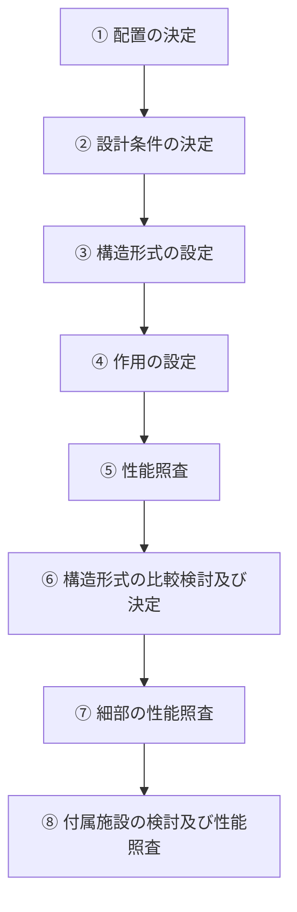
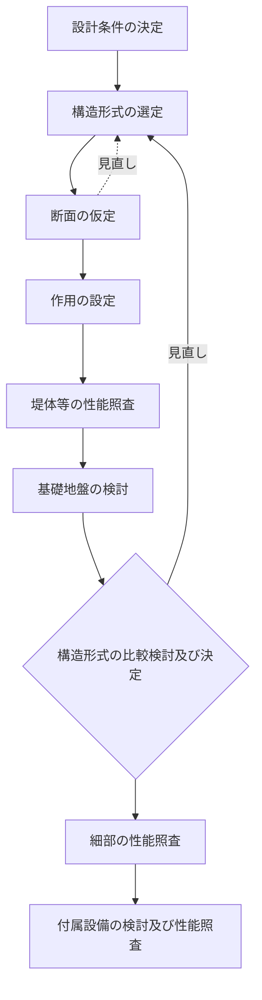
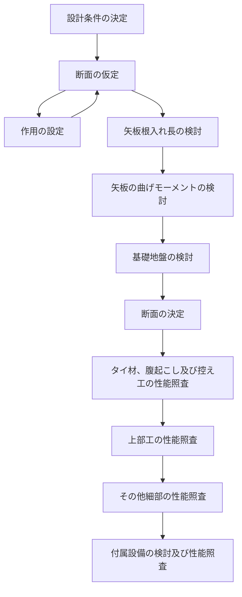
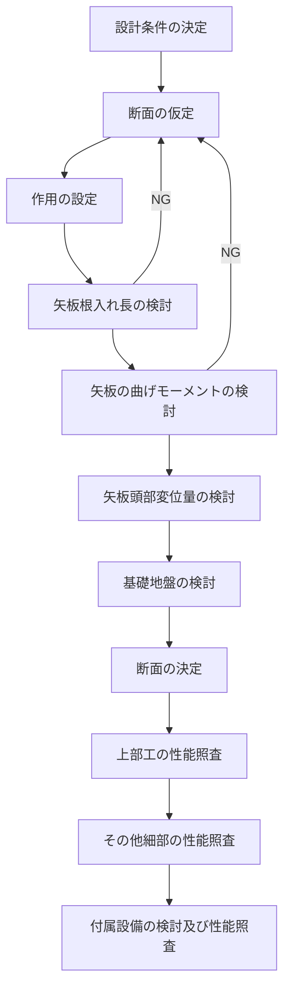

# 第6編 係留施設

## 第1章 係留施設に関する総論

### 1.1 係留施設の目的

> 係留施設の目的は、漁船を安全に係留して、効率的な水産物の陸揚げ、漁業生産用資材の積卸し等の作業、漁船員の乗降、漁船の安全確保等を行うことを基本とする。

### 1.2 係留施設の要求性能

> 係留施設に共通する要求性能は、漁船を係留して、水産物の陸揚げ、漁業生産用資材の積卸し等の作業、漁船員の乗降、漁船の安全確保等を行うことができるよう十分な機能を有していることとする。

係留施設は、自然条件、経済的・社会的条件、周辺の環境に及ぼす影響、経済性、漁船等の船舶の船型・隻数、利用目的、漁港の区域内の水域や陸域の利用状況等を考慮して、構造上安全なものとするとともに、求められる機能と的確な工事の実施が確保されるよう照査することを原則とする。

### 1.3 係留施設の基本事項

#### 1.3.1 機能と種類

係留施設は、漁船を横付け又は縦付けにして、漁獲物の陸揚げ、漁業生産資材の積卸し等の作業、漁船員の乗降、漁船の安全確保等を行うために、水際に築造する施設であり、漁港漁場整備法第3条に基づく種類としては、岸壁、物揚場、桟橋、浮桟橋、船揚場、係船浮標、係船杭がある。

係留施設を形態別に分類すると、接岸して係留する係船岸、接岸せずに泊地に係留する係船浮標や係船杭、陸上に上架する船揚場となる。形態別分類をさらに主な構造形式により分類すると、次のとおりとなる。

```
係留施設
├─ 係船岸
│   ├─ 重力式係船岸
│   │   ├─ ブロック積式
│   │   ├─ セルラーブロック式
│   │   ├─ コンクリート単塊式
│   │   ├─ L型ブロック式
│   │   ├─ ケーソン式
│   │   ├─ 直立消波式
│   │   └─ 階段式
│   ├─ 矢板式係船岸
│   │   ├─ 普通矢板式
│   │   ├─ 自立式矢板
│   │   ├─ 斜控え杭式矢板
│   │   └─ 棚式矢板
│   ├─ 桟橋式係船岸（桟橋）
│   │   ├─ 直杭式
│   │   └─ 斜杭式
│   └─ 浮体式係船岸（浮桟橋）
├─ 船揚場
│   ├─ 斜路式船揚場
│   └─ 上架式船揚場
├─ 係船浮標
│   ├─ 沈錘式係船浮標
│   ├─ 錨鎖式係船浮標
│   └─ 沈錘錨鎖式係船浮標
└─ 係船杭
```

<p className="text-center">図 6-1-1 係留施設の構造形式別分類</p>

係留施設は、漁船はもとより、漁船以外の遊漁船、プレジャーボート、フェリー、定期船、官公庁船など様々な船舶に利用され、地震等の災害時には人々の避難や救援・復興のための物資を輸送する役割も担う場合もある。

なお、漁港の重力式及び矢板式の係船岸は、工事用基準面（原則として基本水準面）を基準として、前面の水深が-3.0m及びそれより深い係船岸を「岸壁」、-3.0mより浅い係船岸を「物揚場」と称している。水深は、0.5mごとに区分される。「岸壁」「物揚場」の呼称は、慣用的に、桟橋式係船岸をも含んだ意味で用いられる場合もある。

#### 1.3.2 照査における考慮事項

係留施設の照査にあたっては、その機能が十分発揮されるよう次の事項について考慮することを原則とする。

① 自然条件

気象・海象条件、地形・地質条件、地震など

② 経済的・社会的条件

漁船の船型・隻数、漁獲物の陸揚形態、陸揚量、水産物の流通形態、就業者の高齢化、プレジャーボートの状況など

③ 周辺の環境に及ぼす影響

水質への影響、沿岸域における動植物の生態系など

④ 工事や施設の維持管理に係る経済性

⑤ 水産物の的確な品質・衛生管理

陸揚げ・荷さばき作業によって生じる汚水による港内水質の汚濁防止、鳥獣進入防止など

⑥ 係留施設の利用目的

漁船の接岸・係留、漁獲物の陸揚げ、資材の積卸し、蓄養・増養殖等の作業の円滑化と安全性

また、係留施設の照査においては、次のように地域特性等に配慮することが望ましい。

① 風雪への配慮

漁業活動は、屋外での作業が多いため、特に自然条件の厳しい積雪寒冷地域等においては就労環境についての配慮をすることが望ましい。地域の自然条件や作業の実態を把握したうえで、係留施設における防風施設等の設置を検討することが望ましい。なお、防風施設の照査は、「第13編 防風施設」によることができる。

② 高齢者等への配慮

漁業活動に従事する高齢者等の割合が増加していることから、作業の安全性の向上と円滑化に配慮した係留施設が必要であり、段差の解消（バリアフリー）や作業の省力化などのための構造・配置を検討することが望ましい。特に、干満差の大きい地域での小型漁船の係留施設については、浮体式係船岸とすることが望ましい。

③ 水産物の品質・衛生管理への配慮

水産物の的確な品質・衛生管理の観点から、鳥糞等の混入を防ぐための上屋等を係留施設に付属して整備するなどの配慮をすることが望ましい。

#### 1.3.3 照査のフロー

係留施設の照査は、一般に図 6-1-2 の手順で行うことができる。



<p className="text-center">図 6-1-2 係留施設の性能照査フロー</p>

① 配置の決定

漁港では、時期的あるいは時間的に利用が集中することが多く、かつ大きさの異なる大小の漁船が輻輳するので、係留施設の配置の決定にあたっては、漁船の安全かつ円滑な利用に配慮する。

② 設計条件の決定

設計条件は、「第2編 設計条件」によることができる。

③ 構造形式の設定

係留施設には様々な構造形式があり、設計条件や施工条件、利用形態等に応じて適切な構造形式を複数設定する。

④ 作用の設定

係留施設への作用には、波力、水圧、土圧、地震力、上載荷重、漁船による衝撃・けん引力等がある。性能照査のために、選定した施設の構造断面に応じた必要な作用を選定する。

⑤ 性能照査

各仮定構造断面の性能照査を行うが、構造断面が決定されるまでには、通常数回に及ぶトライアル計算を行う。

⑥ 各形式・構造の比較検討及び決定

③から⑤の結果を踏まえて、各形式・構造を安全性、経済性、施工性、使用時の利便性、周辺環境への影響等を検討項目として総合的に評価し、適切な断面を決定する。

⑦ 細部の照査

決定された構造断面について、部材等の細部の照査を行う。

⑧ 付属施設の照査

防舷材、係船柱、照明など、利用上及び安全上必要な付属施設の照査を行う。

#### 1.3.4 配置

係留施設の配置は、港形、波向、風向、流れ等を十分に考慮して、漁船が容易かつ安全に係留でき、背後の土地利用や連絡を考慮して決定することを原則とする。

係留施設の配置は、以下の（1）〜（5）によることが望ましい。

(1) 港口からの侵入波、防波堤からの越波、あるいは航跡波などにより係留施設で反射波が発生し、港内静穏度に悪影響を及ぼさないよう、消波機能付き係船岸、船揚場などを適切に配置する。

(2) 風によって、漁船と係船岸、及び漁船どうしの接触による破損を防ぐため、強風の発生方向や漁船の係留方法を考慮して配置を決定する。また、必要に応じて係船岸の途中に突堤を配したり、風対策施設を設置する。

(3) 連続する係船岸の途中に船揚場を設けることは、係船岸及び背後地ともに分断され、利用効率が悪くなるので注意する。

(4) 一般に港口付近には水深の深い係留施設を配し、港の奥に行くにしたがって水深の浅い係留施設を配置する。

(5) 突堤式係船岸を2本以上設ける場合には、突堤式係船岸前面の法線を極力そろえ、その間隔は、漁船の操船方法等に配慮して決定する。


<p className="text-center">図 6-1-3 係留施設配置の一例</p>


## 第2章 係船岸

### 2.1 係船岸の構造形式の設定に関する考慮事項

> 係船岸の構造形式は、自然条件、利用条件、施工条件、経済性等を勘案して適切なものを設定することを原則とする。

係船岸の構造形式は、重力式、矢板式、桟橋式、階段式、浮体式に分けられる。構造形式の設定においては、図 6-2-1 に示す各構造形式の模式断面図及び、表 6-2-1 に示す自然条件、施工条件、利用条件の特徴を参考にできる。図 6-2-1 及び表 6-2-1 に示す以外の特殊な構造形式については、必要に応じて模型実験結果等を参考として照査を行うことが望ましい。


<p className="text-center">図 6-2-1 係船岸の構造形式別の模式断面図</p>


<p className="text-center">表 6-2-1 係船岸の構造形式別の特徴</p>

#### 2.1.1 重力式係船岸

重力式係船岸は、構造物本体の自重によって土圧等の作用に抵抗しようとするものである。

漁港に使用される重力式係船岸の主な構造形式としては、ブロック積式、セルラーブロック式、コンクリート単塊式、L型ブロック式、ケーソン式、直立消波式等がある。また階段式係船岸は、潮位差が大きい場合に、干潮、満潮時いずれにおいても陸揚げ等が容易にできるように階段部を設けるものである。代表的な形式の模式断面図を図 6-2-2 に示す。

重力式係船岸の性能照査は、「第6編 3.4 重力式係船岸」によることができる。


<p className="text-center">図 6-2-2 重力式係船岸の模式断面図</p>


<p className="text-center">表 6-2-2 重力式係船岸の特徴</p>

#### 2.1.2 矢板式係船岸

矢板式係船岸は、連続して打ち込んだ矢板を壁体とし、その曲げ剛性と矢板根入れ部及び控え工の横抵抗等によって荷重等の作用に抵抗しようとするものであり、一般に次のような特徴を有する。

① 施工設備が比較的簡単であり、また、水中工事を伴うことが少ないので、工事を迅速に行うことができる。

② 硬質地盤や玉石層を含む地盤では、矢板の打ち込みが困難である。

③ 鋼矢板を使用する場合には、海水による腐食に対して措置を講じる必要がある。

矢板式係船岸には、矢板に働く土圧及び残留水圧に抵抗する形式によって、普通矢板式、自立矢板式、二重矢板式、斜め控え杭矢板式並びに棚式等がある。各形式の有する構造条件、施工条件並びに施工箇所の現場条件、経済性等を総合的に検討して選定することが望ましい。

構造形式別の特徴は次のとおりである。

普通矢板式及び自立矢板式は表 6-2-3 に示す特徴を有する。両形式の模式断面図を図 6-2-3 に示す。

二重矢板式係船岸は、二重の矢板をタイ材及び上部鉄筋コンクリートで一体化して土圧等に抵抗する構造であり、漁港での実施例も相当見られる。

斜め控え杭矢板式係船岸は、矢板と控え工をタイ材で結合するのではなく、斜め杭を天端の上部に結合させ、矢板と杭とを組杭形式として矢板上部の変位を拘束するものである。漁港での実施例としては、地盤が悪く、前出しの困難な河川内等においてわずかに見られる。

棚式係船岸は、矢板壁の背後に杭を有する棚を設けた構造であり、棚によって矢板にかかる土圧を軽減させ、矢板根入れ部の土圧と矢板背後の棚杭の抵抗力によって、水平力に対して抵抗するもので ある。漁港では地盤が悪い場合に実施例がある。上載荷重を杭で支持するため、通常の矢板式係船岸では、根入れ部の受働土圧が不足して構造的に成り立たないような軟弱地盤でも成り立つことがあり、また、矢板断面も小さくてもよい。

矢板式係船岸の性能照査は、構造形式別に「第6編 3.5 普通矢板式係船岸」「第6編 3.6 自立矢板式係船岸」「第6編 3.7 二重矢板式係船岸」「第6編 3.8 斜め控え杭矢板式係船岸」「第6編 3.9 棚式係船岸」によることができる。

<p className="table-title">表 6-2-3 矢板式係船岸の構造形式別の特徴</p>

<div className="table-wrapper">

| 構造 | 自然条件 | 施工条件 | 構造条件 |
|------|----------|----------|----------|
| 普通矢板式係船岸 | 硬質地盤または玉石混じり層では適さない。軟弱地盤では成立しない場合もある。 | タイ材を取り付け、背後を埋めるまでの過程は不安定である。施工手順がやや複雑である。 | 控え工の振え付けのための背後の余裕が必要である。現地盤が浅く、控え壁の施工が容易な場合には有利である。 |
| 自立矢板式係船岸 | 硬質地盤または玉石混じり層では適さない。軟弱地盤では成立しない場合もある。構造が簡単で施工が単純であり、係船岸背後が狭い場合には有効な構造である。 | 他の形式に比べて最も施工が簡単である。 | 大水深係船岸には適さない。頭部変位が比較的大きくなる。構造が最も簡易である反面、矢板の断面及び根入れ長が大きくなる。 |

</div>


<p className="text-center">図 6-2-3 矢板式係船岸の模式断面図</p>

矢板式係船岸の鋼矢板の種類は、各種鋼矢板の特徴及び経済性、施工性等を検討して選定することが望ましい。鋼矢板の種類は、鋼矢板の断面形状によって、U形、組合せ形、直線形や鋼管等、また、最近では軽量形やハット形がある。鋼矢板の選定において、表 6-2-4 に示す各種鋼矢板の特徴を参考にできる。

<p className="table-title">表 6-2-4 各種鋼矢板の特徴</p>

<div className="table-wrapper">

| 種類 | 内容 |
|------|------|
| U形鋼矢板 | 断面がU形で、鋼矢板の中では最も広範に用いられてきた。その断面係数は874～3,820cm³/mの範囲である。継手の位置が中立軸の中央にくる。 |
| 組合せ鋼矢板 | U形鋼矢板を2枚ずつ向い合わせに組み合わせ、その合わせ目を溶接したうえで、次々とかみ合わせながら打ち込むもの。鋼矢板を適宜組み合わせることにより大きな断面係数が得られる。 |
| 直線形鋼矢板 | 断面が直線型のもの。両端の継手部のかみ合わせ強度が高い。 |
| 軽量形鋼矢板 | 断面係数が小さく、小型係船岸または仮設工事に用いられる。軽量なので作業性や施工性の利点がある。 |
| ハット形鋼矢板 | ハット（帽子）形状をした、有効幅900mmの鋼矢板である。壁体外縁に継手がある。従来型に比べ必要枚数が減少するので、工期の短縮や施工費の削減が図れる。 |
| 鋼管矢板 | 鋼管に継手を溶接してつないだもの。一般に断面係数が非常に大きい。 |
| H形鋼矢板 | 断面がH形で、一般に断面係数が非常に大きい。 |

</div>


<p className="text-center">図 6-2-4 各種鋼矢板の断面形状図（文献 <sup>1)</sup> に加筆）</p>

#### 2.1.3 桟橋式係船岸

桟橋は、海底地盤に杭を打ち込み、その上に床版を張った構造である。桟橋式係船岸では、一般に、桟橋の背後地に土留壁を設け、桟橋と背後地との往来のために渡版を掛ける。

桟橋式係船岸の模式断面図を図 6-2-5 に、特徴を表 6-2-5 に示す。漁港の係船岸には直杭式が多用されている。

桟橋式係船岸の性能照査は、「第6編第4章 桟橋」によることができる。


<p className="text-center">図 6-2-5 桟橋式係船岸の模式断面図</p>

<p className="table-title">表 6-2-5 桟橋式係船岸の特徴</p>

<div className="table-wrapper">

| 構造 | 自然条件 | 施工条件 | 構造条件 |
|------|----------|----------|----------|
| 直杭式桟橋 | 硬質地盤または玉石層の場合、杭の打ち込みが困難である。波の大きな所には通常は設けない。 | 施工が斜杭に比べ容易である。 | 軟弱地盤の場合、桟橋本体と背後の埋立地との境界に段差が生じることがある。 |
| 斜杭式桟橋 | 硬質地盤または玉石層の場合、杭の打ち込みが困難である。波の大きなところには通常設けない。 | 直杭式に比べ施工がやや複雑である。 | 地震力、衝撃力、けん引力による水平変位は直杭式に比べ小さい。水平力が大きい場合に適している。軟弱地盤の場合、桟橋本体と背後の埋立地との境界に段差が生じる場合がある。 |

</div>

#### 2.1.4 浮体式係船岸

浮体式係船岸の模式図を図 6-2-6 に示す。

浮体式係船岸の性能照査は、「第6編第6章 浮桟橋」によることができる。


<p className="text-center">図 6-2-6 浮体式係船岸の模式図</p>

#### 2.1.5 係船岸の構造形式の設定に係る留意点

**(1) 共通事項**

① 既設で根入れの浅い構造物に近接して係船岸を設置する場合には、既設構造物への影響を考慮することを原則とする。

② 取り付け部や隅角部は、構造上の弱点とならないように配慮することを原則とする。

③ 反射波により港内静穏度が低下する場合は、消波機能をもつ構造とすることが望ましい。

**(2) PC構造を適用する場合の留意点**

桟橋式、浮体式、矢板式係船岸等にプレストレストコンクリート（以下「PC」という。）構造を適用する場合は、安全性、経済性及び施工性を総合的に検討することが望ましい。

PC構造は、一般的に、

- 現場施工が少なくなるため、施工の省力化及び工期の短縮が可能である。
- 鉄筋コンクリート（以下「RC」という。）構造に比べて小さな断面となるので、質量が小さくなる。

といった特徴をもつ。

浮体式係船岸の場合、PC製の浮体は、海域が静穏であれば、PC鋼材により海上で接合することができるため、浮体の大型化が可能である。

矢板式係船岸の場合、PC矢板は高強度コンクリートと高強度鋼材を使用しているため、広幅かつ長尺のものが製作できる。また、PC矢板表面の美観が長期間保たれる。

以下に、構造形式別の留意点を示す。

**① 桟橋式係船岸**

a）防舷材をスパン中央部に設置する場合は、漁船等の接岸力がPC桁に直接かからないように防衝版を前面に配置し、防舷材を取り付けるのが望ましい。

b）PC桁は、床版重量が軽く揚圧力に対してはPC桁の耐力で抵抗することになるので、十分な応力検討を行うことを原則とする。揚圧力が働く場合には、PC桁どうしを受梁上で場所打ちコンクリートで連結することにより、基礎杭と一体構造とすることが望ましい。また、可動端においてもアンカーボルトにより、浮き上がりを防止する構造とすることが望ましい。

c）PC桁は「道路橋示方書・同解説」<sup>2)</sup>に基づいた、JIS規格相当品等を用いることが望ましい。

**② 浮体式係船岸**

a）薄いPC部材を製作する場合には、鋼材のかぶりの確保などに十分注意する。

**③ 矢板式係船岸**

a）PC矢板は一般に腐食の考慮が不要であり防食の費用を要さない。

b）PC矢板の打ち込み可能なN値は、砂質土の場合は30以上でも可能であり、粘性土の場合は15程度以下である。

c）PC矢板はJIS A 5373によるものを用いるのが望ましい。

### 2.2 係船岸の耐震性能の照査

#### 2.2.1 係船岸の耐震性能の照査の基本方針

すべての係船岸に対して実施する、レベル1地震動に対する耐震性能の照査については、地震力を水平方向の静的な作用に置き換えた設計水平震度によって実施することを標準とする。

また、「第1編 2.2.5 耐震性能・耐津波性能の強化を行う施設」に示す係船岸においては、耐震性能・耐津波性能を強化する必要がある。耐震性能・耐津波性能を強化する係船岸の性能規定は、「第6編第5章 耐震性能・耐津波性能を強化する係船岸の照査」を参照のこと。該当する係船岸についての性能照査は、同章に記載した方法を用いることができる。

#### 2.2.2 設計水平震度

設計水平震度は、「第2編 11.2.1 設計水平震度」の「表 2-11-1 地域別の工学的基盤最大加速度及び設計水平震度」によることを標準とする。

また、重力式係船岸及び水深-2.0m～-5.5mの控え直杭式矢板式係船岸については、「表 2-11-1 地域別の工学的基盤最大加速度及び設計水平震度」に示す設計水平震度の代わりに、第6編 2.2.3 周波数特性及び変形量を考慮に入れた設計水平震度に示す、レベル1地震動の周波数特性、係船岸の周波数特性及び変形量を考慮に入れた設計水平震度を使用することができる。この方法によって得られる設計水平震度を、「本書」では照査用震度と称す。この方法は、文献 <sup>3)</sup>に示された数式を素地として、フィルター関数のパラメータを漁港の係船岸の諸元に対応した値に変更したものである。

#### 2.2.3 周波数特性及び変形量を考慮に入れた設計水平震度

**(1) 重力式係船岸及び水深-2.0m～-5.5mの控え直杭式矢板式係船岸に対する照査用震度の算出方法**

重力式係船岸及び水深-2.0m～-5.5mの控え直杭式矢板式係船岸に対する照査用震度の算出方法は、本項によることができる。

算出のフローは図 6-2-7 によることができる。この方法では、対象とする施設位置のサイト特性を考慮した、工学的基盤におけるレベル1地震動の波形を必要とする。また、1次元地震応答解析のために工学的基盤～地表のボーリングデータを必要とする。


<p className="text-center">図 6-2-7 照査用震度の算出のフロー</p>

上図の手順①～⑤では、次の演算を行う。

① 港別のレベル1地震動を入力した1次元地震応答解析により、地表面加速度波形を算出する。

② 地表面加速度波形をFFT（高速フーリエ変換）し、そのスペクトルに、構造形式ごとの周波数特性を加味した周波数フィルターを乗ずる。

③ ②で周波数フィルターを乗じたスペクトルをフーリエ逆変換して加速度波形を算出する。

④ ③の加速度波形に、地震動の継続時間の影響を反映させるための低減率pを乗ずる。

⑤ ④の加速度最大値と、許容変形量（係船岸の天端における変形量）の値から、照査用震度算出式によって照査用震度を算出する。

①について、工学的基盤のレベル1地震動波形の算出方法は、「第6編 2.2.4 工学的基盤におけるレベル1地震動の波形の算定」によることができる。

②について、重力式係船岸及び水深-2.0m～-5.5mの控え直杭式矢板式係船岸の周波数特性を勘案したフィルターとしては、式 6-2-1-1 により与えられているものを用いるのがよい。これは、重力式係船岸及び水深-2.0m～-5.5mの控え直杭式矢板式係船岸を対象に、地盤条件及び水深の異なる岸壁モデルを用い、周波数を種々に変えた正弦波を入力して実施した二次元応答解析の結果より、地震動を構成する各周波数成分の波の岸壁の変形への寄与を評価したものである <sup>4)5)</sup>。式中の「背後地盤及び壁体下の固有周期」の算定は、港湾の照査用震度算出法 <sup>6)</sup>を利用する。

フィルター関数の例を図 6-2-8 に示す。

<div className="scroll-equation">

$$
a(f) = \begin{cases} b & (f \lt f_c) \\ \displaystyle\frac{b}{1 - [x_1(f - f_c)]^2 + ix_2x_1(f - f_c)} & (f \geq f_c) \end{cases} \tag{式 6-2-1-1}
$$

</div>

<div className="scroll-equation">

$$
b = \chi_3 \frac{H}{H_R} + \chi_4 \frac{T_b}{T_{bR}} + \chi_5 \frac{T_u}{T_{uR}} + \chi_6 \tag{式 6-2-1-1 続き}
$$

</div>

ただし、

<div className="scroll-equation">

$$
\chi_7 H + \chi_8 \leq b \leq \chi_7 H + \chi_9 \tag{式 6-2-1-2}
$$

</div>

ただし、$b \geq \chi_{10}$

ここに、

- $f$：周波数（Hz）
- $f_c$：境界周波数（Hz）
- $i$：虚数単位
- $H$：壁高（m）
- $H_R$：基準壁高（＝15.0m）
- $T_b$：背後地盤の初期固有周期（s）
- $T_{bR}$：背後地盤の基準初期固有周期（＝0.8s）
- $T_u$：壁体下地盤の初期固有周期（s）
- $T_{uR}$：壁体下地盤の基準初期固有周期（＝0.4s）
- $\chi_1$～$\chi_{10}$：構造形式、対象水深によって変わるフィルターに関する係数


<p className="text-center">表 6-2-5-2 フィルターに関する係数一覧</p>


<p className="text-center">図 6-2-8 フィルターの一例</p>

④について、「地震動の継続時間の影響を考慮する低減率p」の算定は、港湾の照査用震度算出法 <sup>6)</sup>を利用するのがよい。地震動の継続時間の影響を考慮する低減率pは、フィルター処理を行った地表面加速度時刻歴の二乗和平方根 $S$ 及び加速度最大値 $\alpha_f$ を用いて、式（6-2-1-3）より設定することができる。低減率の算定に係る「時刻歴の二乗和平方根の算定」及び「補正加速度最大値の算定」も、港湾の照査用震度算出法 <sup>6)</sup>を利用するのがよい。なお、低減率の上限値は、1.0 とする。

<div className="scroll-equation">

$$
p = \eta_1 \ln\left(\frac{S}{\alpha_f}\right) + \eta_2 \tag{式 6-2-1-3}
$$

</div>

ここに、

- $p$：低減率（$p \leq 1.0$）
- $S$：フィルター処理後の加速度時刻歴の二乗和平方根（$\sqrt{\sum acc^2}$）
- $\alpha_f$：フィルター処理後の加速度最大値（cm/s²）


<p className="text-center">表 6-2-5-3 低減率の算定式に関する係数一覧</p>

⑤については次式 <sup>6)</sup>を使用するのがよい。

<div className="scroll-equation">

$$
k_h = 1.78 \left[\frac{D_a}{D_r}\right]^{-0.55} \frac{\alpha_c}{g} + 0.04 \quad \text{(重力式係船岸)} \tag{式 6-2-2}
$$

</div>

<div className="scroll-equation">

$$
k_h = \frac{\alpha_c}{g} \quad \text{(水深-2.0m～-5.5mの控え直杭式矢板式係船岸)}
$$

</div>

ここに、

- $k_h$：照査用震度
- $\alpha_c$：補正加速度最大値（cm/s²）
- $g$：重力加速度（cm/s²）
- $D_a$：許容される重力式係船岸天端における変形量（cm）
- $D_r$：基準変形量（＝10cm）

**(2) 照査用震度の使用に係る留意点**

「(1)重力式係船岸及び水深-2.0m～-5.5mの控え直杭式矢板式係船岸に対する照査用震度の算出方法」に示した方法は、港湾の照査用震度算出法 <sup>3)6)</sup>を素地として、フィルター関数及び控え直杭式矢板式係船岸の照査用震度算出式について漁港に多い浅い係船岸向けのパラメータとしたものである。使用にあたっての留意点を以下の①～⑨に示す。

① ここに示す方法は、液状化を発生させない条件で構築しているため、液状化が発生する条件に適用する場合には、適用性について検討することを原則とする。

② 照査用震度は、小数点以下3けた目を四捨五入し、小数点以下2けたの数値で表すのがよい。

③ 重力式係船岸に対する照査用震度のフィルター関数は、変形量が10～20cmの範囲に対して検討され作成されたものである。したがって、許容変形量Daが10～20cmの範囲外の場合の検討については、二次元地震応答解析等で性能を評価し、断面を決定することができる。なお、この場合の初期断面の設定においては、「第2編 11.2.1 設計水平震度」の「表 2-11-1 地域別の工学的基盤最大加速度及び設計水平震度」に示されている設計水平震度を用いることができる。

④ 水深-2.0m～-5.5mの控え直杭式矢板式係船岸に対する照査用震度のフィルター関数は、変形量が10cmに対して検討され作成されたものである。したがって、許容変形量Daが10cm以外の場合の検討については、二次元地震応答解析等で性能を評価し、断面を決定することができる。なお、この場合の初期断面の設定においては、「第2編 11.2.1 設計水平震度」の「表 2-11-1 地域別の工学的基盤最大加速度及び設計水平震度」に示されている設計水平震度を用いることができる。

なお、ここに示した係数は本書に示す設計方法「第6編 3.5 普通矢板式係船岸」に基づき決定した断面をもとに算出したものであるため、本書に示している以外の設計法で矢板の断面を決定する場合にはこの係数を使用しないことを原則とする。

⑤ 港湾の照査用震度算出法 <sup>6)</sup>に示されている、深層混合処理工法及び置換率70%以上のサンドコンパクション（SCP）を用いて地盤改良を行う場合の照査用震度の算定手法は、浅い係船岸に関する検証がなされていないので、漁港の係船岸には使用しないことを原則とする。この場合、未改良の状態を想定した照査用震度を使用することができる。

⑥ 港湾の矢板式及び桟橋式における照査用震度の算出方法 <sup>6)8)</sup>は、漁港への適用を行わないことを原則とする。これは、算出方法を構築する際の数値計算において、漁港に比べて大水深のモデルが用いられたことと、矢板式においては本書に示す方法とは異なる照査方法で照査されたモデルが用いられたことによる。

⑦ レベル1地震動が小さい場所では、本手法を用いると、照査用震度についても非常に小さな値が得られる可能性がある。その場合の下限値を0.05とすることができる。

⑧ 本手法により0.25程度以上の照査用震度が算出された場合には、以下のことを検討するのがよい。

a）照査用震度を0.25として断面を設定し、地盤－構造物の動的相互作用を適切に考慮できる二次元地震応答解析等で性能を評価する。

b）地盤改良を検討する。

c）他の構造形式の採用を検討する。

⑨ 照査用震度を算出する際の1次元の地震応答解析手法は、とりわけ、照査用震度の算定において重要となる周波数帯域（たとえば図6-2-8のフィルターの例を参照）の加速度増幅を適切に評価できる手法（FLIPまたはFLIPに近い結果が得られる解析コード）を用いることが望ましい。特に軟弱地盤における増幅の適切な評価に留意することが望ましい。

#### 2.2.4 工学的基盤におけるレベル1地震動の波形の算定

工学的基盤におけるレベル1地震動の波形を算出する場合は、多様な地震の発生確率を考慮して作成した、75年程度の再現確率の地震動波形とすることが望ましい。その方法は、「第2編 11.3.1 サイト特性を考慮した地震動の算出手法」を利用できる。

#### 2.2.5 耐震性能の照査における許容変形量

重力式、矢板式及び桟橋式係船岸の照査において、施設と地盤をモデル化して地震動を入力する動的解析（二次元地震応答解析）を実施する場合は、解析により求まる変形量が許容変形量以下に収まることを確認することを標準とする。

重力式及び矢板式係船岸について、作用をレベル2地震動として動的解析を行う際の許容変形量は、表 6-2-6 に示す値①を使用することができる。

重力式及び矢板式係船岸を対象として、作用をレベル1地震動として動的解析を行う際の許容変形量は、表 6-2-6 に示す値②を使用することができる。これは、施設の損傷及び利用上の制約が限定的なものにとどまり軽微な補修により早期に機能が回復できることを考慮して示した参考値である。

重力式係船岸を対象として、作用をレベル1地震動として周波数特性と変形量を考慮した設計水平震度（照査用震度）の算出を行う際の許容変形量は、表 6-2-6 の値②に準じ、10cmとすることができる。これは、照査用震度には場所ごとの増幅特性の違いが反映されるが許容変形量を10cm とすれば平均的にみて地域別の設計水平震度に近い値になること <sup>4)</sup>も考慮している。なお、照査用震度の算出式においては、算出式におけるはらみだし量の設定可能範囲が10cm～20cmであることに注意する。

控え直杭式矢板式係船岸を対象として、作用をレベル1地震動として周波数特性と変形量を考慮した設計水平震度（照査用震度）の算出を行う際の許容変形量は、表 6-2-6 の値②に準じ、10cm とすることができる。これは、変形が10cmを超えると矢板式係船岸を構成する鋼材が降伏する可能性が大きくなること <sup>5)</sup>も考慮している。

桟橋式係船岸は、被災による変状が安全性や利用におよぼす影響についての知見が少ない。そのため表6-2-6には値を示していない。桟橋式については暫定的に、同表の重力式・矢板式の値を参考とし つつ、渡版の変状及びその隣接構造物への影響が、桟橋の利用に大きな支障をもたらさない範囲にとどまることも考慮に入れて許容変形量を設定してよい。

係船岸が変形すると陸上の利用や漁船等の係留に影響が生じる。陸上利用への影響は、はらみだしよりもむしろエプロンに生じる段差や隙間によってもたらされる。しかし二次元地震応答解析では一般に、背後エプロンの地表に生じる仔細な変状を精度よく計算することは困難である。そのため表 6-2-6 では、段差とはらみだし量の関係式並びに隙間とはらみだし量の関係式 <sup>9)</sup>を踏まえて陸上利用の観点を考慮している。

表 6-2-6 に示す値はすべて係船岸の構造上の安定及び利用の観点を考慮に入れた参考値であり、個別の施設について施設の変形量と被災後の施設に求められる機能との関係を検討する場合は、同表以外の許容変形量を使用することもできる。たとえば、重力式係船岸のスパン毎のはらみだしにずれが生じた状態で漁船の係留時に適切に防舷材等が機能することや、陸上の利用がより円滑に行われること等を考慮に加えて許容変形量を設定してもよい。

なお、本項に述べる許容変形量とは別に、鋼材で構成される係船岸の静的な耐震性能照査において用いる変形量の許容値については、構造形式に応じて「第6編 3.5 普通矢板式係船岸」「第6編 3.6 自立矢板式係船岸」を参照してよい。


<p className="text-center">表 6-2-6 係船岸（重力式・矢板式）の耐震性能の照査における許容変形量の参考値</p>

#### 2.2.6 二次元地震応答解析における鋼材応力度の限界値

鋼材で構成される係船岸において、二次元地震応答解析により部材を照査する場合の鋼材応力度の限界値は以下を参考とすることができる。

<p className="table-title">表 6-2-7 二次元地震応答解析により部材を照査する場合の鋼材応力度の限界値の参考値</p>

<div className="table-wrapper">

| 係船岸の種類と分類 | 照査に用いる地震動 | 構造形式 | 照査部材 | 限界値の参考値 |
|---|---|---|---|---|
| 耐震強化岸壁 | レベル2地震動 | 矢板 | 矢板 | 降伏応力度 |
| | | | タイ材 | 破断強度 |
| | | | 控え工 | 全塑性モーメント |
| | | 桟橋 | 杭 | 全塑性モーメント※1 |
| 耐震強化岸壁に準じる岸壁 | レベル2地震動 | 矢板 | 矢板 | 降伏応力度 |
| | | | タイ材 | 破断強度 |
| | | | 控え工 | 全塑性モーメント |
| | | 桟橋 | 杭 | 全塑性モーメント※1 |

</div>

※1：桟橋を構成する杭の中に、二箇所以上で杭に生じる曲げモーメントが全塑性モーメントに達している杭が存在しないこと。

### 2.3 液状化対策

係船岸の、地盤の特性を考慮した液状化の検討並びに液状化の対策は、施設の重要度に応じて判断することを原則とする。液状化対策の検討は、「第2編第12章 液状化」によることができる。

「第1編 2.2.5 耐震性能・耐津波性能の強化を行う施設」に示された係船岸については、「第6編第5章 耐震性能・耐津波性能を強化する係船岸の照査」にしたがって液状化の検討及び対策を行うことを原則とする。

なお、「第1編 2.2.5 耐震性能・耐津波性能の強化を行う施設」に示す以外の係船岸の耐震性能照査においては、施設の役割や施設周辺の粒度分布等を踏まえて、必要に応じて液状化の検討と対策を実施してもよい。その検討手順は、「第6編第5章 耐震性能・耐津波性能を強化する係船岸の照査」の耐震強化岸壁の手順の①～②に準ずることができる。

### 2.4 計画水深及びバース長

係船岸の計画水深及びバース長は、利用漁船を考慮し、安全かつ円滑に利用できるよう適切に定めることを原則とする。

計画水深及びバース長は、以下の（1）～（5）によることができる。

(1) 計画水深は、係船岸に接岸する漁船のうち、最大の漁船の喫水に余裕値を加えた値とする。なお、計画水深は0.5m単位に切り上げる。

> 係船岸の計画水深＝最大の漁船の喫水＋余裕水深

(2) 対象とする漁船の喫水は、陸揚げ及び準備用の係船岸は満載喫水、休けい用係船岸は空喫水の値を用いる。また、対象とする利用漁船の形状寸法が不明で、その喫水を定めがたい場合は、「第2編 14.1 漁船等の諸元」を参考に定めてもよい。

(3) バース長は、係船岸に接岸する漁船の船長（横付けの場合）又は船幅（縦付けの場合）に、漁船が係留する際に必要な余裕値を加えた値を標準とする。

> バース長＝船長＋余裕長（横付けの場合）
>
> ＝船幅＋余裕幅（縦付けの場合）

(4) 余裕水深は、港内の静穏度等を考慮し適切に定めるが、一般に次の値としていることが多い。波の影響が著しい場合は、この値をさらに大きくすることができる。

① 海底の地盤が硬質地盤の場合　0.5m以上

② 海底の地盤が軟質地盤の場合　0.5m

(5) 余裕長、余裕幅は、係船岸の利用状況や漁船の操船方法等を考慮し適切に値を定める。なお、次の値を標準値とできる。

① 余裕長　0.15L（L：船長）

② 余裕幅　0.5B（B：船幅）

### 2.5 天端高

係船岸の天端高は、潮位、漁船の船型、利用形態を考慮し適切に定めることを原則とする。

天端高は、以下の（1）～（3）によることができる。

(1) 潮位差の大きな海域では、小型漁船等の利便性向上のために、エプロンの一部を下げた複断面構造、階段式係船岸あるいは浮体式係船岸等の検討も行う。

(2) 港内において発生する頻度の高い波浪、異常な潮位、河口部における河川水位の影響、地盤沈下等にも十分留意し、係船岸上が冠水し背後へ海水が侵入しないようにする。

(3) 計画される利用漁船の形式・寸法を特定しがたい場合は、陸揚げ及び準備係船岸では、朔望平均満潮面（H.W.L.）に表 6-2-8 の値を加えたものを天端高として用いてもよい。なお、休けい用係船岸においては、さらに表 6-2-8 に示す休けい用係船岸加数値を加えることができる。

① 陸揚げ及び準備用係船岸の天端高＝H.W.L.＋表 6-2-8 の値

② 休けい用係船岸の天端高＝H.W.L.＋表 6-2-8 の値＋表 6-2-8 の加数値

<p className="table-title">表 6-2-8 天端高の算定値</p>

<div className="table-wrapper">

| 潮位差（H.W.L.－L.W.L.） | 対象漁船（G.T.） | | | |
|---|---|---|---|---|
| | 0～20トン | 20～150トン | 150～500トン | 500トン以上 |
| 0m～1.0m | 0.7m | 1.0m | 1.3m | 1.5m |
| 1.0～1.5 | 0.7 | 1.0 | 1.2 | 1.4 |
| 1.5～2.0 | 0.6 | 0.9 | 1.1 | 1.3 |
| 2.0～2.4 | 0.6 | 0.8 | 1.0 | 1.2 |
| 2.4～2.8 | 0.5 | 0.7 | 0.9 | 1.1 |
| 2.8～3.0 | 0.4 | 0.6 | 0.8 | 1.0 |
| 3.0～3.2 | 0.3 | 0.5 | 0.7 | 0.9 |
| 3.2～3.4 | 0.2 | 0.4 | 0.6 | 0.8 |
| 3.4～3.6 | 0.2 | 0.3 | 0.5 | 0.7 |
| 3.6以上 | 0.2 | 0.2 | 0.4 | 0.6 |
| 休けい岸壁加数 | 0m | 0～0.5m | 0.5～1.0m | 1.0m |

</div>

### 2.6 築造限界

係船岸前面の形状は、漁船が安全に離接岸及び係留できるよう適切に定めることを原則とする。

係船岸の築造限界は、利用する漁船の実態に基づき、船型、係留方法、荒天時等の漁船の動揺などを考慮して適切に定めることを原則とする。

### 2.7 エプロン

エプロンは、その利用条件等を考慮して諸元を適切に定めることを原則とする。

#### 2.7.1 エプロンの形状

エプロンの形状は、以下の①～②によることができる。

**① エプロン幅**

エプロン幅は、係船岸の利用方法、背後地の状況及び係船岸の構造等を勘案して決定するのがよい。同一法線上の係船岸は、利用上の観点からエプロン幅を統一することが望ましい。

利用方法等によりエプロン幅を決定できない場合は、表 6-2-9 の値を用いてもよい。

<p className="table-title">表 6-2-9 エプロン幅</p>

<div className="table-wrapper">

| 分類 | エプロン幅（m） |
|------|----------------|
| 陸揚用（漁獲物をすべて上屋に搬入） | 3.0 |
| 陸揚用（エプロン上から自動車により直送） | 10.0 |
| 出漁準備用 | 10.0 |
| 休けい用 | 6.0 |

</div>

**② エプロン勾配**

エプロン勾配は、利用方法、背後地の状況及び排水等を勘案して決定するのがよい。一般に1/30～1/50とすることが多い。エプロンからの汚水が泊地などに流出することが予想される場合には、衛生面・環境面に配慮し、エプロンの前面あるいは背後に排水溝を設置し、汚水を浄化施設に導き、浄化を行ってから排水することが望ましい。

#### 2.7.2 エプロンの構造

エプロンでは、漁獲物の選別、荷さばきが行われ、大型車両が通行したり、漁獲物や漁具の積卸し、積込みのために大型フォークリフトやトラックなどが使用される場合があるので、地域の実状をよく把握したうえで、エプロンの構造を決定することが望ましい。

エプロンの構造の安全性の照査は、エプロン上を1日に通行する大型車両の交通量に応じ、次の①～③に示すように行うことができる。詳細については、「舗装設計施工指針（日本道路協会）」<sup>10)</sup>等を参考とすることができる。なお、エプロンを利用する荷役機械の荷重を考慮する必要がある場合には、他の適切な照査方法によることができる。

**① エプロン上の1日当たり大型車交通量が概ね100台未満の場合**

ここでいう大型車交通量とは、盛漁期（当該漁港地区で1年間のうち最も陸揚量が多かった連続する2カ月間をいう。）において、エプロン上を走行する大型車の日平均交通量である。なお、エプロン上を走行する大型車の方向は問わない。

また、大型車とは、道路交通センサスでいうところの大型車で、車種区分でいうバス（ナンバー2）、普通貨物車（ナンバー1）、特殊車（ナンバー8、9、0）がこれに相当する。

**a）コンクリート版**

ア）コンクリート

コンクリートの圧縮強度は、材齢28日で18N/mm²を標準とし、その厚さは20cmとする。

イ）鉄網

コンクリート版には鉄網を設ける。

**b）目地**

目地は概ね5mごとに横目地、縦目地を設けるものとし、目地材料にはエラスタイト又は板材を用いる。

**c）路盤**

路盤厚は、路床の設計支持力係数をもとにして照査できる <sup>11)</sup>。路盤の所要支持力係数（K₃₀）を150N/cm³とし、使用する材料に応じて図 6-2-9 を用いて求める。エプロンの路盤は通常1層仕上げとし、その最小厚は15cmを標準とする。


<p className="text-center">図 6-2-9 路盤厚の設計曲線（直径 30 cm 載荷版による場合）<sup>11)</sup></p>

**② エプロン上の1日当たり大型車交通量が概ね100台以上の場合**

**a）コンクリート版**

ア）コンクリート

コンクリートの曲げ強度は、材齢28日で4.5N/mm²を標準とし、その厚さは20cmとすることができる。

イ）鉄網

コンクリート版には鉄網を設ける。

**b）目地**

ア）コンクリート版の一体性及び応力の分散を図るため、必要に応じて各種の目地を施工する。目地間隔は「舗装設計施工指針」<sup>12)</sup>を参考にすることができる。また、次に示す値を参考にしてもよい。

- 縦施工目地間隔　3.5～5m
- 横収縮目地間隔　5m
- 横膨張目地間隔　施工時期が温暖な場合　100～200m
- 　　〃　　　　　寒冷な場合　50～100m

また、目地の構造は、目地の機能に応じて決定するのがよいが、標準的な構造を図 6-2-10～図 6-2-13 に示す。


<p className="text-center">図 6-2-10 縦施工目地 <sup>13)</sup></p>


<p className="text-center">図 6-2-11 横収縮目地 <sup>13)</sup></p>


<p className="text-center">図 6-2-12 横膨張目地 <sup>13)</sup></p>


<p className="text-center">図 6-2-13 横施工目地 <sup>13)</sup></p>

イ）目地に使用するタイバー、ダウエルバーの諸元は、次の値を参考としてよい。

- タイバー　SD295A（異形棒鋼）
  - 径 25mm　長さ 80cm　間隔 45cm
- ダウエルバー　SS400（丸鋼）
  - 径 25mm　長さ 50cm　間隔 45cm

**c）路盤**

「①c）路盤」を参照する。ただし、路盤の所要支持力係数（K₃₀）については200N/cm³とすることができる。

**③ エプロン上の1日当たり大型車交通量が概ね100台以上の場合であって曲げ強度指定によるコンクリートを入手できない場合**

施工現場が離島であったり、工事規模が小さい場合で曲げ強度指定によるコンクリートを入手できない場合には、圧縮強度指定によるコンクリートを使用できる。そのコンクリートの圧縮強度は材齢28日で24N/mm²を標準とし、その他のコンクリート版、目地及び路盤の照査は、①によることができる。

### 2.8 付属設備

係船岸は、安全上、利用上の観点から必要な付属設備を設けることを原則とする。

付属設備の種類については「第6編 10.1 付属設備」を参照できる。

付属設備の設置場所は、本体部分の構造形式や予測される利用状況を考慮に入れて決定する必要がある。また、係船岸に付属設備を設置することは、本体部分の照査にも影響を与えることがある。そのため、次のような配慮をすることが望ましい。

(1) 係船岸の照査における載荷荷重の決定及び細部の照査等においては、付属設備を考慮する。

(2) 矢板式係船岸のタイ材上には、付属設備等の構造物の設置を避ける。

(3) エプロン上に給水・給油設備を設置する場合は、係船岸の利用上支障がないように配慮する。

(4) 係船岸に排水口を設置する場合は、なるべく漁船の接岸場所を避ける。

(5) エプロン上に照明設備用の電柱などを設置する場合は、係船岸の工事と同時に施工するよう配慮する。

---

**(参考文献)**

1. 鋼管杭協会：鋼矢板－設計から施工まで－，鋼管杭協会（2007），pp.4-5
2. 日本道路協会：道路橋示方書・同解説，丸善（2012）
3. 長尾毅・岩田直樹・藤村公宜・森下倫明・佐藤秀政・尾崎竜三：レベル1地震動に対する重力式及び矢板式岸壁の耐震性能照査用震度の設定手法，国土技術政策総合研究所資料 No.310（2006）
4. 小松勝久・林善命・鈴木一行・西多道祐・船橋雄大・佐伯公康：浅い水深の重力式係船岸に対する周波数特性を考慮した照査用震度算定法の構築，土木学会論文集 B3，Vol.70，No.2（2014），pp.I_810-I_815
5. 佐伯公康・佐藤秀政・藤井照久・不動雅之・清宮理：漁港の矢板式係船岸に適合した照査用震度算定用係数の提案，土木学会論文集 B3，Vol.75，No.2（2019），pp.I_385-I_390
6. 日本港湾協会：港湾の施設の技術上の基準・同解説，日本港湾協会（2018），pp.1903-1911
7. 福永勇介・竹信正寛・宮田正史・野津厚・小濱英司：重力式および矢板式岸壁を対象とした被災検証による照査用震度式の妥当性の評価，国土技術政策総合研究所資料 No.920（2016）
8. 日本港湾協会：港湾の施設の技術上の基準・同解説，日本港湾協会（2018），pp.1208-1210
9. 佐伯公康・金田拓也・小松勝久：漁港岸壁の耐震設計手法に関する研究，第13回全国漁港漁場整備技術研究発表会講演集（2014），pp.43-51
10. 日本道路協会：舗装設計施工指針，丸善（2006）
11. 日本道路協会：舗装設計便覧，丸善（2006），pp.149-151
12. 日本道路協会：舗装設計施工指針，丸善（2006），p.200
13. 日本港湾協会：港湾の施設の技術上の基準・同解説，日本港湾協会（2018），p.1321

## 第3章 岸壁・物揚場

### 3.1 岸壁・物揚場の要求性能

> 岸壁・物揚場の要求性能は、構造形式に応じて、以下の要件を満たしていること。
>
> 1. 漁船を安全に係留し、水産物の陸揚げ、漁業生産資材の積卸し、漁船員の乗降等に利用できるよう適切なものとする。
> 2. 自重、浮力、載荷重、レベル1地震動等の作用に対して構造上安全なものとする。
> 3. 耐震強化岸壁及び耐震強化岸壁に準じる岸壁にあっては、レベル2地震動によって構造物に発生する損傷が限定的なものにとどまり、軽微な補修により早期に機能が回復できるものとする。
> 4. 耐津波性能を強化する岸壁・物揚場にあっては、設計津波の作用に対して構造上安全なものとする。
> 5. 特に重要な施設にあっては、設計波を超える津波に対して、粘り強い構造であることとする。

### 3.2 岸壁・物揚場の性能規定

> 岸壁・物揚場に共通する性能規定は、以下に定めるとおりとする。
>
> 1. 利用漁船の諸元に応じた所要の水深及び長さを有していること。
> 2. 潮位の影響、利用漁船の諸元及び係船岸の利用状況に応じた所要の天端高を有すること。
> 3. 利用状況に応じて必要な付属設備を有すること。
> 4. 耐震強化岸壁にあっては、レベル2地震動による災害後に必要となる機能として、緊急物資、避難者及び支援者の海上輸送等に供することができるよう適切に配置され、かつ、所要の諸元を有すること。
> 5. 特定目的に供する岸壁にあっては、対象となる船舶が、安全かつ円滑に利用できるよう適切に配置され、かつ、所要の諸元を有していること。
> 6. 蓄養殖に供する岸壁においては、蓄養殖作業に応じた安全性及び利用性に配慮して適切に配置され、かつ、所要の諸元を有すること。

### 3.3 岸壁・物揚場の性能照査の基本

#### 3.3.1 利用性に関する性能照査

「第6編 1.3.2 照査における考慮事項」の各項目を、機能が十分発揮されるよう考慮するとともに、計画水深、バース長、天端高、岸壁・物揚場前面の形状と築造限界、エプロンについて性能照査を実施することを原則とする。検討にあたっては、利用漁船、荷役機械等の岸壁・物揚場の利用状況を適切に考慮することが望ましい。

計画水深及びバース長については、「第6編 2.4 計画水深及びバース長」によることができる。天端高については、「第6編 2.5 天端高」によることができる。岸壁・物揚場前面の形状及び築造限界は、「第6編 2.6 築造限界」によることができる。エプロンの幅や勾配については、「第6編 2.7 エプロン」によることができる。

また、岸壁・物揚場には、安全上及び利用上の観点から必要な付属設備を設置する。付属設備については、「第6編 2.8 付属設備」によることができる。

#### 3.3.2 構造物の安全性に関する性能照査

構造形式に応じて、「第6編 3.4 重力式係船岸」、「第6編 3.5 普通矢板式係船岸」、「第6編 3.6 自立矢板式係船岸」、「第6編 3.7 二重矢板式係船岸」、「第6編 3.8 斜め控え杭矢板式係船岸」、「第6編 3.9 棚式係船岸」によることができる。

照査項目のうち耐震性能の照査については、「第6編 2.2 係船岸の耐震性能の照査」によることができる。液状化対策については、「第6編 2.3 液状化対策」によることができる。また、「第6編 2.2 係船岸の耐震性能の照査」に示す、耐震性能・耐津波性能の強化を行う岸壁・物揚場に対する耐震性能及び耐津波性能の照査は「第6編第5章 耐震性能・耐津波性能を強化する係船岸の照査」によることができる。エプロンの構造の照査については、「第6編 2.7 エプロン」によることができる。

### 3.4 重力式係船岸

#### 3.4.1 重力式係船岸の性能規定

> 重力式係船岸の性能規定は、以下に定めるとおりとする。
>
> 1. 自重、土圧、載荷重等の作用に対して、基礎の支持力、地盤のすべり破壊等、構造の安定性が満足されること。
> 2. 自重、載荷重等及びレベル1地震動又は漁船のけん引の作用に対して、壁体の滑動及び転倒、基礎の支持力等、構造の安定性が満足されること。

#### 3.4.2 性能照査の基本

重力式係船岸の照査にあたっては、構造形式の特徴及び経済性等を検討して適切に行うことを原則とする。

**(1) 性能照査の手順**

重力式係船岸の照査は、一般に図 6-3-1 のフローにより行うことができる。また、耐震性能・耐津波性能を強化する係船岸については、「第6編第5章 耐震性能・耐津波性能を強化する係船岸の照査」により性能照査を行うことができる。



<p className="text-center">図 6-3-1 重力式係船岸の性能照査フロー</p>

**(2) 構造形式の選定**

重力式係船岸の構造形式は、「第6編 2.1 係船岸の構造形式の設定に関する考慮事項」を参考に選定することができる。

#### 3.4.3 性能照査に用いる主な作用

選定した施設の種類や構造断面に応じて、波力、水圧、土圧、地震力、上載荷重、漁船による衝撃やけん引力等、必要な作用を、「第2編 設計条件」により設定することを原則とする。

**(1) 地震力**

レベル1地震動に関する変動状態において堤体の滑動、転倒及び基礎地盤の支持力不足による破壊に関する性能照査にあたっては、震度法により照査することができる。この場合、性能照査に用いる設計水平震度は、「第2編 11.2.1 設計水平震度」によることができる。

**(2) 堤体重量及び作用の計算**

堤体の上載荷重については、荷重分布の形状によって安定性が異なってくるため、危険側となる分布形状により検討することを原則とする。なお、その際は以下の①〜③について留意することが望ましい。

&emsp;① 堤体の滑動や転倒については、「堤体部に上載荷重がかからない場合」が危険側となることがある。

&emsp;② 一般に、堤体に上載荷重がかかる場合、偏心量は減少するが荷重の鉛直分力は増大し底面反力は増大するため、支持力や端趾圧の検討は「堤体部に上載荷重がかかる場合」についても検討を行うのがよい。

&emsp;③ 円形すべりの計算は、危険側となる「堤体部に上載荷重がかかる場合」について検討するのがよい。


<p className="text-center">図 6-3-2 性能照査における堤体上の上載荷重</p>

また、岩着タイプの重力式係船岸にかかる作用については、構造物の底面形状により性能照査上の地盤面及び土圧作用位置等が異なり、次の①〜③によることができる。

&emsp;① フラット形式の場合、残留水圧、土圧は図 6-3-3 の B-B 断面まで働くこととし、滑動、転倒、端趾圧等は B-B 断面で検討する。

&emsp;② オベリスク形式の場合、フラット形式と同様に残留水圧、土圧とも図 6-3-3 の B-B 断面まで働くこととし、滑動、転倒、端趾圧等は B-B 断面で検討する。

&emsp;③ 腰掛け形式の場合、残留水圧、土圧は図 6-3-3 の A-A 断面まで働くこととし、滑動、転倒、端趾圧等は B-B 断面で検討する。


<p className="text-center">図 6-3-3 岩着タイプの重力式係船岸にかかる作用</p>

#### 3.4.4 性能照査

**(1) 利用性に関する性能照査**

「第6編 3.3.1 利用性に関する性能照査」によることができる。

**(2) 構造物の安全性に関する性能照査**

重力式係船岸の性能照査は、堤体の滑動や転倒、基礎地盤の支持力、基礎のすべりや沈下量等について検討することを原則とする。また、レベル1地震動に関する変動状態においても、適切な耐震性能の照査を行うことを原則とする。

**① 堤体の滑動**

式 6-3-1 により求めた安全率が下記の規定の値以上であることを原則とする。また、ブロック積式の場合は、各ブロック層ごとに性能照査を行うことを原則とする。なお、摩擦係数は、「第3編 5.1 摩擦係数」によることができる。

<div className="scroll-equation">

$$
F = \frac{\mu W}{P} \tag{式 6\text{-}3\text{-}1}
$$

</div>

ここに、

- $F$：安全率（常時 1.2 以上、地震時 1.0 以上）
- $\mu$：堤体底面と基礎地盤の間の摩擦係数
- $W$：堤体の単位長に働く全鉛直力（kN）
- $P$：堤体の単位長に働く全水平力（kN）

**② 堤体の転倒**

式 6-3-2 により求めた安全率が下記の規定の値以上であることを原則とする。

<div className="scroll-equation">

$$
F = \frac{Wt}{PI} \tag{式 6\text{-}3\text{-}2}
$$

</div>

ここに、

- $F$：安全率（常時 1.2 以上、地震時 1.1 以上）
- $W$：堤体の単位長に働く全鉛直力（kN）
- $t$：堤体前趾から $W$ の作用線までの距離（m）
- $P$：堤体の単位長に働く全水平力（kN）
- $I$：堤体の底面から堤体に働く水平力の合力の作用点までの距離（m）

**③ 基礎地盤の検討**

**a) 基礎地盤の支持力**

「第4編第2章 平面基礎の支持力」によることができる。

**b) 基礎のすべり**

「第4編第5章 斜面の安定」によることができる。

**c) 沈下量の算定**

「第4編第4章 基礎地盤の沈下」によることができる。特に、緩い砂質土地盤においては堤体設置直後の即時沈下に留意することが望ましい。

**④ 細部の照査**

構造形式に応じて堤体の細部の照査を行う際は、以下の a）〜d）によるのがよい。

&emsp;a）堤体の天端高さは、H.W.L.と L.W.L.の中間を標準とする。

&emsp;b）堤体の前面勾配は、原則として垂直〜約 79°（1:0.2）の範囲とする。

&emsp;c）L型ブロック式の参考値として、一般に前壁厚を 30〜40cm、底版厚を 40〜60cm、壁厚を 30〜40cm とし、L型ブロック1個の幅は 2m 以上とすることが多い。

&emsp;d）直立消波ブロック式の場合、堤体天端高さは H.W.L.+0.5H より高く、下端高さは L.W.L.-2.0H 程度以深まで確保することが望ましいが、ブロックの実験データがある場合はそれによることができる。なお、上部コンクリートが構造上必要な厚さを確保できるよう留意する必要があるが、天端高から上部工の必要厚さを差し引くと消波部分の高さが十分確保されない場合は、水理模型実験等により消波効果を検討するのがよい。

#### 3.4.5 構造細目

本体工、上部工、基礎工、裏込工は、利用形態、土質、経済性、施工性、安定性等を考慮して決定することを原則とする。

構造細目の照査は、以下の（1）〜（4）によることができる。

**(1) 本体工**

堤体の照査にあたって、ブロック積式、セルラーブロック式、コンクリート単塊式、ケーソン式については、「第5編 外郭施設」に準じることができる。

直立消波式については、反射波、航跡波等の影響により港内静穏度が悪く円滑な漁業活動等に支障を及ぼす場合、港内の静穏を保つために反射波を低減する場合、大型漁船の航跡波の反射波が小型漁船に著しく悪影響を及ぼす場合、狭く長い航路で漁船の航跡波が後続する漁船の走航に支障を与える場合のほか、港内での発生波及び港内の隅角部で波が集中する場合等に採用するのがよい。その照査にあたっては、以下の点を踏まえるのがよい。

&emsp;① 消波構造とすべき位置については、港口からの侵入波及びその反射波、泊地形状等により決定する。

&emsp;② 入射波の特性、前壁の形状、遊水部の容量等から反射率を算定する。

&emsp;③ 上部工には局所的に大きな揚圧力が働く場合があるので、必要に応じて上部工に働く揚圧力を水理模型実験等から求める。

&emsp;④ 小型漁船は直立消波ブロックの空隙部に吸い込まれる場合があるので、防護ネットの設置等による安全対策を講ずる。

なお、既設の係船岸について、耐震・耐津波補強の対策が必要な場合は、グランドアンカー工法等民間企業等の最新の知見を参考にしてもよい。

**(2) 上部工**

上部工の照査は、以下の①及び②によるのがよい。

&emsp;① 上部コンクリートの天端幅は 0.5m 以上を標準とし、漁獲物などの陸揚げ及び車止めなどの設置を考慮して決定するのがよい。

&emsp;② コンクリートの亀裂防止のため、適切な間隔で目地を設けるのがよい。

**(3) 基礎工**

基礎工の照査は、以下の①〜⑦によるのがよい。

&emsp;① 基礎捨石の幅は、堤体の両側からの合力の作用線に対し 30° 外側に引いた線が基礎地盤と交差した点までを所要幅としてよい。


<p className="text-center">図 6-3-4 基礎捨石の所要幅</p>

&emsp;② 地盤上に捨石で基礎を設ける場合は、捨石内部のすべりを考慮して断面を決定するのがよい。すべりの照査は、「第4編第5章 斜面の安定」によることができる。

&emsp;③ 基礎地盤が軟弱な場合は、軟弱地盤対策工法を検討するのがよい。軟弱地盤対策工法は、「第4編第6章 軟弱地盤対策工法」を参照できる。

&emsp;④ 捨石マウンド基礎において、波浪、潮流、船舶のスクリュー等により洗掘の恐れがある場合には被覆工を設置してよい。

&emsp;⑤ 基礎地盤が砂質の場合の基礎捨石の厚さの参考値として、一般に 1m 以上としていることが多い。ただし、基礎地盤が岩盤で、床掘して捨石を敷きならす場合でかつ洗掘の恐れの少ない箇所については、0.5m 以上としてよい。

&emsp;⑥ 基礎地盤が岩盤で壁体が水中又は注入コンクリートの場合は、岩盤の表面において据きならしを行うのがよい。ただし、軟岩の場合は、岩盤を 0.3m 程度切り込み、埋め戻すのがよい。

&emsp;⑦ 岩盤の一部を壁体に利用するのは十分な強度のある良質の岩盤の場合のみとし、場所打ちコンクリート厚さは 0.5m 以上として岩盤に十分密着させるのがよい。

**(4) 裏込工**

堤体背後には、堤体に対する土圧軽減や土砂の吸出し防止の観点から、切込砕石、割栗石等による裏込工を設けることを原則とする。

裏込工の照査は、以下の①〜④によるのがよい。

&emsp;① 裏込石はできるだけ面の粗なものを使用するのがよい。

&emsp;② 裏込工による土圧減少の程度を、「第2編 10.1.8 裏込土による土圧の減少の程度」により検討することを原則とする。

&emsp;③ 係船岸（護岸を含む）は、地盤条件や波浪条件等を考慮し、堤体背後の裏込材や埋立土が吸出しを受けないよう、防砂板と防砂シートの両方を設置することが望ましい（図 6-3-5 参照）。ただし、土砂の吸い出しの恐れが低く、土圧軽減を行わない場合には、防砂板のみの設置としてよい。

&emsp;&emsp;a）防砂板をブロック等の目地部に設置する場合は縦目地のみに設置することが多いが、縦方向のブロック等の幅を考慮し、全面張りとの経済比較を行うことが望ましい。

&emsp;&emsp;b）吸い出し等により埋立材が裏込材側へ混入すると、埋立材の沈下が発生するとともに裏込材の内部等の状態が変化し危険な状態となる恐れがあるため、防砂シートを裏込材の背後等に設置するのがよい。


<p className="text-center">図 6-3-5 防砂板、防砂シートの設置</p>

&emsp;④ 裏込工に使用する防砂シート（吸出防止材）の選定にあたっては、裏込工の変形への追随など施工時及び施工後の破損しない十分な伸びと強度、透水性などに留意するのがよい。一般に表 6-3-1 に示す値を参考としてもよい。ただし、施工条件等の制約がある場合は、別途考慮するのがよい。

<p className="table-title">表 6-3-1 防砂布の材質、規格</p>

<div className="table-wrapper">

| 材質 | 厚さ | 引張強度 | 引裂強度 | 伸び率 |
|------|------|----------|----------|--------|
| ポリエステル製不織布 | 5.0mm 以上 | 883N/5cm 以上 | 245N 以上 | 60% 以上 |

</div>

#### 3.4.6 階段式係船岸

階段式係船岸は、自然条件、利用形態、経済性等を考慮して、求められる機能が十分発揮できるように照査することを原則とする。

階段式係船岸の照査は、以下の（1）〜（6）によることができる。

**(1)** 階段部の照査の際、利用面上、安全上十分な配慮を講じることを原則とする。階段部のうち干満帯の部分は、非常に滑りやすくなるので、滑り防止対策等を講じることが望ましい。

**(2)** 階段式係船岸の構造は図 6-3-6 のように壁体部と階段部に大別でき、照査の手順は壁体部、階段部の順に行うことを原則とする。


<p className="text-center">図 6-3-6 階段式係船岸の標準的な断面</p>

**(3)** 壁体部はコンクリート単塊式、ブロック積式、L型ブロック式、ケーソン式、矢板式等種々の形式が可能であり、それぞれの照査方法に準じて照査するのがよい。

**(4)** 階段式係船岸の天端高は、階段部上端と下端の2種類がある。階段式係船岸の照査にあたっては、この2つと階段部の形状とを総合的に考慮し、利用上、安全上支障のない構造とすることを原則とする。このとき、階段部下端の天端高は、平均水面以下とすることが多い。

階段勾配は裏込土の内部摩擦角以下とするのがよい。標準的な値は表 6-3-2 に示すとおりである。

<p className="table-title">表 6-3-2 標準的な階段勾配</p>

<div className="table-wrapper">

| 階段勾配 | 水平面に対する傾斜角（°） |
|----------|--------------------------|
| 1:2.5 | 21.8 |
| 1:2.0 | 26.6 |
| 1:1.5 | 33.7 |

</div>

**(5)** 土圧、残留水圧及び上載荷重については次によることができる。

&emsp;① 階段部は、傾斜した地表面で土圧を計算する。なお、土圧のほかに、階段部の自重と上載荷重から階段部のすべりによる水平力、鉛直力を壁体頂部に加える。

&emsp;② 階段部の長さが図 6-3-7 に示す程度以内の場合は、壁体の一部とみなして階段部を含めて計算を行ってもよい。


<p className="text-center">図 6-3-7 階段部が短い場合の土圧</p>

&emsp;③ 残留水圧

前項①の場合には通常の残留水圧とし、②の場合には図 6-3-8 に示すものを用いることができる。

&emsp;④ 上載荷重

図 6-3-8 に示すように階段及びエプロン部に上載荷重が働くこととすることを標準とする。上載荷重は、適切な荷重を考慮することを原則とするが、5kN/m² を用いてもよい。


<p className="text-center">図 6-3-8 階段部が長い場合の土圧</p>

**(6)** 階段の寸法は、図 6-3-9 に示すとおりとすることが多い。このとき無筋の場合には、最小厚さは 20cm とし、さらに薄くする場合には鉄筋で補強することが望ましい。


<p className="text-center">図 6-3-9 階段部の寸法</p>

### 3.5 普通矢板式係船岸

#### 3.5.1 普通矢板式係船岸の性能規定

> 普通矢板式係船岸の性能規定は、以下に定めるとおりとする。
>
> 1. 自重、土圧、載荷重等の作用に対して、地盤のすべり破壊等、構造の安定性が満足されること。
> 2. 土圧、載荷重等及びレベル1地震動又は漁船のけん引の作用に対して、矢板が構造の安定に必要な根入れ長を有し、かつ、矢板に生じる応力が許容値以下となること。
> 3. 土圧、載荷重等及びレベル1地震動又は漁船のけん引の作用に対して、控え工が、構造形式に応じて適切に配置され、かつ、構造の安定性が満足されること。また、タイ材及び腹起こしに生じる応力が許容値以下となること。
> 4. 漁船の接岸の作用に対して、上部工の部材に生じる変位、変形及び応力が許容値以下となること。

#### 3.5.2 性能照査の基本

普通矢板式係船岸は、自然条件、利用形態、経済性等を考慮して、求められる機能が十分発揮できるように照査することを原則とする。

普通矢板式係船岸は、前面の鋼矢板の根入れ部の横抵抗とタイ材で結ばれた控え工の横抵抗により土圧等の作用に抵抗する構造となっている。断面図の一例を図 6-3-10 に示す。

本章では、特に断りのない限り、砂質土又は硬い粘性土地盤における普通鋼矢板式を対象としている。軟弱地盤における鋼矢板工法については、「第6編 3.5.15 軟弱地盤における照査」も参照するのがよい。

漁港構造物において、画一的な軟弱地盤の判断基準は定められていないが、重力式係船岸や防波堤の場合に用いられている表 6-3-3 を参考としてもよい。


<p className="text-center">図 6-3-10 普通矢板式の断面図の一例</p>

<div className="table-wrapper">

<p className="table-title">表 6-3-3 軟弱地盤の判断基準</p>

| 土質 | 含水比 | N値 | 一軸圧縮強度 |
|:---:|:---:|:---:|:---:|
| 砂質土 | 30%以上 | 4〜8以下 | — |
| 沖積粘性土 | 50%以上 | 4以下 | 0.04〜0.06 N/mm<sup>2</sup>以下 |

</div>

普通矢板式係船岸の性能照査フローは、図 6-3-11 によることができる。また、耐震性能・耐津波性能の強化を行う係船岸については、「第6編第5章 耐震性能・耐津波性能を強化する係船岸の照査」の性能照査を参照することができる。



<p className="text-center">図 6-3-11 普通矢板式係船岸の性能照査フロー</p>

#### 3.5.3 性能照査に用いる主な作用

選定した施設の種類や構造断面に応じて、潮位、地震力、上載荷重、土圧、残留水圧、漁船のけん引力・衝撃力、腐食等の作用を「第2編 設計条件」により設定することを原則とする。

鋼矢板に働く土圧及び残留水圧は一般に図 6-3-12 によることができるが、性能照査においては構造断面や地盤条件に応じた多様な図式が使用されている。それらの図式は「第6編 3.5.4 性能照査」以下で適用条件とともに記述する。


<p className="text-center">図 6-3-12 鋼矢板に働く土圧及び残留水圧</p>

#### 3.5.4 性能照査

**(1) 利用性に関する性能照査**

「第6編 3.3.1 利用性に関する性能照査」によることができる。

**(2) 構造物の安全性に関する性能照査**

普通矢板式係船岸の性能照査は、鋼矢板、タイ材及び控え工について根入れ長や曲げモーメント等の検討を行うことを原則とする。また、性能照査は常時と地震時について行うことを原則とする。鋼矢板や控え工の鋼材等の断面の決定における許容応力度の設定や防食方法については、「第3編 2.3 許容応力度」並びに「第3編 2.5 防食」によることができる。

性能照査の方法は、「第6編 3.5.5〜3.5.15」によることができる。

#### 3.5.5 タイ材取り付け位置と根入れ長の算定

タイ材の取り付け位置は、取り付け施工の難易度や工費等を考慮して決定することが望ましい。鋼矢板の根入れ長は、鋼矢板に働く主働土圧、受働土圧及び残留水圧によるタイ材取り付け点の周りのモーメントの釣り合いにより算定することができる。

タイ材取り付け位置と根入れ長の算定は、以下の（1）〜（5）によることができる。

**(1) タイ材の取り付け位置**

タイ材の取り付け位置を低くすると、鋼矢板に発生する最大曲げモーメントを小さくできるが、その反面、タイ材や控え工の断面を大きくする必要が生じる。また、矢板打ち込み後のタイ材と鋼矢板との連結は、水中で行うことが極めて困難である。以上により、タイ材の取り付け位置は、タイ材の取り付け施工の難易度や工費等を考慮して決定することが望ましい。一般には、残留水位程度の高さとしている場合が多い。

**(2) 矢板の根入れ長の算定**

鋼矢板の根入れ長は、常時及び地震時について、式 6-3-3 で算定する安全率が所定の値を満たすように照査するのがよい。式中の Mr と Ms は根入れ長によって変化するので、根入れ長を仮定して Mr と Ms を求める試行を繰り返す。

これはフリーアースサポート法に基づく手法である。

<div className="scroll-equation">

$$
F = \frac{M_r}{M_s} \tag{式 6-3-3}
$$

</div>

ここに、

- $M_r$：タイ材取り付け点 A に関する受働土圧によるモーメント（kNm/m）
- $M_s$：タイ材取り付け点 A に関する主働土圧及び残留水圧によるモーメント（kNm/m）
- $F$：安全率（表 6-3-4 による）

<div className="table-wrapper">

<p className="table-title">表 6-3-4 安全率</p>

| | 常時 | 地震時 |
|:---:|:---:|:---:|
| 砂質土地盤 | 1.5 | 1.2 |
| 粘性土地盤 | 1.2 | 1.2 |

</div>

粘性土地盤の場合は、根入れの安定には式 6-3-4 を満足させるのがよい。これを満足しない場合は、「第6編 3.5.15 軟弱地盤における照査」による検討を併せて行うのがよい。

<div className="scroll-equation">

$$
C > \frac{q + \Sigma \gamma \, H + \gamma_w \, h_w}{4} \tag{式 6-3-4}
$$

</div>

ここに、

- $C$：根入れ部の土の粘着力（kN/m<sup>2</sup>）
- $q$：上載荷重（kN/m<sup>2</sup>）
- $\gamma$：各層別の土の単位体積重量（残留水位以下では水中単位体積重量）（kN/m<sup>3</sup>）
- $H$：層厚（地表面から計画海底面まで各層別の層厚をとる）（m）
- $\gamma_w$：海水の単位体積重量（kN/m<sup>3</sup>）
- $h_w$：残留水位と前面水位の差（m）

**(3) 矢板の力学的メカニズムの解釈**

照査のための矢板の力学的メカニズムの解釈には、フリーアースサポート法とフィクストアースサポート法がある。その詳細を以下の①及び②に示す。

**① フリーアースサポート法**

矢板の前面及び背面にクーロン・ランキン系の土圧分布を与えたうえで、タイロッドの取り付け点に関する主働土圧のモーメントと受働土圧のモーメントが極限平衡を保つ状態を仮定して、矢板に発生する部材力を求める方法。このとき矢板の根入れ部の曲げモーメントは正となり、下端のモーメントはゼロとなる。得られた曲げモーメント分布から、矢板に必要な断面強度が求められるが、実際には、安全率を上げるため、根入れをより長く設定する。そのため実際に発生する曲げモーメント分布は、仮定した値より小さいものになる。この差が経済性の上で無視できないことがある。

**② フィクストアースサポート法**

矢板の下端が固定された状態を仮定し、この点まわりのモーメントの釣り合いから部材力を求める方法。実際にこの方法で解くには何らかの条件を付加することが必要となる。その条件設定方法が数多く提案されている（例：たわみ曲線法。「第6編 3.5.15 軟弱地盤における照査」参照）。


<p className="text-center">図 6-3-13 フリーアースサポート法 <sup>2)</sup></p>

**(4) 粘性土地盤に根入れされた鋼矢板**

鋼矢板壁が粘性土地盤に根入れされた場合、海底面から下の粘性土地盤における土圧の発生状態は次のように図式化及び計算ができる。

タイ材取り付け点に関して主働土圧のモーメントと受働土圧のモーメントとが極限平衡を保っている状態を図 6-3-14 に示す。


<p className="text-center">図 6-3-14 粘性土地盤に根入れされた鋼矢板壁の極限平衡状態での土圧</p>

ここで、根入れ部分における受働土圧強度と主働土圧強度の差は、次式により深さに関係なく一定の値となる。

<div className="scroll-equation">

$$
\begin{aligned}
p_{Px} - p_{Ax} &= (2C + \gamma' x) - (q + \gamma h_1 + \gamma' h_2 + \gamma' x - 2C) - \gamma_w \, h_w \\
&= 4C - (q + \gamma h_1 + \gamma' h_2 + \gamma_w \, h_w) \\
&= \text{一定値}
\end{aligned} \tag{式 6-3-5}
$$

</div>

ここに、

- $C$：根入れ部の土の粘着力（kN/m<sup>2</sup>）
- $q$：上載荷重（kN/m<sup>2</sup>）
- $h_1$：地表面から残留水位面までの層厚（m）
- $h_2$：残留水位面から計画海底面までの層厚（m）
- $x$：計画海底面からの深さ（m）
- $p_{Ax}$：主働土圧強度（kN/m<sup>2</sup>）
- $p_{Px}$：受働土圧強度（kN/m<sup>2</sup>）
- $\gamma_w$：水の単位体積重量（kN/m<sup>3</sup>）
- $h_w$：残留水位（R.W.L.）と前面水位の差（m）
- $\gamma$：土の単位体積重量（kN/m<sup>3</sup>）
- $\gamma'$：土の水中単位体積重量（kN/m<sup>3</sup>）

この土圧強度差（図中の斜線部分）がA点まわりの抵抗モーメントとして働くことになる。ここで、$4C - (q + \Sigma \gamma \, H + \gamma_w \, h_w)$ が必ずしも正の値をとるとは限らないことに注意を要する。例えば、この値がゼロ又は負の値の場合には、図 6-3-13 の斜線の部分がなくなり、A点に関しては、時計回りのモーメントが存在してもこれに抵抗するモーメントが存在しないことになり、鋼矢板の根入れの安定が全く成立しなくなる。また、$p_{Px} - p_{Ax}$ が正の値になっても、その値が小さいと根入れ部分の前面の地盤に受働崩壊が生じ、安定を保てなくなる。すなわち、粘性土地盤では、壁高の高い鋼矢板壁を設置しようとしても、その壁高に限界がある。

**(5) 海底地盤が傾斜している場合の受働土圧の計算法**

海底地盤が一様傾斜地盤の場合は、傾斜角 $\beta$ を考慮した土圧係数を用いて求めることができる。

海底面が複雑な場合は、試行くさび法等で求めることができる。試行くさび法は、土塊のすべり面を試行的に変化させ、働く受働土圧の最小値を求めるものである。また、根入れ部前面が図 6-3-15 のような形状である場合については、試行くさび法を簡易化した手法 <sup>3)</sup> の適用も検討できる。それは、矢板根入れ部前面の海底地盤に3本のすべり面を仮定し、それぞれの場合の受働土圧の中で最小の値を、矢板に働く受働土圧として採用するものであり、図表を使って簡単に値を得られるようになっている。


<p className="text-center">図 6-3-15 根入れ部前面に傾斜がある場合の受働土圧の簡易な算定法</p>

#### 3.5.6 タイ材張力及び矢板に働く最大曲げモーメントの算定

タイ材の張力及び矢板に働く最大曲げモーメントは、矢板の剛性、根入れ長、地盤特性、作用を考慮して適切な方法で算定することを原則とする。

タイ材張力及び矢板に働く最大曲げモーメントの算定は、以下の（1）〜（4）によることができる。

**(1) 概要**

タイ材の張力及び矢板に働く最大曲げモーメントは、図 6-3-16〜図 6-3-18 に示すように矢板に土圧及び残留水圧が働く単純ばりと仮定して求める（仮想ばり法）ことができる。その際、単純ばりの上側支点は、タイ材取り付け位置とする。下側支点は、砂質土の場合、海底地盤面の位置とする。粘性土地盤の場合は、主働土圧強度（残留水圧を含む）と受働土圧強度が釣り合う点とする。

**(2) 支点反力（タイ材張力等）の算定**

仮想ばりにおける支点反力（タイ材張力等）は、常時及び地震時について式 6-3-6 及び式 6-3-7 により算定できる。

<div className="scroll-equation">

$$
\text{下側支点反力} \quad R_B = \frac{M_0}{l_0} \tag{式 6-3-6}
$$

</div>

ここに、

- $M_0$：単純ばりに働く土圧及び残留水圧の、タイ材取り付け位置におけるモーメント（Nm/m）
- $l_0$：単純ばりのスパン（m）

<div className="scroll-equation">

$$
\text{上側支点反力} \quad R_A = S_0 - R_B \tag{式 6-3-7}
$$

</div>

ここに、

- $S_0$：単純ばりに働く土圧及び残留水圧の合力（N）


<p className="text-center">図 6-3-16 矢板に働く土圧及び曲げモーメント</p>

**(3) 最大曲げモーメントの算定**

最大曲げモーメントは、常時及び地震時について、式 6-3-8〜式 6-3-13 により算定できる。

式 6-3-8〜式 6-3-13 において、

- $M_{max}$：最大曲げモーメント（kNm/m）
- $x$：最大曲げモーメント発生位置（m）

**① 砂質土地盤の場合**


<p className="text-center">図 6-3-17 単純ばりへの作用（砂質土地盤）</p>

矢板背後の土質が一様な砂質土の場合、最大曲げモーメントの値は次式で算定される。

<div className="scroll-equation">

$$
M_{max} = R_B \, x - \frac{1}{2} \, p_1 \, x^2 + \frac{1}{6} \, K_A \, \gamma' \, x^3 \tag{式 6-3-8}
$$

</div>

ここに、

$$
x = \frac{p_1 - \sqrt{p_1^2 - 2 K_A \gamma' R_B}}{K_A \, \gamma'} \quad \text{(原点はB点)}
$$

- $K_A$：主働土圧係数

土質が砂質土で2層の場合は、最大曲げモーメントの値は次の2式のいずれかで算定される。

a） $2R_B / (P_1 + P_{21}) \leqq \ell_1$ のとき、最大曲げモーメントはBC間に生じ、その値は次式で算定される。

<div className="scroll-equation">

$$
M_{max} = R_B \, x - \frac{1}{2} \, p_1 \, x^2 + \frac{1}{6} \, a \, x^3 \tag{式 6-3-9}
$$

</div>

ここに、

$$
x = \frac{p_1 - \sqrt{p_1^2 - 2 a R_B}}{a} \quad \text{(原点はB点)}
$$

$$
a = \frac{P_1 - P_{21}}{\ell_1}
$$

b） $2R_B / (P_1 + P_{21}) > \ell_1$ のとき、最大曲げモーメントはCA間に生じ、その値は次式で算定される。

<div className="scroll-equation">

$$
\begin{aligned}
M_{max} &= \frac{1}{6} \, b \, x^3 - \frac{1}{2} \, p_{22} \, x^2 - \left( p_1 \, \ell_1 - R_B - \frac{1}{2} \, a \, \ell_1^2 \right) x \\
&+ R_B \, \ell_1 - \frac{1}{2} \, p_1 \, \ell_1^2 + \frac{1}{6} \, a \, \ell_1^3
\end{aligned} \tag{式 6-3-10}
$$

</div>

ここに、

$$
x = \frac{p_{22} - \sqrt{p_{22}^2 + 2 b p_1 \, \ell_1 - 2 b R_B - a b \, \ell_1^2}}{b} \quad \text{(原点はC点)}
$$

$$
a = \frac{p_1 - p_{21}}{\ell_1} \qquad b = \frac{p_{22} - p_s}{\ell_2}
$$

**② 粘性土地盤の場合**


<p className="text-center">図 6-3-18 単純ばりへの作用（粘性土地盤）</p>

矢板背後の土質が一様な粘性土の場合、最大曲げモーメントは通常CA間に生じ、その値は次式で算定される。

<div className="scroll-equation">

$$
\begin{aligned}
M_{max} &= \frac{1}{6} \, a \, x^3 - \frac{1}{2} \, p_1 \, x^2 + \left( R_B - \frac{1}{2} \, p_1' \, \ell_1' \right) x \\
&+ R_B \, \ell_1' - \frac{1}{6} \, p_1' \, \ell_1'^2
\end{aligned} \tag{式 6-3-11}
$$

</div>

ここに、

$$
x = \frac{p_1 - \sqrt{p_1^2 - 2 R_B a + p_1' \, \ell_1' \, a}}{a} \quad \text{(原点はC点)}
$$

$$
a = \frac{p_1 - p_{11}}{\ell_1}
$$

土質が粘性土で2層の場合は、最大曲げモーメントの値は次の2式のいずれかで算定される。

a） $R_B \leqq \ell_1 (p_1 + p_{21}) / 2 + p_1' \ell_1' / 2$ のとき、最大曲げモーメントはCD間に生じ、その値は次式で算定される。

<div className="scroll-equation">

$$
\begin{aligned}
M_{max} &= \frac{1}{6} \, a \, x^3 - \frac{1}{2} \, p_1 \, x^2 + \left( R_B - \frac{1}{2} \, p_1' \, \ell_1' \right) x \\
&+ R_B \, \ell_1' - \frac{1}{6} \, p_1' \, \ell_1'^2
\end{aligned} \tag{式 6-3-12}
$$

</div>

ここに、

$$
x = \frac{p_1 - \sqrt{p_1^2 - 2 R_B a + p_1' \, \ell_1' \, a}}{a} \quad \text{(原点はC点)}
$$

$$
a = \frac{p_1 - p_{11}}{\ell_1}
$$

b） $R_B > \ell_1 (p_1 + p_{21}) / 2 + p_1' \ell_1' / 2$ のとき、最大曲げモーメントはDA間に生じ、その値は次式で算定される。

<div className="scroll-equation">

$$
\begin{aligned}
M_{max} &= \frac{1}{6} \, b \, x^3 - \frac{1}{2} \, p_{22} \, x^2 + \left( R_B - p_1 \, \ell_1 - \frac{1}{2} \, p_1' \, \ell_1' + \frac{1}{2} \, a \, \ell_1^2 \right) x \\
&+ R_B \, (\ell_1 + \ell_1') - \frac{1}{2} \, p_1' \, \ell_1' \, \left( \ell_1 + \frac{1}{3} \, \ell_1' \right) \\
&- \frac{1}{2} \, p_1 \, \ell_1^2 + \frac{1}{6} \, a \, \ell_1^3
\end{aligned} \tag{式 6-3-13}
$$

</div>

ここに、

$$
x = \frac{p_{22} - \sqrt{p_{22}^2 + 2 p_1 \, \ell_1 \, b + p_1' \, \ell_1' \, b - 2 R_B \, b - a \, b \, \ell_1^2}}{b} \quad \text{(原点はD点)}
$$

$$
a = \frac{p_1 - p_{21}}{\ell_1} \qquad b = \frac{p_{22} - p_s}{\ell_2}
$$

**(4) 砂質土地盤が傾斜している場合**

砂質土地盤が傾斜している場合、海底面を仮想支点とすると、計算して得られる曲げモーメントが過小となることがある。その場合、次の方法を用いることができる。

仮想支点を求める際、まず「第6編 3.5.5 タイ材取り付け位置と根入れ長の算定」で計算された根入れ部の受働土圧合力 $P_p$ を三角形分布に換算する。すなわち、式 6-3-14 を用いて高さ h を逆算する。その際、土圧係数は、海底面を水平と考えた場合の値を用いる。そして図 6-3-19 のように、矢板先端C点より上方に h の位置を仮想支点B点とする。

<div className="scroll-equation">

$$
P_p = \frac{1}{2} \, K_P \cos\delta \, \gamma \, h^2 \tag{式 6-3-14}
$$

</div>

ここに、

- $P_p$：矢板根入れ部における受働土圧合力（N/m）
- $K_P$：水平地盤における受働土圧係数
- $h$：矢板先端C点から仮想支点B点までの長さ（m）


<p className="text-center">図 6-3-19 傾斜した砂質土地盤の場合の仮想支点の求め方</p>

#### 3.5.7 矢板頭部の水平変位量

矢板頭部の水平変位量は、利用上、構造安定上支障がないよう留意することが望ましい。

静的な照査を行う場合、普通矢板式係船岸に発生する変位量については、精度良く簡便に計算する方法がない。しかしその水平変位の発生が大きいと安定性や利用面に甚大な影響を与える。そのため、必要に応じて矢板・タイロッド・控え工・地盤を全体系として有限要素法によるシミュレーションを実施し、変位量を推定することが望ましい。また、施工中の変位量を測定し、必要に応じてそのデータを施工に反映させるのがよい。特に軟弱地盤、地盤が傾斜している場合、また地盤特性に不確実性が残る場合は注意を払うのがよい。

静的な照査を行う場合、矢板頭部水平変位量の許容値は、利用条件により異なるが、普通矢板式係船岸や二重矢板式突堤では、常時で 3cm、地震時で 5cm 程度以下としている場合が多い。ただし、矢板の長さが短い場合にはこれより小さく抑えることが望ましい。

#### 3.5.8 矢板断面の決定

矢板の断面は、最大曲げモーメントによる曲げ応力度が、矢板の許容応力度を超えないように定めることを原則とする。

矢板の断面は、「第6編 3.5.6 タイ材張力及び矢板に働く最大曲げモーメントの算定」で算定した最大曲げモーメントによる曲げ応力度を、常時・地震時とも式 6-3-15 を満足するように決定することができる。その際、「第3編 2.5 防食」に示す腐食量を考慮するのがよい。

<div className="scroll-equation">

$$
\frac{M_{max}}{Z} \leqq \sigma_a \tag{式 6-3-15}
$$

</div>

ここに、

- $M_{max}$：矢板の最大曲げモーメント（Ncm/m）
- $Z$：矢板の断面係数（cm<sup>3</sup>/m）
- $\sigma_a$：矢板の許容応力度（N/cm<sup>2</sup>）

#### 3.5.9 タイ材の断面

タイ材の断面は、最大引張力が、許容応力度を超えないように定めることを原則とする。

タイ材の断面は、以下の①及び②によることができる。

① タイ材の断面は、常時及び地震時について式 6-3-16 により求め、これに腐食量を考慮して決定することができる。

<div className="scroll-equation">

$$
d = \sqrt{\frac{4 \, T \cdot 10^3}{\pi \, \sigma_a}} \tag{式 6-3-16}
$$

</div>

ここに、

- $T = R_A \, \ell \sec\theta$
- $d$：タイ材の所要径（cm）
- $T$：タイ材の1本当たり張力（kN）
- $R_A$：鋼矢板壁幅 1m 当たりのタイ材取り付け点反力（「第6編 3.5.6 タイ材張力及び矢板に働く最大曲げモーメントの算定」より得られる）（kN/m）
- $\ell$：タイ材間隔（U形鋼矢板の場合は、通常矢板4枚おきにする）（m）
- $\sigma_a$：タイ材の許容引張応力度（N/cm<sup>2</sup>）
- $\theta$：水平面に対するタイ材の傾斜度（°）

② 矢板の上部工に係船柱を設け、係船柱に働くけん引力がタイ材に伝達される場合には、常時の検討においてけん引力を加えた場合も考慮するのがよい。このとき、係船柱の付近の4本のタイ材がけん引力を均等に分担するものと仮定して、式 6-3-17 により張力を求めることができる。この場合、$R_A$ には常時の値を用い、$\sigma_a$ には地震時の値を用いるのがよい。

<div className="scroll-equation">

$$
T = \left( R_A \, \ell + \frac{1}{4} \, P \right) \sec\theta \tag{式 6-3-17}
$$

</div>

ここに、

- $P$：1カ所の係船柱に働くけん引力（kN）

#### 3.5.10 腹起こしの断面

腹起こしの断面は、タイ材張力を受けるものとして求められる最大曲げモーメントによる応力が、材料の許容応力度を超えないように定めることを原則とする。

腹起こしの断面は、以下の①及び②によることができる。

① 腹起こしの断面は、常時及び地震時について式 6-3-18 を満たすように決定するのがよい。腐食が予想される場合は、腐食代を考慮するのがよい。また、矢板の上部工に係船柱を設け、漁船のけん引力を考慮する必要がある場合は、そのタイ材張力は、「第6編 3.5.9 タイ材の断面」の式 6-3-17 によることができる。

<div className="scroll-equation">

$$
\sigma_a > \frac{M_{max}}{Z} \tag{式 6-3-18}
$$

</div>

<div className="scroll-equation">

$$
M_{max} = \frac{T \cdot L}{K} \tag{式 6-3-19}
$$

</div>

ここに、

- $T$：タイ材張力（N/本）
- $L$：タイ材の間隔（cm）
- $M_{max}$：腹起こしの最大曲げモーメント（N・cm）
- $Z$：腹起こしの断面係数（cm<sup>3</sup>）
- $\sigma_a$：腹起こし材料の許容曲げ応力度（N/cm<sup>2</sup>）
- $K$：係数（腹起こしを3径間連続梁とする場合は K=10 としてよい）

② 腹起こしの材料としては、溝形鋼、山形鋼等を用いることが多い。また、腹起こし材の取り付け位置は、水中取り付けが容易でないため、M.W.L.より上方に取り付けることが多い。

#### 3.5.11 控え工の断面

控え工の断面は、工費、工期、施工方法、施工前の地盤高、沈下の程度等を考慮し、その位置は、構造形式に応じて土圧、水圧、支持力等を考慮して決定することを原則とする。

控え工の断面は、以下の（1）〜（7）によることができる。

**(1) 控え工の形式の選定**

控え工は、一般に控え版、控え矢板、控え直杭並びに控え組杭の構造形式がある。設置位置等それぞれの構造上の特徴を踏まえて形式を選択し、照査することが望ましい。

なお、控え工として、グランドアンカー工法 <sup>1)</sup> 等民間企業等の最新の知見を参考にしてもよい。

**(2) 控え工の位置**

**① 控え版**

控え版の位置は、図 6-3-20 に示すように、海底面から引いた矢板の主働崩壊面と、控え版下端より引いた控え版の受働崩壊面が、地表面以下で交わらないように決定することができる。


<p className="text-center">図 6-3-20 控え版の位置</p>

**② 控え直杭**

控え直杭の設置位置は、図 6-3-21 のとおり杭とタイ材の取り付け点より $\ell_{m1}/3$ の深さの点より引いた杭の受働崩壊面と、海底面より引いた矢板の主働崩壊面が、杭とタイ材の取り付け点を含む水平面以下で交わらないように決定することができる。ここに、$\ell_{m1}$ は、タイ材と杭の取り付け点を地表面とみなしたときの頭部自由杭の曲げモーメント第1ゼロ点の深さである。


<p className="text-center">図 6-3-21 控え直杭の位置</p>

**③ 控え矢板**

控え矢板の設置位置は、矢板が長杭とみなせる場合は、控え直杭の設置位置に準じることができる。また、矢板が長杭とみなし得ないときは、控え矢板とタイ材の取り付け点より $\ell_{m1}/2$ の深さから下の矢板を無視して、土圧が働くとして扱い、控え版に準じて設置位置を定めることができる。このとき、控え矢板の根入れ長が $\ell_{m1}$ 以上あれば、長杭とみなしてもよい。

**④ 控え組杭**

控え組杭の設置位置は、図 6-3-22 のように海底面から引いた主働崩壊面の背後として決定することができる。


<p className="text-center">図 6-3-22 控え組杭の位置</p>

**(3) 控え版の照査**

控え版の高さ及び深さは、控え版前面の受働土圧によりタイ材張力や控え版背後の主働土圧に抵抗できるように、常時及び地震時について式 6-3-20 により決定するのがよい。ただし、土圧の算定にあたって上載荷重は、図 6-3-23 のように主働土圧には考慮し、受働土圧には考慮しないのがよい。

<div className="scroll-equation">

$$
F = \frac{E_P}{R_A + E_A} \tag{式 6-3-20}
$$

</div>

ここに、

- $R_A$：タイ材取り付け点反力（「第6編 3.5.6 タイ材張力及び矢板に働く最大曲げモーメントの算定」による）（N/m）
- $E_A$：控え版に働く主働土圧（N/m）
- $E_P$：控え版に働く受働土圧（N/m）
- $F$：安全率（常時：2.5、地震時：2.0 とできる）


<p className="text-center">図 6-3-23 控え版に働く作用</p>

版の断面は、タイ材張力と土圧による曲げモーメントに対して安全であるように、版に働く曲げモーメントを式 6-3-21 により求めるのがよい。

<div className="scroll-equation">

$$
\left.
\begin{aligned}
M_H &= \frac{T \, \ell}{12} \\[6pt]
M_V &= \frac{T \, D}{8 \, \ell}
\end{aligned}
\right\} \tag{式 6-3-21}
$$

</div>

ここに、

- $M_H$：水平方向の最大曲げモーメント（N・m）
- $M_V$：延長 1m 当たりの鉛直方向の最大曲げモーメント（Nm/m）
- $T$：タイ材張力（N）
- $\ell$：タイ材間隔（m）
- $D$：控え版の高さ（m）

なお、$M_H$ に対しては、タイ材取り付け点を中心として、取り付け点の控え版の厚さの2倍の幅を控え版の有効幅と仮定して配筋するのがよい。

**(4) 控え直杭の照査**

控え直杭は、タイ材張力を作用として受ける直杭として「第4編第3章 杭基礎の支持力」により照査することができる。

**(5) 控え矢板の照査**

控え矢板にはタイ材取り付け点に腹起こしを設け、タイ材張力を矢板に一様に伝達させることが望ましい。腹起こしの断面は、「第6編 3.5.10 腹起こしの断面」によることができる。短い控え矢板では、タイ材取り付け点付近で大きな曲げモーメントが働くので、矢板に発生する応力は、タイ材取り付け用の孔及び腹起こし締め付けボルトの孔を除いた断面積について計算するのがよい。


<p className="text-center">図 6-3-24 短い控え矢板への力の作用</p>

**(6) 控え組杭の照査**

控え組杭は、タイ材張力を作用として受ける組杭として「第4編第3章 杭基礎の支持力」により照査することができる。

**(7) 背後地が狭い場合**

控え杭式構造において、背後地に余裕がなく、「控え工の位置」に記した条件を満たせない場合には、二重矢板式構造、斜め控え杭構造、グランドアンカー工法 <sup>1)</sup> 等、他の構造形式の検討を併せて行うことが望ましい。しかし、控え杭式構造でやむを得ず照査しなければならない場合には、矢板の主働崩壊面と控え杭の受働崩壊面の交点を含む水平面を仮想地表面として、それより上には土がない杭頭自由の杭として照査してもよい。


<p className="text-center">図 6-3-25 控え杭式構造物の背後が狭い場合の仮想地表面の設定</p>

#### 3.5.12 上部工の照査

上部工は、土圧、矢板頂部に働く漁船のけん引力及び衝撃力に対して安全であるように照査することを原則とする。

上部工の照査は、以下の（1）〜（4）によることができる。

**(1) 上部工に働く荷重**

上部工は、矢板頂部を固定点とする片持梁として照査することができる。作用は次のとおりとしてよい。

- ① 通常の箇所：主働土圧
- ② 係船柱を取り付ける箇所：（主働土圧）＋（けん引力）
- ③ 防舷材を取り付ける箇所：（主働土圧）並びに（受働土圧）＋（漁船の衝撃力）

なお①の場合の変動作用は、地震時の主働土圧のみを考慮すればよい。

**(2) 漁船のけん引力**

漁船のけん引力は、図 6-3-26 のように係船柱1本にかかるけん引力が幅 b で上部工に働くものと仮定してよい。この場合主働土圧には上載荷重を考慮し、壁面摩擦角は +15° を標準とする。なお、このときの上部工の材料の許容応力度は、5割増ししてよい。漁船のけん引力は、「第2編第14章 漁船」により定めることができる。


<p className="text-center">図 6-3-26 上部工に働く漁船のけん引力</p>

**(3) 漁船の衝撃力**

漁船の衝撃力は、図 6-3-27 に示すように、防舷材の取り付け位置の中心に働くものと考え、その働く幅は、取り付け中心位置の両端より 45° 下方向に線を引き、矢板頂部を切る幅としてよい。この場合、受働土圧には、上載荷重を考慮せず、壁面摩擦角は 0° としてよい。なお、このときの上部工の材料の許容応力度は5割増ししてよい。漁船の衝撃力は「第2編第14章 漁船」及び「第6編 10.1.4 防舷材」により定めることができる。


<p className="text-center">図 6-3-27 上部工に働く漁船の衝撃力</p>

**(4) 上部工の照査**

上部工は、発生する曲げモーメントとせん断力に対して十分抵抗できるように照査を行うことを原則とする。すなわちコンクリート、鉄筋に発生する応力度が許容応力度を超えないように照査することが望ましい。矢板頂部は図 6-3-28 に示すように上部工に十分埋込むとともに、鉄筋を矢板に溶接して上部工に働く曲げモーメントが矢板に十分伝達されるようにするのがよい。また、上部工に埋め込まれた矢板頂部付近のコンクリートがせん断力に対して破壊しないようにするのがよい。

上部工の寸法は、埋め込まれる矢板の寸法、腹起こしの寸法、付属設備の寸法、付属設備を固定するアンカーボルトの埋め込み長、鉄筋のかぶり等を考慮して、必要な大きさに設定するのがよい。


<p className="text-center">図 6-3-28 上部工による矢板頂部のコーピング</p>

#### 3.5.13 腹起こし

腹起こしは、矢板に働く水平力がタイ材に均等に分配され、確実に控え工に伝達するように部材どうしを結合することを原則とする。

腹起こし取り付け部は、発生する荷重に対して安全なように照査することを原則とする。

腹起こしの照査は、以下の（1）及び（2）によることができる。

**(1) 矢板と腹起こし取り付け部の照査**

矢板壁に働く水平力は、腹起こしを通してタイ材に伝達される。腹起こしは、タイ材取り付け点の反力が各矢板に等分に働くよう、また水平力を各タイ材が均等に受け持つように照査するのがよい。

**(2) 腹起こし継手の照査**

腹起こしを、タイ材取り付け点を支承とし、反力が等分布に働く梁としてモデル化して、継手位置における曲げモーメント及びせん断力を算出することができる。継手の照査においては、この曲げモーメント及びせん断力に抵抗しうるようにボルトの選定等を行うのがよい。

#### 3.5.14 隅角部の処理

矢板式構造物において隅角部を設ける場合には、安定上厳しい条件になることから、隅角部の処理においては、施工性、安定性及び経済性等を十分考慮して照査することが望ましい。また、構造物の隅角部が鋭角となるような形状は、控えの配置がとれない等施工上困難となるほか、安定性や経済性等の問題も起こり得るので、行わないことを原則とする。

隅角部においては、控え工の設置位置が主働土圧の領域に入ったり、あるいは受働土圧が相互に影響し合う領域が生じたりするため、構造物が不安定となる。このような場合には、次のような処理を検討するのがよい。

1. 控え工の位置を主働崩壊面の外にする。
2. 一方の構造形式を自立矢板とする。
3. 隅角部を二重矢板式とする。


<p className="text-center">図 6-3-29 隅角部処理の例</p>

#### 3.5.15 軟弱地盤における照査

軟弱地盤における普通矢板式係船岸の照査においては、根入れ長等を十分検討するとともに、必要に応じて適切な地盤改良を検討することを原則とする。

軟弱地盤における普通矢板式係船岸の照査は、以下の（1）〜（6）によることができる。

**(1) 概要**

軟弱地盤における普通矢板式係船岸においては、根入れ不足や軟弱地盤の側方流動等による矢板壁のはらみ出しや傾斜等の変形・変位が予想される。軟弱の程度や層の厚さ、壁高等を十分に考慮し、種々の仮定の導入や、複数の照査方法の比較、また粘性土については円形すべりの検討等、総合的に比較検討して照査を行うのがよい。

**(2) 各種計算の比較**

軟弱地盤における普通矢板式係船岸の照査においては、「第6編 3.5.5 タイ材取り付け位置と根入れ長の算定」に示した手法のほかの照査方法（たわみ曲線法など）も総合的に比較検討して根入れ長を決定するのが望ましい。その際、矢板の照査において根入れ長、矢板の断面等を決定する手法は個々の組合わせとせず、同一手法を用いるのがよい。また付近に良質な支持層がある場合は、そこまで根入れすることが望ましい。このとき、支持層上面での根入れ矢板の断面を切る円形すべりの検討を行うのがよい。以上の検討の結果、矢板の著しい変形や変位が避けられないと判断される場合は、海底地盤を適当な方法で改良するか、あるいは、その他の構造形式を選定する等の対策を講じることが望ましい。

**(3) たわみ曲線法**

たわみ曲線法は、フィクストアースサポート法の一種で、根入れ下端の変位とたわみ角がゼロ、タイ材取り付け点の変位がゼロとなる条件並びに矢板前面と背面にはクーロン・ランキン系の土圧分布を仮定して弾性方程式を解く方法である。すなわち、図 6-3-30 に示すように、根入れ長を仮定し、海底面下のある深さに反曲点（曲げモーメントがゼロとなる点）があり、反曲点と矢板下端の間には負の曲げモーメントが生じ、矢板下端に負の受働土圧（普通集中力と仮定する）が働くものとして弾性梁理論による計算を繰り返して根入れ長を決定し、支点Aでの反力及び矢板の曲げモーメントを求める。具体的には、図解法や数値解析法が用いられる。一般に、これにより算定された長さの 1.2 倍を根入れ長とすることができる。


<p className="text-center">図 6-3-30 土圧分布とたわみ曲線 <sup>2)</sup></p>

**(4) 円形すべりの検討**

地盤が粘性土の場合で、円形すべりの恐れのある場合には、円形すべりに対する検討は「第4編第5章 斜面の安定」により行うことが望ましい。

なお、矢板の根入れ途中における円形すべりモーメントが極端に大きい場合には、矢板自体がせん断する恐れがある。そのため、矢板の下端をよぎる円弧のみならず、矢板内を通る円形すべりに対しても検討するのがよい。矢板断面のせん断に対しても十分注意を払うのがよい。

**(5) 地盤改良**

現地盤の改良が必要となる場合には、矢板前面の海側の地盤の置き換え、捨石押えあるいは地盤の固化処理等を行うのがよい。このため、これらの施工が円滑に行えるよう配慮して矢板の打ち込み位置を定めるのがよい。

**(6) 矢板─地盤系の変形挙動の検討**

軟弱地盤に打設された普通矢板式構造については、次の項目について考慮が望ましい。

① 矢板に働く側方流動圧に対する安定性の検討及び対策
② 矢板が地盤とともに側方流動する場合の矢板の応力及び変位の検討
③ 背後地盤の圧密沈下量の算定

矢板に対するいずれの検討についても、施工中の施工段階ごとの検討も必要である。特に側方変位と矢板の応力に関しては、施工段階ごとの有限要素法又は別個の解析の値とモニタリングの値を対比して、安全性を確認することが望ましい。

地盤の沈下及び不等沈下、堤体の沈下が予測される場合には、矢板頂部の天端の高さを将来の値を目標に設計することが望ましい。

### 3.6 自立矢板式係船岸

#### 3.6.1 自立矢板式係船岸の性能規定

> 自立矢板式係船岸の性能規定は、「普通矢板式」の第3項を除く各規定を準用するほか、土圧、載荷重等及びレベル1地震動又は漁船の接岸及びけん引の作用に対して、矢板頭部の変位が許容値以下となること。

#### 3.6.2 性能照査の基本

自立矢板式係船岸は、自然条件、利用形態、経済性等を考慮して、求められる機能が十分発揮できるように照査することを原則とする。

##### (1) 性能照査の手順

自立矢板式係船岸とは、タイ材等の控え工を有さず、H型鋼矢板、鋼管矢板、組合せ鋼矢板等比較的断面係数の大きい材料を用いて、矢板壁の曲げ剛性と根入れ地盤の横抵抗によって土圧や水圧等の作用を支える構造である。断面の一例を図 6-3-31 に示す。


<p className="text-center">図 6-3-31 自立矢板式係船岸の一例</p>

自立矢板式係船岸の照査は、図 6-3-32 の性能照査フローにより行うことができる。



<p className="text-center">図 6-3-32 自立矢板式係船岸の性能照査フロー</p>

#### 3.6.3 性能照査に用いる主な作用

「第6編 3.5.3 性能照査に用いる主な作用」を参照することができる。

#### 3.6.4 性能照査

##### (1) 利用性に関する性能照査

「第6編 3.3.1 利用性に関する性能照査」によることができる。

##### (2) 構造物の安全性に関する性能照査

自立矢板式係船岸の性能照査は、鋼矢板について根入れ長や曲げモーメント等の検討を行うことを原則とする。また、性能照査は常時と地震時について行うことを原則とする。根入れ長の計算は、「第4編第3章 杭基礎の支持力」に示す杭の横抵抗の計算手法に準じて行うことができるが、海底面の仮定や矢板天端の許容変位量の設定において十分検討することが望ましい。

性能照査の方法は、「第6編 3.6.5〜3.6.8」によることができる。

#### 3.6.5 矢板の根入れ長の算定

矢板の根入れ長は、常時及び地震時における杭の横抵抗に対して安定となるように決定することを原則とする。

矢板の根入れ長の算定は、以下の（1）〜（4）によることができる。

##### (1) 仮想海底面の位置の算定

矢板の背面に働く主働土圧強度と残留水圧強度の和が矢板の前面に働く受働土圧強度と等しくなる位置を算出し、図 6-3-33 のようにこれを仮想海底面とする。これより上部を図 6-3-34 のように片持梁として、また根入れ部をチャンの式（地盤反力状態を変位量に対して線形と仮定）によって、矢板の挙動を常時及び地震時について検討する。


<p className="text-center">図 6-3-33 仮想海底面の位置</p>


<p className="text-center">図 6-3-34 片持梁の計算モデル</p>

##### (2) 矢板断面の仮定及び諸値

矢板の種類や形式並びに断面二次モーメント、断面係数等の断面諸値は、設計条件の類似する同形式の構造物の実施例等を参考に仮定する。

##### (3) 矢板の根入れ長の算定

常時及び地震時における杭の横抵抗に対して安定であるように、矢板の根入れ長を決定する。

自立矢板壁は、杭と同じ機構で背後の土砂を支えているのであるから、その根入れ長は杭の根入れ長と同様に検討できる。

ここで、矢板の根入れ長は、構造水深からの長さとし、それは構造水深から仮想海底面までの深さと、仮想海底面からの根入れ長との和として求められる。構造水深から仮想海底面までの深さは、「仮想海底面の位置の算定」により常時と地震時について算定したもののうち、大きいほうの深さとするのがよい。

横抵抗に関して必要な根入れ長は、チャンの方法（「第4編 3.5.2 解析的方法」を参照）を用いて、仮想海底面から 3/β（βは、チャンの式の特性値）以上とすることを標準とする。やむを得ず根入れ長がこれより短くなる場合（1/β ＜ 根入れ長 L ＜ 3/β）には、チャンの方法を用いると実際の挙動よりも下回って算出されるので、この場合には、有限長の矢板としてたわみ曲線方程式により照査するのがよい。

なお根入れ長の算定の際、腐食の影響に関しては、計算上、矢板断面の剛性が大きいほど根入れが深い結果を得ることから、完成時断面により決定することが望ましい。

##### (4) 自立式矢板構造のモデルと仮想海底面

自立式矢板構造とは、矢板自体の剛性と根入れ部の地盤反力だけで土圧等の作用に抵抗するものである。海底面（又は地盤面）のすぐ下の部分では、前面の受働土圧よりも背面の主働土圧と残留水圧の和が大きくなっている。すなわち、海底面付近では、弾性的なバネ反力は生じていないということになる。どの位置からバネ反力を考慮すればよいのかということになると、通常、主働土圧と残留水圧の和が受働土圧と等しくなる位置より下で考慮するとしている。この位置は仮想海底面と呼ばれる。

照査においては、仮想海底面から上では主働土圧及び残留水圧の和と受働土圧との差が矢板に働き、片持梁モデルとして計算するのがよい。仮想海底面より下では、矢板壁に働く力は地盤のバネ反力のみとみなし、弾性床上の梁モデルとして計算するのがよい。

#### 3.6.6 矢板断面の決定

矢板断面は、曲げ応力度や矢板頭部の水平変位量が許容値を超えないように決定することを原則とする。

矢板断面は、以下の（1）〜（4）により決定することができる。

##### (1) 計算方法

自立矢板に生じる最大曲げモーメントの大きさ及び最大曲げモーメントを生じる位置は、「第4編第3章 杭基礎の支持力」により、「地上に突出している杭」のうち「杭頭自由」により求めるのがよい。すなわち、式 6-3-22〜式 6-3-25 により、常時並びに地震時について最大曲げモーメントを計算し、完成時と腐食を考慮したときの断面係数で除し、曲げ応力度を算出する。ただし、断面係数は、完成時に比べて腐食時において小さくなることから、この応力度の計算は、腐食時のみでもよい。

**仮想海底面下における最大曲げモーメント**

<div className="scroll-equation">

$$
M_{max} = \left\{ \frac{\sqrt{(1+2\beta_1 h)^2+1}}{2\beta_1 h} \exp\left(-\tan^{-1}\frac{1}{1+2\beta_1 h}\right) \right\} H \cdot h \quad \cdots\cdots \text{(式 6-3-22)}
$$

</div>

ここに、

<div className="scroll-equation">

$$
\beta_1 = \sqrt[4]{\frac{E_s}{4EI}} = \sqrt[4]{\frac{k_h B}{4EI}} \quad \text{：特性値(/m)}
$$

</div>

- $M_{max}$：仮想海底面下における最大曲げモーメント（N・m/m）
- $h$：仮想海底面から、全水平力の合力の作用位置までの高さ（m）
- $H$：全水平力の合力（N/m）

**仮想海底面下における最大曲げモーメントの発生する位置**

<div className="scroll-equation">

$$
\ell_{mmax} = \frac{1}{\beta_1} \tan^{-1}\frac{1}{1+2\beta_1 h} \quad \cdots\cdots \text{(式 6-3-23)}
$$

</div>

ここに、

- $\ell_{mmax}$：仮想海底面から最大曲げモーメントが生じる点までの深さ（m）

**仮想海底面における曲げモーメント**

<div className="scroll-equation">

$$
M_B = -H \cdot h \quad \cdots\cdots \text{(式 6-3-24)}
$$

</div>

ここに、

- $M_B$：仮想海底面上での曲げモーメント（N・m/m）

**応力度**

式 6-3-22 及び式 6-3-24 によって算出された曲げモーメントについて、それによって断面に発生する応力度を次式で求める。

<div className="scroll-equation">

$$
\sigma_{max} = \frac{M \cdot 10^3}{Z} \quad \cdots\cdots \text{(式 6-3-25)}
$$

</div>

ここに、

- $\sigma_{max}$：応力度（N/cm²）
- $Z$：矢板の断面係数（cm³/m）

矢板断面は、算定された曲げ応力度が矢板の許容応力度を超えないように定めることを原則とする。

##### (2) 施工途中の安定確保

施工途中、周囲で掘削等が行われても矢板が安定を保てることを確認することを原則とする。

##### (3) 静的な照査における矢板頭部水平変位量の許容値

静的な照査における矢板頭部水平変位量の許容値については、利用条件により異なるが、自立矢板式においては、常時で 5cm、地震時で 8cm 程度以下としている場合が多い。ただし、矢板の長さが短い場合にはこれより小さく抑えることが望ましい。

また、静的計算における自立矢板頭部の水平変位量は、利用上、安全上支障がないよう留意することが望ましい。水平変位量（$\delta$）は、仮想海底面位置での変位量（$\delta_1$）、仮想海底面位置のたわみ角による変位量（$\delta_2$）並びに仮想海底面より上の片持ちばりとしての変位量（$\delta_3$）の和として表し、式 6-3-26 により算定することができる。なお、矢板頭部の変位量は、常時及び地震時について、腐食時の断面諸元を用いて算定するのがよい。


<p className="text-center">図 6-3-35 自立矢板頭部の変位</p>

<div className="scroll-equation">

$$
\delta = \delta_1 + \delta_2 + \delta_3 \quad \cdots\cdots \text{(式 6-3-26)}
$$

</div>

<div className="scroll-equation">

$$
\delta_1 = \frac{(1+\beta \, h_0)}{2EI \, \beta^3} H_0
$$

</div>

<div className="scroll-equation">

$$
\delta_2 = \frac{(1+2\beta \, h_0)}{2EI \, \beta^2} H_0 R_h
$$

</div>

<div className="scroll-equation">

$$
\delta_3 = \frac{Q_0 \, R_h^3}{EI}
$$

</div>

ここに、

- $H_0$：仮想海底面より上に働く全水平力（N/m）
- $h_0$：全水平力の合力の高さ（cm）
- $E$：矢板の弾性係数（N/cm³）
- $I$：矢板の断面二次モーメント（cm⁴/m）
- $R_h$：壁高（cm）
- $Q_0$：変形係数（N/m）
- $\beta$：特性値（/cm）
- $\delta$：自立矢板頭部の水平変位量（cm）

変形係数は、式 6-3-27 で求められる。

<div className="scroll-equation">

$$
Q_0 = \sum Q_i = \sum \frac{H_i}{6} (3-d) \, d^2 \quad \cdots\cdots \text{(式 6-3-27)}
$$

</div>

ここに、

- $d$：$h_i / R_h$
- $h_i$：仮想海底面より各集中荷重の作用高（cm）

##### (4) 海底地盤が傾斜している場合の海底面

海底地盤が傾斜している場合の海底面（仮想海底面）は、図 6-3-36 に示す方法によることができる。

この方法は、まず、仮想海底面を仮定して $\ell_{m1}/3$ の位置から受働崩壊線を引く。崩壊線と海底地盤の交点の高さを仮の設計海底面とする。主働土圧・残留水圧強度と、仮の設計海底面より下で考えた受働土圧強度とが一致するまで計算を繰り返す。


<p className="text-center">図 6-3-36 海底地盤が傾斜している場合の仮想海底面</p>

#### 3.6.7 上部工の照査

上部工は、土圧、矢板頂部に働く漁船のけん引力及び衝撃力に対して安全であるように照査することを原則とする。

上部工の照査は、以下の（1）及び（2）によることができる。

##### (1) 上部工に働く作用

上部工は、矢板頂部を固定点とする片持梁として照査することができる。働く作用は次のとおりとするのがよい。

① 通常の箇所：（主働土圧）

② 係船柱を取り付ける箇所：（主働土圧）＋（けん引力）

③ 防舷材を取り付ける箇所：（主働土圧）並びに（受働土圧）＋（漁船の衝撃力）

なお、変動作用については、地震時の主働土圧のみを考慮すればよい。

##### (2) 上部工の照査方法

上部工は、発生する曲げモーメントとせん断力に対して十分抵抗できるように照査を行うことを原則とする。すなわちコンクリート、鉄筋に発生する応力度が許容応力度を超えないように照査することが望ましい。矢板頂部は図 6-3-27 に示すように上部工に十分埋め込むとともに、鉄筋を矢板に溶接して上部工に働く曲げモーメントが矢板に十分伝達されるようにするのがよい。また、上部工に埋込まれた矢板頂部付近のコンクリートがせん断力に対して破壊しないことを原則とする。

漁船のけん引力と漁船の衝撃力に対する照査方法については、「第6編 3.5.12 上部工の照査」によることができる。

上部工の寸法は、埋め込まれる矢板の寸法、腹起こしの寸法、付属設備の寸法、付属設備を固定するアンカーボルトの埋め込み長、鉄筋のかぶり等を考慮して、必要な大きさに設定することが望ましい。

矢板頂部の腹起こしは、必ずしも必要ではないが、矢板法線の蛇行防止及び上部コンクリート打設等の施工面から設置することが望ましい。

#### 3.6.8 軟弱地盤における照査

軟弱地盤における自立矢板式係船岸の照査においては、根入れ等を十分検討することが望ましい。また、必要に応じて適切な地盤改良を検討することが望ましい。

軟弱地盤における照査は、以下の（1）〜（3）によることができる。

##### (1) 概要

粘性土が厚く堆積した場所に自立矢板式係船岸を施工する場合、矢板が地盤とともに側方流動する等、有害な変位が発生する可能性がある。

このような場所では、矢板を支持層まで根入れしたり、良質地盤に十分な根入れをしたり、十分な厚さにわたって置き換えを行う等の方策を検討するのがよい。

表層にN値ゼロの軟弱層が広がる場合には、当該層の最下面を仮想海底面として、これより上部の受働土圧を無視し、根入れ長を決定するのがよい。

地盤が粘性土から成る場合には、円形すべりの検討も行うのがよい。

円形すべりに対して不安定になる場合や、矢板の著しい変形や変位が避けられない場合には、海底地盤を適切な方法で改良するか、あるいはその他の構造形式を選定する等の対策を講じるのがよい。

##### (2) 円形すべりの検討

円形すべりに対する検討は「第4編第5章 斜面の安定」により行うことができる。

なお、矢板の根入れ途中における円形すべりモーメントが極端に大きい場合には、矢板自体がせん断する恐れがある。そのため、矢板の下端をよぎる円弧のみならず、矢板内を通る円形すべりに対しても検討するのがよい。

##### (3) 地盤改良

現地盤の改良が必要となる場合には、自立矢板の前面の地盤の置き換え、捨石押えあるいは地盤の固化処理等を行うのがよい。

捨石押え荷重を施す場合には、この荷重による軟弱層の沈下や矢板への負の摩擦力を考慮するのがよい。地盤支持力に対する検討は、「第4編第3章 杭基礎の支持力」を参考とし、矢板に働く軸方向力と許容支持力を求め、軸方向力が許容支持力を超えないように根入れ長を設定することができる。矢板周面での沈下が予想される場合には、杭を下向きに押し込む力が生じることから、この負の摩擦力（ネガティブフリクション）を矢板の軸方向力に加え、矢板先端での許容支持力を超えないよう必要根入れを決定することができる。

### 3.7 二重矢板式係船岸

#### 3.7.1 二重矢板式係船岸の性能規定

> 二重矢板式係船岸の性能規定は、「普通矢板式」の規定を準用するほか、以下に定めるとおりとする。
> 1. 自重、土圧、レベル1地震動等の作用に対して、壁体の滑動等、構造の安定性が満足されること。
> 2. 自重、土圧、レベル1地震動等の作用に対して、前面及び背面矢板の天端に生じる変形量が許容値以下となること。

#### 3.7.2 性能照査の基本

二重矢板式係船岸は、土圧、残留水圧等の作用に対して安定となるように適切に照査することを原則とする。

#### 3.7.3 性能照査に用いる主な作用

「第6編 3.5.3 性能照査に用いる主な作用」を参照することができる。

#### 3.7.4 性能照査

**(1) 利用性に関する性能照査**

「第6編 3.3.1 利用性に関する性能照査」によることができる。

**(2) 構造物の安全性に関する性能照査**

二重矢板式係船岸の安全性に関する性能照査は、各種構造物の照査方法を複合した慣用的な方法を用いることができる。

慣用的な方法では、矢板の根入れ長・断面及びタイ材の断面については控え矢板式構造物の照査方法を用いる。根入れ長については鋼矢板セル式構造物の照査方法でも検討する。壁体幅については中詰砂の抵抗モーメントを考慮する鋼矢板セル式構造物の照査方法を用いる。壁体全体の安定性（滑動）については重力式構造物の照査方法で検討する。

「第5編 2.4 二重矢板式防波堤」の照査手法も参照し、適切に照査することが望ましい。

二重矢板壁の地震力・地震時動水圧に対する照査方法については未だ十分な検討がなされていない。しかし第5編表 5-2-9 右欄に示す「控え矢板式構造物としての設計法」では、次のように地震時に関する検討をすることが多い。

① 地震時に対する矢板の照査：地震時土圧と動水圧を与えて必要根入れ長と応力度を算出する。

② 地震時の滑動：海底地盤面の位置と、矢板先端の通る位置について、次式により検討する。

砂質土の場合

<div className="scroll-equation">

$$F = \frac{W \tan \phi}{H} \tag{式 6-3-28}$$

</div>

粘性土の場合

<div className="scroll-equation">

$$F = \frac{cB}{H} \tag{式 6-3-29}$$

</div>

ここに、

- $F$：安全率（地震時 1.0 以上とすることができる）
- $W$：鉛直力（壁体重量と、地震時土圧の鉛直成分との和）（kN/m）
- $H$：水平力（地震時土圧、残留水圧、地震時動水圧、慣性力の和）（kN/m）
- $\phi$：内部摩擦角
- $c$：粘着力（kN/m²）
- $B$：堤体幅（m）

「ラーメン式構造物としての設計法」を用いる場合でも、上の①②を地震時に対する照査として行うことを検討してよい。

また、特に重要な構造物の場合は模型実験、地震動波形を与えての二次元地震応答解析やその他の数値解法を行うことが望ましい。

### 3.8 斜め控え杭矢板式係船岸

#### 3.8.1 性能照査の基本

斜め控え杭矢板式係船岸は、土圧、残留水圧等の作用に対して安定となるように適切に照査することを原則とする。

#### 3.8.2 性能照査に用いる主な作用

「第6編 3.5.3 性能照査に用いる主な作用」を参照することができる。

#### 3.8.3 性能照査

**(1) 利用性に関する性能照査**

「第6編 3.3.1 利用性に関する性能照査」によることができる。

**(2) 構造物の安全性に関する性能照査**

組杭は、「第4編第3章 杭基礎の支持力」を参考にして性能照査することができる。

### 3.9 棚式係船岸

#### 3.9.1 棚式係船岸の性能規定

> 棚式係船岸の性能規定は、以下に定めるとおりとする。
> 1. 自重、土圧、載荷重等の作用に対して、地盤のすべり破壊等、構造の安定性が満足されること。
> 2. 土圧、載荷重等及びレベル1地震動又は漁船のけん引の作用に対して、矢板が構造の安定に必要な根入れ長を有し、かつ、矢板に生じる応力が許容値以下となること。
> 3. 土圧、載荷重、レベル1地震動等の作用に対して、壁体の滑動及び転倒等、構造の安定性が満足されること。
> 4. 自重、土圧等及びレベル1地震動又は漁船の接岸及びけん引の作用に対して、棚杭に作用する軸方向力が地盤の許容支持力を満足し、かつ、棚杭に生じる応力が許容値以下となること。
> 5. 自重、土圧等及びレベル1地震動又は漁船の接岸及びけん引の作用に対して、棚の部材に生じる変位、変形及び応力が許容値以下となること。

#### 3.9.2 性能照査の基本

棚式係船岸は、土圧、残留水圧等の作用に対して安定となるように適切に照査することを原則とする。

#### 3.9.3 性能照査

**(1) 利用性に関する性能照査**

「第6編 3.3.1 利用性に関する性能照査」によることができる。

**(2) 構造物の安全性に関する性能照査**

棚杭については、「第4編第3章 杭基礎の支持力」を参考にして性能照査することができる。

---

**（参考文献）**

1) 例えば、漁港漁場新技術研究会：水産公共関連民間技術確認審査・評価報告書（第 14-A-001-01 号）岸壁・護岸補強アンカー工法
2) 石黒健・白石基雄・海輪博之：鋼矢板工法、山海堂（1982）、pp.19-24
3) 沢田源平：斜面をもった矢板根入部の受働土圧計算法、港湾技研資料 No.9（1964）
4) 荒井秀夫・石田昌弘・高橋千代丸：二重鋼矢板壁の振動特性について、土と基礎、Vol.24、No.5（1976）、pp.55-61
5) 大堀晃一・荘司喜博・高橋邦夫・上田寛・原道彦・川井豊・塩田啓介：二重矢板式構造物の力学的特性に関する研究、港湾技術研究所報告、Vol.23、No.1（1984）、pp.103-151
