## 第4章 桟橋

### 4.1 桟橋の要求性能

> 桟橋の要求性能は、「岸壁・物揚場」の規定を準用する。

### 4.2 桟橋の性能規定

> 桟橋の性能規定は、「岸壁・物揚場」の規定を準用するほか、以下を規定する。
>
> 1. 自重、載荷重、波等及びレベル1地震動又は漁船の接岸及びけん引の作用に対して、杭に作用する軸方向力が地盤の許容支持力以下となること、かつ、杭に生じる応力が許容値以下となること。
> 2. 自重、載荷重、波等の作用に対して、渡版が安定な構造であること。
> 3. 土留部の性能規定は、構造形式に応じて、「重力式係船岸」又は「矢板式係船岸」の規定を準用する。ただし、漁船による接岸及びけん引に関する規定は除くものとする。

### 4.3 性能照査の基本

桟橋は、自然条件、利用形態、経済性等を考慮して、求められる機能が十分発揮できるように照査することを原則とする。

#### (1) 性能照査の手順

直杭式桟橋の照査は、一般に次に示す順序で行うことができる。

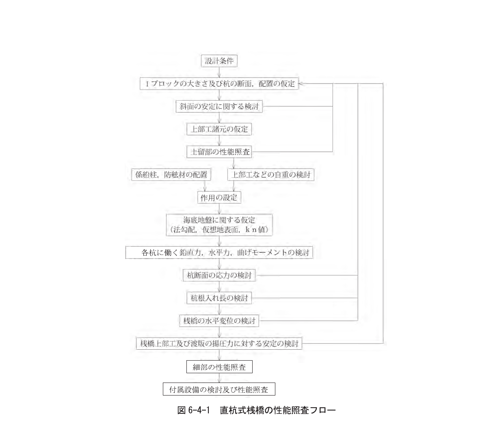

図 6-4-1 直杭式桟橋の性能照査フロー

斜杭式桟橋の照査は、一般に次に示す順序で行うことができる。

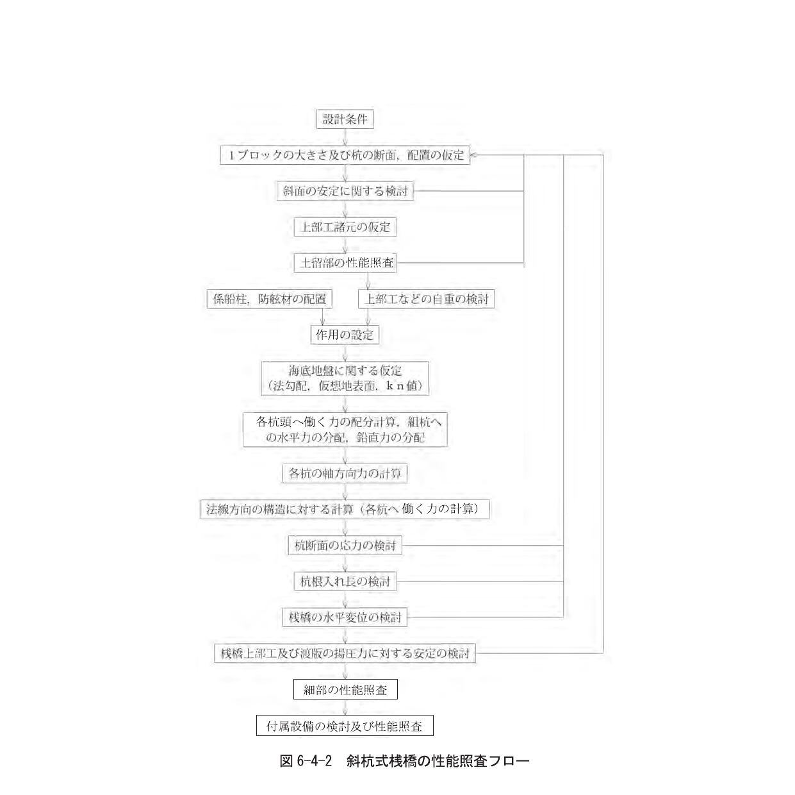

図 6-4-2 斜杭式桟橋の性能照査フロー

#### (2) 構造形式の選定

桟橋の構造形式は、「第6編 2.1 係船岸の構造形式の設定に関する考慮事項」を参考に選定することができる。

#### (3) 杭の配置及び諸元

桟橋ブロックの大きさ、杭間隔及び杭列間隔は、地盤条件、施工条件、上載荷重、エプロン幅、上屋の位置等を考慮して決定することを原則とする。

また、桟橋上部工の諸元は、杭の形状と配置、上載荷重、潮位、地盤条件、施工条件、付属工等を考慮して決定することを原則とする。

杭の配置及び諸元は、以下の①〜④によることができる。

① 上部工が場所打ち鉄筋コンクリートである場合には、コンクリート打設の施工性からも杭間隔は3〜5m程度とすることが多い。

② 防舷材を通じての防衝工反力や係船柱から伝わるけん引力が偏心して加わるときは、桟橋ブロックの回転による応力が大きくなる。したがって、できるだけ偏心した力が働かないように図 6-4-3 に示すように、桟橋ブロック中央部に防舷材や係船柱を取り付ける方がよい。

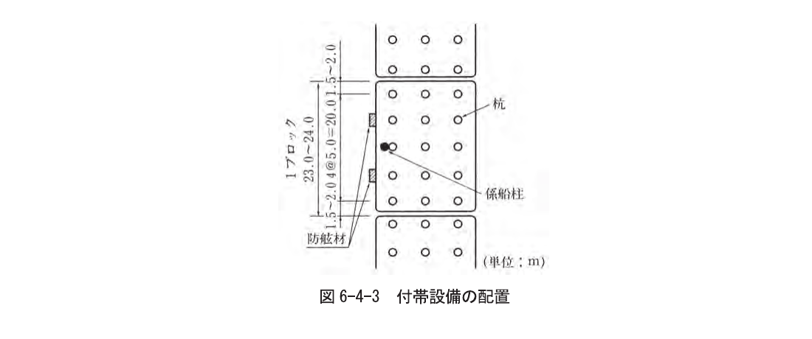

図 6-4-3 付帯設備の配置

③ 桟橋の1ブロックの大きさを決定するにあたっては、杭の不等沈下による桟橋の損傷を考慮するとともに、地震力や漁船等による作用に対して十分な剛度を有し、特定の杭に応力が集中しないよう配慮するのがよい。

④ 利用上、特に桟橋の変位が制限される場合は、変位が大きくならないように杭径及び間隔を決定することが望ましい。

### 4.4 性能照査に用いる主な作用

桟橋本体の作用としては、上載荷重等の鉛直力及び地震力等の水平力を考慮することを原則とする。桟橋本体の作用は、以下の (1) 〜 (9) によることができる。

(1) 桟橋本体への作用は、表 6-4-1 とすることができる。

表 6-4-1 桟橋本体への作用

| 鉛直力 | 水平力 |
|:---|:---|
| 上部工死荷重 | 上部工に作用する地震力 |
| 上載荷重 | 上載荷重に作用する地震力 |
| 活荷重 | 活荷重に作用する地震力 |
| 漁船等のけん引力 | 漁船等のけん引力 |
| 揚圧力 | 漁船等の接岸力 |

(2) 表 6-4-1 の作用のうち、地震力及び漁船等のけん引力は、変動作用として照査してよい。

(3) 表 6-4-1 のうち上部工死荷重、上部工に働く地震力には、それぞれ杭自重、杭自重に働く地震力を含める。

(4) 上載荷重に働く地震力は、床版上面に働くものとしてよい。

(5) 渡橋、床版等の照査において揚圧力を考慮することを原則とする。特に大きな波浪が働く箇所においては、模型実験やその他の既存資料等を参考とするのがよい。

上部工に働く揚圧力は、等分布の静荷重に換算した次式を用いてもよい1)。

$$
\left.\begin{aligned}
p_u &= 4 \, w \, H \quad \text{（背後に反射壁のある場合）} \\
p_u &= 2 \, w \, H \quad \text{（背後に反射壁のない場合）}
\end{aligned}\right\}
\tag{式6-4-1}
$$

ここに、

- $p_u$：等価静荷重（kN/m²）
- $w$：海水の単位体積重量（kN/m³）
- $H$：入射波高（m）

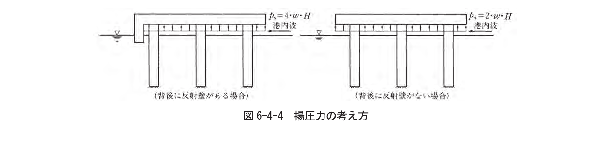

図 6-4-4 揚圧力の考え方

(6) 桟橋の杭を照査する場合、鉄筋コンクリート上部工の死荷重は、上部工の表面積 1m² 当たり 20kN と仮定してよい。

(7) 漁船の接岸力については、接岸頻度が多いと考えられる漁船等を対象とする場合には、一般に永続作用（常時荷重）として検討するが、例えば台風時の係留を想定した場合等接岸頻度が少ない漁船等を対象とする場合には、接岸力は変動作用と考えてよい。

(8) ゴム防舷材を用いる場合、漁船等の接岸力の算定には、原則として防舷材1箇所において有効接岸エネルギーを吸収するものとして算定することを原則とする（「第2編 14.2.1 接岸エネルギー」及び「第6編 10.1.4 防舷材」を参照のこと）。

(9) 桟橋上に他の建造物が設置されることが予想される場合は、建造物に働く地震力、風荷重を考慮するのがよい。

### 4.5 性能照査

#### (1) 利用性に関する性能照査

「第6編 3.3.1 利用性に関する性能照査」を準用することができる。

#### (2) 構造物の安全性に関する性能照査

性能照査の方法は、「第6編 4.6〜4.8」によることができる。

また、耐震性能の照査については、「第6編 2.2 係留施設の耐震性能の照査」によることができる。液状化対策については、「第6編 2.3 液状化対策」によることができる。また、「第6編 2.2 係留施設の耐震性能の照査」に示す、耐震性能・耐津波性能の強化を行う係船岸に対する耐震性能及び耐津波性能の照査は「第6編第5章 耐震性能・耐津波性能を強化する係船岸の照査」を参考にできる。土留壁の背後のエプロンの照査については、「第6編 2.7 エプロン」によることができる。

### 4.6 土留壁の照査

土留壁は、土圧、地震力、残留水圧等に対して安定となるよう照査することを原則とする。

土留壁の構造は重力式や矢板式等があるが、照査は、「第6編 3.4 重力式係船岸」「第6編 3.5 普通矢板式係船岸」等によることができる。ただし、漁船による接岸及びけん引に関する記述は適用しない。

また、土留壁の作用には渡版の反力を考慮に加えることを原則とする。

### 4.7 杭の照査

杭の照査においては、地盤条件等を考慮し、上載荷重、地震力、船舶のけん引力、接岸力等の作用に対して安定となるよう照査することを原則とする。

#### 4.7.1 直杭式桟橋

直杭式桟橋の照査は、以下の①〜⑬によることができる。

① 直杭式桟橋の杭の横抵抗、曲げモーメント及び軸力並びに上部工の曲げモーメント及びせん断力などの算定は、チャンの方法に基づく仮想固定点法により行う。

ここでいうチャンの方法に基づく仮想固定点法とは、単杭の横抵抗計算法としてはチャンの方法に従い、それによって定められる杭頭反力と杭頭曲げモーメントが等しくなるように、各々の杭に対して下端埋込みラーメンの脚長を定める方法をさす。

② 斜面が相当急な場合、杭の軸直角方向抵抗や支持力計算において、各杭の仮想地表面は、各杭の軸線上の位置で、前面水深と実斜面との 1/2 の高さのところとしてよい。

直杭式桟橋の解法に多く使用されている杭の横抵抗の計算法は、本来水平な地表面に関するものであり、桟橋のように斜面に打ち込まれた杭の横抵抗を計算する場合は、何らかの補正をする必要がある。ここでは計算を簡単にするため、簡便法を掲載している。

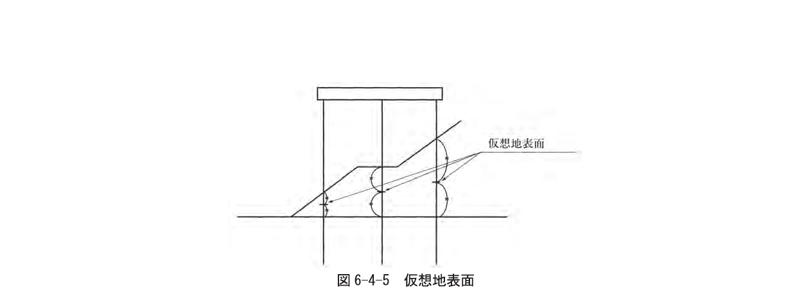

図 6-4-5 仮想地表面

③ 直杭式桟橋において、海底地盤中に固定点を仮定してラーメン計算をする場合、杭仮想固定点は仮想地表面下 $1/\beta$ にあるものとしてよい。$\beta$ は、式 6-4-2 により算定する。

$$
\beta = \sqrt[4]{\frac{k_h D}{4EI}} \quad \text{(cm}^{-1}\text{)}
\tag{式6-4-2}
$$

ここに、

- $k_h$：横方向地盤反力係数（N/cm³）
- $D$：杭の直径又は幅（cm）
- $E$：杭のヤング係数（N/cm²）
- $I$：杭の断面二次モーメント（cm⁴）

④ 桟橋の杭の断面応力は、軸方向力及び曲げモーメントを受ける杭として式 6-4-3 により算定できる。

$$
\sigma_c = \frac{P}{A}, \quad \sigma_{bc} = \frac{M}{Z}
\tag{式6-4-3}
$$

ここに、

- $\sigma_c$：杭の軸方向力による応力度（N/cm²）
- $\sigma_{bc}$：杭の曲げモーメントによる応力度（N/cm²）
- $A$：杭の断面積（cm²）
- $P$：杭の軸方向力（N）
- $Z$：杭の断面係数（cm³）
- $M$：杭の曲げモーメント（N・cm）

⑤ 桟橋の杭に対してはせん断応力は小さいので、特別の荷重条件でなければ検討を省略してもよい。

⑥ 杭の許容応力度については「第3編第2章 鋼材」を参照できる。なお、レベル1地震動等の変動作用について照査する際の桟橋等の部材の許容応力度は、表 6-4-2 のとおり割り増しできる。

表 6-4-2 材料の許容応力度割増率

| 種別 | 割増係数 |
|:---|:---|
| 鋼材 | 1.50 |
| コンクリート | 1.50 |

⑦ 各杭に分配される水平力は次の方法により求めることができる。

a）桟橋のブロックの回転を考慮する必要がない場合

$$
H_i = \frac{K_{Hi}}{\sum K_{Hi}} H
\tag{式6-4-4}
$$

b）桟橋のブロックの回転を考慮する必要がある場合

桟橋のブロックが、桟橋法線に対して直角方向に対称軸を有し、かつ、水平力の作用方向が対称軸に平行な場合の水平力は、式 6-4-5 によって求めることができる。

$$
H_i = \frac{K_{Hi}}{\sum K_{Hi}} H + \frac{K_{Hi} \, x_i}{\sum K_{Hi} \, x_i^2} \, eH
\tag{式6-4-5}
$$

ここに、

- $H_i$：杭に分配される水平力（kN）
- $K_{Hi}$：横方向のバネ定数（kN/m）

$$
K_{Hi} = \frac{12EI_i}{\left(h_i + \dfrac{1}{\beta_i}\right)^3}
$$

- $h_i$：杭頭から仮想地表面までの長さ（m）
- $1/\beta$：仮想地表面から杭の仮想固定点までの深さ（m）
- $EI_i$：杭の曲げ剛性（kN・m²）
- $H$：ブロックに働く水平力（kN）
- $e$：桟橋のブロックの対称軸と水平力の作用線との距離（m）
- $x_i$：桟橋のブロックの対称軸から各杭までの距離（m）

なお、添字 i は i 番目の杭に関するものである。

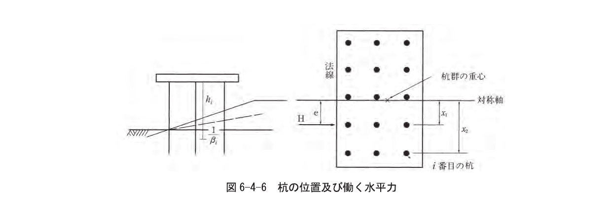

図 6-4-6 杭の位置及び働く水平力

⑧ 杭の杭頭モーメントは、式 6-4-6 で求めることができる。

$$
M_i = \frac{1}{2} \left( h_i + \frac{1}{\beta_i} \right) H_i
\tag{式6-4-6}
$$

ここに、

- $M_i$：i 番目の杭頭モーメント（kNm）

⑨ 杭の軸力は式 6-4-7 で求めることができる。

$$
P_i = {}_hP_i + {}_vP_i
\tag{式6-4-7}
$$

ここに、

- $P_i$：i 番目の杭の軸力（kN）
- $_vP_i$：鉛直荷重による i 番目の杭の軸力（kN）
- $_hP_i$：水平力による i 番目の杭の軸力（kN）

$$
{}_hP_i = S_{i,i-1} + S_{i,i+1} = \frac{M_{i-1,i} + M_{i,i-1} - M_{i,i+1} - M_{i+1,i}}{l}
$$

- $S_{i,i-1}$：水平力による i 番目の杭頭における左側の梁のせん断力（kN）
- $S_{i,i+1}$：水平力による i 番目の杭頭における右側の梁のせん断力（kN）
- $M_{i-1,i}$：水平力による (i−1) 番目の杭頭における右側の梁の曲げモーメント（kNm）
- $M_{i,i-1}$：水平力による i 番目の杭頭における左側の梁の曲げモーメント（kNm）
- $M_{i,i+1}$：水平力による i 番目の杭頭における右側の梁の曲げモーメント（kNm）
- $M_{i+1,i}$：水平力による (i+1) 番目の杭頭における左側の梁の曲げモーメント（kNm）
- $l$：梁のスパン（m）、杭の中心間隔とする。

なお、ここで $M_{i,i-1}$、$M_{i,i+1}$ は杭頭モーメントを $M_i$ とする中間の支点上では、式 6-4-8 で求め、端の支点では杭頭モーメントをそのままとればよい。

$$
\left.\begin{aligned}
M_{i,i-1} &= aM_i \\
M_{i,i+1} &= bM_i
\end{aligned}\right\}
\tag{式6-4-8}
$$

ここに、

- a, b が2スパンの場合は、a＝0.60, b＝0.60
- a, b が3スパンの場合は、水平荷重の働く杭頭より
  - 2番目の杭で a＝0.50, b＝0.70、3番目の杭で a＝0.70, b＝0.50

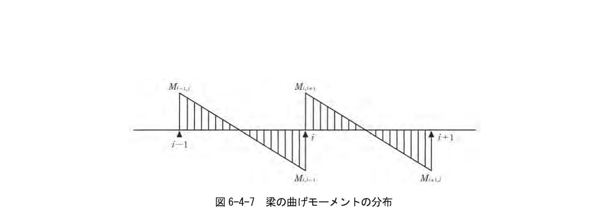

図 6-4-7 梁の曲げモーメントの分布

⑩ 桟橋及び杭の変位は、上部構造物に影響を与えない範囲とすることが望ましい。

⑪ 桟橋全体及び杭の変位量は、式 6-4-9〜式 6-4-11 で求めることができる。

桟橋全体の水平変位量（$\Delta$）

$$
\Delta = \frac{H}{\sum K_{Hi}}
\tag{式6-4-9}
$$

桟橋の回転量（$\alpha$）

$$
\alpha = \frac{eH}{\sum K_{Hi} x_i^2}
\tag{式6-4-10}
$$

各杭の杭頭変位量（$\Delta_i$）

$$
\Delta_i = \frac{H}{\sum K_{Hi}} + \frac{x_i}{\sum K_{Hi} x_i^2} \, eH = \Delta + \alpha x_i
\tag{式6-4-11}
$$

⑫ 各直杭の軸方向に対する根入れ長は、必要な支持力を得られる深さまでとするが、できるだけ良好な支持層まで打ち込むことが望ましい。

杭の軸方向支持力は、「第4編第3章 杭基礎の支持力」によって算定できる。ただし、斜面に打込まれた杭の支持力の計算にあたっては、仮想地表面以下を有効な支持層と考えるのがよい。

⑬ 各直杭の軸直角方向支持力に対する根入れ長は、杭の横抵抗の解析結果から、地表面下 $3/\beta$ を標準とする。ただし、この値は仮想地表面以下に適用する。

チャンの方法は杭の地中部の長さを無限と仮定した解であり、地中部有限長の杭に適応できる範囲を検討した結果、杭の根入れ長が $\beta l > \pi$（$1 > \pi / \beta \fallingdotseq 3/\beta$、$l$：地中部の杭の根入れ長）以上あれば、有限長の杭を無限長の杭として取り扱っても、大きな誤差は生じないことが分かっている。

チャンの方法における無限長と有限長の杭の近似性（誤差）をもう少し許容すれば、地中部の根入れ長は $2/\beta$ まで許容することができる。しかし、いかなる場合においても仮想地表面下 $2/\beta$ より短くすることは避けることが望ましい。

#### 4.7.2 斜杭式桟橋

斜杭式桟橋の照査は、以下の①〜⑩によることができる。

① 斜杭構造においては、水平力は全て斜杭で分担される。

② 各斜杭の断面、斜杭勾配が異なる場合には、各斜杭頭に分配される水平力は、式 6-4-12 又は式 6-4-13 により算定することができる。

a）完全な支持杭とみなせる場合

ア）桟橋のブロックの回転を考慮する必要がない場合

$$
H_i = \frac{C_i}{\sum C_i} H
\tag{式6-4-12}
$$

イ）桟橋のブロックの回転を考慮する必要がある場合

$$
H_i = \frac{C_i}{\sum C_i} H + \frac{C_i x_i}{\sum C_i x_i^2} \, eH
\tag{式6-4-13}
$$

ここに、

$$
C_i = \frac{\sin^2(\theta_{i1} - \theta_{i2})}{\dfrac{l_{i1}}{A_{i1} E_{i1}} \cos^2\theta_{i2} + \dfrac{l_{i2}}{A_{i2} E_{i2}} \cos^2\theta_{i1}}
$$

- $H$：ブロックに働く水平力（kN）
- $H_i$：杭に分配される水平力（kN）
- $e$：斜杭の中心線と作用水平力との距離（m）
- $x_i$：各斜杭から斜杭中心線までの距離（m）
- $l_i$：杭全長（m）（ただし、引き抜き力が働くときは摩擦杭の1を用いる。）
- $A_i$：各杭の断面積（m²）
- $E_i$：各杭の弾性係数（kN/m²）

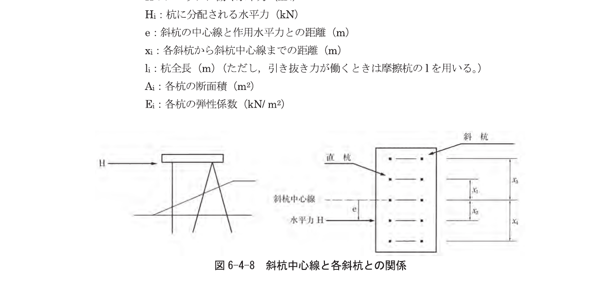

図 6-4-8 斜杭中心線と各斜杭との関係

- $\theta_{i1}$, $\theta_{i2}$：各杭の鉛直方向となす角（°）

添字 i は i 番目の杭に関するものである。

添字 1, 2 は1組の斜杭の各杭に関するものである。

なお、斜杭の中心線は、$\sum C_i \xi_i / \sum C_i$ で求めることができる。

$\xi_i$ は任意の座標の原点から各斜杭の法線方向の座標である。

b）完全な摩擦杭とみなせる場合

ア）砂質土

式 6-4-12、式 6-4-13 を用いるが、$l_i$ の代わりに $\dfrac{2l_i + \lambda_i}{3}$ を用いる。

イ）粘性土

式 6-4-12、式 6-4-13 を用いるが、$l_i$ の代わりに $\dfrac{l_i + \lambda_i}{2}$ を用いる。

ここに、

- $\lambda_i$：周面摩擦力が有効に働かない部分の長さ（m）
- $l_i$：杭全長（m）

③ 各斜杭の断面や斜杭勾配及び長さが全て等しい場合には、各組杭に分配される水平力は式 6-4-14 又は式 6-4-15 により算定することができる。

a）桟橋のブロックの回転を考慮する必要がない場合

$$
H_i = \frac{1}{n} H
\tag{式6-4-14}
$$

b）桟橋のブロックの回転を考慮する必要がある場合

$$
H_i = \frac{1}{n} H + \frac{x_i}{\sum x_i^2} \, eH
\tag{式6-4-15}
$$

ここに、

- $n$：斜杭の数

④ 各鉛直荷重により杭に働く押し込み力は、杭位置で支持された単純ばりとして算出した支点反力としてよい。

⑤ 各斜杭の押し込み力及び引き抜き力は、①〜③で求められた各斜杭に分配される水平力と④で求められた各斜杭頭に分配される鉛直荷重を用いて、「第4編 3.2 杭に働く荷重」により計算してよい。

⑥ 斜杭式桟橋中に含まれる直杭の押し込み力は、④で求められる支点反力としてよい。

⑦ 各杭断面応力は、軸方向力を受ける杭として、又は軸方向力及び曲げモーメントを受ける杭として、「第6編 4.7.1 直杭式桟橋」④により算定することができる。

⑧ 斜杭の支持力は、「第6編 4.7.1 直杭式桟橋」⑫、⑬に準じてよい。

⑨ 法線方向に斜杭がある場合には、法線直角方向と同様な方法で検討することができる。

⑩ 法線方向に斜杭がない場合には、法線方向に対しても「第6編 4.7.1 直杭式桟橋」に準じて検討することができる。

#### 4.7.3 その他

① 杭断面の応力については、このほか打込み時の条件も想定し、打込み時の衝撃応力、打込み時の座屈、また圧密沈下が予想されるところでは、ネガティブフリクションについて検討することを原則とする（「第4編 3.6.2 負の周面摩擦力による支持力の低下」参照）。

② 相当の波浪が来襲すると予想されるところでは、波の揚圧力に対する杭の引き抜き抵抗についても検討することが望ましい。

### 4.8 上部工及び渡版の照査

上部工及び渡版の照査においては、想定される作用に対して安定なものであることを確認することを原則とする。

上部工及び渡版の照査は、以下の (1) 〜 (3) によることができる。

(1) 荷重の組み合わせは次のものを考慮し、これらに対して安全であることを確認する。

① 床版及び渡版

- a）（死荷重）＋（上載荷重）
- b）（死荷重）＋（輪荷重）
- c）（死荷重）＋（揚圧力）

② 梁

- a）（死荷重）＋（上載荷重）
- b）（死荷重）＋（輪荷重）
- c）（死荷重）＋（水平力による杭頭モーメントの影響）＋（水平力を考慮したときの上載荷重）
- d）杭の弾性沈下の影響

(2) 計算にあたっては、自動車の衝撃荷重の影響は考慮しない。

(3) 一般に、桟橋構造は、普通の橋梁のように床版、縦桁、床桁を介して、主桁に荷重が伝わる形式のものは少なく、建築物の屋根のように大梁だけ、若しくは大梁と小梁を用いたものが多い。このような小支間の桟橋としては活荷重は輪荷重のみとして照査することができる。

### 参考文献

1) 伊藤喜行・竹田英章：桟橋に作用する波の揚圧力, 港湾技術研究所報告 Vol.6, No.4 (1967), pp.37-68

## 第5章 耐震性能・耐津波性能を強化する係船岸の照査

### 5.1 耐震性能・耐津波性能を強化する係船岸の性能規定

> 耐震性能及び耐津波性能を強化する岸壁の性能規定は、構造形式に準じて、「重力式係船岸」、「矢板式係船岸」又は「桟橋」の規定を準用するほか、以下に定めるとおりとする。
>
> 1. 耐震強化岸壁及び耐震強化岸壁に準じる岸壁にあっては、レベル1地震動の作用に対して液状化判定を行い、必要に応じて液状化対策が講じられていること。また、自重、浮力、レベル2地震動等の作用に対して、岸壁に生じる変形量が許容値以下となること。
> 2. その他の耐震性能を強化する岸壁にあっては、レベル1地震動又は発生頻度の高い津波を発生させる地震動の作用に対して液状化判定を行い、必要に応じて液状化対策が講じられていること。
> 3. 耐津波性能を強化する岸壁にあっては、設計津波による作用に対して、構造形式に応じた構造の安定性が満足されること。
> 4. 特に重要な施設にあっては、設計津波を超える津波による作用に対して、可能な限り安定が保たれる構造上の工夫が施されていること。

本章では、耐震性能・耐津波性能の強化を行う係船岸の性能照査について述べる。本章で対象とするのは、「第1編 2.2.5 耐震性能・耐津波性能の強化を行う施設」の「表 1-2-6 耐震強化型の岸壁の区分」に示された係船岸である。

### 5.2 性能照査の基本

耐震性能については、漁港の役割や施設の機能に応じ、所要の地震動に対する耐震性能を確保することを標準とする。

耐津波性能については、引き波時の水位が低下した状態に対する係船岸の安定性（(1)滑動、(2)転倒、(3)基礎の支持力）を確保するとともに、発生頻度の高い津波の作用（流体力）に対する根固・被覆ブロックの安定性を確保することを標準とする。

さらに、発生頻度の高い津波を超える津波に対しても、粘り強く施設の機能を維持し減災効果を期待する観点から、粘り強い構造（堤体の傾斜抑制及び前面の洗掘防止等の対策）について検討し、必要に応じて対策を講じることが望ましい。なお、粘り強い構造の検討にあたっては、漁港の施設の利用状況、工事施工上の制約、費用対効果等を総合的に勘案し、効果が高いものを採用するのがよい。

図 6-5-1 に示すように、基本的には地震、津波の順で双方を検討することにより、耐震性能・耐津波性能を強化した断面を決定することを標準とする。

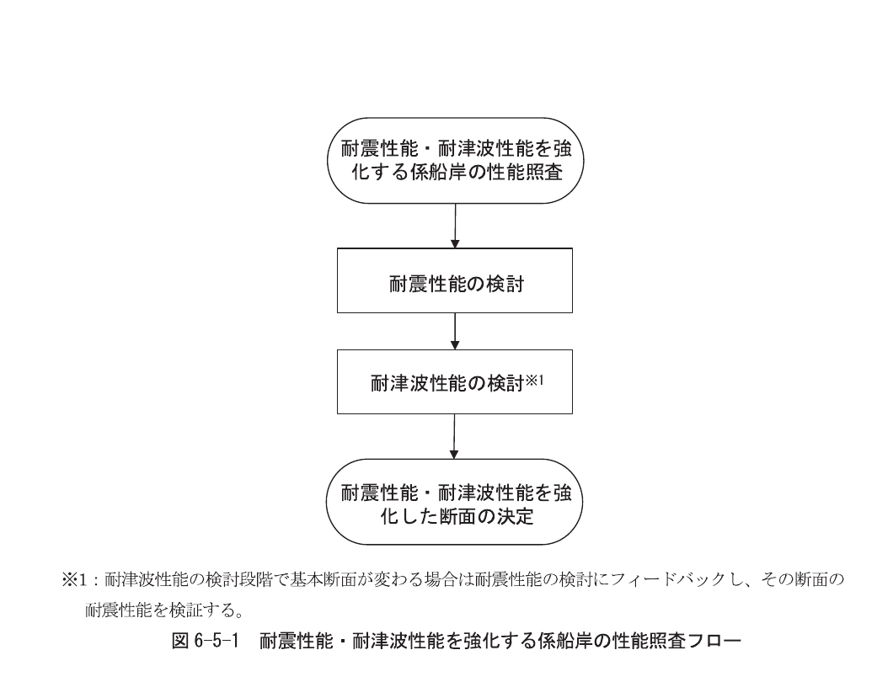

図 6-5-1 耐震性能・耐津波性能を強化する係船岸の性能照査フロー

### 5.3 性能照査に用いる主な作用

#### (1) 地震による作用

耐震強化岸壁の性能照査における地震による作用は、レベル1地震動及びレベル2地震動とすることを標準とする。レベル2地震動に関する性能照査における地震による作用は、施設位置周辺における地震の知見（プレート境界、断層、過去の地震記録など）によって決まる地震動及び、「第2編 11.3.4 どこにでも起こりうる直下地震の地震動の算出方法」に示す M6.5 程度の直下地震による地震動とし、双方について照査することを標準とする。

「耐震強化岸壁に準じる岸壁」の性能照査における地震による作用は、耐震強化岸壁に準ずることを標準とする。

「その他の耐震性能を強化する岸壁」の性能照査における地震による作用は、レベル1地震動及び発生頻度の高い津波を生じさせる地震による地震動のうち、影響の大きなものとすることを標準とする。

#### (2) 津波による作用

発生頻度の高い津波を照査に用いることを標準とする。

#### (3) 耐震強化岸壁における対象船舶

耐震強化岸壁の対象船舶は、常時利用する漁船と緊急時に利用する救助船等の船舶とすることを標準とする。

### 5.4 性能照査

#### 5.4.1 利用性に関する性能照査

利用性に関する性能照査は、構造形式別の各章の記述によることができる。

かつ、耐震強化岸壁については、構造（係船岸の高さ、防舷材の位置等）は、常時及び緊急時の対象船舶、利用状況を考慮して定めることを標準とする。すなわち、常時利用する漁船と緊急時に利用する救助船等の船舶の両者を想定して照査することを標準とする。想定される救助船が常時に利用する漁船に比べ大型の場合には、防舷材・係船柱の配置や階段の設置等により、漁船の利用に支障がないように配慮するほか、係船岸の背後用地及び隣接する係留施設へのすりつけについて十分配慮することが望ましい。

#### 5.4.2 構造物の安全性に関する性能照査

構造物の安全性に関する性能照査は、構造形式別の各章の記述並びに、「第6編 5.4.3 耐震性能に関する性能照査」及び「第6編 5.4.4 耐津波性能に関する性能照査」によることができる。

#### 5.4.3 耐震性能に関する性能照査

耐震強化岸壁においては、レベル1地震動に対して、施設の損傷及び利用上の制約が限定的なものにとどまり、軽微な補修により早期に機能が回復できることを標準とする。レベル2地震動に対して、施設の損傷が被災直後の緊急的な利用が可能な程度にとどまることを標準とする。

「耐震強化岸壁に準じる岸壁」においては、レベル1地震動に対して、施設の損傷及び利用上の制約が限定的なものにとどまり、軽微な補修により早期に機能が回復できることを標準とする。レベル2地震動に対して、施設の損傷が、被災後の水産業の再開から回復に至る期間における利用が可能な程度にとどまることを標準とする。

「その他の耐震性能を強化する岸壁」においては、レベル1地震動及び、発生頻度の高い津波を生じさせる地震による地震動に対して、施設の損傷及び利用上の制約が限定的なものにとどまり、軽微な補修により早期に機能が回復できることを標準とする。

耐震性能照査の方法は、漁港の役割や施設の機能に応じて、表 6-5-1 によることができる。検討手順は、係船岸の種類と、新設か既設かの区分に応じて、以下に述べる（1）及び（2）によることができる。その際、地震動及び設計水平震度の算定、液状化判定、変形量の許容値等については（3）によることができる。

また、耐震強化岸壁及び、耐震強化岸壁に準じる岸壁の照査にあたっては、係船岸本体の耐震性能照査と基礎地盤及び背後地の液状化の検討とともに、当該係船岸の機能を確保するため、係船岸の背後地盤やアクセス道路の耐震及び液状化対策の検討を行うことを標準とする。

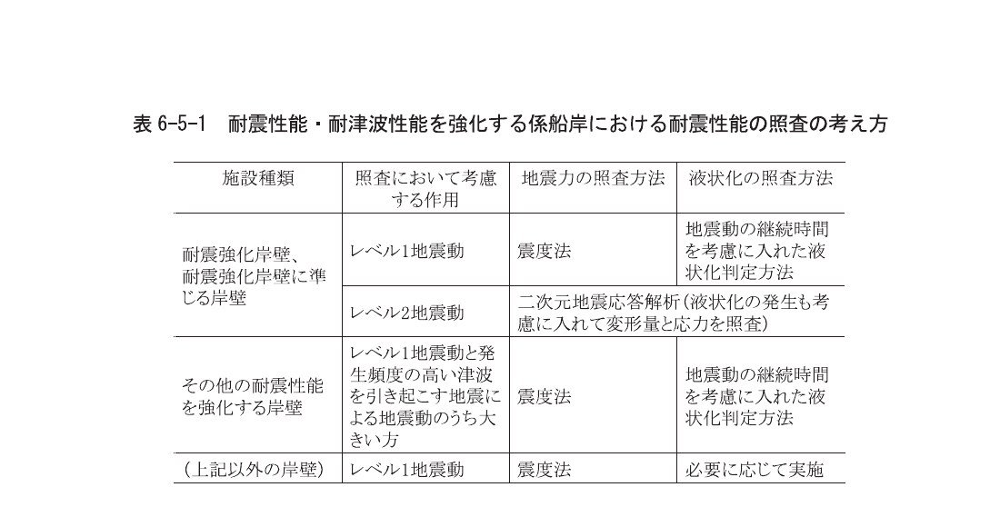

表 6-5-1 耐震性能・耐津波性能を強化する係船岸における耐震性能の照査の考え方

#### (1) 耐震強化岸壁

耐震強化岸壁及び「耐震強化岸壁に準じる岸壁」の耐震性能の照査は、次の(1)〜(5)の手順によることを標準とする。対応するフロー図を、新設の係船岸の場合について図 6-5-2 に、既設の係船岸の場合について図 6-5-3 に示す。

(1) レベル1地震動の設計水平震度を用いて構造断面を設定する。

(2) 地震動の継続時間を考慮した液状化判定 1)を実施し、地盤全体として液状化する場合には液状化対策を講ずる。

(3) (1)で設定した断面及び(2)で決定した液状化対策を初期値として、レベル2地震動による二次元地震応答解析を行い、変形量等が許容値以内にあるかを照査する。鋼部材については応力度の照査も行う。ただし、明らかにレベル2地震動でも液状化しない場合（岩盤上又は等価N値が25以上で如何なる地震でも液状化しない地盤に建設し、さらに埋立材料も液状化しない材料とする場合）には、地震時に地盤の軟化が生じないため、レベル2地震動から設計水平震度を算出して震度法により照査することで、レベル2地震動に対して所定の性能を満足していると見なすことができる。

(4) (3)で許容値以内でない場合には、断面あるいは液状化対策を見直し、許容値以内に収めるようにする。

(5) 断面の決定後、「第6編 5.4.4 耐津波性能に関する性能照査」のフロー図における津波に対する検討へ進む。ただし、耐津波性能の検討で断面形状が変更になった場合には、変更した断面で再度耐震性能の評価を実施する。

この手順(2)の検討により必要と判断された液状化対策について、一般的には「第2編 12.4 液状化対策の改良範囲」に基づき対策の範囲を検討することが望ましい。しかし係船岸背後に構造物が存在する等の理由により検討結果どおりに対策を実施することが困難な場合には、レベル1地震動を入力する二次元地震応答解析を実施して、生じる変形量等が係船岸等の機能に影響を及ぼさないことを照査することによりレベル1地震動に対する液状化対策範囲（初期断面）を決定してもよい。

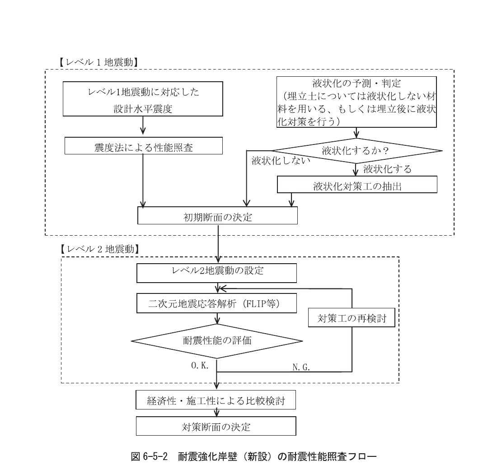

図 6-5-2 耐震強化岸壁（新設）の耐震性能照査フロー

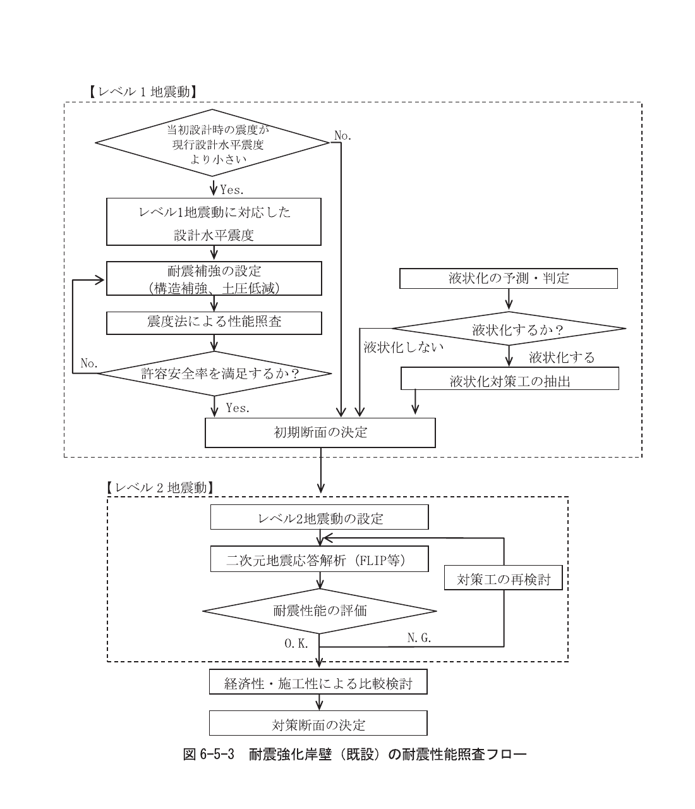

図 6-5-3 耐震強化岸壁（既設）の耐震性能照査フロー

#### (2) その他の耐震性能を強化する岸壁

「その他の耐震性能を強化する岸壁」の耐震性能照査は、次の(1)〜(3)の手順によることを標準とする。対応するフロー図を、新設の係船岸の場合について図 6-5-4 に、既設の係船岸の場合について図 6-5-5 に示す。

(1) a)、b)を比較して大きい方の設計水平震度を用いて構造断面を設定する。
- a）レベル1地震動に対応した設計水平震度
- b）発生頻度の高い津波を生じさせる地震による地震動から求まる設計水平震度

(2) 地震動の継続時間を考慮した液状化判定 1)を実施し、地盤全体として液状化する場合には液状化対策を講ずる。液状化判定には、上記 a)、b)のうち大きい設計水平震度となる地震動を用いる。

(3) 断面の決定後、「第6編 5.4.4 耐津波性能に関する性能照査」のフロー図における津波に対する検討へ進む。ただし、耐津波性能の検討で断面形状が変更になった場合には、変更した断面で再度耐震性能の評価を実施する。

この手順(1)において、設計水平震度が大きい場合、震度法による照査では過大な断面が求まる場合がある。この場合は以下に示す方法で断面を決定してもよい。なお、ここで設計水平震度が大きい場合とは、概ね設計水平震度が 0.25 を超える場合としてもよい。

a）レベル1地震動に対応した設計水平震度が 0.25 を超える場合

「第6編第2章 2.2.3(2)照査用震度の使用に係る留意点」の(8)を参照する。

b）発生頻度の高い津波を生じさせる地震による地震動から求まる設計水平震度が 0.25 を超える場合

レベル1地震動に対応した設計水平震度を用いて設定した構造断面に対して、発生頻度の高い津波を生じさせる地震による地震動を入力する二次元地震応答解析を実施して、生じる変形量等が係船岸等の機能に影響を及ぼさないことを照査することにより断面を決定する。

また、この手順(2)の検討により必要と判断された液状化対策について、一般的には「第2編 12.4 液状化対策の改良範囲」に基づき対策の範囲を検討することが望ましいが、係船岸背後に構造物が存在する等の理由により検討結果どおりの対策の実施が困難な場合がある。この場合はレベル1地震動もしくは発生頻度の高い津波を生じさせる地震による地震動のうち(1)で選定した方の地震動を入力する二次元地震応答解析を実施して、対策範囲を検討してもよい。

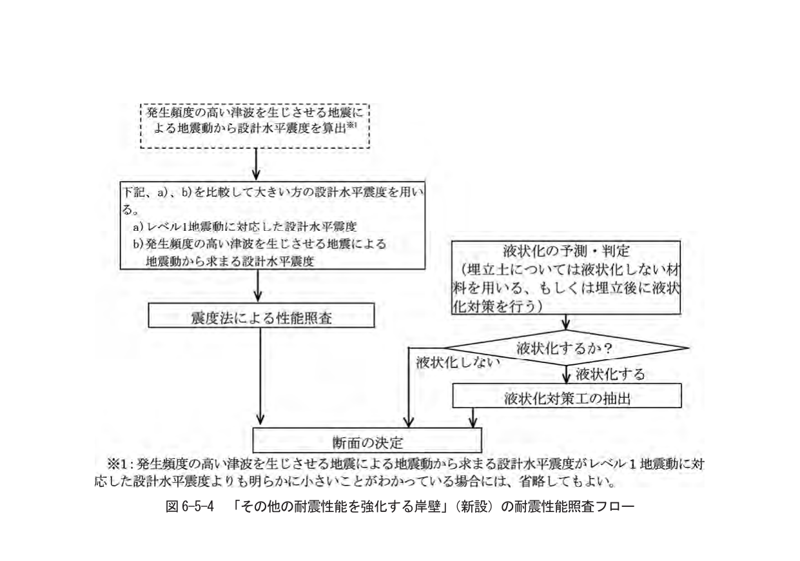

図 6-5-4 「その他の耐震性能を強化する岸壁」（新設）の耐震性能照査フロー

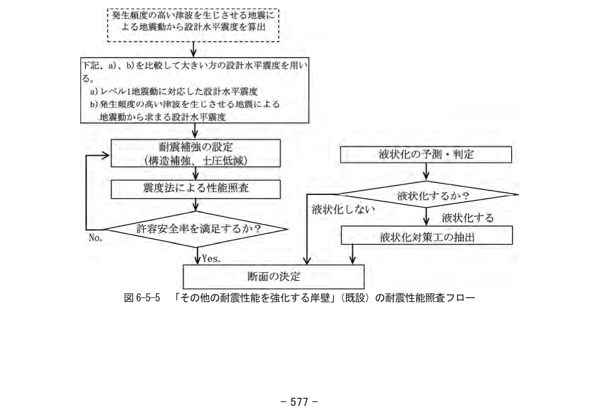

図 6-5-5 「その他の耐震性能を強化する岸壁」（既設）の耐震性能照査フロー

#### (3) 耐震性能に関する性能照査の補足事項

##### (1) 二次元地震応答解析

係船岸の照査に使用される地震応答解析には、表 6-5-1 に示した二次元応答解析と、一次元地震応答解析がある。また、間隙水圧の取扱いの観点並びに計算領域の観点から分類できる。詳細は、「資料 6.1 地震動及び設計水平震度の算定方法 8.地震応答解析の分類」に示す。

地震応答解析のためには、対象とする地点の工学的基盤〜地表の地盤データを必要とする。

##### (2) レベル2地震動

レベル2地震動は、次のいずれかにより設定することができる。

- 「第2編 11.3.1 サイト特性を考慮した地震動の算出手法」により、震源特性、伝播経路特性、サイト特性を考慮して算出する。
- 「第2編 11.3.3 サイト特性を考慮しない地震動の設定方法」で設定する。

上記のほか、地震動の設定においては、「資料 6.1 地震動及び設計水平震度の算定方法」を参考にできる。

##### (3) 発生頻度の高い津波を生じさせる地震による地震動

発生頻度の高い津波を生じさせる地震による地震動の設定にあたっては、中央防災会議等により適切な方法で設定された地震動を用いることが望ましい。中央防災会議等により地震動が設定されていない場合には、「資料 6.1 地震動及び設計水平震度の算定方法 2.工学的基盤の地震動波形の設定方法（モデル波形を振幅調整する方法）」に示されている手順に基づき地震動を設定してもよい。ただし、この手順を用いる際は、地震学、地盤工学等の専門家のもとで発生頻度の高い津波を引き起こす断層モデルのパラメータ（断層位置、断層の傾き、断層の長さ、マグニチュードなど）の妥当性を確認することを原則とする。

##### (4) 設計水平震度

a）レベル1地震動の設計水平震度は、「第2編 11.2.1 設計水平震度」表 2-11-1 に示す係留施設 A の設計水平震度を用いることを標準とする。（重力式係船岸及び水深-2.0m〜-5.5m の控え直杭式矢板式係船岸においては、「第2編 11.2.3 周波数特性と変形量を考慮に入れた設計水平震度」に示す照査用震度を用いてもよい。）

b）発生頻度の高い津波を生じさせる地震の設計水平震度は、次のいずれかにより求めることができる。

- 地表面最大加速度をもとに、「資料 6.1 地震動及び設計水平震度の算定方法 7．地表面最大加速度と設計水平震度の関係」により算定する。
- 重力式係船岸及び水深-2.0m〜-5.5mの控え直杭式矢板式係船岸においては「第6編 2.2.3 周波数特性及び変形量を考慮に入れた設計水平震度」に示す手法で算出される照査用震度を用いてもよい。その際、発生頻度の高い津波を生じさせる地震の地震動波形を使用して計算する。

c）工学的基盤の最大加速度から係船岸の照査に用いる設計水平震度を算出するには、次の 1)〜3)の手順を用いることができる。この方法は、簡便に設計水平震度を求める方法として長く使用されてきている。ただし、サイト特性（地震基盤から上の増幅特性・位相特性）の考慮はできない。

1）地震の選出と工学的基盤最大加速度の推定

施設設置位置への影響が想定される地震を選出して施設設置位置の工学的基盤の最大加速度を推定する。工学的基盤最大加速度により、モデル波形を振幅調整する。手順は、「第2編 11.3.3 サイト特性を考慮しない地震動の設定方法」によることができる。

2）一次元地震応答解析により地表面最大加速度を算定

施設建設予定地の地盤データに基づき一次元地震応答解析を実施して、地表面最大加速度を算定する。その方法は、「資料 6.1 地震動及び設計水平震度の算定方法 6．工学的基盤より浅い範囲の一次元地震応答解析」及び「同 8．地震応答解析の分類」を参考にできる。

3）設計水平震度の設定

地表面最大加速度を用いて設計水平震度を算出する。方法は、「第2編 11.2.2 加速度と設計水平震度との関係式」によることができる。

地震動（その最大加速度）から設計水平震度を算出する際は、SMAC 型地震計相当の地震動を用いることを原則とする。（「第2編 11.2.2 加速度と設計水平震度との関係式」参照）

##### (5) 液状化判定

液状化判定は「第2編第12章 液状化」にしたがって行い、判定結果に応じて、適切な液状化対策の検討を行うことを原則とする。

液状化判定のための地震動は、「第2編 12.2.2 液状化予測・判定手法」により求めることができる。

##### (6) 許容変形量

変形量の許容値は「第6編 2.2.5 耐震性能の照査における許容変形量」に示す値を用いることができる。

#### 5.4.4 耐津波性能に関する性能照査

耐津波性能を強化する係船岸において、耐津波性能に関する性能照査は、図 6-5-6 及び以下の（1）〜（7）によって、引き波時の水位が低下した状態に対する係船岸の安定性（(1)滑動、(2)転倒、(3)基礎の支持力）を確保するとともに、発生頻度の高い津波の作用（流体力）に対する根固・被覆ブロックの安定性を確保することを標準とする。

さらに、発生頻度の高い津波を超える津波に対しても、粘り強く施設の機能を維持し減災効果を期待する観点から、粘り強い構造（堤体の傾斜抑制及び前面の洗掘防止等の対策）について検討し、必要に応じて対策を講じるのがよい。粘り強い構造の検討にあたっては、漁港の施設の利用状況、工事施工上の制約、費用対効果等を総合的に勘案し、効果が高いものを採用することが望ましい。

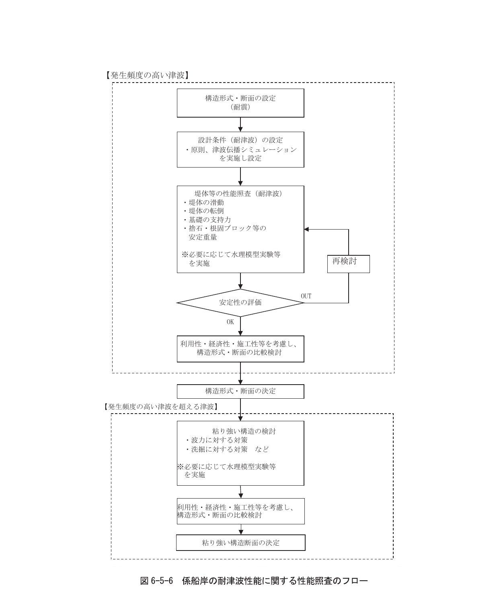

図 6-5-6 係船岸の耐津波性能に関する性能照査のフロー

#### (1) 性能照査フロー並びに設計条件

引き波時に前面の水位が最も低くなり、かつ、係船岸背後の残留水位が埋立地盤高と同等となる状態を想定し、図 6-5-7 により性能照査を行う。津波伝播シミュレーションの結果を利用する場合には、L.W.L.時として潮位を考慮することを基本とするが、H.W.L.時の結果と大きな差がないと判断される場合にはその結果を代用させてもよい。

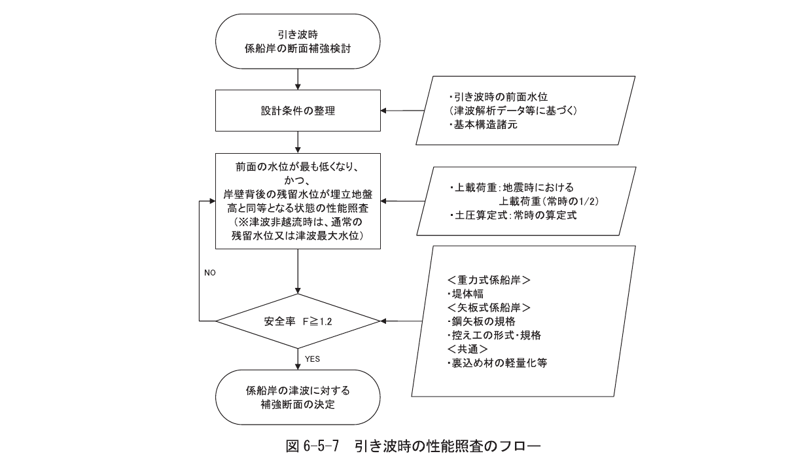

図 6-5-7 引き波時の性能照査のフロー

作用は、以下のとおりとすることができる。

- 土圧分布形状は、「第2編 10.1.5 砂質土の地震時の土圧 （5）土圧分布の算定法」により与える。
- 上載荷重は、地震時における上載荷重、すなわち常時の 1/2 を与える。（「第2編 13.3 上載荷重」より）
- 土圧分布は、設計水平震度を考慮せず、常時の土圧算定式により与える。

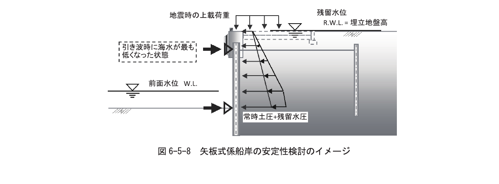

図 6-5-8 矢板式係船岸の安定性検討のイメージ

#### (2) 堤体の性能照査

上記（1）による作用を用いた堤体の滑動と転倒に対する性能照査を行う。

求められる滑動と転倒に対する安全率は、表 6-5-2 によることができる。

表 6-5-2 求められる安全率一覧

| 滑動安全率 | 転倒安全率 |
|:---:|:---:|
| 1.2 以上 | 1.2 以上 |

表 6-5-2 以外の安全率等については、津波による作用の不確実性及び浸透流等の考慮していない作用の影響等を勘案し、当面の間、常時における値で照査を行うことができる。（「(4)平面基礎の支持力に対する検討」及び「(5)杭・矢板の照査」参照）

#### (3) 捨石・根固ブロック等の検討

津波の流れに対する根固・被覆ブロック等の安定質量については、「第2編 5.3 津波の流れの作用に対する被覆石及びブロックの所要質量」によることができる。

津波引き波時に係船岸から流下する強い流れに対する係船岸前面の根固・被覆ブロック等の安定質量については、防波堤を越流した津波水塊の打ち込みによる流速と同様、津波伝播シミュレーションで推定することが現時点では困難なため、水理模型実験によって設定することが望ましい。

#### (4) 平面基礎の支持力に対する検討

壁体底面における地盤反力を算定し、最大地盤反力と許容端趾圧とを比較する。許容端趾圧は、500kN/m2以下とすることが望ましい。（「第4編 2.3 地盤反力の算定」参照）

偏心傾斜荷重に対する支持力の評価は、簡易ビショップ法による円形すべり計算によって行ってよい。簡易ビショップ法の安全率は、常時の値を使用できる。（「第4編 2.6 偏心傾斜荷重に対する支持力」参照）

#### (5) 杭・矢板の照査

上記（1）による上載荷重及び土圧分布を用い、杭・矢板の必要根入れ長、発生応力、頭部変位に対する照査を行う。（「第6編第3章 岸壁・物揚場」のうち矢板式の各項目並びに「第6編第4章 桟橋」参照）

杭・矢板の照査における安全率、許容応力度及び変位量許容値は、「第6編第3章 岸壁・物揚場」及び「第6編第4章 桟橋」における常時の値を使用できる。

#### (6) 直立消波ブロック式係船岸における上部工の安定検討

直立消波ブロック式係船岸では、東日本大震災において、上部コンクリートの飛散が顕著であった。これは、津波による揚圧力が要因として考えられることから、以下に示す作用を考慮した上部工の安定性（転倒のみ）及び配筋検討を行う。なお、滑動に対する安定性については、係船岸本体の性能照査の中で行う。

上部工の安定検討は、図 6-5-9 に示す、現時点の知見に基づいた検討フローによることができる。

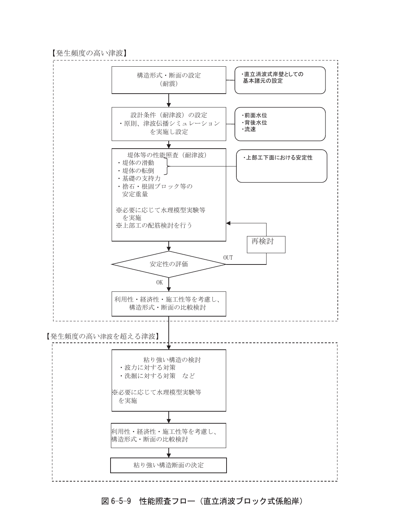

図 6-5-9 性能照査フロー（直立消波ブロック式係船岸）

##### (1) 上部工及び直立消波ブロックに働く波圧

上部工及び直立消波ブロックに働く波圧は、「第2編 5.4 直立消波ブロック式係船岸における上部工に作用する波圧」によることができる。

##### (2) 性能照査の方法

(1)で算出された作用を用いた上部工の安定性の照査には、以下の式を用いることができる。

**転倒に対する検討**

上部工を陸側の上方へ転倒させようとする揚圧力（非越流時）、揚力（越流時）のモーメントに対し、抵抗モーメントが十分であるか否かを以下の式を用いて検討することができる。

$$
F \leq \frac{Wt}{P_u t' - Pl} \tag{式6-5-1}
$$

ここに、

- $W$：上部工の重量（kN）（浮力は揚圧力により考慮されるので差し引く必要はない。）
- $P$：上部工及びブロックに働く水平波圧合力（kN）
- $P_u$：上部工に働く揚圧力合力（浮力を含む）（kN）
- $t$：上部工の後端より $W$ の作用線までの距離（m）
- $t'$：上部工の後端より $P_u$ の作用線までの距離（m）
- $l$：上部工の上面から波圧合力の作用点までの距離（m）
- $F$：安全率

**求められる安全率と許容値**

求められる転倒に対する安全率は 1.2 以上とすることができる。

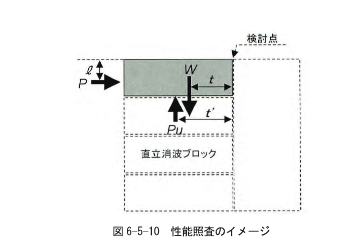

図 6-5-10 性能照査のイメージ

#### (7) 係船岸の粘り強い構造の検討

発生頻度の高い津波を超える津波に対する係船岸の粘り強い構造の検討においては、次の考え方を参考にできる。

- 引き波の速い流れの直接的な力に対する対策：捨石の嵩上げ・拡幅による地盤支持力の増大
- 前面が洗掘され、裏込め材が吸い出されることに対する対策：エプロンの重量増大、部材強度の強化及び上部工等との一体化、基礎捨石等の保護（鋼矢板打設 等）

### 参考文献

1) 山崎浩之・江本翔一：地震動波形の影響を考慮した液状化の予測・判定に関する提案, 港湾空港技術研究所報告, Vol.49, No.3（2010）, pp.79-109

## 第6章 浮栈橋

### 6.1 浮栈橋の要求性能

> 浮栈橋の要求性能は、「岸壁・物揚場」の規定のうち、第1項及び第2項を準用する。

### 6.2 浮栈橋の性能規定

> 浮栈橋の性能規定は、「岸壁・物揚場」の規定のうち、第1、第3、第5及び第6項を準用するほか、以下に定めるとおりとする。
>
> 1.利用漁船の諸元及び施設の利用状況に応じた所要の乾舷を有すること。
>
> 2.自重、浮力、載荷重等及び波又は漁船の接岸及びけん引の作用に対して、浮体が転覆を生じず安定であること。
>
> 3.係留設備にあっては、自重、浮力、波、載荷重、漁船の接岸及びけん引等の作用に対して、構造形式に応じた安定性が満足されること。
>
> 4.連絡橋又は渡橋にあっては、施設の利用状況に応じた適切な幅員及び勾配が確保されていること。また、浮体の安定及び動揺に影響を及ぼさないこと。
>
> 5.調節塔にあっては、自重、地震力、連絡橋の反力等の作用に対して、安定性が満足されること。

### 6.3 性能照査の基本

浮栈橋の照査においては、波浪、潮位等を考慮して、利用上及び構造上支障のないものとすることを原則とする。

#### (1) 性能照査の手順

浮栈橋の性能照査の手順は、図6-6-1によることができる。

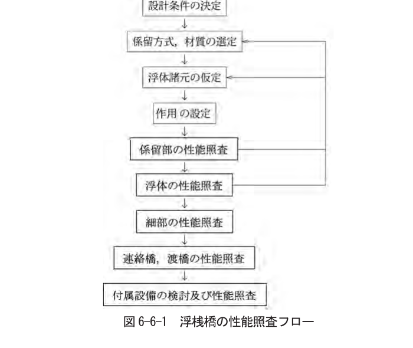

図6-6-1 浮栈橋の性能照査フロー

なお、浮栈橋の設計にあたっては、既往の調査、研究成果1)等を参考とすることができる。

#### (2) 構造形式の選定

構造形式の選定においては次の点を考慮することが望ましい。

浮栈橋は、漁船との相対高さが、潮位差に関係なく常に一定であるため、乗降や陸揚げ作業が円滑に行えるという利点がある。また、移設が容易であるため、漁港整備の進捗状況にしたがって、設置場所を変えていくことができる。最近では蓄養施設（イケス）や昇降装置を組み込んだものや、道路としての機能を併せ持つもの等、多機能型の浮栈橋も建造されている。浮体の係留方式は、杭係留方式とチェーン係留方式に大別できる。各部の名称は、図6-6-2及び図6-6-3のとおりである。

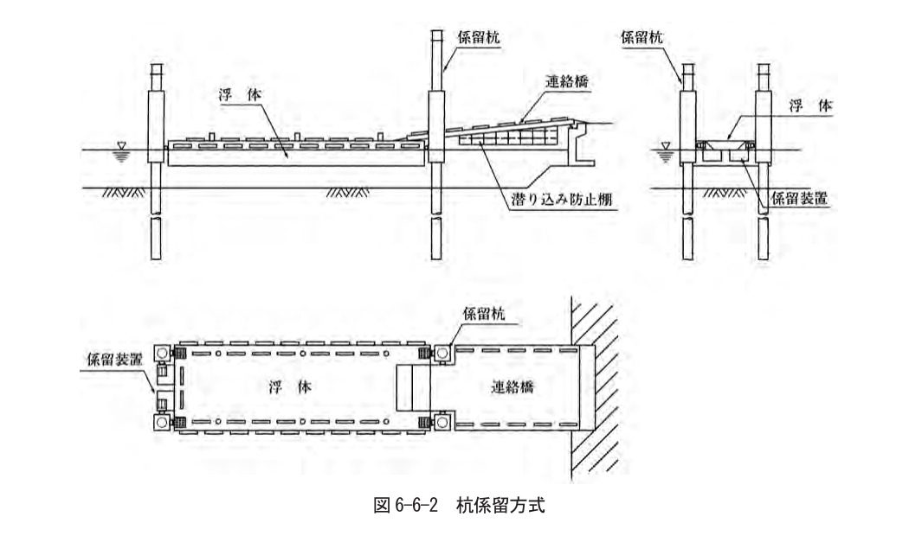

図6-6-2 杭係留方式

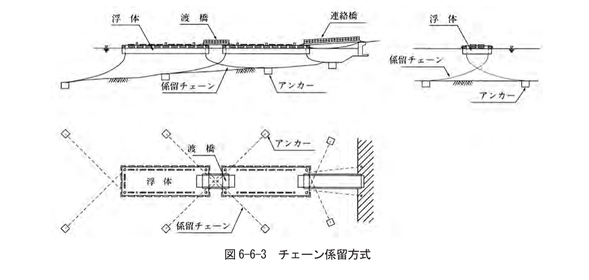

図6-6-3 チェーン係留方式

#### (3) 照査方法の適用範囲

浮栈橋は、波及び流れの影響が少ない場所に設置され、長さ40m程度までの中・小型のものが多い。本章による照査方法が適用される条件は、概ね波高1m、流れ0.5m/s程度までを目安とすることができる。これを超えるような水域に設置する場合は、浮体の大きさに関わらず、波圧や浮体の動揺、流れの力等による影響を考慮して、適切な方法により照査するのが望ましい。特に、長周期の大きな波に対しては、必要に応じて数値シミュレーション、水理模型実験等の方法を用いて照査することが望ましい。また、長さ40〜50m程度を超える大型の浮栈橋についても、適切な方法により照査するのが望ましい。

なお、浮体には、フィッシャリーナ等で使用され工場製品として取り扱われる簡易的なものがあるが、以下の条件を満足することを確認したうえで、漁船の係留施設として用いてよい。この場合、浮体の構造は「第6編10.2 遊漁船等対応係留施設」によることができる。この条件を満足しない場合は本章により照査することができる。

1. 設置海域は波及び流れによる影響がほとんどないこと。波高0.5m程度を限度とする。
2. 利用条件として、浮体の構造強度に関わる上載荷重は2.0kN/m2を限度とし、車両の進入がないこと。
3. ユニットを一体化した状態で、浮体幅3m、浮体長さ10m程度以下であること。
4. 漁船の接岸力、けん引力、漁船に働く風荷重等に対して、十分な浮体強度を有すること。
5. 製品の仕様が、設置海域の条件、利用条件等に適合していること。

#### (4) 配置、係留方式、材質の選定

浮栈橋の配置、係留方式、材質等の選定にあたっては、利用条件、自然条件、構造条件、施工条件、経済性等を十分考慮することを原則とする。

選定の参考として、浮栈橋の分類を図6-6-4及び(5)〜(8)に示す。分類方法には種々のものが考えられるが、図6-6-4は、漁港の係留施設としてこれまでの実績や照査に必要となる項目等を勘案して分類したものである。

**図6-6-4 浮栈橋の分類**

- 配置による分類
  - 横付け式
    - 浮岸壁式
    - 岸壁補助式
  - 縦付け式（突堤式）
- 係留方式による分類
  - 杭係留
  - チェーン係留
- 材質による分類
  - コンクリート製
    - 鉄筋コンクリート製（RC）
    - プレストレストコンクリート製（PC）
    - RCと鋼の合成構造（RCハイブリッド）
    - PCと鋼の合成構造（PCハイブリッド）
  - 鋼製
  - FRP製
- 規模による分類
  - 小型
  - 中型
  - 大型

#### (5) 配置による分類

図6-6-4に示した形式の概要を以下に示す。

1. 横付け式……岸壁に対して浮体を平行に配置する形式
2. 浮岸壁式……新たに岸壁を設ける場合で、岸壁部を浮体構造とした形式
3. 岸壁補助式……既設岸壁の改良方法として、岸壁前面に浮体を設けた形式や、新たに岸壁の一部を浮体構造とした形式
4. 縦付け式（突堤式）……突堤形状の陸揚げ岸壁や準備岸壁等を浮体構造とした形式

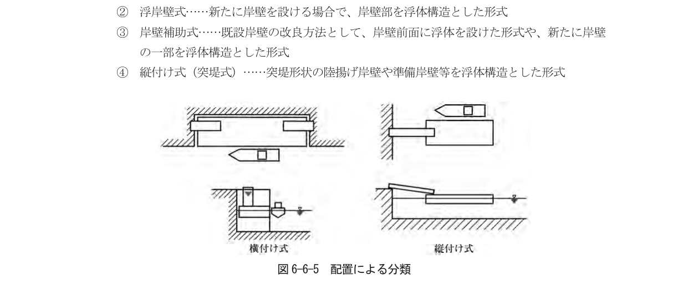

図6-6-5 配置による分類

#### (6) 係留方式による分類

浮体の係留方式には、杭係留方式とチェーン係留方式がある。係留方式の選定にあたっては、利用目的の重要度や、設置場所の状況、経済性等に配慮して適切なものを採用するのが望ましい。各方式の特徴は以下の通りである。

1. 杭係留方式は、浮体を係留杭と係留装置により係留する方式で、一般に水深が浅く、港内が狭い場所に適する。水深が深い場所や軟弱地盤では、杭の断面が大きくなり、チェーン係留方式に比べてコストが高くなる場合がある。係留装置として、動揺制御式ローラーを用いることで、浮体の動揺を小さくすることができる。
2. チェーン係留方式は、浮体を係留チェーンとアンカーにより係留する方式で、一般に水深が深く、港内が広い場合に適する。水深が浅く、潮位差が大きい場所では、満潮時と干潮時で浮体位置の移動量が大きくなる。また、水面下にチェーンを張り出すため、港内の占有面積が大きい。喫水が深い漁船が航行する場合は、チェーンの配置に注意が必要である。

#### (7) 浮体の材質による分類

浮体の材質には、コンクリート、鋼、FRP等が用いられる。浮体の材質の選定にあたっては、利用目的の重要度や、設置場所の状況、経済性等に配慮して適切なものを採用するのが望ましい。各材質の特徴は次の通りである。

1. 鉄筋コンクリート（RC）製は、海水に対して腐食の心配がなく、維持管理がほとんど必要ない。質量が大きいため浮体の動揺は小さいが、喫水が深くなるため波や流れの力を受けやすく、係留杭、係留チェーンの規模は大きくなる。水密性が劣るため照査に際しては、貫通ひび割れが発生しないよう注意する必要がある。
2. プレストレストコンクリート（PC）製は、プレストレスを導入するので、貫通ひび割れの心配がなく、水密性は良い。部材厚を薄くすることができるため、RC製に比べ軽くすることができる。
3. 鋼製は、製作が容易であり、水密性が良いが、腐食に対して十分な対策が必要である。質量が小さいためコンクリート製に比べ浮体の動揺は大きいが、喫水が浅くなるため波や流れの力を受けにくく、係留杭、係留チェーンの規模は小さくてすむ。
4. RCハイブリッド製は、鋼製浮体の周囲を鉄筋コンクリートで防護したもので、鋼部材とコンクリート部材が一体となって荷重に抵抗する。水密性が良く、腐食に対する心配もない。浮体の質量はRC製と鋼製の中間である。
5. PCハイブリッド製は、PC製浮体の内部材（受梁、隔壁）に鋼材を用いたもので、PC製に比べて浮体質量を小さくすることができる。水密性が良く、腐食に対する心配もない。
6. FRP製は軽量であるため、設置が容易で、浮体の係留施設も簡易・小規模なものとすることができるが、浮体の動揺が大きく、全体強度もあまり高くないため、一般には静穏な海域の小型浮体に用いられる例が多い。
7. この他、アルミ製や、FRP製の内部に鋼材を用いて強度を高めたもの、RC製の内部に発泡スチロール等を充填して水密性を向上させたもの、などの施工例がある。

#### (8) 浮体の規模による分類

次のように分類できる。

1. 小型……長さ10m程度までのもの。簡易型もこの中に含まれる。
2. 中型……長さ10mから40m程度までのもので、施工実績が多い。
3. 大型……長さ40〜50m程度を超えるもので、漁港での施工実績は少ない。必要に応じて適切な照査方法で検討するのが望ましい。

### 6.4 性能照査に用いる主な作用

浮栈橋の性能照査においては、表6-6-1に示す諸条件を考慮することを原則とする。同表の条件の中から、主な作用等を以下の(1)〜(6)に記す。

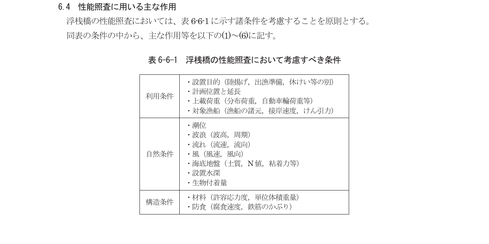

表6-6-1 浮栈橋の性能照査において考慮すべき条件

#### (1) 上載荷重

分布荷重は、実際に載荷される荷重の種類及び大きさを考慮し、各検討項目ごとに適切な値を設定することが望ましい。一般には、表6-6-2によることができる。

| 検討項目 | 荷重（kN/m2） |
|---|---|
| 浮体の安定 | 利用実態を考慮して定める |
| 浮体の床版、受梁 | 用途に応じて表2-13-1により定める |
| 連絡橋、渡橋の主桁 | 3.5 |
| 連絡橋、渡橋の床版・床組 | 5.0 |

表6-6-2 浮栈橋の上載荷重

表6-6-2について、浮体の安定に関しては、浮体上全面に載荷させる単位面積当たりの平均荷重として、利用実態を考慮して適切な値を定めるのがよいが、具体的には次の手順によることができる。

a）利用実態を考慮して、浮体上に同時に載荷する荷重（人、車両、水揚物等）の合計を算定する。

b）a）で算定した合計を浮体面積で除して単位面積当たりの上載荷重を算定する。このとき安全性を考慮して多少の余裕を見込んでもよい。

また、浮体の部材強度に関しては、部分的に載荷される可能性のある最大荷重として、用途に応じて表2-13-1により定めることができる。連絡橋・渡橋については「道路橋示方書・同解説（日本道路協会）」に準じることができる。

#### (2) 流れ

通常流れは考慮しなくてよいが、河口に設置する場合や、潮流等の影響が大きい場合には流れを考慮するのがよい。

#### (3) 生物付着量

生物付着量は、「第15編3.4 表層型浮魚礁の性能照査」によることができる。設置地点における実測値を用いることが望ましいが、通常は水中重量で80N/m2を用いることができる。

#### (4) 許容応力度

材料の許容応力度は、「第3編 材料及び諸係数」及び「道路橋示方書・同解説（日本道路協会）」によることができる。

#### (5) 鋼材の防食

鋼製浮体、係留杭、係留チェーン等の鋼材の防食法は、「第3編2.5 防食」によることができる。

鋼製浮体の主要構造部の防食仕様は、概ね表6-6-3を参考としてよい。

| 防食部位 | 防食仕様 |
|---|---|
| 外面（飛沫帯） | 塗装3年＋腐食しろ27年（0.3mm/年） |
| 外面（水中） | 電気防食30年（ただし、電流効率を考慮して0.02mm/年の腐食しろを見込む） |
| 内面 | 塗装または腐食しろ（0.05mm/年） |

表6-6-3 鋼製浮体の防食仕様例

係留チェーンの摩耗が考えられる場合、設置地点における実測値を参考にすることが望ましいが、実測値がない場合、&phi;1mm/年としてよい。

#### (6) 鉄筋のかぶり

コンクリート製浮体の鉄筋のかぶりは、曲げひび割れ幅の照査を行う場合は、式6-6-12)によることができる。

$$
C_{\min} = \alpha \, C_o \tag{式6-6-1}
$$

ここに、

- $C_{\min}$：最小かぶり
- $\alpha$：コンクリートの設計基準強度 $f'_{ck}$ に応じ、次の値とする。
  - 18N/mm2 &lt; $f'_{ck}$ &lt; 34N/mm2 の場合 $\alpha = 1.0$
  - 34N/mm2 &le; $f'_{ck}$ の場合 $\alpha = 0.8$
- $C_o$：基本のかぶりで、表6-6-4の値とする。

| 部位 | Co（cm） |
|---|---|
| 外面（飛沫帯） | 6.0 |
| 外面（水中） | 5.0 |
| 内面 | 3.0 |

表6-6-4 Coの値

表6-6-4において、外面（飛沫帯）は浮体側面及び上面とし、外面（水中）は浮体底面とすることができる。

なお、漁港構造物の鉄筋のかぶりは7cmとすることが多いが、コンクリート製浮体の場合、かぶりを小さくして浮体質量を小さくすることで、必要浮力も小さくなり、コンクリートの使用量を少なくすることができる。高品質のコンクリートを用い、入念な施工を行うことを前提に、通常の構造物よりも小さなかぶりの値を設定してよいとする考え方もあるが、「本書」では曲げひび割れ幅の照査を行うことを前提に、式6-6-1を示している。

### 6.5 性能照査

#### (1) 利用性に関する性能照査

「第6編3.3.1 利用性に関する性能照査」を準用するとともに、浮体諸元の決定にあたっては、漁船の係留、利用形態、浮体の安定等を考慮することを原則とする。

浮体諸元は、以下の(1)〜(3)によることができる。

1. 浮体の長さは、漁船の係留、陸揚げ作業等に必要な係船延長から決定するのがよい。構造上単独の浮体で計画延長を確保するのが難しい場合は、いくつかに分割して配置するのがよい。このとき、浮体間隔は浮体どうしが動揺により衝突しないようにすることを原則とする。なお、RC製浮体の場合、許容製作長さは概ね30mである。
2. 浮体の幅は、利用状況、周囲の地形や構造物との関係、浮体の安定性等を考慮して決定するのがよい。浮体幅について、これまでの実施例では、縦付け式で車両が進入しない場合は6m、車両が進入する場合は10m程度を目安とし、横付け式で車両が進入しない場合は3m、車両が進入する場合は6m程度を目安としている例が多い。
3. 浮体の乾舷は、漁船への乗降、陸揚げ作業等に適した高さとするのがよい。

#### (2) 構造物の安全性に関する性能照査

性能照査の方法は、「第6編6.6〜6.8」によることができる。

また、照査項目のうち耐震性能の照査については、「第6編2.2 係船岸の耐震性能の照査」を参考にできる。液状化対策については、「第6編2.3 液状化対策」を参考にできる。

### 6.6 浮体の照査

#### 6.6.1 浮体の安定

浮体は、想定される利用状態に対して安定であるとともに、必要な乾舷を確保することを原則とする。

浮体の安定及び乾舷の検討は、次の（1）〜（4）によることができる。

#### (1) 無載荷時の検討

浮栈橋として機能する状態で、浮体上での利用がない場合に、浮体乾舷が計画乾舷と一致し、床版が水平であることを確認する。その際、作用として、浮体本体の自重、付加重量（連絡橋反力、渡橋反力、カウンターウエイト、喫水調整バラスト、その他常時載荷させる荷重）及び付着生物の重量を考慮する。

#### (2) 分布荷重満載時の検討

浮体上に分布荷重を満載した状態において、浮体乾舷が利用上支障のない高さであること、及び浮体の安定条件を満足していることを確認する。分布荷重を満載している状態における浮体の安定条件は、式6-6-2を満足すればよい。安全のため $\overline{GM}$ は喫水の5%以上であることが望ましい。

$$
\overline{GM} = \frac{I w_0}{W} - \overline{CG} > 0 \tag{式6-6-2}
$$

ここに、

- $\overline{GM}$：重心Gとメタセンター高さMとの距離（m）
- $I$：喫水面の長軸に対する断面2次モーメント（m4）
- $w_0$：海水の単位体積重量（kN/m3）
- $W$：浮体重量と分布荷重（kN）
- $C$：分布荷重満載時の浮心
- $G$：分布荷重満載時の重心

#### (3) 一区画浸水時の検討

外壁が損傷した場合に備えて、浮体上に分布荷重を満載し、かつ浮体内部の一区画に若干の浸水がある状態において、浮体乾舷が0m以上であること、及び浮体の安定条件を満足していることを確認する。浸水高さは、通常浮体高さの10%とするが、浮体内部に発泡材を充填する場合は、その効果を考慮して設定してよい。浮体内部に浸水がある場合の安定条件は、式6-6-3を満足すればよい。ただし、W、I、C、Gは浸水時の値を用いる。

$$
\overline{GM} = \left( \frac{w_0}{W} \right) (I - \Sigma i) - \overline{CG} > 0 \tag{式6-6-3}
$$

ここに、

- $i$：浸水区画の、浮体の回転軸に平行な中心軸に対する断面2次モーメント（m4）

#### (4) 分布荷重偏載時の検討

浮体の長軸を中心として浮体上の片側半分に荷重を満載した状態において、小さい方の浮体乾舷が0m以上であること、及び床版の傾斜が許容傾斜以下であることを確認する。許容傾斜は、通常1:10とする。乾舷及び傾斜の検討は、式6-6-4を解いて求まる tan $\alpha$ が式6-6-5を満足すればよい。ただし、一般に $\alpha$ は小さいので式6-6-4中の cos2 $\alpha$ は近似的に 1-tan2 $\alpha$ としてよい。

$$
(W + P) \left\{ \frac{b^2 \tan \alpha}{12d \cos^2 \alpha} - \left[ \frac{b^2}{24d} \tan^2 \alpha + c - \frac{d}{2} \right] \tan \alpha \right\} - P[a + (h - c) \tan \alpha] = 0 \tag{式6-6-4}
$$

$$
\tan \alpha < \frac{1}{10} \tag{式6-6-5}
$$

ここに、

- $W$：浮体重量（kN）
- $P$：偏載荷重合力（kN）
- $b$：浮体の幅（m）
- $h$：浮体の高さ（m）
- $d$：Pを浮体の中心に載荷した場合の浮体の喫水（m）
- $c$：Pを考慮しない浮体重心の底面からの高さ（m）
- $a$：Pの浮体の中心軸からの偏心量＝b/4（m）
- $\alpha$：浮体の傾斜角（&deg;）

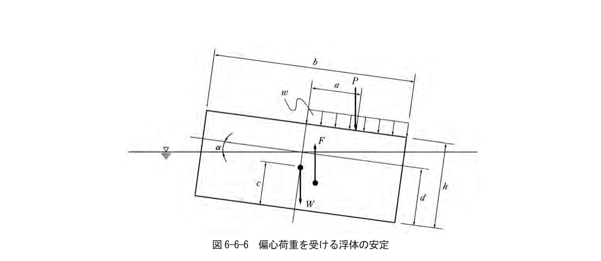

図6-6-6 偏心荷重を受ける浮体の安定

式6-6-2〜式6-6-4に示した浮体の安定条件は、計算簡略化のため自由浮体として取り扱ったものである。係留杭、係留チェーン、係留装置の効果を適切に評価できる場合は、この式によらなくてもよい。

#### 6.6.2 浮体の全体強度

浮体は、製作・曳航・据付時及び完成後において働く荷重に対して、全体構造として十分な強度を有するように照査することを原則とする。

浮体の全体強度は、以下の（1）〜（5）によることができる。

#### (1) 概要

浮体の全体強度については、浮体全体を一本の梁とみなしたときに、製作・据付時の吊り上げ荷重や、曳航・完成後の波浪が働く時の浮力変動などによって浮体断面に発生する曲げモーメント及びせん断力に対して十分な断面強度を有し、安全であるよう照査する。

#### (2) 浮力変動による荷重

浮力変動による縦曲げモーメント及びせん断力を、式6-6-6及び式6-6-7により求める。

$$
M_{\max} = w_0 H B \left( \frac{L}{2\pi} \right)^2 \tag{式6-6-6}
$$

$$
S_{\max} = w_0 H B \frac{L}{4\pi} \tag{式6-6-7}
$$

ここに、

- $M_{\max}$：縦曲げモーメント（kNm）
- $S_{\max}$：せん断力（kN）
- $w_0$：海水の単位体積重量（kN/m3）
- $H$：波高（＝$H_{\max}$＝1.86$H_{1/3}$）
- $B$：浮体の幅（m）
- $L$：浮体の長さ（m）

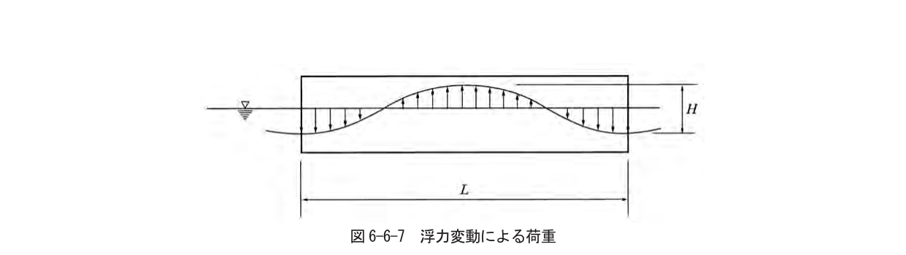

図6-6-7 浮力変動による荷重

#### (3) 許容応力度の割増し

製作・曳航・据付時については、その状況に応じて許容応力度を5割増ししてよい。

#### (4) 荷重の算定方法

（2）に示した荷重の算定方法は、簡易的な方法であり、比較的静穏な水域に設置される中・小型の浮体に適用されるものである。大型の浮体の場合あるいは設置水域の波浪条件が厳しい場合は、別途適切な方法により照査することを原則とする。

#### (5) RC製浮体

RC製浮体の底版に発生する応力が全断面引張となると、貫通ひび割れが生じ水密性に悪影響を与える恐れがあるので、コンクリートの引張応力度は設計引張強度以下となるように照査するのが望ましい。

#### 6.6.3 浮体各部の強度

床版、側壁、底版、隔壁、受梁、支柱等の浮体を構成する各部材は、それぞれの部材に働く作用に対して十分な強度を有するように照査することを原則とする。

浮体の各部については、以下の（1）〜（6）により照査することができる。

#### (1) 床版、底版、側壁、隔壁への作用

床版、底版、側壁、隔壁への作用は、次のとおりとすることができる。

1. 床版への作用
   - a）分布荷重のみ働く場合　（分布荷重）＋（自重）
   - b）自動車輪荷重が働く場合　（自動車輪荷重）＋（自重）
   - c）連絡橋の支点が載る場合　（連絡橋の支点反力）＋（自重）
2. 側壁への作用　浮体上端が0.5m沈んだ場合の静水圧
3. 底版への作用　浮体上端が0.5m沈んだ場合の静水圧及び自重
4. 隔壁への作用　浮体内部の一区画に浸水が充満した場合の静水圧

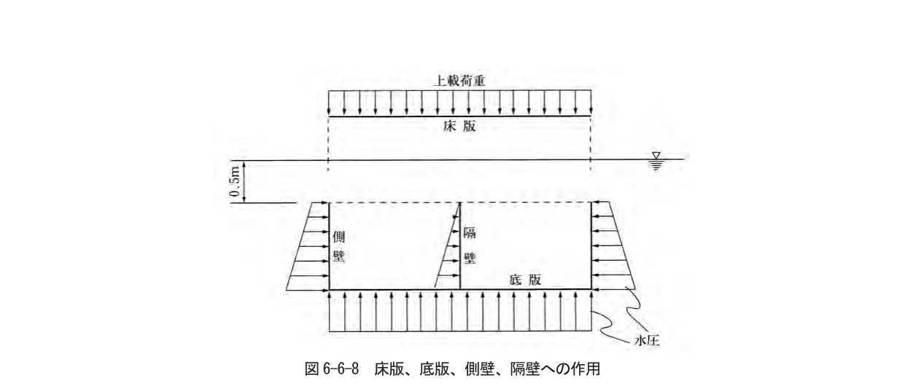

図6-6-8 床版、底版、側壁、隔壁への作用

#### (2) 床版、底版、側壁、隔壁の照査

床版、底版、側壁、隔壁は、四辺固定の二方向版として照査してよい。応力度の照査にあたっては、全体構造に働く荷重によって発生する応力度と組み合わせて評価することができる。

#### (3) 曲げひび割れ幅の検討

コンクリート製浮体で鉄筋のかぶりを式6-6-1により決定した場合は、曲げひび割れ幅の照査を行うことを原則とする。曲げひび割れ幅の検討は、「コンクリート標準示方書（土木学会）」により、式6-6-8によって求めた曲げひび割れ幅wが、表6-6-5に示される許容ひび割れ幅wa以下であることを確認することによって行うことができる。

$$
w = 1.1 k_1 k_2 k_3 \left\{ 4C + 0.7(C_s - \phi) \right\} \left( \frac{\sigma_{se}}{E_s} + \varepsilon'_{csd} \right) \tag{式6-6-8}
$$

ここに、

- $k_1$：鋼材の表面形状がひび割れ幅に及ぼす影響を表す係数で、一般に、異形鉄筋の場合に1.0、普通丸鋼及びPC鋼材の場合に1.3としてよい。
- $k_2$：コンクリートの品質がひび割れ幅に及ぼす影響を表す係数で、式6-6-9による。

$$
k_2 = \frac{15}{f'_c + 20} + 0.7 \tag{式6-6-9}
$$

- $f'_c$：コンクリートの圧縮強度（N/mm2）。一般に、設計圧縮強度 $f'_{cd}$ を用いてよい。
- $k_3$：引張鋼材の段数の影響を表す係数で、式6-6-10による。

$$
k_3 = \frac{5(n + 2)}{7n + 8} \tag{式6-6-10}
$$

- $n$：引張鋼材の段数
- $C$：かぶり（mm）
- $C_s$：鋼材の中心間隔（mm）
- $\phi$：鋼材径（mm）
- $\varepsilon'_{csd}$：コンクリートの収縮及びクリープ等によるひび割れ幅の増加を考慮するための数値（一般には $150 \times 10^{-6}$ 程度としてよい）
- $\sigma_{se}$：鉄筋応力度の増加量（N/mm2）

| 部位 | wa（mm） |
|---|---|
| 飛沫帯 | 0.0035C |
| 水中部 | 0.004C |

表6-6-5 許容ひび割れ幅

#### (4) 受梁・支柱の照査

受梁及び支柱は、浮体の床版上に最大荷重が働き、喫水がちょうど浮体高さに等しくなった場合の静水圧に対して、ボックスラーメン構造として照査することができる。

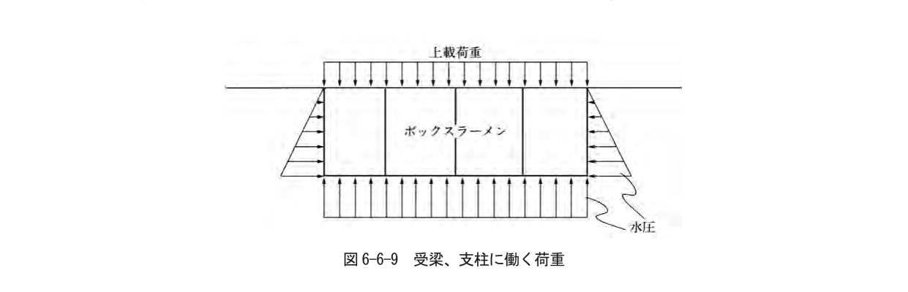

図6-6-9 受梁、支柱に働く荷重

#### (5) 荷重の算定方法

（1）、（4）に示した荷重の算定方法は、簡易的な方法であり、比較的静穏な水域に設置される中・小型の浮体に適用されるものである。大型の浮体の場合あるいは設置水域の波浪条件が厳しい場合は、別途適切な方法により照査することを原則とする。

#### (6) 版の計算について

四辺固定版の計算において、支間は床版、側壁、底版、受梁等の中心間隔として曲げモーメントを算出する。ポアソン比が異なる場合は式6-6-11及び式6-6-123)により修正すればよい。

$$
M_{x2} = \frac{(1 - \nu_1 \nu_2) M_{x1} + (\nu_2 - \nu_1) M_{y1}}{1 - \nu_1^2} \tag{式6-6-11}
$$

$$
M_{y2} = \frac{(\nu_2 - \nu_1) M_{x1} + (1 - \nu_1 \nu_2) M_{y1}}{1 - \nu_1^2} \tag{式6-6-12}
$$

ここに、

- $M_{x1}$、$M_{y1}$ は「版の計算図表」に示されたポアソン比及び計算されたモーメントであり、
- $M_{x2}$、$M_{y2}$ は求めようとする版のポアソン比及びモーメントである。

### 6.7 係留部の照査

#### 6.7.1 杭係留方式

係留杭及び係留装置は、漁船の接岸を妨げないよう配置するとともに、想定される作用に対して、安全な構造であることを原則とする。

係留杭及び係留装置の照査は、以下の（1）〜（7）によることができる。

#### (1) 係留杭の配置

杭係留方式は、通常浮体1函に対して4本の係留杭で支持する場合が多い。漁船の接岸を妨げないよう、図6-6-1に示すように係船延長の内側に杭及び係留装置を配置するのが望ましい。

#### (2) 係留杭の構造

係留杭の構造には、単杭構造、ラーメン構造がある。単杭の計算は「第4編第3章 杭基礎の支持力」によることができる。ラーメン杭の解析は変位法が用いられることが多い。

杭の天端高の決定にあたっては、H.H.W.L.を考慮することが望ましい。杭の天端高が低いと、高潮位時に、単杭の場合は浮体が杭から抜け出したり、あるいはラーメン杭の場合は杭頭材に係留装置がぶつかって杭に余計な引き抜き力が働くことがあるので注意する。

#### (3) 係留装置

係留装置を適切に選定する。係留装置には、防舷材、ワイヤー、チェーン、樹脂ローラー、ゴムローラー等が用いられている。ゴムローラーには、ローラーの軸受け部と取り付け材の間に緩衝材を設けて、浮体の動揺による衝撃を吸収できる動揺制御型ローラーがあり、主に中型の浮栈橋に多く用いられている。

#### (4) 荷重の分担

係留杭には、浮体に働く力が、係留装置を介して伝達される。係留杭の照査に用いる作用は、杭の本数と係留装置の構造に応じて、浮体に働く力を適切に分担するよう決定するのがよい。

#### (5) 浮体に働く力

浮体に働く力として、次の項目を考慮するのがよい。

**1. 漁船の接岸力**

漁船の接岸力の算定は、「第2編14.2 漁船により生じる作用」によることができる。

**2. 波力及び風荷重**

波力及び風荷重は同時に働くものとして算定することを原則とする。風荷重の算定は「第2編7.3 風圧力」によることができる。このとき抗力係数は1.2としてよい。

波力は、浮体が静止しているものとして、前後面の水圧差により算定してよい。波長が、波進行方向の浮体長さの2倍のとき、最大波力を与えることになり、図6-6-10の状態を考えると、波力Pは式6-6-13により求められる。

$$
P = \left( \frac{1}{2} \right) w_0 B \left\{ \left( d + \frac{H_{1/3}}{2} \right)^2 - \left( d - \frac{H_{1/3}}{2} \right)^2 \right\} = w_0 B H_{1/3} d \tag{式6-6-13}
$$

ここに、

- $w_0$：海水の単位体積重量（kN/m3）
- $B$：波向に直角な面の長さ（m）
- $H$：有義波高（m）
- $d$：浮体の喫水（m）

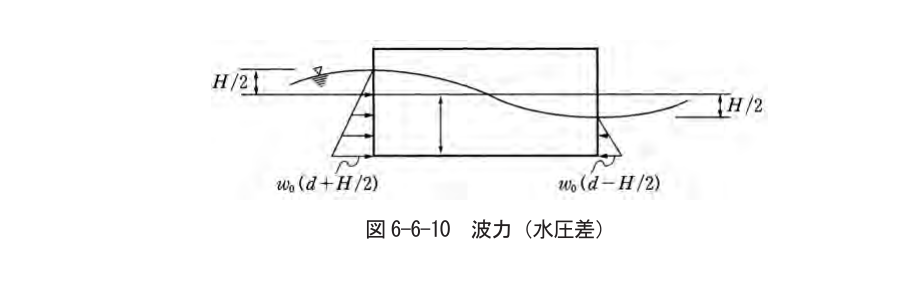

図6-6-10 波力（水圧差）

**3. 漁船のけん引力**

漁船のけん引力は、一般に他の作用に比べて小さいので、考慮しなくてよい。

**4. 流れ**

流れは通常の場合考慮しなくてよいが、河口に設置する場合や、潮流等の影響が大きい場合は、「第2編6.3 水中の構造物に作用する流れの力」により算定することが望ましい。このとき、抗力係数は1.2としてよい。

#### (6) 荷重の載荷位置

杭に働く荷重の載荷位置は、通常L.W.L.〜H.W.L.の範囲で最も危険と考えられる潮位に、係留装置の取り付け高さを考慮して設定するのがよい。高潮等の異常潮位の恐れがある場合は、その発生頻度と使用年数を勘案して適切な潮位を設定することが望ましい。

#### (7) その他

**1. 風及び流れの力について**

漁船を常時係留する場合は、漁船に働く風及び流れの力を考慮するのがよい。

**2. 杭の許容変位について**

杭の変形が浮栈橋の利用上又は構造上支障がある場合は、許容変位を設定することが望ましい。

#### 6.7.2 チェーン係留方式

係留チェーンは、漁船の接岸を妨げないよう配置するとともに、想定される作用によって破断しないことを原則とする。また、アンカーは、係留チェーンに発生する最大張力に対して、移動しないことを原則とする。

係留チェーンは、以下の（1）〜（5）によることができる。

#### (1) 係留チェーンの配置

係留チェーンは漁船の接岸を妨げないよう、図6-6-3に示すように浮体の下で十字に交差させるのが望ましい。しかし、交差のさせ方によっては、チェーンの接触部が著しく摩耗することがあるので注意する。摩耗防止対策としては、配置の工夫により直接接触させない、働く力に抵抗するチェーンを上側に配置する、チェーン交差部に保護材を取り付ける等の方法がある。

係留チェーンを浮体の対角方向に張り出すと、力が働いたときに偶力が働き、浮体が回転することがあるので注意する。やむを得ずこのような配置とする場合は回転を防止するような対策をとるのがよい。

浮体を複数連続させる場合は、隣接する浮体どうしをチェーンで結合するのがよい。その際、浮体の隅角部には防舷材を配置するのが望ましい。

#### (2) 浮体に働く力

浮体に働く力は「第6編6.7.1 杭係留方式（5）浮体に働く力」に準じることができる。

#### (3) 係留チェーンの照査

係留チェーンの照査は、通常の場合、作用に対して各チェーンが一本で抵抗することがあるものとして、以下により照査してよい。

本照査方法は、水深が浅く比較的静穏な海域に、主たる係留チェーンの本数が4本の小型・中型の浮体を設置する場合に適用できる。これらの条件に当てはまらない場合、すなわち水深が深い、波高が大きい、係留チェーンの本数が多い、大型の浮体であるなどの場合には、水理模型実験、動的解析、チェーンカテナリーによる静的解析（「第5編2.5.1（3）（2）m）カテナリー特性」を参照のこと）等適切な方法により照査するのが望ましい。

**1. チェーン長さ**

図6-6-11において、$\theta_1 \fallingdotseq \theta_2$ として次式により求める。

$$
l = \sqrt{K_h^2 + h^2} \tag{式6-6-14}
$$

ここに、

- $l$：チェーン長さ（m）
- $K_h$：チェーンの水平距離（m）
- $h$：浮体底面からアンカー上面までの深さ（m）

係留チェーンの長さは、水深の5倍に潮差を加えたものを目安としている例が多い。

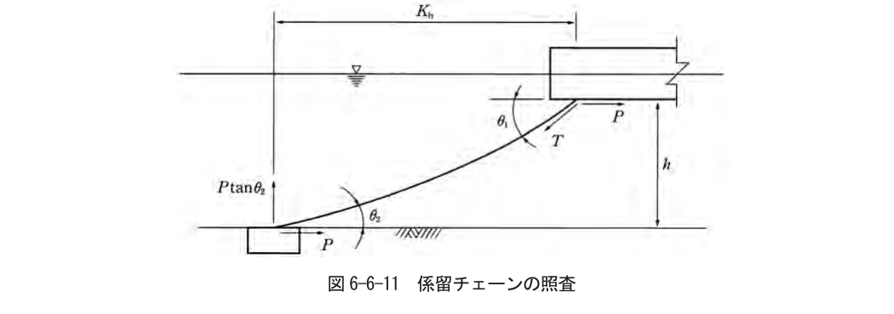

図6-6-11 係留チェーンの照査

**2. チェーン張力**

$$
T = P \sec \theta_1 \tag{式6-6-15}
$$

ここに、

- $T$：チェーンの最大張力（kN）
- $P$：浮体に働く力（kN）
- $\theta_1$：チェーンと浮体底面のなす角度（&deg;）

**3. チェーンの許容張力**

チェーンの許容張力は、JIS F 3303 フラッシュバット溶接アンカーチェーンに示された破断試験荷重の1/3としてよい。

**4. チェーン径**

チェーン径を決定するにあたっては、摩耗・腐食代（&phi;0.6〜1mm/年）を考慮する。

#### (4) アンカーの照査

アンカーの重量及び設置方法は、チェーンに最大張力が働いたときに安全となるよう定めることを原則とする。アンカーの安全率は1.2を標準とする。

**1. アンカーに働く荷重**

アンカーには、水平力としてP、鉛直力としてP tan $\theta_2$ が働くものとしてよい。

**2. アンカーの抵抗力**

通常はコンクリートブロックを土中に埋め込んで使用する例が多い。この場合、抵抗力として以下のものを考慮するのがよい。ただし、底面摩擦力の計算に用いる鉛直力は、W-P tan $\theta_2$ としてよい。ここに、Wはアンカーの水中重量である。アンカーを土中に埋め込まない場合は、抵抗力は底面摩擦のみとなる。

a）水平抵抗力：（粘性土の場合）底面・側面の粘着力及び受働土圧と主働土圧の差
　　　　　　　（砂質土の場合）底面摩擦力及び受働土圧と主働土圧の差

b）鉛直抵抗力：水中重量及び水中土かぶり重量

#### (5) 地盤支持力

アンカーを設置する地盤は、土質条件に基づいて十分な支持力を有していることを確認することを原則とする。地盤が軟弱な場合は、砂置換等の地盤改良を行うのが望ましい。

### 6.8 連絡橋及び渡橋

連絡橋、渡橋の照査においては、浮体の利用形態、浮体の安定、浮体の動揺等を考慮することを原則とする。また、調節塔は必要に応じて設置することとし、その照査においては、連絡橋の反力、地震力、自重等を考慮することを原則とする。

連絡橋及び渡橋は、以下の（1）〜（7）によることができる。

#### (1) 連絡橋及び渡橋の諸元

連絡橋の長さは、勾配から決定することが多い。連絡橋の勾配は、人に対しては1/5〜1/4以下、車両に対しては1/10以下が望ましい。決定にあたっては、係船岸の利用形態、周辺泊地の状況、潮位差等を考慮することを原則とする。また、連絡橋前後端部のフラップ（前垂れ板）の勾配は、人に対しては1/5以下、車輌に対しては1/8以下が望ましい。

渡橋の長さは、浮体の動揺や、潮位差による浮体の移動によって、脱落しないよう決定することを原則とする。

連絡橋及び渡橋の幅は、人あるいは車両の通行量や利用状況を考慮して決定するのがよい。人に対しては最低でも0.75m以上とし、通常は1.5m以上とするのが望ましい。小型車両に対しては3m以上とすることが望ましい。

以上に示した数値は目安としての数値である。以下の点に留意し、必要に応じて加減してもよい。なお、連絡橋が長くなる場合は、中間橋台を設けることにより、浮体に働く反力を軽減することができると同時に、部材断面を小さくすることができる。

1. 車両に対する勾配を大きくすると、連絡橋に車両が乗り降りする際に、車両の前後や下部を擦ることがある。
2. 荷車等を使用する場合は、勾配を緩くするのが望ましい。

#### (2) 連絡橋及び渡橋の照査

連絡橋及び渡橋の照査は、「道路橋示方書・同解説（日本道路協会）」及び「立体横断施設技術基準・同解説（日本道路協会）」を準用することができる。

連絡橋の許容たわみは支間長の1/500としてよい。

#### (3) 支承部の照査

連絡橋の支承部は、通常は陸側を固定支承、浮体側を可動支承とする場合が多い。可動支承の下部には保護鋼板を設けるのが望ましい。支承部の構造選定、照査にあたっては次の点を考慮するのがよい。

1. 潮位差による連絡橋の上下方向の回転に対して自由であるよう考慮する。
2. 浮体の水平移動に伴う連絡橋の水平方向の回転に対して考慮する。チェーン係留方式の場合は浮体の移動量が大きくなるので、水平方向の回転に対しても自由であることが望ましい。
3. 浮体の動揺に伴う橋体のねじれによって支承部に生じる、変則的な力に対して考慮する。

#### (4) 調節塔

荒天時の波高が大きい場所や、うねりが侵入する箇所では、浮体の動揺により橋体や支承部が破損する例が多い。したがってこのような場所では、調節塔を設けて浮体と連絡橋を絶縁するのが望ましい。波高の目安は概ね1m程度とすることができる。

調節塔に働く作用としては、連絡橋の反力、地震力、自重、風荷重を考慮するのがよい。係留杭と調節塔を兼用する場合は、これらに加えてさらに浮体の係留荷重を考慮して照査を行うのがよい。

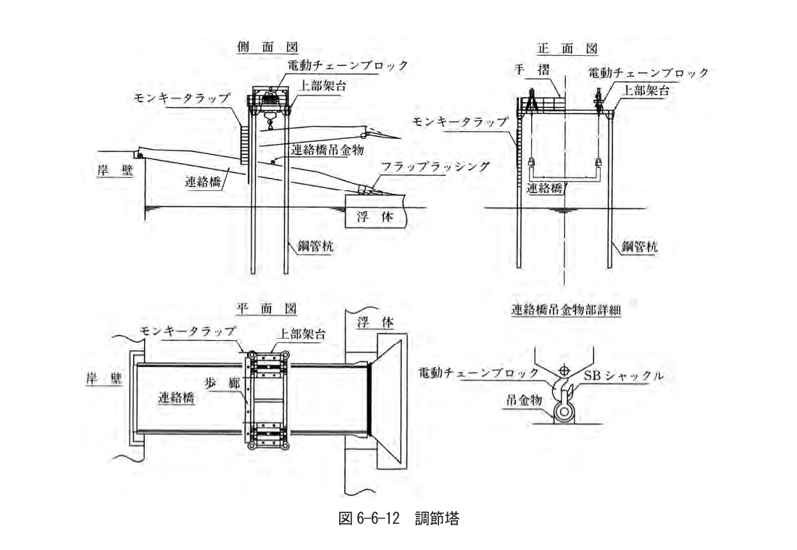

図6-6-12 調節塔

#### (5) 連絡橋の構造について

連絡橋は鋼製プレートガーダー又はポニートラスとすることが多いが、連絡橋の寸法が小さい場合はアルミ製が用いられることもある。連絡橋上面には滑り止め対策を適切に行うことを原則とする。

#### (6) 落橋防止対策について

チェーン係留方式は、落橋防止のため浮体又は岸壁と連絡橋をチェーン等で繋ぐ、あるいは調節塔を設ける等の対策を行うことを原則とする。

#### (7) 係船タイプの連絡橋について

係船タイプの連絡橋の照査にあたっては、漁船による作用を考慮することを原則とする。また、漁船の潜り込みが起きないよう必要に応じて対策を講じることを原則とする。

### 参考文献

1. 漁港漁場新技術研究会 港内施設多機能化研究部会 浮体式係船岸専門部会：浮体式係船岸 設計・施工マニュアル（案）（平成27年3月）
2. 土木学会：コンクリート標準示方書-構造性能照査編-，丸善（2002），pp.119-120
3. 土木学会：構造力学公式集，土木学会（1986），p.336

## 第7章 船揚場

### 7.1 船揚場の要求性能

> 船揚場の要求性能は、構造形式に応じて、以下の要件を満たしていることとする。
>
> 1.利用漁船の諸元及び利用状況に応じて、漁船の揚げ降ろしができるよう適切なものとする。
>
> 2.自重、載荷重、波等の作用に対して、構造上安全なものとする。

### 7.2 船揚場の性能規定

> 船揚場の性能規定は、以下に定めるとおりとする。
>
> 1.利用漁船の諸元に応じた所要の水深及び長さを有すること。
>
> 2.潮位の影響、利用漁船の諸元及び船揚場の利用状況に応じた所要の天端高を有すること。
>
> 3.自重、載荷重、波等の作用に対して、張ブロック又は舗装が所要の質量を満足すること。
>
> 4.自重、載荷重等の作用に対して、地盤のすべり破壊等、構造の安定性が満足されること。

### 7.3 性能照査の基本

船揚場は、漁船の揚げ降ろし時、船置き時等を考慮して、利用上及び構造上支障のないものとすることを原則とする。

船揚場は、漁船を陸上に揚げて保管、修繕等を行うために、水際に築造する施設である。船揚場には引き揚げ方式やクレーン等による吊り揚げ方式があり、一般的な形状は図 6-7-1 のとおりである。

この章では、引き揚げ方式（斜路式）の船揚場を対象とする。引き揚げ方式の構造は、一般に前面壁、斜路、船置部及び止壁から成る。前面壁の構造には、重力式と矢板式がある。

引き揚げ方式の性能照査においては、利用条件、地盤条件、波浪条件等を考慮して安定なものとすることを原則とする。

吊り揚げ方式の性能照査については、「第6編 3.4 重力式係船岸」等に準じることができる。

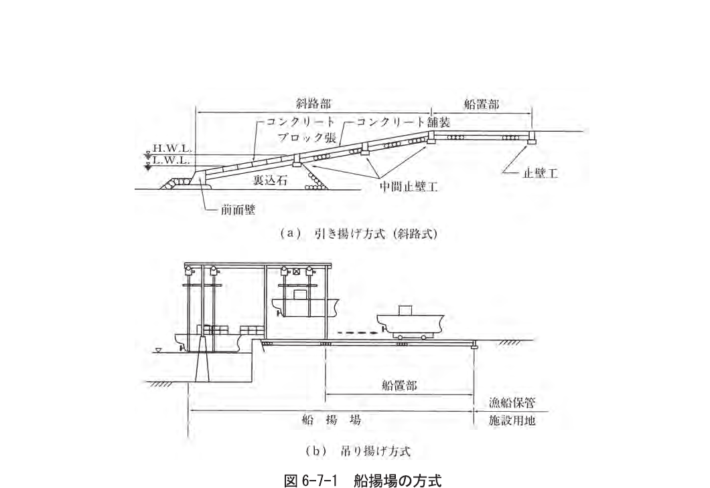

図6-7-1 船揚場の方式

### 7.4 性能照査に用いる主な作用

構造断面に応じて、自重、載荷重、波力等、必要な作用を、「第2編 設計条件」により設定することを原則とする。

### 7.5 性能照査

#### (1) 利用性に関する性能照査

引き揚げ方式の船揚場の利用性に関する性能照査は、以下の(1)～(6)によることができる。

1. 前面壁の天端高は、対象漁船の船首部喫水、台車使用の有無を考慮することを原則とする。

2. 斜路の天端高は、H.W.L.＋2H（H は斜路前面の波高）を標準とする。このとき利便性を考慮して、隣接係船岸等の高さとの関係に注意する。ただし、前面水域の波高が大きい箇所では、波の遡上も考慮して天端高を決定するのがよい。

3. 斜路の勾配は、対象漁船の形状、潮位、利用形態を考慮し、円滑な船の揚げ降ろしが行われるよう定めることを原則とする。一般に1：6～1：10とすることが多い。斜路の勾配の変化はなるべく少なくすることが望ましい。特に FRP 漁船をレール等を敷設して引き揚げるような場合には、L.W.L.付近以上を同一勾配とするのがよい。

4. 船置部にも海側へ多少の勾配をつけておくことは、利用上又は（打ち上げ水、雨水等の）排水上有効である。ただし、比較的大型の漁船等が利用する場合には、斜路部と船置部の境界に勾配の屈曲点があると利用上好ましくないので、船置部の勾配を斜路の勾配と同一にすることも検討するのがよい。

5. エプロンの幅や勾配については、「第6編 2.7 エプロン」を参考にできる。

6. 安全上及び利用上の観点から必要な付属設備を設けることができる。付属設備については、「第6編 2.8 付属設備」によることができる。

#### (2) 構造物の安全性に関する性能照査

引き揚げ方式の船揚場の安全性に関する性能照査は、以下の(1)～(9)によることができる。

1. 前面壁の安全性の性能照査は、「第6編 3.4 重力式係船岸」「第6編 3.5 普通矢板式係船岸」等に準じることができる。

2. 基礎及び舗装工は、船舶や波浪等の作用に対して安定な構造とすることを原則とする。また、基礎は沈下等を生じない構造とすることが望ましい。

3. 波の遡上する斜面では、斜路の舗装について、継ぎ目から基礎材料等が吸い出され沈下を起こすことがないように配慮するのがよい。

4. 舗装工はコンクリート舗装とし、圧縮強度は 18N/mm&#xB2; 以上のものを使用することを標準とする。コンクリート版の厚さは 20cm を標準とし、その下にはクラッシャーラン、切り込み砕石、栗石による基礎工を設けることが望ましい。なお、基礎工の厚さは 30cm を標準とする。ただし、地盤が悪い場合には、基礎工の下の地盤を栗石又は良質砂などで置換することが望ましい。

5. 目地の材料はエラスタイト類とし、目地間隔は 10m 以内としてよい。なお、凍結融解の影響を大きく受ける寒冷地においては、その対策を講じることが望ましい。

6. 水中部など場所打ち舗装が難しい部分では、コンクリートブロックを敷き並べてもよい。その際の厚さは 30cm 程度とする例が多い。また、水中部などの基礎工は、捨石や栗石等によるものが多い。

7. 港内静穏度が十分でないなど波高の大きい波が想定される場合には、コンクリートブロックの選定に際し、図 6-7-2 を参考に所要厚を定めてもよい。

8. コンクリートブロック張りとコンクリート張りとの境界及び勾配の変化点には、中間止壁を設けることを原則とする。なお、斜路部においては、必要に応じて適当な間隔で中間止壁を設けることが望ましい。中間止壁と端止壁の幅は、20cm 又は 30cm とする場合が多い。中間止壁は、延長、奥行き方向ともに 10m 間隔に設けている場合が多い。

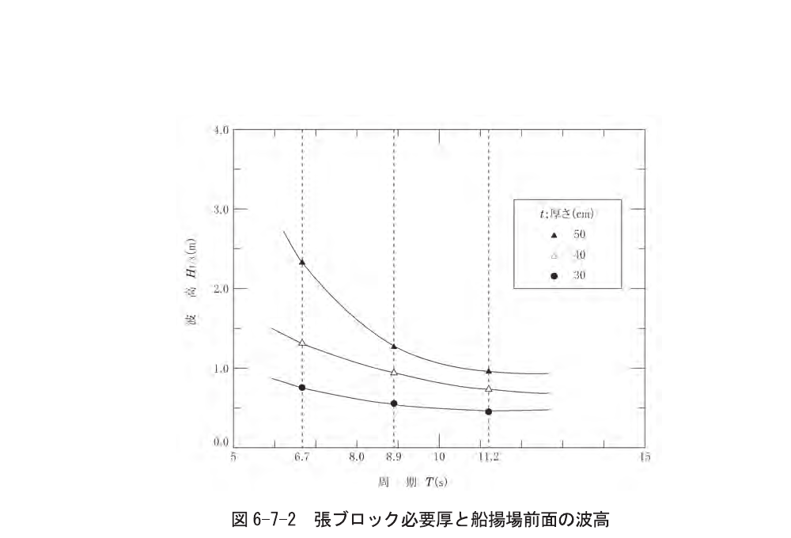

図6-7-2 張ブロック必要厚と船揚場前面の波高

9. エプロンの構造の照査については、「第6編 2.7 エプロン」によることができる。

---

## 第8章 係留浮標

### 8.1 係留浮標の要求性能

> 係留浮標の要求性能は、構造形式に応じて、以下の要件を満たしていること。
>
> 1.利用状況に応じて、漁船が係留できるよう適切なものとする。
>
> 2.漁船の係留等によって生じる作用に対して、構造上安全なものとする。

### 8.2 係留浮標の性能規定

> 係留浮標の性能規定は、以下に定めるとおりとする。
>
> 1.利用状況に応じた適切な浮体の乾舷を有すること。
>
> 2.自重、浮力、波、流れ、漁船のけん引等の作用に対して、浮体鎖、地鎖及び沈錘鎖に生じる応力が許容値以下であること。
>
> 3.自重、浮力、波、流れ、漁船のけん引等の作用に対して、係留アンカーに働く引張力が許容値以下であること。

### 8.3 性能照査の基本

係留浮標は、自然条件、港内の利用条件等を考慮して漁船等を安全に係留するよう照査することを原則とする。

係留浮標とは、主として泊地において漁船等が風、潮流、波などにより流されるのを防ぎ、安全に係留させるためのものである。その一般的な特徴は次のとおりである。

1. 錨泊の場合に比べて泊地面積が少なくてすむ。
2. 海底が錨泊に不適当な岩盤の場合にも、これを利用して係留することができる。
3. 他の形式の係留施設に比べ安価である。
4. 移設が容易である。
5. 係船岸への係留に比べ、より大きな波高のもとで係留が可能であるが、着標、離標の際は波、風などの条件に制約されることがある。
6. 一般に、係船岸への係留に比べて、広い泊地面積を必要とする。

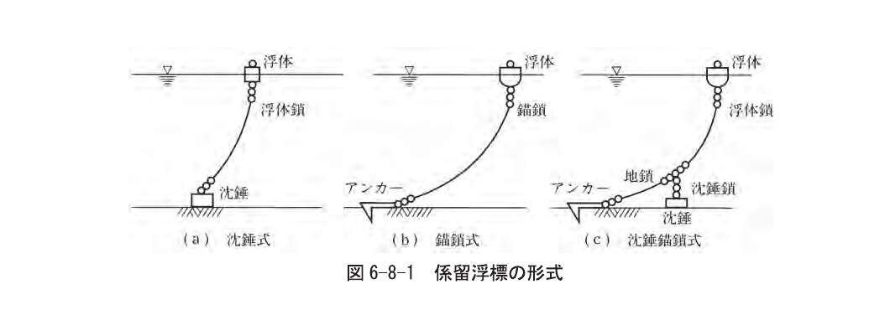

図6-8-1 係留浮標の形式

係留浮標は、一般に図 6-8-2 に示す順序で照査することができる。

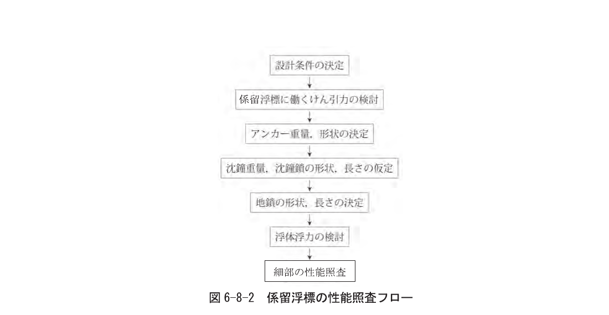

図6-8-2 係留浮標の性能照査フロー

### 8.4 性能照査に用いる主な作用

構造断面に応じて、漁船のけん引力等、必要な作用を、「第2編 設計条件」により設定することを原則とする。

係留浮標への作用として重要なものは、係留した漁船によるけん引力である。漁船には風、潮流、波による力が働き、それが係船浮標へのけん引力となる。そのため、風速、潮流、波高を求めて、係留した漁船に働く力の算定に用いる。けん引力は対象漁船を決定したうえで模型実験や数値シミュレーションで求めることが望ましい。

### 8.5 性能照査

#### (1) 利用性に関する性能照査

係留浮標の性能照査にあたっては、漁船の規模と係留形態を考慮し、係留が容易に行えることを原則とする。

係留を容易にするために、浮体には船の係留索をつなぐためのシャックルやフックを取り付けるのがよい。

#### (2) 構造物の安全性に関する性能照査

係留浮標の安全性に関する性能照査は、以下の(1)～(3)によることができる。

**1. アンカーや沈錘の重量、形状の決定**

アンカーや沈錘の水中重量や形状は、漁船のけん引力に起因する鎖の張力を支持できるよう設定することを原則とする。次のことを参考にするのがよい。

アンカーはコンクリートブロックに吊り鉄筋を付けて海底に設置する方法と、鋼製の片づめストックアンカーを用いる方法がある。粘性土地盤は前者が、砂質土地盤は後者が適する傾向にある。アンカーの規格は「JIS F 3301 アンカー」に港用係留アンカーとして定められている。

片づめのアンカーを用いる場合は、複数設置し、けん引力に対しては一つで水平支持力を確保する。鉛直力は主として沈錘で支持させる。

沈錘の材質、形状は耐久性さえあれば任意でよいが、鋳鉄を円盤状にする例が多い。

**2. 鎖の形状、長さの決定**

係留浮標の鎖は働く張力に耐えられるものとすることを原則とする。けん引による衝撃を吸収するためにある程度重くするのがよい。片づめストックアンカーを用いる場合の沈錘鎖は、地鎖と地盤のなす角度が大きくならないように短くするのがよい。浮体鎖は、船の振れ回りが小さくなるよう、なるべく鉛直に近く立ち上げるようにするのが望ましい。

鎖の規格には JIS「JIS F 3303 フラッシュバット溶接アンカーチェーン」がある。

**3. 浮体浮力の計算**

浮体は鎖による張力やけん引力の鉛直成分、自重を考慮して、適当な乾舷で浮くことを確認することを原則とする。

---

## 第9章 係留杭

### 9.1 係留杭の要求性能

> 係留杭の要求性能は、「係留浮標」の規定を準用する。

### 9.2 係留杭の性能規定

> 係留杭の性能規定は、以下に定めるとおりとする。
>
> 1.利用状況に応じた所要の諸元を有すること。
>
> 2.漁船の接岸及びけん引等の作用に対して、杭に作用する軸方向力が地盤の許容支持力以下となること、かつ杭に生じる応力が許容値以下となること。

### 9.3 性能照査の基本

係留杭は、自然条件、港内の利用条件等を考慮して漁船等を安全に係留するよう照査することを原則とする。

係留杭は、係留浮標と類似の機能、特徴を持つ。

### 9.4 性能照査に用いる主な作用

構造断面に応じて、漁船のけん引力等、必要な作用を、「第2編 設計条件」により設定することを原則とする。

### 9.5 性能照査

係留杭の、利用性に関する性能照査は、「第6編第8章 係留浮標」を参考にできる。

構造物の安全性に関する性能照査は、杭式の防波堤や係船岸に準じることができる。

## 第10章 その他の施設

### 10.1 付属設備

#### 10.1.1 付属設備の要求性能

> 付属設備の要求性能は、設備の構造に応じて、以下の要件を満たしていることとする。
>
> 1. 係留施設の効率的かつ安全な利用ができるよう適切なものとする。
> 2. 係留施設の利用状況に応じた作用に対して、構造上安全なものとする。

#### 10.1.2 性能照査の基本

係留施設には、危険防止、施設の効率的な利用及び管理、利便性や就労環境の向上等を目的として必要に応じて付属設備を設置する。

**(1) 付属設備の種類**

係留施設の付属設備には、防舷材、係船柱、係船環、車止め、照明設備、はしご、階段、防護柵、防風施設、防雪施設、排水設備等がある。

**(2) 付属設備の高質化について**

一般的に機能を発揮するのに必要な規模、材質等で経済的なものとすることが原則だが、漁港の全体計画及び係留施設の計画上、親水性の向上あるいは景観配慮や、漁業活動の安全性、利便性、効率性を一層向上させる目的で、高齢者等への配慮のために施設の高質化を行うことが望ましい。

ただし、照査にあたっては、係留施設及び付属設備としての機能、強度や耐久性や施設の維持管理上の支障についても考慮することが望ましい。

**(3) 漁船等の潜り込み防止について**

係留施設の種類と特性に応じて、漁船等の潜り込み防止のため次の検討を行うことを原則とする。

1. 桟橋、直立消波式の係船岸などでは、小型漁船の接岸時に潜り込みの危険が予想されるため、防護ネット等の潜り込み防止対策を検討する。
2. 桟橋では、漁船の潜り込み防止と防舷材の取り付け部を兼ねた、防衝板の設置を検討する。
3. 干潮時に小型漁船が防舷材の下端に潜り込む可能性のある場合には、下端角度の緩やかな防舷材の設置を検討する。

**(4) リサイクル資材の利用について**

リサイクル資材の利用を検討する場合は、その品質及び規格が設計条件を満足するものであることを確認するとともに、耐久性、経済性等を含めた総合的な検討を行うのがよい。

#### 10.1.3 性能照査

係留施設の付属設備の性能照査は、種類に応じて「第6編 10.1.4 防舷材」「第6編 10.1.5 係船柱・係船環」「第6編 10.1.6 車止め、照明設備、その他の付属設備」によることができる。

#### 10.1.4 防舷材

防舷材は、漁船等の接岸に対して、係船岸及び漁船等が安全であるように照査することを原則とする。

防舷材の照査では、係船岸の利用形態等に配慮して、安全性、利便性、防舷材のみではなく施設全体の経済性を考慮することが望ましい。

接岸による作用のみを照査の対象とする場合、防舷材の性能照査フローは図 6-10-1 によることができる。また、係留中の船が波、風、流れなどを受けて動揺することによって生ずる作用は、別途考慮する。

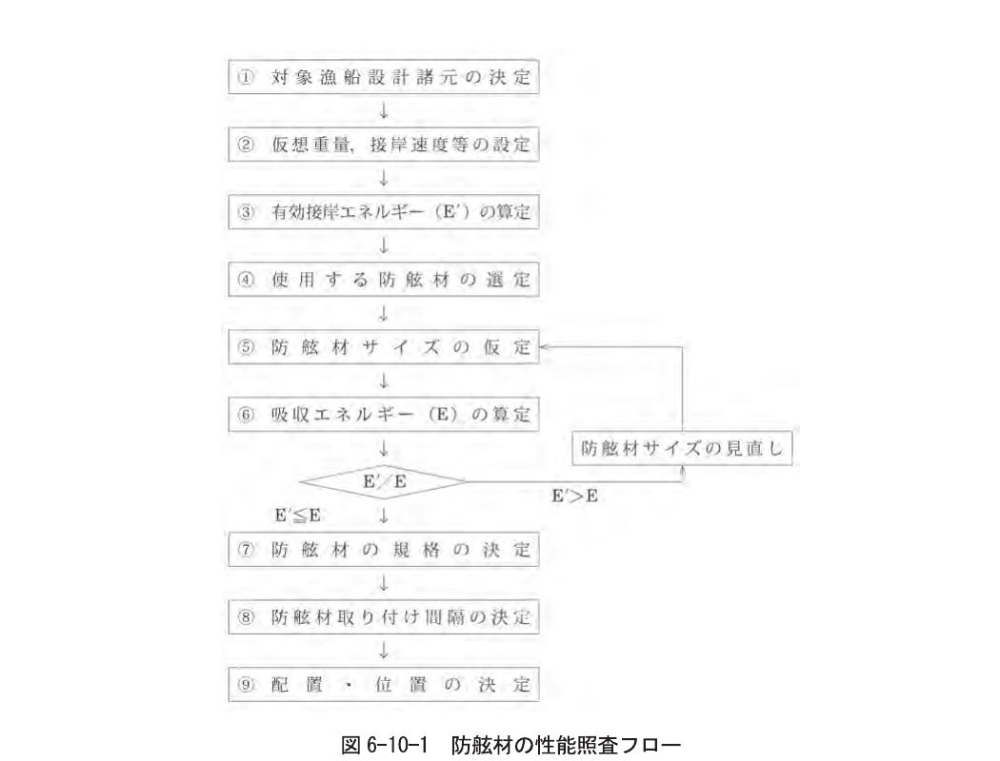

図6-10-1 防舷材の性能照査フロー

以下に、図 6-10-1 の各項目の詳細を示す。

**① 漁船の諸元の決定**

照査に用いる漁船の諸元は、「第2編 14.1 漁船等の諸元」を参考にして決定することができる。なお、防舷材は、対象漁船のうち最大、最多、最小のものについて検討することを標準とする。

**② 仮想重量、接岸速度等の設定**

照査に用いる漁船の仮想重量（W）及び接岸速度（V）は、「第2編 14.2.1 接岸エネルギー」を参考にして決定することができる。

**③ 有効接岸エネルギー（E'）の算定**

有効接岸エネルギー（衝撃エネルギーともいう。）は、運動力学的の計算手法によって算定し、「第2編 14.2.1 接岸エネルギー」により決定することができる。

**④ 使用する防舷材の選定**

- a）防舷材の性能によっては、係船岸の建設費、建設後の維持管理、接岸効率等にも影響を及ぼすため、これらを含めた総合的な検討を行うことが望ましい。
- b）利用頻度、海象・気象条件、耐用年数、耐久性、経済性、維持管理等を考慮するのがよい。
- c）桟橋や浮体式係船岸等柔な構造形式では、反力の大きな防舷材は適さない場合があることに注意を要する。
- d）漁港の特性を踏まえ、設計条件や利用条件に合致したものを適切に選定するのがよい。選定には以下のア）〜カ）を参考にできる。
  - ア）せん断に対する抵抗力を有するもの（反力は大きい）
  - イ）緩衝効果の大きなもの（初期の反力は小さい）
  - ウ）縦付け係船に適したもの（コーナー防舷材・保護材等）
  - エ）利便性や安全性を考慮したもの（防衝材兼用ゴム梯子等）
  - オ）景観に配慮したもの（カラー付き等）
  - カ）漁船の乗り上げ等に配慮したもの（テーパー付き等）

**⑤ 防舷材の種類・サイズの仮定**

利用計画、係船岸の諸元、漁船の諸元を考慮して、防舷材の種類やサイズを仮定する。防舷材の材質としてはゴム製が多く用いられているが、ほかに木材製、空気式、杭式、油圧式、水圧式などの種類がある。以降ではゴム防舷材の場合を示す。なお、ゴム防舷材のうち、漁港用ゴム防舷材の具体の事例について、文献1) にまとめられている。

**⑥ 吸収エネルギー（E）の算定**

ゴム防舷材は、その種類により吸収エネルギー、反力、変位量などの特性が異なっている。仮定した防舷材の種類での漁船との接触長さ当たりの吸収エネルギーを算定することを原則とする。接触長さは漁船の断面形状を考慮して定めるのがよい。なお、吸収エネルギーは各防舷材のカタログを参考に、防舷材の製造上の誤差も考慮して算定することができる。吸収エネルギーを−10%の特性（性能）で評価し、⑦に述べる反力を+10%で評価する事例が多い。

**⑦ 防舷材の規格の決定**

有効接岸エネルギーが吸収エネルギーの規格値以下となるように防舷材の規格を決定する。

有効接岸エネルギーは法線方向、鉛直方向とも1個の防舷材で吸収するものとして扱うことを原則とする。

なお、防舷材の反力が係船岸の許容荷重内となるように注意する。

ゴム防舷材の変位と吸収エネルギーの関係、変位と反力の関係は、模式的に、図 6-10-2 のように表される。図においては、1個の防舷材で有効接岸エネルギー E1' を吸収したとすると変位率は δ1 となり、反力は変位率が δ1 以下の最大値 H1 となる。

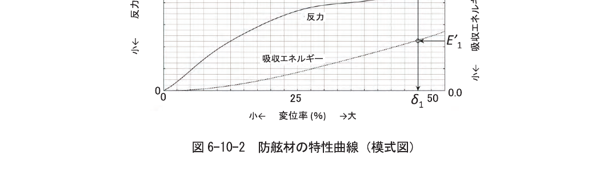

図6-10-2 防舷材の特性曲線（模式図）

**⑧ 防舷材取り付け間隔の決定**

- a）防舷材が漁船の接岸エネルギーを吸収する前に、漁船が直接係船岸に接触しない間隔とすることを原則とする。
- b）大型船用防舷材の中間に小型船用防舷材を設置する場合は、大型船接岸時に小型船用防舷材の反力が大きくならないよう、防舷材の間隔と高さ（前面位置）を決定するのがよい。
- c）取り付け間隔は、利用実態、経済性、安全性を検討の上決定するのがよい。

**⑨ 配置・位置の決定**

- a）漁港の係留施設においては防舷材を縦取り付けとしている場合が多い。これは、小型船が係留施設と平行に係留する時に舷側の引っ掛かりが起きにくいことや、干潮時も満潮時も大差なく機能を発揮できること等によっている。ただし、利用する漁船の船型、潮位差、接岸方法等を考慮して適切な配置・位置とするのがよい。図 6-10-3 の例を参考にできる。
- b）潮位差が大きい箇所では、縦取り付けが不経済となる場合がある。その場合は、千鳥取り付けを検討するのがよい。
- c）長さは漁船との接触長さ以上を確保することを原則とする。位置は、上端が係船岸の天端高、下端は平均干潮面（M.L.W.L.）程度とする場合が多いが、施工や構造上の制約、利用・安全面の支障に配慮して決定するのがよい。

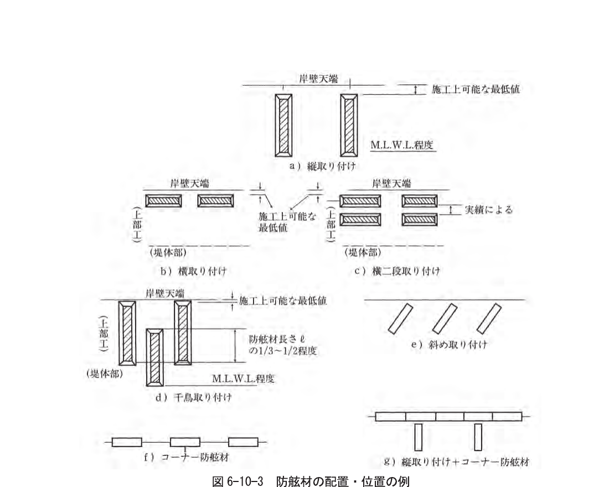

図6-10-3 防舷材の配置・位置の例

#### 10.1.5 係船柱・係船環

係船柱・係船環の性能照査は、以下の（1）〜（4）によることを原則とする。

> (1) 自然条件、船舶の諸元、係船方法を考慮して、必要な強度を有したものを適切な箇所に設置する。
>
> (2) 漁船等のけん引力に対して係船岸及び漁船等が安全であるように照査する。
>
> (3) 係船柱・係船環に働く漁船等のけん引力に対して安全な強度と引き抜き抵抗を有することを照査する。
>
> (4) 係船柱・係船環の配置は、1バース当たり2個以上とする。

また、以下の（5）によることができる。

**(5)** 係船柱・係船環にはたらく漁船等のけん引力は、「第2編 14.2.2 けん引力」を参照することができる。

また、以下の（6）〜（8）によるのがよい。

**(6)** 係船柱には曲柱と直柱があり、次のことを考慮して選定するのがよい。

常時の係留又は離接岸時の操船用に用いる係船柱は、作業の障害とならないように水際線の近くに配置するが、この場合、係留索が上方に引かれることがあるため曲柱を用いるのがよい。ただし、係船岸の天端高と甲板が同程度の高さで、係留索が上方へ引かれることのない場合には直柱を用いる場合もあり、この場合の照査は、曲柱と同様としてよい。

一方、暴風時に漁船を係留する係船岸では、漁船の横方向からの力に対して、水際線近くに配置された係船柱では有効に働かない場合があるため、船軸と係留索ができるだけ直角となり、かつ作業等の障害にならないよう、水際線から離れた位置に強大な力にも安全な係船柱を設置することが望ましい。この場合、係留索は上方に引かれないので直柱を用いるのがよい。

**(7)** 係船柱（曲柱）の位置は、水際線に近い方が船からの操作や背後の利用上便利であることを考慮して、水際線から係船柱（曲柱）中心までの距離は 0.5〜1.0m 程度としてよい。なお、係船環の取り付け位置は、図 6-10-4 のように係船岸の天端や側面に設置する方法がある。

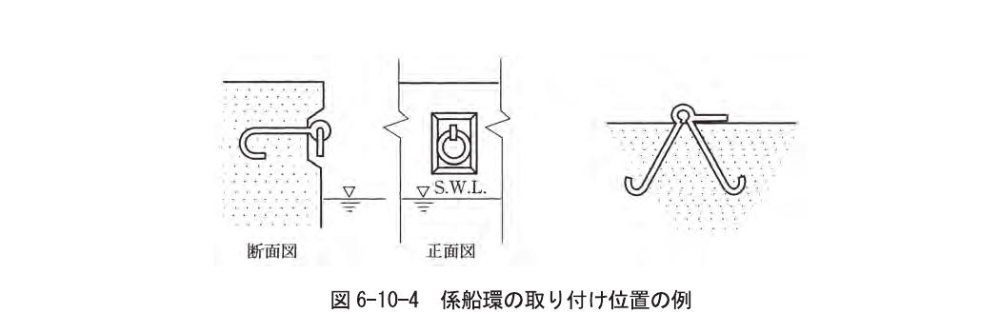

図6-10-4 係船環の取り付け位置の例

**(8)** その他、次のことを考慮するのがよい。

1. 係船柱・係船環の種類、材質、規格等の選定においては、利便性、耐久性、経済性等を検討するとともに、利用者の意向も把握するのがよい。
2. 係船環は、小型船を対象とした係船付属設備として設置されるが、その規格は表 6-10-1 に示すものが多く使用されている。

| 項目 | 規格 |
|:---:|:---:|
| 太さ | 25mm |
| 環径 | 200mm、250mm |

表6-10-1 係船環の規格

3. 綱取り等の作業性を勘案し、位置、太さ、高さ等を決定するのがよい。
4. 係船柱の中間部に必要に応じて係船環を設置することを検討してもよい。
5. 係船環を側面に設置する場合は、潮位を考えて適切な高さに取り付けるのがよい。
6. 係船環の材質は、腐食を考慮してステンレス製等とすることが望ましい。
7. 係船柱（曲柱）の配置間隔は、表 6-10-2 を参考としてもよい。

| 係留岸水深 | 係船柱配置間隔 |
|:---:|:---:|
| −3m以下 | 5.0m |
| −3m超〜−5m未満 | 7.5m |
| −5m以上 | 10.0m |

表6-10-2 係船柱（曲柱）の配置間隔

#### 10.1.6 車止め、照明設備、その他の付属設備

車止め、照明設備、その他の付属設備は、必要に応じて、係留施設の利用状況、安全管理等を考慮して設置することを原則とする。

車止め、照明設備、その他の付属設備の照査は、以下の（1）〜（7）によることができる。

**(1) 車止め**

1. 車止めの取り付け間隔は 30cm 程度とし、係船柱をはさむ場合は安全性を考慮の上 1.5m〜2.5m 程度としてよい。

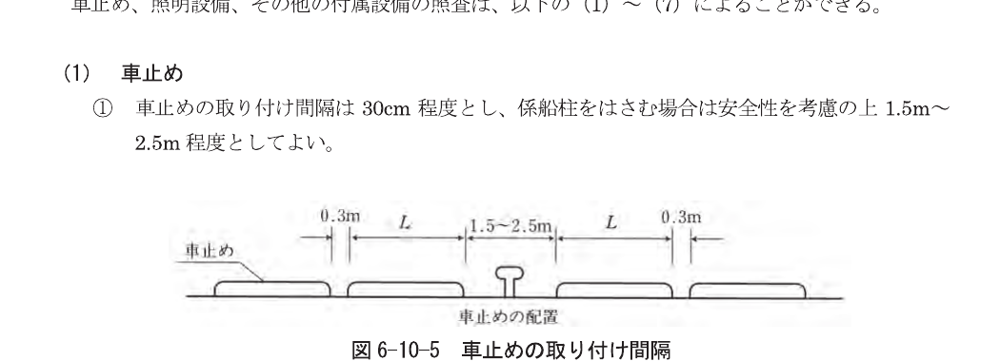

図6-10-5 車止めの取り付け間隔

2. 塗装は警戒を促す色とし、発光塗料等を用いるのがよい。
3. 設置位置は、漁船の係留方法及び陸揚げ作業の形態等を考慮して決定するのがよい。図 6-10-6 に示すように、係留方法が縦づけのとき、船の先端が車止めに接触して船に損傷を与える場合があるので注意を要する。また、漁獲物をトロ箱等によって陸揚げする場合は、必要に応じて陸揚げの作業幅を確保するなど、背後の利用状況等を考慮して設置位置を決定するのがよい。

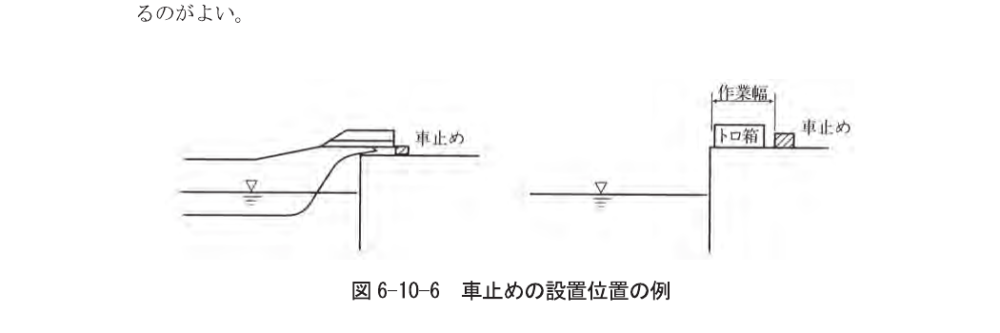

図6-10-6 車止めの設置位置の例

**(2) 照明設備**

係船岸のエプロン、船揚場、取り付け道路には、夜間における漁獲物の陸揚げ、漁船の係船作業、船揚げ作業、交通等のため、必要に応じて照明設備を設けることを原則とする。

照明設備は、設置場所により必要な基準照度、照明分布等を確保するよう、適切な照明方法、光源等を選定して配置することを原則とする。係船岸等の円滑かつ安全な利用を維持するためには、床面又は地上面の照度の平均値「平均水平面照度」について必要な値を確保するのがよい。施設の利用形態等に応じて、連続照明と、投光機等での局部照明を比較検討してもよい。

係船岸のエプロン、船揚場等の照度は、「道路照明施設設置基準・同解説」2) 等の各種基準を準用できる。また、表 6-10-3 を参考にして定めてもよい。係留施設での作業内容に応じて、港湾の基準照度3) も参考にできる。

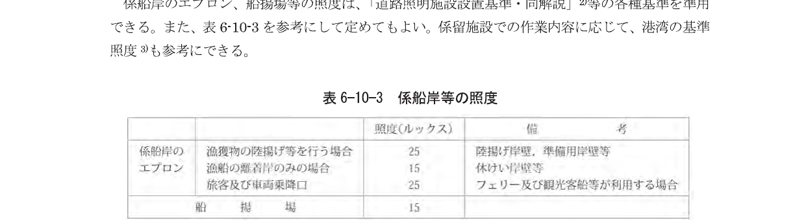

表6-10-3 係船岸等の照度

照明設備は、漁獲物の種類、陸揚げ方法、作業時間帯等を考慮し、次に示す作業者の快適性にも配慮することが望ましい。

1. 作業者の視界内でグレア（視野の中に飛びぬけて高い輝度（光源の単位面積当たりの輝きの程度）のものがあったり強すぎる輝度対比があったりした時に見え方が低下するとともに不快な感じをもたらす現象）が生じないよう配慮する4)。
2. 係留施設と荷さばき所等を往来する車両の動線を考慮して、運転者の目が順応できないような照度の急変を避ける4)。

係留施設背後に位置する道路の照明は、「道路照明施設設置基準・同解説」を準用できる。その際、係船岸のエプロン、船揚場等周辺の照明との一体性に配慮することが望ましい。

**(3) 階段・はしご**

係船岸には、非常時の利用のため、必要に応じて階段・はしごを設置するのがよい。

設置位置は、漁船等の利用や漁業活動に支障がない位置とし、係船岸の先端又は取り付け部とすることが望ましい。

階段は小型漁船への乗り降りや荷物等の揚げ降ろしにも用いられるので、安全に利用できる構造とするのがよい。はしごは、人の乗降に安全に利用できる構造とし、水中からも容易に人が上がれるよう配慮するのがよい。

階段の幅は 0.7〜1.5m、段の高さ及び階段の奥行きは 20〜30cm 程度としている例が多い。なお、階段の高さが 2m 以上の場合は、踊り場等の安全対策を講ずるのが望ましい。コンクリートの段表面は粗く仕上げるのがよい。

はしごの幅は 45cm、段の間隔は 25〜30cm 程度とし、その下端は L.W.L. より下とすることが望ましい。また、安全対策上で必要な場合の設置間隔は、50m に1箇所程度としてよい。

**(4) 柵・フェンス**

安全対策上又は管理上係船岸に車両（及び人）の進入を限定する必要がある場合には、柵及びフェンス等を適切に設置するのがよい。

**(5) 防風・防雪施設**

係留施設における漁業作業の就労環境を良好なものとするため、また漁船の安全な係留のために、必要に応じて防風、防雪施設等を設置することが望ましい。

防風、防雪施設の設置には、以下の①〜④を参考にできる。

1. 係留施設における防風施設、防雪施設は次の効果が期待できる。
   - a）係留施設及びその背後における漁業作業は、強風、降雪など厳しい自然条件のもとでも行われるため、防風施設、防雪施設等を設置することにより就労環境の改善を図ることができる。
   - b）係留した漁船が強風の影響を受けると、漁船どうし又は係船岸との接触により漁船や係船岸が破損する場合があり、これらの事故防止のために漁船の係留間隔を必要以上に広くする必要がある場合、防風施設の設置により安全で効率的な係留を図ることができる。
2. 防風、防雪対策としては、柵やフェンス等が一般的であるが、自然条件、利用条件さらに背後の状況等を勘案し、係留施設のみならず用地等における防風、防雪あるいは防砂対策などとの関連も考慮して設置するのがよい。
3. 漁船の係留時の安全対策としての防風施設の照査は、「第13編 防風施設」によることができる。
4. 積雪寒冷地では、エプロン上の積雪及び結氷対策として、必要に応じてロードヒーティング、排雪・流雪設備を検討することが望ましい。

**(6) 排水設備**

係留施設における速やかな排水のため、施設の形状を考慮に入れて適切な排水設備を設置するのがよい。

排水設備の設置には、以下の①〜⑤を参考にできる。

1. 排水設備は、背後の道路や用地等の排水も勘案し、効率的な排水計画に基づいた設計を行うことを原則とする。また、必要に応じて排雪設備としての活用も検討してよい。
2. 排水口は、できるだけ漁船の接岸位置を避けた位置とした方がよい。
3. 排水管の接続部等は、構造物の沈下や振動で破壊されないような構造とすることが望ましい。
4. エプロン上の排水は、舗装面の勾配を利用して前面に落とす方法と、逆勾配として背後に落とす方法がある。エプロン上の汚水等が海水を汚す恐れのある場合はエプロンを逆勾配とするのがよい。前面に落とす場合、車止めの背後には雨水が溜まりやすいので、排水溝や水抜きの設置を検討するのがよい。
5. 高潮が予想される場合は、排水管等に逆流防止弁を設けるのがよい。

**(7) 係留施設の利用目的に応じた付属設備**

係留施設は、利用目的に応じて、利便性等の向上に資する付属設備を設置することが望ましい。

利用目的に応じた付属設備の選定には、表 6-10-4 の一覧を参考にできる。

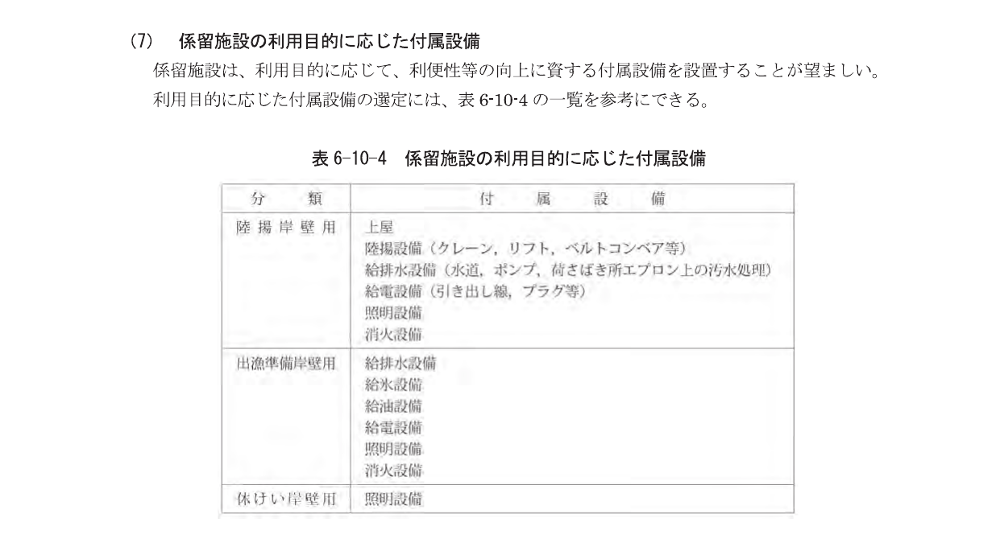

表6-10-4 係留施設の利用目的に応じた付属設備

### 10.2 遊漁船等対応係留施設

#### 10.2.1 性能照査の基本

遊漁船等対応係留施設については、潮位、遊漁船等の種類、係留の目的等を考慮して、適切に照査することを原則とする。

**(1) 遊漁船等の種類**

遊漁船等とは、漁船以外の次に示す船舶をいう。

1. 遊漁船……遊漁兼業漁船以外の遊漁案内業船、瀬渡し船、遊漁を主たる目的とした船舶
2. プレジャーボート……ヨット、モーターボート、クルーザー等の遊漁又は観光以外の海洋レジャーに使用する船舶

**(2) 遊漁船等対応係留施設の形式の選定**

遊漁船等対応係留施設の形式は、係留の目的（水面保管、一時係留）、船種、船型、隻数、潮位差を考慮して、適切に選定することを原則とする。

形式の選定には、潮位差や静穏度を考慮することが望ましい。潮位差の大きい場所では浮桟橋を用いることが望ましく、港内静穏度の確保が困難なところでは、重力式、矢板式係船岸が望ましい。

また、以下の①〜③に示す主な形式の特徴及び図 6-10-7 も参考にするのがよい。

**① 重力式、矢板式係船岸**

利用者の歩行及び重量物や多量の荷物の運搬に適しているが、反射波があるため船体への影響が大きい。潮位差が大きい水域では、遊漁船等への乗降や荷物の搬入に不便である。大型船の係留には比較的適しているが、小型船の係留にはあまり適さない。

**② 桟橋、浮桟橋**

桟橋は利用者の歩行及び重量物や多量の荷物の運搬に適している。反射波が少なく船体への影響は小さい。潮位差が大きい水域では、遊漁船等への乗降や荷物の搬入に不便である。大型船の係留には比較的適しているが、小型船の係留にはあまり適さない。

浮桟橋は、重量物や多量の荷物の運搬にはあまり適さない。水面からの高さが常に一定なので、潮位差が大きい水域での遊漁船等への乗降に適している。また、移設・増設が容易であるためレイアウトの変更等に容易に対応できる。

**③ 係船浮標、係船杭**

潮位差が比較的小さい水域での遊漁船等の一時係留に適している。建設コストが安く、経済的な係留方法であるが、単独の係留形式としては、利用者の移動や荷物の運搬に不便であるため、他の形式と組み合わせて用いられることが多い。係船浮標は、係船杭に比べて船体の移動量が大きい。

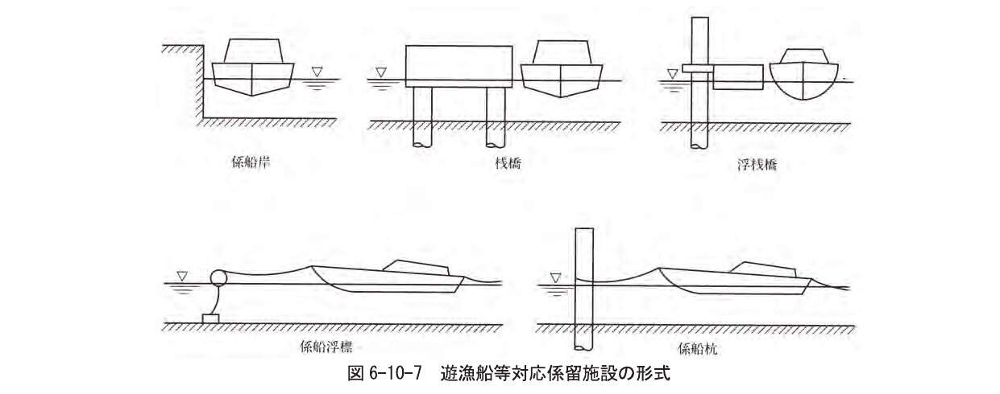

図6-10-7 遊漁船等対応係留施設の形式

#### 10.2.2 性能照査に用いる主な作用

1. 重力式係船岸については、「第6編 3.4 重力式係船岸」によることができる。
2. 矢板式係船岸については、「第6編 3.5 普通矢板式係船岸」「第6編 3.6 自立矢板式係船岸」「第6編 3.7 二重矢板式係船岸」「第6編 3.8 斜め控え杭矢板式係船岸」「第6編 3.9 棚式係船岸」によることができる。
3. 桟橋については、「第6編第4章 桟橋」によることができる。
4. 浮桟橋については、「第6編第6章 浮桟橋」及び「第6編 10.2.5 遊漁船等対応係留施設における浮桟橋の性能照査」によることができる。
5. 係船浮標、係船杭については、「第6編第8章 係留浮標」及び「第6編第9章 係留杭」によることができる。

#### 10.2.3 利用性に関する性能照査

遊漁船等対応係留施設の規模と配置については、波浪、潮位、係留の目的、船舶の種類、船型等を考慮して、遊漁船等が安全かつ円滑に利用できるように定めることを原則とする。

遊漁船等対応係留施設の諸元については、図 6-10-8 を参考にして定めることができる。ここでは桟橋の機能を、主として利用者の歩行や荷物の運搬等に供する主桟橋と、主として遊漁船等の係留や遊漁船等への乗降に供する補助桟橋に分けている。

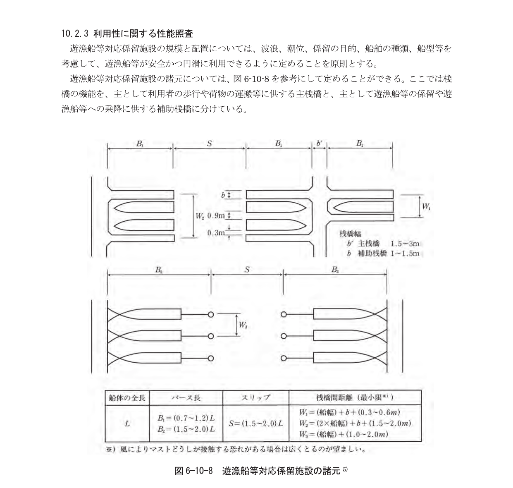

図6-10-8 遊漁船等対応係留施設の諸元5)

### 10.2.4 構造物の安全性に関する性能照査

① 重力式係船岸については、「第6編 3.4 重力式係船岸」によることができる。

② 矢板式係船岸については、「第6編 3.5 普通矢板式係船岸」「第6編 3.6 自立矢板式係船岸」「第6編 3.7 二重矢板式係船岸」「第6編 3.8 斜め控え杭矢板式係船岸」「第6編 3.9 棚式係船岸」によることができる。

③ 桟橋については、「第6編第4章 桟橋」によることができる。

④ 浮桟橋については、設置箇所が波及び流れによる影響がほとんどない場合（港内の静穏度が、通常時の利用限界波高として 0.3m 以下、異常時に 0.5m 以下が確保されている場合）、「第6編 10.2.5 遊漁船等対応係留施設における浮桟橋の性能照査」によることができる。それ以外の場合は、「第6編第6章 浮桟橋」によることができる。

⑤ 係船浮標、係船杭については、「第6編第8章 係留浮標」及び「第6編第9章 係留杭」によることができる。

### 10.2.5 遊漁船等対応係留施設における浮桟橋の性能照査

#### （1）性能照査の基本

浮桟橋の配置は、気象等の自然条件、係留の目的及び係留船隻数等を考慮して定めることを原則とする。浮桟橋の配置においては、設置箇所の気象・海象等の自然条件、対象とする遊漁船等の利用形態を考慮するとともに、防食対策など維持管理についても配慮するのがよい。

また、浮桟橋の構造は、安全性、耐久性、利用性、経済性等を考慮して定めることを原則とする。

**① 浮桟橋の照査に必要な観点**

浮桟橋に必要な観点は次のとおりである 6)。

a）安全性

- 構造的に安全であること（水没等の心配がないこと）。
- 利用時において十分な安定復原力が得られること。
- 施設の動揺が少ないこと。

b）耐久性

- 過酷な条件下においても十分な機能を有すること。
- 耐用年数が長いこと。

c）利用性

- 利用者に安心感を与える施設であること。
- 施設の拡充、改造が容易であること。

d）経済性

- 管理上手間がかからないこと。
- 構造がシンプルであること。
- 部品の交換が容易であること。
- スペース効率が良いこと。

e）景観性

- 周囲の景観と調和するデザイン（全体レイアウト、各構成体）であること。

**② 浮桟橋の配置形状**

浮桟橋の配置形状には、クシ型桟橋、一列単桟橋等があるが、フィッシャリーナにおける水面保管のための係留用としては、主桟橋と補助桟橋を組み合わせたクシ形桟橋が多く用いられている。浮桟橋の配置例を図 6-10-9 に示す。

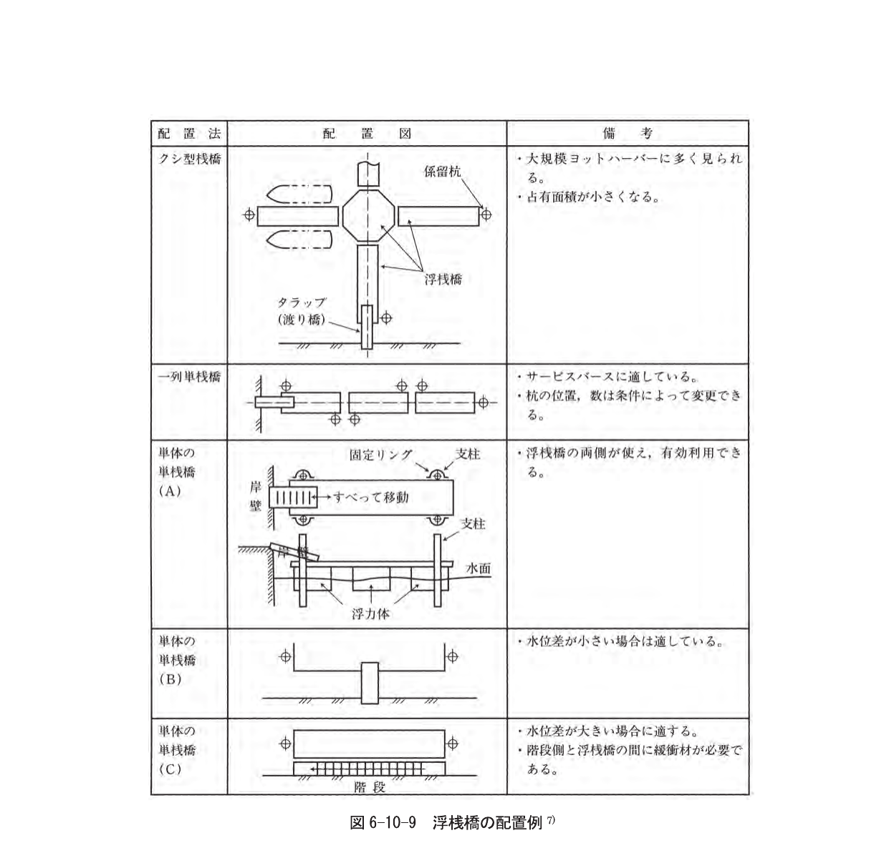

図 6-10-9 浮桟橋の配置例 7)

**③ 浮体の構造**

浮体は、フロート部、デッキ部（デッキフレーム及びデッキプレート）等により構成される。浮体の構造の選定においては、以下に示す構造形式別の特徴を参考にできる。

a）モノコックタイプ

FRP、コンクリート等で一体成形した浮力体ユニット（長さ約 10m）を相互に連結する形式

b）ポストテンションタイプ

複数の浮力体エレメント（長さ約 3m）に、PC 鋼線等によりポストテンションを与えて、構造の一体化（長さ約 10m）を図り、これを1ユニットとしてユニット間を連結する形式

c）セパレートタイプ

独立した複数の浮力体（長さ 1〜2m）を縦通フレームにボルト等で接合し、一体化したものを1ユニット（長さ約 10m）とし、ユニットを連結する形式

d）ウェイラータイプ

独立した複数の浮力体（長さ 1〜3m）を縦通木材（ウェイラーと呼ぶ）に接続材、ガセットフレーム及び貫通ボルトを用いて順次接合し一体化を図り、接合部を持たない無関節継手構造とする形式

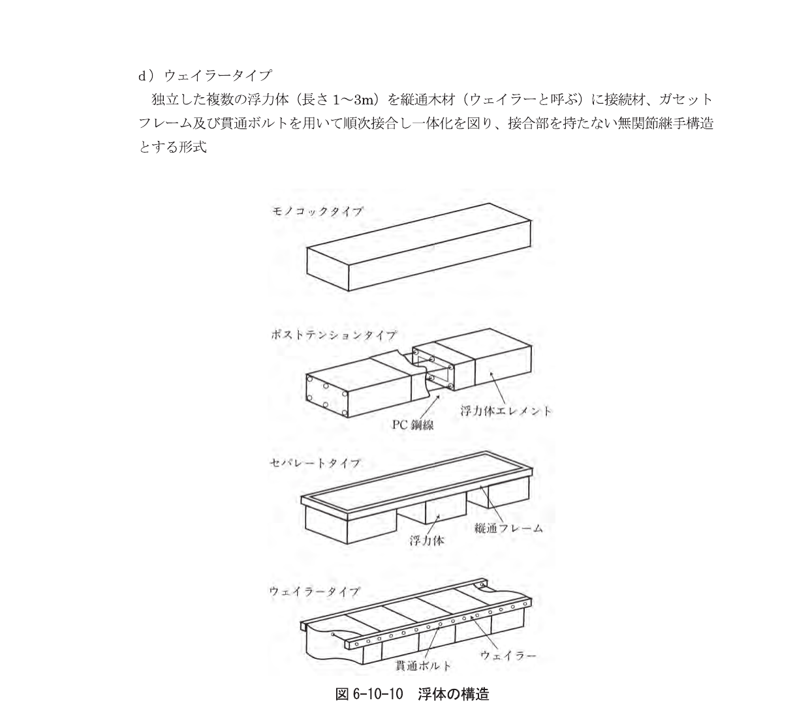

図 6-10-10 浮体の構造

**④ 係留装置**

浮桟橋を杭に留めるための浮桟橋本体に設置される装置を係留装置という。

浮桟橋の係留方法には、杭方式と係留索方式がある。クシ型浮桟橋の係留は、杭方式が一般的である。

係留杭は、補助桟橋先端部、補助桟橋根元部、主桟橋の側部、主桟橋の先端部より選択し、組み合わせて配置することが一般的である。また、図 6-10-11 に示すとおり主桟橋又は補助桟橋本体より張り出した外杭方式と、主桟橋又は補助桟橋の本体内に収められた内杭方式とがある。

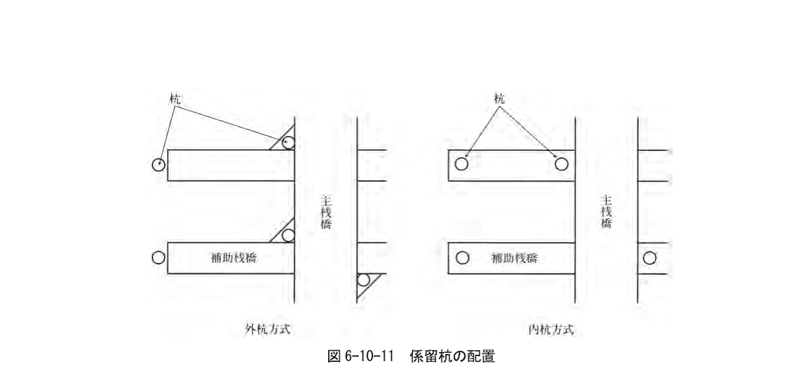

図 6-10-11 係留杭の配置

#### （2）性能照査に用いる主な作用

浮体の性能照査に使用する上載荷重は、実際に載荷される荷重の種類及び量を考慮して、適切な値を設定する。

部材強度を検討する際の上載荷重は、通常 0.5〜1.0kN/m2 とすることが多い。

係留杭への作用は、「第6編 6.7 係留部の照査」によって算出した作用に基づいて決定することができる。

#### （3）利用性に関する性能照査

浮桟橋は、必要な乾舷を確保することを原則とする。浮桟橋の乾舷は、利用者が落水した場合、容易に這い上がれることを想定して 30〜50cm 程度とすることが多い。

荒天時における遊漁船等の係留状態時の浮体の安全性については、施設の運用の観点からも検討するのがよい。

#### （4）構造物の安全性に関する性能照査

**① 浮体の安定**

浮体は、想定される利用状態に対して安定であることを原則とする。

浮体の安定の照査は、「第6編 6.6.1 浮体の安定」の式 6-6-3 及び式 6-6-5 によることができる。

**② 浮体の係留**

浮体の係留については、浮体が波浪及び潮汐に円滑に追随し、浮体に働く風、流れ、波浪等の作用に対して安全な構造であるよう照査することを原則とする。

係留装置の取り付けに際しては、滑動性の確保について留意することを原則とする。

**③ 浮体の強度**

浮体の構造は、製作・輸送・据付時及び完成後の各種の作用に対して、十分な強度を有することを原則とする。

その場合、本体構造については、水平軸まわり及び鉛直軸まわりの曲げ及びせん断等に対して検討を行うものとしてよい。特に全体強度については、サギング状態（浮体の両端が波の峰によって支えられた状態）での縦曲げモーメントに対して適切に検討を行うのがよい。縦曲げモーメントは、セパレートタイプの場合は図 6-10-12 に示すように単純ばりの考え方により算出でき、モノコックタイプ等の場合は図 6-10-13 に示すように浮力変動の考え方（「第6編 6.6.2 浮体の全体強度」を参照のこと）により算出できる。

図 6-10-12 セパレートタイプの場合

図 6-10-13 モノコックタイプ等の場合

**④ 浮体の連結**

浮体の構造相互の連結機構は、製作・輸送・据付時及び完成後の各種の作用に対して、十分な強度を有することを原則とする。その際、荒天時における作用を考慮することを原則とする。

浮体の連結箇所は、主桟橋単体間、補助桟橋単体間及び主桟橋と補助桟橋間にある。浮体の連結方法には、図 6-10-14 に示すとおり桟橋間をボルト等により完全に固定する固定式、ヒンジ等を使うことにより上下運動は自由にさせ、横方向には動かないようにした半固定式、チェーン又は緩衝機構を使って、上下、左右どの方向へも動くようにした自由連結がある。

主桟橋と補助桟橋間の連結機構は、ピンジョイントのように主桟橋間と同一のものもあるが、主桟橋に対して補助桟橋が直角方向に接合されているという配置及び強度上の必要性から、主桟橋のものとは一般に機構を異にしている。主桟橋と補助桟橋間の連絡が固定式連結又は半固定式連結のものについては、補助桟橋に働く波力を考慮して、連結部の強度並びに主桟橋のせん断強度及び曲げ強度の検討を行うことが望ましい。

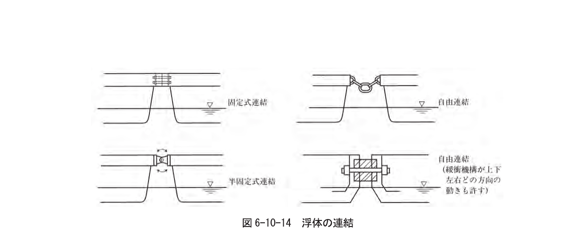

図 6-10-14 浮体の連結

**⑤ 浮体の耐久性**

浮体の本体の耐久性の確保を図るため、止水対策を実施するのがよい。さらに遊漁船等の衝突により損傷を受けた場合の止水対策として本体内部に発泡スチロールを充する等の対策を講ずることが望ましい。浮体の本体の材料に発泡スチロール等を使用する場合には、材料の耐久性についても検討するのがよい。

**⑥ 係留杭**

一般に、浮桟橋及び係留装置は設計条件を均一に設定して照査を行うが、係留杭は浮桟橋の設置場所ごとの水深、自然条件、海底地盤の条件に基づきその都度照査することを原則とする。

杭の照査は「第4編第3章 杭基礎の支持力」及び「第6編 4.7 杭の照査」によることができる。

係留杭は、高潮位において浮桟橋の係留装置が外されない高さとすることを原則とする。

**⑦ 係留索方式**

係留索方式の照査は、「第6編 6.7.2 チェーン係留方式」を参照してもよい。

### 10.2.6 遊漁船等対応係留施設における連絡橋の性能照査

連絡橋の構造は、利用者の安全性に支障のないように適切に定めることを原則とする。

連絡橋の諸元を決定するに際しては、利用条件、潮位変動、浮桟橋の動揺等を考慮することを原則とする。連絡橋の選定及び照査は、「第6編 6.8 連絡橋及び渡橋」によることができる。

## 10.3 蓄養殖への配慮

> 蓄養、養殖等の作業に使用される係船岸においては、作業の特性に応じて安全で利用しやすい配置や構造を選定することを原則とする。

### 10.3.1 性能照査の基本

蓄養、養殖等の作業においては、蓄養された魚介藻類の陸揚げ、養殖（中間育成を含む。）の諸作業（飼料運搬、養殖施設の修理等）等のために係船岸が利用される。利用目的によっては、標準的な係船岸の構造では作業能率や作業の安全性が不十分になる場合がある。その場合、構造上の工夫が必要となる。このような工夫を施す係船岸を、本節では「蓄養殖岸壁」と称す。

蓄養殖岸壁は、利用形態から次の通り分けられる。

**（1）蓄養の場合**

① イケス等魚介類の蓄養施設を係船岸に離接岸するもの

② 係船岸と蓄養施設を一体化としたもの（事例を図 6-10-15 及び図 6-10-16 に示す）

③ 蓄養施設の揚げ降ろしに利用されるもの

④ 係船岸の背後（陸域）に蓄養施設を設けるもの

**（2）養殖の場合**

① 飼料の積み出しに利用されるもの

② 養殖筏等の施設の揚げ降ろしに利用されるもの

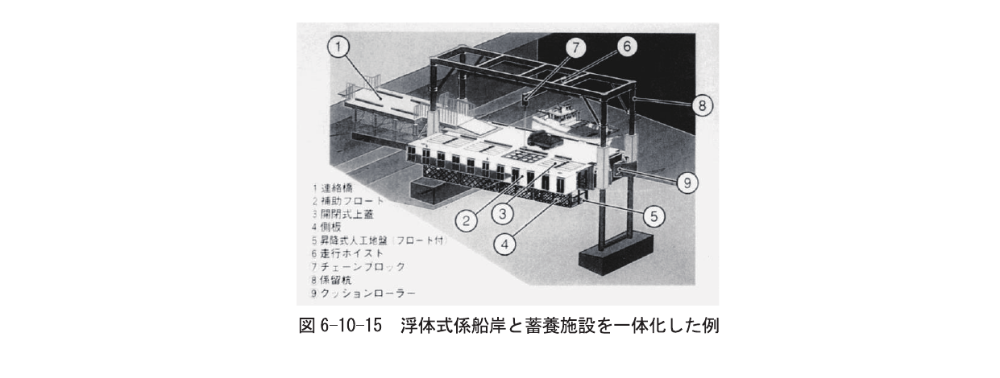

図 6-10-15 浮体式係船岸と蓄養施設を一体化した例

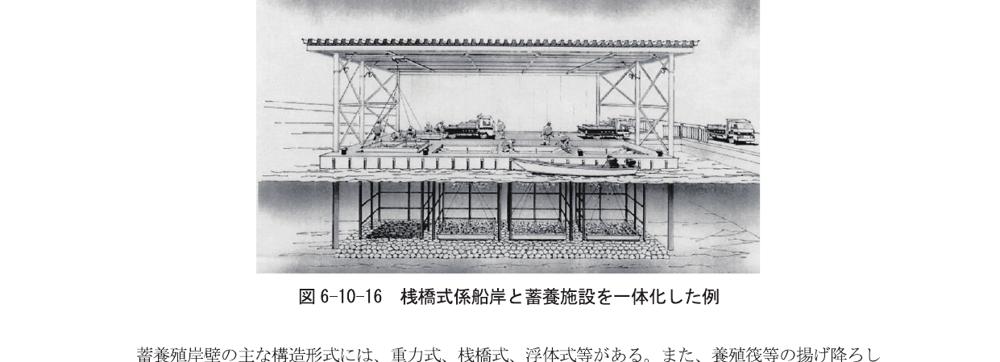

図 6-10-16 桟橋式係船岸と蓄養施設を一体化した例

蓄養殖岸壁の主な構造形式には、重力式、桟橋式、浮体式等がある。また、養殖筏等の揚げ降ろしのための斜路構造のものがある。

### 10.3.2 利用性に関する性能照査

蓄養殖岸壁の利用性に関する性能照査は、次の(1)〜(3)によることを原則とする。

**(1)** 海象及び航跡波に左右されずに魚介類を蓄養殖できる静穏水域の場所を選定する。

**(2)** 蓄養殖水域は静穏性がよい反面、魚介類の排泄物や残餌、海水中の浮遊物等が海底に堆積し、水質を悪化させる懸念があるため、漁港内の海水交換のよい場所を選定する。

**(3)** 蓄養殖する対象魚介類に応じた好適環境条件に留意する。

また、次の(4)〜(6)によることが望ましい。

**(4)** 漁獲した魚介類の蓄養施設への集荷、蓄養施設からの出荷、さらに背後の施設用地の利用形態、輸送を含めた円滑な物流を確保できるような場所が望ましい。

**(5)** 蓄養殖水域の静穏度が不十分な場合は、防波堤等で蓄養殖水域を囲む等の対策を講じることが望ましい。

**(6)** 就労環境及び衛生管理向上のための防風署施設、密漁対策のための侵入防止施設等、利用上、安全上、管理上必要な付属施設を設置することが望ましい。

### 10.3.3 性能照査に用いる主な作用

① 重力式係船岸については、「第6編 3.4 重力式係船岸」によることができる。

② 桟橋については、「第6編第4章 桟橋」によることができる。

③ 浮桟橋については、設置箇所が波及び流れによる影響がほとんどない場合（港内の静穏度が、通常時の利用限界波高として 0.3m 以下、異常時に 0.5m 以下が確保されている場合）、「第6編 10.2 遊漁船等対応係留施設」によることができる。それ以外の場合は、「第6編第6章 浮桟橋」によることができる。

### 10.3.4 構造物の安全性に関する性能照査

蓄養殖岸壁の構造物の安全性に関する性能照査は、一般に次の通りとすることができる。

**(1)** 材料については、「第3編 材料及び諸係数」を参照することができる。

**(2)** 重力式の蓄養殖岸壁については、「第6編 3.4 重力式係船岸」を準用する。

**(3)** 桟橋式の蓄養殖岸壁については、「第6編第4章 桟橋」を準用する。

**(4)** 浮体式の蓄養殖岸壁については、「第6編第6章 浮桟橋」を準用する。

### 10.3.5 構造細目

**(1)** 海水交換機能を有する防波堤等の近傍に蓄養殖岸壁を配置する場合は、海水交換開口部からの波浪及び流れを考慮するのがよい。

**(2)** 設計水深については、利用漁船のほか、イケスの大きさ、海底部の砂やヘドロの舞い上がり等を考慮するのがよい。

**(3)** エプロン幅は、「第6編 2.7 エプロン」及び「第6編 6.5 性能照査 (1)利用性に関する性能照査」を準用できる。

**(4)** 蓄養施設一体型の構造では、蓄養施設内の清掃・補修等を考慮した形状とすることが望ましい。

## 10.4 特定目的岸壁

### 10.4.1 性能照査の基本

> 特定目的岸壁とは、漁船に利用されるほか、官公庁船、フェリー、定期船等漁船以外の船舶にも利用される係船岸をいう。

特定目的岸壁の照査においては、利用船舶及びその利用形態を考慮することを原則とする。

### 10.4.2 性能照査に用いる主な作用

特定目的岸壁の性能照査において考慮すべき作用には、波力、土圧、風圧、地震力、船舶の接岸による作用、船舶のけん引力等がある。安全確保の見地から、作用の種類及び値に関して特に留意する必要がある。

特定目的岸壁の性能照査に用いる作用は、次の(1)〜(5)によることができる。

**(1)** 接岸又は係留時における船舶による係船岸への作用は、利用船舶の船型（総トン数、船長、船幅、型深、喫水等）、接岸の方法及び速度、係船岸の構造、係留の方法並びに風、波、潮流等の影響を考慮し、適切な方法を用いて定めることを標準とする。

**(2)** 係船柱に働くけん引力の算定 8) は、下記によることを標準とする。

① 直柱に働くけん引力は、船舶の総トン数に応じ、水平方向への作用は表 6-10-5 に掲げる力とし、鉛直方向の作用はその 1/2 とする。水平方向の作用と鉛直方向の作用を同時とする。

② 曲柱に働くけん引力は、船舶の総トン数に応じ、あらゆる方向への作用を表 6-10-5 に掲げる力とする。

③ 表 6-10-5 に定めのない総トン数が 200 トン以下の船舶のけん引力並びに荒天時においても船舶を係留する係船岸及び気象・海象条件の厳しい水域に設置される係船岸にかかるけん引力は、気象・海象条件、係船岸の構造、既往のけん引力の実測資料等を考慮して定める。

| 船舶の総トン数（トン） | 直柱に働くけん引力（kN） | 曲柱に働くけん引力（kN） |
|---|---|---|
| 200を超え 500以下 | 150 | 150 |
| 500〜1,000 | 250 | 250 |
| 1,000〜2,000 | 350 | 250 |
| 2,000〜3,000 | 350 | 350 |

表 6-10-5 船舶のけん引力

④ 総トン数が 200 トン以下の船舶のけん引力については、船舶の種類、接岸状況、係船岸の構造等を考慮して決定する。なお、実際の照査では、200 総トン以下の場合、直柱に働くけん引力 150kN、曲柱に働くけん引力 50kN を標準としている。

⑤ フェリー等のけん引力算定にあたっては、風の受圧面積が大きいことから、表 6-10-5 の使用には注意する。

**(3)** 特定目的岸壁に停泊する官公庁船、フェリー、定期船等は、一般の漁船に比べて、船舶の排水量、船型、接岸速度等が異なることから、船舶の接岸により生じる作用は適切な基準、文献 9) 等により定めることが望ましい。

**(4)** 係船杭や係船環などの係船設備の照査において風圧力は下記により算定してもよい。

① 係留船舶に働く風荷重は、式 6-10-1 により算定してもよい。

$$
R = 0.5 \rho C U^2 (A \cos^2 \theta + B \sin^2 \theta)
\tag{式6-10-1}
$$

ここに、

- $R$：風荷重の合力（N）
- $\rho$：空気の密度（kg/m3），$\rho = 1.23$ kg/m3
- $U$：風速（m/s）
- $A$：水面上船体正面投影面積（m2）
- $B$：水面上船体側面投影面積（m2）
- $\theta$：風向が船体中心線となす角
- $C$：風圧係数

② 風圧係数 $C$ 等の値については、式 6-10-2 により算出してもよい。なお、$\theta$ の単位は全て（°）である。（記号については、図 6-10-17 を参照）

a）$C$ の値（旅客船の場合）

$$
C = 1.142 - 0.142 \cos 2\theta - 0.367 \cos 4\theta - 0.133 \cos 6\theta
\tag{式6-10-2}
$$

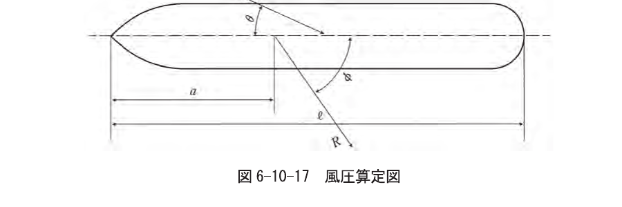

図 6-10-17 風圧算定図

b）風圧合力の作用点

$$
\frac{a}{\ell} = 0.291 + 0.0023\theta
\tag{式6-10-3}
$$

（記号については、図 6-10-17 を参照）

c）風圧合力の働く方向

$$
\phi = \left\{ 1 - 0.15 \left( 1 - \frac{\theta}{90} \right) - 0.80 \left( 1 - \frac{\theta}{90} \right)^3 \right\} \times 90
\tag{式6-10-4}
$$

③ 風速 $U$ は、最大風速（10 分間平均風速）を用いてよい。

**(5)** 作用の詳細は、構造形式に応じて「第6編 係留施設」の各章により定めることができる。波力、土圧、地震力については、「第2編 設計条件」によることができる。

### 10.4.3 利用性に関する性能照査

#### （1）位置の選定

特定目的岸壁及び必要施設の位置の選定にあたっては、他の周辺漁港及び港湾との関連に配慮するとともに、航路の性格、漁船等の航行や陸揚げ作業との交錯、背後地の道路交通事情等を考慮して定めることが望ましい。

#### （2）バース長及び水深

バース長及び水深は、就航する船舶の船型を調査のうえ、利用する船舶が安全かつ円滑に利用できるよう定めることを原則とする。

このとき、設計対象施設及び周辺施設での漁船の係留、漁業関係作業等について考慮することを原則とする。

バースの長さは、船舶の全長に船舶が横付け係留する際に必要となる延長を考慮して定めるのがよい。

フェリーを対象船舶とする場合で、対象船舶の船長又は満載喫水が明らかでない場合は、表 6-10-6 を参考として定めることができる 10)。

| 対象船舶（総トン） | 船首尾係船岸長（m） | バースの長さ（m） | バースの水深（m） |
|---|---|---|---|
| 400 | 20 | 60 | 3.5 |
| 700 | 20 | 80 | 4.0 |
| 1,000 | 25 | 90 | 4.5 |
| 2,500 | 25 | 130 | 5.5 |
| 5,000 | 30 | 160 | 6.5 |

表 6-10-6 特定目的岸壁のバース長さ及び水深

注）船首尾係船岸とは、フェリー等の船首または船尾が接岸する係船岸をいう。

また、必要泊地面積は、フェリー等の操船方法により異なるので、就航する船舶の船型、操船形態等を調査の上、定めることを原則とする。

なお、フェリーが横付け係留するときは、図 6-10-18 に示す係留索が必要である。このうち、船首索及び船尾索は、船舶の前後への移動の防止及び船舶を真横方向に支持するという両方の目的を兼用しているため、係船岸に対して 30〜45° の方向に張ることが多い。

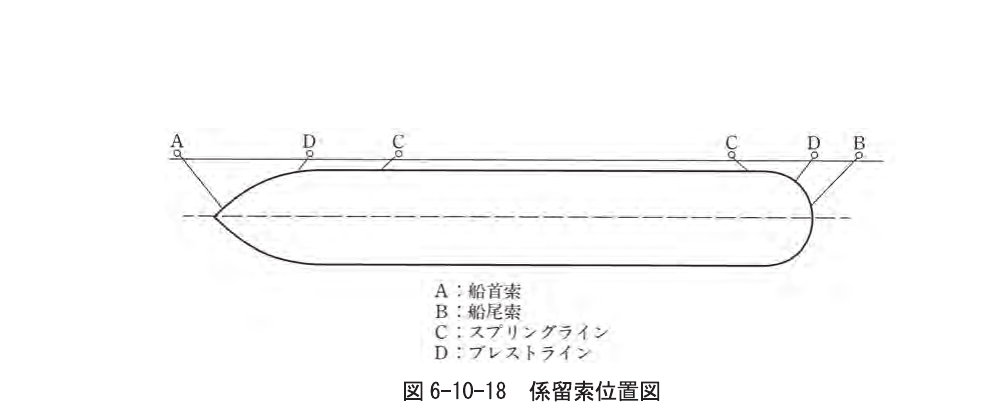

図 6-10-18 係留索位置図

#### （3）係船設備

係船設備は、係留形式及びその配置、施設の形状、利用船舶、風荷重等を考慮して設けることを原則とする。

#### （4）構造形式に関する配慮

比較的高齢者の割合が高い漁村住民の利用が多いため、ポンツーン形式を採用するなど、利用者の利便性や安全性に配慮した構造形式を採用することが望ましい。

### 10.4.4 構造物の安全性に関する性能照査

特定目的岸壁の構造物の安全性に関する性能照査については、構造形式に応じて「第6編 係留施設」の各章により定めることができる。

### 10.4.5 構造細目

#### （1）直柱及び曲柱

直柱及び曲柱に関する詳細は「第6編 10.1.5 係船柱・係船環」を参照できる。

#### （2）防衝設備

船舶の接岸及び係留時に、船舶及び係船岸が安全であるよう防衝設備を設けることを原則とする。防衝設備の照査は、以下の①〜②によることができる。

① 防舷材などの防衝設備は、船舶の接岸により生じる作用により照査する。

② フェリー等は、一般に船体防舷材を備えているのが普通である。このため、防衝設備は船体防舷材の上下移動範囲を考慮して取り付ける。

#### （3）洗掘防止工

流れ又はプロペラ等による洗掘の恐れがある場合は、係船岸前面に被覆工を設けることが望ましい。

係船岸前面では投錨する場合が多いことから、被覆工の範囲及び、いかりがかかりが悪くならないような適切な材料の選定についても注意するのがよい。

### 参考文献

1. 漁港漁場新技術研究会：漁港用ゴム防舷材の設計及び案内（第6版）（2019）
2. 日本道路協会：道路照明施設設置基準・同解説，丸善（2007）
3. 日本港湾協会：港湾の施設の技術上の基準・同解説，日本港湾協会（2007），pp.1184-1187
4. 佐伯公康・正呂地誠・松坂崇・穴井美緒・坪田幸雄・近藤健雄：漁港における照明設備に関する研究，平成 16 年度日本水産工学会学術講演会講演論文集（2004），pp.275-278
5. 染谷昭夫・藤森泰明・森繁泉：マリーナの計画，鹿島出版会（1988），p.120
6. 日本テトラポッド マリンレクリエーション研究会：ザ・マリーナ＆ビーチ，丘書房（1989），p.104
7. 染谷昭夫・藤森泰明・森繁泉：マリーナの計画，鹿島出版会（1988），p.119
8. 日本港湾協会：港湾の施設の技術上の基準・同解説，日本港湾協会（2007），p.410
9. 日本港湾協会：港湾の施設の技術上の基準・同解説，日本港湾協会（2007），pp.399-406
10. 日本港湾協会：港湾の施設の技術上の基準・同解説，日本港湾協会（2007），p.946
