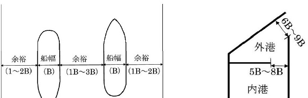
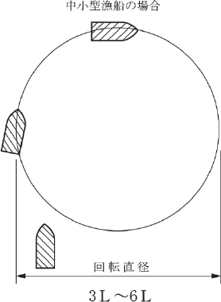
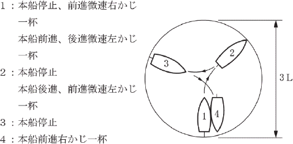
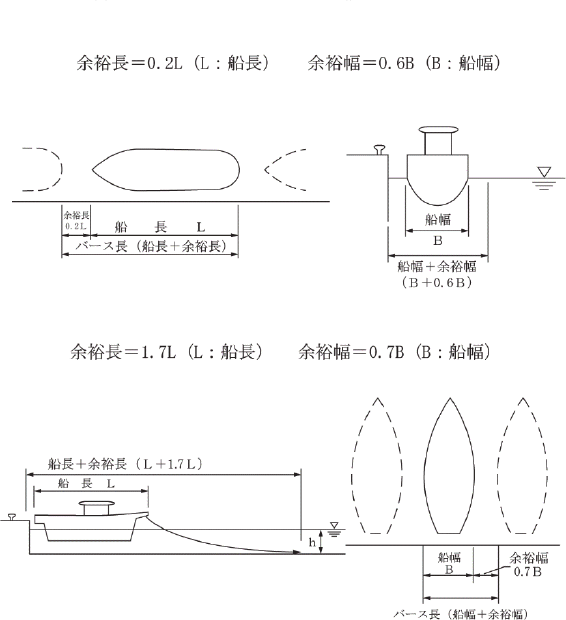

# 第7編 水域施設

## 第1章 水域施設の概要

### 1.1 水域施設の目的

> 水域施設の目的は、漁船を安全に入出港若しくは港内のある地区から他の地区へ移動させる又は漁船が操船、係留、錨泊などを行うとともに、漁具の安全で適正な管理を図ることを基本とする。

水域施設の設計においては、地形、海象、気象のほか利用漁船の諸元、既存施設の現状及び漁船以外の水面利用等を十分調査し、必要な幅、広さ、水深及び静穏度を確保するとともに、水深の保全についても十分配慮することを原則とする。

水域施設には、漁船の航行に利用される航路と、漁船の操船、係留、停泊等に利用される泊地、漁具管理水域がある。漁具管理水域とは、効率的な水産物の水揚げや台風・低気圧災害時の漁具の保全のため、養殖や蓄養用の筏等の漁具を漁船利用と相互に安全を確保しながら一時的に管理を行うことを可能とする静穏な水域である。

### 1.2 水域施設の要求性能

> 水域施設に共通する要求性能は、漁船その他の船舶及び漁具の利用状況に応じて、以下の要件を満たしていることとする。
>
> 1. 水域施設を利用する漁船その他の船舶の船型・隻数あるいは漁具の大きさ・台数及び管理方法、係留施設並びに漁港区域及び周辺の水域の利用状況を考慮し、適切なものとする。
> 2. 土砂の堆積により水域施設の機能が低下するおそれのあるときは、これを防止する措置を講じるものとする。

#### (1) 静穏度

水域施設の静穏度の良否は、地形条件のほか、外郭施設や係留施設の配置・構造等によって大きく異なるため、港内で発生する水理現象を十分に考慮して決定することが望ましい。また、必要に応じ外郭施設や係留施設の構造を消波構造とするかどうかについて検討するのがよい。

航路が使用可能な最大波高及び陸揚作業、出漁準備作業、休けいのための係留を行うことができる岸壁前面での最大波高について、表 7-1-1 の標準値を用いることができる。この標準値を利用するにあたっては各漁港における実態を考慮することが望ましい。

表 7-1-1 係留施設・水域施設の使用可能な最大波高

| 係船岸、泊地の水深 | -3.0m未満 | -3.0m以上 | 対象来襲波浪 |
|---|---|---|---|
| 航路が使用可能な最大波高 | 0.90m | 1.20m | 出漁限界波高 |
| 陸揚げ、準備が可能な最大波高 | 0.30m | 0.40m | |
| 休けい岸壁の使用が可能な最大波高 | 0.40m | 0.50m | 30年確率波 |

注）休けい岸壁の使用を検討する場合、基本的に30年確率波を用いることを原則とするが、荒天時に漁船を陸揚げしたり、他漁港へ避難させるなどの対応が想定される漁港の場合はこの限りではなく、利用実態等を踏まえ適切に対象来襲波浪の設定を行ってもよい。

漁港内の静穏度の検討は、漁港の周辺地形や形状を考慮しつつ、波の屈折、浅水変形、回折、反射、砕波、多方向性、不規則性等を考慮して静穏度解析を行うことが望ましい。なお、静穏度シミュレーションについては「第2編第3章　波」を参照し、適切な検討を行うことが望ましい。

港内副振動については、「第2編 2.5　副振動」を参照し、適切な検討を行うことができる。

#### (2) 土砂の堆積

地形的諸条件を考慮して漂砂の状況を調査し、施設の機能が著しく低下する場合には、防砂堤の設置など堆積を防止する措置を講じることを原則とする。

しゅんせつ工事は、しゅんせつ船等によって実施されることが多く、波浪等の海象条件や気象条件の影響を大きく受けるので、工事にあたってはこれらを十分把握する必要がある。特に潮位差の大きい箇所では、潮流が大きく、しゅんせつの作業性や精度に影響を与える場合がある。

しゅんせつ区域が漁場に近い場合、あるいは隣接した水面で蓄養や養殖等の利用がされている場合、作業中のにごり等が悪影響を与えることもあるので、必要に応じ汚濁の防止に努めることを原則とする。

しゅんせつによる発生土は、埋立・盛土等に再利用することが望ましい。再利用するにあたって、所定の強度等が得られない場合には安定化処理することが望ましい。

土砂の堆積を防止する措置としては、次に掲げるものがある。

① 防砂堤、導流堤等の外郭施設

② サンドポケット工法

サンドポケットとは、堆砂が予想される箇所を、あらかじめ十分深く掘っておく工法をいう。

③ サンドバイパス工法

サンドバイパス工法とは、漂砂の上手側に堆積した漂砂を下手側海岸に輸送する方法をいう。輸送方法としては、ポンプにより上手側海岸から下手側海岸に排砂する方法や、トラック等で運搬する方法等がある。

#### (3) 水質の保全

静穏度を確保することにより、泊地内の海水の循環が低下し、泊地等の水質が悪化する場合があるので、十分注意することが望ましい。泊地等における水質の保全のため、海水交換型防波堤を用いる場合は、「第5編 12.2　水域環境への配慮」を参照することができる。

## 第2章 航路

### 2.1 航路の要求性能

> 航路の要求性能は、漁船が安全かつ円滑に航行できるよう適切であることとする。

航路の設計においては、自然条件、利用漁船の諸元、漁場の位置等を十分考慮して航路の法線、幅員及び水深を決定することを原則とする。

漁港における航路は、砕波帯内が多いうえ、荒天時においても利用されることがあるので、航路の法線等の決定にあたっては細心の注意を払う必要がある。また、沿岸漂砂の卓越方向、河川の流下土砂量の程度にも配慮し、適正な保全対策を講じることが望ましい。

### 2.2 航路の性能規定

> 航路の性能規定は、以下に定めるとおりとする。
>
> 1. 航路の方向（法線）は、波、流れ、風等の影響及び周辺水域の利用状況等を考慮し、漁船の航行に支障を及ぼさないよう適切に配置されていること。
> 2. 航路の幅員は、利用漁船の長さ及び幅、波、流れ、風の影響等を考慮し、適切な諸元を有すること。
> 3. 航路の水深は、波、流れ、風等による漁船の動揺並びに漁船のトリム、海底地盤及び操船性を考慮し、利用する最も大きな漁船の吃水以上の適切な諸元を有すること。

航路の法線、幅員及び水深は、利用漁船の諸元、通行量、自然条件等を考慮して、常時、荒天時において漁船が円滑かつ安全に入出港できるように定めることを原則とする。

#### (1) 法線

① 航路の法線は、直線に近いことが望ましい。やむを得ず屈曲部を設ける場合は、急角度の屈曲を避けるとともに、屈曲部には横波、流れ、風等の変化、漁船の進行方向への蛇行等に対応が可能なよう、十分な余裕を設けること。

② 出入港時における見通しの良否についても十分な検討を講じる必要がある。

③ 航路上の屈曲部の交角は、漁船の最大舵角が通常30°程度であるため、概ね30°を超えないことが望ましい。また、屈曲部は、防波堤の遮蔽域内に設けること。

#### (2) 幅員

① 航路の幅員は港口の位置、方向と関連して、港内の静穏に重大な影響を及ぼすことがあるので、十分注意する必要がある。

② 航路の形状は漁場の位置の時期的変化、風、波等の影響から、一定の幅員をもつ帯状の形として決められない場合がある。

#### (3) 水深

航路の水深は、航路を航行する最も大きい漁船の喫水に、波による船の振動、船のトリム、海底地盤、操船の難易等を考慮した余裕値を加えることを標準とする。

なお、航路の計画水深は 0.5m ごとで表示する。

また、次の点について留意する必要がある。

① 幅員の考え方

航路幅員は、利用漁船の利用実態に応じ、適切に定めることが望ましい。利用実態の把握が困難な場合には、図 7-2-1 を参考に定めてもよい。

図 7-2-1 航路幅員の考え方

② 水深を定める際の余裕値

水深を定める際の余裕値は、一般に次の値としている場合が多い。

i）海底の地盤が硬質地盤の場合 1.0m 以上

ii）海底の地盤が軟弱地盤の場合 1.0m

また、荒天時において小型船が出入港を必要とする場合の余裕水深は、出漁限界波高の 2/3 程度を見込んでもよい。

## 第3章 泊地

### 3.1 泊地の要求性能

> 泊地の要求性能は、水面の利用状況に応じて、以下の要件を満たしていることとする。
>
> 1. 漁船が安全かつ効率的に利用できるよう適切なものとする。
> 2. 蓄養殖等の水面利用に供する場合は、それらの利用にも配慮するものとする。

泊地の設計においては、自然条件、利用漁船の諸元、蓄養殖等の水面利用等を考慮して、広さ、形状及び水深を定めることを原則とする。

泊地の設計にあたっては、安全な停泊、円滑な操船、陸揚げ、出漁準備等の作業を可能にするよう配慮する。

なお、泊地の保全は、「本編第2章　航路」に準じることを原則とする。

### 3.2 泊地の性能規定

> 泊地の性能規定は、以下に定めるとおりとする。
>
> 1. 泊地に許容される静穏度は、利用漁船の諸元及び利用状況に応じて適切に設定されること。
> 2. 泊地の広さ、形状及び水深は、利用漁船の諸元及び利用状況並びに蓄養殖等の水面利用を考慮して、適切な諸元を有すること。

泊地の広さ、形状及び水深は、利用漁船の諸元、利用状況、自然条件等を考慮して、常時、荒天時において漁船が円滑かつ安全な操船、係留が行えるよう定めることを原則とする。

(1) 泊地の広さ及び形状は、安全な係留、停泊及び操船ができるよう適切に設定するとともに、必要な静穏度を確保することを原則とする。

泊地の広さ、形状の決定は、図 7-3-1、図 7-3-2 及び図 7-3-3 を参考に定めてもよいが、利用船舶の大半を小型漁船が占める場合は利用実態に応じて適切に定めてもよい。

図 7-3-1 操船用水面として必要な面積の考え方（旋回）

図 7-3-2 操船用水面として必要な面積の考え方（船まわし）

図 7-3-3 係留用水面として必要な面積の考え方

(2) 泊地の水深は、岸壁、物揚場及び利用漁船の諸元、波やうねり等の影響を考慮し、必要な水深を確保することを原則とする。

## 第4章 漁具管理水域

### 4.1 漁具管理水域の要求性能

> 漁具管理水域の要求性能は、水面の利用状況に応じて、以下の要件を満たしていることとする。
>
> 1. 漁具の種類及び管理方法、周辺の施設を考慮して、適切なものとする。
> 2. 台風等荒天時に漁具を一時的に避難させる場合は、漁具を安全に管理できるよう適切なものとする。

漁具管理水域の保全は、「本編第2章　航路」に準じることを原則とする。

### 4.2 漁具管理水域の性能規定

> 漁具管理水域の性能規定は、以下に定めるとおりとする。
>
> 1. 漁具が漁船の航行及び他の水域利用に影響を及ぼさないよう、適切に配置され、かつ、所要の諸元を有すること。
> 2. 漁具管理水域の広さは、漁具の長さ及び幅、波、流れ、風の影響等を考慮し、適切な諸元を有すること。
> 3. 漁具管理水域の水深は、波、流れ、風等による漁具の動揺を考慮し、漁具の深さ以上の適切な諸元を有すること。
> 4. 漁具に水産動植物が存在する場合、漁具管理水域の水質は、水産動植物に負荷をかけないよう、適切に設定すること。
> 5. 台風等荒天時に一時的に漁具を移動させて適切な管理ができるよう、静穏な水域に配置すること。

漁具管理水域の広さは、養殖筏等の漁具が他の施設と衝突しないように施設の安全上の観点から、筏の周辺に余裕のスペースを確保することを原則とする。

漁具管理水域の水深は、波、流れ、風等による漁具の動揺を考慮して、漁具が海底に接触しないように漁具の安全上の観点から、漁具の深さ以上に余裕の深さを確保することを原則とする。

漁具管理水域の使用可能な最大波高は、漁具における作業内容を踏まえて、係留施設・水域施設の使用可能な最大波高（表 7-1-1）を参考とすることができる。
