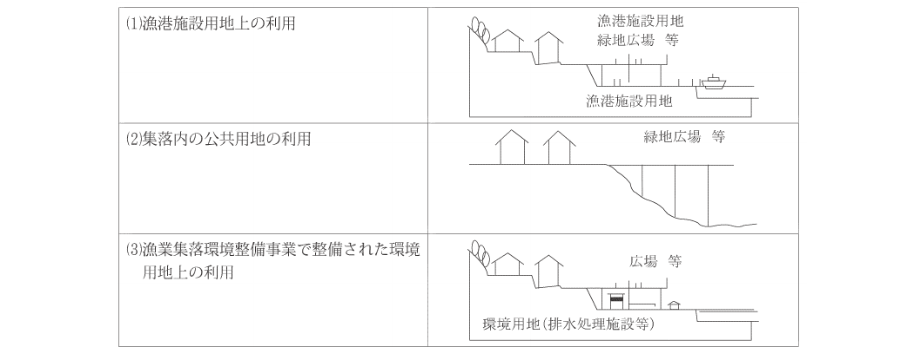
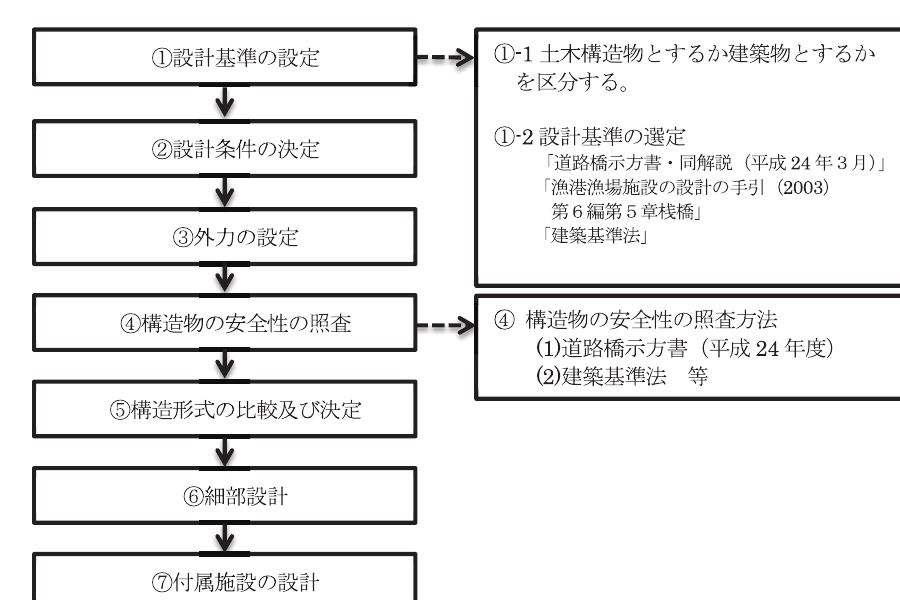
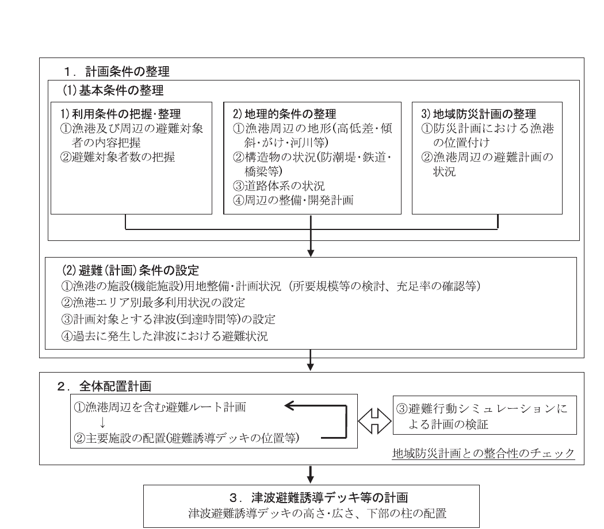
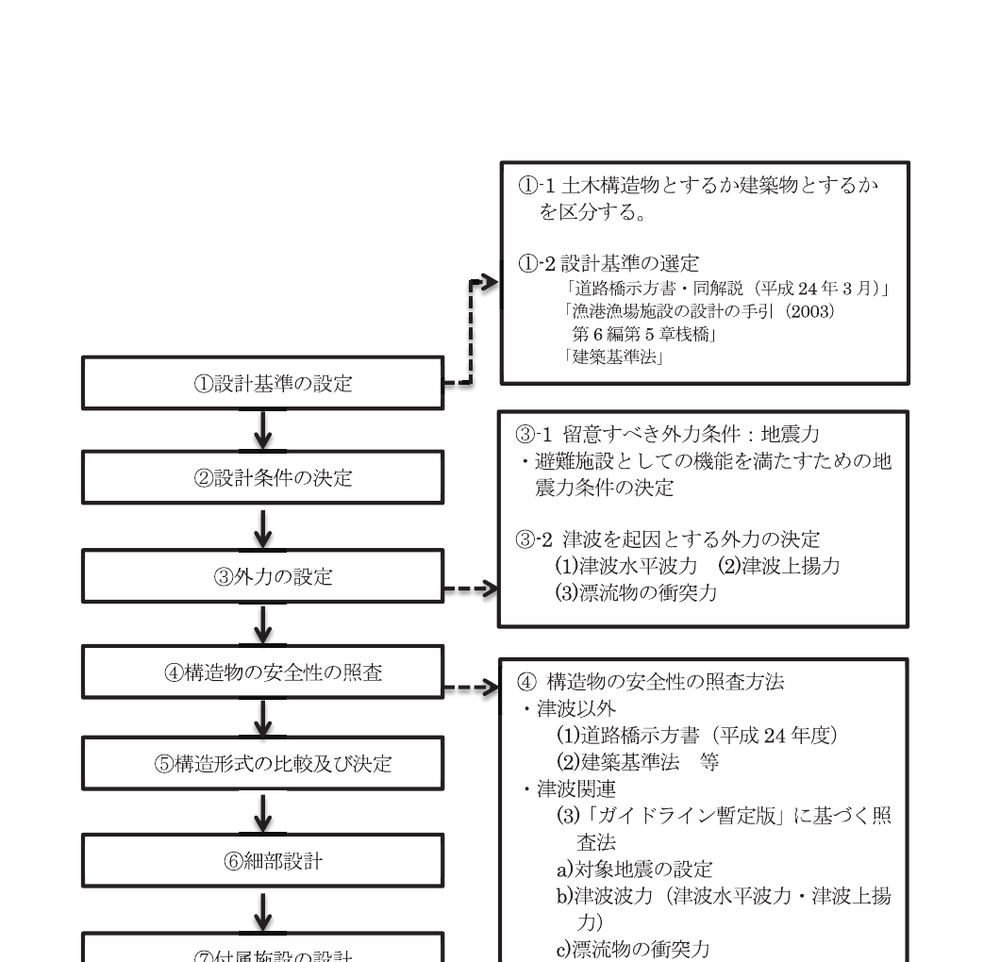
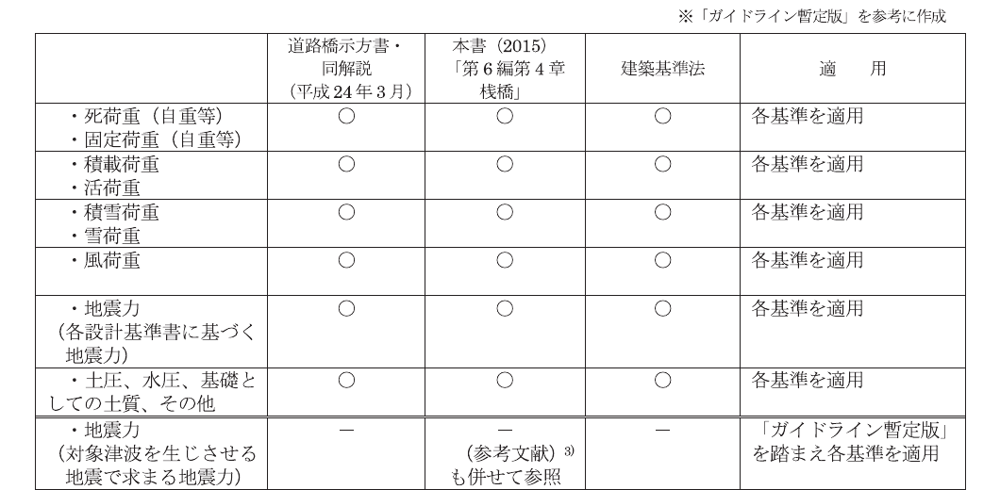

# 第9編 漁港施設用地

## 第1章 漁港施設用地に関する総論

### 1.1 漁港施設用地の目的

> 漁港施設用地の目的は、漁港内で行われる漁業活動に供することを基本とする。

漁港施設用地は、漁港の施設の利用形態、将来あるべき姿を十分把握して、規模、配置等を定めることを原則とする。

漁港施設用地は、漁業活動に供される漁港内の用地であって、「漁港漁場整備法」第3条に掲げる漁港施設の敷地である。

漁港施設用地の主なものに次に掲げる用地がある。

1. 荷さばき所用地
   漁獲物の選別、計量、取引等の作業が行われる施設のための用地
2. 製氷、冷凍及び冷蔵施設用地
   漁獲物の鮮度保持のため、氷を製造、貯蔵する施設及び低温状態で保管する施設のための用地
3. 給油施設用地
   漁船に燃料油を供給するために設けられる給油及び貯油施設のための用地
4. 野積場用地
   漁業活動を円滑にするため、漁具、荷さばき資材等の仮置きに使用される用地
5. 漁具保管修理施設用地
   漁具の保全作業のため漁具倉庫、漁具干場に使用される用地
6. 漁港浄化施設用地
   公害防止のための導水施設やその他の浄化施設のための用地

このほか、加工場用地、水産倉庫用地、蓄養施設用地、漁船保管施設用地、漁船修理場用地、駐車場用地、給水施設用地、給氷施設用地、給電施設用地、水産種苗生産施設用地、養殖用餌料保管調整施設用地、養殖用作業施設用地、漁港環境整備施設用地、漁港厚生施設用地、漁港管理施設用地、船舶保管施設用地、漁業用通信施設用地、廃油処理施設用地等がある。

## 第2章 漁港施設用地

### 2.1 漁港施設用地の要求性能

> 漁港施設用地に共通する要求性能は、対象用地の用途に応じて、以下の要件を満たしていることとする。
>
> 1. 設計対象用地の用途並びに隣接用地及び周辺用地の利用状況を考慮して、安全かつ円滑な利用ができるよう適切なものとする。
> 2. 用途及び利用状況に応じた載荷重等に対して、安全なものとする。

### 2.2 漁港施設用地の性能規定

> 漁港施設用地に共通する性能規定は、以下に定めるとおりとする。
>
> 1. 自然条件、利用状況、周辺の状況、環境、習慣等に配慮して、漁港における活動を機能的、かつ合理的に行えるよう適切に配置され、かつ、所要の諸元を有すること。
> 2. 用地内に雨水等を滞留させないための適切な排水設備を有すること。

### 2.3 利用性に関する性能照査

#### 2.3.1 漁港施設用地の利用計画

漁港施設用地は、「漁港漁場整備法」第3条に掲げる漁港施設の敷地である。

#### 2.3.2 規模と配置

規模と配置は、自然条件、利用形態、環境保全等に配慮して、各漁港の施設の機能が十分発揮できるよう定める。

漁港施設用地の規模（面積、地盤高等）と配置については、漁港により自然条件、利用形態、周辺の状況、求められる環境、地域の習慣等が異なっており、一義的に定めることは困難であることから、各漁港の実情及び予想される将来の状況に即して定め、漁港における活動を機能的かつ合理的に行えるよう定める。

併せて、地域住民の生活環境の向上、都市住民との交流を図るとともに地域の活性化を促進するため、関係機関、関係者の意見及び周辺地域の利用状況、交通状況等を十分に踏まえ、これらと整合を図る必要がある。

**(1) 用地の面積**

漁港施設用地の面積は、各漁港の施設の機能が十分に発揮できる広さのほか、漁港及び背後集落の環境保全や将来の漁業情勢の変化等を考慮して広さを決定する。

**(2) 用地の地盤高**

漁港施設用地の地盤高は、護岸、岸壁等の水際線構造物の高さ、背後地の高さ、流入河川及び水路の高さ等を十分に調査し、適正な排水系統の確保、高潮等に対する安全性の確保等のほか、漁港利用が円滑に行われるよう決定する。

**(3) 用地の配置**

用地の配置は、必要とする漁港施設並びに関連施設との相互間の関連等を十分考慮するほか、環境保全等についても配慮して決定する。

なお、用地の配置計画は、漁港建設後における漁港管理上の問題にも重要な影響を与えるので、慎重に検討する必要がある。

**(4) 用地の表面処理**

越波等により用地が洗掘を受ける場合や、防塵処理を行う必要がある場合は、用地を簡易舗装、砂利舗装及び種子吹き付け等により、表面処理を行う。

## 第3章 人工地盤

### 3.1 人工地盤の要求性能

> 人工地盤の要求性能は、設計対象施設の重要度及び用途に応じて、以下の要件を満たしていること。
>
> 1. 設計対象施設を設置する用地、隣接用地及び周辺用地の利用状況を考慮して、安全かつ円滑な利用ができるよう適切なものとする。
> 2. 自重、載荷重、レベル1地震動等の作用に対して構造上安全なものとする。
> 3. 耐震性能を強化する施設にあっては、レベル2地震動によって構造物に発生する損傷が限定的なものにとどまり、軽微な補修により早期に機能が回復できるものとする。
> 4. 耐津波性能を強化する施設にあっては、設計津波に対して構造上安全なものとする。

広義の意味では「人工的に創られた土地」1)を指し、埋立地や杭式桟橋も人工地盤といえるが、ここでいう人工地盤とは、構造物による空間の用地的利用であり、限られた土地の重層利用や傾斜地等の利用不可能な土地の空間に、用地を創出し利用を図る構造物を指す。

人工地盤は、漁港施設用地として以下の役割を担う性能を有する。

**(1) 用地不足の解消**

背後地が狭隘又は傾斜地のため利用できる用地が少ない漁港や漁業集落において、用地の利用目的を達成する位置に用地の確保が困難な場合、土地の空間を利用し、新たな用地を創出するもの。

**(2) 災害時の防災機能の確保**

背後地が狭隘で密集している漁村に、津波・高潮や火災が発生し迅速に避難する高台や用地がない場合、避難広場として創出するもの。

表 9-3-1 人工地盤の設置位置と利用形態の例

人工地盤は以下の要求性能を満足するものとする。

- 自重、載荷重及びレベル1地震動等の作用に対して構造上安全であること。

人工地盤のうち、耐震対策を強化する施設にあっては、上記に加え、以下の要求性能を満足するものとする。

- レベル2地震動によって構造物に発生する損傷が限定的なものにとどまり、軽微な補修により早期に機能が回復できること。

人工地盤のうち、耐津波性能を強化する施設にあっては、以下の要求性能を満足するものとする。

- 設計津波に対して構造上安全であること。

### 3.2 人工地盤の性能規定

> 人工地盤の性能規定は、以下に定めるとおりとする。
>
> 1. 自重、レベル1地震動、載荷重等の作用に対して、構造及び部材が所要の安全性及び耐久性を有すること。
> 2. 避難誘導施設としての人工地盤にあっては、自重、載荷重、設計対象とする地震動、設計津波、漁船の衝突等の作用に対して、構造及び部材が所要の安全性及び耐久性を有すること。

#### 3.2.1 安全性に関する性能照査

人工地盤の設計においては、漁港の施設の機能、自然条件、利用条件等を考慮し、構造上安全性、利用上支障のないようにする。

人工地盤の性能照査の検討手順を次図に示す。

図 9-3-1 人工地盤の設計フロー図

設計を行うにあたって、人工地盤を建築物とするか土木構造物とするか区分する必要がある。

建築基準法上の建築物とは、「土地に定着する構造物のうち、屋根及び柱若しくは壁を有するもの（これに類する構造のものを含む。）、これに付属する門若しくは塀、観覧のための工作物又は地下若しくは高架の工作物に設ける事務所、店舗、興業場、倉庫その他これに類する施設（鉄道及び軌道の線路敷地内の運転保安に関する施設並びに跨線橋、プラットホームの上家、貯蔵槽その他これに類する施設は除く。）をいい、建築設備を含むものとする。」（建築基準法第2条第1項第1号）としている。

すなわち、人工地盤が屋根としての機能を有するか否かにより区分される。

前記の表 9-3-1 の例に掲げる(2)の場合は、集落内の傾斜地に人工地盤を設置するため、下層部の利用がなく人工地盤自体に屋根としての機能がないため土木構造物となる。また、(1)と(3)の場合は、下層部を野積場、駐車場等の漁港施設用地として利用し人工地盤自体に屋根としての機能を有するため建築物となる。

これらの判断は、建築部局と協議のうえ、決定する。

これにより、人工地盤の性能照査に当たっては、土木構造物とする場合については、「第6編第4章桟橋」又は「道路構造令」「道路橋示方書」に準じ、建築物とする場合は「建築基準法」に準じる。

また、人工地盤の性能規定は、自重、レベル1地震動、載荷重等の作用に対して、構造及び部材が所要の安全性及び耐久性を有していることであり、図 9-3-1 に示す手順で検討を行うが、人工地盤のうち、重点的に地震・津波対策の強化を行うべき漁港の施設である「地域防災計画等に位置づけられた防災上重要な漁港（「防災拠点漁港」）」、「圏域計画における水産物生産・流通拠点漁港」に付随する人工地盤、津波避難誘導デッキ等については、「本編第3章　3.2.2 避難誘導施設としての人工地盤（津波避難誘導デッキ）」に準じる。

#### 3.2.2 避難誘導施設としての人工地盤（津波避難誘導デッキ）

**(1) 津波避難誘導デッキの性能照査の基本**

津波避難誘導デッキとは、漁港の通常利用において不足する漁港施設用地を確保する目的で整備される人工地盤を活用した津波避難誘導施設である。ここで、津波避難誘導施設とは、漁港から堤内の高台等の避難場所に向けて、目標時間内に避難が完了するように誘導する施設を指す。

津波避難誘導デッキは、漁港を利用する人々が津波から迅速かつ安全に避難するためのルートの一部を形成する施設であり、さらには、漁港の施設としての通常利用を主目的とするため、漁港の施設の必要性を確認した上で計画を策定することが望ましい。

**(2) 津波避難誘導デッキの利用性に関する性能照査**

津波避難誘導デッキは、「漁港の津波避難に関するガイドライン（津波避難誘導デッキの計画・設計）【暫定版】」2)（以降「ガイドライン暫定版」とする）に準じる。

津波避難誘導デッキの規模と配置の検討手順は次図によることができる。

図 9-3-2 津波避難誘導デッキの計画フロー図

**(3) 津波避難誘導デッキの安全性に関する性能照査**

津波避難誘導デッキの性能照査にあたっては「ガイドライン暫定版」を参照する。津波避難誘導デッキの性能照査の検討手順は次図によることができる。

図 9-3-3 津波避難誘導デッキの設計フロー図

**① 設計基準の設定**

土木構造物・建築物の判断は、建築担当部局と協議のうえ、決定する。（ただし、津波避難誘導デッキは、用地の造成を目的とした漁港の施設（公共施設）であり、津波・地震等自然災害発生時に避難路としての機能を満足する必要がある。）

設計条件は、土木構造物・建築物の区分に応じ、土木構造物として設計する場合については、「道路橋示方書」（平成24年度）を参照し、建築物として設計する場合は「建築基準法」を参照することができる。ただし、地震力については、「ガイドライン暫定版」に基づく考え方を踏まえて適切に設定することができる。

津波を起因とする外力の設計条件は、「ガイドライン暫定版」に基づく考え方を踏まえて適切に設定する。

**② 設計条件の決定**

津波避難誘導デッキの設計条件は、自然条件、経済的・社会的条件、自然環境に及ぼす影響、工事や施設の維持管理に係る経済性等を考慮して、施設の安全性と機能が確保されるよう適切に定める。

**③ 外力の設定**

津波避難誘導デッキに作用する外力には、地震力、上載荷重、風力や津波を起因とする津波水平波力、津波上揚力、漂流物の衝突力等があり、選定した施設の構造断面に応じた必要な外力を選定する。

表 9-3-2 津波避難誘導デッキの設計荷重・設計外力

**④ 構造物の安全性の照査**

各仮定構造断面の安定計算を行うが、構造断面が決定されるまでには、一般に、通常数回に及ぶトライアル計算が必要となる。

**⑤ 構造形式の比較及び決定**

①から④の結果を踏まえて、構造の特徴や経済性（工費）、維持管理性、施工性、実績（人工地盤・津波避難誘導デッキ等）を検討項目として総合的に評価し、適切な断面を決定する。

**⑥ 細部設計**

決定された構造断面について、部材等の細部設計を行う。

**⑦ 付属施設の設計**

階段、手すり、照明等、利用上及び安全上必要な付属施設の設計を行う。

### 参考文献

1) 鋼材倶楽部：都市開発と人工地盤，人工地盤研究(1980)，pp.14・15
2) 漁港からの津波避難に関する専門部会：漁港からの津波避難に関するガイドライン（津波避難誘導デッキの計画・設計）【暫定版】(2014)
3) 水産庁漁港漁場整備部整備課：平成23年東日本大震災を踏まえた漁港施設の地震・津波対策の基本的な考え方(2014)
