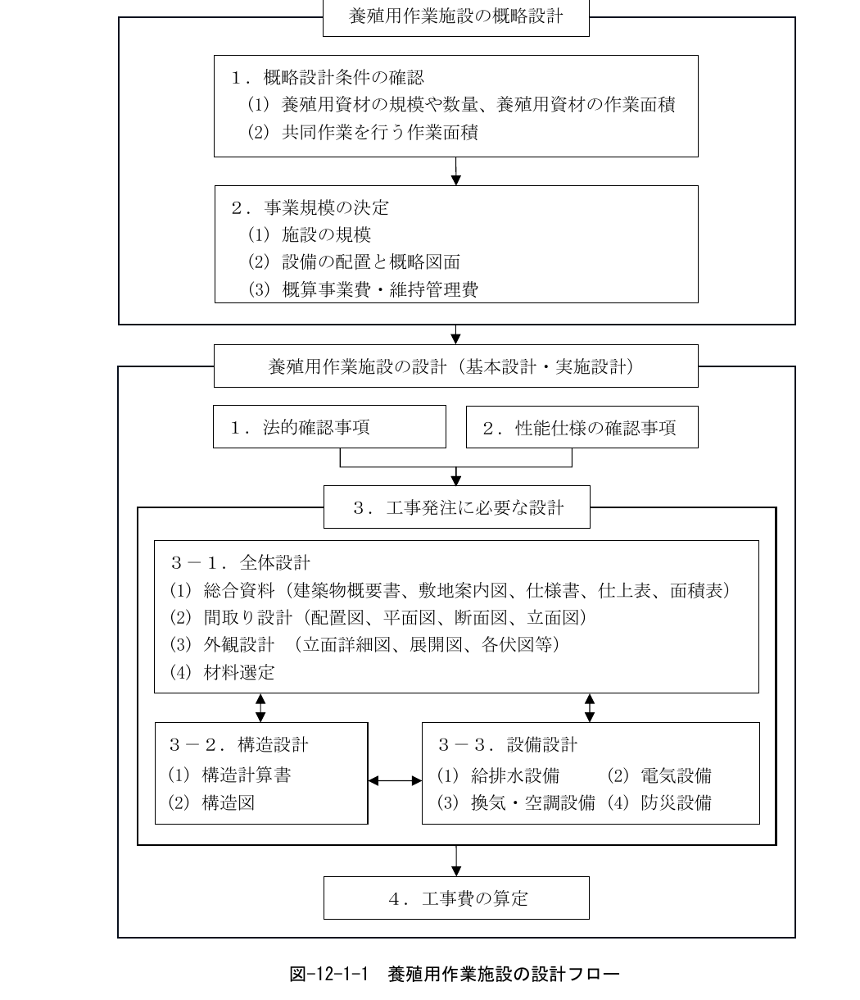

# 第12編 養殖用作業施設

## 1 養殖用作業施設の目的

> 養殖用作業施設の目的は、養殖用の資材の補修、組立、稚貝の選別、掃除などの共同作業などに使用することを基本とする。

## 2 養殖用作業施設の要求性能

> 養殖用作業施設の要求性能は、対象施設の利用状況及び構造・設備形式に応じて、以下の要件を満たしていることとする。
>
> 1. 養殖用の資材、稚貝の種類、共同作業の種類、作業環境や安全性を考慮して、適切なものとする。
> 2. 養殖用作業施設の利用状況に応じた作用に対して、構造上安全なものとする。

## 3 養殖用作業施設の性能規定

> 養殖用作業施設の性能規定は、以下に定めるとおりとする。
>
> 1. 養殖用資材の規模や数量、稚貝の種類、共同作業の作業内容や作業面積、作業環境や安全性を考慮して適切に配置され、かつ、所要の諸元、必要な設備機能を有すること。
> 2. 養殖用作業施設の構造及び設備等は、建築基準法（昭和25年法律第201号）等の関連法規に準じていること。

## 4 養殖用作業施設における設計条件の設定

養殖用作業施設の設計は、図-12-1-1の設計フローのように、概略設計で事業規模を定め、設計で法的な確認事項と発注者が求める性能仕様を決定し、実際に工事発注ができる図面を作成し工事費の算定まで行う。

図 12-1-1 養殖用作業施設の設計フロー

## 5 関連法令等

本編策定において遵守すべき法令等を以下に示す。

［法令等］

- 建築基準法・同施行令・同施行規則
- 消防法・同施行令・同施行規則
- 改正省エネ法・同施行令・同施行規則（エネルギーの使用の合理化及び非化石エネルギーへの転換等に関する法律）
- 電気事業法・同施行令・同施行規則

## 6 全体設計

全体設計は、建物の間取りや外観の設計、材料の選定を行うだけでなく、構造設計や設備設計と連携を取り、建物の建築方針を決定する。

配置図や平面図、断面図、立面図を作成して建物の間取りを設計し、立面詳細図や展開図、各伏図等により建物の外観を示し、建築物概要書や敷地案内図、仕様書、仕上表、面積表等、建物の基本的な情報を整理する。

## 7 構造設計

施設の構造設計では、施設の概略設計を踏まえ、建物の間取りや外観の設計、材料の選定を行うだけでなく、構造設計や設備設計と連携を取り、建物の建築方針を決定する。

### 7.1 構造の選定

養殖用作業施設の構造設計では、施設内に養殖資材や選別台等の機材を設置することから十分なスペースを確保するため、現在では鉄骨造スレート葺の構造が多い。過去には、建築材の耐用年数の確保の観点から鉄筋コンクリート造の施設が多かったが、鉄骨材も十分な塗装をすれば耐久性が確保可能である。

各構造の特徴を以下に示す。

#### ① 鉄骨造

- a）部材強度が大きく、耐震性に優れ、部材断面が小さい。
- b）鉄筋コンクリートに比べ、広いスパンを構築できる。
- c）工場加工のため、他の構造に比べると工期が短縮できる。
- d）鋼材はさび易いため、防錆処理が必要である。
- e）鋼材は火災に対し弱いため、耐火被覆が必要である。
- f）部材断面が小さいため、たわみが大きく、振動・座屈が生じやすい。

#### ② 鉄筋コンクリート造

- a）耐火性に優れている。
- b）部材の剛性が大きいので、建築物の変形や振動が他の構造物に比べて少ない。
- c）温度・湿度・音・放射線等に対する遮断性が大きい。
- d）耐久性が大きく、耐用年数が長い。
- e）経済的なスパン長が鉄骨に比べ短い。
- f）柱配置はできるだけ均等なスパンとする。
- g）鉄筋の被覆が少ないと塩害等を受ける。

### 7.2 柱・梁の検討

#### (1) 柱の配置

柱の配置は、経済性を考慮して、平面的に均等な配置とすることを原則とする。

ただし、空間を構成する柱は、設備等の設置に支障となる場合には、平面設計では利用面と構造面を考慮し、柱を配置することが望ましい。

#### (2) 梁の検討

梁の配置は、大梁と小梁から構成される。経済的に大梁を計画するには、連続梁として配置されるよう考慮することが望ましい。

### 7.3 基礎の検討

施設は海に近い埋立地に計画する場合が多いため、基礎の検討では、地盤の性状や地耐力等を十分に考慮し、建物の安全性・安定性を検討することを原則とする。

### 7.4 屋根の検討

施設は海に近い用地に計画することが多いため、建物の海側が解放されている場合には、吹き上がりの風を考慮し、建物の安全性を検討することが望ましい。

### 7.5 環境への配慮

設計では、関連法令を踏まえ、近隣施設と環境調和に配慮し、色彩形状に留意することを原則とする。

## 8 設備設計

施設の設備設計では、基本設計を踏まえ、設置される設備の機能が十分に発揮されるよう設計することが望ましい。

### 8.1 設備の概要

養殖用作業施設に設けられる設備のうち、特徴的なものを以下に掲げる。

- (1)　給排水設備
- (2)　電気設備
- (3)　換気・空調設備
- (4)　防災設備

### 8.2 給排水設備

#### (1) 給水設備

給水設備とは、施設内で使用する用水を供給する設備である。給水能力は、用水の使用量を給水に必要な時間で除した単位時間当たりの給水量から決定することができる。

#### (2) 排水設備

排水設備とは、施設内で発生した廃水を施設外へ排水する設備である。排水能力は、単位時間当たりの排水量から決定されるが、排水量がほぼ給水量と同じと考えられる場合には、給水量を排水にかかる時間で除した単位時間当たりの排水量から決定することができる。稚貝の選別や施設の掃除等に用いられた廃水には、海水や稚貝、養殖用資材から発生するごみ等が混じるため、スクリーン等により事前にごみを除去するなどの処理を行う。

### 8.3 電気設備

電気設備とは、施設内で電気を利用するための設備であり、照明設備や動力設備等がある。電気容量は、照明及び動力等の設備の同時使用を考慮して算定する。塩水や水掛かり部分の材質や構造、設置位置には感電や漏電事故がないよう設計するとともに、腐食を防止する措置を講じる。

### 8.4 換気・空調設備

換気・空調設備とは、適切な室温等を保持するための設備である。

### 8.5 防災設備

防災設備とは、地震や津波、火災、停電等の災害発生時に、災害の早期発見と被害を最小限に抑えるための設備であり、消火設備、火災報知設備、非常照明設備等がある。

## 9 材料選定

沿岸部に建つ施設であること、及び、海水を使用する施設であることを踏まえ、耐久性、施工性、経済性等を考慮して選定する。

### 9.1 養殖用作業施設の設計における材料の特徴

沿岸部では、塩害、飛砂と強風、及び湿気に注意し、特に、塩害については、金属類の錆の問題となるため、外壁材、屋根材、空気に直接触れる外装部分、水掛かりの部分等に注意が必要である。併せて、海水等の水が掛かる部分には、材料の選定に注意すること。
