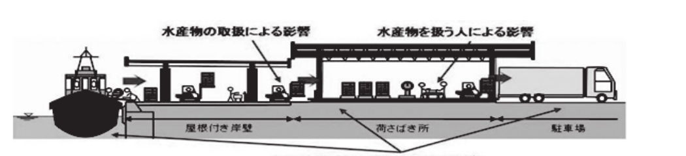
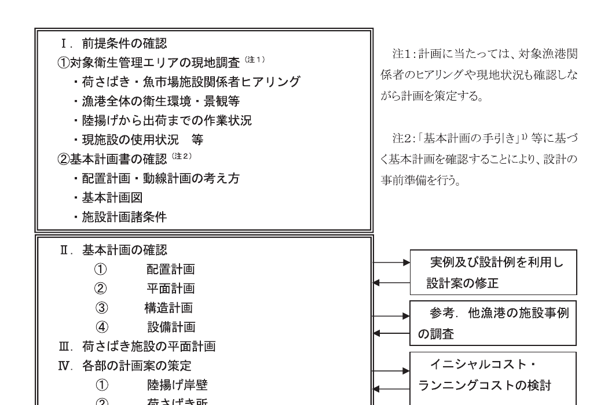

# 第13編 荷さばき所

## 第1章 荷さばき所に関する総論

### 1.1 荷さばき所の目的

> 荷さばき所の目的は、水産物の陸揚げから出荷までの一連の作業を安全かつ効率的に行うことを基本とする。

図 10-1-1 衛生管理型荷さばき所イメージ

### 1.2 荷さばき所の要求性能

> 荷さばき所の要求性能は、対象施設の利用状況及び構造・設備形式に応じて、以下の要件を満たしていること。
>
> 1. 水産物の陸揚げ方法、荷さばき所の利用状況、周辺の関連施設等との一体性を考慮して、適切なものとする。
> 2. 荷さばき所の利用状況に応じた作用に対して、構造上安全なものとする。

### 1.3 荷さばき所の性能規定

> 荷さばき所の性能規定は、以下に定めるとおりとする。
>
> 1. 水産物の量・種類及び取扱形態等の利用状況、清浄海水供給施設、製氷冷蔵施設、排水処理施設及び水産加工場等の関連施設との作業動線を考慮して適切に配置され、かつ、所要の諸元、必要な設備機能を有すること。
> 2. 荷さばき所内の利用状況に応じて要求される衛生管理レベルを保持できるよう適切に平面が構成され、所要の諸元及び必要な設備機能を有すること。
> 3. 荷さばき所の構造及び付帯設備等は、建築基準法（昭和 25 年法律第 201 号）等の関連法規に準ずるとともに、食品衛生法（昭和 22 年法律 233 号）に基づき都道府県が定める施設基準（条例）に準じていること。

荷さばき所の配置計画では、「地域水産総合衛生管理対策基本計画策定の手引き」（平成 17 年 3 月 水産庁漁港漁場整備部）1)（以下、「基本計画の手引き」という）等に基づいた基本計画に示される内容を把握し、岸壁・用地と道路の関係、用地の形状、水産物と作業者及び買受人などの衛生管理エリア内の動線について、交差汚染を防ぐよう考慮することを標準とする。

荷さばき所の平面計画では、基本計画、配置計画を踏まえ、岸壁から搬出までの水産物、作業者及び買受人などの衛生品質管理区画及びその周辺の作業工程について、高度なレベルの衛生品質管理を考慮し、各施設の形状・大きさと位置、相互の序列や動線、出入口等を計画することを標準とする。

なお、衛生品質管理型荷さばき所の計画、設計及び工事監理を行う場合、「漁港における衛生管理基準について」（平成 20 年 6 月 12 日　水産庁漁港漁場整備部長通知）2) 等の専門的な知識が必要なことから、選定にあたり、公正かつ高度な知識を有する機関・組織を参加させることが有効である。

荷さばき所を設置する際、法的な構造及び機能については、「食品衛生法」（昭和二十二年法律第二百三十三号）、「建築基準法」（昭和 25 年法律第 201 号）、「消防法」（昭和 23 年法律第 186 号）、「都市計画法」（昭和 43 年 6 月 15 日法律第 100 号）、「卸売市場法」（昭和 46 年 7 月 1 日施行）、「食品衛生法に基づく都道府県等食品衛生監視指導計画等に関する命令」（平成 21 年 8 月 28 日内閣府・厚生労働省令第七号）及び地方卸売市場条例の規定に適合していることとする。

### 1.4 荷さばき所における設計条件の設定

荷さばき所における衛生品質管理の設計に当たり必要となる「前提条件の確認」、「基本計画の確認」、「平面計画」、「各施設・設備の設計」の考え方、留意点等を図 10-1-2 に示す。

図 10-1-2 荷さばき施設の設計条件設定手順

#### 1.4.1 関連法令等

本編策定において遵守すべき法令等並びに参考となる図書等を以下に示す。

［法令等］

- 建築基準法・同施行令・同施行規則
- 食品衛生法・同施行令・同施行規則・卸売市場法・同施行令・同施行規則

［参考図書等］

- 対 EU 輸出水産食品の取扱要領（平成 26 年 6 月　厚生労働省医薬食品局食品安全部／農林水産省消費・安全局／水産庁）
- 平成 22 年度 水産物フードシステム品質管理体制構築推進事業　優良衛生品質管理市場・漁港認定基準／優良衛生品質管理市場・漁港認定基準チェックシート／チェックシートの使用方法／優良衛生品質管理市場・漁港認定基準の解説（平成 22 年 6 月　社団法人 大日本水産会）
- 省エネルギー衛生管理技術導入ガイドライン（平成 22 年 3 月　財団法人漁港漁場漁村技術研究所）
- 省エネルギー衛生管理技術導入ガイドライン（平成 23 年 3 月　財団法人漁港漁場漁村技術研究所）
- 技術資料 清浄海水導入施設及び漁港浄化施設（汚水処理）（平成 15 年 7 月 財団法人漁港漁村建設技術研究所／漁港漁場新技術研究会　衛生管理研究部会）
- 建築設計資料集成（日本建築学会　編　丸善出版（株））
- 建築学大系（1963 年　建築学大系編集委員会 編　（株）彰国社）
- 新営一般庁舎面積算定基準（国土交通省）

### 1.5 構造計画

施設の構造計画では、基本計画、配置計画及び平面計画を踏まえ、岸壁の構造や埋立地の特性なども考慮し、安全で安定した構造を計画することを標準とする。

#### 1.5.1 構造の選定

荷さばき施設の構造計画では、展示・販売（競り）などの作業に支障がないように、無柱の広い作業スペースを確保するため、鉄骨又は鉄筋コンクリートラーメン構造とすることが多い。

各構造の特徴を以下に示す。

① 鉄骨ラーメン構造

a）部材強度が大きく、耐震性に優れ、部材断面が小さい。

b）鉄筋コンクリートに比べ、広いスパンを構築できる。

c）工場加工のため、他の構造に比べると工期が短縮できる。

d）鋼材はさび易いため、防錆処理が必要。

e）鋼材は火災に対し弱いため、耐火被覆が必要。

f）部材断面が小さいため、たわみが大きく、振動・座屈が生じやすい。

② 鉄筋コンクリートラーメン構造

a）耐火性に優れる。

b）部材の剛性が大きいので、建築物の変形や振動が他の構造に比べて少ない。

c）温度・湿度・音・放射線などに対する遮断性が大きい。

d）耐久性が大きく、耐用年数が長い。

e）経済的なスパン長が鉄骨に比べて短く、6～8m 程度。負担床面積は 35～40m2 程度。

f）柱配置は出来るだけ均等なスパンとする。

g）鉄筋の被覆が少ないと塩害等を受ける。

なお、大規模な建物で無柱の荷さばき所を計画するような場合、鉄骨造の特殊構造や鉄骨と鉄筋コンクリート造複合構造、又は PC（プレストレストコンクリート）造も採用検討の範囲となる。

#### 1.5.2 柱・梁の検討

##### (1) 柱の配置

柱の配置は、経済性を考慮して、平面的に均等な配置とすることを原則とする。

ただし、空間を構成する柱は、荷さばき作業等に支障になることから、平面計画では十分考慮し、柱を配置することが望ましい。

##### (2) 梁の検討

梁の配置は、大梁と小梁から構成される。経済的に大梁を計画するには、連続梁として配置されるよう考慮することが望ましい。

#### 1.5.3 基礎の検討

施設は海に面した埋立地に計画する場合が多いため、基礎の検討では、地盤の性状や地耐力等を十分に考慮し、建物の安全性・安定性を検討することを原則とする。

#### 1.5.4 屋根の検討

施設は海に開放された用地に計画することが多いため、荷重を算定する場合、特に吹き上がりの風の検討を行い、建物の安全を図ることが望ましい。

#### 1.5.5 環境への配慮

荷さばき施設の設計では、関係法令を踏まえ、近隣施設と環境調和に配慮し、色彩形状等に留意することを原則とする。

### 1.6 設備計画

施設の設備計画では、基本計画、配置計画、平面計画を踏まえ、衛生品質管理上支障の無いよう、また、設置される設備の機能が十分に発揮されるよう計画することが望ましい。

#### 1.6.1 設備の概要

荷さばき施設に設けられる設備の内、特徴的なものを以下に挙げる。

① 給排水・衛生設備

② 電気設備

③ 換気（空調）設備

また、荷さばき施設の付属施設として

① 給水施設

② 排水施設

③ 廃棄物処理施設

があげられる。

#### 1.6.2 給排水・衛生設備

##### (1) 給水設備

給水設備とは建物内に衛生的な水を供給する設備をいう。なお、荷さばき施設内に設けられる給水設備については、多くの場合、清浄海水と上水の 2 つの系統が計画される。これらの給水栓は、利用勝手を考慮して、同じ箇所に設置されることが多い。また、利用しやすいホースの長さや柱間等を考慮して配置する。なお、間違わないよう「上水」、「清浄海水」を分かり易く表示することが望ましい。

計画水量は、まず「基本計画書」の水システム計画にある漁業種類別使用水量と洗浄水量の計画値を確認する。この際、使用水量は、荷さばきの種類、施設規模、機器類の有無などによって大きく異なり、利用箇所もさまざまであるため、同時使用と利用状況を十分に現地調査した上で、施設利用者に確認を行う。この際、計画される水量や水の使用方法が、利用者のイメージと異なる場合がある。この場合は、利用者と十分な調整を図り、設計計画数量を定めることが重要である。

なお、事務所や便所は一般的な水量の設定について、一人当たり 10～30 リットル／日程度と考えてよい。

① 清浄海水設備

荷さばき所の洗浄や水産物に清浄海水を供給する設備であり、鮮度保持のために殺菌冷海水を使用する場合は、殺菌処理した清浄海水から、更に 2 系統に分割して必要な水量を冷却する。また、流量計を設置し、清浄海水の使用量と時間とを確認可能にしておくと、将来の利用状況改善時に役立つ。

② 上水設備

一般的には市水等を利用する。

##### (2) 排水設備

① 設備概要

排水設備とは建物内で発生した汚れた水を建物外に排出する設備のことをいう。なお、荷さばき施設からの排水は、

a）施設由来の排水：例えば、選別機や床の洗浄等に用いられた排水

b）一般的な排水：例えば、雨水・手洗・便所等からの排水

に分けられ、施設由来の排水には海水や水産物から発生するゴミ等が混じるため、スクリーン等により事前にゴミを除去するなどの処理を行う。

② 計画時の配慮事項

a）施設由来の排水設備

選別機や床の洗浄等に用いられる水の排水は床排水溝で回収される場合が多い。魚体の扱いにより血水等が発生しない場合には、ゴミを取り除いた後、排水されるが、血水等が発生する場合は、BOD が瞬間的に高くなるため、排水処理設備を設備計画時に検討する。

b）一般的な排水設備

通常の建物と同様、雨水、汚水、雑排水に分け、それぞれ適切に処理を行う。

##### (3) 衛生設備

荷さばき施設における衛生設備には、便所や手洗い等の機器類が該当する。既製品が用いられるが、塩害を考慮し材質を選定すること。

#### 1.6.3 電気設備

荷さばき施設における電気設備には、電灯、コンセント、動力設備がある。既設の機器から選定されるが、塩害を考慮し選定する。

① 電気設備容量

電気容量は、荷さばき施設で使用する動力及び電灯コンセントの使用量を、同時使用を考慮し、算定する。

② 電気設備機器

塩水や水掛かり部分の材質や構造、設置位置には、特に注意して、感電や漏電事故の無いよう設計すると共に、腐食を防止する措置を講ずる。

#### 1.6.4 換気・空調設備

沿岸部では海面から蒸発する水蒸気により、湿度の高い状態となることから、雑菌の増殖や設備の腐食を防止するため、換気・空調を計画する。空間の大きな閉鎖型施設の場合、自然換気により乾燥を図ることが望ましい。ただし、床の乾燥を促進させる必要のある場合、機械換気として第 3 種換気、あるいは空調機による除湿を考慮する。

① 換気設備

閉鎖性の高い荷さばき所（低温室を含む）等については、衛生品質管理上、室温の上昇を抑える必要があるため、温まった空気を排出するよう換気扇は上部に設けることが望ましい。また、換気により、床を乾燥させる必要がある場合は、空気の流れが床に届くよう考慮する。

② 空調設備

衛生品質管理上、室温の上昇や床の乾燥を積極的に行う場合は、空調設備を計画する。

#### 1.6.5 付属施設

荷さばき施設の付属施設として、給水施設、排水施設等が考えられる。これらは荷さばき施設と一体、あるいは荷さばき用地内に別棟として設ける。このうち、給水施設、排水施設については、各施設間の配管の取り回しスペース、並びに、機器の入替え時・点検時に支障の無いようメンテナンス作業のスペースを考慮して計画する。

また、廃棄物処理施設にあっては、ゴミ配送車両と水産物の動線が交差汚染を起こさない位置に配置する。

### 1.7 材料計画

施設の材料計画では、沿岸部に立つ施設であること、及び、海水を使用する施設であることを踏まえ、利用性、耐久性を考慮し、衛生品質管理に支障の無いよう材料を計画する。

#### 1.7.1 荷さばき施設の設計における材料の特徴

沿岸部では塩害、飛砂と強風、及び湿気に注意して材料を選定する。また、フォークリフトの作業範囲や、直接、海水等の水が掛かる部分にも材料の選定に注意を要する。特に、塩害については、金属類の錆びの問題があり、外壁材、屋根材、樋等、空気に直接触れる外装部分、水掛かりの部分に注意する。

---

（参考文献）

1) 水産庁漁港漁場整備部：地域水産総合衛生管理対策基本計画策定の手引き（2005）

2) 漁港における衛生管理基準について，水産庁漁港漁場整備部長通知（2008）
