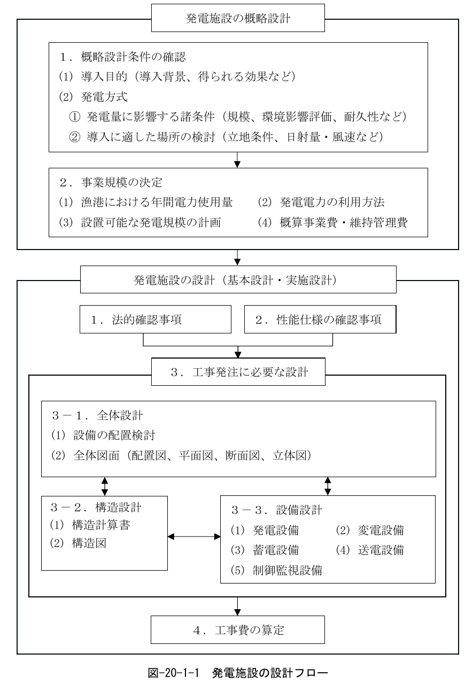
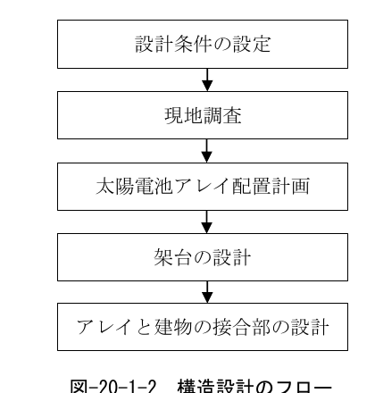
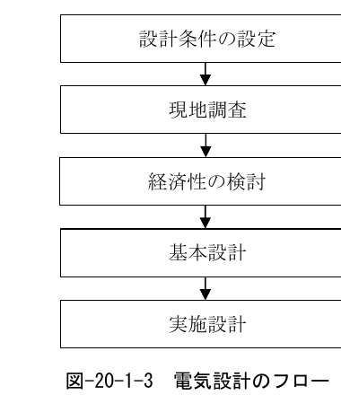
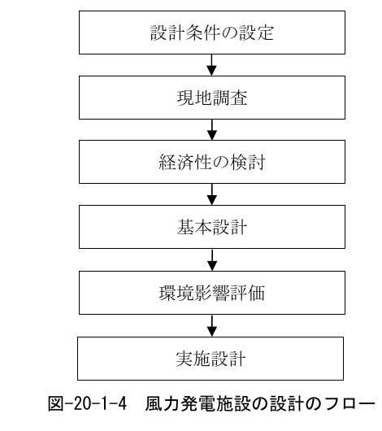

## 1 発電施設の目的

> 発電施設の目的は、複数の漁港施設に必要な電力を供給することを基本とする。

発電施設は、地球に負荷をかけない再生可能エネルギーを活用した発電施設や、災害や事故が発生した際に、水産活動を継続するための非常用発電施設等がある。

## 2 発電施設の要求性能

> 発電施設の要求性能は、対象施設の利用状況及び構造・設備形式に応じて、以下の要件を満たしていることとする。
>
> 1. 電力を供給する漁港施設の電力の消費量、利用状況や発電の方法などを考慮し、適切なものとする。
> 2. 発電施設の利用状況に応じた作用に対して、構造上安全なものとする。

## 3 発電施設の性能規定

> 発電施設の性能規定は、以下に定めるとおりとする。
>
> 1. 電力を供給する漁港施設の電力の消費量、利用状況や発電の方法などを考慮して適切に配置され、かつ、所要の整備機能を有すること。
> 2. 太陽光発電などの再生可能エネルギーを活用する施設においては、季節や時間変動などを考慮して必要な発電量を確保でき、かつ、所要の諸元及び必要な設備機能を有すること。
> 3. 発電施設の構造及び設備等は、建築基準法（昭和25年法律第201号）等の関連法規に準じていること。

## 4 発電施設における設計条件の設定

発電施設の設計は、図-20-1-1の設計フローのように、概略設計で事業規模を定め、設計で法的な確認事項と発注者が求める性能仕様を決定し、実際に工事発注ができる図面を作成し工事費の算定まで行う。

図-20-1-1 発電施設の設計フロー

## 5 関連法令等

本編策定において遵守すべき法令並びに参考となる図書等を以下に示す。

［法令等］

- 建築基準法・同施行令・同施行規則
- 消防法・同施行令・同施行規則
- 改正省エネ法・同施行令・同施行規則（エネルギーの使用の合理化及び非化石エネルギーへの転換等に関する法律）
- 電気事業法・同施行令・同施行規則

［参考図書］

- 漁港漁村の太陽光発電施設導入の手引き　令和4年6月　水産庁漁港漁場整備部
- 建物設置型太陽光発電システムの設計・施工ガイドライン　2024年版　国立研究開発法人新エネルギー・産業技術総合開発機構
- 地上設置型太陽光発電システムの設計・施工ガイドライン　2024年版　国立研究開発法人新エネルギー・産業技術総合開発機構
- 風力発電導入ガイドブック　2008年2月改訂第9版　国立研究開発法人新エネルギー・産業技術総合開発機構
- 事業計画策定ガイドライン（風力発電）　2024年10月改訂版　資源エネルギー庁
- 公共工事標準仕様書　国土交通省大臣官房長営繕部

## 6 設備設計

施設の設備設計では、基本設計を踏まえ、設置される設備の機能が十分発揮されるよう設計することが望ましい。

### 6.1 設備の概要

発電施設に設けられる設備のうち、特徴的なものを以下に挙げる。

1. 発電設備
2. 変電設備
3. 蓄電設備
4. 送電設備
5. 制御監視設備

### 6.2 発電設備

発電設備とは、発電方法の種類に応じて必要な電力量を効率的に発電する設備である。

### 6.3 変電設備

変電設備とは、送電方法に応じて適切な電圧を安全かつ効率的に変換する設備である。

### 6.4 蓄電設備

蓄電設備とは、適切な電力量を安定かつ安全に蓄電および放電する設備である。

### 6.5 送電設備

送電設備とは、電力を安全かつ効率的に送電する設備である。

### 6.6 制御監視設備

制御監視設備とは、発電施設を安全に制御および適切に監視する設備である。

## 7 材料選定

沿岸部に建つ施設であることを踏まえ、施設の維持管理、耐久性を考慮して選定する。

## 8 設計

以下に、再生可能エネルギーについて、太陽光発電施設と風力発電施設の設計を示す。

### 8.1 太陽光発電施設の設計

概略設計において、導入の目的、発電方法、事業規模（年間電力使用量、発電電力の利用方法、発電規模の計画、概算事業費・維持管理費）が決定し、事業化や地域住民の理解が得られる見通しが立った段階で、太陽光発電の設計を行う。

#### 8.1.1 構造設計

構造設計のフローを以下に示す。

図-20-1-2 構造設計のフロー

##### （1）設計条件の設定

太陽光発電施設の設置場所や発電規模を踏まえて、関連法令に準拠した設計条件を設定する。

##### （2）現地調査

周辺の障害物や設置場所、日照時間、気象、災害リスク等を調査する。

##### （3）太陽電池アレイ配置計画

太陽電池アレイの配置においては、消防活動上の支障がないように計画し、反射光が近隣建物の居住環境等に影響を与えないことを確認する。

##### （4）架台の設計

設計荷重は、JIS C 8955:2017「太陽電池アレイ用支持物の設計用荷重算出方法」に準じて算定する。ただし、公共工事標準仕様書（出典：国土交通省大臣官房長営繕部）などで指定がある場合にはそれに従うこと。

##### （5）アレイと建物の接合部の設計

アレイを建物部材に緊結する場合、アレイに作用する荷重が、建物部材に集中して作用することに留意して部材の耐力を評価する。また、荷重の伝達経路上の全ての部材について安全性を確認する。

#### 8.1.2 電気設計

電気設計のフローを以下に示す。

図-20-1-3 電気設計のフロー

##### （1）設計条件の設定

太陽光発電施設の設置場所や発電規模を踏まえて、関連法規に準拠した設計条件を設定する。

##### （2）現地調査

電力系統の接続状況や電気設備の設置場所、配線状況、電気設備の耐久性等を調査する。

##### （3）経済性の検討

経済性の検討は、建設コストと運転保守コストに対する発電コストで検討する。

##### （4）基本設計

基本設計では、設置条件の検討、電気システムの考え方、発電電力量推定を行う。

##### （5）実施設計

実施設計では、基本設計の内容を踏まえ、電気の流れや接続を検討して電気設備仕様を決定し、感電等の危険事象に対する保護方式を決定する。

##### （6）電気設計における留意点

**① 感電防止対策に関する留意点**

建物の所有者・占有者および建物利用者に対して接触防護措置を原則とした電気設計とする。

**② 異常発熱・火災防止対策に関する留意点**

太陽電池モジュールを建物に近接して設置する場合、太陽電池の裏面側の建物材料には不燃材を利用する。電線、コネクタなどで配線を行う場所には周辺に可燃物がないようにする。

**③ 雷害対策に関する留意点**

建物および建物内の設備を保護する雷害対策と協調した設計とする。

### 8.2 風力発電施設の設計

概略設計において、導入の目的、発電方法、事業規模（年間電力使用量、発電電力の利用方法、発電規模の計画、概算事業費・維持管理費）が決定し、事業化や地域住民の理解が得られる見通しが立った段階で、風力発電の設計を行う。

風力発電施設の設計のフローを以下に示す。

図-20-1-4 風力発電施設の設計のフロー

##### （1）設計条件の設定

風力発電施設の設置場所や発電規模を踏まえて、関連法規に準拠した設計条件を設定する。

##### （2）現地調査

風況や立地条件、周辺環境への影響等を調査する。

##### （3）経済性の検討

経済性の検討は、建設コストと運転保守コストに対する発電コストで検討する。

##### （4）基本設計

基本設計は、風車設置地点の決定、風車規模の設定、機種の選定を行う。

##### （5）環境影響評価

風車設置に関して環境影響評価を実施すべき主な項目としては、騒音、電波障害、生態系、景観等が挙げられる。

##### （6）実施設計

実施設計では、基本設計の内容を踏まえ、風力発電システム設計と電気設備設計を行う。
