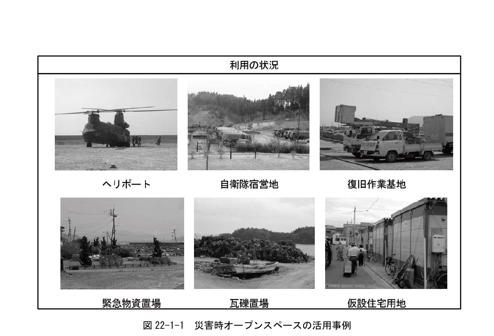
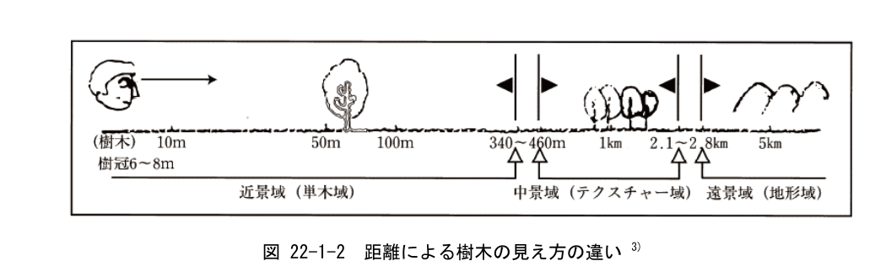
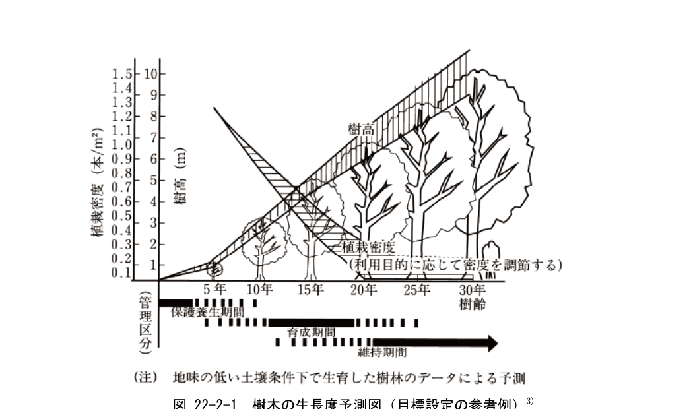
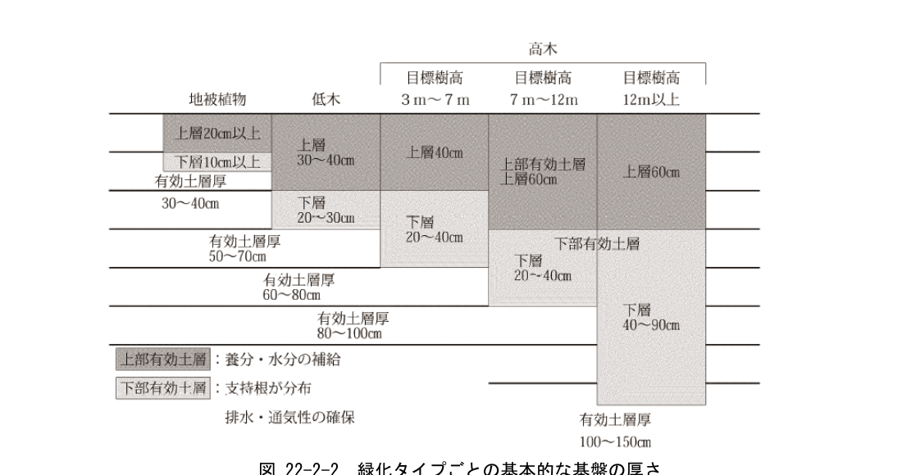
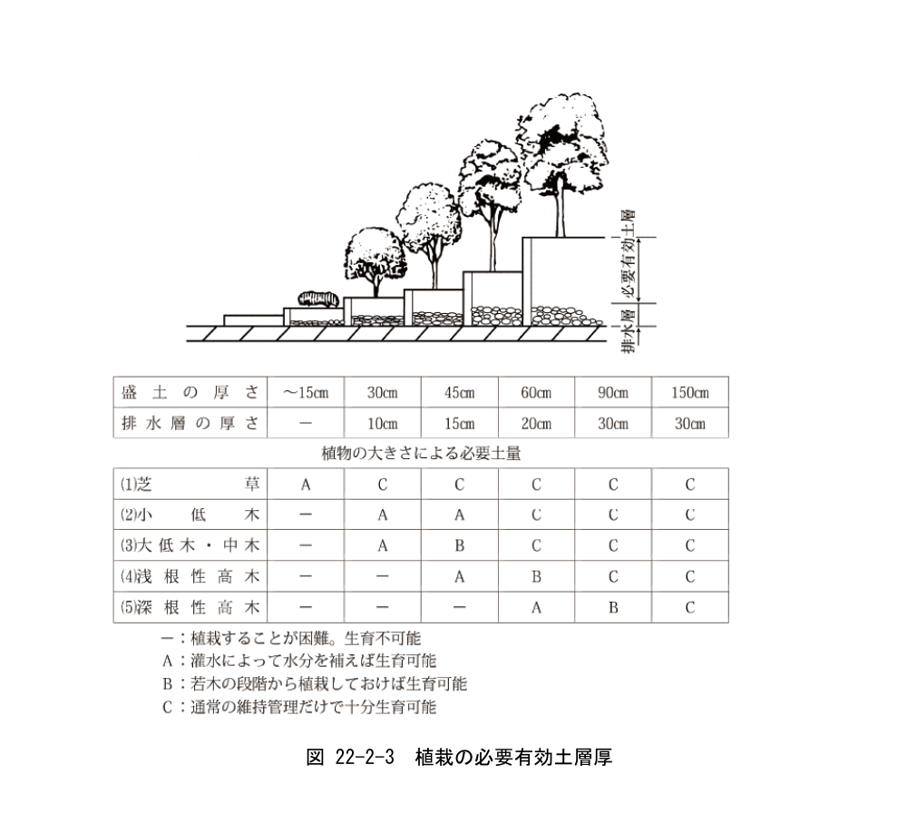
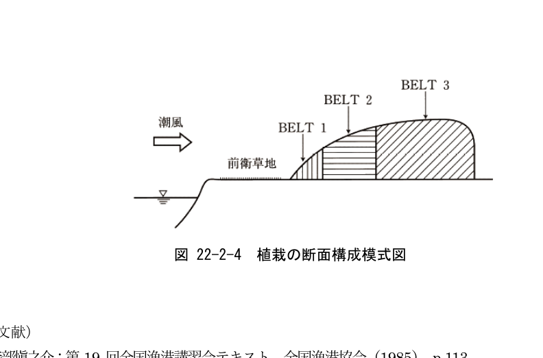
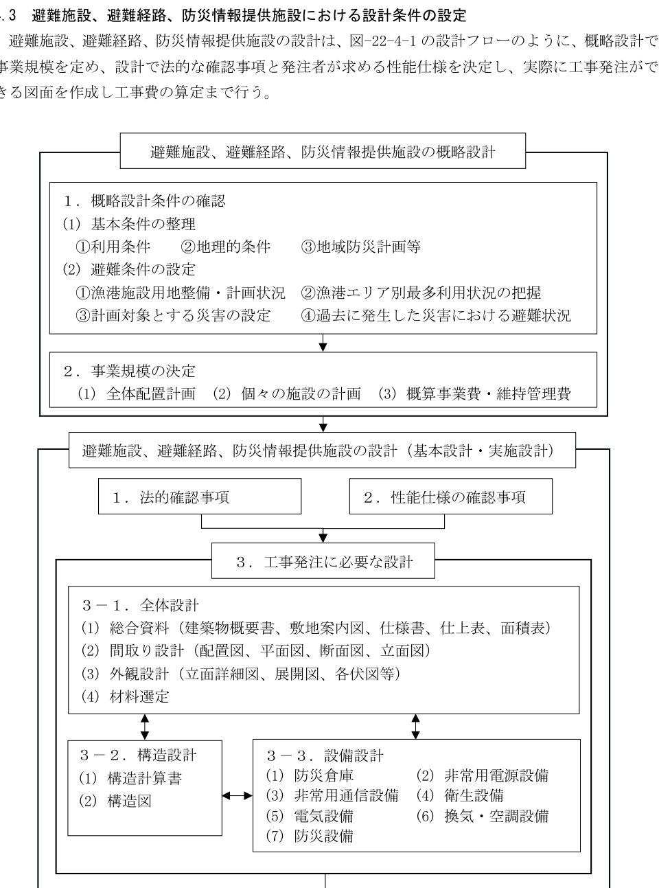

## 第1章 漁港環境整備施設の基本

### 1.1 漁港環境整備施設の目的

> 漁港環境整備施設の目的は、漁港の環境改善、安全性の向上、防災力強化等に資するとともに災害時に漁港利用者などの迅速かつ安全な避難を可能にすることを基本とする。

### 1.2 漁港環境整備施設の要求性能

> 漁港環境整備施設に共通する要求性能は、対象施設の用途に応じて、以下の要件を満たしていることとする。
>
> 1. 災害時、応急対策時及び災害復旧時の避難場所、緊急物資等の一時保管場所等として利用できるよう適切なものとする。
> 2. 利用者（高齢者等）の安全性及び快適性に配慮し、周辺環境及び景観との調和を図り、良好な漁港環境を創出できるよう適切なものとする。

漁業地域の中核となる漁港は、漁業の生産基盤としてだけでなく、離島における連絡航路など交通アクセスの確保、都市と漁村の交流の場としての機能を有するとともに、災害時には、地域住民などの避難や緊急物資の輸送、救難救助活動の拠点、災害復旧・復興の拠点として、就労者や来訪者、地域住民の生命・生活を守る重要な役割を有している。

特に、過去の地震・津波被害による被災事例をみると、狭隘な漁村において漁港のオープンスペース（緑地・広場等）が緊急避難、救援・救助活動、復旧・復興活動の拠点として重要な役割を果たしてきた。

このため、漁港環境整備施設は災害時のオープンスペースとしての活用を標準とし、オープンスペースとしての具体的な利用（図 22-1-1 災害時オープンスペースの活用事例）は、「災害に強い漁業地域づくりガイドライン（p.35 表-II-7 施設、用地の役割）」1)を参考とすることができる。

なお、漁港環境整備施設の整備における漁業地域の防災、減災対策は、市町村などの地域防災計画と整合を図るものとし、他部局（港湾部局・都市部局等）で実施する対策との連携・分担により、地域全体で総合的な防災・減災対策を講じることが望ましい。

また、漁港環境整備施設は、平常時は地域住民の活動・交流の場として機能するものであることから、利用者（高齢者等）の安全性や快適性に配慮し、周辺環境や景観との調和を図り、良好な漁港環境の創出に資することが望ましい。

### 1.3 漁港環境整備施設の設計

漁港環境整備施設は緑地、防災対策に必要な施設及び用地の整備とし、緑地、防災施設、避難施設、避難経路、防災情報提供施設、用地、その他施設を整備するものである。施設の設計にあたっては、漁港の利用状況及び漁港の施設用地の利用計画などと整合を図るものとし、漁港周辺の自然環境、社会環境、他部局が所管する周辺施設などとの連携にも配慮し、それぞれの施設に求められる機能が十分に発揮できるよう考慮することを原則とする。

また、災害時や平常時の安全性を確保し、周辺環境との調和や良好な景観形成に資するよう施設の設計を行うことが望ましい。

なお、本書では、標準的な値を示したものであるので、その適用にあたってはそれぞれの地域特性などを考慮することが望ましい。

図 22-1-1 災害時オープンスペースの活用事例

### 1.4 利用者（高齢者等）への配慮

漁港環境整備施設は、地域住民、漁業従事者、来訪者などが、日常生活の中で漁港や浜辺に出かけて、安全に活動し、良好な漁港環境を享受できるよう、施設のバリアフリー化を推進し、自然条件（急傾斜地など）、施設の利用形態などにより、特に支障がある場合を除き、高齢者、障害者なども利用できるものとすることが望ましい。

なお、施設のバリアフリー化は、高齢者や障害者などへの特別な配慮のみならず、日常の作業や漁港を訪れ施設を利用する全ての利用者に対する配慮を目指すものである。例えば、広場施設の階段は、車いす利用者のみでなく、台車による荷物の運搬者やベビーカー利用者に対する配慮として、スロープを設置することが望ましい。このように、施設のバリアフリー化は、高齢者などへの利用配慮のみでなく、日常的な利便性・快適性の向上に資するよう、施設の設計に取り入れていくことが望ましい。このような考え方は、できるだけ多くの人が利用しやすい設計を目指すユニバーサルデザインという考え方であり、公園などの公共施設などでも近年多く用いられるようになってきていることから、漁港環境整備施設の設計にあたっても必要に応じてこの考え方を適用することが望ましい。

#### 1.4.1 バリアフリー化における共通ポイント

各施設のバリアフリー化において共通して留意が必要なポイントは以下の5点である。

##### (1) 安全である

わずかな段差や起伏でも大きな事故につながることがある。特に遊歩道の路床などは滑りにくく凹凸がないものが望ましい。さらに遊歩道や階段には移動の補助となる手すりなどを設置する。

##### (2) スペース（余裕）がある

行動に余裕がもてる空間づくりを心がける。車いす利用者や社会的弱者が、健常者との活動の中で、余裕をもって行動ができる空間、幅を確保する。また、遊歩道などには、人の流れから外れて休息がとれる小スペースを確保する。

##### (3) 理解しやすい

標識、マークは利用者が理解しやすい表示、デザインを心がける。特に子供の利用が多い箇所には「ひらがな表示」、高齢者には「大きな活字」、視覚障害者には「点字」などを配慮する。

##### (4) 統合化される

特殊施設や専用施設は、利用者に疎外感を与えるほか、緊急時の発見の遅滞などを招くため、できる限り統合し、共通の施設として整備する。

##### (5) 自由に使える

バリアフリー化した施設は常時自由に使えることが基本である。使用にあたって、その都度、許可や立ち会いなどがないことが望ましい。

#### 1.4.2 施設の区分

利用者の視点に立って、施設を区分すると以下のようになる。

##### (1) アクセス系統施設

駐車場、出入口、園路、階段、スロープ、休憩スペース

##### (2) 情報伝達施設

公園サイン、緊急非常装置等

##### (3) 景観形成施設

植栽、花壇、樹林地

##### (4) 利便施設等

トイレ、休憩施設（四阿、ベンチ、野外卓等）、水飲み、安全柵、くず入れ、照明等

各施設の設計の配慮事項には、表 22-1-1 2)に示すようなものがあるが、地方公共団体の基準がある場合はそれらを使用して設計することが望ましい。

**表 22-1-1 施設設置に際し配慮すべき事項の例**

| 分類 | 施設 | 配慮事項 |
|---|---|---|
| 1. 園路等 | (1) 出入口 | 勾配、有効幅員、仕上げ、車止柵、標示、段差 |
| | (2) 園路 | 勾配、有効幅員、仕上げ、段差の解消、視覚障害者誘導用ブロック |
| | (3) スロープ（傾斜路） | 勾配、水平部分、滑り落ち止、手すり、路上施設、その他 |
| | (4) 階段 | 有効幅員、形状、水平部分、手すり、仕上げ、標示、照明 |
| | (5) 手すり | 高さ、形状、壁との関係、端部・表示 |
| | (6) 排水溝 | 溝蓋、排水穴、レベル |
| 2. ベンチ等 | (1) ベンチ・野外卓〔ベンチ〕 | 腰掛け板、杖使用者用ベンチ、ひじかけ |
| | (1) ベンチ・野外卓〔野外卓〕 | 水平部分、下部スペース、卓の配置間隔 |
| | (2) 水飲み器 | 飲み口、水平部分、水栓金具 |
| 3. サイン等 | (1) 表示・案内 | 案内板、文字標示、その他の施設 |

### 1.5 景観への配慮

景観設計にあたっては、その地域の地形、土地利用状況、集落形態、街路形態、文化歴史などについて十分調査したうえで、周辺環境と調和し、施設全体の一体性が図られるよう十分留意して設計することが望ましい。

#### 1.5.1 漁村景観の特徴

漁港・漁村の景観は密集する家屋と開放的な海辺との対比と水揚げから出荷などの活発な漁業活動の風景が時系列に変化していく 施設を計画・設計するにあたっては、このような漁港・漁村の景観、地域文化などを尊重するとともに、漁港と漁村の融合及び調和した景観の保全が図られるよう十分配慮することが望ましい。

#### 1.5.2 景観設計における基本方針の検討

個々の施設の景観設計を行うにあたっては、地域の特性に応じた当該漁港全体の景観設計の基本方針を明確にすることを原則とする。この基本方針がない場合、各施設に景観配慮する事項が不整合となり、個々の施設では景観配慮の効果があっても全体として調和のとれたものとならず、結果として良好な景観形成が阻害される恐れがある。

基本方針の検討にあたっては、その地域の地形条件、土地利用形態、漁村の歴史・形態、既存の漁港の施設などの状況を十分考慮し、地域特性、各々の施設が受け持つ機能、景観配慮の重点事項などについて検討して決定することが望ましい。

なお、基本方針は、ヒューマンスケールの範囲（400〜500m）内を目安としてよい。

図 22-1-2 距離による樹木の見え方の違い 3)

#### 1.5.3 景観設計の検討手法

景観設計の検討方式には、以下のようなものがある。

##### (1) デザイナー方式

デザイナーと事業主体が同等の立場で相談しながら設計する方法。設計作業が短時間でできるが、個性が強く反映される。また、責任の所在が明確である。

##### (2) 委員会方式

学識経験者、デザイナー、地元代表、事業主体で委員会を組織して設計する方法。各分野の専門家との議論を経て総合的な見地で検討できるが、個性が出にくくデザインが画一化する恐れがある。

##### (3) アドバイザー方式

デザイン面で豊かな知識や経験を持つ専門家に内容を助言してもらい設計する方法。設計者が見落としていることをチェックできるが、アドバイザーの個性に左右される。

##### (4) 住民参加方式

地元のアイデアや要望を設計に盛り込む方法。利用者の意見が反映され、地域環境に対する住民の意識向上、建設物に対する親しみが生まれるが、参加範囲が大きいほど時間と作業量が大きくなる。

また、各種検討のための資料作成手法には主に表 22-1-2 4)のような方法があるので、設計の進行状況、重要性、検討手法を考慮して設計を進めることが望ましい。

**表 22-1-2 資料作成手法の特性**

| 手法 | 内容 | 視覚性 | 現実性 | 操作性 |
|---|---|:---:|:---:|:---:|
| 類似事例 | 類似した設計テーマを持つ事例を参考とする。 | ◎ | △ | ◎ |
| ラフスケッチ | 個々の設計テーマを概略的にイメージ化した鉛筆描きのスケッチ。 | ○ | ○ | ◎ |
| 淡彩スケッチ | デザイン比較案に簡単な添景を加えてイメージ化したスケッチに淡彩を施す。 | ◎ | ○ | ◎ |
| カラーリングパース | デザイン比較案を周辺の景観とともに詳細にカラーで描画する。 | ◎ | ◎ | ○ |
| フォトモンタージュ | 現地の写真上にデザイン比較案のパースを合成する。 | ◎ | ◎ | ○ |
| CGアニメ（コンピューターグラフィックアニメ） | コンピューターグラフィックスにより景観変化を視覚化する。シーケンス景観の検討に適している。 | ◎ | ◎ | △ |
| 模型 | 構造物、地形等を各種模型材料により現実に相似な三次元模型として表現する。 | ◎ | ◎ | △ |

注）視覚性：デザインイメージの表現力（精度）
　　現実性：現地との適合性（臨場感）の表現力
　　操作性：資料作成の難易度（作業時間）
　　◎優れている　○普通　△やや劣る

#### 1.5.4 景観設計の対象範囲

景観への配慮は、各種規制により景観配慮しなければならない地域、住民の景観に対する意識が高く具体的な取り組みがなされている地域を対象とする。具体的には、国立国定公園区域、名所景勝地近隣、歴史的建造物指定、景観条例を制定している地域、その他都市住民などとの交流を図る必要があるなどの特別な事情のある地域に限定することとし、景観配慮を行わなければならない理由を併せて明らかにすることを原則とする。

（参考文献）

1. 水産庁漁港漁場整備部：災害に強い漁業地域づくりガイドライン，（2012），p.35
2. 日本公園緑地協会：改訂 26 版 造園施工管理−技術編−，日本公園緑地協会（2011），pp.398-405
3. 土木学会：港の景観設計，技報堂（1991），p.14
4. 道路環境研究所：道路景観整備マニュアル（案），大成出版社（1988），p.30

## 第2章 緑地

### 2.1 緑地の要求性能

> 緑地の要求性能は、「漁港施設用地」の規定を準用する。

### 2.2 緑地の性能規定

> 緑地の性能規定は、利用目的に応じて適切に配置され、かつ、所要の規模を有すること。

### 2.3 設計

#### 2.3.1 緑地の概要

緑地の設計にあたっては、求められる機能を総合的に検討した配置計画に基づき、気象条件、土壌条件などの諸環境条件や植栽対象地の特性及び利用形態などを考慮することを原則とする。

緑地は、防風・防潮機能のほか、修景機能（景観形成）をはじめとして、水産物などの運搬による騒音や排気ガスの緩衝機能、周辺環境との調和を図り良好な漁港環境を創出する風致機能など複数の機能を有する。

また、漁港及び漁業集落の持つ特質に十分配慮しつつ、これらの機能を総合的に検討し、目的とする機能に応じた樹種の選定、配置、植栽帯の幅の設定、植物の生育条件を確保する。

##### (1) 樹種の選定

樹種の選定にあたっては、耐海水性、耐潮風性に留意し、植栽の生育特性や修景効果、植栽後の維持管理方法などを検討する。また、周辺の植生環境に変化が生じないよう配慮する。なお、詳細については、「本編 2.3.3 樹種の選定」を参照すること。

##### (2) 土壌処理

緑地には土壌に適した樹種を選定する一方、土壌の適性を確保するため、必要に応じて土壌の改良を行う。なお、詳細については、「本編 2.3.4 土壌の改良」を参照すること。

##### (3) 設置場所

緑地の設置地盤高は既往最高潮位（H.H.W.L.）以上とすることを原則とする。

#### 2.3.2 緑地の種類と目的

緑地は、以下のように4種類に大別される。

##### (1) 広場公園緑地

平常時は漁港を利用する人々の休憩、軽易な運動など、災害時はオープンスペースとして活用する総合的機能を持つ緑地である。原則、次の事項を考慮する。

1. 安全性、快適性が確保されていること。
2. アクセスが安全かつ容易であること。

##### (2) 防風・防潮緑地

防風・防潮・防砂・防雪を目的として防護する地域の風上、海側などに整備する緑地である。

##### (3) 緩衝緑地

騒音、排気ガス、悪臭などの緩和などを目的として道路沿いに整備する緑地である。

##### (4) 風致緑地

自然公園内の漁港などで周辺環境との調和を図るために整備する緑地である。

漁港における植栽については、潤いのある環境形成の観点からは可能な限り広くとることが望ましいが、漁港における緑化率は、概ね 10%〜20%を目安とすることが適当である 1)。

#### 2.3.3 植樹の選定

植栽樹種の選定にあたっては、植栽の生育特性や修景効果、植栽後の管理方法などを考慮することを原則とする。

植栽の材料は多種多様であり、植栽の目的、機能を効果的に発揮させるために、植栽対象地の環境条件に適応して、良好に生育する樹種を選定することが望ましい。

樹種の選定にあたっての留意事項は以下のとおりである。

1. 生育特性（耐潮風性、好陽性、土壌の適性、植栽対象地の生育環境）
   海岸より 500m以内では潮風の影響をかなり受けるため、耐潮性の大きい樹種を選定する。
2. 緑地に求める効果
   樹種の特性（花・実、枝葉等）による修景効果、防風効果などの違いに留意する。
3. 維持管理の方針
   維持管理体制、費用、手入れの容易さなどにも留意する。
4. 既存樹木（林）の保全、調和
   設計上有効な樹木（林）の保全（移植）、利用などの検討、自然性、景観性などを考慮し、保全（利用）の有無を決定する。

植栽時の樹木の形状により、植栽方法は以下のように区分される。2)

1. 完成型植栽（成木又は成木に近い未成木による植栽）
   植栽直後から機能の発揮が必要な場合は、この植栽方法を選択する。
2. 半完成型植栽（未成木による植栽）
   植栽後機能発揮までに数年間の時間的余裕がある場合などに選択する。
   （原則として間伐は前提にせず、植栽密度は成木植栽と同様とする。）
3. 将来完成型植栽（苗木による植栽）
   植栽後機能を発揮するまでに 10 年程度の時間的余裕がある場合、その地域に適応した樹林を形成したい場合、また植栽費を大幅に縮減する必要がある場合などに選択する。
   （ただし、育成段階で数年間にわたって十分な維持管理費が必要となり、トータルコストでの縮減にはならない場合もあるので注意を要する。）

植栽は、主要材料が植物であるため、施設などに比べて長期的な見通しを持って検討を行うことを原則とする。目標年次の設定は、将来における植栽地及び周辺の全体像を予想しながら、植栽空間の発揮する機能がどの時点で求められているか十分留意することが望ましい。

図 22-2-1 樹木の生長度予測図（目標設定の参考例）3)

#### 2.3.4 土壌の改良

緑地は土壌を適正に安定・維持するため、必要に応じて土壌改良を行うことを原則とする。土壌改良とは、pH、塩類濃度、植物養分、有害物質などに問題ある土壌について、無機質系、有機質系、高分子系などの土壌改良資材を混入することにより、土壌の化学的又は物理的性質を改良するものである。

特に海岸部の砂土においては低保水性、貧栄養、高濃度の塩類含有の可能性が高いため土壌改良を検討することが望ましい。海岸の埋立地は、土壌の塩分濃度が高い場合が多く、一定年月（粘性土等；3〜4 年程度）が経過しないと影響のない濃度（0.04%以下）に低下しない。一般に植物の生育に対する塩分の限界濃度 4)は、蔬菜 0.04%、樹木 0.05%、日本芝 0.1%といわれているが、過剰塩分を流脱させるためには、排水を良くし散水を行う、盛土を行うなどの方法が考えられる。

土壌には根系を通じて樹木を支持する機能が求められているが、漁港などの海岸部における植栽は、季節風や台風などによる強風の影響を受けやすいので、特に留意することが望ましい。

土壌量が十分に確保できないと樹木に水分や養分を十分に供給できず、根系の発達が阻害され、強風に対して極めて弱い状態となり、倒木の恐れが生じるので留意することが望ましい。

##### (1) 基本的な基盤構造

植栽する植物に応じた基盤構造と基盤厚を設定する。参考までに、図 22-2-2 5)に標準的な基盤構造と厚さを示す。

図 22-2-2 緑化タイプごとの基本的な基盤の厚さ

##### (2) 人工地盤

人工地盤に植栽する場合、土壌は条件のあった良土（自然土壌、改良土壌、人工軽量土壌）をもって盛土するとともに、人工地盤の上に土壌の滞水を防ぐための排水層、排水勾配を設けることを原則とする。

人工地盤の有効土厚の設計にあたっては、図 22-2-3 6)の人工地盤における植物の必要有効土厚層を参考としてよい。

図 22-2-3 植栽の必要有効土層厚

##### (3) 防風・防潮施設

樹木の耐潮性や防風・防潮機能を高めるために必要とされる密度の植栽を行うことが望ましい。

防風・防潮植栽は、漁業集落における風対策として有効で風向を変えるか、風速を減衰させることにより、強風を防ぎ、同時に、海風中の塩分を除去し、背後の施設を防護しようとするものである。また、高潮・津波に対しては、漂流物（漁船、養殖用いかだなど）の移動阻止、波の流速低下と破壊力減少、跳波による破壊防止などの機能 7)がある。

ただし、植栽を単独で設けた場合、海水の侵入は阻止できないし、大きな高潮・津波にはおのずと限界があるので、防潮堤などの防潮施設と併用を検討することが望ましい。

植物を利用する防風林などでは、防風効果からみて適する密閉度は、60〜70%程度であるといわれている。しかし、密閉度に対する評価は確定的なものがなく、これに代わる指標のひとつとして植栽密度がある。植栽密度は、樹種や土壌環境により異なるが、標準的な植栽密度、幅、樹高を持つ防風林を仕立てることによって 60〜70%程度の密閉度を有するとの前提で、経験的な目安として、一般には間隔 1.5〜2.0 m の正三角形植えが行われている。樹列は、20〜30m 程度あれば望ましいが、新しく防風施設を設置する場合、有利な立地条件がなければ現実的でないので、幅 10m 程度（3〜5 列植え）が一般的となっている。特に砂地に対する定着のため、同程度の豆科植物を混植することも多い。また、活着率の高い低規格の樹木植栽でも機能が発揮され、景観に変化を与えるなどの利点から緑地を築山状に造成するなどの工夫を検討することが望ましい。

<table>
  <caption>表 22-2-1 目的、機能別の植栽密度 8)</caption>
  <thead>
    <tr>
      <th rowSpan="2">目的・機能別の植栽</th>
      <th rowSpan="2">樹林帯</th>
      <th colSpan="4">植栽密度（本/m2）</th>
      <th rowSpan="2">備考</th>
    </tr>
    <tr>
      <th>低木</th>
      <th>中木</th>
      <th>高木</th>
      <th>地被植物・芝生</th>
    </tr>
  </thead>
  <tbody>
    <tr>
      <td rowSpan="3">潮風の著しく強い場所での防潮風林の植栽</td>
      <td>BELT 1</td>
      <td>(H0.3〜0.5m) 2〜3</td>
      <td>−</td>
      <td>−</td>
      <td>−</td>
      <td>幅員(m) 3〜5</td>
    </tr>
    <tr>
      <td>BELT 2</td>
      <td>( 〃 ) 0.1〜0.2</td>
      <td>(H1.1〜1.5m) 0.5〜1.0</td>
      <td>−</td>
      <td>適宜</td>
      <td>〃 5〜10</td>
    </tr>
    <tr>
      <td>BELT 3</td>
      <td>( 〃 ) 0.2〜0.3</td>
      <td>−</td>
      <td>(H1.5〜3.0m) 0.2〜0.3</td>
      <td>〃</td>
      <td>〃 10〜30</td>
    </tr>
  </tbody>
</table>

（注）Hは樹高を表す植栽時の規格である。
　　BELT 1，2，3はそれぞれ海側に対する樹林の部位を示す。

図 22-2-4 植栽の断面構成模式図

（参考文献）

1. 森部慎之介：第 19 回全国漁港講習会テキスト，全国漁港協会（1985），p.113.
2. 港湾緑化技術 WG：港湾緑地の植栽設計・施工マニュアル，港湾空間高度化センター港湾・海域環境研究所（1999），p.25.
3. 中島宏：緑化・植栽マニュアル，経済調査会（2004），p.114.
4. 三橋一也・相川貞晴：造園技術必携② 造園植栽の設計と施工，鹿島出版会（1981），p.96.
5. 港湾緑化技術 WG：港湾緑地の植栽設計・施工マニュアル，港湾空間高度化センター港湾・海域環境研究所（1999），p.95.
6. 中島宏：緑化・植栽マニュアル，経済調査会（2004），p.231.
7. 村井宏他：日本の海岸林−多面的な環境機能とその活用−，ソフトサイエンス社（1992），p.289.
8. 日本公園緑地協会：改訂26 版 造園施工管理−技術編−，日本公園緑地協会（2011），p.56.

## 第3章 防災施設

### 3.1 防災施設の概要

防災施設は防災対策に必要な広場、駐車場、安全情報伝達装置などの各施設とする。

### 3.2 広場

広場は災害時において避難又は緊急物資の一時保管場所などに利用され、平常時は漁港を利用する人々の休憩、都市と漁村の交流活動の場としての機能を持つものである。

### 3.3 駐車場

「第8編第3章 駐車場」に準ずる。

### 3.4 屋外拡声装置 1)

拡声装置は区域内全般に良質な音声と均一なレベルで情報を伝達することができ、また聞く人々に不快感がなく、明確に放送内容が聞き取れるものとするとともに、耐久性にも留意することが望ましい。

屋外スピーカーは、気象条件、特に風の影響で音声の通達距離が変化するので、大出力のスピーカーを集中配置するより、小出力のスピーカーを分散する分散配置方式が望ましい。

### 3.5 安全情報伝達装置

安全情報伝達施設は、津波、地震、高潮、波浪などの情報を地域住民及び来訪者に正確かつ迅速に伝達するための施設であり、潮位計、地震計、波浪計などの観測施設のほか、観測気象情報、警報・注意報、避難勧告などを迅速に周知・伝達するための防災無線、安全情報掲示板などがある。これらの災害の発生が予想される地域は、屋外拡声装置、警報装置とあわせて安全情報伝達装置を設置することにより、漁業地域の防災・減災に資する警報体制、避難体制を整えることが望ましい。

安全情報伝達施設は、地震による津波の情報や気象・海象条件の悪化による高波などの情報を迅速かつ正確に伝達できるよう、その配置、構造などを決定することとし、原則として以下の事項に留意する。

1. 災害発生時に確実に稼働すること。必要に応じて、施設の耐震化や設置場所の高所化、停電時のためのバックアップ電源の確保を行うものとする。
2. 情報伝達の多重化を図り、確実に警報・注意報、避難勧告などが地域住民などに周知されるよう伝達手段・経路を複数確保すること。
3. 定期的な点検及び適切な維持管理が可能な構造、設置位置とすること。

（参考文献）

1. 川本昭雄・鈴木健之：造園技術必携③ 造園施設の設計と施工，鹿島出版社（1982），pp.246-247

## 第4章 避難施設、避難経路、防災情報提供施設

### 4.1 避難施設、避難経路、防災情報提供施設の要求性能

> 避難施設、避難経路、防災情報提供施設の要求性能は、対象施設の用途に応じて、以下の要件を満たしていることとする。
>
> 1. 災害時に漁港利用者などの迅速かつ安全な避難ができるよう適切なものとする。
> 2. 避難施設、避難経路及び防災情報提供施設の利用状況に応じた作用に対して、構造上安全なものとする。

### 4.2 避難施設、避難経路、防災情報提供施設の性能規定

> 避難施設、避難経路、防災情報提供施設の性能規定は、利用目的に応じて、以下の要件を満たしていることとする。
>
> 1. 想定される災害状況に応じて適切に配置され、かつ、所要の諸元、必要な設備機能を有すること。
> 2. 避難施設、避難経路及び防災情報提供施設の構造及び設備等は、建築基準法（昭和 25 年法律第 201 号）等の関連法規に準じていること。

### 4.3 避難施設、避難経路、防災情報提供施設における設計条件の設定

避難施設、避難経路、防災情報提供施設の設計は、図-22-4-1 の設計フローのように、概略設計で事業規模を定め、設計で法的な確認事項と発注者が求める性能仕様を決定し、実際に工事発注ができる図面を作成し工事費の算定まで行う。

図-22-4-1 避難施設、避難経路、防災情報提供施設の設計フロー

### 4.4 関連法令等

本編策定において遵守すべき法令並びに参考となる図書等を以下に示す。

〔法令等〕

- 災害対策基本法・同施行令・同施行規則
- 建築基準法・同施行令・同施行規則
- 消防法・同施行令・同施行規則
- 電気事業法・同施行令・同施行規則
- 津波防災地域づくりに関する法律・同施行令・同施行規則

〔参考図書〕

- 漁港の津波避難に関するガイドライン（津波避難誘導デッキの計画・設計）【暫定版】　漁港の津波避難に関する専門部会
- 避難所運営ガイドライン　内閣府
- 福祉避難所の確保・運営ガイドライン　内閣府
- 津波避難を想定した避難路、避難施設の配置及び避難誘導について　国土交通省
- 港湾の津波避難施設の設計ガイドライン　国土交通省
- 津波避難ビル等にかかるガイドライン　内閣府

### 4.5 施設の概要

施設を人工地盤として整備する場合は、「第9編 第3章 人工地盤」を参照する。

#### 4.5.1 避難施設

避難施設は、災害時に漁港利用者などの人命を守り、安全な避難場所を提供する施設であり、大規模災害における避難困難地域の緊急的・一時的に退避する際に活用できる施設である。

#### 4.5.2 避難経路

避難経路は、市町村が指定する「避難路」を勘案し、漁港利用者などの迅速かつ安全な避難が確保できるように整備された道路、階段等の避難施設までの経路である。

なお、避難経路の整備にあたっては、地震の揺れによる避難経路の不連続が発生しないように十分考慮し、災害時に見込まれる液状化、倒壊した建物等の障害物、落橋、土砂災害等の影響により避難経路が寸断されることがないよう留意が必要である。

道路に分類される避難経路にあたっては、「第8編 第2章 道路」の規定を準用する。

#### 4.5.3 防災情報提供施設

防災情報提供施設は、国や自治体等からの災害情報を漁港利用者などに迅速かつ正確に提供するための施設である。災害時の気象情報、警報・注意報、避難勧告や潮位計、地震計、波浪計等による観測情報を迅速に周知・伝達するための手段として防災無線、安全情報掲示板などがある。

### 4.6 全体設計

全体設計は、建物の間取りや外観の設計、材料の選定を行うだけでなく、構造設計や設備設計と連携を取り、建物の建築方針を決定する。

配置図や平面図、断面図、立面図を作成して建物の間取りを設計し、立面詳細図や展開図、各伏図等により建物の外観を示し、建築物概要書や敷地案内図、仕様書、仕上表、面積表等、建物の基本的な情報を整理する。

### 4.7 構造設計

避難施設及び避難経路は、対象とする災害時に機能を発揮する必要があることから、対象とする災害時の外力（地震力、津波力等）に対して施設全体が安定であるとともに、主要部材に発生する断面力が耐力以下で安全であることが求められる。津波避難施設の場合では、対象とする津波に先行する地震動、津波力及び漂流物に対しても安定、安全であることが求められる。

#### 4.7.1 構造の選定

避難施設の構造設計では、避難生活に支障がないよう無柱の広いスペースを確保するため、現在では鉄骨造スレート葺の構造が多い。過去には、建築材の耐用年数の確保の観点から鉄筋コンクリート造の施設が多かったが、鉄骨材も十分な塗装をすればほぼ耐久性が確保可能である。

避難施設における代表的な構造の特徴を以下に示す。

##### ① 鉄骨造

- a）部材強度が大きく、耐震性に優れ、部材断面が小さい。
- b）鉄筋コンクリートに比べ、広いスパンを構築できる。
- c）工場加工のため、他の構造に比べると工期が短縮できる。
- d）鋼材はさび易いため、防錆処理が必要である。
- e）鋼材は火災に対し弱いため、耐火被覆が必要である。
- f）部材断面が小さいため、たわみが大きく、振動・座屈が生じやすい。

##### ② 鉄筋コンクリート造

- a）耐火性に優れている。
- b）部材の剛性が大きいので、建築物の変形や振動が他の構造物に比べて少ない。
- c）温度・湿度・音・放射線等に対する遮断性が大きい。
- d）耐久性が大きく、耐用年数が長い。
- e）経済的なスパン長が鉄骨に比べ短い。
- f）柱配置はできるだけ均等なスパンとする。
- g）鉄筋の被覆が少ないと塩害等を受ける。

なお、大規模な建物で無柱の避難施設を設計するような場合、鉄骨造の特殊構造や鉄骨と鉄筋コンクリート造複合構造、又はPC（プレストレストコンクリート）造も採用検討の範囲となる。

#### 4.7.2 柱・梁の検討

##### (1) 柱の配置

柱の配置は、経済性を考慮して、平面的に均等な配置とすることを原則とする。

ただし、空間を構成する柱は、設備等の設置や避難行動に支障となる場合には、平面設計では利用面と構造面を考慮し、柱を配置することが望ましい。

##### (2) 梁の検討

梁の配置は、大梁と小梁から構成される。経済的に大梁を設計するには、連続梁として配置されるよう考慮することが望ましい。

#### 4.7.3 基礎の検討

施設は海に近い埋立地に計画する場合が多いため、基礎の検討では、地盤の性状や地耐力等を十分に考慮し、建物の安全性・安定性を検討することを原則とする。

避難施設は、対象とする津波に先行する地震動によって液状化する可能性がある場所には極力配置しない。やむを得ず、液状化する可能性がある場所に設置する場合には、そこへいたる避難経路を含め、液状化対策を行うことが必要がある。

#### 4.7.4 環境への配慮

設計では、関連法令を踏まえ、近隣施設との環境調和に配慮することを原則とする。

### 4.8 設備設計

施設の設備設計では、基本設計を踏まえ、漁港利用者などが迅速かつ安全に避難ができるよう、また、設置される設備の機能が十分に発揮されるよう設計することが望ましい。

#### 4.8.1 設備の概要

避難施設に設けられる設備のうち、特徴的なものを以下に掲げる。

1. 防災倉庫
2. 非常用電源設備
3. 非常用通信設備
4. 衛生設備
5. 電気設備
6. 換気・空調設備
7. 防災設備

#### 4.8.2 防災倉庫

防災倉庫とは、一時避難者のための非常食、飲料水、医薬品、簡易トイレ、毛布等を保管するための設備である。

#### 4.8.3 非常用電源設備

非常用電源設備とは、停電時に必要な電力を確保するために設置する設備である。水災害による浸水の発生が想定される場合は、非常用電源設備を浸水の影響が及ばない高い場所に設置することが望ましい。

#### 4.8.4 非常用通信設備

非常用通信設備とは、地震や津波等の災害発生時に、通信機能を確保するための設備であり、停電時あるいは繋がりにくい状態でも通話が可能な衛星電話、漁業無線や防災無線、ラジオ等がある。

#### 4.8.5 衛生設備

衛生設備とは、避難者の感染症予防のための設備であり、手洗い場等がある。

#### 4.8.6 電気設備

電気設備とは、施設内で電気を利用するための設備であり、照明設備や動力設備等がある。電気容量は、照明及び動力等の設備の同時使用を考慮して算定する。

#### 4.8.7 換気・空調設備

換気・空調設備とは、適切な室温等を保持するための設備である。

#### 4.8.8 防災設備

防災設備とは、地震や津波、火災、停電等の災害発生時に、災害の早期発見と被害を最小限に抑えるための設備であり、消火設備、火災報知設備、非常照明設備等がある。

### 4.9 材料選定

沿岸部に建つ施設であることを踏まえ、耐久性、施工性、経済性等を考慮し、材料を選定する。

## 第5章 用地

### 5.1 用地の概要

対象となる用地は、災害時において避難又は緊急物資の一時保管場所などに利用される用地（災害対策基本法（昭和 36 年法律第 223 号）第2条第10 号に規定する地域防災計画その他これに準ずる防災に関する計画において定められたもの。）とする。

なお、用地整備については、「第9編 漁港施設用地」に準ずるものとする。

#### 5.1.1 規模と配置

用地の規模（面積、地盤高等）と配置は、避難経路や緊急車両の動線に配慮するとともに他の防災関連施設との相互利用を考慮して決定することが望ましい。

平常時は、地域住民の生活・利便性の向上、都市住民との交流を図るとともに良好な漁港環境の創出を図るため、関係機関、関係者の意見及び周辺地域の利用状況、景観配慮などを十分に踏まえ、これらとの整合を図ることが望ましい。

##### (1) 用地の面積

用地の面積は災害時に必要となる避難や救援など、諸活動のスペースとしての活用に必要な広さを確保することが望ましい。

##### (2) 用地の地盤高

用地の地盤高は、護岸、岸壁などの水際線構造物の高さ、背後地の高さ、流入河川及び水路の高さなどを十分に調査し、適正な排水系統の確保、津波・高潮などに対する安全性の確保などのほか、漁港利用が円滑に行われるよう決定することが望ましい。

##### (3) 用地の配置

用地の配置は、災害時におけるオープンスペースとしての活用を念頭に、漁港全体の利用状況、適切な維持管理、地域の景観との調和に配慮して決定することが望ましい。

##### (4) 液状化対策

地震時に液状化の恐れのある用地は、必要に応じて地盤改良工などの液状化対策を行い、災害時及び復旧時の安全性を確保することを原則とする。

液状化対策については、「第2編 第12章 液状化」に準じる。

## 第6章 その他施設

### 6.1 その他施設の種類

その他施設の種類としては、柵、通路、照明、水道、休憩所、便所、（人工）海浜、突堤、離岸堤があり、それぞれの施設について地域性、利用状況、景観に配慮して、適正な施設量を決定することを原則とする。

### 6.2 柵

平常時の侵入を制限する場合、又は敷地境界を明確にする場合に設置を検討する。侵入を防止するための設備としては侵入防止柵、標識及び表示などがある。侵入防止柵には、完全に防止するものと表示的意味でのものがある。表示的な意味での柵の高さは、80cm 程度のものが望ましい。また、侵入を完全に防止するための柵の場合には、スリットタイプなどの登りにくいものとすることが望ましい。

なお、設置にあたっては、「防護柵の設置基準・同解説」1)を参考にして決定してもよい。

### 6.3 通路

利用者が安全かつ快適に利用でき、周辺の施設や自然地形を含めた全体的な環境との調和を配慮したものが望ましい。バリアフリー化のためにスロープを設けることは基本であるが、スロープの勾配を確保するあまり、平坦なスペースが減少し、災害時に必要なスペースが不足することのないよう十分な検討が必要である。

また、配置によっては、雨水の水みちとなる恐れがあるので、排水施設などの関連施設との整合についても十分配慮することを原則とする。

### 6.4 照明

照明は、事故などの防止、生活利便の向上を目的とする防犯灯（街路灯）であり、日没後も人の出入りを禁止しない施設にあっては照明施設を設置することを原則とする。

##### (1) 配置

1. 施設の利用に支障がない位置に配置する。
2. 海岸に沿って設置する場合には、漁業活動への影響にも配慮して配置する。また航路の支障とならないよう留意する。

##### (2) 照度

1. 照度は、施設の利用者の安全性を確保するため必要な値とし、施設の利用形態を考慮して適切な値とするが、住宅や磯根漁場への影響などにも配慮することが望ましい。一般に住宅地内の道路面で 1lx（ルクス）〜15lx 程度である。
2. 基準照度は「JIS Z 9110 照度基準」を参考としてよい。JIS 照度基準によると、公園の場合、照度は主な場所では 5lx 以上（20lx まで）、その他の場所では 1lx 以上（10lx まで）となっている。

##### (3) その他

1. 光源は、求められる照度、維持管理（耐久性、費用）、光の効果などを考慮して選定することを原則とする。現況、LED が主流になっており、その他、蛍光ランプ、水銀ランプ、高圧ナトリウムランプなどが用いられる。
2. 照明器具は、拡散型（頭柱型（ポールヘッド型）、懸垂型・器具）と集光型があるが、広場・園地・園路などでは拡散型のポールヘッド型器具が一般的である。
3. 光源の位置は、基本的に地上高 5m以上を確保する。
4. 必要に応じて停電時の点灯の維持を考慮する。

### 6.5 水道

#### 6.5.1 水道の設計

水道の設計にあたっては、原則として次の事項に留意するものとする。

1. 施設の利用上、維持管理上必要な規模とする。
2. 近接上水道の現状及び将来の処理容量を十分に把握したうえで、配管設計を行う。
3. 上水道の整備との合併施工が可能な場合は、一体的に整備することが望ましい。
4. 寒冷地においては、施設が凍結しないよう十分に配慮し、配管の埋設は凍結深度以深に敷設する。
5. 一次避難地としての活用が想定される場合は耐震性の大きい配管材料を検討する。
6. 必要に応じて耐震性貯水槽や災害用井戸などの非常用水源を確保する。

#### 6.5.2 需要量

需要量の算出にあたっては、各種の施設の重要度を配慮して、適切な常時需要量と総需要量を算出することを原則とする。需要量の算定方法は、「第 14 編第3章 水産飲雑用水施設」に準じることができる。

### 6.6 休憩所

休憩所の設計にあたっては、地域特性、利用形態、周辺の環境などを考慮することを原則とする。休憩所とは、運動・遊戯、散歩などのあとの休憩のための施設であって、通常、簡易なものである。設計対象施設を構成する設備はベンチ、四阿（東屋）、パーゴラ、日陰棚、水飲み場、洗面所、便所などが含まれる。

休憩所は、点的景観構成の要素であり、周辺の施設あるいは植栽などとの関連を考慮して配置することが望ましい。また、単体で機能するよりも、周囲の地形や施設と相互に関連を持ちながら機能するため、これらのことに留意し配置などの検討を行うことが望ましい。

#### 6.6.1 四阿（東屋）等

一般的にパーゴラ、シェルター、四阿（東屋）、休憩所などの種類がある。

#### 6.6.2 ベンチ・野外卓

ベンチ・野外卓は、直接人体に接する施設であるので、設計にあたっては、人間工学的な面及び管理面から検討することが望ましい。

#### 6.6.3 水飲み場（飲用水栓）

水飲み場は、衛生的で安全かつ快適に利用できるものとし、子供や社会的弱者も利用しやすいよう、蛇口位置などの配置に十分配慮することを原則とする。また、車いす利用に配慮する場合は、配置・構造について別途検討することが望ましい。

### 6.7 便所

便所は、社会的弱者を含めた利用者が、快適かつ清潔に利用できる施設とすることを原則とする。また、使用頻度の高い施設であるため、清掃・保守を行うことが重要であるが、適正な管理水準を維持できるよう、事前に十分な検討を行い、管理方法に応じた規模の施設とすることが望ましい。

### 6.8 海浜

「漁港海岸事業設計の手引 3-9-1 目的と機能」2)に準じる。

##### (1) 海浜の設計条件

「漁港海岸事業設計の手引 pp.240-242、244」2)に準じる。

### 6.9 突堤及び離岸堤

##### (1) 突堤

「漁港海岸事業設計の手引 3-4 p.156」2)に準じる。

##### (2) 離岸堤

「漁港海岸事業設計の手引 3-5 pp.168-193」2)に準じる。

（参考文献）

1. 日本道路協会：防護柵の設置基準・同解説，丸善出版（2008）
2. 全国漁港漁場協会：漁港海岸事業設計の手引，全国漁港漁場協会（2013）
