## 第1章 漁業集落環境整備施設の基本

### 1.1 漁業集落環境整備施設の目的

> 漁業集落環境整備施設の目的は、水産物の安定供給、漁業者等の就業及び居住の場のほか、国土及び自然環境の保全、国民の健全な余暇活動の場、漁村漁労文化の継承及び教育の場等の多面的役割を向上させることを基本とする。

### 1.2 漁業集落環境整備施設の要求性能

> 漁業集落環境整備施設に共通する要求性能は、長期的・総合的視点に立ち、地域特性に応じた創意工夫、漁港整備との連携、住民参加、合意形成等に配慮し、適切なものとする。

### 1.3 漁業集落環境整備施設の基本

漁業集落環境整備施設の設計にあたっては、それぞれに求められる機能が十分に発揮できるよう長期的・総合的視点に立ち、地域特性に応じた創意工夫、漁港整備との連携、住民参加と合意形成などに配慮するものとする。

漁業集落は、水産物の安定供給、漁業者などの就業と居住の場のほか、国土及び自然環境の保全、国民の健全な余暇活動の場、漁村漁労文化の継承と教育の場などの多面的役割を持っている。

このため、漁業及び漁村の健全な発展を図り、これらの多面的役割を発現するためには、漁業の近代化、漁港・漁場などの生産基盤の整備などとともに、漁村の生活環境を総合的に整備することが望ましい。

なお、本書では、標準的な考え方を示したものであるので、その適用にあたっては、それぞれの地域特性などを考慮することが望ましい。

## 第2章 漁業集落道

### 2.1 漁業集落道の要求性能

> 漁業集落道の要求性能は、「道路」の規定を準用する。

漁業集落道の設計にあたっては、自然的条件、社会的条件、交通条件、集落形態、産業形態などの設計条件を考慮することが望ましい。

#### 2.1.1 漁業集落道の種類

漁業集落道とは、漁業活動及び漁港の利用の増進を図るために行う臨港道路などの漁港の施設、漁港関連道又は環境改善施設と集落内とを結ぶ道路であり、漁業集落における漁業生産諸活動の円滑化と安全性を確保するとともに、集落の防災及び居住者の利便性・快適性の向上など、漁業集落の生産・生活環境の改善を図ることを目的とするものである。

&#9312; 連絡取付道路……集落と地域又は広域幹線道路とを連絡する取付道路

&#9313; 集落間連絡道路……互いに往来のある集落間を連絡する道路

&#9314; 集落幹線道路……集落内の車両交通の主体となる道路であり、集落と漁港を結んだり集落の中心部又は外周部を通るなど、集落の骨格をなす道路

&#9315; 集落内道路……集落幹線道路以外の集落内の道路であり、主にその道路に近接する住家に関連する人や車が通行する生活道路（細路地、階段型道路なども含む）

&#9316; 分港連絡道路……集落から離れて立地する分港とを連絡する道路

注意）「道路法」（昭和27年法律第180号）第3条第1号から第3号までに掲げる道路（高速自動車国道、一般国道、都道府県道）及び同条第4号の市町村道のうち幹線となる市町村道は対象としない。

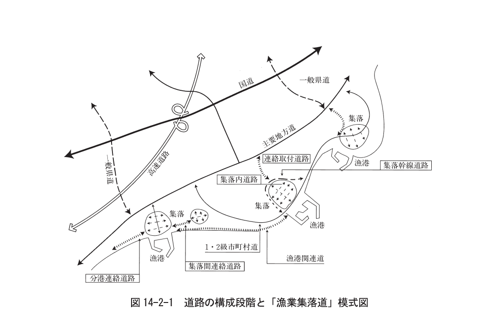

図14-2-1 道路の構成段階と「漁業集落道」模式図

#### 2.1.2 漁業集落道で配慮する条件

**(1) 自然的条件**

漁業集落道の設計にあたっては、地形条件、施工条件を検討するとともに、周辺の生態系、景観に十分配慮した道路構造とするような設計が望ましい。

**(2) 社会的条件**

漁業集落道に関連する社会的な特徴と問題点などは次のとおりである。

&#9312; 漁業就業人口の減少、若年層の流出、高齢化・過疎化

&#9313; 生活圏の拡大

&#9314; 流通の広域化

&#9315; 他産業への兼業機会・就業機会の増大（漁村における混住化と漁業兼業化傾向）

&#9316; 生活意識の向上と生活様式の多様化（海洋性レクリエーション人口の増大とニーズの多様化）

&#9317; 生活の多様化・向上に伴う公共サービス量の増加

**(3) 交通条件**

漁業集落の多くは、過疎地域、辺地地域、離島振興対策実施地域などの条件不利地域に位置し、市町村中心地区から遠方にあり、公共輸送機関の便が悪く、自家用車の利用率が高い状況にある。

近年、自動車交通の発達とそれに伴う生産活動・生活様式の変化により、漁村における所有車両台数は増加している。

#### 2.1.3 漁業集落道の性能規定

> 漁業集落道の性能規定は、「道路」の規定を準用する。

構造に係る基本事項は、「第8編第2章　道路」を参照することができる。ただし、集落の立地特性などに応じた構造としてもよい。

**(1) 幅員**

集落幹線道路や連絡取付道路、集落間連絡道路、分港連絡道路は、原則として緊急車両の通れる車道幅員4m以上の幅員とし、非常の際に十分機能できるものとすることが望ましい。

その他の集落内道路については、自動車が通る道路幅員は原則として車道幅員3m以上（路肩を含めた最小道路幅員 4m）とするが、特に歩行者、自転車の通行のみに供される道路で、集落住民の合意が得られる場合には道路幅員を4m未満とすることができる。

集落道路の整備にあたっては次の各項について留意する。

&#9312; 幅員が4m未満の場合には、50〜100m間隔に待避所（全幅4〜5m、長さ5〜10m程度）を設置することが望ましい。新設道路の幅員は原則として4m以上とするが、歩道、自転車道、通学路はこの限りでない。

&#9313; 連絡取付道路は、通過交通の交通量を増加させないため、それが連絡する主要道路の幅員より狭くすることが望ましい。

&#9314; 集落幹線道路は、乗用車が交差できる4.5m以上とすることが望ましい。

&#9315; 集落住民の合意が得られ一方通行などの交通規制ができる集落内生活道路においても、一車線の幅員は2.75m以上とすることが望ましい。

**(2) 隅切り**

幅員が十分に拡幅できないところでは、車の回転と運転者の視界を助けるための隅切りを行うことを原則とする。

隅切りの必要長さは交通運用上大きい方が望ましく、最小必要値を決めるには条件が多く困難であるが、集落道の場合多くは幅員が狭いため交差角が120°以上のときは隅切りが有効である。また、車の回転を考えると隅切りは円形が望ましい（通常の隅切り半径は、トラック10m、乗用車5mといわれる）。隅切り辺の長さは、表14-2-1を標準とする。

なお、「建築基準法」では隅切り長さを2m以上と規定している。

また、交差角が90°より小さい場合や大きい場合、あるいはその他特別な場合は、周辺の状況を勘案して曲線を挿入することができる。

**表14-2-1 隅切り辺の長さ(a)（m）**

| 一車線の幅員(A) | 3m | 4m | 5m |
|---|---|---|---|
| 3m | 2.0 | 1.5 | 1.0 |
| 4m | 1.5 | 1.0 | 0.5 |
| 5m | 1.0 | 0.5 | 0 |

**(3) 縦断勾配**

漁業集落道の車道の縦断勾配は、該当道路の設計速度に応じ、表14-2-2に掲げる値以下を標準とする。ただし、地形の状況その他の特別な理由によりやむを得ない場合においては、同欄に掲げる値に第3種の道路にあっては3%、第4種の道路にあっては2%を加えた値以下とすることができる。

**表14-2-2 設計速度と縦断勾配 1)**

| 設計速度（km/h） | 60 | 50 | 40 | 30 | 20 |
|---|---|---|---|---|---|
| 縦断勾配（%） | 5 | 6 | 7 | 8 | 9 |

なお、積雪地においては、できるだけ急勾配の値を用いるのは避けるべきであり、一般に最急勾配値でも8%に、冬期交通が多いと予想される場合は6%程度に抑えることを標準とする。

漁業集落のように地形的な制約条件が多い場合、縦断勾配を低く保つことは困難であるが、道路縦断勾配は、曲率半径と並び、交通事故と関係が深く、地形やその他の条件を考慮してなるべく緩やかな値をとることが望ましい。

**(4) 横断勾配**

漁業集落道の横断勾配は、車道、中央帯（分離帯除く）及び車道に接続する路肩には、片勾配を付ける場合を除き、路面の種類に応じ、表14-2-3の右欄に掲げる値を標準とし横断勾配を付けることを標準とする。

**表14-2-3 路面の種類と横断勾配 1)**

| 路面の種類 | 横断勾配（%） |
|---|---|
| セメントコンクリート舗装道 | 1.5以上2.0以下 |
| アスファルト舗装道 | 1.5以上2.0以下 |
| その他 | 3.0以上5.0以下 |

**(5) 曲率半径**

漁業集落道の屈曲部のうち緩和区間を除いた部分（以下「車道の曲線部」という）の中心線の曲線半径（以下「曲線半径」という）は、該当道路の設計速度（A欄）に応じ、表14-2-4の曲率半径のB欄に掲げる値以上を標準とする。ただし、地形の状況その他の特別な理由によりやむを得ないところについては、原則として、同表の曲率半径のC欄に掲げる値まで縮小することができる。

**表14-2-4 設計速度と曲率半径 1)**

| 設計速度（km/h） | A | 60 | 50 | 40 | 30 | 20 |
|---|---|---|---|---|---|---|
| 曲率半径（m） | B | 150 | 100 | 60 | 30 | 15 |
|  | C | 120 | 80 | 50 | | |

**(6) 歩道**

歩道は歩行者のために区画して設けられた集落道の部分であり、歩行者の通行の安全と沿道利用の安全を確保する役割を持っており、原則として歩道の幅員は2m以上とする。地形の状況その他の特別の理由によりやむを得ない場合においては、歩道幅員を2m未満とすることができる。なお、歩行者が余裕を持ってすれ違うことができる幅員は1.5mである。

なお、歩道は歩行者が少なくても、次の区間と道路においては設けることが望ましい。

&#9312; 車の交通量の非常に多い区間

&#9313; 通学路となっている区間

&#9314; 交通事故の発生しやすい区間

&#9315; 公園、広場、公共施設のとりついている道路

&#9316; 住宅や店舗が多くとりつき、沿道利用の多い区間

**(7) 建築限界**

建築限界は、道路上で車両や歩行者の安全を確保するための、一定の空間確保の限界である。したがって、建築限界内には、橋脚や橋台はもとより、防護柵、照明施設、道路標識、信号機、街路樹、電柱などの諸施設を設置することはできない。

漁業集落の道路幅員構成を決定する場合には、各種施設の配置についても建築限界を考慮した検討を十分にしておくことが望ましい。

**(8) 舗装**

漁業集落道の舗装構造は、次の各項を考慮して定めることができる。

&#9312; 交通量が極めて少ない道路では、必ずしも舗装の必要はない。

&#9313; 舗装表面は、すべりにくく、耐久性のあるものにすることを原則とする。特に、坂道や階段道路の場合や寒冷地で凍結の恐れのあるところでは、滑りにくい表面にすることが大切である。

&#9314; 舗装される道路と舗装されていない道路が交差する場合には、舗装される道路面に泥土や砂利などがあまり搬入されず、自動車が円滑に進入できるように取付舗装を行うことが望ましい。

&#9315; 漁業集落の景観形成の観点から、必要に応じて化粧舗装などを導入する。景観形成タイプの舗装方法としては、敷石・タイル舗装・コンクリート平板舗装・インターロッキングブロック舗装など様々な工法や材質が開発されているが、車両通行のある道路については、通行量や通行車両の重量などを考慮して、適切な舗装構造を選定することを原則とする。なお、車両の通行のない集落内道路については、特に、住民のコミュニティ空間確保の観点から対象地区の特性を生かした景観形成タイプの舗装構造を導入してもよい。

&#9316; 下洗いなどに利用されている用水路を持つ道路の舗装に際しては、集落景観を保持する意味から用水路の石積みなどを残すことを検討してもよい。

#### 2.1.4 歩行者専用道路

歩行者専用道路の設計にあたっては、利用実態に応じて歩行者の安全を確保するために必要な構造、配置とすることを原則とする。

歩行者専用道は歩行者の安全を確保するための専用道路であり、車道から完全に独立した集落道である。歩行者専用道路については、利用実態を考慮しつつ、地域幹線道路と交差しないよう配置することが望ましい。

漁業集落では、特に2m以下の路地が日常道路として使用されており、これらの道路を歩行者専用道として整備することが望ましい。

歩行者専用道タイプの漁業集落道の構造は、次の各項を考慮して定めることができる。

&#9312; 歩行者専用道の配置は、集落道のネットワーク形成の中で考慮する。

&#9313; 歩行者専用道の路面仕上げは、歩行者が安全かつ快適に歩行できるような材料を選ぶ。舗装する場合は、アスファルト舗装だけでなく、石張り、平板ブロック、レンガなどの材料から、その機能に適した地域で入手しやすい材料を選び、景観上も十分配慮する。

&#9314; 適当な位置に休憩施設を設ける。

&#9315; 歩行者専用道の斜路の最急縦断勾配の限界を決めることは難しいが、乳母車の通行、歩き良さ、雨や凍結による滑りに配慮し、標準を1/10とする。階段は幼児でも昇降可能にするため、蹴上げ寸法16cm以下、路面寸法26cm以上とすることが望ましい。

#### 2.1.5 排水施設

漁業集落道には、必要に応じて、側溝、暗渠、集水桝などの排水施設を設けることを標準とする。

排水施設の設計にあたっては、道路面の排水機能及び集落全体の体系的な排水機能の確保を図るとともに、空間的価値を助長し漁村のアメニティ形成に資するよう配慮することを原則とする。

なお、4m以上の集落道には、原則として両側に側溝を設けることが望ましい。

#### 2.1.6 付属施設

漁業集落道には、利用上、安全上、地域特性に応じて付属施設を設けることを原則とする。

付属施設としては、防護柵、照明施設、街路樹、安全施設、流雪溝、消雪管などがある。

#### 2.1.7 利用者（高齢者等）への配慮

漁業集落道は、地域住民、漁業従事者、来訪者などが日常生活の中で安全かつ円滑に移動できるようにするために、バリアフリー化を推進し、「人にやさしい」施設づくりを行うことが望ましい。

漁業集落における高齢者や障害者などへの配慮については「第12編　漁港環境整備施設」を参照する。

### 参考文献

1. 日本道路協会：道路構造令の解説と運用，丸善出版（2004）

## 第3章 水産飲雑用水施設

### 3.1 水産飲雑用水施設の要求性能

> 水産飲雑用水施設の要求性能は、漁港及び漁業集落内で使用される生活及び水産用水を供給できるよう適切なものとする。

### 3.2 水産飲雑用水施設の性能規定

> 水産飲雑用水施設の性能規定は、用水の目的に応じて以下に定めるとおりとする。
> 1. 漁港及び漁業集落内で使用される用水を供給できるよう適切に配置され、かつ、所要の諸元を有すること。
> 2. 用水の目的に応じた適切な水質を満足していること。

水産飲雑用水施設の設計にあたっては、自然的条件、社会的条件、集落の形態、産業形態などの設計条件を考慮することを原則とする。

#### 3.2.1 水産飲雑用水施設の概要

水産飲雑用水施設とは、水産業の振興や漁港利用の円滑化などを図るための水産用水と衛生的、近代的な漁村生活を実現するための生活用水を供給する取水施設、導水施設、浄水施設、送水施設、配水施設をいう。

**(1) 対象となる用水**

水産飲雑用水施設の対象となる用水は、水産業の振興、漁港利用の円滑化、衛生的・近代的な漁村生活の実現などのために使用される対象区域内の用水で、図14-3-1のとおり水産用水と生活用水に大別される。

**図14-3-1 水産飲雑用水の種類**

- 水産飲雑用水
  - 水産用水
    - 上水：船舶給水、漁獲物洗浄用水、水産施設・漁船漁具洗浄用水、水産加工用水、冷蔵・冷凍・製氷・貯氷用水等
    - 海水：漁獲物洗浄用水、水産施設・漁船漁具洗浄用水、蓄養用水、種苗生産用水、加工用水等
  - 生活用水
    - 上水：家庭用水、学校等の公共施設、旅館、病院・その他の事業所等の用水

**(2) 対象施設**

水産飲雑用水の対象となる施設は、以下のとおりである。

&#9312; 取水施設（取水堰、集水埋渠、井戸、沈砂池、海水取水施設等）

&#9313; 導水施設（導水渠、導水管、管付帯構造物等）

&#9314; 浄水施設（着水井、沈殿池、ろ過池、浄水池、消毒施設、海水淡水化施設等）

&#9315; 送水施設（送水管、管付帯構造物等）

&#9316; 配水施設（配水池、配水タンク、配水管等）

&#9317; 付帯施設（各施設を補完するポンプ施設、中継ポンプ施設、管理棟、駐車場等）

**(3) 計画目標年次**

「計画目標年次」は、施設の規模算定の目標となるものであり、計画時点より概ね10年後を原則とする。

**(4) 計画策定の手順**

水産飲雑用水施設の基本計画策定の手順は、図14-3-2を参考にするとよい。

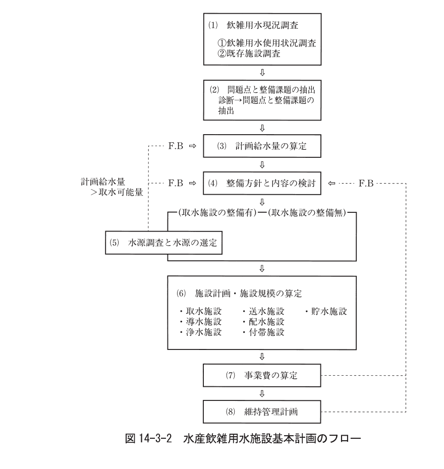

図14-3-2 水産飲雑用水施設基本計画のフロー

**(5) 法令等との関連**

水産飲雑用水施設の計画にあたっては、関連する法令などを遵守しなければならない。特に、生活用水がある場合は、水道法に基づく事業の届出、認可、許可などの所定の手続きを行わなければならない。

水産飲雑用水施設については、「簡易水道」に類似した施設といえ、「簡易水道事業」3)としての認可が必要となる場合もある。

なお、「簡易水道」とは、101人以上5,000人以下を計画給水人口とする小規模な水道と定義されており、その水道事業を「簡易水道事業」といっている。

#### 3.2.2 調査

水産飲雑用水施設の配置、規模の決定にあたっては、飲雑用水の現況、水源について調査することを原則とする。

**(1) 飲雑用水の現況調査**

飲雑用水の現況調査は、飲雑用水の水量の需給関係、水質及び既存水道施設などの整備状況及び施設の現状、整備課題を把握するとともに、計画給水量の算定に必要な資料を得るための調査であり、飲雑用水の対象用途に応じて、表14-3-1の事項について調査を行うことを標準とする。

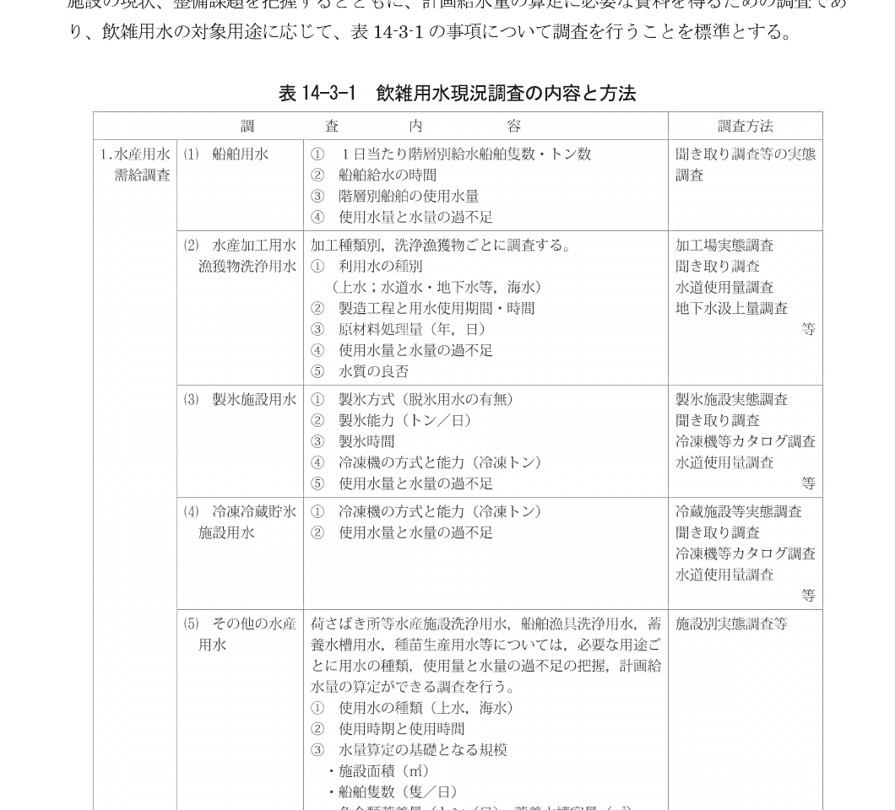

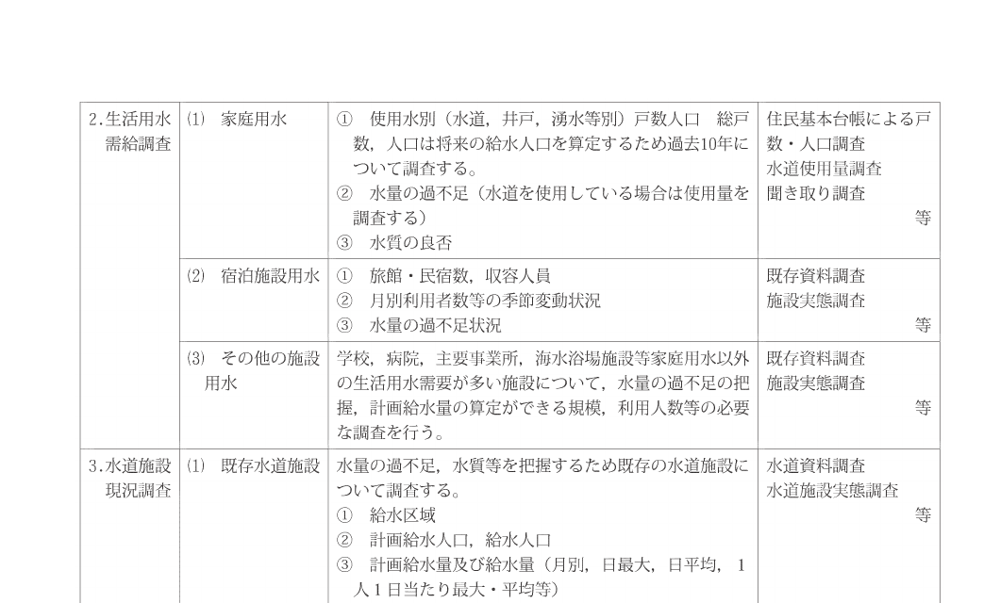

表14-3-1 飲雑用水現況調査の内容と方法

**(2) 水源調査**

水源の種類として考えられるものは、図14-3-3のとおりである。

**図14-3-3 水源の種類**

- 水源
  - 地表水
    - 河川表流水
      - 自流
      - ダム
    - 湖沼・貯水池
  - 地下水
    - 井戸水
      - 浅井戸
      - 深井戸
    - 伏流水
    - 湧水
  - その他（海水、海水淡水化、水道用水供給事業からの受水等）

水源の種類により取水施設、浄水施設などの構造が異なり、それぞれの構造により維持管理費などに大きな差があるので、対象となる水源に応じて十分な調査を行うことが望ましい。

#### 3.2.3 計画諸元

**(1) 計画給水対象**

計画給水対象の決定にあたっては、既設水道などとの統合を含めて検討し、施設の技術上、経済上の両面から合理的な水産飲雑用水施設計画となるよう総合的に検討することを原則とする。

**&#9312; 計画給水区域**

計画給水区域は、水源水量とその給水効果について、技術的、経済的検討を行って定めることを原則とする。また、公害防止などの観点から加工施設などが、集落と分離して立地する事例が増えているが、これらを計画給水区域に含めるかどうかは、経済性などを十分検討して決定することが望ましい。

**&#9313; 水産施設等の計画給水量**

計画給水区域内の水産業の現状を基本として、水産用水を必要とする対象施設などの形態、規模及び能力を把握し、今後の関連計画などを勘案して推計する。

a）水産加工用水、漁獲物洗浄用水に係る原材料は、過去10年程度の推移を基に、今後の水産業振興計画などを勘案して推計する。

b）船舶用水などに係る階層別利用船舶隻数、トン数は、過去10年程度の推移を基に、今後の漁港整備計画などを勘案して推計する。

c）製氷施設用水、冷蔵施設用水などに係る製氷能力、冷蔵・冷凍・貯氷能力は、現在の能力をもとに、今後の施設整備計画などを勘案して推計する。

**&#9314; 計画給水人口 3)**

計画給水区域内の常住人口を基本として、過去10年程度の人口動態に基づいて、計画目標年次における人口を推定し、これに給水普及率を乗じて求めることを原則とする。

計画給水人口は、計画給水区域内人口に計画給水普及率を乗じて決定する。

計画給水普及率は、原則として100%とするが、飲料水確保の状況などを総合的に検討のうえ、90%を限度として下げることができる。

計画給水区域内の常住人口は、通勤人口、観光人口などの移動人口などは含めないで、過去10年程度の人口動態から将来人口を推定する。

将来人口の推定方法には種々の方法があるが、水産飲雑用水施設では年平均人口増減数による手法、又は年平均増減率による手法などが一般的であり、団地などによる社会増は適宜加算することができる。

a）人口の増加が見込める場合

計画時点より目標年次における常住人口に給水普及率を乗じて求める。

b）人口が減少傾向の場合

将来人口の推移、給水開始時期、将来における給水普及率の推移などを勘案し、原則として給水人口が最大となる年次の給水人口を計画給水人口とする。

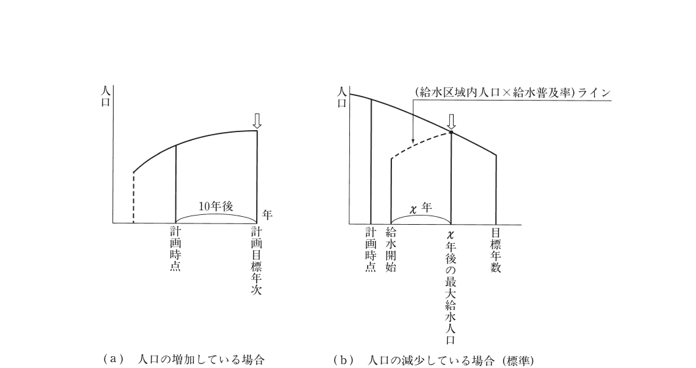

図14-3-4 計画給水人口の考え方

**(2) 計画給水量**

計画給水量は、計画給水対象に応じ必要となる水量を適切に決定することを原則とする。

**&#9312; 水産用水**

計画1日平均給水量は、対象となる水産施設ごとに使用水量の実態を調査して算定する。

水産用水に係る計画給水量は、地域や水産加工における製造方法などによって異なるため、使用実態を調査して算定することが望ましいが、地域特性による差がなく平均的であると判断される場合には、以下の算定方式と原単位を使用してよい。

**a) 水産加工用水**

計画1日平均給水量 ＝ 計画加工原材料（kg/日） × 単位原材料当たり給水量（&#8467;/kg）

**表14-3-2 水産加工用水単位原材料当たりの平均的な給水量 4)**

| 加工の種類 | &#8467;/kg | 備考 |
|---|---|---|
| 乾のり | 15〜20 | 原藻の1次洗浄を除く |
| わかめ（塩蔵わかめ） | 4〜6 | |
| わかめ（板わかめ） | 30〜60 | |
| 塩干品 | 5〜15 | |
| 煮干品 | 1〜3 | |
| 節類 | 3〜6 | 解凍用水を除く |
| 練製品 | 10〜15 | 原魚〜すり身工程 |
| 冷凍食品 | 2〜8 | |
| 水産缶詰 | 5〜7 | |
| 解凍用水 | 1〜3 | タンク貯留式解凍 |

**b) 船舶用水**

船舶用水は、20トン以上の船舶について、計画給水量を算定することを原則とする。

計画1日平均給水量 ＝ 計画利用船舶総トン数（t/日） × 利用船舶単位当たり給水量（&#8467;/t）

船舶トン当たり給水量：60〜80（&#8467;/船舶トン）

なお、魚槽に水産用水を必要とする場合には、魚槽容量、利用船舶隻数を考慮して設定し、上記の船舶用水に加算すること。

**c) 製氷施設用水**

製氷施設用水の給水量 ＝ 製氷原水等用水 ＋ 冷凍機冷却用水

i）製氷原水等

計画1日平均給水量 ＝ 計画製氷能力（t/日） × 製氷当たり給水量（&#8467;/t）

**表14-3-3 製氷用水製氷能力（t）当たり給水量 4)**

| | 給水量 |
|---|---|
| 脱氷用水を要する場合 | 2,000&#8467;/t |
| 脱氷用水を要しない場合 | 1,000&#8467;/t |

ii）冷凍機冷却用水

次項の「冷蔵・冷凍・貯氷施設用水」に準ずる。

**d) 冷蔵・冷凍・貯氷施設用水**

計画1日当たり平均給水量 ＝ 計画冷凍機能力（冷凍トン） × 冷凍機能力単位当たり給水量（&#8467;/日・冷凍トン）

**表14-3-4 冷凍機能力単位当たり給水量 4)**

| 凝縮器方式 | 単位給水量（&#8467;/日・冷凍トン） |
|---|---|
| 横型シェルエンドチューブ方式2馬力 | 約19,000 |
| 〃　3馬力 | 約24,000 |
| 〃　4馬力 | 約31,000 |

**e) その他の水産施設用水**

計画1日平均給水量は、施設内容に応じて適宜設定することを原則とする。

**&#9313; 生活用水 3)**

計画1日最大（平均）給水量は、計画給水人口に計画1人1日最大（平均）給水量を乗じて求める。地方生活基盤整備水道事業では、計画1人1日最大（平均）給水量は315&#8467;（250&#8467;）とし、必要に応じて表14-3-5のとおり家庭用水や家庭以外の施設で使用する水量を加算することができる。

（計画給水量）＝（計画給水人口）×（計画1人1日当たり給水量）＋（加算水量）

（加算水量）＝ &Sigma; \{用途別基本数量&times;1人1日最大（平均）給水量\}

**表14-3-5 生活用水に加算できる1人1日最大（平均）給水量**

（単位：&#8467;/人・日）、（病院の単位：&#8467;/床・日）

| 用途区分 | 基本数量 | 1人1日最大給水量 | 1人1日平均給水量 |
|---|---|---|---|
| 一般 | 計画給水人口1人当たり | 60 | 50 |
| 学校 | 収容人員1人当たり | 125 | 60 |
| 旅館・民宿 | 宿泊収容人員1人当たり | 375 | 250 |
| 官公署 | 常勤職員1人当たり | 150 | 100 |
| 病院 | 病床1床当たり | 560 | 375 |
| その他 | 厚生労働大臣が認めた水量 | | |

**(3) 水質基準**

生活用水を給水する場合には、「水道法」第4条で定められた水質基準を満たすものとする。また、水産用水についても、病原生物による汚染や有害物質を含まず、目的に応じた所要の水質を確保するものとする。

「水質基準に関する省令」（平成15年5月30日厚生労働省令第101号、平成26年2月28日厚生労働省令第15号改正）には、表14-3-6のとおり「水質基準項目と基準値（51項目）」が定められている。また、基準項目のほかに表14-3-7に示した「水質管理目標設定項目と目標値（26項目）」、さらに「要検討項目と目標値（47項目）」についても定められている。

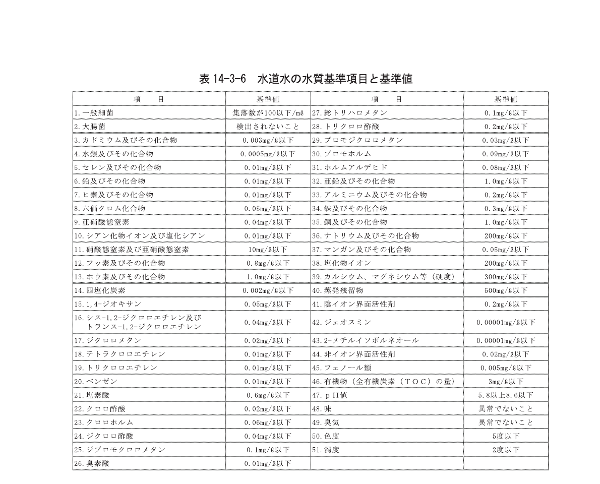

表14-3-6 水道水の水質基準項目と基準値

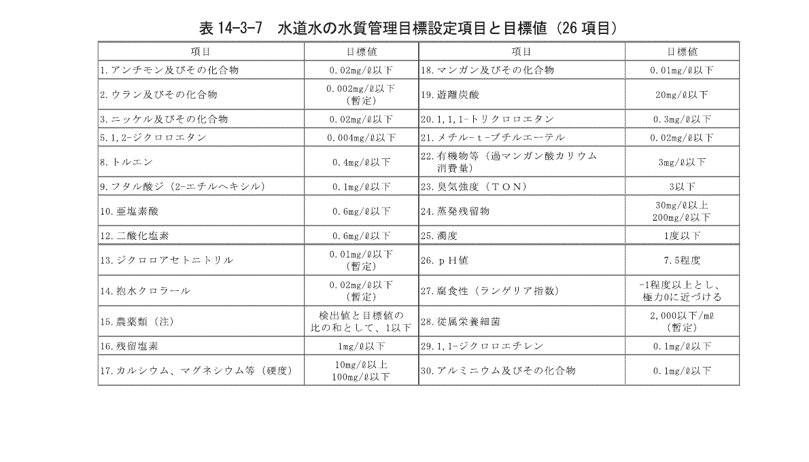

表14-3-7 水質管理目標設定項目と目標値

#### 3.2.4 設計の基本方針

水産雑飲用水施設の設計にあたっては、「水道法」（昭和32年法律第177号）及び「水道施設の技術的基準を定める省令」（平成12年厚生省令第15号）並びに「水道施設設計指針」1)及び「水道施設耐震工法指針・解説」2)に準じることを原則とする。

水産飲雑用水施設は、原水の質及び量、地理的条件、当該水道の形態などに応じて、取水施設、導水施設、浄水施設、送水施設、配水施設及び付帯施設の全部又は一部を有すべきものとし、衛生的かつ必要な水量を安定的に供給できるものを原則とする。

水産飲雑用水施設の一般的な構成は、図14-3-5のとおりである。

**図14-3-5 水産飲雑用水施設の構成**

取水施設（取水堰、取水塔、井戸、湧水取水施設、海水取水施設、沈砂池） &rArr; 導水施設（導水渠、導水管） &rArr; 浄水施設（着水井、沈殿池、ろ過池、浄水池、消毒施設、淡水化施設） &rArr; 送水施設（送水ポンプ、送水管） &rArr; 配水施設（配水管、配水池、配水タンク）

&#9312; 取水施設は、できるだけ良質の原水を必要量取り入れることができるものであることを原則とする。

&#9313; 導水施設は、必要量の原水を送るのに必要なポンプ、導水管その他の設備を有することを原則とする。

&#9314; 浄水施設は、原水の質及び量に応じて、水質基準に適合する必要量の浄水を得るのに必要な沈殿池、ろ過池その他の設備を有し、かつ、消毒施設を備えていることを原則とする。

&#9315; 送水施設は、必要量の浄水を送るのに必要なポンプ、送水管その他の設備を有することを原則とする。

&#9316; 配水施設は、必要量の浄水を一定以上の圧力で連続して供給するのに必要な配水池、ポンプ、配水管その他の設備を有することを原則とする。

&#9317; 水産飲雑用水施設の各施設の位置及び配列の決定にあたっては、その敷設及び維持管理ができるだけ経済的で、かつ、容易になるようにするとともに、給水の確実性も考慮することを原則とする。

&#9318; 水産飲雑用水施設の構造及び材質は、水圧、土圧、地震力その他の荷重に対して十分な耐力を有し、かつ、水が汚染され、又は漏れる恐れがないものであることを原則とする。

#### 3.2.5 施設構造の設計条件

水産飲雑用水施設の構造は、設計外力、水密性、耐久性、維持管理性を考慮して定めることを原則とする。

**(1) 設計外力**

&#9312; 水産飲雑用水施設は、自重、積載荷重、水圧、土圧、風圧、地震力、積雪荷重、氷圧、温度の影響及び浮力など、荷重や作用に対して構造上安全で、かつ経済的、耐久的であることを原則とする。設計にあたっては、施工中及び完成後に作用する荷重及び作用を適切に組み合わせて行うことが望ましい。

&#9313; 地下水位の高い場所に設置される池状構造物は、空にした場合の浮力を考慮することを原則とする。

&#9314; 寒冷地で地中構造物を設計する場合は、地下凍結及び凍上を考慮することを原則とする。

&#9315; コンクリート及び鉄筋コンクリートは、その使用材料、施工条件、環境などに配慮し、鉄筋の腐食、コンクリートのひび割れなどによる早期劣化を抑制する適切な対策をとることを原則とする。

&#9316; 鋼構造物の部材は、なるべく簡単な構成で、構造もできるだけ単純であることを原則とする。

**(2) 水密性**

水産飲雑用水施設は、漏水がなく、かつ、外部からの汚染の恐れのない構造とし、材料の選択、施工などについても注意して衛生的で水密性の高いものとすることを原則とする。

**(3) 耐久性**

&#9312; 水産飲雑用水施設は、塩素や凝集剤などの薬品によって腐食を受ける恐れ又は水流や機械設備などにより磨耗する恐れがあるので、材料の選択、設計及び施工などに十分配慮して、必要に応じ耐食性、耐磨耗性のものとすることが望ましい。

&#9313; 海岸周辺にある水産飲雑用水施設については、コンクリートの劣化や機器及び材料の腐食を早めるなどの塩害が生じやすい。これらを防止又は軽減するため、環境条件に対応した鉄筋コンクリートの設計、耐食性金属及び塗装の選択など、適切な塩害対策を施し耐久性を確保することが望ましい。

**(4) 維持管理性**

水産飲雑用水施設は、土木、建築、機械、電気などの設備が一体となるものが多い。したがって、各関係設備間の調整を十分に行い、それぞれの機能や維持管理に支障のない構造とするとともに、将来の改良や更新にも対応できるようにスペースや強度などにも配慮することが望ましい。

#### 3.2.6 資機材の選定

水産飲雑用水施設に使用する資機材は、耐久性、水質への悪影響、維持管理を考慮して選定することを原則とする。

水産飲雑用水施設に使用する機器及び資材の選定にあたっては、長期にわたって施設の機能を確保できることを基本とし、併せて施工性、経済性について配慮することが望ましい。

また、水産飲雑用水の安全と水産飲雑用水施設の耐久力を確保するために、施設に用いる資機材や、浄水処理などに用いる薬品について慎重に検討することを原則とする。

このため、資機材及び薬品の選定に当たっては、「技術的基準を定める省令」に適合していることを確認するものとする。

### 3.3 取水施設

取水施設は、良質の水を必要な量だけ安定的に取水でき、また維持管理が容易に行えるように配慮されたものとすることを原則とする。

取水施設の計画にあたっては、水源の特性に応じた適切な取水方法、施設の選定を行うことが望ましい。

&#9312; 取水施設は、水源の種類にかかわらず年間を通じ計画取水量を確実に取水できるものとすることを原則とする。特に水源が河川の場合、洪水時や渇水期又は河床の変動による影響がないよう考慮することが望ましい。

&#9313; 取水施設は、水質が良好であって、将来も汚濁のない地点に設置する必要があるので、下水その他汚水の流入地点や淡水取水の場合は海水の遡上しない地点に設置することを原則とする。

&#9314; 取水施設は、維持管理が安全かつ容易であり、常に安定的に取水できる機能を有していることを原則とする。また、将来の拡張性について配慮することが望ましい。

&#9315; 地表水を水源とする取水施設は、通常河川法第24条及び第26条の許可が必要であるので、その設置にあたっては、構造及び設置場所など事前に河川管理者と十分協議することが望ましい。

#### 3.3.1 計画取水量

計画取水量は、水源の種類、浄水方法などを考慮して設定することを原則とする。

**(1) 計画取水量 3)**

計画取水量は、水源が、湧水、伏流水、地下水で原水の水質が良好であり、塩素消毒のみで給水できる場合は、作業用水が不必要であり導水ロスも無視できるので、原則として計画1日最大給水量を基準とする。

ただし、表流水や地下水を取水し塩素消毒以外の浄水施設を有する場合、すなわち沈殿池、ろ過池、除鉄・除マンガン装置のいずれかを有する場合には、ろ過池の浄水用水など浄水管理に必要な用水及び取水から浄水池に至る間のロスも考慮し、計画取水量は計画1日最大給水量の10%増を標準とする。

**(2) 井戸の揚水量 3)**

地下水又は伏流水を取水するための井戸の揚水量は、渇水期における限界揚水量の50%を標準とする。

地下水は、雨水などの地表水が地中に浸透し貯留されたものであり、浸透量は季節により変動する。浸透量を超えて揚水すれば地下水量は減少し将来必ず水量不足をきたすことになることから、計画取水量がいつでも十分に確保できるように配慮することが望ましい。

#### 3.3.2 取水施設の選定

取水施設は、水源の種別に応じ取水地点の状況、取水量の大小などを考慮して、取水堰、取水塔、取水管渠、取水枠、集水埋渠、浅井戸、深井戸などの中から最も適切なものを選定することを原則とする。

取水施設の種類は、河川水、湖沼水、ダム水、地下水など水源の種類に応じて異なるので、その選定にあたっては、水源の種別、取水地点の状況、取水の大小、施工条件及び河川法などによる制限などについて十分調査検討することが望ましい。取水施設の概念図は、図14-3-61)のとおりである。

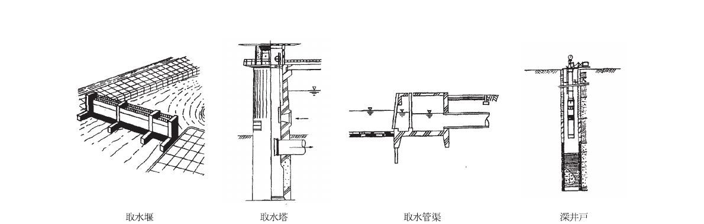

図14-3-6 取水施設の概念図

海水を取水する場合には、波浪・潮位の影響、貝藻類などの付着生物の影響、塩害、漁場利用、その他海域利用などを考慮することが望ましい。

### 3.4 導水施設

導水施設は、取水施設の水を確実に導水できる管径及び流速を確保することを原則とする。また、導水方法は、設置場所の地勢や利用条件及び経済性、維持管理費などを総合的に検討して決定することが望ましい。

導水施設は、取水施設から浄水施設まで原水を導く施設であり、導水渠及び導水管がある。

#### 3.4.1 計画導水量

計画導水量は、計画取水量を確実に導水できるよう決定することを原則とするが、将来の取水増が見込まれる場合はこれを配慮してもよい。

#### 3.4.2 管径及び流速

導水渠及び導水管の管径は、水位差と平均流速を検討して決定する。平均流速の計算は、一般に導水渠の場合はマニングの式、導水管の場合はヘーゼン・ウィリアムスの式が用いられる。

導水渠の場合、平均流速が最大許容限度以上（水路内面状態がモルタル又はコンクリートのときは3.0m/s、鋼、鋳鉄又は硬質塩化ビニルのときは6.0m/s）となれば、適当な箇所に落差工、又は急流工などの設備を設け、逆に0.3 m/s以下の場合には、ポンプの使用を考慮しなければならない。

導水管の平均流速の最大限度は表14-3-8のとおりであり、最小限度は管内に砂が堆積しない流速（0.3 m/s）とすることを原則とする。

**表14-3-8 導水管の平均流速の最大限度**

| 導水管内面の状態 | 平均流速の最大限度（m/s） |
|---|---|
| モルタルまたはコンクリート | 3.0 |
| モルタルライニングシールコート管・装管・鋳鉄または硬質塩化ビニル | 5.0 |

#### 3.4.3 導水方法

導水方法には自然流下式とポンプ圧送式がある。自然流下式は、自由水面を持つ流下方式であり一般に導水路が長くなり建設費は高くなるが、導水の安定性、操作の容易さなどの利点がある。ポンプ圧送式は、導水路が短くなり建設費は節減できるが、自然流下式に比べ操作が複雑で故障時・停電時に対応して予備動力・予備電源の確保も必要である。導水方法の選定にあたっては、経済性、維持管理の難易などについて総合的に検討して決定することが望ましい。

### 3.5 浄水施設

浄水施設は、原水の水質、水量に応じて適切な浄水が行われるとともに水質の安全性が損なわれない施設とすることを原則とする。

浄水施設は、取水施設より導かれた原水を所要の水質に適合した清浄な水として生み出す重要な施設である。浄水施設に導かれた原水は、水源の種類や状況により水質が異なっており、所要の水質を得るために適した浄水方法、施設内容とすることを原則とする。生活用水を給水する場合には、水道法に定められた水質基準に適合するものとし、水産用水についても、病原生物による汚染や有害物質を含まず、目的に応じた所要の水質を確保することを原則とする。

#### 3.5.1 計画浄水量

計画浄水量は、計画1日最大給水量を標準とし、これに作業用水などを見込んで決定することを原則とする。

浄水施設では、沈殿池の排泥用水、ろ過池の洗浄又は洗砂用水、薬品溶解水、塩素注入用圧力水、機器の冷却水及び施設の清掃用水などの作業用水が必要である。計画浄水量は、このような作業用水及び損失水量を考慮して決定することを原則とする。

施設の改良、更新、災害時などにおいて長期にわたり浄水能力が低下する場合においても飲雑用水の供給は欠くことのできないものであり、このような場合に対応できるよう予備力を有することが望ましい。

漁業集落で多いとみられる1系列か2系列しかないような小規模な場合は、1系列分を上乗せするのは過大となることから、沈殿池には傾斜板を備えたり、ろ過池では2槽ろ過が行えるようにし、簡単に能力を高められるようにしておくことにより予備力を生み出すように努めることが望ましい。

#### 3.5.2 浄水方法の選定

浄水方法は、原水水質、浄水水質の管理目標、建設費、維持管理費用などについて考慮することを原則とする。

主な浄水方法には、消毒のみの方法、緩速ろ過方式、急速ろ過方式、膜ろ過方式1)などがある。

ただし、原水の水質によっては、以下の4方式の処理フロー図に必要に応じて高度浄水施設などを加えることを原則とする。また、除鉄、除マンガンを目的とする場合以外は、急速ろ過法は避けることを原則とする。

**(1) 消毒のみの方法**

この方法は、一般に水質が良好な地下水を水源とする場合に適しており、大腸菌群50（100ml、MPN）以下、一般細菌500（1ml）以下、その他の項目も水質基準などに常に適合する場合に採用することができる。

処理フローは、図14-3-7のとおりである。

**図14-3-7 消毒のみの方式の浄水フロー図**

原水 &rarr; 着水井 &rarr; 塩素注入井（&uarr;塩素注入） &rarr; 浄水池（配水池） &rarr; 送水

**(2) 緩速ろ過方式**

この方式は、緩速ろ過池で砂層と砂層表面に増殖した微生物群によって水中の不純物を補足し酸化分解する方式である。地下水、富栄養化の進んでいないダム、湖沼、河川など原水水質が比較的良好で、大腸菌群1,000（100ml、MPN）以下、生物化学的酸素要求量（BOD）2mg/&#8467;以下、最高濁度10度以下の場合に採用することができる。

処理フローは、図14-3-8のとおりである。

**図14-3-8 緩速ろ過方式の浄水フロー図**

原水 &rarr; 着水井 &rarr; 普通沈殿池（&darr;薬品処理可能な沈殿池） &rarr; 緩速ろ過池（&uarr;薬品注入）（&uarr;塩素注入） &rarr; 塩素注入井 &rarr; 浄水池（配水池） &rarr; 送水

**(3) 急速ろ過方式**

この方式は、急速ろ過池で原水中の汚濁物を薬品によって凝集させてから分離する方式である。消毒のみの方法、緩速ろ過方式では、基準水質が確保できない場合に採用される。この方式は、前処理として薬品による凝集が必要不可欠かつ極めて重要であり、維持管理に高度の熟練と細心の注意が必要である。

処理フローは、図14-3-9のとおりである。

**図14-3-9 急速ろ過方式の浄水フロー図**

原水 &rarr; 着水井 &rarr; 凝集池（&uarr;薬品注入 &rarr; 混和池） &rarr; 薬品沈殿池（&darr;高速凝集沈殿池） &rarr; 急速ろ過池 &rarr; 塩素注入井（&uarr;塩素注入） &rarr; 浄水池（配水池） &rarr; 送水

**(4) 膜ろ過方式**

膜を炉材として水を通し、原水中の不純物を分離除去して清澄なろ過水を得る浄水方法である。不純物の分離粒径や分子量の大きさにより、精密ろ過膜（MF膜）、限外ろ過膜（UF膜）、ナノろ過膜（NF膜）があり、高度浄水処理として用いられる。

処理フローは、図14-3-10のとおりである。

**図14-3-10 膜ろ過方式の浄水フロー図**

原水 &rarr; 着水井 &rarr; 前処理装置 &rarr; 膜ろ過設備（&darr;排水処理設備 &rarr; 処分） &rarr; 後処理設備 &rarr; 塩素注入井（&uarr;塩素注入） &rarr; 浄水池（配水池） &rarr; 送水

水産飲雑用水は小規模なものが多く一般に高度な管理が難しいので、できるだけ維持管理が容易で安全性の高いことに主眼をおき、急速ろ過法はできるだけ避け、緩速ろ過方式を採用できる原水を確保することが望ましい。

なお、特殊な処理を必要とする場合は表14-3-9を参考に処理することを原則とする。

**表14-3-9 処理対象物質と処理方法**

| 処理対象物質 | 処理方法 |
|---|---|
| 臭気 | &#9312;エアレーション　&#9313;生物処理　&#9314;活性炭処理　&#9315;オゾン処理 |
| トリクロロエチレンなど | &#9312;ストリッピング処理　&#9313;活性炭処理 |
| アンモニア性窒素 | &#9312;塩素処理　&#9313;生物処理 |
| トリハロメタン | &#9312;中間塩素処理　&#9313;総合塩素処理　&#9314;活性炭処理 |
| 鉄・マンガン | &#9312;前塩素処理　&#9313;鉄バクテリア利用法　&#9314;マンガン接触ろ過　&#9315;エアレーション |
| 陰イオン界面活性炭 | &#9312;生物処理　&#9313;活性炭処理　&#9314;オゾン処理 |
| 色度（フミン質） | &#9312;活性炭処理　&#9313;オゾン処理 |
| 侵食性遊離炭酸 | &#9312;エアレーション　&#9313;アルカリ剤処理 |
| 生物 | &#9312;マイクロストレーナ　&#9313;多層ろ過　&#9314;二段凝集処理　&#9315;薬品処理 |

#### 3.5.3 浄水施設の設計

浄水施設の設計にあたっては、配置、浄水方法、必要な施設規模、浄水性能、水質管理、維持管理、災害時などの安全対策などについて考慮することを原則とする。

浄水施設の設置場所や施設内容は、建設、維持管理費用や、災害時などの安全性確保、水質管理や施設の維持管理の容易さに影響するため、これらの点を総合的に検討して決定することが望ましい。

浄水施設は、着水井、沈殿池、ろ過池、浄水池、消毒施設などより構成されているが、それぞれの施設の設計にあたっての基本的考え方は以下のとおりである。

**(1) 着水井及び沈殿池**

**&#9312; 着水井**

着水井は、導水施設から流入する原水の勢いを弱め、水量の調整を確実に行えるようにするため設置するものである。着水井の滞留時間は1.5分以上、水深は3.0〜5.0m程度が望ましい。

**&#9313; 沈殿池**

沈殿池は、原水中の濁物その他の物質を除去し、ろ過池への流入水質の安定化を図り、ろ過池への負荷を軽減する機能を有するものであり、普通沈殿池と薬品沈殿池がある。

池数は、清掃、点検及び修理などを考慮して原則として2池以上とし、独立して使用可能な構造が望ましい。ただし、清掃などが短時間なら沈殿池を経由しなくてもろ過池の機能が果たせる場合には、1池でもよい。

池の形状は長方形とし、沈殿部の長さは幅の3〜8倍を標準とする。

有効水深は2〜4m程度とし、堆泥深さを30cm以上見込み、高水位から天端までの余裕高は30cmを標準とする。

普通沈殿池内の平均流速は0.3m/min以下、薬品沈殿池内の平均流速は0.4m/min以下を標準とする。

**(2) ろ過池**

ろ過池は、ろ材を用いて水を浄化する施設であり、緩速ろ過池と急速ろ過池がある。ろ過池の池数は、予備池1池を含めて2池以上とすることを原則とする。

ろ過速度は、緩速ろ過池においては4〜5m/日、急速ろ過池においては120〜150m/日を標準とする。

ろ過面積は計画浄水量をろ過速度で除して求め、急速ろ過池の1池のろ過面積は150m2以下とする。緩速ろ過池の深さは2.5〜3.5mを標準とする。

**(3) 浄水池**

浄水池は、浄水ポンプ又は自然流下により送水する際に、停電や需要量の急変などにより生じるろ過水量と送水量との間の不均等を調整緩和する役目を持つ貯留池である。浄水池の有効容量は、計画1日最大給水量の1時間分を標準とする。また、池数は原則として2池以上とする。

**(4) 消毒施設**

消毒施設は、水産飲雑用水が常に衛生的で安全でなければならないため、浄水方法や施設規模の大小にかかわらず浄水処理過程の最終段階に設置することを原則とする。また、配水系統中においても安全性の確保が図られるよう消毒を行うことを原則とする。

消毒方法としては、水道法施行規則第17条において「給水栓における水が、遊離残留塩素を0.1mg/&#8467;（結合残留塩素の場合は0.4mg/&#8467;）以上保持するよう塩素消毒すること。」と規定されている。また、厚生省通知により「水の消毒は、塩素によるものとする。」と定められている。

### 3.6 送水施設

送水施設は、計画送水量を安定して送水できる管径及び流速を確保するものとすることを原則とする。また、計画送水量は、原則として計画1日最大給水量を標準とする。

送水施設は、浄水施設で塩素消毒した清浄な水を浄水池から配水池に送水する施設であり、一般に送水ポンプ、送水管などにより構成されている。送水方式は図14-3-11のとおりである。

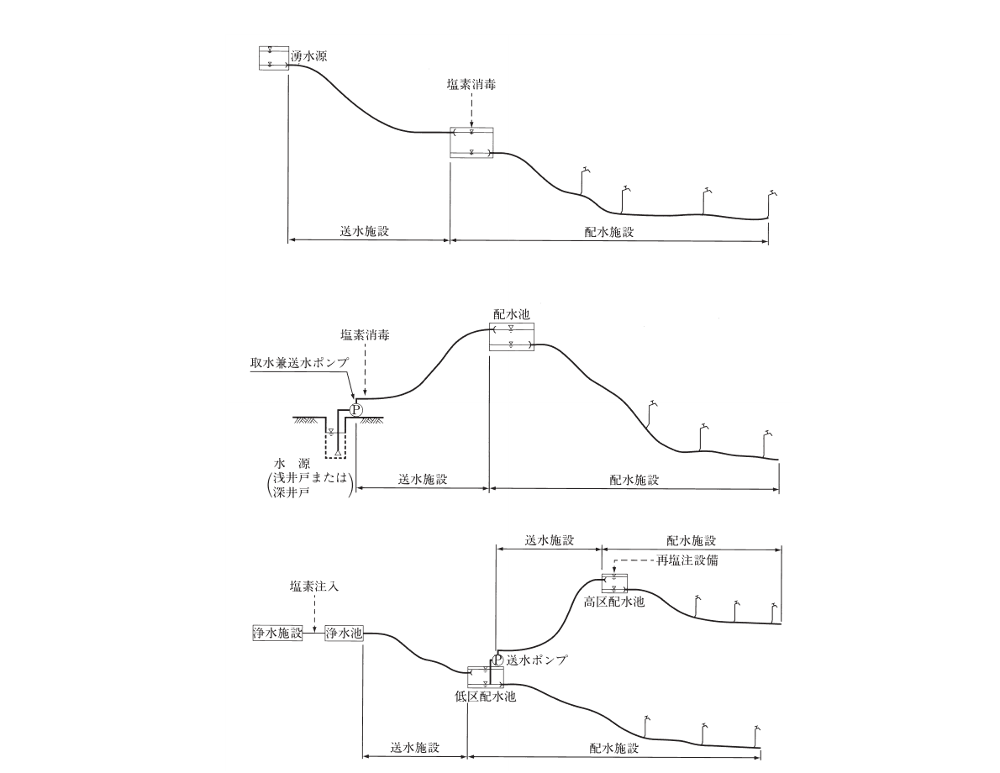

図14-3-11 送水方式の例

送水方式は、浄水場と配水池との高低関係、計画送水量、路線の立地条件などを総合的に検討して決定することを原則とする。

送水管の管径及び流速の考え方は、原則として導水施設に準じるものとする。

### 3.7 配水施設

配水施設は、給水が集中する季節や時刻においても安定した給水量を保ち、また、火災時の消火用としての機能が果たせる施設とすることを原則とする。

配水施設は、浄水された清浄な水を給水対象の住宅や施設に給水する施設であり、配水池、配水管により構成される。配水施設の計画にあたっては、計画給水量を基に計画配水量及び計画配水圧を定め、適切な配水方式及び施設規模、構造を決定することを原則とする。

配水施設の概要は図14-3-12のとおりである。

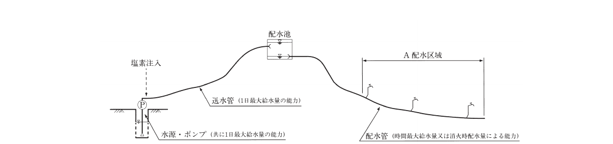

図14-3-12 配水池の例

#### 3.7.1 計画配水量及び計画配水圧

計画配水量は、平常時においては、時間最大給水量、火災時においては、計画1日最大給水量の1時間当たりの水量と1時間当たりの消化用水量を加算した水量とし、平常時、火災時のいずれか大きい方の水量とすることを原則とする。

**(1) 計画配水量**

**&#9312; 平常時**

平常時の計画時間最大給水量は、計画1日最大給水量を基に、生活用水の時間最大給水量と水産施設の使用状況を考慮して決定することを原則とする。

水産用水の時間最大給水量は、各施設の稼働時間に応じて時間最大比を設定し、各施設の日最大給水量の1時間量に乗じたうえで全ての水産施設の時間最大給水量の合計とすることを原則とする。すなわち各施設の用水の使用時間をx時間とした場合、時間最大比は24/x倍となり、

水産用水の時間最大給水量 ＝ &Sigma;（施設別時間最大比）&times;（施設別日最大給水量/24）

となる。

生活用水の時間最大給水量は、1日最大給水量に図14-3-133)より求めた時間最大比を乗じて算定することを標準とする。

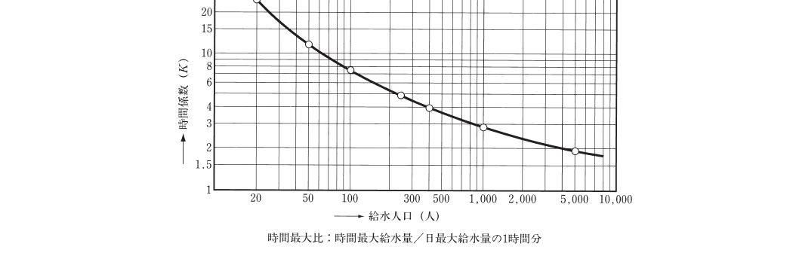

図14-3-13 給水対象人口−時間最大比

**&#9313; 消火用水量**

消火用水量は、消火栓1栓の放水量1m3/分、同時に開放する消火栓数1栓を標準として決定することを標準とする。ただし、特殊な気象条件あるいは家屋の密集度が高い区域については2栓を限度として増加してもよい。また、気象条件、当施設以外の消防水利、消防ポンプ能力などを考慮して上記標準による必要がない区域については、表14-3-103)によることができる。

**表14-3-10 消火栓と使用水量**

| 使用する消火栓 | 使用水量 |
|---|---|
| 双口消火栓　65mm | 1.00m3/分 |
| 単口消火栓　65mm | 0.50m3/分 |
| 小型消火栓　50mm | 0.26m3/分 |
| 小型消火栓　40mm | 0.13m3/分 |

火災時には、一時に多量の水を火災地点に集中させる必要があるので、特別に考慮することを原則とする。1時間最大給水量時に火災が発生した場合を考えて計画給水量とすれば最も理想的であるが、管径が大となり不経済な計画となるので、1日最大給水量の1時間当たりの水量に適当な消火用水を加算し、火災があっても計画時間最大給水量時を除けば十分消火の目的を達し支障がないものと考えて火災時の計画配水量を設定している。

**(2) 計画配水圧**

配水管の最小動水圧は、平常時0.15MPa以上を標準とするが、区域内の一部がこれを下回ることはやむを得ない。また、最大静水圧は、原則として0.74MPaを超えないものとするが、区域内の一部の静水圧が許容最大静水圧の範囲内で大きくなることはやむを得ない。

#### 3.7.2 配水方式の選定

配水方式は、高所に配水池を設けて、自然流下によって配水する方法（配水池方式）が望ましいが、適当な高所がない平坦な区域においては、高架タンク方式や圧力タンク方式によって配水調整を行うことを原則とする。

水産飲雑用水は、一般に時間変動が激しい給水パターンになることが多く、給水量及び給水圧の安定のために配水施設でのポンプ使用はできるだけ避けて、十分な容量を持った配水池を高所に設ける自然流下式が最良である。

高架タンクは、大容量のものを作ると建設費が増大するので主として水圧調整を目的として設置するものとし、その有効容量は時間最大給水量の30分間分を標準とすること。

圧力タンクは、貯留を目的としたものではなく主としてポンプの制御装置又は配水管を常に有圧状態に保つことを目的に設置するものとし、その有効容量は時間最大給水量の10分間分を標準とすること。

#### 3.7.3 配水池

配水池の有効容量は、水産用水及び生活用水の必要有効容量に消火用水量を加算したものを標準とする。また、配水池は、衛生的で耐久性かつ水密性を有するものとすることを原則とする。

一般に給水量は、昼間の使用量が大きく夜間の使用量が少ないが、水道の主要施設は1日最大給水量で設計されているため、使用のピーク時には送水量が不足するが夜間には余剰がある。このため、配水池は、浄水量と配水量、1日最大給水量と時間最大給水量の時間的調整を行い、常に所要の水量を供給できるようにするための施設である。

水産用水のための有効容量は、水産用水の日最大給水量から使用時間における送水量を差し引いたものとすることを原則とする。すなわち、日最大給水量&times;（24−施設使用時間）/24 となる。

生活用水は表14-3-113)を標準とする。

**表14-3-11 計画給水人口と配水池の有効容量**

| 計画給水人口 | 配水池の有効容量 |
|---|---|
| 3,000人以上 5,000人未満 | 1日最大給水量の13時間分＋消火栓1栓の1時間放水量 |
| 2,000 〜 3,000 | 14時間分 + 1栓 |
| 1,000 〜 2,000 | 16時間分 + 1栓 |
| 500 〜 1,000 | 18時間分 + 1栓 |
| 300 〜 500 | 20時間分 + 1栓 |
| 100 〜 300 | 22時間分 + 1栓 |
| 〜 100 | 24時間分 + 1栓 |

#### 3.7.4 配水管

配水管は、内圧及び外圧に対する安全性、管径との関連、埋設条件、施工性、水質に対する影響などに配慮して決定することを原則とする。

配水管の管種選定にあたっては、内外圧に対して十分安全なことはもちろん、埋設環境に適した施工性を有し、将来とも水質に悪影響を与えないものでなければならないが、日本工業規格などで規格化されているので使用条件に応じて適切な規格品を用いることが望ましい。

### 3.8 ポンプ設備

ポンプ設備の設計にあたっては、安定した給水を確保するため、使用目的、設置場所、水質、水量などに適切に対応できるよう考慮することを原則とする。

ポンプ設備は、計画水量や計画水圧を満足するものでなければならないが、水産飲雑用水施設の中で最も多くの動力を必要とし、浄水場やポンプ場では全体の運転経費に占める比率が大きいので、経済運転を念頭においた設計を行うことが望ましい。なお、詳細については、「水道施設設計指針」1)を参考とする。

### 参考文献

1. 日本水道協会：水道施設設計指針，日本水道協会（2012）
2. 日本水道協会：水道施設耐震工法指針・解説，日本水道協会（2009）
3. 全国簡易水道協議会：水道事業実務必携，全国簡易水道協議会（2014）
4. 全国漁港協会：漁業集落環境整備事業計画策定の手引，全国漁港協会（1995）
