# 第25編 魚礁

## 第1章 魚礁の基本的事項

### 1.1 魚礁の目的

> 魚礁の目的は、対象生物の漁獲の増大、漁業の効率化及び保護育成を図ることを基本とする。

### 1.2 魚礁の要求性能

> 魚礁に共通する要求性能は、対象生物の分布・行動等の生態及び漁業の実態を考慮し、造成漁場の効率的な利用や的確な管理が行われるよう適切であることとする。

魚礁とは、一般に天然礁と人工魚礁を指すが、本書においては、水産基盤整備事業で整備される人工魚礁を単に魚礁と称する。

魚礁は、設置海域の生物的な条件、波・流れ、地形、底質などの物理的条件、その海域で行われている漁業の種類などによって、適切な施設の構造、材質、規模、配置などが異なるため、地域の特性を考慮して照査を行うことを原則とする。

### 1.3 性能照査の基本

#### 1.3.1 機能と種類

魚礁の性能照査では、対象生物の生態及び、効率的な利用や管理に適した形状と大きさの組み合わせを評価するとともに、設置場所において適切に設定された波、流れ、風等の条件に対して魚礁の基本形状が維持されるよう、部材及び魚礁全体の安全性を検討することを原則とする。

魚礁には大別すると、海底に設置される重力式構造物である沈設魚礁と、海底に係留される浮体式構造物である浮魚礁がある。

#### 1.3.2 照査の手順

魚礁の照査の手順は、図 15-1-1 のとおりである。

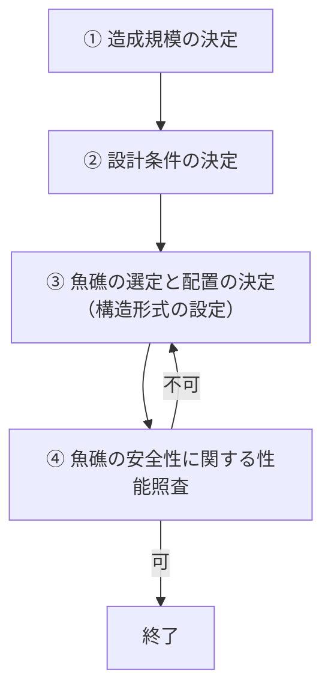

図 15-1-1 魚礁の照査の手順

① 造成規模の決定

対象魚種について、計画漁獲量の魚類を蝟集、増殖させるために必要な魚礁の規模を決定する。

② 設計条件の決定

「本編第2章 沈設魚礁」及び「本編第3章 浮魚礁」を参照する。

③ 魚礁の選定と配置の決定

対象魚種、対象漁法、漁業形態、造成海域の自然条件と施工方法、材料特性等を考慮して、適切な構造の魚礁を選定するとともに、適切な配置を決定する。

④ 魚礁の安全性に関する性能照査

「本編第2章 沈設魚礁」及び「本編第3章 浮魚礁」を参照する。

魚礁の照査の手順のうち、「①造成規模の決定」、「②魚礁の選定の配置の決定」については、「人工魚礁造成計画指針」1)を参照することができる。

**（参考文献）**

1）沿岸漁場整備開発事業　人工魚礁造成計画指針, 社団法人 全国沿岸漁業振興協会（2000）, 226p.

---

## 第2章 沈設魚礁

### 2.1 沈設魚礁の要求性能

> 沈設魚礁の要求性能は、構造形式に応じて、以下の要件を満たしていくこととする。
>
> 1. 対象生物に対して蝟集効果を発揮できるよう、対象生物の生理・生態に合わせて、餌場、産卵場、生息場等として機能できるよう適切なものとする。
> 2. 波、流れ等の作用に対して構造上安全なものとする。
> 3. 洗掘、埋没又は沈下により設計対象施設の機能が低下しないよう考慮する。

沈設魚礁には、主に物陰に隠れる性質のある魚介類の隠れ場や、小型の魚類が大型捕食魚から逃げ込むための逃避場としての機能、魚礁の部材表面が付着生物の付着基質となったり、石材や多孔質等の比表面積の大きい部材を用いることで潜孔性餌料生物が増殖したり、あるいは魚礁が流れを弱め、遊泳力が比較的弱い動物プランクトンが蝟集する場を提供したり、デトリタス、泥・シルトなどの細粒分が堆積し、その結果、多毛類や二枚貝類などの砂泥性底生動物が増殖したりする機能（餌料生産機能）がある。沈設魚礁は、これらの機能を通じて、水産生物を増殖、蝟集させるが、後者の餌料生産機能は、一般には魚礁設置後の経過年数とともに強化され、ある期間を経て「成熟」した魚礁になる。また、沈設魚礁による生物生産効果や水産生物の蝟集効果は、その設置場所の環境に依存する。沈設魚礁の構造と規模を決定する際には、上記の魚礁の機能の発現機構を考慮するとともに、過去又は近隣の事例に基づいた検討を行うことを原則とする。

沈設魚礁が上述の機能を発揮、維持するためには、設計供用期間にわたりその形状と空間構造が維持されることを標準とする。沈設魚礁は、一般に陸上で製作した魚礁を吊り上げて台船に載せ、船上から吊り下ろして海底に設置される。大型の鋼製魚礁などの骨組構造物では、吊り上げ部位に非常に大きい応力が生じるため、その応力に耐える十分な強度が必要である。また海底への設置では、波や流れによって船や吊り下げた魚礁が動揺するため、着底時の衝撃的な力だけでなく、魚礁を接近して配置する場合の魚礁同士の衝突は避けられず、それらに耐え得る強度も求められる。部材強度の比較的弱い大型の骨組構造物では、波浪による繰り返し曲げ応力に対して強度が十分でなければ疲労破壊したりする可能性もある。また、波・流れの作用による動揺、移動又は転倒による破損、砂地への埋没によっても機能の低下が起こり得る。さらに、偶発的な網掛かりによって魚礁が移動、転倒又は破損したり、網掛かりそのものがゴーストフィッシングの原因になったりすることも考えられる。沈設魚礁の照査では、これらの可能性を考慮し、求められる機能を損なわないものとすることが望ましい。

### 2.2 沈設魚礁の性能規定

> 沈設魚礁の性能規定は、以下に定めるとおりとする。
>
> 1. 対象生物に対して蝟集効果を発揮できるよう、対象生物の生理・生態に合わせて、餌場、産卵場、生息場等として適切に配置され、かつ、所要の諸元を有すること。
> 2. 波、流れ等の作用に対して、沈設魚礁の滑動及び転倒等、構造の安定性が満足されること。
> 3. 製作時の吊荷重、設置時の着底衝撃力等の作用に対して、沈設魚礁を構成する部材に生じる応力度が許容値以下であること。

### 2.3 沈設魚礁の性能照査の基本

#### 2.3.1 性能照査の手順

沈設魚礁の性能照査の手順は、前章「魚礁の基本的事項」の 1.3.2 を参照し、図 15-2-1 のとおり、利用性に関する性能照査では、魚礁の選定と配置の決定を行い、安全性に関する性能照査では部材と構造物全体の安全性の照査を行うことを原則とする。

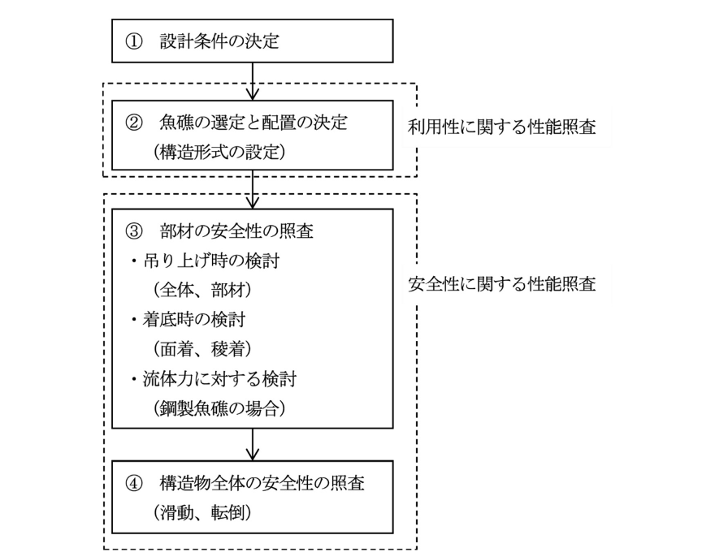

図 15-2-1 沈設魚礁の照査の手順

① 設計条件の決定

本章「2.3.3 設計条件」を参照する。

② 魚礁の選定と配置の決定

本章「2.3.2 構造型式の設定」及び「2.4.1 利用性に関する性能照査」を参照する。

③ 部材の安全性の照査

本章「2.4.2 安全性に関する性能照査（1）部材の安全性の照査」を参照し、魚礁単体の構造設計は、建設ヤード上での転置・仮置及びクレーン船への積み込み時の吊り上げ状態、海底設置時を想定し、全ての状況において構造上の安全性が確保できるよう、部材断面寸法を決定する。また、魚礁単体の機能の向上を目的として取り付けられる部材については、その機能が十分に持続的に発揮できるよう、適切な構造を決定する。

④ 構造物全体の安全性の照査

本章「2.4.2 安全性に関する性能照査（2）構造物全体の安全性の照査」を参照し、海底設置後において魚礁単体の機能を確保するため、流体力による滑動及び転倒に対する検討を行い、安定性の確保に必要な魚礁単体の重量算定を行う。

#### 2.3.2 構造型式の設定

沈設魚礁は、一般に複数の魚礁単体を群として形成される。魚礁単体には型枠を用いてコンクリート一体打ちで製作されるコンクリート製（正確には鉄筋コンクリート製であるが、本書においては単にコンクリート製という。）魚礁、それらを接合した組立魚礁、鋼製部材からなる鋼製魚礁、及び複数の材料から構成されるハイブリッド魚礁がある。

高さが 20m を超える大型の魚礁は、一般に高層魚礁と呼ばれている。高層魚礁は主に鋼材で構成されるが、構造の一部に小型のコンクリートブロックやコンクリート製魚礁を部材として組み入れているハイブリッド形式のものもある。

また、魚礁単体の設置方法には、魚礁単体を一定の間隔で面的に配置する方法と複数の魚礁単体を一つの塊又は山積みに設置する方法があり、山積みの方法にはさらに層積みと乱積みがある。魚礁を山積みにする場合であっても、魚礁単体の安全性の照査を行うことを標準とするが、乱積みの場合は礁全体の設置形状を対象にした安定性の照査に代えてもよい。

#### 2.3.3 設計条件

**（1）設計状況と作用**

沈設魚礁の安全性の性能照査に用いる設計条件は、施工方法、設置場所の水理特性、海底の物理条件及び漁業に応じた適切なものを設定することを原則とする。主な設計条件としては、設置時の着底速度、波、流れ、海底の傾斜、底質を扱い、その他については必要に応じて検討することを原則とする。

沈設魚礁の施工では、吊り上げ時の荷重と設置時の着底衝撃力が考慮すべき重要な作用となる。部材の安全性の照査では、それらを主要な作用として、構造耐力上の安全性を検討することを原則とする。着底衝撃力を算定するためには、着底速度を適切に設定することを原則とする。

構造物全体の安全性の照査では、流体力、重力、浮力及び魚礁が海底から受ける摩擦力を主な作用として、沈設魚礁の安定性を検討することを原則とする。沈設魚礁は、海底に設置し、自重のみでその安定性を確保するもので、海底の傾斜、摩擦係数、底質などの海底の物理条件も重要な設計条件となる。底質には、海底の凹凸、地盤反力、底質移動などの条件が含まれる。

高層魚礁については、その特殊性（高い礁高、大礁体、大重量、低部材強度）を考慮して、特に以下を検討することを原則とする。

i）適切な施工と性能照査を行うため、事前に深浅測量を行い、設置範囲の海底勾配と平坦性を確認するとともに、海底の目視確認等により地盤反力係数を適切に設定すること。

ii）設置時の着底速度には、調達可能なクレーン船で魚礁を安全に設置できる値を用いること。

iii）台風の通過が予測される地域や時期において、ヤード上で組立作業が想定される場合は、施工段階に応じて風荷重に対する安定性を検討するとともに、完成後の仮置時においても検討を行い、転倒の危険性がある場合は、対策を講じること。風荷重の算定に用いる風速としては、その地域のその季節に想定される最大風速を用いることが望ましいが、観測記録等の資料がない場合には風速 50m/s 程度を用いてもよい。

鋼材の腐食のように経年的に重量が減少し、安定性に影響する場合は、その影響も考慮することを原則とする。

流体力は、主に波による短周期の振動流（波動流）と定常的な流れによる力である。流れには鉛直成分と水平成分があるが、沈設魚礁の照査では、流速の鉛直成分は水平成分に対して相対的に小さく、実用上無視することができる。沈設魚礁の設計条件としては、再現期間における極大流体力を発生する暴風時等における波と流れで検討することを原則とする。この波・流れの条件は波と流れの結合確率から決定することが望ましいが、信頼できる結合確率が得られない場合は、安全側の設計として波動流と流れの再現期間における極大流速を別々に求めて、それらの交差角を考慮した合成流速ベクトルとしてもよい。波の設計条件については、「第2編第3章 波」を参照することができる。流れの設計条件については、「第2編第6章 流れ」及び本項「(2) 流れによる設計流速」を参照することができる。

設置場所が浅海域にある場合は、波動流速が潮位によっても有意に変化するため、設計条件として潮位も考慮しなければならない。潮位については、「第2編第2章 潮位」を参照することができる。

漁具により沈設魚礁がけん引される恐れがある場合は、必要に応じてそのけん引力を作用として検討することが望ましい。

摩擦力は、水中重量の海底面に垂直な成分と静止摩擦係数との積によって算定することを原則とする。

**（2）流れによる設計流速**

流れは、潮流（潮汐流）、吹送流及び海流などから成る。一般に、水深の浅い沿岸域では海流は相対的に小さくなり、逆に水深の深い沖合域では潮流が相対的に小さくなるが、場所によっては両者とも重要になることもある。吹送流は風が海面に及ぼす応力によって発生する流れであり、底層ではその影響は顕著でないので、一般には無視されているが、強風が長時間、一方向に吹く場合に発達する可能性がある。また、海域によっては気象擾乱に伴う長周期波や急潮と呼ばれる強い流れが突発的に発生することもある。これらの流れは、海域特有のものであり、必要に応じて考慮することを原則とする。

照査に用いる流れの流向と流速は、潮流、海流及び吹送流などの各種の流れの成分の合成ベクトルとして求めることができる。潮流、海流及び吹送流については、「第2編第6章 流れ」を参照することができる。流れは、時間的にも空間的にも複雑に変化する可能性があるため、長期間の流速観測又は信頼できる流れの数値シミュレーションに基づき適切に定めることが望ましいが、以下の簡便な方法を用いて定めてもよい。

i）底層又は潮流が卓越する浅海域において、流速の鉛直変化に関する信頼できる観測値が得られていない場合は、式 15-2-1 を用いてもよい。

$$
U_c(z) = U_c(z_R) \left( \frac{z}{z_R} \right)^{1/7} \tag{式 15-2-1}
$$

ここに、

- $U_c(z)$：海底からの高さ $z$（m）における流れの速度（m/s）
- $U_c(z_R)$：沈設魚礁の設置場所の海底から高さ $z_R$ における参照流速。潮流が卓越する海域で潮流速度を参照流速とする場合は、海図又は潮汐表の表面流速、あるいは 14 日間以上の長期間の流速観測値から潮流の調和解析により求められる最大流速の予測値であり、$z_R$ は前者の場合はその場所での水深、後者の場合は流速測定点の高さとなる。

ii）波浪が弱く、潮流が卓越する内海、内湾等の海域で、潮流速度（照査に用いる高さでの値）が後述する式 15-2-13 で算定される波動流速 $U_a$ の 5.7 倍より大きい場合は、その潮流速度（照査に用いる高さでの値）に割増係数 1.582)を乗じた値を流れの設計速度 $U_c$ として、式 15-2-18c を適用できる流れ単独の場とみなしてもよい。

iii）流れとしては潮流が卓越し、波浪も影響する海域で、外力として潮流と波動流を同時に考慮する場合は、式 15-2-20 で照査に用いる波との同時発生確率を考慮するため、流れの設計速度 $U_c$ には潮流速度（照査に用いる高さでの値）をそのまま用いてもよい。

### 2.4 沈設魚礁の性能照査

#### 2.4.1 利用性に関する性能照査

沈設魚礁の規模、高さ、構造等については、人工魚礁造成計画指針 1)及び周辺での事例調査などを参考にして適切に定めることを原則とする。

#### 2.4.2 安全性に関する性能照査

**（1）部材の安全性の照査**

部材の安全性の照査は、製作・設置時及び設置後における作用に対して、構造耐力上安全なものとする。魚礁単体の構造は、製作、転置・仮置、海底への設置などのクレーン吊り上げ時に生じる自重、積み重ね、設置時の着底衝撃力、設置後の波・流れによる流体力などの作用に対し、魚礁単体を構成する部材の応力が材料の許容応力度以下になるよう照査することを原則とする。

材料の許容応力度は、「第3編 材料及び諸係数」を参照することができる。

魚礁単体の部材の安全性の照査においては、具体的には以下の検討を行うことを標準とする。

**① 沈設魚礁の基本検討事項**

**a) 魚礁全体の吊り上げ時の安全性の検討**

単体あるいは全体を沈設作業船への積み込み時などにおける、クレーンでの吊り上げ状況に対する部材の安全性を検討する。特に、コンクリート製魚礁については、脱型直後の強度が十分に発現していない状態で移動する場合、変形や破損につながる恐れがあるため、適切な吊り点の位置、吊り点の数、移動時期などを検討することが望ましい。

また、鋼製魚礁については、適切な吊り金具の数、強度、取り付け位置等を検討することが望ましい。

なお、材料の密度等については、「第3編 材料及び諸係数」を参照することができる。

**b) 海底設置時の着底衝撃力に対する安全性の検討**

沈設魚礁を海底に設置する際に発生する着底衝撃力は、図 15-2-2 の手順にしたがって、自重の $k$ 倍の静的荷重として算定することができる。ここで、付加質量係数（$C_{MA}$）と抗力係数（$C_D$）は、信頼できる模型実験に基づく値を使用することが望ましいが、表 15-2-1 を参考に決定してもよい。

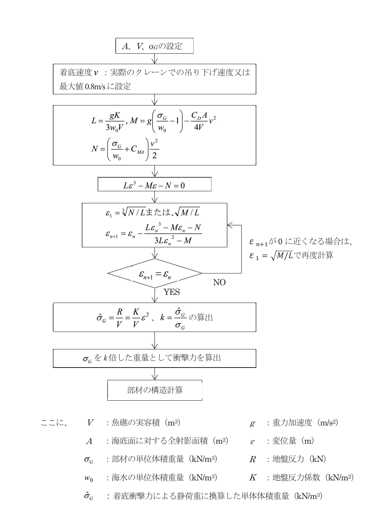

図 15-2-2 着底衝撃力の算定手順 3)4)

ここに、

| 記号 | 意味 |
|---|---|
| $V$ | 魚礁の実容積（m3） |
| $A$ | 海底面に対する全射影面積（m2） |
| $\sigma_G$ | 部材の単位体積重量（kN/m3） |
| $w_0$ | 海水の単位体積重量（kN/m3） |
| $\hat{\sigma}_G$ | 着底衝撃力による静荷重に換算した単位体積重量（kN/m3） |
| $g$ | 重力加速度（m/s2） |
| $\varepsilon$ | 変位量（m） |
| $R$ | 地盤反力（kN） |
| $K$ | 地盤反力係数（kN/m2） |

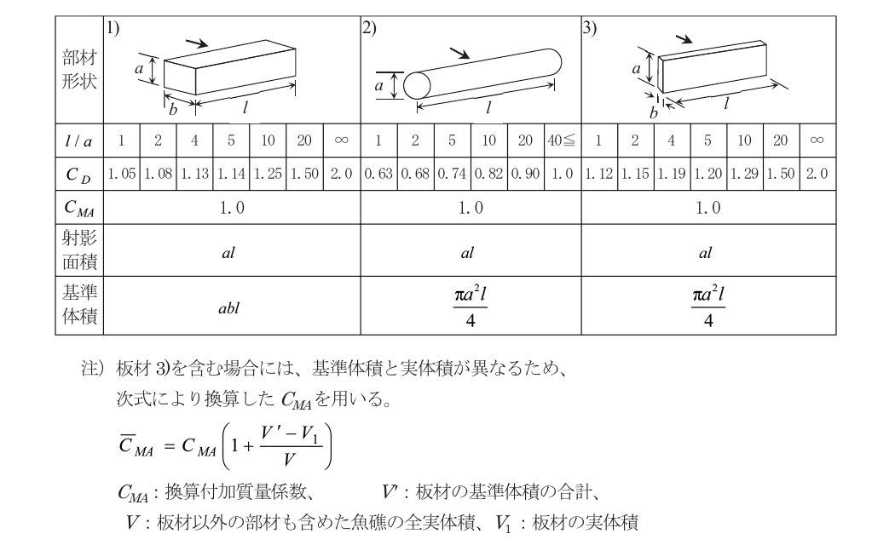

表 15-2-1 着底衝撃力の算定に用いる付加質量係数（$C_{MA}$）と抗力係数（$C_D$）の参考値

注）板材 3)を含む場合は、基準体積と実体積が異なるため、次式により換算した $C_{MA}$ を用いる。

$$
\overline{C_{MA}} = C_{MA} \left( 1 + \frac{V' - V_1}{V} \right)
$$

$C_{MA}$：換算付加質量係数、$V'$：板材の基準体積の合計、$V$：板材以外の部材も含めた魚礁の全実体積、$V_1$：板材の実体積

沈設魚礁単体は、一般に海底までクレーンによって吊り下げて設置される。その際の設計条件としての着底速度は、現地での施工計画及び施工機材を考慮して決定することが望ましいが、最大 0.8m/s としてもよい。また、地盤反力係数は、底質が砂泥～砂礫の場合は 30,000～50,000kN/m2 を用い、岩の場合は、事前調査等により適切な値を設定することが望ましいが、既往の実験 5)を参考にしてもよい。

沈設魚礁の部材の安全性の照査は、魚礁単体の吊り上げ方法、海底地盤の凹凸・傾斜、設置時の波・流れなどを考慮して、海底面に着底する姿勢を想定し、線形弾性モデルに基づく骨組解析プログラムなどを用いて計算することが望ましい。この場合、着底姿勢に応じて、吊りワイヤーへ荷重を分散させてよい。なお、1.5m 又は 2.0m 角の角型魚礁については、面着（地盤との設置角度 $\theta = 0°$）と稜着（$\theta = 45°$）の両方の場合（図 15-2-3）を想定して検討を行うことが望ましい。

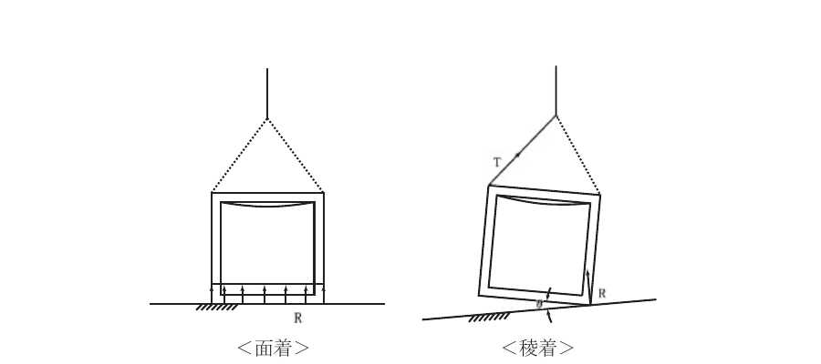

図 15-2-3 設置時のイメージ

小型の魚礁単体を積み上げて設置する場合は、着底衝撃力による破損が発生しないような設置形状を設定し、着底速度の制御が可能な状態で施工することが望ましい。

**② コンクリート製魚礁単体の部材の安全性の照査**

コンクリート製魚礁単体は、対象魚礁の構造をモデル化し、想定される各荷重条件に対して照査を行う 5)のがよい。

照査は、信頼できる構造計算プログラムを用いて行うことが望ましい。この場合、使用プログラム名、入力条件、荷重分布、作用する曲げモーメント、軸力及びせん断力を確認することを標準とする。

部材及び配筋は、以下の手順で決定することを標準とする。

i）部材に働く曲げモーメントと軸力で必要な主鉄筋を決定する。

ii）部材断面積や鉄筋量からせん断力に対する安全性を検討する。

iii）せん断力に対する耐力が不足する場合は、断面積を増加させるか、帯筋で補強する。

iv）帯筋の直径は 6mm 以上とし、その間隔は部材断面の最小寸法と、帯筋の直径の 48 倍のどちらよりも小さくする。

**a) 鉄筋コンクリート部材の許容応力度**

鉄筋コンクリート部材の許容応力度は、「第3編第3章 コンクリート」の「表 3-3-2 鉄筋コンクリートの許容応力度」を参照し、コンクリート、鉄筋の別に、以下に示す値を用いるのがよい。コンクリートの照査に用いる基準強度には、魚礁の部材厚が 250mm 以上の場合は 18N/mm2 以上、部材厚が 250mm 未満、海底地盤が岩盤、又は魚礁単体を2段積み以上（山積み）で沈設する場合は 21N/mm2 以上を用いる。

コンクリートに関する許容応力度は、吊り上げ時及び着底時に作用する外力を短期荷重として取り扱い、上述の表の2倍の値を用いる。

鉄筋の許容応力度は、吊り上げ時及び着底時においては同表の 1.65 倍の値を用い、設置後の流体力に対しては、表中の値をそのまま用いる。

なお、組立魚礁の単体ブロックについては、製作時の部材の変形を防ぐため、転置・仮置時の部材の安全性の検討を行うことが望ましく、その際のコンクリート部材の許容応力度は、実施時点でのコンクリート強度から算出するのがよい。

**b) 鉄筋のかぶり**

鉄筋のかぶりは、コンクリート製品工場で製作する場合、構造耐力上重要な主鉄筋については、鉄筋の直径もしくは 20mm の大なる値を最小かぶりとするのがよい。帯筋などの補強鉄筋が強度上重要な役割を果たす場合については、主鉄筋と同様のかぶりを確保することを原則とする。また、現場打ちの場合は、25mm 以上のかぶりを確保することを原則とする。

なお、特殊工法で JIS 規格のある場合は、これに準ずることができる。

**c) 接合**

コンクリート製の組立魚礁において、個別に製作された部材をボルトとナットによって接合する場合は、ボルトとナットをコンクリート部材内に埋め込むなどの腐食に配慮した照査を行うことが望ましい。

**③ 鋼製魚礁単体の部材の安全性の照査**

鋼製魚礁単体は、魚礁単体の構造をモデル化し、想定される荷重条件に対して照査を行うのがよい。照査は、信頼できる構造計算プログラムを用いて行うことが望ましい。この場合、使用プログラム名、入力条件、荷重分布、作用する曲げモーメント、軸力及びせん断力を確認するものとする。

部材は、以下の手順で決定することを標準とする。

i）部材に働く曲げモーメント、軸力、せん断力で部材断面を決定する。

ii）圧縮力が働く部材は、座屈の有無を検討し、部材長さ、部材断面の妥当性を調べる。

iii）部材接合部やブロックの強度の向上、転置・仮置・組立時の形状保持のため、目板やプレースを適宜配置する。

iv）機能部材としての遮蔽版や水平板も、魚礁全体の強度や経済性の向上につながる場合は、構造材として積極的に利用する。

v）吊り上げ時及び設置時における構造耐力上の安全性の検討は、腐食代を含んだ部材の製作初期断面で行う。

vi）設置後の流体力に対する安全性の検討は、設計供用期間経過後の腐食代を含まない断面で行う。

vii）波などによる繰り返し荷重が、部材の許容応力度に占める割合が高い場合は、疲労による強度の低下や破壊の有無について検討する。

**a) 鋼製部材の許容応力度**

鋼製部材についての許容応力度は、「第3編第2章 鋼材」の「表 3-2-2 構造用鋼材の許容応力度」を参照し、吊り上げ時の応力、設置時の着底衝撃力及び設置後の流体力は短期荷重として取り扱い、表の2倍の値を用いてよい。

**b) 流体力に対する部材の安全性の照査**

腐食代が消失する設計供用期間経過後の各鋼製部材に働く波・流れの力を算定することにより、設計供用期間内における魚礁部材の安全性を照査することを原則とする。

各部材に働く流体力については、「本編 2.4.2(2) 構造物全体の安全性の照査」及び「表 15-2-1 付加質量係数と抗力係数」などを参考に部材ごとに算定することができるが、魚礁の形状が複雑な場合は、各部材に働く流体力を正確に算定することが困難であるため、魚礁全体に働く流体力を算定し、それを各部材の射影面積で比例配分することにより求めてもよい。

**c) 材料の選定**

鋼製魚礁に使用する鋼材には、JIS 規格及びそれらと同等以上の品質を有するものを用いることを標準とする。

**d) 防食**

鋼製魚礁の防食は、腐食代で対応することを原則とする。腐食速度は、設置海域や水深によって異なるため、現地の環境にあった腐食代を用いるのが望ましい。また、設置海域が強い流動や漂砂が恒常的に生じる浅海域である場合は、腐食代の割増しを検討するのがよい。

施工性や経済性の向上が期待される場合は、「第3編 2.5 防食」を参考にして被覆防食等の他の防食方法も検討することができる。

なお、使用される鋼材の材質・規格が異なる場合、電位差による局部腐食が懸念されるため、同一鋼材を使用することを原則とする。

**e) 接合**

鋼材の接合は、溶接によることを標準とするが、母材と同一材質のボルトとナットを用いて、腐食による脱落が発生しないよう確実な締め付けを行うことに注意して接合を行ってもよい。

溶接材料については、母材に適合し、JIS 規格品及び同等品以上のものを選定することを標準とする。

**④ ハイブリッド魚礁の部材の安全性の照査**

ハイブリッド魚礁の部材の安全性の照査は、基本的にコンクリート製魚礁と鋼製魚礁に準じるが、その他の材料を使用する場合は、それぞれの材料特性を踏まえた適切な検討を行うことを原則とする。

魚礁単体には、(i)施設の安定性の確保又は構造の強化、(ii)魚礁に求められる魚類の蝟集機能や増殖機能の向上、を図るため、複数の材料を使用しているものがある。

(i)の例としては、コンクリートと鋼材を合理的に組み合わせることにより、構造上の安定や経済性の向上を図っているものがある。(ii)を目的とした部材については一般に機能部材と呼ぶ。機能部材には、構造上、応力分担させるものとさせないものがある。

異種材料を接合する場合、それぞれの材料の特性を考慮しつつ適切な工法を選定し、接合部を堅固なものとすることを原則とする。

魚類の蝟集機能や増殖機能を向上させるため、機能部材として、石材、貝殻、プラスチック、木材等を魚礁に取り付ける場合の照査上の留意点は次のとおりである。

**a) 材料の選定**

機能部材の材料は、本体と同程度の耐久性を有するものが望ましいが、波や流れなどにより、部材が劣化、あるいは減耗してしまう場合は、分解等により自然環境や漁業に害を及ぼさないものを選択することを原則とする。

部材の一部にプラスチック等の難分解性材料を使用する場合は、部材の大部分を占める鋼材等の腐食が進み、プラスチック等が脱落して海洋に飛散することがないものとすることを原則とする。

**b) 機能部材の強度**

機能部材は、部材の製作、魚礁への取り付け、海底への設置、設置後の流体力の作用に際して、必要な機能、部材の安全性が確保されるよう構造・強度を適切に決定するものとする。特に、波浪が強い海域では、容器内の収納材や容器そのものが動いて摩耗による破損、流失がおこりやすいので、十分な検討を行うことを原則とする。

石材や貝殻については、金網やプラスチック等の容器に収納して取り付ける場合と、セメントなどの固化材を用いて固めたものを取り付ける場合がある。前者の場合は、収納する金網やプラスチック等の強度や耐久性を検討し、後者の場合は固化体としての強度、石材や貝殻の固着力を検討するのがよい。

また、魚礁への取り付け方法や取り付け部の強度なども検討することを原則とする。

**c) 機能部材の安定性**

コンクリート中に埋め込まれたものや鋼材に溶接されているものについては、機能部材の付加による流体力の増加分を全体に作用する力に加算することにより検討することを原則とする。

しかし、石材のようなものを、固定せずに構造物の一部に設置したものについては、「第 16 編 2.2.4 藻場礁の安定質量」を参考にして石材の安定性を照査することを標準とする。

**⑤ 高層魚礁の部材の安全性の照査**

高層魚礁の部材の安全性の照査の基本的な考え方は、主構造部材の素材を考慮して、コンクリート製あるいは鋼製魚礁単体の部材の安全性の照査に準拠するが、魚礁の上部構造に作用する波力によって部材に生じる繰り返し応力が疲労限界を超える場合は、疲労による破壊の有無を検討するのが望ましい。

**（2）構造物全体の安全性の照査**

構造物全体の安全性の照査では、沈設魚礁の設置後の波・流れによる流体力の作用に対し、移動や揺動によりその機能が損なわれることのないよう、魚礁単体の滑動又は転倒に対する安定性を検討することを原則とするが、図 15-2-4 の設置条件の違いにより照査条件を緩和することができる。

また、設置する海底の底質や流動環境によっては、魚礁が沈下、埋没し、その機能が失われるおそれがあるため、事前調査により洗掘や埋没の可能性の少ない場所を選定したり、魚礁の接地面積を大きくしたり、事前に埋没深さを予想して脚部を設けるなどの対策を行うことが望ましい。

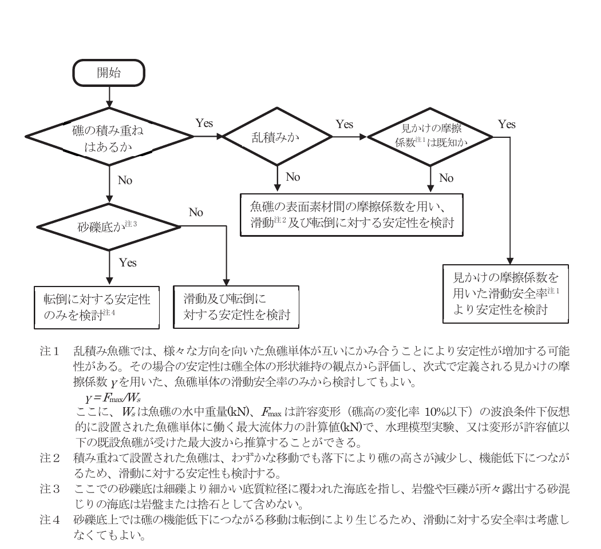

図 15-2-4 設置条件の違いを考慮した安全性の照査の緩和

注1　乱積み魚礁では、様々な方向を向いた魚礁単体が互いにかみ合うことにより安定性が増加する可能性がある。その場合の安定性は礁全体の形状維持の観点から評価し、次式で定義される見かけの摩擦係数 $\gamma$ を用いた、魚礁単体の滑動安全率のみから検討してもよい。

$\gamma = F_{\text{max}} / W_s$

ここに、$W_s$ は魚礁の水中重量(kN)、$F_{\text{max}}$ は許容変形（礁高の変化率 10%以下）の波浪条件下仮想的に設置された魚礁単体に働く最大流体力の計算値(kN)で、水理模型実験、又は変形が許容値以下の既設魚礁が受けた最大波から推算することができる。

注2　積み重ねて設置された魚礁は、わずかな移動でも落下により礁の高さが減少し、機能低下につながるため、滑動に対する安定性も検討する。

注3　ここでの砂礁底は細礫より細かい底質粒径に覆われた海底を指し、岩盤や巨礫が所々露出する砂混じりの海底は岩盤または捨石として含めない。

注4　砂礁底上では礁の機能低下につながる移動は転倒により生じるため、滑動に対する安全率は考慮しなくてもよい。

**① 滑動及び転倒に対する安定性の検討**

海底付近の構造物では、流速の鉛直成分は水平成分に対して相対的に小さく、水平流速のみで流体力を算定することができるが、水平方向の流速であっても水平流体力だけでなく、鉛直方向の力である揚力が生じる。揚力は、沈設魚礁のように流れに対する遮蔽性の低い構造物では一般に無視することができるが、面積の大きい水平遮蔽面又は傾斜した遮蔽面を有する構造物や海底面との間に隙間のない不透過構造物では問題になることがあることに留意して、必要に応じて検討する。滑動又は転倒に対する安定性の検討では、高さ方向の流速変化及び構成部材の配置や単位体積重量の違いに伴う作用力の変化や沈設魚礁を設置する海底面の傾斜の影響も適切に考慮する必要がある。海底面の傾斜の影響は、乱積み設置の魚礁の場合は考慮できないが、それ以外の魚礁については、流体力の作用方向、傾斜方向、及び沈設魚礁の設置方向を特定できる特殊な場合を除き、水平流体力が海底面の傾斜方向に作用する、最も危険な条件を想定して検討することを標準とする。以上の影響を考慮した安定性の照査方法として、図 15-2-5 に基づき作用力を底面に垂直な成分と平行な成分に分解し、滑動又は転倒に対する安定性をそれぞれ式 15-2-2 又は式 15-2-3 を用いて検討することを標準とする。

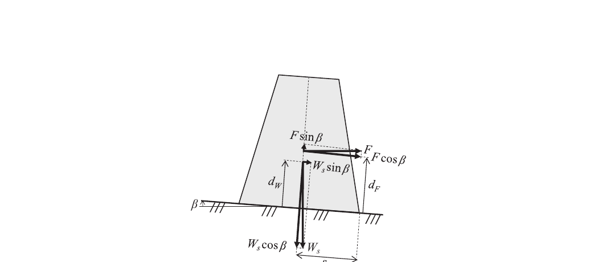

図 15-2-5 設置面の傾斜の影響を考慮した作用力の分解方法

$$
\text{SF}_s = \frac{\mu R}{P} \geq 1.2 \tag{式 15-2-2}
$$

$$
\text{SF}_o = \frac{M_r}{M_o} \geq 1.2 \tag{式 15-2-3}
$$

$$
R = W_s \cos \beta - F \sin \beta \tag{式 15-2-4}
$$

$$
P = F \cos \beta + W_s \sin \beta \tag{式 15-2-5}
$$

$$
M_r = (W_s \cos \beta - F \sin \beta) \cdot s \tag{式 15-2-6}
$$

$$
M_o = F d_F \cos \beta + W_s \, d_W \sin \beta \tag{式 15-2-7}
$$

ここに、

- $\text{SF}_s$：滑動安全率
- $\text{SF}_o$：転倒安全率
- $\mu$：魚礁とその接地面との静止摩擦係数（「第3編 5.1 静止摩擦係数」を参照し、設置状況に応じて適切な値を用いる）
- $R$：魚礁全体に作用する合力の底面に垂直な成分（kN）
- $P$：魚礁全体に作用する合力の底面に平行な成分（kN）
- $M_r$：魚礁全体の抵抗モーメント（kNm）
- $M_o$：魚礁全体の転倒モーメント（kNm）
- $W_s$：魚礁全体の水中重量（揚力を考慮する場合は水中重量と揚力の差）（kN）
- $\beta$：底面の傾斜角（°）（乱積み魚礁の場合は $\beta = 0°$ とする）
- $F$：魚礁全体に作用する水平流体力（kN）
- $s$：魚礁の高さ方向の中心線が底面と交わる点から魚礁が転倒する際の回転軸までの距離（m）
- $d_F$：魚礁全体の水平流体力の作用点から底面までの距離（m）
- $d_W$：魚礁全体の水中重量の作用点から底面までの距離（m）

魚礁を層区分して波浪下における流体力を算定する場合、各層での最大流体力に位相差が生じる可能性があるが、$F$ の設計値は式 15-2-8 により求めることができる。$d_F$ は、魚礁を高さ方向に層区分して式 15-2-8 で計算することができるが、区分した層内や層区分しない場合での流体力の作用点は流れ方向からの投影面積の図心としてよい。$W_s$ は式 15-2-9 により構成部材の水中重量の和として、また $d_W$ は式 15-2-11 により構成部材毎の水中重量の重心位置として求めることができるが、揚力を考慮する場合は上方からの投影面積の図心の高さに揚力が作用するものとして計算してよい。

$$
F = \sum_{i} F_i \tag{式 15-2-8}
$$

$$
W_s = \sum_{j} W_j (1 - w_0 / w_j) \tag{式 15-2-9}
$$

$$
d_F = \frac{1}{F} \sum_{i} F_i d_{F,i} \tag{式 15-2-10}
$$

$$
d_W = \frac{1}{W_s} \sum_{j} W_j (1 - w_0 / w_j) \, d_{W,j} \tag{式 15-2-11}
$$

ここに、

- $F_i$：魚礁 $i$ 層に作用する水平流体力（kN）
- $W_j$：構成部材 $j$ の重量（kN）
- $w_0$：海水の単位体積重量（kN/m3）
- $w_j$：構成部材 $j$ の単位体積重量（kN/m3）
- $d_{F,i}$：魚礁 $i$ 層の水平流体力の作用点から底面までの距離（m）
- $d_{W,j}$：構成部材 $j$ の重心から底面までの距離（m）

**② 流体力の算定**

構造物全体の安全性の照査に用いる流体力については、設計条件下で生じる最大流体力 $F_{\text{max}}$ を算定することを原則とする。$F_{\text{max}}$ の算定のためには、波の不規則性と非対称性、波と流れの共存・交差、及び流速の鉛直分布の影響を適切に評価する必要がある。その手法として図 15-2-6 の手順に従い、式 15-2-12～式 15-2-18 を用いて $F_{\text{max}}$ を求めることができる。流速の鉛直分布の影響を考慮するためには、魚礁を高さ方向にいくつかの層に区分して $F_{\text{max}}$ を算定する必要があるが、魚礁の高さと水深との比が 0.3 以下の場合は層分割せずに求めてもよい。

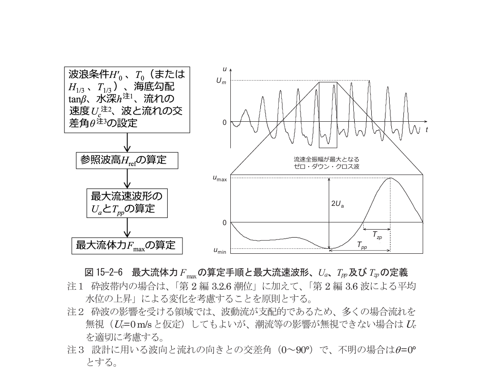

図 15-2-6 最大流体力 $F_{\text{max}}$ の算定手順と最大流速波形、$U_a$、$T_{pp}$ 及び $T_{zp}$ の定義

注1　砕波帯内の場合は、「第2編 3.2.6 潮位」に加えて、「第2編 3.6 波による平均水位の上昇」による変化を考慮することを原則とする。

注2　砕波の影響を受ける領域では、波動流が支配的であるため、多くの場合流れを無視（$U_c = 0$ m/s と仮定）してもよいが、潮流等の影響が無視できない場合は $U_c$ を適切に考慮する。

注3　設計に用いる波向と流れの向きとの交差角（0～90°）で、不明の場合は $\theta = 0°$ とする。

**a) 参照波高 $H_{\text{ref}}$ の算定**

波群中で最大流体力が発生する波は、必ずしも最大波高の波ではなく、最大流速波形の波である（図 15-2-6 参照）。最大流速波形の算定のための参照波高 $H_{\text{ref}}$ として最大波高を用いるが、その近似値として 1/250 最大波高 $H_{1/250}$ を代用してもよい。$H_{1/250}$ は、砕波の影響を受けない領域では波高分布にレーリー分布を仮定して、また砕波の影響を受ける領域では合田のモデル 6) により、求めることができるが、それらと同等の式 15-2-12 により算定してもよい。

$$
H_{\text{ref}} = \begin{cases} 1.8 H_{1/3} & : h / H_0' \geq 4.0 \\ \lambda_0 H_{1/3} & : h / H_0' < 4.0 \end{cases} \tag{式 15-2-12}
$$

ここに、

- $H_{1/3}$：設計対象地点での設計波高（有義波）（m）
- $\lambda_0$：図 2-4-4 から求められる波高の補正係数
- $H_0'$：換算沖波波高（m）

**b) $U_a$ と $T_{pp}$ の算定**

$F_{\text{max}}$ の算定に用いる流速振幅 $U_a$ とピーク・ピーク周期 $T_{pp}$ は、図 15-2-6 で定義される最大流速波形の値であり、それぞれ式 15-2-137)と式 15-2-147)により求めることができる。

$$
U_a = r \, U_{\text{Airy}} \tag{式 15-2-13}
$$

$$
T_{pp} = \min \left\{ 1, \; 0.515 \left[ 1 + \exp(-0.00939 \, U_r) \right] \right\} \frac{T}{2} \tag{式 15-2-14}
$$

$$
r = \left\{ 1 - 0.471 \tanh \left[ 1.46 \left( \frac{H_{\text{ref}}}{h} \right)^{1.44} \right] \right\} \left( 0.947 + 3.77 \frac{H_{1/3}}{L} \right) \tag{式 15-2-15}
$$

$$
U_{\text{Airy}} = \frac{\pi H_{\text{ref}} \cosh(2 \pi z_A / L)}{T \sinh(2 \pi h / L)} \tag{式 15-2-16}
$$

$$
U_r = \frac{H_{\text{ref}} L^2}{h^3} \tag{式 15-2-17}
$$

ここに、

- $z_A$：海底から対象構造物の図心までの高さ（m）
- $\min\{a, b\}$：$a$ または $b$ のいずれか小さい方の値
- $T = T_{1/3} = T_0$：設計対象地点における周期（s）
- $L$：設計対象地点における微小振幅波の波長（m）

**c) 最大流体力 $F_{\text{max}}$ の算定**

波群中での最大流体力 $F_{\text{max}}$ は式 15-2-18 により算定することができる。

$$
F_{\text{max}} = \begin{cases}
\dfrac{1}{2} \rho \, C_{F\text{max}} A U_a^2 & : r_u \leq 0.1 \\[6pt]
\dfrac{1}{2} \rho \, C_F A V_m^2 & : 0.1 < r_u < 0.9 \\[6pt]
\dfrac{1}{2} \rho \, C_{DS} A U_c^2 & : r_u \geq 0.9
\end{cases}
\tag{式 15-2-18}
$$

$$
C_F = (1 - \sqrt{r_u}) \, C_{F\text{max}} + \sqrt{r_u} \, C_{DS} \tag{式 15-2-19}
$$

$$
V_m = \sqrt{U_a^2 + U_c^2 + 2 U_a U_c \cos \theta} \tag{式 15-2-20}
$$

$$
r_u = \frac{U_c}{U_c + U_a} \tag{式 15-2-21}
$$

ここに、

- $\rho$：海水の密度（t/m3）
- $A$：次項「流体力係数の決定」により定める魚礁の基準面積（m2）
- $C_{F\text{max}}$：次項「流体力係数の決定」により $K_C = 2V_m T_{pp} / D$ で定義する KC 数の関数として定める魚礁の最大力係数
- $C_{DS}$：次項「流体力係数の決定」により定める定常流中での魚礁の抗力係数

波・流れによる流体力の算定には、従来、流体力を慣性力と抗力の和で表すモリソン式（式 2-6-2）が広く用いられてきた。しかし、モリソン式は流速の時間変化から流体力の時間変化を求める式である。モリソン式により $F_{\text{max}}$ を算定するためには、二つの流体力係数（$C_D$ と $C_M$）を適切に定めるとともに、流速の時間波形を適切に定めて、それらに基づき流体力の時間変化から $F_{\text{max}}$ を求める必要がある。これに対して、式 15-2-18a は、$F_{\text{max}}$ のみに着目した式である。当式は波単独の場（$r_u = 0$）で $F_{\text{max}}$ を直接求められるだけでなく、非対称性の強い流速波形であっても $F_{\text{max}}$ をモリソン式よりも精度よく算定できることが示されている 8)。さらに波と流れが共存し、交差する条件においては、モリソン式では適用性が低く、流体力を過大評価する問題が指摘されている 9)10)のに対して、式 15-2-18a を波・流れの共存場にも適用できるようにした式 15-2-18b は、交差角や波と流れの流速比の影響を適切に評価できることが示されている 11)。

**d) 流体力係数の決定**

流体力係数は、流体力を表す数学モデルにおいて物体の形状等の影響を表す無次元係数であり、モデルにより異なる。定常流中の物体に作用する抗力は、流速の2乗と流れ方向からの物体の投影面積との積に比例するモデルで表され、$C_{DS}$ はその流体力係数であり、式 15-2-22 で定義される。波動流中での流体力は、流速の2乗に比例する抗力と流体の加速度に比例する慣性力の和で表され、時間的に変化する。その流体力の最大値 $F_{\text{max}}$ を算定するための式が式 15-2-18a である。$C_{F\text{max}}$ はその流体力係数で、式 15-2-23 で定義される。$C_{DS}$ は式 2-6-4 で定義されるレイノルズ数 $Re$ の関数であり、$C_{F\text{max}}$ はレイノルズ数と式 15-2-24 で定義されるクーリガン・カーペンター数（KC 数）の関数である。

$$
C_{DS} = \frac{2 F_D}{\rho A U_c^2} \tag{式 15-2-22}
$$

$$
C_{F\text{max}} = \frac{2 F_{\text{max}}}{\rho A U_a^2} \tag{式 15-2-23}
$$

$$
K_C = \frac{2 U_a T_{pp}}{D} \tag{式 15-2-24}
$$

ここに、

- $F_D$：定常流中の物体に作用する抗力（kN）
- $\rho$：水の密度（t/m3）
- $A$：物体の基準面積（m2）
- $U_c$：定常流の速度（m/s）
- $F_{\text{max}}$：波動流または振動流中の物体に作用する最大流体力（kN）
- $U_a$：流速波形のゼロ・アップ・クロス点前後の極小値から極大値までの流速差の 1/2（m/s）
- $T_{pp}$：流速波形のゼロ・アップ・クロス点前後の極小値から極大値までの時間（s）
- $D$：物体の基準幅（m）

魚礁の流体力係数は、以下の事項に留意して適切に決めることを標準とする。

i）魚礁の流体力係数は、魚礁の構成部材の流体力係数とそれに及ぼす部材間の間隔の影響が既知である場合は部材の流体力の合力から推定することができるが、それ以外の場合は魚礁全体の縮尺模型を用いた模型実験により適切に定める必要がある。前者の例として既往文献 12)を参照することができ、また、後者の際には「模型実験による流体力係数の決定の手引き」13)を参照することができる。

ii）$Re$ の増加に伴う $C_{DS}$ の変化は一般に、低 $Re$ 領域では比較的急な低下を示すが、$Re$ がある程度高くなるとほぼ一定の値を示すようになる。縮尺模型実験による検討ではその一定領域の $C_{DS}$ 値を設計に用いる。しかし、$Re$ がさらに増加すると、物体の形状によっては $C_{DS}$ が激減することがある 14)15)。このため、実現象のレイノルズ数に近い条件下での $C_{DS}$ 値が得られるよう、できるだけ大縮尺での模型実験を行うことが望ましいが、上記の一定領域の $C_{DS}$ 値は安全側の設計値として用いることができる。

iii）$C_{DS}$ と $C_{F\text{max}}$ は $A$ の定義に依存する。$A$ は、一般に流れ方向の魚礁の投影面積で定義するが、魚礁の構成部材の背後に別の部材があり、両部材の流れ方向の間隔が、大きい方の部材幅の3倍以上離れている場合は、各部材は流体力学的に独立であるとして、両部材の投影面積の和を用いた方がよい 11)。波や流れに対する魚礁の設置方向を確定できない場合は、最大の流体力が発生する向きにおける $A$ と流体力係数を用いる。$A$ の定義には、形状が複雑過ぎて合理的な定義が難しい場合もあり、任意性が残るが、いずれの場合であっても縮尺模型と実物の $A$ の定義方法は同一でなければならない。したがって、模型実験による流体力係数を照査に用いる場合は、実物の $A$ の値は(縮尺模型の $A$)/(模型縮尺率の2乗)に等しくなければならない。

iv）$C_{F\text{max}}$ は KC 数だけでなく $Re$ の関数であるが、上記 ii)の $C_{DS}$ の場合と同様の理由により、縮尺模型実験による $C_{F\text{max}}$ の実験値は安全側の設計値として用いることができる。

v）$D$ の定義については、定められた方法はないが、円柱、角柱、平板、等辺山形鋼などの基本的部材については、文献 11)の方法に基づき決めるとよい。また、魚礁全体の $D$ を定義する場合は、$C_{DS} \times A$ 又は KC 数が非常に大きいときの $C_{F\text{max}}$ 値と $A$ との積を重みとする構成部材の $D$ の重み付き平均で定義するとよい。

**（参考文献）**

1）沿岸漁場整備開発事業　人工魚礁造成計画指針, 社団法人 全国沿岸漁業振興協会（2000）, 226p.

2）中村　充：漁場工学（水産土木）入門, 水産の研究 3（1983）, pp.81-88

3）中村　充・上北征男・飯野達夫：海中落体の着底衝撃に関する研究, 人工魚礁の設計外力の算定, 海岸工学講演会論文集 22（1975）, pp.483-487

4）中村　充：水産土木学, 生態系海洋環境エンジニアリング, 工業時事通信社（1991）, pp.434-451

5）高木儀昌・安岡孝司・山本晃司・仙波雅敏：角型魚礁の応力解析―その 1～2―, 日本水産工学会学術講演会論文集 4（1992）, pp.31-34

6）合田良実：浅海域における波浪の砕波変形, 港湾技術研究所報告 14（1975）, pp.59-106

7）S. Kawamata and M. Kobayashi: Empirical formulas for near-bed wave orbital velocity parameters involved in maximum wave load in random wave trains. Ocean Engineering 267 (2023), 114133, https://doi.org/10.1016/j.oceaneng.2023.114133

8）S. Kawamata and M. Kobayashi: Modified formula for predicting the maximum wave force on seabed objects. Ocean Engineering 266 (2022), 112751, https://doi.org/10.1016/j.oceaneng.2022.112751

9）P. K. Stansby: Experimental study of forces on a cylinder in oscillatory flow with a cross current. Applied Ocean Research 5 (1983), pp.195-203

10）榊田真也・馬替敏治・由比政年・石田　啓：振動流と定常流の斜交共存場における円柱に作用する流体力特性, 海岸工学論文集 50（2003）, pp.731-735

11）川俣　茂・佐伯公康・三上信雄・小林　学・門　安曇・伊藤　靖・廣瀬紀一：沈設魚礁の流体力算定式及び着定基質の安定質量算定式の検討, 平成 31 年度水産基盤整備調査委託事業報告書「漁港漁場施設の設計手法の高度化検討調査」（2020）, pp.2-1～2-32

12）例えば、川俣　茂・佐伯公康・三上信雄・小林　学・門　安曇・伊藤　靖・廣瀬紀一・丸山草平：沈設魚礁の流体力算定式及び着定基質の安定質量算定式（案）の策定, 令和2年度水産基盤整備調査委託事業報告書「漁港漁場施設の設計手法の高度化検討調査」（2021）, pp.2-1～2-12

13）模型実験による流体力係数の決定の手引き, 国立研究開発法人水産研究・教育機構　水産技術研究所（2023）

14）機械工学便覧　基礎編 α4, 流体工学, 日本機械学会（2006）, 229p.

15）高木儀昌・明田定満・小泉文夫：角型魚礁の設計法に関する研究（その2　角型魚礁の抗力係数）. 日本水産工学会学術講演会論文集 1（1991）, pp.45-46

---

## 第3章 浮魚礁

### 3.1 浮魚礁の要求性能

> 浮魚礁の要求性能は、構造形式に応じて、以下の要件を満たしていること。
>
> 1. 対象生物を蝟集することができるよう適切なものとする。
> 2. 波、流れ等及び設置・回収時に想定される作用に対して構造上安全なものとする。
> 3. 供用期間を満了した施設を技術的に可能かつ妥当な方法で撤去できるよう適切なものとする。

浮魚礁は、気象、海象等の自然条件、船舶の航行等を考慮し、対象とする漁法、魚種に対して、求められる機能が十分発揮できるようにして照査することを原則とする。

浮魚礁は、主にマグロ、カツオ、ブリ、シイラなどの大型回遊魚が、海洋を漂流する流木などの漂流物に集まる習性を利用し、魚類の蝟集・滞留・誘導を図る目的で開発された浮体式構造物で、主に沖合漁場造成に利用されている。対象とする魚類は表層のみでなく中層の回遊魚を対象にすることもある。蝟集する魚類が多く、漁獲効率が高いため漁業者のニーズが高い。浮魚礁設置の対象となる漁場は水深 100m 程度の浅海域から 1,000m 以上の大水深と広域にわたる。

浮魚礁には波や流れ、設置時・回収時に作用する浮体や係留索に作用する衝撃力等に対して構造上安全なものとする。浮魚礁は船舶による衝突や漁具による係留索の損傷等により、係留索が切断する恐れがある。浮魚礁には流失警報発信機を備えることを標準とする。

浮魚礁の供用期間は 10 年を標準とする。供用期間を経過した浮魚礁は、係留基礎またはアンカーを含むすべてを撤去しなければならない。したがって、使用する材料は供用年数分の腐食・摩耗を考慮するとともに、撤去時において回収に必要な十分な強度を有することを原則とする。

### 3.2 浮魚礁の性能規定

> 浮魚礁の性能規定は、以下に定めるとおりとする。
>
> 1. 対象生物に対して蝟集、滞留及び誘導する効果を発揮できるよう適切に配置され、かつ所要の諸元を有すること。
> 2. 給餌、散水、発光、流失警報発信機、漁場環境観測装置等の付加機能がある場合は、それらの機能を満足できるよう適切に配置され、かつ、所要の諸元を有すること。
> 3. 自重、浮力、波、流れ、風、生物の付着荷重等の作用に対して、浮体が静的かつ動的に安定した構造であること。
> 4. 波、流れ、風等の作用によって係留索に生じる応力が許容値以下であること。
> 5. 係留索に生じる最大引張力に対して、係留基礎（アンカー）の滑動（移動）等、構造の安定性が満足されること。
> 6. 漁船等の船舶の航行に影響を及ぼさないよう、適切に配置又は配慮されていること。
> 7. 浮魚礁の部材は、供用期間が満了した後、撤去できるよう配慮されているとともに、撤去時の作用に対して、所要の耐久性を有すること。

### 3.3 浮魚礁の性能照査の基本

#### 3.3.1 性能照査の手順

浮魚礁の性能照査の手順は、第1章の 1.3.2 を参照し、安全性の照査については、図 15-3-1 のとおり、浮体部の照査、係留部の照査および浮体の動的安定性の検討を行うことができる。

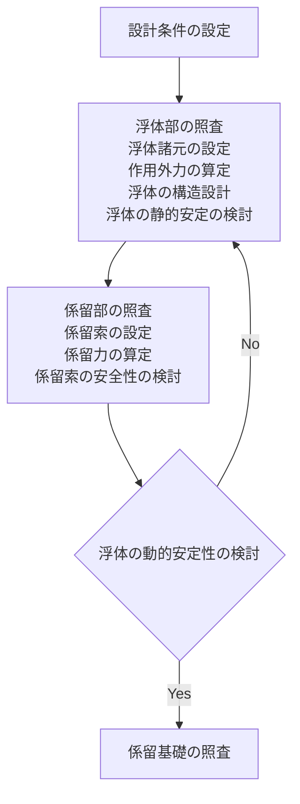

図 15-3-1 浮魚礁の照査手順

#### 3.3.2 構造形式の設定

構造形式は、浮体が常に海表面にある表層型浮魚礁、海中にある中層型浮魚礁、比較的穏やかな流れでは海面上にほぼ直立するが、急潮時には海中に没する浮沈式表層型浮魚礁に分類される。浮魚礁は、基本的に魚類の効果的な蝟集等を目的としているが、海況観測を目的とした漁場環境観測装置等を備えた魚礁もある。一般に表層型浮魚礁の係留系は、図 15-3-2 に示すように緩係留であり、係留索の長さは通常は水深の 1.2 倍程度がよく用いられる。中層型浮魚礁の係留系は緊張係留である。

浮魚礁の構成材料には、鋼材、FRP、ABS 樹脂、合成繊維などが用いられており、作用によって、浮体部の破壊、係留系の切断、係留基礎・アンカーが移動しないよう照査することが原則である。

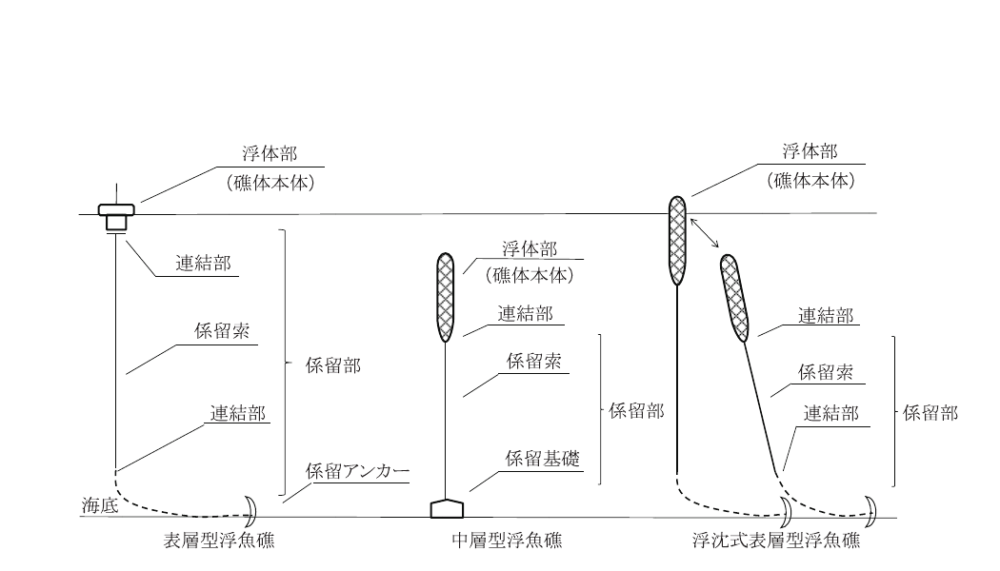

図 15-3-2 浮魚礁の構造形式

#### 3.3.3 浮魚礁の性能照査に用いる主な作用

浮魚礁の性能照査にあたっては、流れ、波、風、付着生物等を考慮することを原則とする。浮魚礁の照査のための条件設定は、実測データに基づく統計資料等によることが望ましいが、統計資料等がない場合は適切な方法により推算することができる。

（1）流れとしては、海流、潮流、吹送流を考慮する。海流や潮流の実測値がない場合は、海図に記載された流速値や信頼おける数値計算結果を比較し総合的に検討するとよい。

（2）照査に用いる波は、「第2編第3章 波」を参照する。

（3）表層型浮魚礁の照査に用いる風は、当該海域における所要の再現期間に対応する風速として用いるとよい。

（4）当該海域における水深ごとの既往構造物上の付着生物の実測値から予測し、その影響を適切に評価することが望ましい。

（5）係留基礎の設置予定箇所周辺の底質条件を考慮することを原則とする。特に、岩礁域では係留索と岩礁との擦れ等で摩耗が大きくなる可能性があり、留意することが望ましい。

（6）供用期間を経過したら撤去を行うが、中層魚礁の撤去時に働く作用等は「中層型浮魚礁回収工事ガイドライン（案）」4) を参考にして検討するとよい。

### 3.4 表層型浮魚礁の性能照査

#### 3.4.1 利用性に関する性能照査

浮魚礁の設置水深、設置位置、構造等については、周辺での事例調査などを参照して、適切に決めることを原則とする。

#### 3.4.2 構造物の安全性に関する性能照査

**（1）作用**

表層型浮魚礁の照査にあたっては、浮体部及び係留部に働く作用として、自重、波・流れの力、浮力、生物付着による荷重、風力等を考慮するのがよい。

**① 浮体部に働く流体力**

a）浮体部に働く流れと波による定常作用外力 $F_W$ は、波に及ぼす浮体の影響が無視できるものとして次式で求めてよい。

$$
F_W = \frac{1}{2} \rho_0 C_D A_w \left( V^2 + \frac{1}{2} \beta V_m^2 \right) \tag{式 15-3-1}
$$

ここに、

- $\rho_0$：海水の密度（t/m3）
- $C_D$：浮体部の抗力係数
- $A_w$：浮体部の射影面積（m2）
- $V$：$V = v + v_b$ で、$v$ は海・潮流の流速、$v_b$ は吹送流で 60 分間平均風速の 3% の値とする。（$v_b = 0.03 U_{60}$）（m/s）
- $V_m$：有義波による海面最大流速（m/s）

$$
\beta = \begin{cases}
1, & V > V_m \\[6pt]
\dfrac{\pi - 2\alpha - \sin 2\alpha + 8(V / V_m) \sin \alpha - 4\alpha (V / V_m)^2}{\pi}, & V \leq V_m
\end{cases}
$$

ここに、

- $\alpha = \cos^{-1}(V / V_m)$（図 15-3-3 参照）
- $U_{60}$：設置予定海域の 60 分間平均風速（m/s）
- $U_{60} = 0.95 U_{10}$

ここで、設置予定海域における実測資料がない場合は、最寄りの陸上観測点における資料から海上風速を算出する。

- $U_{10} = 1.5 U_{10}'$

ここに、$U_{10}$：海上風速（10分間平均）（m/s）、$U_{10}'$：陸上風速（10分間平均）（m/s）

b）浮体部に作用する最大流体力を求めるには、波と流れの複合力を考えるとよい。

$$
F_F = F_D \left( \sin \theta + \frac{V}{V_m} \right)^2 - F_M \cos \theta \tag{式 15-3-2}
$$

ここに、

- $F_D$：抗力（kN）
- $F_M$：質量力（kN）
- $V_m$：係留索方向の波による最大水粒子速度（m/s）

上記で $F_F$ を最大にする位相 $\theta$ を求めて、そのときの $F_F$ を最大流体力とする。

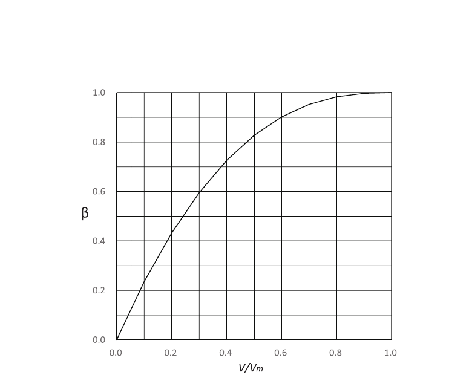

図 15-3-3 $V/V_m$ と $\beta$ との関係

c）表層型浮魚礁の浮体部の照査にあたっては、浮体が激浪時においても海面上を浮遊することを考慮して、船舶に作用する波圧の考え方を参考とするなどして、波による作用を適切に算定するとよい。

**② 係留部に作用する流体力**

係留索に作用する流体力は、係留部全体に作用する抗力の総和 $F_k$ として式 15-3-3 で算出してよい。

$$
F_k = \frac{1}{2} \rho_0 \int_0^h C_D A_k V_z^2 \, dh \tag{式 15-3-3}
$$

ただし、水深 100～700m の間は、式 15-3-3 で $h = 100$ m として式 15-3-4 を用いて求めた $F_k$ と式 15-3-5 を用いて求めた $F_k$ と比較して、大きな方の $F_k$ を用いるとよい。

ここに、

- $A_k$：係留索の射影面積（m2）
- $V_z$：海底からの高さ z における海・潮流の流速（m/s）

$V_z$ については、浮魚礁の照査の場合には、設置する海域の水深 h に応じて式 15-3-4～式 15-3-6 のいずれかにより算定してよい。

a）水深 $h \leq 100$ m の海域では、

$$
V_z = V_0 \left( \frac{z}{h} \right)^{1/7} \tag{式 15-3-4}
$$

b）100m $< h \leq$ 700m の海域では、

$$
V_z = V_0 \left( \frac{z}{h} \right) \tag{式 15-3-5}
$$

c）$h >$ 700m の海域では、

$$
\left. \begin{array}{ll}
V_z = V_0 \left( 1 + \dfrac{z - h}{700} \right) & (z > h - 700) \\[6pt]
V_0 = 0 & (z \leq h - 700)
\end{array} \right\} \tag{式 15-3-6}
$$

ここに、

- $V_0$：海面での海・潮流速

**③ 浮力**

次に示す浮体の浮力（$F_L$）を考慮するとよい。

$$
F_L = \rho_0 g V_W \tag{式 15-3-7}
$$

ここに、

- $V_W$：静水中に浮かべた時の浮体の海水排除容積（m3）
- $\rho_0$：海水の密度（t/m3）

**④ 付着生物による荷重**

浮体部及び係留部（アンカーチェーンを配する場合）において、海面から水深 60m までの範囲にある物体の全表面（海水と接する表面）に生物が付着するものとし、それによる重量、体積、射影面積の増加を考慮するのがよい。

付着生物の重量や付着生物厚さは海域条件によって大きく異なるため、当該海域の付着生物の重量や付着生物厚さを実測することを原則とする。ただし、実測値が得られない場合は、平均的な付着生物の重量として 80N/m2（水中）、付着生物厚さとして 7cm としてもよい。付着生物は海域や水深によって差が大きく、鋼構造物では最大で 700N/m2 という報告もあり、80N/m2 は平均的な値であることに留意すべきである。

**⑤ 風荷重**

表層型浮魚礁の静水面上の部材あるいは構造物に作用する風力は式 15-3-8 で求めてよい。

$$
F_A = \frac{1}{2} \rho_a U_{10}^2 \sum C_D A_a \tag{式 15-3-8}
$$

ここに、

- $F_A$：風力（kN）
- $U_{10}$：海上風速（10分間平均風速）（m/s）
- $\rho_a$：空気の密度（$1.25 \times 10^{-3}$ t/m3）
- $C_D$：海面上各部の抵抗係数で「第2編 7.3 風圧力」の表 2-6-2 の値
- $A_a$：海面上各部の風の射影面積（m2）

**⑥ その他**

その他の荷重としては、各海域に固有の現象として、次のようなものがあるので、設置海域によっては考慮するとよい。

a）着氷による重量、抵抗面積の増加

b）氷圧力

c）積雪荷重

d）流木など漂流物の衝突荷重

**（2）浮体の性能照査**

浮体は、当該海域の気象・海象条件などに対して安定となるようにして照査する。表層型浮魚礁の安定性は、一般に次の項目について検討するとよい。

**① 静的安定性**

式 15-3-9 により、メタセンター高さ（GM）を求め、その値が正になるように浮体の喫水（D）を与える。そのとき、喫水は異常時に水没の可否を考慮して余剰浮力を勘案して定める。

$$
\overline{GM} = \frac{I}{V} - \overline{BG} \tag{式 15-3-9}
$$

ここに、

- $G$：重心、$B$：浮心、$M$：メタセンター
- $I$：喫水面の長軸に対する断面二次モーメント（m4）
- $V$：浮体の排水容積（m3）

**② 動的安定性**

図 15-3-4 に示すように、浮体の各状態（曳航、設置状態、メンテナンス時など）の喫水における復元モーメントを浮体の各傾斜角に応じて求める。次に、風、潮流、係留力などの作用による浮体の転倒モーメントをいろいろな傾斜角について求め、復元モーメントと同じ図面上に図示する。

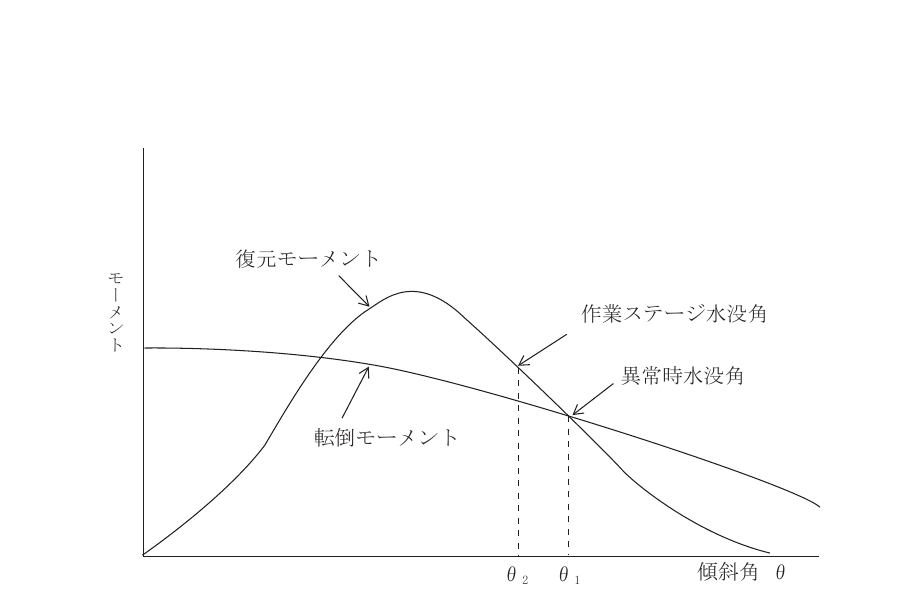

図 15-3-4 復元力曲線

a）異常時も水没を避ける場合

$$
\int_0^{\theta_1} R(\theta) d\theta \geq 1.1 \int_0^{\theta_1} I(\theta) d\theta
$$

b）メンテナンス時の場合

$$
\int_0^{\theta_2} R(\theta) d\theta \geq 1.3 \int_0^{\theta_2} I(\theta) d\theta
$$

ここで、

- $R(\theta)$：復元モーメント（kNm）
- $R(\theta) = W \overline{GM} \sin \theta$ 、$W$ は浮体重量（kN）
- $I(\theta)$：転倒モーメント（kNm）
- $\theta_1$：装置・機器の水没角、$\theta_2$：作業ステージの水没角

**③ 運動性能**

浮体の運動（ローリング、ピッチング、ヒービング、スウェイング、サージング）の固有周期と波の周期を一致させない構造及び係留系が望ましい。

**（3）係留部の性能照査**

表層型浮魚礁の係留部は、全ての作用及び施工時に予測される荷重に対して、所定の期間中、浮体部を安全に係留しうるように照査することを原則とする。また、回収時の作業に対しても十分な強度を有することを原則とする。

**① 係留部構成部材の選定**

係留部構成部材としては、チェーン、ワイヤー、合成繊維ロープ等があり、浮体に作用する浮力・流体力を考慮して、係留索の種類、断面等を決定することを原則とする。ただし、海底接地部での摩耗や海面付近での漁具との接触を考慮し、海底及び海面付近の一部にチェーン等を併用する場合が多い。

**② 係留力の算定**

係留力は、係留形態（緩係留、緊張係留）に応じて、浮魚礁本体及び係留索に働く作用から適切に算定するのがよい。

**1）** 表層型浮魚礁は、一般に係留索長／水深比が 1.2 より大きい緩係留方式で係留される。この場合、係留索に生じる係留力の算定は、原則として係留索の水中重量を考慮したカテナリー計算により行う。しかし、計算の結果、作用外力が大きく係留形状が直線状（緊張係留）となる場合には、原則として後述の最大作用力による方法により行う。

カテナリー計算による方法において、作用外力（$F$）は次の値とする。

$$
F = F_A + F_W + F_K + F_F = T_H \tag{式 15-3-10}
$$

とすると、

$$
T_{M1} = \sqrt{T_H^2 + T_{V1}^2} \tag{式 15-3-11}
$$

$$
T_{M2} = \sqrt{T_H^2 + T_{V2}^2} \tag{式 15-3-12}
$$

ここに、

- $F_A$：風の作用力（kN）
- $F_W$：浮体に作用する流れと波による定常外力（kN）
- $F_K$：係留索に作用する抗力（kN）
- $F_F$：波による変動外力（kN）
- $T_H$：浮体係留点の索張力の水平分力（kN）
- $T_{M1}$：係留索上端における張力（kN）
- $T_{M2}$：係留索下端における張力（kN）
- $T_{V1}$：係留索上端における鉛直分力（kN）
- $T_{V2}$：係留索下端における鉛直分力（kN）

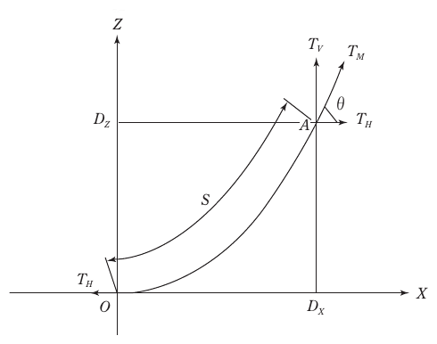

図 15-3-5 係留索の作用力（カテナリー係留）

上記の $T_{V1}$ と係留基礎から浮体までの水平距離 $D_x$（m）については、図 15-3-6 を用いて、$T_H$ から算定することができる。また、$T_{V2}$ については、次式から算定する。

$$
\left. \begin{array}{ll}
\dfrac{T_{V1}}{W_k \ell} \leq 1 \text{ の場合、} & \dfrac{T_{V2}}{W_k \ell} = 0 \\[8pt]
\dfrac{T_{V1}}{W_k \ell} > 1 \text{ の場合、} & \dfrac{T_{V2}}{W_k \ell} = \dfrac{T_{V1}}{W_k \ell} - 1
\end{array} \right\} \tag{式 15-3-13}
$$

ここで、$\ell$ は係留索長（m）、$W_k$ は係留索の単位長さ当たりの水中重量（kN/m3）である。

以上より、$T_{M1}$ 及び $T_{M2}$ が算定される。

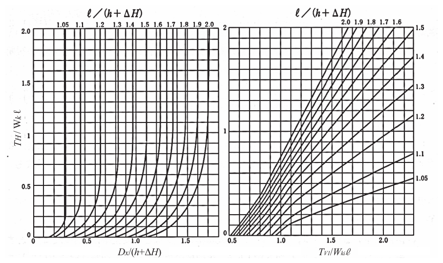

図 15-3-6 カテナリー理論に基づく索張力の水平分力（$T_H$）に対する索上端の水平変位（$D_x$）と索上端張力の鉛直分布（$T_{V1}$）

**2）** 係留索が緊張状態になる場合、作用外力（$F$）は次の値とする。

$$
F = F_A + F_F + F_K \tag{式 15-3-14}
$$

ここに、

- $F_A$：風力（kN）
- $F_F$：浮体に作用する波と流れの合成最大作用力（kN）
- $F_K$：係留部に作用する抗力（kN）

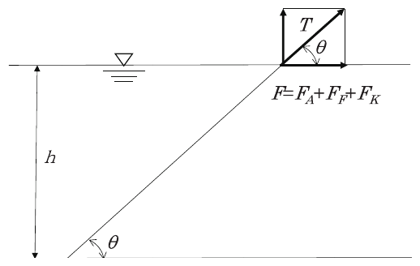

図 15-3-7 係留索緊張時の作用力

係留張力は図 15-3-7 より

$$
\left. \begin{array}{l}
T \cos \theta = F \\
T \sin \theta = F \tan \theta < N
\end{array} \right\} \tag{式 15-3-15}
$$

ここに、

- $F$：最大作用力（kN）
- $T$：係留索張力（kN）
- $\theta$：係留索が海底面となす角
- $N$：余剰浮力（kN）

以上より

$$
T = \frac{F}{\cos \theta} \tag{式 15-3-16}
$$

一方、張力 $T$ が働いたとき、係留索の伸び $x$ は、係留索の伸び係数 $K$、係留索の初期長さとしたとき、

$$
\sin \theta = \frac{h}{\ell + x} = \frac{h}{\ell + T / K} \tag{式 15-3-17}
$$

の関係が得られる。つまり、

$$
K (\ell \sin \theta - h) \cos \theta + F \sin \theta = 0 \tag{式 15-3-18}
$$

今、$K$, $\ell$, $h$, $F$ が与えられるので $\theta$ が求まり、式 15-3-15 より係留張力 $T$ が求められる。

**③ 係留索の安全率及び強度劣化**

**a) 係留索の安全率**

係留索に用いるチェーン、ワイヤー、合成繊維ロープなどの安全率は以下の値としてよい。

| 種類 | 安全率 |
|---|---|
| チェーン | 3（「第5編 2.5 浮防波堤 係留索の検討」による切断試験荷重に対して） |
| ワイヤーロープ | 3（水と絶縁された状態で、規格（保証）切断荷重に対して） |
| 合成繊維ロープ | 3（規格切断荷重に対して） |
| 高機能繊維ロープ | 3（材質の使用条件により異なるので、合成繊維ロープの場合と同様に十分な検討が必要） |

係留索の安全性の確認は、②を参照して、供用期間経過後の断面または強度に対して行うのがよい。

**b) 係留索の強度劣化**

係留索のチェーンや取付金具については、摩耗・腐食速度は当該海域の実測値を参考にして検定することが望ましいが、実測値がない場合、1mm／年を用いてもよい。ただし、係留索が重量のあるワイヤーロープとチェーンで構成された表層型浮魚礁では、係留索の摩耗・腐食速度がさらに大きくなるので留意すべきである。既往の検証データによると、ワイヤーとチェーンで構成された係留索である表層型浮魚礁の実測から求めた摩耗・腐食速度は、係留環や上部チェーンで 10mm／年を超える場合もある。また、合成繊維ロープとチェーンで構成された係留索でもチェーンやシャックルの摩耗・腐食速度が大きいことがある。このように摩耗・腐食し易い部分は 1mm／年以上になることを留意することが望ましい。また、係留索の浮体との取付部や係留索の海底接地部については、浮体動揺による摩耗が激しいため、取り付け方法、取付金具に留意することが望ましい。特に、下部チェーンの海底設置部付近は動揺による摩耗が激しいので連結部を設けず、底質は岩礁域を避けることが望ましい。合成繊維ロープの強度劣化については、式 15-3-19 によって算出してよい。

$$
T_n = T_0 (K_1 K_2) \tag{式 15-3-19}
$$

ここに、

- $T_n$：$n$ 年後のロープの強度（kN）
- $T_0$：ロープの初期強度（kN）
- $K_1$：長期的な強度劣化係数
- $K_2$：ロープ端末の処理方法による強度低下

**1）** 海水中での長期的な強度劣化 $K_1$

$$
K_1 = (1 - \alpha)^n
$$

ここで、

- $n$：経過年数
- $\alpha$：強度劣化率（ロープの素材によるが、一般的には 0.1 としてよい）

**2）** ロープ端末の処理方法による強度低下 $K_2$

一般にロープは、曲率半径の2倍/ロープ径（$D/d$）の比が小さいと疲労・損傷が早く、$D/d$ が 1～2 の場合、強度効率が 50～60% であり、曲げに対する割り増し係数 1.6～1.7 は安全を確保する意味で考慮する。これを、強度低下として係数にすると以下のようになる。

$K_2 = 0.59$ ～ $0.63$

**④ 係留基礎**

浮魚礁の係留基礎は、係留索に最大張力が作用した際に移動しない形式・質量とする。浮魚礁の係留基礎の形式としては、把駐力式と重力式があるが、表層型は把駐力式である場合が多い。

把駐力式の場合の把駐力の算定方法等は、「第5編 2.5 浮防波堤 p）係留基礎」を参照するとよい。

なお、把駐力式の場合、係留基礎に上向きの力が作用すると機能が著しく低下するので、アンカーチェーンの併用などにより、上向きの力を抑制するための配慮をすることが望ましい。

**（4）構造の照査**

表層型浮魚礁の構造の照査にあたっては、波力等の作用を考慮するとともに、機器類を装備する場合は、機器類の機能が適正に発揮されるよう配慮するとよい。

以下に構造の照査の留意事項を示す。

1）表層型浮魚礁の浮体部の強度に際しては、浮体の最大没水時の静水圧及び波圧に耐える構造とする。

2）連結部は、ねじれ、摩耗に対して耐久性のある構造とし、繰り返し荷重による劣化を考慮する。

3）浮体の空気中の部材の防食方法については、浮防波堤及び浮消波堤に準じ、塗装と腐食代の併用とし、水中部については、浮魚礁の設置位置が沖合で潮流が速いこと、維持管理が困難なことを考慮し、塗装、腐食代、電気防食の併用など、適切な方法を選択することがよい。

4）乾出部の部材から伝わる応力に対して、浮体部が有害な変形などを起こさない構造とする。

5）喫水線付近は、作業船の接触、流木などの浮遊物や船舶の衝突、さらには砕波などにより、最も損傷を受けやすい箇所であることから、局部的な強度についても十分検討する。

6）構造計算は、浮体の構成材料に応じて定められた各種の構造計算指針などに準拠したものとする。

7）現地組立、輸送・設置、吊り上げ状態などを想定した部材配置・強度検討が必要である。

8）全体構造の検討にあたっては、浸水による沈没を避けるため、二重殻構造、小区画割、発泡材の充填などについて検討するのが望ましい。

9）付属機器には、波浪による加速度が作用するため、自重の重い付属機器の取付部周辺の構造の検討にあたっては、自重に加えてこの加速度による慣性力を考慮するとよい。

10）浮魚礁には、船舶の航行に対する本体の安全確保のため、安全灯を搭載するとともに、位置センサー等の流失警報発信機を搭載することとする。また、浮魚礁には、風向・風速、水温等の漁場環境関連データを取得するための機器を装着した多機能なものもある。これらの機器については、設置箇所の気象・海象等の自然条件に耐えうるものであることを原則とする。

### 3.5 中層型浮魚礁の性能照査

#### 3.5.1 利用性に関する性能調査

浮魚礁の設置水深、設置位置、構造等については、周辺での事例調査などを参照して、適切に決めることを原則とする。

#### 3.5.2 構造物の安全性に関する性能照査

**（1）作用外力**

中層型浮魚礁の照査にあたっては、浮体部及び係留部に作用する作用として、自重、波・流れの力、浮力、生物付着による荷重を考慮するものとする。

ここで取り扱う中層型浮魚礁は、設置される水深が設計波の 1/2 波長以上深く、浮体部の定位する位置は船舶の航行に支障を生じない水深に緊張された形式とする。また、本節に記述されない事項については、「本編 3.3 表層型浮魚礁」に準ずることができる。

1）付着生物による影響については、表層型浮魚礁に準じて評価する必要があるが、併せて使用実績の多い網状部位については、目詰まり現象など不測の事態が発生する可能性があるので、慎重に検討するとよい。

2）静水圧及び浮力については、表層型浮魚礁に準じて計算することができる。

3）緊張係留の場合、係留索が弛緩すると次に伸張するときに大きな衝撃力が生じ、連結部や係留索の破断の原因となる。これを避けるためには、余剰浮力を浮体部に働く流体力の鉛直方分力よりも大きくすることを原則とする。したがって、1本の係留索で緊張係留された中層型浮魚礁は、式 15-3-20、または式 15-3-21 で算定された値のうちどちらか大きい方を必要余剰浮力（N）として計算することができる。

$$
N > \frac{(h - z_0)}{\ell} \cdot \frac{F_H + \dfrac{1}{2} F_{tH}}{\sqrt{1 - \left( \dfrac{h - z_0}{\ell} \right)^2}} + F_V \tag{式 15-3-20}
$$

ここに、

- $h$：水深（m）
- $z_0$：浮体部の海面からの深さ（m）
- $\ell$：係留索長さ（m）
- $F_H$：浮上部に働く流れのみによる流体力の水平分力（kN）
- $F_V$：浮上部に働く流れのみによる流体力の鉛直分力（kN）
- $F_{tH}$：係留索に働く流れのみによる流体力の水平分力（kN）

また、係留索が弛緩しないための余剰浮力は

$$
N > (F_w)_{\text{max}} / \cos \varphi \tag{式 15-3-21}
$$

ここに、$(F_w)_{\text{max}}$ は式 15-3-23 による値、$\varphi$ は式 15-3-25 による値

4）中層型浮魚礁の各部に作用する流体力の水平成分は、表層型浮魚礁に準じて算定してよい。

5）中層型浮魚礁が流れによる流体力によって $\varphi$ だけ係留索が傾いているとき、波による上下方向の流体力 $F_w$ は、設置位置の水深が大きいことから深海波として、波による最大上下水粒子速度を $V_m$、中層型浮魚礁の海表面から測った深さを z とすると、

$$
\left. \begin{array}{l}
F_D = \dfrac{1}{2} \rho_0 C_D A_v V_m^2 \\[6pt]
F_M = \rho_0 C_M V_0 \dfrac{2\pi}{T} V_m \\[6pt]
V_m = \dfrac{\pi H}{T} e^{-2\pi z / L_0} \\[6pt]
L_0 = \dfrac{g T^2}{2\pi}
\end{array} \right\} \tag{式 15-3-22}
$$

ただし、$A_v$：上下方面に関する射影面積（m2）、$V_0$：生物付着、静水圧による変形を考慮した浮体の見掛けの体積（m3）とおいて、波力の最大値 $(F_w)_{\text{max}}$、最小値 $(F_w)_{\text{min}}$ は式 15-3-23 により求められる。

$$
\begin{array}{l}
F_M > 2 F_D \text{ のとき} \\
\left. \begin{array}{l}
(F_w)_{\text{max}} \\
(F_w)_{\text{min}}
\end{array} \right\} = \pm \, F_M \\[12pt]
F_M \leq 2 F_D \text{ のとき} \\
\left. \begin{array}{l}
(F_w)_{\text{max}} \\
(F_w)_{\text{min}}
\end{array} \right\} = \pm \left( F_D + \dfrac{F_M^2}{4 F_D} \right)
\end{array} \tag{式 15-3-23}
$$

**（2）浮体の性能照査**

「本編 3.4 表層型浮魚礁の性能照査」に準ずることができる。

**（3）係留部の性能照査**

中層型浮魚礁の係留部は、全ての作用及び施工時に予測される荷重に対して、所定の期間中、浮体部を安全に係留しうるように照査することを原則とする。また、回収時の作業に対しても十分な強度を有することを原則とする。

1）中層型浮魚礁の各部に作用する流体力は、浮体部が波に対して共振しないものとして算定することが望ましい。

静水中に係留設置された中層型浮魚礁を自由振動させたときの振動周期を浮魚礁の固有周期（以下単に固有周期と記す）と定義する。

固有周期に等しい周期的な作用（波力）の下では、中層型浮魚礁は共振して、係留部に大きな力が作用して破壊の原因となるため固有周期は波の周期と一致させないよう照査することが望ましい。中層型浮魚礁は、重心、浮心と係留索の着力点が一致し、係留索の一点浮魚礁の固有周期 $T_0$ は、式 15-3-24 で示される。

$$
T_0 \geq 2\pi \sqrt{\frac{\ell}{g} \sqrt{\frac{C_{MA} + \rho_{GA} / \rho_0}{1 - \rho_{GA} / \rho_0}}} \tag{式 15-3-24}
$$

$$
\frac{\rho_{GA}}{\rho_0} = 1 - \frac{N}{\rho_0 g V_0}
$$

ここに、

- $\rho_{GA}$：魚礁全体の見掛けの単位体積質量（t/m3）
- $V_0$：魚礁全体の見掛けの体積（m3）
- $C_{MA}$：付加質量係数
- $\ell$：係留索長（m）
- $N$：式 15-3-20 または式 15-3-21 で求まる余剰浮力（kN）

2）係留索の傾き $\varphi$ は以下の式により求められる。

$$
\left. \begin{array}{l}
\varphi = \tan^{-1} \left( \dfrac{F_0}{N} \right) \\[8pt]
F_0 = \dfrac{1}{2} \rho_0 \left( \sum C_{Di} A_i \right) V^2 \\[8pt]
N = (\rho_0 - \rho_G) g V_0
\end{array} \right\} \tag{式 15-3-25}
$$

ここに、

- $\rho_G$：浮魚礁の単位体積質量（t/m3）
- $C_{Di}$：各形状に応じた抗力係数（表 15-2-1 の値）
- $A_i$：浮魚礁の各部材の流れに対する射影面積（m2）
- $V$：海・潮流速（吹送流は無視する）（m/s）
- $V_0$：浮魚礁の見掛けの体積（m3）

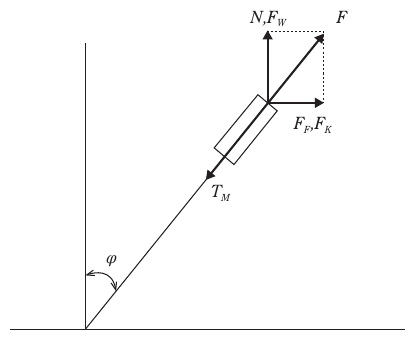

図 15-3-8 中層型浮魚礁の作用力図

3）中層型浮魚礁が一点緊張係留されている場合の係留張力は、式 15-3-26 により算出される。

$$
T_M = (N + F_w) \cos \varphi + (F_K + F_F) \sin \varphi = F_{\text{max}} \tag{式 15-3-26}
$$

ここに、

- $F_w$：式 15-3-23 による波の鉛直方面の流体力
- $F_F$：式 15-3-2 による波と流れによる変動力
- $F_K$：式 15-3-3 による係留索に作用する流体力

なお、中層型浮魚礁の係留張力算定に際しては、式 15-3-26 により求まる設置後の係留力以外に、設置工事時に発生する投入工法による荷重を考慮しておく必要がある。投入工法により係留索に発生する張力は、設置水深、係留基礎の形状及び重量、さらに投入状況などによって変化するため、それらの状況に応じて個別に検討するとよい。

4）中層型浮魚礁の係留基礎は、重力式である場合が多い。重力式の場合は、一般にコンクリートブロックが用いられ、ブロックの安定質量は、次式で算定してよい。

$$
W = \frac{T_M (F_s \sin \varphi + \mu \cos \varphi)}{\mu \left( 1 - \dfrac{\rho_0 g}{\sigma_G} \right) g} \tag{式 15-3-27}
$$

ここに、

- $W$：ブロックの質量（t）
- $T_M$：係留索最大張力（kN）
- $\varphi$：係留索の鉛直となす角
- $\mu$：ブロックと海底基盤との摩擦係数
- $F_s$：滑動に対する安全率で 1.2 とする

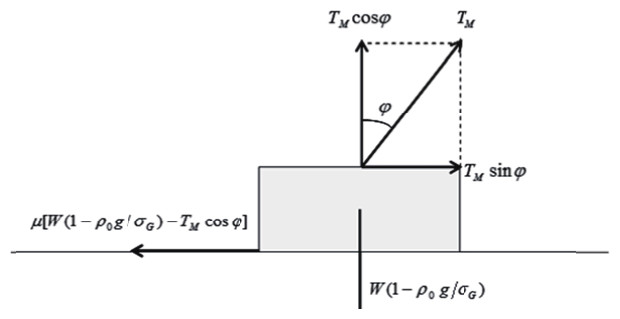

図 15-3-9 係留基礎（ブロック）に作用する力

なお、把駐力式の場合については、表層型浮魚礁を参照してよい。

**（4）部材の安全性の照査**

「本編 3.4 表層型浮魚礁の性能照査」に準拠することができる。

### 3.6 浮沈式表層型浮魚礁の性能照査

浮沈式表層型浮魚礁は急潮時に沈する表層型浮魚礁であり、通常時は表層型浮魚礁の性能照査（「本編 3.4 表層型浮魚礁の性能照査」）に準じて照査する。沈水時は中層型浮魚礁の性能照査（「本編 3.5 中層型浮魚礁の性能照査」）に準じて照査する。

**（参考文献）**

1）マリノフォーラム 21：浮魚礁設計・施工技術基準, MF21 技術資料, No.12（1992）, 114p.

2）マリノフォーラム 21：中層型浮魚礁共通仕様書（改訂版）（2003）, 19p.

3）木村晴保：浮魚礁の係留索張力の算定法, 水産工学, Vol.37, No.3（2001）, pp.217-227

4）マリノフォーラム 21：中層型浮魚礁回収工事ガイドライン（案）（2012）, 37p.
