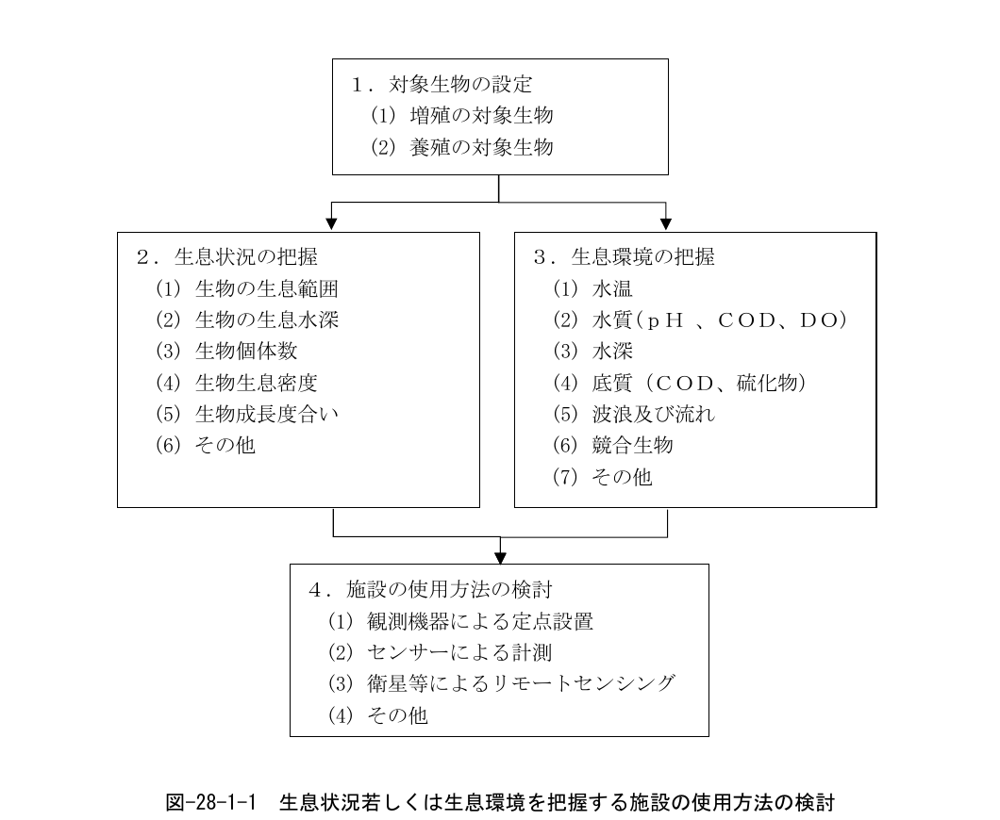

# 第28編 増殖及び養殖を推進するための事業により整備される施設

## 1 増殖及び養殖を推進するための事業により整備される施設の目的

> 増殖及び養殖を推進するための事業により整備される施設の目的は、対象生物の生息状況若しくは生息環境を的確に把握し、又は対象生物の種苗を生産することを基本とする。

## 2 増殖及び養殖を推進するための事業により整備される施設の要求性能

> 増殖及び養殖を推進するための事業により整備される施設の要求性能は、生物に応じて、以下の要件を満たしていること。

1. 増殖及び養殖を推進するための事業により整備される施設の要求性能は、対象生物の生息状況若しくは生息環境を的確に把握ができるよう、それらの保全を考慮して、適切なものとする。
2. 水産動植物の種苗を生産する施設の要求性能は、「第10編　水産種苗生産施設」の規定を準用する。

## 3 増殖及び養殖を推進するための事業により整備される施設の性能規定

> 増殖及び養殖を推進するための事業により整備される施設の性能規定は、以下に定めるとおりとする。

1. 対象生物の生息状況若しくは生息環境を的確に把握できるよう、それらの保全を考慮して、必要な設備機能を有すること。
2. 増殖及び養殖を推進するための事業により整備される施設に必要な設備等は、海洋水産資源開発促進法（昭和46年法律第60号）等の関連法規に準じていること。
3. 水産動植物の種苗を生産する施設の性能規定は、「第10編　水産種苗生産施設」の規定を準用する。

## 4 増殖及び養殖を推進するための事業により整備される施設における設計条件の設定

増殖及び養殖を推進するための事業により整備される施設は、図-28-1-1のフローのように、対象生物の設定から、生息状況若しくは生息環境を把握し、その使用方法を決定する。

図 28-1-1 生息状況若しくは生息環境を把握する施設の使用方法の検討

## 5 関連法令等

本編策定において遵守すべき法令並びに参考となる図書等を以下に示す。

**［法令等］**

- 海洋水産資源開発促進法・同施行令・同施行規則
- 航空法・同施行令・同施行規則
- 電波法・同施行令・同施行規則

**［基本方針］**

- 海洋水産資源の開発及び利用の合理化を図るための基本方針（以下、「基本方針」という。）（「海洋水産資源開発促進法」第三条第1項に基づく）　水産庁

**［参考図書］**

- 海洋環境モニタリング指針　監修 環境庁水質保全局

## 6 施設設計

### 6.1 生息状況の把握

増殖を計画している海域内あるいは、養殖している生簀内に生息している生物の個体数、生息密度、成長度合い等について、適切な調査時期及び頻度で把握する。

### 6.2 生息環境の把握

生物の生息環境を把握するにあたっては、基本方針の第1の2に記載されている、「増殖又は養殖を推進することが適当な水産動植物の種類ごとの増殖又は養殖に適する自然的条件に関する基準」を参考とすることが望ましい。

水温については、基本方針の第1の2の（1）に記載されている、別表を参考にしてよい。

水質については、基本方針の第1の2の（2）に記載されている、水素イオン濃度（pH）、化学的酸素要求量（COD）、溶存酸素量（DO）の基準を参考にしてよい。

底質については、基本方針の第1の2の（3）に記載されている、化学的酸素要求量（COD）、硫化物の基準を参考にしてよい。

その他、生物の生息環境の特徴に応じて、水深、波及び流れ、競合生物等についても調査することが望ましい。

### 6.3 施設の使用方法の検討

施設には、観測機器を定点に設置することによって連続して計測できるものや、電磁波等のセンサーを用いて、広範囲の計測を行うことができるもの、人工衛星を用いたリモートセンシング等がある。
