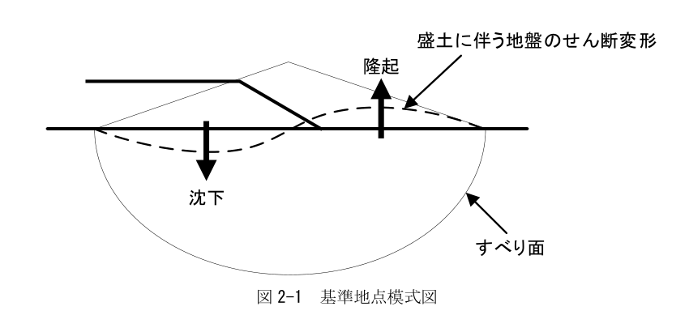
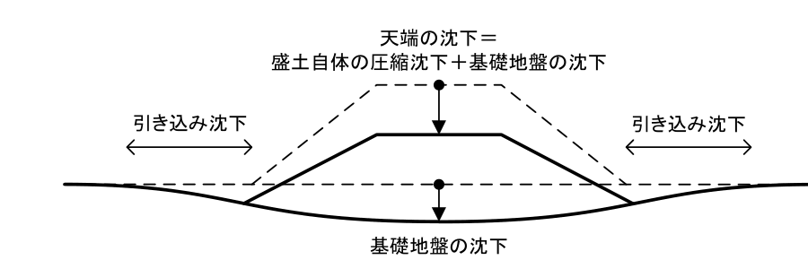
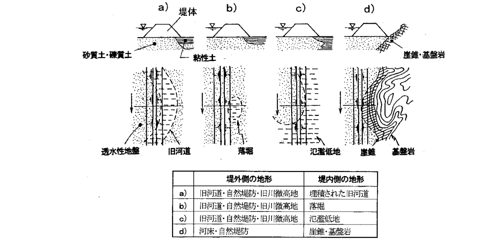

## 第2節 堤防

### 2.1 総説

#### 2.1.1 目的と適用範囲

＜考え方＞

本節は、既設の堤防の拡築や新堤の整備に適用するものであるが、既設の堤防の安全性能の照査にも準用できるものである。

適用の対象とする堤防は、流水が河川外に流出することを防止するために設ける堤防であり、このような堤防には、湖岸堤、高潮堤、霞堤（堤防のある区間に開口部を設け、上流側の堤防と下流側の堤防が、二重になるようにした不連続な堤防。なお、下流側の堤防を山付きとする場合もある。）及び特殊堤等が含まれる。

なお、高規格堤防については、構造令及びそれに関連する基準等により別途規定されているため、本節の適用外とする。

また、洪水時等に遊水地等における洪水調節のため、洪水の一部を越流させて河道の外部に導くために設けられる越流堤、遊水地、堤防と河道を仕切るために設けられる囲繞堤、河川の合流に際して流れを分離して、一方の河川がもう一方の河川に与える背水等の影響を低減するために設けられる背割堤、河川、湖沼、海において流れを導き、土砂の堆積やそれに伴う閉塞又は河川の深掘れを防ぐために設けられる導流堤については、必要に応じて模型実験や水理計算等の検討を行い、それぞれの設置目的に応じて十分な機能を発揮する安全な構造を個別に定めるものであるため、本節の適用外とする。

＜標　準＞

> 本節は、流水が河川外に流出することを防止するために設ける堤防について適用する。

＜関連通知等＞

1. 建設省河川局長通達：河川管理施設等構造令及び同令施行規則の施行について、昭和51年11月23日、建設省河政発第70号。

#### 2.1.2 用語の定義

＜標　準＞

> 次の各号に掲げる用語の定義は、それぞれ以下に示す。
>
> 一．土堤　盛土により築造された堤防
>
> 二．特殊堤　全部若しくは主要な部分がコンクリート、鋼矢板若しくはこれに準ずるものによる構造で盛土の部分がなくても自立する構造の堤防又はコンクリート構造若しくはこれに準ずる構造の胸壁を有する構造の堤防
>
> 三．湖岸堤　湖沼において、風の吹き寄せに伴う波浪や越波等による堤内地の被害を防ぐ目的で設置される堤防
>
> 四．高潮堤　高潮区間において、高潮に伴う波浪や越波等による堤内地の被害を防ぐ目的で設置される堤防
>
> 五．計画堤防断面形状　河川整備基本方針で定められた計画高水流量及び計画高水位に従って、河川管理施設等構造令（以下「構造令」という。）に基づき最低限確保すべき高さ、天端幅、のり勾配等を満たし、当該河川の過去の洪水実績等の経験を踏まえて定める堤防の断面形状

### 2.2 機能と設計に反映すべき事項

#### 2.2.1 機能

＜考え方＞

我が国は沖積河川の氾濫原に人口・資産が集中しており、堤防は、人命と財産を洪水及び高潮から防御する極めて重要な河川構造物である。したがって、計画高水位（高潮区間においては計画高潮位）以下の水位の流水の通常の作用に対し、流水が河川外に流出することを防止する必要がある。すなわち、堤防に求められる機能は、護岸、水制その他これらに類する施設と一体として、河道計画で定められた計画高水位（高潮区間においては計画高潮位）以下の水位の流水の通常の作用による侵食や浸透に対して安全な機能を有することである。また、流水による堤防への浸透を規定する条件として、降雨の浸透により形成される堤体内の土壌水分あるいは堤体内の浸潤面の状況が重要であり、これらを考慮する必要がある。

堤防は、通常起こり得る現象である「計画高水位（高潮区間においては計画高潮位）以下の水位の流水の通常の作用及び降雨による浸透」に対して安全に造られるべきである。但し、洪水は自然現象であるため、既往洪水による被害の実態や河川の特性を踏まえた計画規模の洪水と比較して、継続時間が著しく長いものが発生しないとは限らない。そのため、このような考え方に基づき造られた堤防が計画高水位以下の洪水に対して絶対的な安全性を有するものではないことに留意すべきである。

常時においては、堤防の築造や嵩上げ及び腹付けに伴う堤防の自重増加による基礎地盤の沈下、変形及びすべり破壊等に対して安全であることが求められる。

地震時においては、堤防に変形又は沈下が生じた場合においても、河川の流水の河川外への越流を防止する機能を有することが求められる。加えて、地震時には津波が発生する可能性があり、津波来襲時に計画津波の遡上により流水の河川外への越流を防止する機能を有することが求められる。

また、洪水等による被害を軽減するものとして水防活動等の緊急措置が実施されることも多いことから、堤防には、計画高水位（高潮区間においては計画高潮位）以下の水位の流水の通常の作用及び降雨による侵食や浸透並びに降雨による浸透に対して安全な機能を有するとともに、洪水時及び高潮時に迅速な応急復旧活動及び水防活動が実施されることにも留意が必要である。

＜必　須＞

> 堤防は、護岸、水制その他これらに類する施設と一体として、計画高水位（高潮区間においては計画高潮位）以下の水位の流水の通常の作用による侵食及び浸透並びに降雨による浸透に対して安全である機能を有するよう設計するものとする。また常時に自重による沈下及びすべり破壊等に対して安全であるとともに、地震時に流水が河川外に流出することを防止する機能を有するよう設計するものとする。

＜関連通知等＞

1. 建設省河川局水政課長、治水課長通達：河川管理施設等構造令及び同令施行規則の運用について、昭和52年2月1日、建設省河政発第5号、建設省河治発第6号。

#### 2.2.2 設計に反映すべき事項

＜考え方＞

堤防に求められる機能を有するように設計する際、堤防の歴史的な経緯を踏まえることが重要である。すなわち、堤防は長い歴史の中で大洪水に遭遇して危険な状態になることを経験すると、その後順次嵩上げ及び拡幅等を実施することにより強化を図ってきた構造物である。また、時代によって築堤材料や施工法が異なるため、堤体の強度が不均一であることの影響が大きいことと等を踏まえておく必要がある。

＜標　準＞

> 堤防は、複雑な基礎地盤の上に築造され、過去の災害に応じて嵩上げ及び拡幅等の強化を重ねてきた歴史的な構造物であることを踏まえ、以下の項目を検討し、設計に反映するものとする。
>
> - 不同沈下に対する修復の容易性
> - 基礎地盤及び堤体との一体性及びなじみ
> - 嵩上げ及び拡幅等の機能増強の容易性
> - 損傷した場合の復旧の容易性
> - 基礎地盤及び堤体の構造及び性状に係る調査精度に起因する不確実性
> - 基礎地盤及び堤体の不均質性に起因する不確実性

その他、設計に当たっては、環境及び景観との調和、構造物の耐久性、維持管理の容易性、施工性、事業実施による地域への影響、経済性及び公衆の利用等を総合的に考慮するものとする。

＜関連通知等＞

1. （財）国土技術研究センター：河川堤防の構造検討の手引き（改訂版）、第2章 構造物としての河川堤防の特徴、2012.

### 2.3 堤防の材質と構造

＜考え方＞

堤防の材質と構造は、構造令に基づき土堤が原則である。これは、土堤が歴史的な経緯の中で、工事の費用が比較的低廉であること、材料の取得が容易であり構造物としての劣化現象が起きにくいこと並びに堤防に求められる機能及び設計に反映すべき事項等を満足してきたとみなすことができるためである。

土地利用の状況その他の特別の事情によりやむを得ないと認められる場合には、特例的に特殊堤とすることができる。中でもいわゆる自立式構造の特殊堤は特例中の特例と考えるべきであり、都市の河川の高潮区間等において限定的に設けられている。特殊堤においても、土堤と同様に「2.2 機能と設計に反映すべき事項」を満足することを確認する必要があり、土堤とは異なる構造であることを踏まえた維持管理を適切に行うことが重要となる。

＜必　須＞

> 堤防の材質と構造は、構造令に基づき土堤とする。
>
> ただし、土地利用の状況その他の特別の事情によりやむを得ないと認められる場合には、特殊堤とすることができる。

＜関連通知等＞

1. 国土交通省水管理・国土保全局：河川砂防技術基準 維持管理編（河川編）、第6章 施設の維持及び修繕・対策、平成27年3月。

### 2.4 設計の基本

＜考え方＞

本節でいう設計とは、計画堤防断面形状を確保した上で安全性能の照査を行い、必要に応じて強化工法の検討を行うまでの一連の作業の流れをいう。また、本節でいう強化とは、計画堤防断面形状を有する堤防において、安全性能の照査の結果が安全性能を満足しない場合に、安全性能を満足させるための対応をいう。

構造令では、土堤の断面形状（堤防の高さ、天端幅及びのり勾配等）の最低基準を河川の規模（流量）等に応じて規定する、いわゆる形状規定方式を基本としている。これは、堤防が洪水による被害を経験するたびに嵩上げ及び拡幅等を繰り返し築造されてきたこと並びに基礎地盤の構造が複雑で完全に把握することはできないといった不確実性を内在する中で、断面形状を既往の被災経験と実績をもとに設定することが合理的であると考えられたことによるところが大きい。さらに、場所によって堤防の断面が異なると住民に不安を与えることも形状規定方式がとられてきた背景のひとつと考えられる。このように、土堤による形状規定方式に基づく堤防の設計は、簡便で極めて効率的で、長年の経験を踏まえたものであり、堤防整備の基本として十分な役割を果たしてきた。

一方、形状規定方式に基づく堤防の設計手法は、堤防の安全性について所要の性能を満足するかどうかを確認する手法として限界を有していることも事実であり、既往の被災事例をみても、計画高水位以下の流水において、のりすべり等安全上問題となる現象が数多く発生している。そのため、形状規定方式で整備されてきた土堤の強化が必要とされ、その必要性や優先度を検討するために、堤防の設計においても一般の構造物の設計と同様、外力と耐力の比較を基本とする設計法（安全性照査法）を導入することが、その前提となる工学的手法が進展する中で求められてきた。

以上の考えから、平成9年の河川砂防技術基準（案）設計編の改定では、堤防の断面形状については従来の考えを踏襲しつつ、堤防の耐侵食性能及び耐浸透性能に関して、その性能毎に安全性能の照査を行い、照査の結果安全性能を満足しない場合には、強化工法を検討することが規定された。

＜必　須＞

> 堤防の設計に当たっては、土地利用の状況その他の特別の事情によりやむを得ないと認められる場合を除き、土堤による形状規定方式に基づき計画堤防断面形状の設定を行うものとする。
>
> さらに計画堤防断面形状を満たした上で、堤防に求められる機能を踏まえ、設計の対象とする状況と作用に応じた安全性能を設定し、照査によりこれを満足することを確認しなければならない。必要な場合は強化工法の検討を行うものとする。
>
> また、設計に当たっては、設計で前提とする締固め等の施工条件及び維持管理の条件を設定するものとする。

＜関連通知等＞

1. 国土交通省：土木工事施工管理基準（案）、平成28年3月。
2. （財）国土技術研究センター：河川土工マニュアル、第2章 河川土工のための調査 第2.1節 基礎地盤調査、2009.
3. 国土交通省水管理・国土保全局河川環境課：堤防等河川管理施設及び河道の点検要領並びに河川砂防技術基準調査編等が参考となる。

### 2.5 堤防の高さの設定

＜考え方＞

堤防は計画高水流量以下の流水を越流させないよう設けるべきものであり、堤防の高さの設定に当たっては、計画高水位（高潮区間においては計画高潮位）を河川砂防技術基準計画編の施設配置等計画編により設定する。これに加えて、洪水時及び高潮時等における風浪、うねりや躍水等による一時的な水位上昇への対応、巡視、水防活動及び地震災害時等の河川水利用等を考慮して円滑な車両通行の確保並びに地震災害時の河川水利用等を考慮し、構造令に基づき可能な限り広く設けるべきである。

＜必　須＞

> 堤防の高さは、河道計画において設定される計画高水位に、構造令で定める値を加えたものの以上とする。
>
> 湖沼、高潮区間又は津波区間の堤防の高さは、構造令に基づき定めるものとする。

＜例　示＞

> 堤内地盤高が計画高水位より高い、いわゆる堀込河道の区間にあっては、所定の余裕高を持たない低い堤防を計画することがあるが、一般に計画の規模が小さく、計画を超える洪水の頻度が高い河川の堀込河道の区間においては、越水被害を極力小さくする配慮が特に必要となる場合がある。以下、構造令第20条第1項におけるただし書きの運用について例示する。
>
> 1. 掘込河道の場合であっても、溢流部を特定させるのを避けるため、又は管理用通路の設置や明確化等のため、河岸にはある程度の盛土部分があることが望ましい。このような場合には、一般に1.0m程度の構造上の余裕を確保するものとされている。
> 2. 背後地が人家連担地域である場合は、計画高水流量に応じ所定の構造上の余裕を確保することが多い。
> 3. 掘込河道部分に構造上の余裕を設けることは築堤河道部分と計画以上の負担を背負うことになるので、このような場合には、構造上の余裕を状況に応じ0〜0.6mとする場合もありうる。
> 4. 内水による氾濫の予想される河川においては、構造上の余裕のための盛土がかえって内水被害を助長すると考えられる場合は、構造上の余裕が少なくなる。

＜関連通知等＞

1. 建設省河川局水政課長、治水課長通達：河川管理施設等構造令及び同令施行規則の運用について、昭和52年2月1日、建設省河政発第5号、建設省河治発第6号。
2. 国土交通省水管理・国土保全局：河川砂防技術基準計画編、施設配置計画編、平成30年3月。
3. 国土交通省水管理・国土保全局河川計画課長、治水課長通達：河川津波対策について、平成23年9月2日、国水河計第20号、国水治第35号。
4. 建設省河川局治水課長通達：堤防余盛基準について、昭和44年1月17日、建設省河治発第3号。

### 2.6 断面形状の設定

＜考え方＞

計画堤防断面形状の設定に当たっては、まず堤防整備区間を対象として河道特性又は洪水氾濫区域が同一若しくは類似する区間（以下「一連区間」という。）を設定し、堤防の高さ、天端幅及びのり勾配を定める必要がある。一連区間の境界は、支派川の分合流箇所又は山付き箇所に設定することを基本とするが、河川の特性、地形地質、堤内地の状況（地盤高等）及び想定される氾濫形態等も考慮して分割するものである。また、堤防の断面形状は、上下流及び左右岸の堤防の断面形状との整合性が強く求められる。

堤防の高さについては「2.5 堤防の高さの設定」に基づき設定する。

天端幅については、土堤の場合は浸透水に対して必要な堤防断面幅を確保するためのしかるべき幅を確保する必要がある他、堤防の天端は管理用通路として使用されるだけではなく、散策路や高水敷へのアクセス路として広く利用されており、それらの機能増進及びバリアフリー化の推進、あるいは洪水時等の河川巡視、応急復旧活動及び水防活動における円滑な車両通行の確保並びに地震災害時等の河川水利用等を考慮し、構造令に基づき可能な限り広く設けるべきである。

＜必　須＞

> 土堤の断面形状は、計画堤防断面形状を設定し、これを有するものとする。

＜標　準＞

> 計画堤防断面形状ののり面は、一枚のりを基本とする。

＜推　奨＞

> 堤防ののり面は表裏のりともにのり勾配が3割より緩い勾配とし、一枚のりの台形断面として設定することが望ましい。

＜関連通知等＞

1. 建設省河川局水政課長、治水課長通達：河川管理施設等構造令及び同令施行規則の運用について、昭和52年2月1日、建設省河政発第5号、建設省河治発第6号。

### 2.7 安全性能の照査等

#### 2.7.1 設計の対象とする状況と作用

＜考え方＞

安全性能の照査は、常時、洪水時、地震時、高潮時及び風浪時について実施する。常時、洪水時及び地震時については全ての堤防において照査する必要があるが、これに加えて、高潮堤の場合には高潮時、湖岸堤の場合には風浪時について照査することを基本とする。

設計の対象とする作用については、自重として堤体の自重、計画高水位（高潮区間においては計画高潮位）以下の水位の流水の通常の作用として流水による侵食及び浸透、降雨による浸透、地震動として河川構造物の供用期間中に発生する確率が高い地震動（以下「レベル1地震動」という。）及び対象地点において現在から将来にわたって考えられる最大級の強さを持つ地震動（以下「レベル2地震動」という。）並びにその他の作用として土圧、水圧の他、常時には降雨の影響、地震時には必要に応じて津波による侵食及び越波、高潮時には波浪による侵食及び越波並びに風浪時には波浪による侵食及び越波並びに吹き寄せによる水位上昇等が考えられ、設計の対象とする堤防の状況に応じて適切に組み合わせて設定する。

＜標　準＞

> 安全性能の照査に当たっては、設計の対象とする状況と作用を次の表のように設定し、これを踏まえて安全性能の照査事項を設定することを基本とする。

**表2-1 土堤の安全性能の照査項目と設計の対象とする作用及び河川水位**

| 堤防の状況 | 照査項目 | 作用 | 河川水位 |
|---|---|---|---|
| 常時 | 常時の健全性（常時のすべり破壊に対する安定、沈下）、雨水排水による侵食 | 自重、その他の作用（土圧、水圧、降雨等） | 通常想定される水位 |
| 洪水時 | 耐侵食性能（直接侵食、側方侵食）、耐浸透性能（すべり、パイピング） | 自重、計画高水位（高潮区間においては計画高潮位）以下の水位の流水の通常の作用（侵食作用、浸透作用）、降雨による浸透、その他の作用（土圧、水圧等） | （侵食作用）計画高水位及び必要に応じそれ以下の規模の洪水時水位、（浸透作用）計画降雨波形に基づき設定した水位波形 |
| 地震時 | 耐震性能（液状化による沈下） | 自重、地震動、その他の作用（土圧、水圧、必要に応じて津波による侵食及び越波等） | 通常想定される水位（津波による侵食及び越波）計画津波水位 |
| 高潮時 | 波浪等に対する安全性（侵食及び越波） | その他の作用（波浪による侵食及び越波等） | 計画高潮位 |
| 風浪時 | 波浪等に対する安全性（侵食及び越波） | その他の作用（風浪による侵食及び越波並びに吹き寄せ及び副振動（セイシュ）による水位上昇等） | 計画高水位又は風浪が最も発達する時の河川水位 |

＜標　準＞

> 土堤における安全性能については、計画堤防断面形状を有することを前提に、安全性能として「2.7.1 設計の対象とする状況と作用」に対し、以下の性能を設定し、照査することを基本とする。
>
> 1. 常時の健全性
> 2. 耐侵食性能
> 3. 耐浸透性能
> 4. 耐震性能
> 5. 波浪等に対する安全性
>
> 照査の結果、安全性能を満足しない場合には、強化工法の検討を行うことを基本とする。
>
> 照査手法は、これまでの経験及び実績から妥当と見なせる方法又は当該河川若しくは類似河川で被災等の実態を再現できる論理的に妥当性を有する方法等、適切な知見に基づく手法を用いることを基本とする。

#### 2.7.2 土堤の安全性能の照査

##### (1) 常時の健全性に対する照査

**① 常時のすべり破壊に対する安定の照査**

＜考え方＞

軟弱地盤においては、図2-1に示すように盛土高が高くなるにつれ沈下量及び隆起量は増大し、盛土荷重によるせん断力が基礎地盤のせん断抵抗を超えた場合、すべり面に沿って盛土は破壊する。

新堤の築造又は既設堤防の嵩上げ若しくは腹付けを行う場合で、それが軟弱地盤上に位置する場合には、常時のすべり破壊に対する安定を確認する必要がある。

軟弱地盤でない場合には、適切な施工が行われることを前提に、常時のすべり破壊に対する安定の照査を省略できることとしている。

なお、軟弱地盤の判定を行う際には河川土工マニュアルが参考となる。

図 2-1 基準地点模式図

＜標　準＞

> 常時のすべり破壊に対する安定の照査は、すべり安全率等の許容値を設定した上で、基礎地盤及び堤体の土質等を考慮し、自重によるすべり破壊に対する安全率等を評価し、許容値を満足することを照査するものとする。
>
> なお、実績等から軟弱地盤でない場合には、照査は省略できる。

**② 沈下の照査**

＜考え方＞

軟弱地盤においては、図2-2に示すように盛土の載荷に伴い、圧密により盛土の直下及び側方の基礎地盤に沈下が生じる。沈下を生じると堤防の健全性が損なわれる可能性があるため、沈下に対する照査を行う。さらには、基礎地盤の圧密沈下が大きくなると、周辺の地盤も一緒に沈下する現象（引き込み沈下と呼ばれる）が生じるため、周辺の土地利用と軟弱地盤の程度に応じて、周辺地盤への影響についても検討する必要がある。

図 2-2 堤防の自重による沈下

＜標　準＞

> 沈下の照査は、余盛り高を考慮した沈下量等の許容値を設定した上で、基礎地盤の圧密及び盛土の圧縮を考慮した沈下量等の変形を評価し、許容値を満足することを照査することを基本とする。
>
> なお、実績等から軟弱地盤でない場合には、照査は省略できる。

##### (3) 耐侵食性能の照査

＜考え方＞

耐侵食性能の照査は、堤防表のり面及びのり尻表面の直接侵食と、主流路（低水路）からの側方侵食及び洗掘に対して行うものである。

直接侵食については、被災実績から直接侵食が生じる堤防前面の流速を把握することが重要である。堤防前面の流速の算定に当たっては、河道の平面形及び縦横断形状、床止め及び水制の配置並びに堤防近傍の樋門、樋管及び橋脚の影響を考慮する。

側方侵食については、河川定期縦横断測量成果及び航空写真等を用いて、澪筋の位置の経年変化及び水衝部の位置の変化を把握することが重要である。

洗掘については、河川定期縦横断測量成果等を用いて、最深河床高の縦断図及びその変化並びにこれら縦断図を重ね合わせることで確認できる最も洗掘された河床高の縦断図を把握することが重要である。

＜標　準＞

> 耐侵食性能の照査は、過去の被災実績、護岸の設置状況及び堤防前面の高水敷幅等を踏まえた堤防のり面の侵食限界流速又は高水敷の侵食量等の許容値を設定した上で、河道の平面形及び縦横断形等を考慮し、洪水時の作用による侵食又は侵食量を評価し、許容値を満足することを照査することを基本とする。

##### (4) 耐浸透性能の照査

＜考え方＞

堤防の浸透破壊には、大きく分けてすべり破壊とパイピング破壊がある。すべり破壊は降雨や流水が堤体内の浸潤面を上昇させて、土のせん断強度が低下することにより生じ、パイピング破壊は、主に堤内側のり尻の基礎地盤付近の動水勾配が増加して発生する漏水や噴砂に起因し、それが拡大進行することにより生じる。

計画高水位（高潮区間においては計画高潮位）以下の水位の流水による浸透及び降雨による浸透に対する安全性能の照査としては、すべり破壊及びパイピング破壊に対する安全率等の許容値を設定し、これを超えないことを照査するものである。

＜標　準＞

> 耐浸透性能の照査は、すべり破壊及びパイピング破壊に対する安全率等の許容値を設定した上で、水位波形、降雨波形並びに基礎地盤及び堤体の土質等を考慮し、すべり破壊及びパイピング破壊に対する安全率等を評価し、許容値を満足することを照査することを基本とする。

＜例　示＞

基礎地盤等の土質を考慮する際、浸透に対する安全性能に影響を与えやすい基礎地盤を以下に例示する。

浸透が特に問題となる基礎地盤では、土質構成として透水性の異なる土質が複雑に分布する場合が多くみられる。透水性地盤において裏のり尻下に粘性土等の難透水層が分布していると、いわゆる行き止まり地盤を形成し、基礎地盤の浸透水が難透水層で行き止まり、堤体内へ上昇することで堤体内の浸潤面を押し上げ、漏水又はすべり破壊が発生しやすくなる場合がある。（図2-3参照）また、裏のり尻近傍の難透水層が薄い場合には、基礎地盤からの漏水やパイピング破壊が発生しやすくなる場合がある。

図 2-3 行き止まり型地盤の例

##### (5) 耐震性能の照査

＜考え方＞

耐震性能の照査は、「河川構造物の耐震性能照査指針」（以下「耐震性能照査指針」という。）に基づき、実施するものである。地震による堤防の被災は、液状化に起因するものがほとんどであるため、地震動により土壌が沈下し、流水又は計画津波等が堤内地に侵入することによって被害が発生する可能性があるため、地震動の作用により堤防が沈下することによっても、河川の流水の河川外への越流を防止する機能を保持することを照査する。

なお、レベル1地震動とレベル2地震動が加わった場合の土壌の変形、沈下等の損傷状況は異なるが、土堤の耐震性能の照査においては、地震時と洪水が同時に生起することは極めてまれであるため、原則として平常時の最高水位とする。

＜標　準＞

> 耐震性能の照査は、平常時の流水又は計画津波等が越流しないような地震後の堤防の高さ等の許容値を設定した上で、地震動による堤体変形後の高さ等を評価し、許容値を満足することを照査することを基本とする。

##### (6) 波浪等に対する安全性の照査

＜考え方＞

波浪の影響については、高潮時の波によるうねりや風浪又は湖沼における風浪等による侵食及び越波について検討を行うものであり、地形による波浪の増幅及び減衰、波浪の方向、屈折、回折、反射、消波及び越波の他、堤防の構造（のり勾配又は波返工の有無等）、堤内地の利用状況（将来を含む）及び海岸等関連する他事業との調整等についても十分な配慮が必要となる。

＜標　準＞

> 波浪又は津波の影響を著しく受ける堤防についての波浪又は津波による侵食に対する安全性の確認は、高潮時は計画高潮位、風浪時は計画高水位又は風浪が最も発達する時の河川水位以下の流水による堤体への侵食に対し、過去の被災実績等を考慮し安全が確保されることを確認することを基本とする。

#### 2.7.3 特殊堤の安全性能の照査

＜考え方＞

市街地又は重要な施設に近接する堤防で用地取得が極めて困難な場合等においては、土堤以外の構造を採用する場合があり、都市の河川の高潮区間等においていわゆる特殊堤が限定的に築造されている。

特殊堤を採用する場合は、設計の基本で示した計画堤防断面形状を定める必要はないが、当該河川における計画堤防断面形状を有する土堤と同等以上の安全性能を満足する必要がある。

**①耐震性能の照査**

自立式構造の特殊堤における耐震性能の照査は、耐震性能照査指針に基づき、実施するものである。レベル1地震動に対しては、地震によって特殊堤としての健全性を損なわないかを照査するものである。レベル2地震動に対しては、堤内地盤高が平常時の最高水位よりも低い地域の特殊堤については、地震にありある程度の損傷が生じた場合においても河川水が堤内地に侵入することによって浸水等の二次災害を発生するか否かを照査し、それ以外の地域の自立式構造の特殊堤については、地震後に特殊堤としての機能が応急復旧等により速やかに回復できるか否かを照査するものである。

**②耐震性能以外の安全性能の照査**

照査事項及び照査方法等については、個別に適切な照査事項と照査方法を用いることを基本とする。

### 2.8 土堤の強化対策

#### 2.8.1 強化工法選定の基本

＜考え方＞

堤防強化工法の選定に当たっては、安全性能の照査の結果、所要の安全性が確保されていないと判断される区間を堤防強化区間として設定し、過去の被災履歴、被災の原因及び堤防の現況等を踏まえ、洪水の流下に支障を及ぼさないよう河積の確保等について配慮した上で、所要の安全性を確保できる強化工法を一次選定する。

次に、「2.2.2 設計に反映すべき事項」における検討項目の観点により適切な強化工法を二次選定する。

さらに一連区間における構造の連続性及び樋門等の構造物の設置状況等を勘案し、総合的に検討を行い強化工法を決定する。その際、特定の機能に対する強化工法が他の機能を低下させないこと、構造物と堤体の境界部が弱部とならないよう留意すること並びに上下流及び左右岸の構造の連続性及び整合性について配慮することが重要である。

＜標　準＞

> 土堤の強化対策に当たっては、「2.2.2 設計に反映すべき事項」における検討項目の観点から堤防強化工法の適用性を比較及び検討し、安全性能を満足するよう適切な工法を選定することを基本とする。

#### 2.8.2 常時のすべり破壊に対する安定及び沈下に対する強化

＜考え方＞

常時のすべり破壊に対する安定及び沈下に対する強化に当たっては、急激な盛土載荷による地盤沈下及び堤体の変形を緩和すること並びに地盤沈下の発生を抑制することが基本であり、これらを踏まえた工法を選定するものである。

＜標　準＞

> 常時のすべり破壊に対する安定及び沈下に対する強化に当たっては、沈下による堤体への影響を緩和する工法及び沈下の発生を抑制する工法があることを踏まえ、基礎地盤の土層構造や背後地の土地利用状況等を勘案し、堤防強化工法を選定することを基本とする。

＜例　示＞

> 常時のすべり破壊に対する安定に対しては、堤体への盛土載荷による影響を緩和する工法として、盛土による堤体の強度増加を図りながら堤防を段階的に堤防を嵩て築造する緩速盛施工による対応が考えられる。これが難しい場合には、すべりに対する工法として地盤改良等の補助工法を実施することが考えられる。

#### 2.8.3 侵食に対する強化

＜考え方＞

侵食に対する強化に当たっては、直接侵食、洗掘及び側方侵食に対して、低水路平面形の修正、高水敷の造成及び水制等により侵食外力の軽減を図ること並びに護岸等により侵食耐力の強化を図ることが基本であり、これらを踏まえた工法を選定するものである。

＜標　準＞

> 侵食に対する強化に当たっては、侵食外力を軽減する方法、侵食耐力を強化する方法又は両者を適切に組み合わせる方法があることを踏まえ、河道の特性を勘案し、強化対象箇所における被災履歴及び現地の状況等に応じて、侵食の機構に応じた所要の安全性を確保できる構造となるような堤防強化工法を選定することを基本とする。

#### 2.8.4 浸透に対する強化

＜考え方＞

浸透に対する強化に当たっては、1.降雨あるいは流水を堤防に浸透させないこと（浸透の抑制又は防止）、2.浸透水は速やかに排水すること、3.堤防、特に裏のり尻部の強度を増加させること（堤体のせん断強さの増加及び堤防内の動水勾配の低下）、4.堤防断面を拡幅し、浸透路長を長くすることが基本であり、これらを踏まえた工法を選定するものである。

＜標　準＞

> 浸透に対する強化に当たっては、のりすべりに対して強化する方法、パイピングに対して強化する方法又は両者を適切に組み合わせる方法があることを踏まえ、堤体と基礎地盤の土層構造を勘案し、強化対象箇所における被災履歴及び現地の状況等に応じて、浸透の機構に応じた所要の安全性を確保できる構造となるような堤防強化工法を選定することを基本とする。

#### 2.8.5 地震に対する強化

＜考え方＞

地震に対する強化に当たっては、過去の地震による河川堤防の大きな被害が液状化に起因する事例が多いことから、液状化の発生を抑制又は液状化による堤体や地盤の変形を抑制することが基本であり、これらを踏まえた工法を選定するものである。

＜標　準＞

> 地震に対する強化に当たっては、液状化の発生を抑制する方法、液状化による基礎地盤及び堤体の変形を抑制する方法又は両者を適切に組み合わせる方法があることを踏まえ、基礎地盤及び堤体の土層構造並びに背後地の状況等を勘案し、強化対象箇所における被災履歴及び現地の状況等に応じて、所要の安全性を確保できる構造となるような堤防強化工法を選定することを基本とする。

#### 2.8.6 波浪に対する強化

＜考え方＞

波浪又は津波に対する強化に当たっては、堤防への侵食作用若しくは波力の低減又は越波の抑制若しくは越波に対する堤防の耐力強化が基本であり、これらを踏まえた工法を選定するものである。

＜必　須＞

> 波浪又は津波の影響を著しく受ける堤防については、構造令に基づき必要に応じて措置を講ずるものとする。

### 2.9 堤防構造に関するその他の事項

＜考え方＞

前項までは、堤防の護岸、水制その他これらに類する施設と一体として、計画高水位（高潮区間においては計画高潮位）以下の水位の流水の通常の作用による侵食や浸透等に対して安全である機能を発揮するために、安全性能の照査を行い、その結果が安全性能を満たさない場合に安全性能を満足させるための対応を示したものである。

しかしながら、現況施設能力を上回る洪水の生起により計画高水位を超えるような事象が頻発しており、今後の気候変動の影響によっては、このような事象は更に増えることも考えられる。

これらの事象が発生した場合に対し、堤防が決壊するまでの時間を少しでも引き延ばすことにより避難までの時間の確保や氾濫被害の軽減に寄与するなどの効果を期待して、「構造上の工夫」を堤防に施す場合がある。「構造上の工夫」とは、越流水の作用に対する堤防の力学的な破壊メカニズムの解析及び明確な安全基準の設定が可能な状況にないことから、現時点で堤防の設計に含むものではないが、いわゆる減災を目的に施工上実施しているものである。堤防越流に対しては、不同沈下等により堤防に不陸が生じるような場合等において、越流水が集中する可能性があることにも留意する必要がある。

＜例　示＞

> 現況施設能力を上回る洪水への対応として、以下のような堤防の構造上の工夫を実施している事例がある。
>
> - 天端の舗装及び裏のり尻をブロック張等により補強する構造上の工夫を実施している場合がある。
> - 表のり尻から天端にかけて遮水シート及び護岸を施工している場合がある。

＜関連通知等＞

1. 国土交通省水管理・国土保全局長通達：「水防災意識社会 再構築ビジョン」に基づく取組について、平成28年1月18日、国水河計第77号。
2. 国土交通省水管理・国土保全局治水課技術調整官、企画専門官事務連絡：危機管理型ハード対策（堤防決壊までの時間を少しでも引き延ばす堤防構造の工夫）の施工について、平成28年6月16日。
3. 服部敦、森啓年、笹岡信吾：越水による決壊までの時間を少しでも引き延ばす河川堤防天端・のり尻の構造上の工夫に関する検討、国土技術政策総合研究所資料、第911号、2016.
