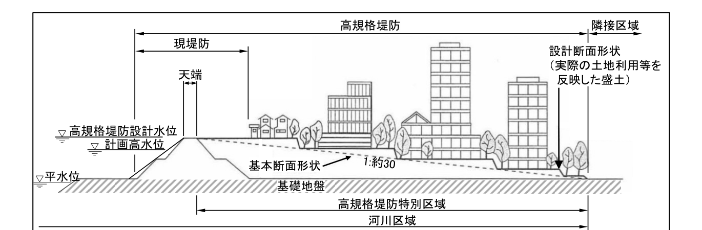
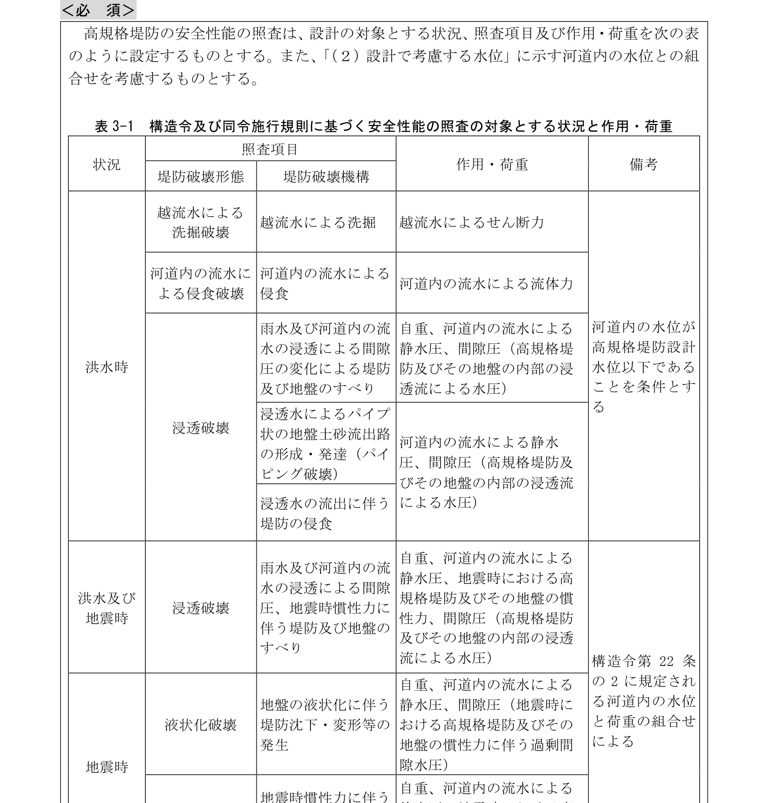
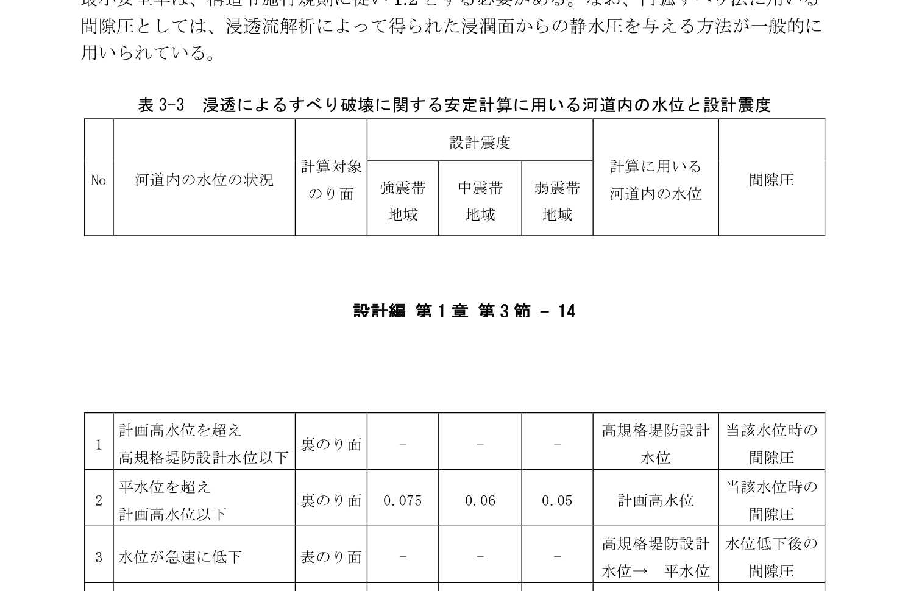
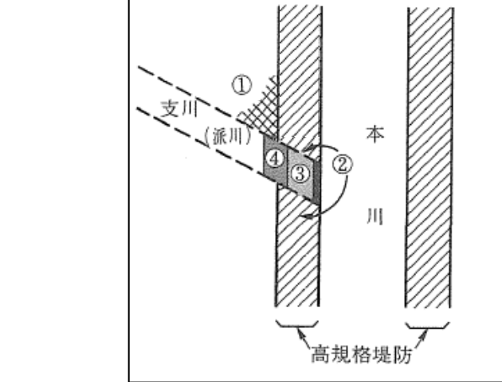
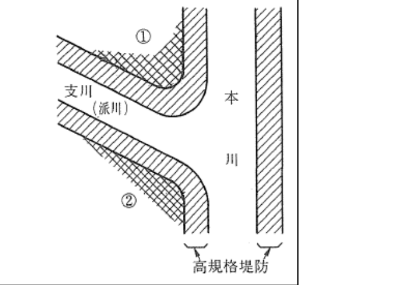

## 第3節 高規格堤防

### 3.1 総説

#### 3.1.1 目的と適用範囲

＜考え方＞

本節は、高規格堤防を整備する際の設計に適用する。

人口・資産等が高密度に集積する首都圏及び近畿圏のゼロメートル地帯等の低平地においては、ひとたび堤防が決壊すると、密集市街地において広範囲に浸水が発生し、浸水継続時間が長期間にわたるなど壊滅的な被害につながるおそれがあることから、こういった被害を防ぐために、高規格堤防の整備を進めている。

高規格堤防は、河川管理施設である堤防の一形態、かつその敷地の大部分が通常の土地利用に供されるものであり、計画高水位を超え、高規格堤防設計水位以下の洪水の作用に対しても耐えることができる構造を有するものである。ここで、「通常の土地利用」とは、周囲の状況等を勘案して社会通念上客観的に相当と認められる土地の利用であり、具体的には、高規格堤防を整備しようとする地域における住宅・ビル、工場、道路、公園、農地としての利用等、種々の土地利用を想定している。

> **＜標準＞**
>
> 本節は、高規格堤防の設計に適用する。

＜関連通知等＞

1）建設省河川局長通達：河川管理施設等構造令及び同令施行規則の施行について，平成4年2月1日，建設省河政発第31号．

#### 3.1.2 用語の定義

＜考え方＞

高規格堤防のイメージ図及び各部の名称は図 3-1 に示すとおりである。

図 3-1 高規格堤防のイメージ

> **＜標準＞**
>
> 次の各号に掲げる用語の定義は、それぞれ以下による。
>
> 一．高規格堤防設計水位：高規格堤防が整備される区間において洪水、津波及び高潮が生ずるものとした場合における河道内の最高水位
>
> 二．高規格堤防特別区域：高規格堤防の敷地である土地の区域のうち、通常の利用に供することができる土地の区域
>
> 三．天端：高規格堤防の表法肩から「3.4.1 基本断面形状 (2) 天端幅」に基づいて定まる天端幅までの部分
>
> 四．基本断面形状：高規格堤防の治水上の機能を確保するために、構造令及び同令施行規則の定めを満足する3つの設定する断面形状（高さ、天端幅、のり勾配）
>
> 五．設計断面形状：基本断面形状に従い、高規格堤防特別区域における土地利用を踏まえて定める断面形状や設備の施工等を考慮して定める設計面を含む実際の断面形状

### 3.2 機能

＜考え方＞

高規格堤防の設計に当たって治水上求められる機能は以下の1）～3）のとおりである。

なお、高規格堤防特別区域には、住宅・ビル、工場、道路、公園、農地としての利用等、通常の土地利用に供されることから、通常の市街地と同程度の安全を確保するべきである。このため、治水上求められる機能に加え土地利用の観点からも必要な機能を有する構造物として、共同事業者等と十分な調整を行い、適切な役割分担のもと、設計するものとする。

1）洪水時

高規格堤防は、河川管理施設である堤防の一形態である。具体的には、高規格堤防及びこれに類する施設と一体として計画高水位（高潮区間においては計画高水位又は計画高潮位のうちいずれか高い方）を超え高規格堤防設計水位以下の洪水に対して、計画高水位以下の通常の洪水はもとより越流水により洗掘破壊や侵食破壊に対して安全な機能を有することが求められる。

加えて、高規格堤防設計水位以下の水位の洪水の作用による侵食破壊、浸透破壊、越流水による洗掘破壊等に対して安全な機能を有することが求められる。

2）地震時

河道内の水位が平水位の水位下で、高規格堤防の自重による基礎地盤の変形等に対して、安全な機能を有することを求められる。

構造令及び同令施行規則に基づき、高規格堤防における堤防の耐震性を確保するとともに、河道内の水位が計画高水位の状況下で地震動が発生した場合においても、高規格堤防及びその地盤が一部破損し、また吸収化被損しても堤防としての機能が著しく損なわれないことが求められている。

3）常時

高規格堤防特別区域は通常の土地利用に供されることから、それに応じた安全な機能が求められている。

> **＜必須＞**
>
> 高規格堤防の設計に当たっては、高規格堤防及びその地盤が「3.2 機能」に規定する機能を満足するよう、基本の構造及び材質を設定して、設計の対象となる河道の状況と高規格堤防及びその地盤に作用する荷重を考慮して安全性能の照査を行い、用途区分による地盤の安全性の確認を行うものとする。
>
> また、土地利用上も、必要とされる性能について、照査の結果に応じて対応するものとする。

＜関連通知等＞

1）（財）リバーフロント整備センター：高規格堤防盛土設計・施工マニュアル，平成12年3月．

### 3.3 設計の基本

＜考え方＞

高規格堤防の設計に当たっては、「3.4 基本的な構造及び材質」に従い高規格堤防の基本断面形状及び設計断面形状と材質を設定する。基本断面形状については、河道計画等に基づき高さを決定し、天端幅を設定して、堤防法線と直角にとおる裏のり道路の勾配をこれによって定め、天端幅を決定する。また、のり勾配は構造令の規定を満足するよう設定することが求められる。

場合には、照査基準値を満足するよう対策を行うことが求められる。

安全性能の照査に当たっては、照査項目に応じて、より厳しい条件（設計上安全側となる条件）となる形状が異なることから、各項目の照査の対象とする断面の位置を適切に設定する必要がある。なお、高規格堤防の基本断面形状、設計断面形状ともに安全性能を満足する必要があるが、照査項目や現地条件、高規格堤防の縦横断形状等によっては、より厳しい条件となる断面形状での照査を行い、他方の照査を省略できる場合もある。

> **＜必須＞**
>
> 高規格堤防の設計に当たっては、「3.5.1 設計の対象とする状況と作用・荷重」に示す状況と照査項目に応じて、設計で考慮する河道内の水位と高規格堤防及びその地盤に作用する荷重の組合せを設定して、安全性能について照査するものとする。安全性能の照査に当たっては、構造令施行規則第13条の2から第13条の5に示される構造計算に基づく照査を行うものとし、照査項目に応じて検討対象断面位置を設定するものとする。

> **＜標準＞**
>
> 安全性能の照査に用いる手法としては、構造令に規定される手法のほか、これまでの経験及び実績から妥当とみなせる方法、実験等による検証がなされた方法又は論理的で妥当性を有する方法等、適切な知見に基づく手法を用いることを基本とする。

### 3.4 基本的な構造及び材質

#### 3.4.1 基本断面形状

**（1）高さ**

＜考え方＞

高規格堤防は、本章第2節に示す堤防が持つ機能を包含するものであり、特に適用除外とする規定がない限り構造令第3章堤防の各規定は適用されるものとする。このため、高規格堤防の高さは「2.5 堤防の高さの設定」と同様、計画高水位（高潮区間においては計画高水位又は計画高潮位のうちいずれか高い方）に余裕高を加えた高さとする。

> **＜必須＞**
>
> 高規格堤防の高さは、河道計画において設定される計画高水位（高潮区間においては計画高水位又は計画高潮位のうちいずれか高い方）に、計画高水流量に応じて構造令で定める値を加えた高さとする。

**（2）天端幅**

＜考え方＞

高規格堤防は、現堤防の背面に盛土を有する構造であるため、計画高水位（高潮区間においては計画高水位又は計画高潮位のうちいずれか高い方）以下の水位の洪水の通常の作用に対しても安全な構造を持つとともに堤防機能を包含するものである。本章第2節において堤防の天端は、「2.6 断面形状の設定」において、表のり勾配及び裏のり勾配を含めた堤防の天端幅として、同規定に基づく天端幅以上とすることが規定されている。高規格堤防の天端幅も堤防の天端幅と同規定に基づき設定される。

ただし、高規格堤防特別区域は通常の土地利用に供され、現堤防表のり部分を含め河川区域内にはまた、高規格堤防の表のり部分には災害時の水防活動、緊急車両の通行等河川管理の上においても重要な機能を有している。

> **＜必須＞**
>
> 高規格堤防の天端幅は「第1章 河川構造物の設計 第2節 堤防 2.6 断面形状の設定」に規定される堤防の天端幅を最低限確保するとともに、必要な天端幅確保及び勾配の設定により、必要な天端幅確保に努めるものとする。

**（3）のり勾配**

＜考え方＞

高規格堤防のり勾配は、高規格堤防の治水上の機能（「3.2 機能」＜考え方＞1）～3））を確保するとともに、構造令及び同令施行規則の規定を満足する設定をする必要がある。

のり勾配については、設計に当たり「3.5.1（1）設計の対象とする状況と作用・荷重」に定める各照査項目について、堤防破壊形態・堤防破壊機構について安全な構造とするよう設定するものとする。

裏のり勾配については、新規に築造する場合は本章第2節で規定されている構造令施行規則に示す千分の勾配に基づく場合と3割以上の勾配の考え方で設定することが考えられる。

> **＜標準＞**
>
> 高規格堤防のり勾配は「第1章 河川構造物の設計 第2節 堤防 2.6 断面形状の設定」で規定されているのり勾配に基づき安全な構造となるよう設定するものとする。

#### 3.4.2 設計断面形状

＜考え方＞

高規格堤防の設計断面形状は、「3.4.1 基本断面形状」で設定する基本断面形状を含むように、段階的な施工にも配慮し、基本断面形状との違いを考慮する必要がある。また、設計断面形状には暫定断面形状を含めるよう留意する。設計断面形状は、盛土造成等を含めた当面の土地利用状況に応じて設定する必要がある。

> **＜標準＞**
>
> 高規格堤防の設計断面形状は、防水上の観点に基づき3つの設定した基本断面形状を含むとともに、高規格堤防特別区域における当面の土地利用や、段階的施工等を考慮して設定することを基本とする。

#### 3.4.3 材質

＜考え方＞

高規格堤防は構造令に基づき盛土により築造する、高規格堤防の材質を盛土とするために、構造物の劣化現象が起きにくいことや高規格堤防の施工上・経済性を考慮して、地域に馴みのよい土とするのが適当であるが、高規格堤防の沈下等を勘案する必要がある。このため、堤体材料として適当な性質をもつものを選定し、十分な締固め等の施工を行う必要がある。

また、高規格堤防特別区域は通常の土地利用に供されることから、その材質は、可能な限り利用状況に応じて各種基準に準じて対応することが求められている。

> **＜必須＞**
>
> 高規格堤防の築造は、高規格堤防の堤体材料として適当な性質を持つものを用い、盛土により築造するものとする。

> **＜推奨＞**
>
> 高規格堤防特別区域においては、土地利用に供されることを考慮し、盛土上の匝配等を考慮した適切な締固めを行い、盛土材の最大粒径や締固め度の定量的な管理が可能な材料を選定するとともに、適切な材料を用いることが望ましい。また、高規格堤防の施工に当たり、建設発生土の再利用として建設汚泥の再生品の活用も可能である。

＜関連通知等＞

1）（財）リバーフロント整備センター：高規格堤防整備事業の手引，平成10年2月．

2）（財）リバーフロント整備センター：高規格堤防盛土設計・施工マニュアル，平成12年3月．

3）（財）国土技術研究センター：河川土工マニュアル，第3章 河川土工の設計 3.1.3 堤体材料の選定，3.1.4 締固計画の設定，第3章 第4.2.5 造成部の締固め管理方法，第7章 全章 第7.6節 土壌汚染対策，平成21年4月．

### 3.5 安全性能の照査等

＜考え方＞

安全性能の照査に当たっては、「3.5.1 設計の対象とする状況と作用・荷重」に示す状況と照査項目に応じて設計の対象とする河道内の水位と高規格堤防及びその地盤に作用する荷重を設定して、安全性能について照査するものとする。照査の結果、安全性能について照査を行う必要がある。

#### 3.5.1 設計の対象とする状況と作用・荷重

**（1）設計の対象とする状況と作用・荷重**

＜考え方＞

高規格堤防の設計に当たっては、構造令第22条の2、第22条の3に従い、表 3-1 に示す状況と照査項目に応じて想定する水位及び作用・荷重とその組合せを設定する必要がある。なお、「洪水及び地震時」と「地震時」に考慮する作用・荷重と河道内の水位との組合せについては、「3.5.2（3）浸透破壊に対する安全性 1）すべり破壊に対する安全性」（表 3-3）、「3.5.2（4）地震時の液状化破壊・すべり破壊に対する安全性 1）構造令施行規則に規定される設計震度に対する安全性」（表 3-4、表 3-5）に示している。

また、構造令及び同令施行規則に規定される照査項目に加えて表 3-2 に示す状況と照査項目に対しても、適切な手法を用いて安全性能の照査を行う必要がある。

> **＜必須＞**
>
> 高規格堤防の安全性能の照査は、設計の対象とする状況、照査項目及び作用・荷重を次の表のように設定するものとする。また、「（2）設計で考慮する水位」に示す河道内の水位との組合せを考慮するものとする。

**表 3-1 構造令及び同令施行規則に基づく安全性能の照査の対象とする状況と作用・荷重**

> **＜標準＞**
>
> レベル2地震動及び常時の沈下等に対する照査は、設計の対象として必要とされる状況と作用を次の表のように設定することを基本とする。

**表 3-2 高規格堤防の設計の対象とする状況と作用・荷重**

| 状況 | 照査項目 | 作用・荷重 | 備考 |
|---|---|---|---|
| 地震時（レベル2地震動） | 耐震性能（地盤の液状化に伴う堤防沈下・変形等の発生） | 自重、河道内の流水による静水圧、地震時における高規格堤防及びその地盤の慣性力に伴う過剰間隙水圧の影響 | 河道内の水位が通常想定される水位である場合を想定する |
| 常時 | 沈下（不等沈下を含む） | 自重、構造物の載荷重 | |
| 常時 | 側方変位、引き込み沈下 | 自重 | |

> **＜推奨＞**
>
> 高規格堤防及びその地盤に作用する荷重としては、堤防（第3章第2節）やダム（第2章）と同様に、高規格堤防の自重、静水圧、地震時における慣性力に加えて、高規格堤防の特徴である越流水による洗掘破壊に対する安全性能の照査において検討すべき越流水によるせん断力等があり、次のような方法で設定することが望ましい。

1）自重

自重は、高規格堤防の材料の単位体積重量を用いて算出する。単位体積重量は、原則として、実際に使用する材料について試験を行い、その結果と想定される湿潤状態を考慮して設定する。

2）河道内静水圧

河道内の水位の状況（高規格堤防設計水位、計画高水位、平水位）に応じて、堤体に作用する河道側からの水圧を、静水圧と仮定して作用させる。

3）地震時慣性力

地震時における高規格堤防の慣性力は、高規格堤防及びその地盤に水平に作用させるものとし、高規格堤防及びその地盤の自重に設計震度を乗じて求める。

4）間隙圧

間隙圧として、高規格堤防及びその地盤の内部の浸透流による間隙水圧と地震時の過剰間隙水圧を考慮する。なお、浸透流には河道内の流水と降雨による浸透水を含む。また、地震時の過剰間隙水圧の影響として、地盤の液状化に伴う過剰間隙水圧の発生に起因する強度低下、剛性低下等を考慮する。これらの間隙圧が発生すると、例えば、すべり破壊におけるすべり面の摩擦抵抗が減ぜられ、変形が生じる状態となる。

5）越流水によるせん断力

高規格堤防上を越流水が流下する場合、流水との接触面に平行にせん断力を作用させる。せん断力が一定以上になると堤体表面から洗掘が生じることとなる。

6）河道内の流水による流体力

高規格堤防設計水位以下の河道内の流水による流体力を作用させる。

**（2）設計で考慮する水位**

＜考え方＞

高規格堤防の設計に当たっては、高規格堤防設計水位、計画高水位、平水位を基本として、堤防の破壊形態、破壊機構に応じて適切な河道内の水位を想定する。

高規格堤防設計水位は、洪水が発生する河道内の高水位のことであり、河道内の高水位は天候の影響や上流域の降雨に応じた変動を生じるため、計画上はピーク水位を想定することとしている。

なお、河道内の高水位は、おおよそ起こりうる河道内の最高水位であり、計画堤防天端（計画高水位又は計画高潮位のうちいずれか高い位置）を超える位に想定される水位であることから、計画堤防天端は高規格堤防設計水位を下回ることとなる。

> **＜必須＞**
>
> 設計で考慮する水位としては、高規格堤防設計水位、計画高水位、平水位を基本とし、流域の水文特性及び河道計画等に基づき定めるものとする。

> **＜例示＞**
>
> 河道内の最高水位は以下のように求めることができる。
>
> 1）不定流計算及び超過洪水想定流量の設定
>
> まず、高規格堤防設計区間を含む、想定し得る最大規模の水系流量を設定する。上記区間の河川における同時に発生し得るとされる最高流量を算定する。この流量をもとに下流端水位条件を設定し、高規格堤防位の越水に対する影響等から越流の可能性を算定する。
>
> 2）河床変動等に起因する水位変動の勘案
>
> 予想される洪水時の河床変動等に起因する水位変動の影響を1）で求めた水位に加味したものを、河道内の最高水位とする。

#### 3.5.2 安全性能の照査

**（1）越流水による洗掘破壊に対する安全性**

＜考え方＞

高規格堤防は、堤防の一部が通常の土地利用に供されても越流水による洗掘破壊に対して耐える構造とする必要がある。このため、河道内の水位が高規格堤防設計水位である場合の越流水の流速を、堤体表面の許容せん断力を上回らない流速以下にする必要がある。

越流水の流速は高規格堤防の裏のり勾配に左右されるため、堤体表面における越流水によるせん断力に対して安全となる裏のり勾配を定めることが求められる。

> **＜必須＞**
>
> 高規格堤防設計水位の作用時の越流水による洗掘破壊に対して安全な構造となるように設計するものとする。

> **＜例示＞**
>
> 高規格堤防の裏のり勾配は、越流水によるせん断力 $\tau$ が高規格堤防表面の許容せん断力 $\tau_a$ を超えないような勾配として求めることができる。

$$
\tau \leq \tau_a \tag{3-1}
$$

- $\tau$：越流水によるせん断力（kN/m²）
- $\tau_a$：高規格堤防表面の許容せん断力（kN/m²）

また、越流水によるせん断力 $\tau$ は以下の式で算出することができる。

$$
\tau = W_0 \cdot h_s \cdot I_e \tag{3-2}
$$

- $\tau$：越流水によるせん断力（kN/m²）
- $W_0$：水の単位体積重量（kN/m³）
- $h_s$：高規格堤防の裏のり表面における越流水の水深（m）
- $I_e$：越流水のエネルギー勾配
- $I$：高規格堤防の裏のり勾配（等流条件を仮定して $I = I_e$）

高規格堤防の設計においては、高規格堤防特別区域が通常の土地利用としてどのような利用状況となっても、高規格堤防として十分な治水機能が発揮されるよう適切に設計条件を設定する必要がある。高規格堤防特別区域が市街地としての土地利用に供せられる場合、宅地等として利用される複数の水平地盤面及びそれらの境界での段差、道路で構成されることが一般的である。この場合、一般に越流水が堤防法線と直角にとおる裏のり道路部に集中する状況が最も厳しい条件となることから、この道路の表面に作用する越流水によるせん断力が許容せん断力を上回らないように堤防裏のり勾配を定めることが考えられる。このとき、高規格堤防表面の許容せん断力としては、よりひび割れ等が生じにくいコンクリート舗装面ではなく、アスファルト舗装面を想定する。高規格堤防表面の許容せん断力 $\tau_a$ の値は、高規格堤防上の道路の耐侵食力の推定を行った既往検討＜参考となる資料1）＞に基づき、一般的な道路構造において最も小さい 0.078kN/m² を用いることが考えられる。

ここに、道路上の流れを等流条件と仮定すると、以下の式となる。

$$
Q = A \cdot v = A \left( \frac{1}{n} \cdot R^{2/3} \cdot I^{1/2} \right) = b \cdot h_r \left( \frac{1}{n} \cdot h_r^{2/3} \cdot I^{1/2} \right)
$$

$$
h_r = \left( \frac{Q \cdot n}{b \cdot I^{1/2}} \right)^{3/5} \tag{3-3}
$$

越流水が道路部に集中すると仮定した場合、式（3-2）は以下の式に変換される。

$$
\tau = W_0 \cdot n^{3/5} \cdot q_r^{3/5} \cdot I^{7/10} \tag{3-4}
$$

ここで、$q_r$ は越流水が道路部に集中すると仮定した場合の、単位幅あたりの越流水の流量（式(3-3)における $Q/b$ に該当）であり、以下の式より求められる。

$$
q_r = q \cdot R_r \tag{3-5}
$$

以上より、道路面に作用するせん断力は以下の式より求められる。

$$
\tau = W_0 \cdot n^{3/5} \cdot (q \cdot R_r)^{3/5} \cdot I^{7/10} \tag{3-6}
$$

- $Q$：道路上を流下する越流水の流量（m³/s）
- $A$：道路上を流下する越流水の流積（m²）
- $v$：道路上を流下する越流水の流速（m/s）
- $R$：道路上を流下する越流水の径深（m）（等流条件を仮定して $R \fallingdotseq h_r$）
- $I$：高規格堤防の裏のり勾配（＝堤防法線と直角にとおる裏のり道路の勾配）
- $b$：道路幅（m）
- $n$：道路表面のマニングの粗度係数（s/m^{1/3}）
- $h_r$：道路表面上における越流水の水深（m）
- $q_r$：越流水が道路部に集中すると仮定した場合の、単位幅あたりの越流水の流量（m³/s/m）
- $R_r$：堤防法線と直角にとおる裏のり道路一本の幅に対する、その道路が越流水に対して受け持つ堤防法線長の比
- $W_0$：水の単位体積重量（kN/m³）
- $q$：単位幅あたりの越流水の流量（m³/s/m）

$n$ の値は、アスファルト舗装面の粗度係数として大きめの 0.016（s/m^{1/3}）を目安とし、高規格堤防上の標準街区における最低の道路面積率を18%とすると $R_r$ の値は10.6となり、式（3-6）は以下の式に変換される。

$$
\tau = 3.38 \; q^{3/5} \cdot I^{7/10} \quad (\text{kN/m}^2) \tag{3-7}
$$

また、単位幅越流量 $q$ は以下の式により求める。流量係数 $C$ の値は、高規格堤防の模型実験を行い、高規格堤防上の越流水の挙動の推定を行った既往検討＜参考となる資料2）＞に基づき、一般的には1.6（m^{1/2}/s）を用いる。

$$
q = C \cdot h_k^{3/2} \tag{3-8}
$$

- $h_k$：計画堤防天端高を基準とする高規格堤防設計水位（m）
- $C$：流量係数（m^{1/2}/s）

以上より、式（3-7）、（3-8）より求めた $\tau$ が高規格堤防表面の許容せん断耐力 $\tau_a$ を超えないよう、式（3-1）を満足するように高規格堤防の裏のり勾配 $I$ を定めることができる。

＜関連通知等＞

1）建設省河川局水政課長, 建設省河川局河川計画課長, 建設省河川局治水課長通達：河川管理施設等構造令及び同令施行規則の運用について，平成4年2月1日（最終改正平成11年10月15日），建設省河政発第32号 建設省河計発第37号 建設省河治発第10号（建設省河政発第74号 河計発第83号 河治発39号）．

2）（財）リバーフロント整備センター：高規格堤防整備事業の手引，平成10年2月．

＜参考となる資料＞

1）宇多高明・藤田光一ほか：「道路内の流水による舗装面の破壊 ―高規格堤防の水理設計のために（3）―」，土木研究所資料，第3226号．

2）宇多高明・藤田光一ほか：「高規格堤防上の越流水の挙動 ―高規格堤防の水理設計のために（2）―」，土木研究所資料，第3220号．

**（2）河道内の流水による侵食破壊に対する安全性**

＜考え方＞

本章第2節に規定する堤防は、「2.4 設計の基本」に示すように護岸、水制その他これらに類する施設と一体として、計画高水位以下の水位の流水の通常の作用による侵食破壊に対して安全な構造となるよう設計される。高規格堤防は、このような条件を包含するとともに、高規格堤防設計水位以下における河道内の流水の作用による侵食破壊に対しても安全な構造となるよう設計することが求められる。このため、水衝部等においては、必要に応じて護岸、水制等を設ける等、その外力に見合う措置を設計に組み込む必要がある。なお、河道内の流水の作用として、表のり肩付近における越流水の作用も併せて考える必要がある。

> **＜必須＞**
>
> 高規格堤防設計水位以下の河道内の流水の作用による侵食破壊に対して安全な構造となるよう設計するものとする。

＜関連通知等＞

1）建設省河川局水政課長, 建設省河川局河川計画課長, 建設省河川局治水課長通達：河川管理施設等構造令及び同令施行規則の運用について，平成4年2月1日（最終改正平成11年10月15日），建設省河政発第32号 建設省河計発第37号 建設省河治発第10号（建設省河政発第74号 河計発第83号 河治発39号）．

2）（財）国土技術研究センター：河川構造物の構造検討の手引き（改訂版），第5章 侵食に対する構造の安全性 7.1 概説，平成21年4月．

3）（財）リバーフロント整備センター、多自然川づくり研究会：多自然型川づくりポイントブックⅢ，平成23年10月．

4）（一社）国土技術研究センター：改訂護岸の力学設計法，第4章 護岸の力学的安定性の照査，平成14年3月．

5）（財）国土技術研究センター：河道計画検討の手引き，第8章 河道の平面計画，平成14年3月．

**（3）浸透破壊に対する安全性**

**1）すべり破壊に対する安全性**

＜考え方＞

高規格堤防及びその地盤の浸透によるすべり破壊に対する安全性は、構造令施行規則第13条の5（第10条第2項）に基づく円弧すべりに安定計算を行う必要がある。この際、河道内の水位が高規格堤防設計水位以下の各水位に対してのり面すべり安定計算を行い、安全を確認する。高規格堤防は通常の堤防に比べ裏のり面の範囲が広く、盛土高が高いことから、浸潤面の位置の設定や照査検討断面の位置の検討を慎重に行う必要がある。

場合には、構造令施行規則第13条の3第1項に基づく設計を行うこととなるが、同時に「3.5.2（4）地震時の液状化破壊・すべり破壊に対する安全性」で規定される地震時の慣性力を考慮する必要があり、安定計算に用いる外力として、河道内の水位と勾配を考慮した上で、浸透流解析による水圧分布を用いた安全性能の照査を行うことが求められる。

円弧すべり法による安定計算に当たっては、河道内の水位と勾配を考慮した浸透流解析を行い、堤体内の浸潤面の位置を考えた上で、安定計算に用いる外力として浸透流解析の結果得られた水圧分布の静水圧を与える方法等が考えられる。

**表 3-3 浸透によるすべり破壊に関する安定計算に用いる河道内の水位と設計震度**

> **＜必須＞**
>
> 高規格堤防及びその地盤における浸透破壊に対して安全な構造となるよう、円弧すべり法による最小安全率を1.2として設計するものとする。

> **＜例示＞**
>
> 堤体内浸潤面の算出については、有限要素法を用いた非定常浸透流解析等により算出することができる。

＜関連通知等＞

1）建設省河川局水政課長, 建設省河川局河川計画課長, 建設省河川局治水課長通達：河川管理施設等構造令及び同令施行規則の運用について，平成4年2月1日（最終改正平成11年10月15日），建設省河政発第32号 建設省河計発第37号 建設省河治発第10号（建設省河政発第74号 河計発第83号 河治発39号）．

2）（財）国土技術研究センター：河川堤防の構造検討の手引き（改訂版），第4章 浸透に対する堤防の構造検討，平成24年2月．

3）（独）土木研究所地質・地盤研究グループ土質・振動チーム：河川堤防の浸透に対する照査・設計のポイント，平成25年6月．

4）（財）リバーフロント整備センター：高規格堤防盛土設計・施工マニュアル，平成12年3月．

**2）パイピング破壊に対する安全性**

＜考え方＞

河道内の水位が高規格堤防設計水位以下の水位である場合に、高規格堤防及びその地盤のパイピング破壊に対して安全な構造となるよう設計することが求められる。パイピングは、高規格堤防とその地盤、又は構造物とその地盤の接合部及びその付近における浸透現象であり、高規格堤防特別区域で通常の土地利用がなされても、河道内の水位と川裏側の地表面との差から生じる浸透力に対して耐えうる構造とすることが求められる。

> **＜必須＞**
>
> 高規格堤防及びその地盤におけるパイピング破壊に対して安全な構造となるよう設計するものとする。

> **＜推奨＞**
>
> パイピング破壊に対する対策を実施する場合は、地下水環境の保持等の観点から全区間連続した遮水矢板等の設置は行わないことが望ましい。

> **＜例示＞**
>
> 高規格堤防及びその地盤において、パイピング破壊が生じない有効浸透路長の確保を検討する場合には、レーンの加重クリープ比で評価することができる。このとき、高規格堤防の地盤と地下構造物の水平方向の接触状況についても、高規格堤防特別区域で通常の土地利用がなされても、河道内の水位と川裏側の地表面との差から生じる浸透力に対して耐えうるべく80%の地下等が入った場合を想定している。

＜関連通知等＞

1）建設省河川局水政課長, 建設省河川局河川計画課長, 建設省河川局治水課長通達：河川管理施設等構造令及び同令施行規則の運用について，平成4年2月1日（最終改正平成11年10月15日），建設省河政発第32号 建設省河計発第37号 建設省河治発第10号（建設省河政発第74号 河計発第83号 河治発39号）．

2）（財）国土技術研究センター：河川堤防の構造検討の手引き（改訂版），第4章 浸透に対する堤防の構造検討，平成24年2月．

3）（独）土木研究所地質・地盤研究グループ土質・振動チーム：河川堤防の浸透に対する照査・設計のポイント，平成25年6月．

4）（財）リバーフロント整備センター：高規格堤防整備事業の手引，平成10年2月．

**3）浸透水の流出に伴う堤防侵食に対する安全性**

＜考え方＞

高規格堤防の堤体から浸透水が流出することによる侵食破壊を防ぐため、堤体の裏側の表面と交わらないよう設計することが求められる。堤体内浸潤面の算出に当たっては、河道内の水位と降雨を考慮した外力条件で非定常浸透流解析を行い、堤体侵食が起きない浸潤面の設計の検討を行う必要がある。堤防の川裏側の表面と交わる場合には、ドレーン工法等の対策工を施す必要がある。

> **＜必須＞**
>
> 高規格堤防の堤体内浸潤面が川裏側の表面と交わらないよう設計するものとする。

> **＜例示＞**
>
> 川裏側における川裏側の表面位置については、のり尻を最深の表面の位置から1.5m程度位置とすることが考えられる。なお、高規格堤防特別区域法第27条を踏まえると、1項の許可なく掘削等をすることは認められておらず、高規格堤防における表面の位置は掘削深度を考慮したものとし、堤体の裏側の表面と交わらないよう設定する。

＜関連通知等＞

1）建設省河川局水政課長, 建設省河川局河川計画課長, 建設省河川局治水課長通達：河川管理施設等構造令及び同令施行規則の運用について，平成4年2月1日（最終改正平成11年10月15日），建設省河政発第32号 建設省河計発第37号 建設省河治発第10号（建設省河政発第74号 河計発第83号 河治発39号）．

2）（財）リバーフロント整備センター：高規格堤防整備事業の手引，平成10年2月．

3）（財）リバーフロント整備センター：高規格堤防盛土設計・施工マニュアル，平成12年3月．

**（4）地震時の液状化破壊・すべり破壊に対する安全性**

**1）構造令施行規則に規定される設計震度に対する安全性**

＜考え方＞

高規格堤防及びその地盤の地震時の液状化破壊、すべり破壊に対する安全性については、次のとおりである。液状化の判定を行い土層ごとに抵抗率及びその低減を考慮しながら安全性能の照査を行う必要がある。すなわち、FL≦1.0の土層がある場合、液状化破壊に対する安全性の照査を行う必要がある。安全性の照査に用いる手法としては、静的変形解析、静的安定解析等がある。地震時の過剰間隙水圧を考慮した上で、地盤の液状化に伴う過剰間隙水圧の発生に起因する強度低下、剛性低下を考慮した安全性能の照査を行い、必要に応じて対策を検討する。

地震時の安全性の検討においては、地震時慣性力を考慮した上で河道内の水位と勾配を考慮する必要があり、安定計算に用いる外力として、河道内の水位を基準として浸透流解析による水圧分布を用いることが求められる。河道内の水位、設計震度は以下の表に示すとおりである。

**表 3-4 地震時の液状化破壊に関する安定計算に用いる河道内の水位と設計震度**

| 河道内の水位の状況 | 計算断面 | 設計震度 | 河道内の水位 | 間隙圧 |
|---|---|---|---|---|
| 裏のり面 | 0.18 | 0.15 | 河道内の水位における | |
| 平水位以下 | 表のり面 | 0.18 | 0.15 | 平水位 | 当該水位時の間隙圧 |

**表 3-5 地震時の慣性力によるすべり破壊に関する安定計算に用いる河道内の水位と設計震度**

| 河道内の水位の状況 | 計算断面 | 設計震度 | 河道内の水位 | 間隙圧 |
|---|---|---|---|---|
| 裏のり面 | 0.15 | 0.12 | 河道内の水位における | |
| 平水位以下 | 表のり面 | 0.15 | 0.12 | 平水位 | 当該水位時の間隙圧 |

> **＜必須＞**
>
> 地震時の液状化破壊に対する安全性は、地盤の液状化判定を行い、その結果にもとづき、液状化破壊のおそれのある地盤と無い地盤に分類して、それぞれの安全性に応じた対策を行い、所要の安全性を確保するよう設計するものとする。

> **＜標準＞**
>
> 地震時慣性力の作用については、円弧すべり法による最小安全率を1.2とすることを基本とする。

> **＜推奨＞**
>
> 地震時の安全性の検討については、高規格堤防特別区域における土地利用に対して重大な支障が生じないよう、「3.6 土地利用の観点から要求される性能の照査等」と併せて実施することが望ましい。

> **＜例示＞**
>
> 地震時の安全性は、次のように検討することができる。
>
> 1）液状化破壊に対する安全性の照査
>
> 基礎地盤に液状化の可能性がある土層（液状化に対する抵抗率 $F_L$ が1.0未満の土層）が分布する場合、液状化破壊に対する安全性は次のように検討することができる。
>
> ① 動的変形解析又は静的変形解析を用いた安全性の照査
>
> 動的変形解析又は静的変形解析による変位量のみでの安全性の照査と、地震時の適切間隙水圧を考慮した円弧すべり法（$\Delta u$ 法）を用いた安全性の照査を行う。高規格堤防特別区域内の多くの区間で、高規格堤防の盛土厚は5m程度以上であるため、動的変形解析を用いることが推奨される。
>
> ② 地震時の過剰間隙水圧を考慮した円弧すべり法（$\Delta u$ 法）を用いた安全性の照査を行い、最小の安全率 $Fs$（$\Delta u$）が基準の安全率（$\Delta u$）を上回る場合は安全と判定し、$Fs$（$\Delta u$）が1.2以上の場合は対策は不要と判断できる。$Fs$（$\Delta u$）が1.2未満の場合には、動的変形解析又は静的変形解析による変形量の照査や対策の検討を行うことが考えられる。
>
> 2）地震時慣性力に対する安全性の照査
>
> 基礎地盤に液状化の可能性がある土層（液状化に対する抵抗率 $F_L$ が1.0未満の土層）が分布する場合は、地震時慣性力に対する照査を行う必要がある。

なお、液状化破壊に対する安全性の照査を円弧すべり法（$\Delta u$ 法）で行い、地震時慣性力に対する照査を行う際には、安定計算の結果の確認を行うこととする。液状化対策は不要と判断した場合にあっても、地震時慣性力に対する照査を行う必要がある。また、対策工の設計を円弧すべり法（$\Delta u$ 法）で行い、液状化対策を講じる条件での地震時慣性力に対する照査を行う必要がある。

**2）レベル2地震動に対する耐震性能の照査**

＜考え方＞

レベル2地震動に対する耐震性能の照査に当たっては、守るべき水準及び照査手法を設定して照査を行う。レベル2地震動とは大規模な大地震の際に起こる変形に対する検証を行い、大規模な支障が生じないことを確認することが求められる。

高規格堤防の設計に当たっては、レベル2地震動の耐震性能の照査として、河道内の水位が通常の水位の状況下で地震動が発生した場合における堤防の機能を確認する必要がある。レベル2地震動に対する堤防の耐震性能照査については、各解析手法の適用性を踏まえた上で、適切な手法を選択する必要がある。

なお、「3.2 機能」に示したとおり、高規格堤防は高規格堤防設計水位以下の洪水に対して安全であることが求められており、高規格堤防設計水位以下の洪水と連動する地震が生ずる場合、高規格堤防の作用時の越流水による洗掘破壊に対して安全であることが求められている。越流水との連動については、越流水のせん断力が作用する道路部等の部材の早期復旧を考慮して適切な対策を講じることが望ましい。

> **＜標準＞**
>
> 高規格堤防の設計に当たっては、レベル2地震動に対する耐震性能の照査を行い、耐震性能の結果に基づき各解析手法の特長を踏まえた上で、適切な手法を選択することを基本とする。

＜関連通知等＞

1）建設省河川局水政課長, 建設省河川局河川計画課長, 建設省河川局治水課長通達：河川管理施設等構造令及び同令施行規則の運用について，平成4年2月1日（最終改正平成11年10月15日），建設省河政発第32号 建設省河計発第37号 建設省河治発第10号（建設省河政発第74号 河計発第83号 河治発39号）．

2）建設省河川局治水課長補佐 事務連絡：高規格堤防における堤防の改川管理施設等構造令及び同令施行規則の運用について（補足運用），平成10年2月10日．

3）国土交通省水管理・国土保全局：河川構造物の耐震性能照査指針・解説―Ⅱ．堤防編，平成28年3月．

4）（財）国土技術研究センター：河川構造物の耐震性能照査に当たり考慮する河川における平常時の最高水位の算定の手引き（案），2007．

5）（財）リバーフロント整備センター：高規格堤防盛土設計・施工マニュアル，平成12年3月．

**（5）沈下に対する配慮**

＜考え方＞

高規格堤防は、計画高水位を超え、高規格堤防設計水位以下の洪水の作用による越流水によるせん断力を堤体の表面に与えて越流水の侵食破壊に耐えるよう設計することが基本である。ただし、越流水のせん断力の作用によって堤体に変形が生ずる可能性があるため、完成後（既設堤防の完成を含む）の堤防が、十分な治水機能を有するような設計を検討する必要がある。

> **＜標準＞**
>
> 高規格堤防は、計画高水位を超え、高規格堤防設計水位以下の洪水の作用に耐えうる構造とするため、完成後（段階的施工途中の完成を含む）に堤防の十分な機能が確保されるよう設計及び施工管理を行うことを基本とする。

＜関連通知等＞

1）（財）リバーフロント整備センター：高規格堤防盛土設計・施工マニュアル，平成12年3月．

2）（財）国土技術研究センター：河川土工マニュアル，第3章 河川土工の設計 第3.2節 軟弱地盤対策，平成21年4月．

### 3.6 土地利用の観点から要求される性能の照査等

#### 3.6.1 一般

＜考え方＞

高規格堤防特別区域には、住宅・ビル、工場、道路、公園、農地としての利用等、通常の土地利用に供されることから、土地利用における各施設の安全性（地震時を含む）を通常の市街地と同程度確保する必要がある。このため、高規格堤防施工後においても、上記の土地利用における各施設の安全性を確保するための照査を行うことが求められる。

> **＜標準＞**
>
> 高規格堤防特別区域において想定される当面の土地利用状況に応じて、関連する技術基準や指針等を参考とし、共同事業者等とも協議・合意を図った上で、照査内容や照査基準値等を検討することを基本とする。また、照査基準値等を満足しない場合は、共同事業者等とも協議の上、必要に応じて対策を検討することを基本とする。

＜参考となる資料＞

1）国土交通省 都市局長, 農林水産省農村振興局長, 林野庁長官：宅地造成及び特定盛土等規制法の施行に当たっての留意事項について（技術的助言），令和5年5月26日（国官参宅第12号5農振第650号5林整治第244号）．

2）盛土等防災研究会：盛土等防災マニュアルの解説，令和5年11月．

3）（独）都市再生機構：宅地耐震設計マニュアル（案），平成20年4月．

4）（一社）日本建築学会：建築基礎構造設計指針，令和元年11月．

5）（一社）日本建築学会：小規模建築物基礎設計指針，平成20年2月．

6）（一社）一般社団法人日本建築学会：建築基礎のための地盤改良設計指針案，平成18年11月．

7）平成24年度宅地の液状化対策の推進に関する研究会：宅地の液状化被害可能性判定に係る技術指針・同解説（案），平成25年2月．

8）国土交通省 都市局 都市安全課：市街地液状化対策推進ガイダンス，令和元年6月．

#### 3.6.2 沈下等に対する配慮

＜考え方＞

高規格堤防上に構造物等が築造された後、高規格堤防及び築造された構造物の荷重によって土地利用に支障を及ぼすような新たな沈下が起こらないようにするため、設計・施工段階から上載荷重を考慮しておく必要がある。なお、上載荷重としては、土地利用形態や宅地に建築される建築物の規模等を勘案して適切な荷重を設定する必要があるため、事前に共同事業者等と協議・合意を図ることが重要である。この上載荷重を考慮して沈下計算を行い、残留沈下量の予測を行い、「高規格堤防盛土設計・施工マニュアル」等を参考に許容残留沈下量を設定するほか、共同事業者等との協議・合意を図ることが求められる。

盛土による沈下予測結果による残留沈下量が許容残留沈下量を超える場合、適切な対策が必要である。

なお、沈下予測結果と実際の沈下挙動とが異なる可能性もあるため、原則として動態観測を実施し、予測の修正や設計の見直しに反映させる必要がある。

また、地盤強度についても共同事業者や土地所有者等との間で誤解や認識不足が生じないように、確保する地盤強度の考え方について共同事業者等との協議・合意を図ることが重要である。

> **＜標準＞**
>
> 高規格堤防特別区域が通常の土地利用に供されることから、土地利用に支障を及ぼさないよう極力沈下を生じず、かつ地盤強度が確保されるよう設計及び施工管理を行うことを基本とする。

#### 3.6.3 隣接構造物への影響に対する配慮

＜考え方＞

高規格堤防の隣接区域は、既に商工業地域や住宅地として土地利用されている場合が多く、高規格堤防盛土の施工に伴い発生する側方変位や引き込み沈下によって、隣接構造物に機能障害が生じることが懸念される。

このような盛土による影響が想定される場合には、常時の応力～変位解析や圧密沈下解析を行い、変位量が許容値以下であるかどうかを確認する必要がある。

算定された変位量が許容値以上であることが明らかな場合には、必要な対策を講じることが求められる。

> **＜標準＞**
>
> 高規格堤防の予定地に隣接構造物がある場合には、側方変位や引き込み沈下の解析を行うことを標準とする。
>
> 解析の結果より、変位量が許容値以上である場合には、必要な対策を講じることを基本とする。

＜関連通知等＞

1）（財）リバーフロント整備センター：高規格堤防盛土設計・施工マニュアル，平成12年3月．

2）（財）国土技術研究センター：河川土工マニュアル，第3章 河川土工の設計 第3.2節 軟弱地盤対策，平成21年4月．

### 3.7 高規格堤防構造に関するその他事項

#### 3.7.1 分合流部の設計

＜考え方＞

分合流部に設けられる高規格堤防を設計する場合、分合流のタイプごとに十分な対策を行う必要がある。

支川に逆流防止水門がある場合や派川に分流堰がある場合等、洪水時に本川と支派川との間に水位差がある（本川水位が高い）場合には、越流量の増大による荷重増や水位差による浸透破壊を防止する対策等に配慮する必要がある。

また、支川が自己流を持って合流する場合や支川堤防がバック堤である場合、自然分流である場合等、洪水時に本川と支派川の水位が等しい場合には、越流量の増大による荷重増に対する対策の検討が必要となる。

ただし、バック堤の場合には、支川における侵食破壊の検討は不要と考えられる。

> **＜必須＞**
>
> 分合流部の設計においては、分合流部固有の荷重作用特性及び堤防形状に十分留意しなければならない。

> **＜例示＞**
>
> 分合流部に設けられる高規格堤防を設計する場合、対象分合流が次に示すタイプⅠとタイプⅡのどちらに属するかによって、設計における留意事項が変わってくる。
>
> タイプⅠ：支川に逆流防止水門がある場合や派川に分流堰がある場合等、洪水時に本川と支派川との間に水位差がある（本川水位が高い）。
>
> タイプⅡ：支川が自己流を持って合流する場合や支川堤防がバック堤である場合、自然分流である場合等、洪水時に本川と支派川の水位が等しい。

タイプⅠの場合、支派川には高規格堤防が造られず、本川の高規格堤防を支派川が横切ることになる。

タイプⅡの場合、支派川にも高規格堤防が造られる。

それぞれのタイプの設計において、以下の点に留意する。

図 3-2 タイプⅠ

図 3-3 タイプⅡ

**1）タイプⅠの場合**

① 本川と支派川とがなす角が鋭角の側（図 3-2 の①の部分）においては、越流水の収束が川裏側堤防上で起こり、単位幅あたりの越流量が増大する。この荷重の増大に対処するため堤防川裏側の勾配を緩くする必要があり、この部分の堤防幅を大きくし、適切な堤防川裏側形状をもたせることが考えられる。

② 本川と支派川に囲まれたくさび状の高規格堤防部分（図 3-2 の②の部分）の周辺では、平面距離の割に大きな水位差が生じる場合があるので、必要に応じて浸透破壊を防止する対策を検討することが考えられる。

③ 支派川が高規格堤防を横切る部分において（図 3-2 の③の部分）、越流水が支派川に落ち込むと支派川の堤防表のり面が破壊され、その破壊が高規格堤防に波及する危険がある場合には、支派川の堤防表のり面が破壊されないような措置を講じるか、越流水の支派川への落込みをなくす措置を講じることが考えられる。

④ 本川に先立って支川で堤防越流が起こり、これにより支川堤防及び接続する高規格堤防下部（図 3-2 の④の部分）が一部破壊され、破壊部分が本川高規格堤防上の越流水に対して弱点箇所となることが予想される場合には必要な対策を講じることが考えられる。

**2）タイプⅡの場合**

① 本川と支派川とがなす隅角部（図 3-3 の①の部分）においては、越流水の収束が川裏側堤防上で起こり、単位幅あたりの越流量が増大する。この荷重の増大に対処するため堤防川裏側の勾配を緩くする必要があり、この部分の堤防幅を大きくし、適切な堤防川裏側形状をもたせることが考えられる。

② 支川がバック堤の場合には、支川における侵食破壊の検討は不要と考えられる。

**3）タイプⅠ、Ⅱ両方について**

本川と支派川に囲まれたくさび状の高規格堤防部分が諸荷重に対して弱点箇所とならないかどうかの検討、必要に応じて対策を講じることが考えられる。

#### 3.7.2 高規格堤防上の細部構造の設計

＜考え方＞

細部構造とは、高規格堤防上の土地利用につき直接必要となるものであり、通常の場合には擁壁、宅地造成関連の施設、道路等の路面等が対象となる。設計に当たっては、当面の土地利用状況から適切な方法で設計する必要がある。

なお、高規格堤防の整備の前から堤防の整備と土地利用の間の関係を設計に反映させ、堤防完成後の土地利用形態の変更に伴う細部構造の変更も見据え、段階的な設計を行うことが求められる。

> **＜標準＞**
>
> 高規格堤防上に設けて越流等の設計時に設計される細部構造については、想定される当面の土地利用状況に応じて適切な設計を行うことを標準とする。

#### 3.7.3 段階的施工に関する留意点等

＜考え方＞

ここでいう段階的施工とは、開発計画、現状の土地利用と地権者の同意の有無のため、高規格堤防設計区間の一連の区間内の一部区間のみ暫定的に整備する場合など、将来的な高規格堤防の整備を見据えつつ暫定断面で整備された場合の考え方をいう。

高規格堤防は、周辺住民等の避難場所や、被災者の救助、緊急物資の輸送・保管等災害発生等の様々な活動のための拠点として重要な高台の設備に資するものであり、段階的な施工は重要な課題と考えられる。

このため、段階的な施工における設計に当たっては、まちづくり関係者等と十分な調整を図って行うべきものとする。

1）段階的施工の概念

段階的施工における暫定断面は、横断方向には一般に基本断面形状に対して堤防幅の小さい対象である。

この場合において暫定的な完成時であることを手厳に、裏のり部分についても基本断面形状となっていない場合がある。

2）段階的施工の安全性

（1）暫定断面を有する高規格堤防であっても、構造令施行規則第13条の5第2項、第3項（十ヤ6）、第13条の5第5項（現状に）においても、完成堤防と同等の安全を確保するよう設計するものとする。

（2）暫定断面を有する場合においても構造令施行規則に基づく構造計算の実施が必要であり、計算結果によって越流水により基本断面形状のり勾配を超えることとなる場合、越流水による洗掘破壊を極力小さくする、高規格堤防特別区域の通常の土地利用に供される道路部等の部材の早期復旧の対策を講じることが望ましい。

> **＜標準＞**
>
> 高規格堤防の整備は、開発計画、現状の土地利用との整合から、一連区間のうち一部区間の整備や、全幅において完成断面にできなくても、逐次段階的に実施することを基本とする。
>
> その設計に当たっては、高規格堤防特別区域が通常の土地利用に供されることや、現状の堤防機能を損なわない構造とすること、将来完成時に極力手戻りが少なくなること等に配慮することを標準とする。

＜関連通知等＞

1）（財）リバーフロント整備センター：高規格堤防盛土設計・施工マニュアル，平成12年3月．

2）（財）リバーフロント整備センター：高規格堤防整備事業の手引，平成10年2月．

3）高規格堤防の効率的な整備の推進に向けて 提言，平成29年12月，高規格堤防の効率的な整備に関する検討会．

4）災害に強い首都「東京」の形成に向けた連絡会議：災害に強い首都「東京」形成ビジョン，令和2年12月．

#### 3.7.4 ICT や BIM/CIM の活用

＜考え方＞

i-Construction 推進の一環として、ICT による建設生産プロセスのシームレス化が取り組まれている。

UAV 写真測量やレーザースキャナー計測等で得られる3次元点群データを活用することで、現況地形や既設物の構造を様々な角度・断面から把握することができる。

新設・改修する施設の3次元モデルを作成し活用することにより、構造に関して関係者の理解と合意形成が促進される。

このため、計画段階等、事業の早期段階をはじめ、施工段階、施工後の点検・補修・修繕の段階において BIM/CIM を積極的に活用し、高規格堤防を適切に維持管理していくことが求められる。

＜関連通知等＞

1）国土交通省：BIM/CIM 活用ガイドライン（案），令和4年3月．
