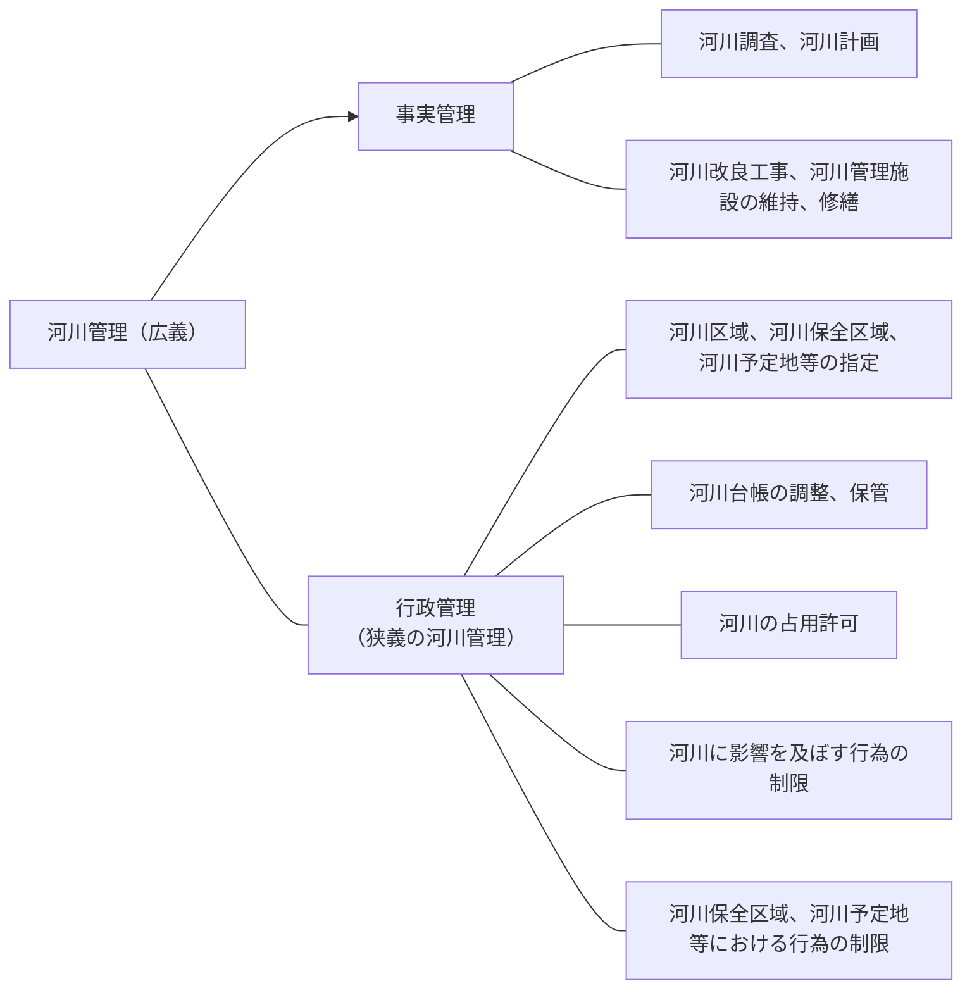

# 河川法の概要

## 河川管理

### 河川管理の目的

> この法律は、河川について、洪水、津波、高潮等による災害の発生が防止され、河川が適正に利用され、流水の正常な機能が維持され、及び河川環境の整備と保全がされるようにこれを総合的に管理することにより、国土の保全と開発に寄与し、もつて公共の安全を保持し、かつ、公共の福祉を増進することを目的とする。 
> 
[河川法第1条](https://elaws.e-gov.go.jp/document?lawid=339AC0000000167#Mp-At_1)

| 項目 | 内容 |
|---|---|
| 洪水、高潮等による災害発生の防止 | ダム、堤防等の河川管理施設の新改築、河床掘削、放水路開削、河川に影響を及ぼす行為の規制 etc |
| 河川の適正利用 | 河川水利用の許可制、河川敷の占用の許可制、etc |
| 河川環境の整備、保全 | 河川の清潔の維持、水質浄化事業、親水護岸、多自然型川づくり、魚道の設置、自動車等の乗り入れの禁止 etc |
| 流水の正常な機能の維持 | 一定水位の保持、河川の自然の浄化作用維持 etc |

### 河川管理の内容

河川法でいう広義の河川管理を体系的に分類すると、次のとおりである。

### 河川管理の原則

> 河川は公共用物であって、その保全、利用その他の管理は、法第1条の目的が達成されるよう適正に行なわれなければならない。 
> 
[河川法第2条第1項](https://elaws.e-gov.go.jp/document?lawid=339AC0000000167#Mp-At_2)

### 河川台帳

> 河川管理者は、河川の台帳を調製し、これを保管しなければならない。 
> 河川の台帳は、河川現況台帳及び水利台帳とする。
> 
[河川法第12条](https://elaws.e-gov.go.jp/document?lawid=339AC0000000167#Mp-At_12)

河川現況台帳は、河川に関する一般的な台帳で、その記載事項は、河川の延長、河川区域の概要、河川保全区域及び河川予定地、主要な河川管理施設の概要、河川の使用の許可の概要等である。

水利台帳は、水利使用に関する台帳で、その記載事項は、水利使用の許可を受けた者、水利使用の目的、許可水量、許可期間、取水口等である。

### 河川の占使用

#### 占使用の種類

河川法は、河川が*公共用物*であることを明らかにしている。

公共用物とは、国、地方公共団体等の行政主体が直接に一般公共の用に供しているものである。河川は、自然公物と呼ばれるように、その発生は自然によるものであって、その本来的な使用は、道路における交通というように、人工公物ほど明らかではないが、流水の占用、舟またはいかだの通航、河川敷地の占用、土砂の採取等に種々の使用関係が存在する。

公物の使用関係は、通常、次のように分類して説明される。

##### 自由使用

- 一般公衆が、河川管理者の許可その他のこれを認める処分をまたないで、自由に行うことができる河川の使用のことをいう。水泳、洗濯、魚釣り等がこれに該当する。河川法では自由使用に関する規定は、特に設けていない。
   
- 自由使用は、河川が一般公衆の用に供されていることの反射的利益として使用できるにとどまり、使用の権利を有するわけではないので、河川工事、許可使用等によって、その利益を損なわれても、妨害排除や損害賠償の請求はできない。また、同様な他人の自由使用を妨げない範囲で認められるものであることは、その性質からいって当然である。

##### 特別使用

1. 許可使用
      
   - 自由使用の範囲をこえ、他人の共同使用を妨げ、または公共の利益に反するおそれがある河川使用について、一般的にはこれを制限し、申請に基づいて支障がない場合にその制限を解除し、その使用を許可することがある。このような許可に基づく使用を許可使用という。河川区域内における工作物の新築または改築、土地の掘削等がこれに該当する。
      
   - 河川管理者の許可は、一般的な禁止、制限を解くことであり、特別な権利を与えるものではない。その許可により利益があっても、禁止制限の解除による反射的利益にすぎないと考えられている。
       
2. 工作物の新築等
          
   - 河川区域内の土地（河川管理者以外の者がその権限に基づき管理する土地を除く。）において工作物を新築し、改築し、又は除却しようとする者は、河川管理者の許可を受けなければならない。（[河川法第26条](https://elaws.e-gov.go.jp/document?lawid=339AC0000000167#Mp-At_26)）河川の河口付近の海面において河川の流水を貯留し、又は停滞させるための工作物を新築し、改築し、又は除却しようとする者も同様である。
   
   - 許可は、工作物の新築等を許容するだけであり、土地を使用する権原までも与えるものではないことから、河川管理者以外の者がその権原に基づいて管理する土地については、別にその者との契約により使用権を取得し、その他の土地については、[河川法第24条](https://elaws.e-gov.go.jp/document?lawid=339AC0000000167#Mp-At_24)の許可を受ける必要がある。

##### 土地の掘削等

- 河川区域内の土地（河川管理者以外の者がその権限に基づき管理する土地を除く。）において土地の掘削、盛土若しくは切土その他土地の形状を変更する行為（[河川法第26条](https://elaws.e-gov.go.jp/document?lawid=339AC0000000167#Mp-At_26)第1項の許可に係る行為のためにするものは除く。）又は竹木の植栽若しくは伐採をしようとする者は、河川管理者の許可を受けなければならない。ただし、政令で定める軽易な行為はこの限りではない。
   
- 本条の対象となる土地は、所有関係等にかかわらず、河川区域内のすべての土地を指す。（[河川法第27条](https://elaws.e-gov.go.jp/document?lawid=339AC0000000167#Mp-At_27)）

1. 特許使用
      
   - 河川管理者が特定人のために、一般には許されない特別の使用をすることができる権利を設定する場合に、その権利を設定する処分（許可）を河川使用の特許といい、それに基づく使用を特許使用という。流水の占用、敷地の占用等がこれに該当する。
      
   - 他の使用の場合と異なり、特定人に対して排他独占的な権利が設定されることになり、これが第三者から侵害されるときは、妨害排除や不法行為として損害賠償を請求することができる。
      
   - この特許使用に対する河川管理者の許可処分は、河川管理者の自由裁量行為である。しかしながら、与えた許可の期限が到来した際、更新の許可申請があった場合には、それがその河川使用を達成するために必要な最小限の期間内であるときは、河川管理者は、特別の事情がない限り、この更新の許可をすべき拘束を受けるものと考えられている。

      1. 流水の占用（[河川法第23条](https://elaws.e-gov.go.jp/document?lawid=339AC0000000167#Mp-At_23)）
           - 河川の流水を占用しようとする者は、河川管理者の許可を受けなければならない。

      2. 土地の占用（[河川法第24条](https://elaws.e-gov.go.jp/document?lawid=339AC0000000167#Mp-At_24)）
           - 河川区域内の土地（河川管理者以外の者がその権限に基づき管理する土地を除く。）を占用しようとする者は、河川管理者の許可を受けなければならない。
           - 河川区域内の河川管理者が許可を与えることのできる「土地」とは、河川のために取得された国有地（国土交通省名義:旧建設省及び旧内務省名義又は官有地）をいう。
           - 河川工事のために取得した「地方公共団体」名義の土地についても、[河川法第24条](https://elaws.e-gov.go.jp/document?lawid=339AC0000000167#Mp-At_24)の対象となる。

      3. 土砂等の採取（[河川法第25条](https://elaws.e-gov.go.jp/document?lawid=339AC0000000167#Mp-At_25)）
           - 河川区域内の土地（河川管理者以外の者がその権限に基づき管理する土地を除く。）において土砂（砂を含む。以下同じ。）を採取しようとする者は、河川管理者の許可を受けなければならない。河川区域内の土地において土砂以外の河川の産出物で政令で指定したものを採取しようとした者も同様である。
           - 本条が適用されるのは、河川管理者がその権原に基づいて管理している国有地に限る。

2. 慣習上の使用権に基づく河川使用
      
   - 河川法が適用される以前から、河川管理者の許可に基づかない慣習上の使用権が成立している場合がある。慣行としての河川の使用がどのような段階から権利として認められるかは難しい問題ではあるが、一般的には、その使用が排他独占的に継続して行われており、社会からその正当性を承認されるに至っているものでなければならないとされている。河川使用としては、灌漑のための流水占用に慣習上の使用権に基づくものが多くみられる（慣行水利権）。これについては、旧河川法も新河川法も河川法による許可を受けたものと取扱っている。

河川管理者の許可又は承認には、必要な条件を附することができる。しかしながら、その条件は、相手方に不当な義務を課するものであってはならない（[河川法第90条](https://elaws.e-gov.go.jp/document?lawid=339AC0000000167#Mp-At_90)）。

#### 監督処分

河川法では、河川管理の適正を確保するため、監督処分に関する規定を設けている。河川管理者は、次のような場合には、許可の取り消し、現状回復その他必要な措置をとることを命ずることができる。（[河川法第75条](https://elaws.e-gov.go.jp/document?lawid=339AC0000000167#Mp-At_75)）

1. 河川法関係法令、これらに基づく処分またはこれに附した条件に違反した場合
2. 河川法に基づく許可または承認にかかわる行為が他の法令の規定による処分により実行不能となった場合又は河川法に基づく許可または承認に関わる行為を廃止した場合
3. 河川の現状が変化し、河川管理上支障を生ずることになった場合
4. 河川工事のためその他公益上やむを得ない必要がある場合

#### 監督処分に伴う損失補償等

河川工事のため、やむを得ない必要があるとき又は河川工事以外の公益上やむを得ない必要があるときに監督処分を行い、当該処分により損失を受けた者があるときには河川管理者は損失を受けた者に対して、損失補償をする義務がある。（[河川法第76条](https://elaws.e-gov.go.jp/document?lawid=339AC0000000167#Mp-At_76)）