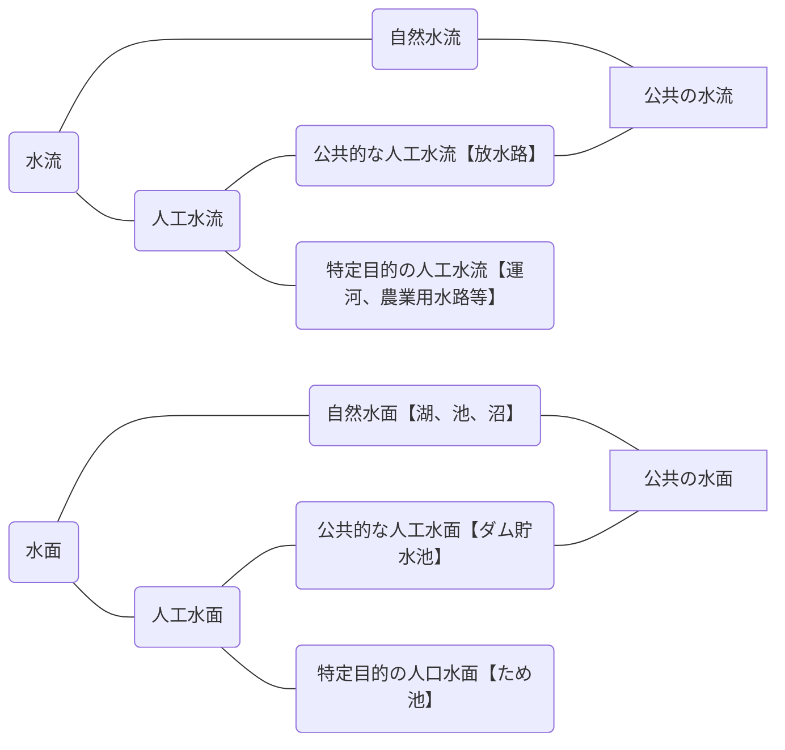

# 河川法の対象

## 公共の水流及び水面

一級河川、二級河川及び準用河川の指定の対象となり得る河川は「公共の水流及び水面」である。

これらの河川以外の河川は、一般に「普通河川」と呼ばれている。

:::note[参考リンク]

- [一級河川（河川法第4条）](https://elaws.e-gov.go.jp/document?lawid=339AC0000000167#Mp-At_4)
- [二級河川（河川法第5条）](https://elaws.e-gov.go.jp/document?lawid=339AC0000000167#Mp-At_5)
- [準用河川（河川法第100条）](https://elaws.e-gov.go.jp/document?lawid=339AC0000000167#Mp-At_100)

:::

### 水流及び水面の意義

水流及び水面は、流水及び敷地との統一体をいう。

### 公共の水流及び水面であること

「公共」とは、直接一般の公衆の用に供されるという意味である。

したがって、特定の目的を有する人工水流及び人工水面は河川となり得ない。

## 一級河川、二級河川及び準用河川

河川法は、河川を水系的にみて重要度の高い順から、一級河川、二級河川及び準用河川に分類して、それぞれの手続に従って、河川法の対象河川としている。なお、治水上、利水上の両面から河川管理について水系一貫管理の原則をとっている。

水系一貫管理の原則とは、同一の水系については、一の管理者が同一の法の適用のもとに管理するという原則である。

河川を分類すれば次のとおりである。

### 河川の分類

準用河川については、水系一貫主義の原則は当てはまらず、一級河川の水系の上流部や二級河川の上流部を指定することもできる。

#### 一級河川

- 国土保全上又は国民経済上特に重要な水系で政令で指定したものに係る河川で国土交通大臣が指定した河川([河川法第4条](https://elaws.e-gov.go.jp/document?lawid=339AC0000000167#Mp-At_4))
- 一級河川は直轄管理区間と指定区間に分けられる。直轄管理区間は国土交通大臣が管理し、指定区間は都道府県知事が管理する。

#### 二級河川

- 一級水系以外の水系で公共の利害に重要な関係があるものに係る河川で都道府県知事が指定した河川([河川法第5条](https://elaws.e-gov.go.jp/document?lawid=339AC0000000167#Mp-At_5))
- 二級河川は都道府県知事が管理する。

#### 準用河川
  
- 一級河川及び二級河川以外の河川で市町長が指定した河川(法第100条)
- 準用河川は市町長が管理する。

#### 普通河川
  
- 一級河川、二級河川及び準用河川のいずれにも当たらない公共の水流及び水面で河川法の規定が適用、又は準用されないもの
- 普通河川は市町長が管理する。

[国土交通省＞水管理・国土保全](https://www.mlit.go.jp/river/riyou/kubun/index.html)
