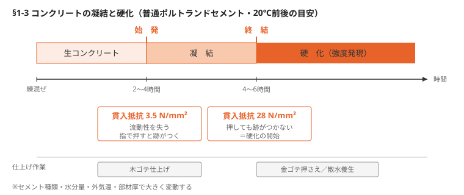
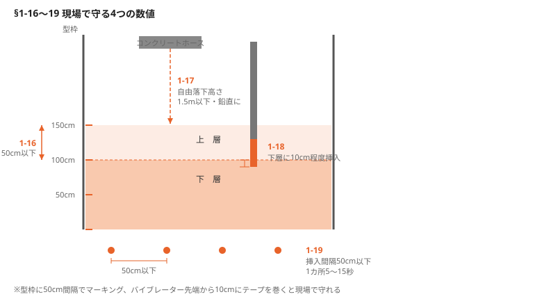
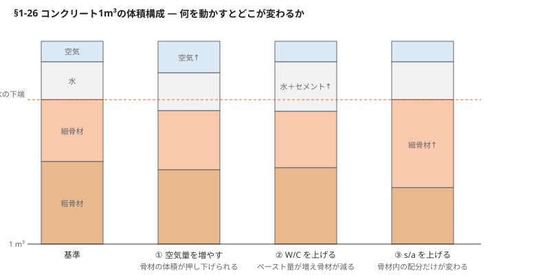

# §1 コンクリート（Concrete）

現場で判断に使う数値と基準を中心に再構成した要点ノート。

---

## 1-1 5つの特性

品質管理はスランプ・空気量など定量値で行うが、現場で状態を語る言葉は定性的。

| 特性 | 何を示すか | 現場での押さえどころ |
|---|---|---|
| ワーカビリティー（作業性） | 運搬→打込み→締固め→仕上げの総合的なしやすさ | 定量値なし。操作感と打上がりで観察判断 |
| コンシステンシー（流動性） | 変形・流動への抵抗性＝軟らかさ | スランプ値 |
| プラスティシティー（可塑性） | 型枠に沿って変形しつつ分離しない粘り | W/C・高性能AE減水剤で調整 |
| フィニッシャビリティー（仕上げやすさ） | 表面仕上げのしやすさ | 粗骨材最大寸法・粒度・s/a・単位水量が支配 |
| ポンパビリティー（圧送性） | 閉塞せず圧送できる性質 | 管内モルタル潤滑層が形成されるか |

**圧送トラブルの切り分け**
- 吐出不足・閉塞気味 → 粘度過大。減水剤で調整、粗骨材最大寸法を見直す
- 吐出時に分離 → 粘性不足。粘性付与型混和剤で保水性を上げる

---

## 1-2 水分と空気

### 水分の内訳（例：W/C=60%、単位セメント量270kg/m³）

| 区分 | 量 | 役割 |
|---|---|---|
| 単位水量 | 162 kg | 全体 |
| 水和反応に必要な水 | 約81 kg（セメント質量の25〜30%） | 硬化に不可欠 |
| 余剰水 | 残り約50% | 施工性のために必要だが、ブリーディング水として排出される |

余剰水が排出されなければ空隙となり耐久性・強度が落ちる。不足すれば打込みが困難になる。**過不足のどちらもダメ**というのが管理の本質。

### 空気の2種類

| | エントレインドエア | エントラップトエア |
|---|---|---|
| 由来 | AE剤・AE減水剤で意図的に導入 | 練混ぜ時に自然に巻き込まれる |
| 形状 | 直径数〜10μmの微細な独立気泡、均等分散 | 大きく不規則 |
| 効果 | 凍結膨張圧のクッションとして働き耐凍害性を大きく改善 | 耐久性向上には寄与しない |
| 量 | 全体の約4〜5% | 0.5〜3%程度 |

- 空気量1%増で圧縮強度が約4〜6%低下 → **6%を超えない**よう管理
- 締固めの目的はエントラップトエアの排出。エントレインドエアを潰すことではない
- 硬化後に両者を判別することは困難

---

## 1-3 凝結と硬化

| 段階 | 貫入抵抗値 | 練混ぜからの時間 | 状態 |
|---|---|---|---|
| **始発** | 3.5 N/mm² | 2〜4時間 | 流動性を失うが柔らかく、指跡がつく |
| **終結**（硬化開始） | 28 N/mm² | 4〜6時間 | 押しても指跡がつかない。強度発現へ |



※普通ポルトランドセメントの目安。セメント種類・水分・外気温・部材厚で変動。

**作業タイミング**：木ゴテ 2〜4時間／金ゴテ押さえ・散水養生 4〜6時間

### 時間の限度

| 条件 | 練混ぜ〜打込み終わり | 練混ぜ〜荷卸し | 許容打重ね時間間隔 |
|---|---|---|---|
| 外気温 25℃以下 | 2.0 h | 1.5 h | 2.5 h |
| 外気温 25℃超 | 1.5 h | 1.5 h | 2.0 h |

### ブロック積擁壁・天端注水試験の矛盾

天端に注水して打継ぎ目の止水性を確認する試験を求められることがあるが、論理的に破綻している。下段は打込み後5〜7時間で凝結を終えており、上段を打つ時点で既に硬化が進んでいる。まして積上げは日をまたぐのが通常で、両者が一体化していることはあり得ない。試験の目的と実態が乖離していることを理解して臨む。

---

## 1-4 打込み中に雨が降ったら

| 時間雨量 | 体感 |
|---|---|
| 1 mm | 傘を差す人が出る |
| 2 mm | 本降り。全員が傘を必要とする |
| 5 mm | 短時間で全身が濡れる |
| 10 mm 以上 | 激しい降り。屋外に水たまり |

**継続可否の目安は2mm/h**。ただし仕上げ面が広い場合は1mm程度でも中止を検討する（作業荷重が増すため）。

**事前** — 高解像度レーダーで前日から降雨量と継続時間を把握。床版など仕上げ面積の広い構造物は防水対策を強化。型枠内の流入水・表面の余剰水を排除できる仮設排水を準備。打込み上方に仮設屋根が置ければ理想。

**降雨中** — 勾配で水が溜まる箇所を確認し、除去してから締固め。水平打継ぎ目は先行コンクリートとの一体化が要るため特に入念に排水。中断時は速やかにシート被覆。

**再開時** — 先行部の脆弱部をワイヤーブラシ等で除去し、良好な打継面を確保。

**落雷の危険があれば、雨が降っていなくても現場責任者の判断で中止。**

翌日以降の話として、ポンプ車・ミキサ車のタイヤによる道路汚れの洗浄も段取りに入れておく。

---

## 1-5 ポンプ車とアジテーターカーの必要台数

### ポンプ車の方式

| 方式 | 吐出量の目安 | 向き |
|---|---|---|
| スクイズ式 | 高速圧送で約50 m³/h | 小規模工事 |
| ピストン式 | 100 m³/h超 | 長距離・高所圧送。ただし騒音大、残コン処理が必要 |

### 台数算定

```
1時間当たりの打込み可能量  Q = Q₀ × ηw × ηm
```

**例**：ピストン式・普通躯体・アジテーターカー2台付け・スランプ12cm
Q₀=100、ηw=0.75、ηm=0.80 → Q = 60 m³/h
作業時間5h → 1日300 m³ → 総量500 m³なら **ポンプ車2台**

**表1 作業効率 ηw**

| 部位 | アジテーターカー1台付け | アジテーターカー2台付け |
|---|---|---|
| 土間等 | 0.55 | 0.85 |
| 普通躯体 | 0.50 | 0.75 |
| 基礎・逆打 | 0.45 | 0.65 |
| 梁工・壁等 | 0.40 | 0.40 |

**表2 機械効率 ηm**

| 骨材の種類 | スランプ値 | ピストン式 | スクイズ式 |
|---|---|---|---|
| 普通骨材 | 12〜17 | 0.70〜0.90 | 0.75〜0.90 |
| 普通骨材 | 18〜21 | 0.85〜0.90 | 0.85〜0.90 |
| 軽量骨材 | 18〜20 | 0.50〜0.75 | 0.70〜0.80 |
| 軽量骨材 | 21〜23 | 0.80〜0.85 | 0.85〜0.90 |

<!-- 要確認：表2の骨材種類の行対応（普通／軽量の割当て）はスキャンから推定。原本で照合のこと -->

### アジテーターカー配車

```
N = Vt ÷ (V / T)
  Vt: 時間当たり計画打込み量  V: 1台の積載量  T: 1台のサイクルタイム
```

**例**：Vt=50 m³/h、V=4 m³、T=0.83h（積込5分＋往復30分＋荷下し15分）
→ N = 10.3 ≒ **11台**

大規模打設では生コンプラントとの事前協議が必須。

---

## 1-6 打込み順序

打込み面積が広い・重ね層が多い場合は、バイブレーター配置と作業員動線を事前計画すると効率が大きく変わる。

- 打込み順序をイラスト／平面図で明示する（外国人労働者を含む全員が理解できる形で）
- 人員配置・発電機位置・打込み開始箇所を図示
- 一度に打つ高さもイラストで表現
- タイムスケジュールを作り、時間当たり打込み量を計画して**前日に全員へ周知**

▶ 図参照：下水処理場の打込み順序例（平面・断面／原本 p.12-13）

---

## 1-7 表面仕上げ

**判断の軸は「ブリーディング水がなくなったか」と「指で押して跡がつくか」。**

- 打継ぎ面・仕上げ面は木ゴテで仕上げる。上面を滑らかにするなら木ゴテ→金ゴテ
- **ブリーディング水を除去せずに仕上げるとひび割れの原因**。示方書上も、締固め完了後にしみ出た水がなくなるか除去するまで仕上げてはならないとされる
- 木ゴテのタイミング＝コンクリートの沈下が落ち着く頃。目安は練混ぜ後2〜4時間（始発前後）
- 金ゴテ押さえ＝指で押してへこまない状態。外気温20℃前後で4〜6時間が目安
- 目安時間は部材厚・骨材種類・気温・湿度に左右される。**手で触れて確認するのが確実**
- 夏季は仕上げタイミングが早まる。遅れないよう注意

### 特殊仕上げ

| 方法 | タイミング | 内容 |
|---|---|---|
| 洗い出し仕上げ | 硬化前 | ブラシ・水で洗い流して骨材を露出 |
| ピックアップ仕上げ | 硬化後 | はつって骨材を露出。硬化不十分だと断面欠損のリスク |
| ブラスト仕上げ | 硬化後 | 水ジェット等でセメントペーストを除去 |

高架橋床版など広範囲の仕上げには、金ゴテより施工速度が速いコンクリート仕上げ機械が有効。ただし精度維持のためのもので、不陸そのものを直す機械ではない。

---

## 1-8 湿潤養生と膜養生

### 湿潤養生

水和に必要な水はセメント質量の25〜30%で、理論上は外部補給不要。しかし実際には打込み後に表面から水が蒸発し、表面が乾くとひび割れが生じ、水和が進まず強度が出ない。だから散水が要る。

- **開始タイミングは終結後**（指で押して跡がつかなくなってから）。始発前後に散水すると表面のW/Cが上がり強度不足を招く
- 方法：散水、湛水、養生マット、シート被覆、膜養生剤塗布 — 施工条件で選定

**表 湿潤養生期間の標準**

| 日平均気温 | 普通ポルトランド | 早強ポルトランド | 混合セメントB種 |
|---|---|---|---|
| 15℃以上 | 5日 | 3日 | 7日 |
| 10℃以上 | 7日 | 4日 | 9日 |

### 膜養生

長時間の散水は工程管理上の負担が大きいため、可能なら被膜養生剤で代替する。型枠解体後に塗布し、水分逸散を抑える。表面の水が引いた後に塗ると薄膜が形成される。

**注意**：屋内・トンネルなど密閉空間では揮発成分が滞留する。送風機等の換気を確保すること。

### その他

気泡緩衝材（プチプチ）やポリ塩化ビニルシート（ラップ）で長期間完全に覆う方法は、蒸発抑制効果が非常に高い。

---

## 1-9 レイタンス処理 — 経過時間で方法が変わる

レイタンス＝セメント・骨材の微粒子がブリーディング水と共に浮上・堆積した脆弱な薄膜。処理せずに打ち継ぐと一体化を妨げ、止水性能が落ちる。**打継面の除去は必須。**

### 硬化前（打込み後 概ね6〜12時間）

高圧水で脆弱層を除去する。広い面積に効果的。除去適期は現場条件と気象で大きく変わるので、**実際に表面を観察し、触れて判断する**。

夕方〜夜間の打設では、翌日に高圧洗浄。凝結遅延剤はブリーディング水が引き始めるタイミングを見極めて散布する。

### 硬化後（24時間以上）

| 方法 | 適用 | 注意 |
|---|---|---|
| ブラスト処理（サンドブラスト／ウォータージェット） | 広面積・重要部 | 仕上げ面がザラつく |
| 機械斫り（電動ピック、ブッシュハンマー、グラインダー） | 狭い箇所・端部 | 打ち過ぎると微細ひび割れ・断面欠損 |

### 標準手順

1. 除去範囲をマーキングし、ムラなく施工
2. 粉塵・スラリー・遊離砂を高圧洗浄で完全除去
3. 打継面を **SSD（表面乾燥飽水）状態**に整える — 内部は水で満たされ、表面に余分な水膜がない状態

### 接着向上策（必要時）

セメントペースト打込み（同等材料・低W/C）／仕様で指定があれば樹脂系接着剤。いずれも**打込み直前**に行い、乾かさない。

### よくある不具合

| 不具合 | 影響 | 予防 |
|---|---|---|
| 早すぎる洗浄 | 骨材が緩む | 指押し＋再テストで二重判定 |
| 遅すぎる洗浄 | 硬化膜が残る | 夜間は遅延剤＋翌朝確実に施工 |
| ムラ残し | 局部的に脆弱 | 通り芯施工と重ね幅管理、端部は追加 |
| 洗浄不十分 | 泥膜残留 | 最終は手元ライトで斜光確認 |
| 乾燥し過ぎ | 吸水ムラ | 打込み直前にSSD調整 |

---

## 1-10 圧送距離の簡易計算

### 配管計画

- 圧送距離を短く、曲がりを少なく。設置・撤去が容易なルートを選ぶ
- 管径は**粗骨材最大寸法の3倍以上**。最大寸法40mmなら125A（5B）以上、20〜25mmなら100A（4B）以上

### 計算方法

水平圧送可能距離を **100m** と置き、各部材の水平換算長さを差し引く。

**水平換算長さ（概略）**

| 部材 | 100A | 125A | 150A |
|---|---|---|---|
| 上向き垂直管（1m当たり） | 3m | 4m | 5m |
| ベント管（90度、R=0.5m または1m） | 6m | — | 3m |
| テーパー管 | 3m | | |
| フレキシブルホース | 20m ÷ L（5m ≦ L ≦ 8m） | | |

**計算例**：125A、テーパー管2カ所（6m）、ベント管1カ所（6m）、フレキシブルホース2カ所（40m）、上向き5m（＝20m）
→ 100 − 6 − 6 − 40 − 20 = **28 m**

曲がりとホースが効くのが分かる。ルート設計の段階で削る余地がある。

---

## 1-11 チェックリストの活用 — 英語併記

コンクリートは打込み時の不具合を後から直せない。取り壊して再施工すれば時間もコストも跳ね上がり、補修で済ませても品質劣化が広がり長寿命化は望めない。だから**未然防止しかない**。

- 打込み前に、世話役だけでなく作業員・ポンプ車オペレーター・アジテーターカー関係者まで集まり、チェックリストで手順と施工方法を確認する
- 現場条件で内容は変わる。**オリジナルのチェックリストを作る**前提で使う
  - 例：厳冬期の山間部道路なら「早朝の凍結融雪剤散布」を項目に追加
- 外国人労働者がいる場合は**英語併記**にすると理解が進み、安全性と効率が上がる

---

## 1-12〜1-15 コンクリート工事チェックリスト

前日打合せ・当日作業で使う5工程分。

原本は日本語・英語併記の様式。確認方法欄と記録欄（結果／サイン／日付）を含めて、印刷してそのまま使える形で再現する。

### 1. 準備（Preparation）

| # | 管理項目 | 確認方法 | 結果 | サイン／日付 |
|---|---|---|---|---|
| ① | 運搬設備・打込み設備・型枠内が清掃され、ごみ等が混入していない | 目視 | | |
| ② | コンクリートと接して吸水するおそれのある箇所を湿らせている | 目視 | | |
| ③ | 硬化したコンクリート表面のレイタンスを除去し、湿らせている | 目視 | | |
| ④ | 型枠内にたまった水を打込み前に除去している | 目視 | | |
| ⑤ | かぶり内に結束線がない | 目視 | | |
| ⑥ | 打込み作業の人員配置が適切である（※1） | 状況確認 | | |
| ⑦ | 予備のバイブレーターを準備している | 状況確認 | | |
| ⑧ | 発電機のトラブルチェックを事前に行っている | 状況確認 | | |

### 2. 運搬（Transportation）

| # | 管理項目 | 確認方法 | 結果 | サイン／日付 |
|---|---|---|---|---|
| ① | 練混ぜ開始から打込み終了までの時間が適切である（※2） | 時間チェック | | |

（※1）締固め作業員が少なすぎて打込み作業が中断されるような状況であれば、人員配置の再検討が必要
（※2）外気温が25℃以上の場合、練り始めてからコンクリートの打込み終了までの時間は **90分以内**

### 3. 打込み（Concrete Casting）

| # | 管理項目 | 確認方法 | 結果 | サイン／日付 |
|---|---|---|---|---|
| ① | ポンプ配管内の潤滑性を確保するため、先送りモルタル等の前処理を施している | 状況確認 | | |
| ② | 鉄筋や型枠の乱れがない | 目視 | | |
| ③ | 打込み位置は、型枠内でのコンクリートの横移動が生じない位置・間隔としている | 状況確認 | | |
| ④ | 打込みが完了するまで連続して打ち込んでいる | 状況確認 | | |
| ⑤ | コンクリートの表面が水平になるように打ち込んでいる | 状況確認 | | |
| ⑥ | 1層の高さは50cm以下としている（→1-16） | 計測チェック | | |
| ⑦ | 2層以上に分けて打ち込む場合、下層が固まり始める前に上層を打ち込んでいる | 状況確認 | | |
| ⑧ | 配管の吐出口から打込み面までの高さを1.5m以下とし、鉛直に打ち込んでいる（→1-17） | 計測チェック | | |
| ⑨ | 表面にブリーディング水がある場合、これを除いてから打ち込んでいる | 状況確認 | | |

### 4. 締固め（Compaction）

| # | 管理項目 | 確認方法 | 結果 | サイン／日付 |
|---|---|---|---|---|
| ① | 棒状バイブレーターを下層のコンクリートに10cm程度挿入している（→1-18） | 計測チェック | | |
| ② | 棒状バイブレーターの挿入間隔は50cm以下である（→1-19） | 計測チェック | | |
| ③ | 棒状バイブレーターの振動時間が適切である（目安5〜15秒） | 時間チェック | | |
| ④ | 締固め作業中、棒状バイブレーターを鉄筋に接触させて振動を与えていない | 状況確認 | | |
| ⑤ | 棒状バイブレーターでコンクリートを横移動させていない | 状況確認 | | |
| ⑥ | 棒状バイブレーターは、穴が残らないように徐々に引き抜いている | 状況確認 | | |

### 5. 養生（Curing）

| # | 管理項目 | 確認方法 | 結果 | サイン／日付 |
|---|---|---|---|---|
| ① | 硬化を始めるまでに乾燥するおそれがある場合、シート等で日よけ・風よけを設けている | 状況確認 | | |
| ② | コンクリートの露出面を湿潤状態に保っている | 目視 | | |
| ③ | 湿潤状態を保つ期間が適切である（※3） | 日数チェック | | |
| ④ | 型枠および支保工の取外しは、コンクリートが必要な強度に達した後である（※4） | コンクリート強度確認 | | |

（※3）一般的なコンクリートの標準的な湿潤養生期間は **5日間**
（※4）気温が20℃を超える場合、型枠は **4日以上**経過した後に取り外すことができる。ただし梁・床スラブ下の型枠は、コンクリートの圧縮強度が設計基準強度に達したことを確認するまで取り外してはならない

**承認 Approval**　サイン Signature：＿＿＿＿＿＿＿＿　日付 Date：＿＿＿＿＿＿＿＿

---

## 1-16〜1-19 チェック項目を現場で実行するための4つの工夫

チェックリストの数値項目は「書いてある」だけでは守られない。**現場に印をつけて可視化する**のが要点。文字よりイラストの方が伝わる。

| 項目 | 数値 | 現場での見える化 |
|---|---|---|
| **1-16** 1層の打上がり | 50cm以下 | 幅止め鉄筋等に50cmごとにマーキング（50/100/150cm）。表面のブリーディング水は確実に排水 |
| **1-17** 自由落下高さ | 1.5m以下 | 幅止め鉄筋に1.5mの高さでマーキング。鉛直に打ち込む。先端部はブリーディング水が溜まりやすく、巻き込ませない |
| **1-18** 打重ね部の挿入深さ | 10cm程度 | バイブレーター先端から10cmの位置にビニールテープでマーキング。下層が固まり始める前に打ち重ね、穴が残らないよう徐々に引き抜く |
| **1-19** バイブレーター挿入間隔 | 50cm以下 | 型枠に50cm間隔でマーキング、またはゴム紐で区切る。1カ所5〜15秒厳守。タイムキーパーを置くのも有効 |

豆板（ジャンカ）や沈降クラックの防止が1-19の目的。



▶ 図参照：原本 p.28-31

---

## 1-20 凍害対策の "養生" ポイント

寒中コンクリートで最重要なのは養生。初期凍害の防止と水和反応の促進を両立させる。

### 保温・断熱養生

自らの水和熱を逃がさず外気による冷却を抑える方法。露出面・開口部・型枠外側を断熱マット等で覆う。

| 材料 | 特徴 |
|---|---|
| ビニール製・ブルーシート | 軽量だが断熱性は低い |
| 高断熱タイプ（表面アルミ層＋内部気泡緩衝材） | 放射熱を反射し内部温度を長時間維持 |
| 内部断熱材を脱着できる再利用可能構造 | 施工性とコストのバランスが良い |

**判断基準**：コンクリートの凍結温度は概ね −2.0〜−0.5℃。**養生期間中の平均気温が4℃を下回るなら保温・断熱養生を検討**する。

**効きどころ** — 冷気の侵入口を塞ぎ密閉状態に近づける／柱コーナー・開口部・柱梁端部の熱損失を防ぐ／養生中も定期的に表面・内部・外気の温度を計測する。

### 給熱・加熱養生

保温だけで所要温度を確保できない場合に外部から熱を供給し、内部温度を5〜10℃程度以上に維持する。

かつてはシート密閉空間で練炭やジェットヒーターを焚いていたが、一酸化炭素中毒の危険と夜間の燃料切れによる品質ムラが課題だった。**現在は電熱線方式が主流**。

- 給熱マット／電熱線ヒーターを型枠外側や表面に密着設置
- 熱風循環方式は暖気を送り込んで回収・再循環。熱効率が高く均一に加熱できる
- センサーを埋設して温度を常時監視し、設定温度を下回れば警報が出る仕組みが望ましい

**注意** — 発熱の偏る製品は使わない／昇温・降温とも **5℃/h** を目安に急変を避ける／燃料切れ・電源障害に備えて予備熱源と自動警報を整備する。

---

## 1-21 橋脚・壁の打継ぎ目 — 2つの方法

| | ① 目地棒方式 | ② 天端型枠方式 |
|---|---|---|
| やり方 | 目地棒を設置し、その天端高さに合わせて表面を仕上げる | 天端型枠を水平に組み、そこまで打ち上げ。型枠から5cm程度の幅を金ゴテで平坦に仕上げる |
| 次回打設 | 硬化後、型枠解体と同時に目地棒を撤去 | 打継ぎ部の型枠を一度解体し、新たな型枠との間を清掃してから締め付ける |
| 注意点 | 目地棒跡の溝にゴミが溜まる。次回打込み前の清掃を徹底 | 既設コンクリートと新型枠の間に十分な清掃が必要。段違いにするとゴミが挟まりやすい |

橋脚柱で②を採用する場合、標準的な打上がり高さは**約3.6m**（型枠合板の長さの倍数になるため）。

▶ 図参照：目地棒の設置／打継ぎ目の天端型枠の残存（原本 p.34-35）

---

## 1-22 外部要因に起因するひび割れ

材料・配合・打込み・養生だけでなく、外から来る力でもひび割れる。設計・施工の段階で織り込んでおく。

### 型枠・支保工の変形

打込み後の硬化過程で型枠や支保工が変形・移動するとひび割れる。

- 支保工の沈下防止 → 支持地盤の地盤改良、鋼板・鋼材の敷設
- **橋脚の梁部（張り出し部）は、先端から先に打ち込み、中央部を水平に打つ**。先端を後回しにすると、コンクリート荷重で張り出し部の根元にひび割れが出る

### 振動の影響

高架橋の拡幅工事では、通行車両の振動が硬化過程のコンクリートに影響する。通行止めが理想だが実際には難しいため、既設と新設の間で縁切りし、ジョイント部をジェットコンクリート等で接続する方法が一般的。

### 構造ひび割れ

設計荷重を超える荷重や不均等な荷重で生じる。

- 強度発現前に支保工を撤去し、型枠材などの重量を床版にかけてしまう例が見られる
- かつて日本でも過積載車両の通行が社会問題化した。ASEAN地域の一部では現在も同様の問題が続いている

---

## 1-23 暑中コンクリート

**日平均気温25℃超で暑中コンクリート**として施工する。東京の2024年実績では、梅雨明け前後から9月がこれに該当（7月28.7℃／8月29.0℃／9月26.6℃）。最高気温40℃の日もある現状、打込み温度35℃以下を保つのは実務上かなり難しい。

### ひび割れ要因

- 水分蒸発が速く、プラスチック収縮ひび割れが起きやすい
- 水和反応が促進され凝結時間が短縮 → コールドジョイントが生じやすい

### 対策

| 場面 | 対策 |
|---|---|
| 待機 | アジテーターカーの待機場所に日除け |
| 圧送 | 配管を日除けし、散水して温度上昇を防ぐ（スランプ低下対策） |
| 打込み前 | 型枠内面に散水し、吸水を防ぐ |
| 時間管理 | 練混ぜ〜打込み終了 **1.5時間以内**／打重ね許容間隔 **2.0時間以内**（可能ならさらに短縮） |
| 打重ね | 下層に約10cmまで振動機を挿入して一体化を図る |
| 打込み直後 | 日射・風によるプラスチック収縮ひび割れ防止にシート被覆 |
| 養生 | 初期強度は早く出るが長期強度の伸びが少ない。散水養生等で湿潤養生 |

### 段取りのポイント

**事前に「品質確保のための対策案」を作成し、発注者（監督員）の承認を得ておく。** 盛り込む内容は、練混ぜ水・骨材の冷却（氷使用、夜間打設）、アジテーターカーの遮光・待機方法、現場での温度測定・スランプ試験の実施体制、養生計画（散水・遮光・遅延剤）など。

---

## 1-24 寒中コンクリート

**日平均気温4℃以下の予測で寒中コンクリート**として扱う。初期凍害を受けると必要強度が得られず、取り壊して再施工になる。札幌の2024年実績では1〜3月と12月が該当。

### ひび割れ要因

- コンクリート中の水分が凍結融解を繰り返して膨張圧を生む
- 低温で水和に必要な水分が凍結し、反応が進まず強度が出ない

### 施工時の対策

- **打込み時のコンクリート温度は5〜20℃**を維持
- 打込み箇所に水が溜まっていればヒーター・バーナーで完全に除去。打継ぎ部が凍結していれば再加熱
- 打込み中の表面を外気に長時間さらさない
- **圧縮強度が3〜5N/mm²以上に達すれば、数回の凍結による影響リスクは低下する**
- 型枠は熱伝導率が低く外気温変化の影響を受けやすい。保温方法に配慮
- 型枠・支保工の取外し時期は、現場養生した供試体の圧縮試験結果や積算温度で判断
- 強度発現に必要な養生温度の下限は概ね −10℃。それ以下では強度向上は非常に難しい

### 積算温度

養生期間中の平均気温を合計したもの（日本では0℃基準）。標準養生20℃なら (20−0) × 28日 = **560℃・D**。

**560℃・D を下回ると強度不足の可能性がある。**

| 積算温度（℃・D） | 推定圧縮強度（比率） | 主な用途 |
|---|---|---|
| 約30〜50 | 5〜9% | 初期凍害の防止判断 |
| 約100 | 約20% | 型枠脱型の目安 |
| 約300 | 約55% | 設計基準強度に達する養生温度の検討 |
| 約500〜 | 約80〜90% | |

配合ごとに必要な積算温度と強度の関係を、事前試験で求めておくのが実務的。

### 所定強度を得る養生温度と期間の目安

（断面が普通の場合、水セメント比55%が前提。W/Cが異なれば適宜増減）

| 条件 | 養生温度 | 早強 | 普通 | 混合B種 |
|---|---|---|---|---|
| 厳しい気象条件 | 5℃ | 5日 | 9日 | 12日 |
| | 10℃ | 4日 | 7日 | 9日 |
| まれに凍結融解する条件 | 5℃ | 3日 | 4日 | 5日 |
| | 10℃ | 2日 | 3日 | 4日 |

### 品質確保の要点

保温だけで凍結温度を上回れないなら、ジェットヒーター等で給熱する。**養生温度は5℃以上**を保つ。厳しい気象条件にさらされる部位は、所定強度が得られた後**さらに2日間は0℃以上**を保つ。表面の乾燥もひび割れを招くので併せて管理する。

---

## 1-25 高流動コンクリートと流動化コンクリート

過密配筋や複雑な型枠形状でバイブレーターでも充填が困難、という課題への解が両者。**似て非なるもので、責任の所在が違う。**

### 高流動コンクリート

JIS規格品として工場で製造される。管理指標は**スランプフロー（標準値45〜60cm）**。

| 長所 | 短所・注意 |
|---|---|
| 過密鉄筋・複雑形状でも振動締固めなしで充填可能 | 型枠に作用する側圧が大きい。特に下方。**型枠の補強が必要** |
| 水分量が少なくブリーディングが少ない | ポンプ車の仕様・圧送距離・配管長・ベント管数から圧送可否の判断が要る |
| 型枠端部まで確実に充填できる | 補助的にバイブレーターを使う場合、材料分離を招くため過度な振動は避ける |

**種類**：増粘剤系（分離抵抗性を増粘剤で確保）／粉体系（石灰石微粉末などの粉体量を増やす）／併用系（粉体＋増粘剤で品質のばらつきを抑える）

### 流動化コンクリート

JIS規格の普通コンクリートを運搬し、**現場で流動化剤を添加**して流動性を高めたもの。

- 混和剤の添加と打込みまでの工程管理は、専門知識のある技術者または講習受講者が責任を持って実施
- **効果は時間とともに減少し、元のスランプ値より低下する**。時間管理が決定的に重要
- 添加後の撹拌時間を必ず確保する（均一な流動性のため）
- 通常の受入れ品質管理に加え、混和剤の管理・添加後の品質検査が増える。現場全体でのフォローが必要
- **流動化後のコンクリートの責任は元請にある。** 材齢28日の圧縮強度を元請が指定していることを整理しておく

---

## 1-26 配合を理解する

配合表を「見る」だけでなく、設定の根拠を把握しておくと、施工段階での不具合を早期に予知・是正できる。

### 設定条件の流れ

```
設計基準強度 fck
   ↓  施工誤差・品質変動を上乗せ
配合強度 F = fck + 1.64σ    （σ：強度の標準偏差。通常2.5〜5程度）
   ↓
単位セメント量が決まる
   ↓
水セメント比 W/C が決まる
   ↓
細骨材率 s/a、空気量が決まる
```

**目安**（普通ポルトランドセメント）

| 設計基準強度 | 単位セメント量 | W/C |
|---|---|---|
| 24 N/mm² | 300〜320 kg | 約55% |
| 30 N/mm² | 340〜360 kg | 約50% |

空気量は一般に4.5〜5.0%。混和剤で加わる水分も単位水量に含める。

### 細骨材率と表面水率

- スランプが大きい（軟らかい）ほど細骨材率は小さくなる
- 細骨材率が高いと骨材全体の比表面積が大きくなり、同じスランプを出すのに単位水量が増える。**単位水量を抑えるには混和剤を併用する**
- **表面水率の影響は無視できない。** 骨材の表面水率が多いと自由水が増え、スランプ過大・W/C過大を招き強度が落ちる
- プラントが骨材に屋根を設けているのは、降雨で表面水率が変動するのを防ぐため

### 材料の体積の関係（1m³の内訳・例）

| 材料 | 重量 | 体積 |
|---|---|---|
| 単位水量 | 160 kg | 0.160 m³ |
| 単位セメント量 | 293 kg | 0.092 m³ |
| 細骨材 | 780 kg | 0.300 m³ |
| 粗骨材 | 1,075 kg | 0.398 m³ |
| 空気量 | — | 0.050 m³ |

比重：セメント3.15／細骨材2.60／粗骨材2.70

水とセメントの体積が確定すると、残りが骨材の体積になる。その残りを s/a で細骨材と粗骨材に配分する — という構造で見ると理解しやすい。



**図の読み方** — ①空気量を増やすと骨材の体積が押し下げられる。②W/Cを上げるとペースト（水＋セメント）の体積が増え、その分だけ骨材が減る。③s/aを動かしても骨材全体の体積は変わらず、細骨材と粗骨材の**配分だけ**が変わる。この3つを区別できると配合表が読める。

---

## 1-27 品質管理規定

工場は**呼び強度を保証**しているが、それは標準的な養生が行われる前提。現場で必要な養生が行われなければ、呼び強度に達しないコンクリートになる。JIS製品を買っていても、施工者側の品質管理は不可欠。

### 受入れ時の3項目

**スランプの許容差**

| 指定値（cm） | 許容差（cm） |
|---|---|
| 2.5 | ±1.0 |
| 5超え6.5 | ±1.5 |
| 8〜18 | ±2.5 |
| 21 | ±1.5 |

**空気量**

| 種類 | 指定値 | 許容差 |
|---|---|---|
| 普通コンクリート | 4.5% | ±1.5% |
| 軽量コンクリート | 5.0% | ±1.5% |
| 高流動コンクリート | 4.5% | ±1.5% |

**塩化物量**：原則 塩素イオン量 0.3 kg/m³以下（承認により 0.6 kg/m³以下）

コンクリートの種類によって規定値が異なるため、事前に仕様書・設計図書で確認・整理しておく。

### 強度の判定（JIS A 1108）

1. 1回の試験結果が、指定した呼び強度の **85%以上**
2. 3回の試験結果の平均値が、指定した呼び強度の値**以上**

---

**＜原本の参考資料＞** 土木学会「コンクリート標準示方書」設計編2022年・施工編2023年／日本建築学会「建築工事標準仕様書・同解説 JASS5 鉄筋コンクリート工事」2022年／気象庁HP
