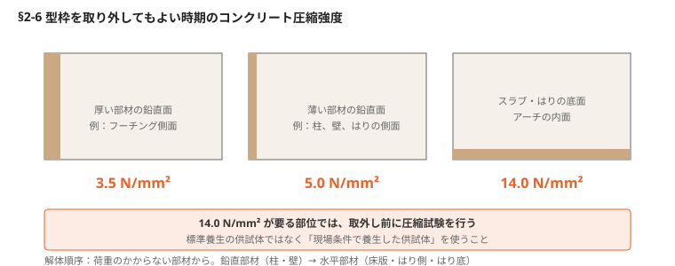

# §2 型枠（Formwork）

## この章の要旨

- 用途や環境の変化に応じて、様々な型枠材を上手に使いこなす
- コンクリートの仕上がりは、型枠の精度に左右される
- 脱型後は邪魔と思われがちなPコンやセパレーターにも、優れた活用法がある
- 型枠支保工の取外しは、現場養生したコンクリート強度を確認した後に行う
- 型枠支保工は組立て・精度確保だけでなく、解体時の効率も考えて計画する

---

## 2-1 合板・鋼製・FRP

型枠材は構造物の形状を決める材料であり、その精度がコンクリートの仕上がりに直結する。

| | 合板 | 鋼製 | FRP |
|---|---|---|---|
| 転用回数 | **4〜8** | **30以上** | **20以上** |
| 強み | 汎用性が高く仕上がりが良い。軽量で現場加工が容易 | 強度・剛性が高い。組立て・解体を機械化でき施工スピードが速い | 非常に軽量。曲面・複雑形状に対応。透明型枠なら締固め状況を確認できる |
| 弱み | 転用回数が限られ、使用後は焼却処理 | 現場加工不可。質量が大きく重機が要る。錆の発生リスク | 価格が高い。紫外線劣化。鋼製より剛性が劣る。保水性が低く表面が乾燥しやすい |

**材料選択の背景** — 合板の主流だった南洋材ラワンは熱帯林由来で、森林伐採による環境影響が懸念されている。近年は国内で計画的に植林される針葉樹（スギ・ヒノキ）合板の採用が増加。輸送コストが低く環境配慮にも適うが、変形しやすく転用回数が少ない傾向がある。

その他、紙（ボイド管）と金網（ラス）はいずれも転用不可。前者は箱抜き用（→§2-9）、後者は垂直面の打継ぎ部に用いる。

---

## 2-2 コンクリート精度向上のために必ず行う型枠点検

点検には3つのタイミングがあり、それぞれ見る対象が違う。**組立てが終わってから直そうとしても手遅れになる。**

### ① 組立て前 — 材料のチェック

- 複数回転用した合板は、**セパレーター穴が未修復のまま残っている**ことが多く、コンクリート接触面のささくれや損傷も生じる
- 損傷や変形のある型枠を使うと、仕上げ面の凹凸や断面寸法の不具合につながる
- 鋼製型枠は転用回数が多いぶん、現場に持ち込まれた段階で変形・発錆している可能性がある。**組立て前に目視点検**し、不具合があれば速やかに交換する

### ② 組立て中 — 精度を作り込む

**組立ての途中で計測する。** 現在はレーザー墨出し器が普及しており、比較的容易にチェックできる。

見るのは **通り** と **タチ（垂直）**。組立て完了後は、型枠天端をワイヤーやサポートでしっかり固定する。

### ③ 打込み中 — 変形を追う

**通り・タチ・はらみ** を常時点検し、打込み後すぐにワイヤー・サポートを調整する。

### 施工計画時の荷重の考え方

- 計算荷重には、材料の自重・鉄筋重量に加え、コンクリートの**側圧**を含める
- **側圧は打込み速度に比例する。急速施工では側圧が大きくなる**
- ハンチ部や斜面を持つ部材では**浮き上がり**が発生する
- 支保工には水平方向に対抗するツナギ材・筋交いを設置する
- 持ち出し・張り出し状態は変形が大きくなる。セパレーターや支保工の間隔を狭め、**張り出し部の先端を最後に打ち込むことは避ける**（→§1-22 と同じ理屈）

<!-- 要確認：荷重・側圧に関する記述はスキャンの判読が不安定で、原文の論旨を完全に再現できていない。上記は一般的な型枠設計の考え方で補完したもの。特に「ハンチ部の浮き上がり」と「打込み速度と側圧の関係」の対応関係は原本で照合すること -->

---

## 2-3 ハンチ部型枠の固定方法

ボックスカルバートや水槽では、底版と壁の接合部にハンチを設けるのが一般的。ここが厄介なのは、型枠同士をセパレーターで連結できない **「片バリ」** になる点である。

### 浮き型枠に働く力

| 段階 | 働く力 |
|---|---|
| 打込み前 | 型枠の自重（下向き） |
| 打込み中 | コンクリートの圧力による**浮き上がり** |

この両方に耐える固定が要る。**そもそも浮き型枠を避けられるなら避けるのが正解。**

### セパレーターの固定方法

| 方法 | 可否 |
|---|---|
| 主鉄筋への溶接 | **✗ 避ける。** 局部的な加熱で鉄筋の疲労強度が大幅に低下する（→§3-5） |
| 先に打ち込んだコンクリートに埋め込んだ鉄筋・鋼材への溶接 | ○ 型枠と直角になる溶接箇所を特定し、**点溶接ではなく線溶接**で十分な抵抗力を確保する |
| 専用のクリップ型治具 | ○ 溶接以外の選択肢 |

**ハンチ部は気泡が滞留しやすい。** 型枠強度が不十分だと締固めが弱くなり、アバタや気泡の発生原因になる。セパレーターによる確実な固定が品質に直結する。

▶ 図参照：浮き型枠を使用したコンクリート割付／ハンチ部のセパレータ溶接／セパレータ固定金具（原本 p.52-53）

---

## 2-4 Pコン跡は確実に処理を！優れた活用方法

型枠を解体した後、コンクリート内に金物が残れば鉄筋の腐食が進む。Pコン処理を放置すれば外観も損なう。

### 処理手順

1. **プライマーを塗布**する（コンクリート表面と充填材の接着性を向上させる）
2. 充填材を詰める — 収縮が少なく止水性に優れた**ポリマーセメント／無収縮モルタル／樹脂系モルタル**
3. かぶりを大きく取ったPコンでは、**複数段に分けて充填**し、前層が硬化した後に次層を仕上げる
4. コンクリートと同色か、やや低めの位置に仕上げる

**色合わせの注意** — 白セメントを混ぜて調整するが、**練混ぜ時と乾燥時では色が変わる**。乾燥後に色合いを確認すること。工期に余裕がなければPコン充填用の既製品を検討する。

### セパレーターの型式

| 型式 | 特徴 | 使いどころ |
|---|---|---|
| **B型（Pコン仕様）** | 打ちっぱなし仕上げ用 | 土木現場ではこちらが多い |
| **C型（折セパ仕様）** | 突出部を折り取れるが**座金は残る** | 仕上げ材を上塗りする建築側 |

止水性が求められる場合は、**水によって膨張するゴム止水材を止水用セパレーターの中央部に取り付ける**。

**Pコン処理を指示するのは現場担当者の仕事。** 型枠大工任せにすると、後で処理以上の補修が必要になる。

### 足場材の壁つなぎ（労働安全衛生規則）

| 足場種別 | 垂直方向 | 水平方向 |
|---|---|---|
| 枠組み足場 | **9m以下** | **8m以下** |
| 単管足場 | **5m以下** | **5.5m以下** |

※高さ5m未満の枠組み足場はこの限りでない。

セパ孔を使わずアンカー打込みで壁つなぎを設置すると、設置・撤去に手間を要するうえ、**撤去後のコンクリート壁面の美観が損なわれる可能性がある**。Pコン・セパレーターを壁つなぎに活用できるのはここ。

▶ 図参照：Pコン充填用製品／Pコン仕様・折セパ仕様／止水用セパレータ／足場の壁つなぎ材（原本 p.54-55）

---

## 2-5 止水板、止水ゴムの設置

漏水の原因は、たいてい**打込み時の移動・浮き上がりによる位置ずれ**である。

### 材料

ステンレス鋼板／ポリ塩化ビニル製／ゴム製／非加硫ブチルゴム／水膨張ゴム。
**コンクリート打込み中に変形しやすい材料は避ける。**

### 水平打継ぎ目 — 2つの方法

| | 打込み前に固定 | 打込み後に設置 |
|---|---|---|
| 方法 | 鉄筋や丸鋼で固定する | 打ち込んだコンクリートに挿入する |
| 長所 | 位置ずれが少ない | 設置位置や角度を正確に調整できる |
| 短所 | 打込み中に浮き上がる可能性。観察して必要に応じ修正 | 時間が経つと挿入が難しくなる。表面を乱す可能性 |

### 鉛直打継ぎ目

- 止水板の**下側に充填不良やブリーディングによる空隙**が生じやすい。入念な打込みが必要
- 型枠材で挟み込んで固定し、移動・変形を防ぐため鉄筋や丸鋼で補強する
- 止水ゴムは専用接着剤で固定する。下地の状態（乾燥・湿潤・目地など）に応じて接着剤を選定する
- **水膨張ゴムは膨張圧でひび割れを起こす。** 薄いコンクリート部材では特に注意し、所定の位置に確実に設置する

<!-- 要確認：水膨張ゴムの膨張圧とひび割れ・剥離の因果に関する記述は、スキャンの判読が不安定。「薄い部材で注意」という趣旨には読めるが、条件（部材厚の目安など）が読み取れなかった。原本で照合すること -->

### ボックスカルバート用

- ポリ塩化ビニル製・ゴム製は**周囲の温度変化に伴う伸縮**への配慮が要る
- 止水板の端部は止水板溶接機で挟み、両面から均等に圧力をかけて溶着する
- 溶着は、状況に適した溶接技術を有する専門技術者に依頼することが望ましい

▶ 図参照：水平打継ぎ目の止水板／鉛直打継ぎ目の溶接／ボックスカルバート止水板／ポリ塩化ビニル製止水板の溶着機（原本 p.56-57）

---

## 2-6 現場条件で変わる、型枠支保工の取り外し時期

原則はコンクリートが所定強度に達してから。ただし**現場の実際の強度は標準養生とは異なる**。特に冬季は注意を要する。

### 取り外してもよい時期のコンクリート圧縮強度

| 部材面の種類 | 例 | 圧縮強度 |
|---|---|---|
| 厚い部材の鉛直または鉛直に近い面、傾いた上面、小さいアーチの外面 | フーチングの側面 | **3.5 N/mm²** |
| 薄い部材の鉛直または鉛直に近い面、45°より急な傾きの下面、小さいアーチの下面 | 柱、壁、はりの側面 | **5.0 N/mm²** |
| 橋梁のスラブおよびはり、45°より緩い傾きの下面 | スラブ、はりの底面、アーチの内面 | **14.0 N/mm²** |

### 実務上の要点

- 強度発現はセメントの種類・配合・打込み後の気温や湿度で大きく変わる。示方書の値は**参考値**であり、条件を確認して適切に判断する
- 橋梁のスラブ・はりは **14.0 N/mm² 以上**。取外し前に**現場の条件で養生した供試体**で圧縮試験を行う（標準養生の供試体では不可）
- **解体順序** — 荷重のかからない部材から先に。柱・壁など鉛直部材 → 床版、はり側面、はり底面など水平部材の順
- 固定ばり・ラーメン・アーチなど、ひび割れ抑制のためにコンクリートのクリープを利用したい構造では、必要強度の確認後**できるだけ早期に撤去する方が望ましい場合**がある

---

## 2-7 地盤沈下を防ぐ型枠支保工の地盤支持の目安

橋脚のはり部などでは、経済性・施工性から一時的に埋め戻して支保工を組むのが一般的。ここが沈下すると型枠精度が崩れる。

### 目標値

**N値30以上**を目指す。はり部のコンクリート重量は床版材より大きいため、埋戻し部の地盤に十分な強度が求められる。

**支保工に必要な地盤支持力は明確に規定されていない。** 上部構造物向けの指針を参考にする。

| 出典 | 粘性土（地盤） | 砂質土（地盤） |
|---|---|---|
| コンクリート道路橋示方書（2020年） | N値 10〜30 | N値 20〜50 |
| 道路土工 擁壁工指針（2012年） | N値 10〜30 | N値 20〜50 |
| 道路土工 カルバート工指針（2010年） | N ≧ 10〜15（qu = 100〜200 kN/m²） | N ≧ 20 |

いずれの土質でも **N値20以上**は確保する。堅固な層が薄い場合や下層に軟弱な層がある場合は、その層の置き換えや地盤改良を検討する。

### 支持力が足りないときの手立て

- 地盤改良して荷重を分散させる
- 敷鉄板を敷設する
- **フォームコネクター等で既設コンクリート（橋脚柱など）と支保工を連結する** — 柱高が高いほど経済性・施工性で有利になるケースがある

▶ 図参照：橋脚まわりの支保工（柱高が高い場合／低い場合／原本 p.60-61）

---

## 2-8 型枠支保工取り外し時に配慮すべき事項

### 取り外し直後の載荷は厳禁

所定強度の発現前に支保工を取り外したり、打込み直後のコンクリートに荷重を加えたりすると、**構造的なひび割れが発生する可能性がある**。取り外した支保工材を、そのまま新設床版上に載せて置くことは避ける。

新設コンクリート床版上は、原則として作業場としては使用しない（設計荷重の範囲内であれば許可される場合もある）。

### 解体作業そのものの危険

- 通常、取り外しは組立てと逆の順で行う
- 実態としては**打ち込んだコンクリート床版上を横引きする作業が多く、材料の落下による危険を伴う**
- 手順を重視し、安全を確保して作業を進める
- 施工計画の段階で作業手順を詳細に検討し、**注意点を含めて作業員に説明・理解を得たうえで**着手することが重要

▶ 図参照：床版型枠支保工 組立・解体作業（原本 p.62）

---

## 2-9 コンクリート箱抜き材の特徴

コンクリートの打込み前に、床版・壁・フーチング等の一部に円形または矩形の箱抜きを設ける。撤去のしやすさ・強度・施工性で材料を使い分ける。

| 材料名 | 強度 | 加工性 | 転用の可否 |
|---|---|---|---|
| 合板 | ○ | ○ | ✗ |
| スパイラル管 | ○ | ○ | ✗ |
| ボイド管（紙製） | △ | ○ | ✗ |
| 発泡スチロール | △ | ○ | ✗ |
| 塩ビ管 | ○ | △ | ○ |

<!-- 要確認：箱抜き材一覧表の「強度／加工性／転用の可否」の○△×の対応は、スキャンの判読が不安定で確度が低い。特にボイド管・発泡スチロールの強度欄と、塩ビ管の加工性欄。原本で照合すること -->

### 施工上の押さえどころ

- 橋脚天端のアンカー箱抜きには円形型枠（ボイド管）を用いる。**下端部はコンクリートの回り込みを防ぐためガムテープ等で閉塞**し、専用の金具で固定する
- 移動や浮力への対策として、下端部の空隙にコンクリートを打ち込んで固定する方法もある
- **紙製ボイド管はコストが低いが変形しやすく、取り外せない場合は異物として残る。** 確実に撤去できる固定方法を採用する
- スパイラル管は溶接による固定が容易だが、長期間放置せず箱抜き後は速やかに撤去する

### 水槽や壁の箱抜き

- 箱抜き後に打ち込むコンクリートと既設コンクリートの間には**コールドジョイントが生じる**。漏水対策を検討する
- 止水板・止水ゴム・防水シールを設置する
- **箱抜き周囲には補強鉄筋を配置する。** 矩形の欠損部は隅角部からひび割れが発生しやすく、補強を設けなかった壁ではひび割れがよく見られる

▶ 図参照：ボイド管の固定金具（原本 p.63）

---

**＜原本の参考資料＞** 土木学会「コンクリート標準示方書 施工編」2023年／日本建築学会「建築工事標準仕様書・同解説 JASS5 鉄筋コンクリート工事」2022年
