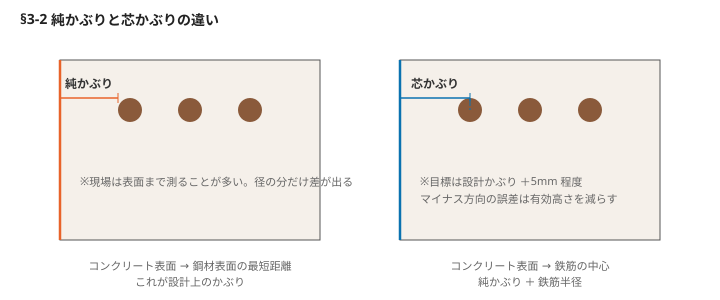
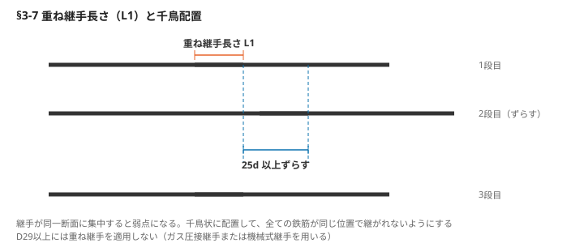

# §3 鉄筋（Rebar）

## この章の要旨

- 鉄筋かぶりの確保には細心の注意を払う。スペーサーは適材適所に
- 鉄筋は硬くて重いが性質はデリケート。溶接やガス切断の熱入れは原則禁止
- 鉄筋継手は品質やコストを比較し、最も現場に適した方法を選定する
- 図面通りに配筋できない場合は補強鉄筋を配置。過密鉄筋箇所は事前に対策を立てる
- 鉄筋の天敵は錆。保管・組立てからコンクリートの打込みまで発錆させない

---

## 3-1 受入れ時の品質管理と確認事項

近年は異形棒鋼（以下、鉄筋）の加工を現場では行わず、生材を協力業者の工場に搬入してオートメーション化された設備で高速加工するケースが増えている。**確認の責任は協力業者ではなく元請にある**という点は変わらない。

### 受入れ時に確認するもの

| 項目 | 内容 |
|---|---|
| 種類 | SD295 や SD345 など |
| 径・長さ・本数 | 現物と発注内容の照合 |
| **ミルシート** | 材料検査証明書。メーカー、荷姿、圧延タグ（ロット）、圧延マーク |
| 圧延マーク | 突起があるものは SD345、突起がないものは SD295 |
| 識別塗装 | SD295は表示がなく、黄色はSD345を示す |

「295」「345」は、降伏点における強度（N/mm²）を表す。**下位降伏点**を示す。

### 降伏点の意味

<!-- 要確認：この節はスキャンの判読が特に不安定で、原文の論旨を再現できていない。以下は一般的な材料力学の説明で補完したもの。原本と必ず照合すること -->

「295」「345」は**降伏点（下位降伏点）の強度 N/mm²** を示す。降伏点とは、鉄筋が弾性域を超えて塑性変形を始める応力のこと。

- 弾性域 … 荷重を除けば元の長さに戻る
- 降伏点を超える … 元に戻らない。伸びて断面径が細くなる
- 最大強度（引張強さ）… その先で破断に至る

地震時など想定を超える力が加わった際、鉄筋が塑性変形することでエネルギーを吸収する。**強度が高い鉄筋ほど降伏後の伸び代（靱性）は小さくなる傾向がある**ため、設計で指定された種類を勝手に上位品へ振り替えてはならない。

### 加工後の確認

- 種類、径（図面の鉄筋番号と照合）、寸法、本数
- 折り曲げ角度、寸法、余長
- 曲げ部の径は鉄筋径の呼び径を「d」とした場合、**曲げ内径が3d または4d** となっているか
- 鉄筋の保管状況
- 機械継手部のマーキング位置、長さ

▶ 図参照：鉄筋の種別区分（ロールマーク・サイズ数字／原本 p.66）

---

## 3-2 かぶり厚は純かぶりで対応 — かぶり不足時の処置

**キーワード：組立て中のチェック／+5mm程度を目標／マイナス方向の誤差に注意**

### 純かぶりと芯かぶり

| | 定義 |
|---|---|
| **純かぶり** | 鋼材表面（鉄筋またはシース）からコンクリート表面までの最短距離。**設計上のかぶりはこちら** |
| **芯かぶり** | コンクリート表面から鉄筋の中心までの距離 |

現場ではコンクリート表面から鉄筋表面までを測ることが多い。両者は径の分だけ違うため、混同に注意。

### かぶり不足が判明した場合の措置

1. まず修正する — 鉄筋を数カ所引っ張って全体を押し縮め、所定の位置に戻す
2. しかし、修正で所定の位置に戻すことは困難な場合が多い。**その場合はコンクリート断面を拡大する方法もあるが、コスト増が大きい**
3. さらに型枠を組み立てて後でかぶりを確保するには**再組立て**が必要になり、コンクリートの手間が生じることも考慮しなければならない

### かぶり不足を生じさせないために

- **組立て中に、コンクリートのかぶりの状態を常にチェックする**
- 組立て中は鉄筋の配置、許容誤差の範囲内で施工することが求められるが、**厚さ +5mm程度を目標にして施工する**
- 鉄筋の有効高さが減少すると、設計計算における断面の応力が確保できなくなるため、**マイナス方向の誤差に十分な注意が必要**（図2）

---

## 3-3 鉄筋コンクリートの結束線処理は確実に

**結束線が型枠面に接した状態でコンクリートを打ち込むと、コンクリート表面から露出した結束線から錆が発生する。** たとえ表面の錆を除去しても、鉄筋のかぶり内に錆が進行し、鉄筋が再び錆びるリスクが高まる。

### コンクリート打込み前の3つの予防策

1. **鉄筋工への教育** — 結束線を内側に押し込むよう指導する
2. **組立て後に元請による点検を実施** — かぶり内に残っている場合は除去する
3. **型枠組立て後は結束線の修正が困難になるため、鉄筋組立て後の早い時期に最終のかぶりのチェックを行う**

▶ 図参照：かぶり内の結束線処理（原本 p.68）

---

## 3-4 鉄筋結束の目的は？

**キーワード：鉄筋を結束／千鳥格子／通常の2倍の全結束**

結束は**「鉄筋を所定の位置に保持する」**ことを目的として行われるものであり、コンクリート構造物の強度を向上させるものではない。鉄筋は構造計算に基づいて設計されており、構造図に従って組み立てられる。固定するために組み立てられる。

なお、結束の有無による拘束力の差は、コンクリート硬化後の付着力と比べれば小さい。**硬化後の鉄筋の拘束は、結束線ではなくコンクリートの付着力が担っている。**

<!-- 要確認：上記は原文の趣旨をこう読んだが、スキャンの該当箇所が判読しにくい。原本で確認のこと -->

### 結束の注意点

- 鉄筋の組立てからコンクリート打込み完了まで、**設計通りの位置に鉄筋を保持する**
- 一般的に鉄筋の結束は**千鳥**（一つ飛ばし）で行う。壁や床では千鳥格子として、2倍の労力がかかる
- コンクリート打込み手順で作業通路として利用する場合は、鉄筋の結束が緩む可能性が高い。初めから通常の2倍の全結束を行う
- このような対策を講じ、軽度予防的に行うことが作業現場であると評価できる

---

## 3-5 性能の低下に気をつけよう — ガス切断と溶接

鉄筋のガス切断および溶接は、鉄筋の性能を低下させる恐れがあるため、**原則として禁止**されている。やむを得ず実施する場合は、定められた手順および規定に従って実施する。

### ガス切断

- 鉄筋がガス切断する際、切断部は高温にさらされるが、十分な時間をかけて冷却すれば材質の劣化は抑えられる
- しかし実際の建設現場では加熱後に急冷せざるを得ないことが多く、結果として材質としても劣化する。**そのため、ガス切断は原則として禁止されている**
- 構造上重要な位置に配置された鉄筋をやむを得ずガス切断する場合は、発注者と協議し、**補強鉄筋を配置するなどの対策を講じる**必要がある

### 溶接

- コンクリート標準示方書では「鉄筋は溶接により接合を行わないことを原則とする」と明記されている
- やむを得ず鉄筋を溶接により接合する場合は、局部的な加熱によって鉄筋の材質の劣化が抑えられる、アンダーカット（溶接継手のエッジに沿って母材が削り取られてできた溝）が発生しやすくなる
- **溶接を行うときは、鉄筋の性質・構造物の重要度などを考慮し、溶接方法などに十分な注意を払う必要がある**
- 鉄筋の性質に有害な影響を及ぼす溶接には溶接を行わない
- 溶接作業には、所定の資格を有する溶接技能者が実施する
- 溶接部の急激な冷却を避けるため、雨天時は作業をしない

---

## 3-6 鉄筋のガス圧接継手

1960年頃に開発された鉄筋の接合には重ね継手が使用されていたが、大径鉄筋の接合が可能になった。ガス圧接継手はコスト面から現在も広く利用されているが、天候の影響を受けやすいという欠点がある。

**キーワード：D29以上／ガス圧接継手が主流／降雨や強風時は作業中止／ふくらみを計測**

### ガス圧接継手の概要

- **D29以上の鉄筋の接合には重ね継手が使用されているが、ガス圧接継手または機械式継手のいずれかを採用する必要がある**（→3-7）
- ガス圧接継手は、鉄筋の接合面を突き合わせ、圧力を加えながら加熱して接合する技術
- 利点は鉄筋のラップ分が不要となるため、鉄筋の密集を回避でき、バイブレーターなどコンクリート締固め器具の挿入が容易になり、打込みや作業がスムーズになる
- 圧接工の技能の差が鉄筋の品質に大きな影響を与える。**圧接作業は有資格者が行う**
- 近年では有資格者の数が減少しており、大口径鉄筋の圧接では技能者の確保が課題となってきている

### ガス圧接継手の施工上の留意点

- 大口径鉄筋の圧接作業は、1カ所当たりの作業時間が長いため、作業中に降雨が発生することがある。**作業を継続することができない場合がある。その際、特に仕上がりに、雨水が鉄筋に沿って流れ込みやすく、接合不良の要因となるため特に注意する**
- 定尺鉄筋（加工前に必要な入荷材）は通常シャーリング切断で処理しておく。このため接合部にグラインダー等を確実に処理しておく
- **圧接作業の順番にグラインダーをかけるため、それを考慮して鉄筋を加工する**
- 施工は溶接箇所に限定し、確実に締め固めを行うために、曲げ加工部では行わない
- 圧接作業後、接合部の**ふくらみを全数計測する**。不具合箇所は再加工する

**ふくらみの規格**：直径 **1.4d以上**、長さ **1.1d以上**（d：鉄筋径）

▶ 図参照：圧接部のふくらみ（原本 p.71）

---

## 3-7 鉄筋の重ね継手

鉄筋の継手工法は、**溶接継手・機械式継手・ガス圧接継手・重ね継手**の4種類に大別される。ガス圧接継手が我が国の鉄筋コンクリート施工に1900年頃から始まり、当時の鉄筋の継手は主に重ね継手が用いられていた。**ここでは D29未満の鉄筋に適用される重ね継手**について解説する。

### 重ね継手（ラップ）の考え方

- 重ね合わせた2本の鉄筋は溶接が不可能なため、**D29以上の鉄筋の継手は施工性などの理由で適用外**となる
- 基本的に、D29以上の鉄筋の継手は重ね継手以外の方法をとらなければならない
- 最も一般的な重ね継手は、配筋時に結束線で束ねる程度の作業なので、「2本の鉄筋を重ねるだけでどうして力が伝わるのか」と疑問に思う方もいるかもしれない
- 確かに、コンクリートが一体化する前に力が加わると2本の鉄筋は分離してしまう。**しかし、コンクリートが打込まれ強度が発現するとコンクリートの付着力がかかって、2本の鉄筋を重ねて接合することで、もともと1本の鉄筋よりも不安定な部分が生じることは否めない**

### 千鳥配置

- コンクリート構造物では、鉄筋の継手部分は構造上の弱点となりやすい。特に、継手が1カ所に集中することを**「同一断面での継手」**と呼び、予期しない応力が発生した際に、手部が破壊する可能性がある
- **このような状態を避けるため、継手の位置をずらして配置し、全ての鉄筋が同一断面で継手にならないようにする**
- 継手を設置する際は、鉄筋を基本定着長さで重ね合わせると共に、**隣接する継手同士が25d以上の間隔となるよう千鳥状に配置する**

**表 重ね継手の長さ（L1）**

| コンクリートの設計基準強度（N/mm²） | SD295A・SD295B | SD345 | SD390 |
|---|---|---|---|
| 18 | 45 d | 50 d | — |
| 21 | 40 d | 45 d | 50 d |
| 24〜27 | 35 d | 40 d | 45 d |
| 30〜36 | 35 d | 35 d | 40 d |

鉄筋のラップ長はコンクリートの設計基準強度や使用する鉄筋の種類によって異なる。

▶ 図参照：鉄筋の継手長さと千鳥配置（原本 p.73）

---

## 3-8 鉄筋の機械式継手

1970年代に入り機械式継手が開発された。ガス圧接継手と比較すると、特別な資材が必要になる施工手間が高くなるため、天候に左右されずに採用可能である点が評価されている。広く採用されている。また、継手の数が少ない場合には、**有資格者を手配する必要がないことから、総合的なコストが抑えられるケースもある。**

**キーワード：有資格者不要／天候の影響を受けない／採用頻度は多くない**

### 機械式継手の概要

- 機械式継手とは、圧接装置や溶接装置を用いて鉄筋を直接接合するものではなく、**カプラー（継手用鋼管）と呼ばれる部材の接合部の噛み合わせによって接合する工法**である
- 鉄筋の接合部にかかる引張力を、一方の鉄筋にかかる引張力を、噛み合わせた鉄筋の節の数の管理も重要である
- 引張力は鉄筋表面の節からせん断力としてカプラーに伝達されるため、**カプラーへの挿入長さの管理（噛み合う節の数の管理）が重要**である

<!-- 要確認：力の伝達メカニズムの記述はスキャン判読が不安定。「節の数の管理」と読める箇所があるが確度が低い -->
- 機械式継手は、ねじ節継手、端部ねじ加工継手、鋼管圧着継手、充填式継手、併用継手、その他などに分類される
- 機械式継手は、圧接作業に有資格者を必要としないため、施工の難易度を低減できるという利点がある
- 圧接作業とは異なり、天候の影響を受けない
- 一方で資材費が高いため、専用の資材費が高いため採用される頻度は多くない

### 機械式継手の留意点

- 機械式継手を用いる際には、**カプラーの直径が鉄筋より大きいため、その部分のかぶり厚が不足しやすい**ことに留意する
- 最も外側のかぶり厚さが確保できるかどうかが問題となる。**設計上のかぶり厚は、鉄筋の径ではなくカプラー部分の径で確保する必要がある**（図1）
- せん断補強筋の間隔についても、施工時期および配筋検査の時点で注意する

▶ 図参照：機械式継手部のせん断補強筋のかぶり不足（原本 p.75）

---

## 3-9 設計図書通りに配筋できない！

場所打ち杭の施工後、フーチングやベース、杭鉄筋が交差することがある。また、梁や柱の接合部においては配筋が過密になり、設計図書に従った配筋が困難になる場合がある。

**キーワード：配置位置を調整／鉄筋径、本数、間隔を変更／継手位置を調整**

### 配置位置の変更

- 主鉄筋同士が交差する場合、設計上の優先順位を考慮し、その順位の低い鉄筋を移動させる
- 例えば、基礎杭の杭鉄筋とフーチングの下面鉄筋が交差する場合、杭鉄筋の位置に近い位置に移動させる（図1）
- この際、鉄筋のピッチや広がりは構造性能の低下を防ぐため、**対象鉄筋と同径以上の補強鉄筋を配置する**

### 鉄筋径、本数、間隔の変更

- 所定の本数を鉄筋で配置できない場合、設計計算に基づき、必要な鉄筋量を確保できるよう鉄筋量、本数、間隔を変更する
- このような場合、一般的には鉄筋径をランクアップし、鉄筋間隔を広げることが多い
- 多段配筋で本数を変更する場合、鉄筋間隔が確保されているかを確認する
- 特に、鉄筋の継手部分を使用する場合、コンクリート断面の有効高さが確保されているかどうか十分に注意する
- 鉄筋径や本数を変更する際、設計内容をチェックし問題がないことを確認した後に行う

### 継手位置の変更

- 橋脚柱などでコンクリート割り付け打ち継手部を適切に調整する位置が異なる場合がある
- ただし、橋脚下端のマーキングに近い位置に移動する必要がある。継手を設置しない場合、事前に設計内容を確認する必要がある（図2）

**部材の寸法変更**：鉄筋が所定の本数や間隔で配置できない場合、可能であれば、コンクリート断面の寸法を配筋可能なサイズに変更することも考慮する。

▶ 図参照：杭鉄筋とベース下筋の干渉／柱鉄筋の継目（原本 p.76-77）

---

## 3-10 鉄筋露出が長期間に及ぶ場合

鉄筋の組立て中、やむを得ず鉄筋を一時的に存置する必要がある場合には、防錆対策を講じる。以下に具体的な方法を示すが、いずれの方法も完全な防錆は困難であることに留意する。

| 方法 | 内容 | 注意点 |
|---|---|---|
| **防錆剤の塗布** | 鉄筋表面の錆を完全に除去したのち、防錆剤を均一に塗布する | 防錆効果の持続期間は数カ月から数年。持続しない製品である場合は再塗布 |
| **セメントペーストの塗布** | 普通ポルトランドセメントを使用し、水セメント比30〜60%のセメントペーストを鉄筋表面に塗布する | コンクリート打込み時には塗布したペーストを完全に除去し、付着不良を防止する |
| **貧配合コンクリートによる被覆** | 鉄筋が長期間露出する場合に、周囲を貧配合コンクリートで薄く被覆する。コンクリート打込み時には（2）と同様に被覆層を完全に除去する | 構造体の一体性を確保する |
| **露出部のシート覆い** | 短期間の養生であれば、ブルーシートで露出部全体を覆うことにより、直接的な降雨・湿気の影響を軽減できる | この方法のみで発錆を完全に防ぐことは困難 |
| **特殊鉄筋の使用** | 露出が避けられない場合、エポキシ樹脂塗装鉄筋やステンレス鉄筋の使用が有効 | 材料費が高く、通常の現場では採用は限られる |

**打込み直前には、鉄筋表面を十分に観察し、鉄筋表面の錆・泥・ごみを完全に除去する。この作業を怠ると、鉄筋とコンクリートの付着力が本来確保されるべき値より低下し、劣化の原因となる。**

▶ 図参照：鉄筋一時存置時の防錆対策フロー／防錆対策例（原本 p.79）

---

## 3-11 鉄筋錆を防ぐには

鉄筋は組立て時だけでなく、保管や加工時にも錆の発生を防止するための対策が求められる。特に海に囲まれた我が国では、飛来する塩分に対する注意が必要である。

**キーワード：真水で型枠・鉄筋を洗浄／鉄筋かぶりを確認／飛散防止シート設置**

### 鉄筋の加工や保管

- 飛来塩分を示すイオン濃度は、海岸から100m以内では非常に高く、250mを超えると徐々に減少する。しかし、海岸線からおよそ**200m付近までの平野部**における発錆リスクが高い
- 飛来塩分の影響を受けやすい地域は、本州では1〜4月、沖縄県では9月である
- 内陸部でも塩害の影響が見られる場合があるため、鉄筋の加工や保管時においては建物からの風向きを考慮する
- このような塩害の懸念される地域では現場においては、施工前までの搬送を完全に洗浄し、**飛散防止シートを用いて完全に囲い、直前に防錆を行う**

### 樹脂塗装鉄筋の使用

- 塩害による鉄筋の腐食が懸念される場合、鉄筋の表面に粉体エポキシ樹脂塗料を塗布すると、コンクリート内に侵入する塩化物イオンが鉄筋に直接接触するのを防ぐことができる
- 普通鉄筋の代替として、エポキシ樹脂塗装鉄筋やステンレス鉄筋の使用も効果的であるが、これらは通常の鉄筋に比べて資材費が高くなる

### 施工中の対策

- 塩害リスクが高い現場では、飛散防止シートを設置する
- 鉄筋を組立て後に鉄筋かぶりを確認し、不足箇所は必ず修正する
- コンクリート打込み前に真水を用いて型枠や鉄筋を丁寧に洗浄し、付着した塩分を取り除く

---

## 3-12 鉄筋錆の発生と発錆後の対処法

鉄筋の組立て中に作業前の対処は、鉄筋発錆を防止するための対応である。そして組立て後にコンクリートを打ち込むまでの間に、速やかに防錆処理を施しておく必要がある。

**キーワード：不動態被膜が破壊／体積膨張／大量の錆にはブラスト処理**

### 鉄筋構造の影響

- 表面にムラのような変色が見られる程度の錆は、コンクリートとの付着に影響しない
- **しかし、粉状になって簡単に剥がれる浮き錆は、鉄筋とコンクリートの付着力を減少させないことがある**

### 鉄筋発錆による影響

- コンクリート打込み後はアルカリ性不動態被膜に覆われるため、錆の進行は抑制される
- 経年による塩害や中性化などの劣化が進むと、**不動態被膜が破壊され、鉄筋の腐食が始まる**
- 鉄筋が錆びることで、**鉄筋の体積が膨張（体積膨張）し、その圧力によってコンクリートのひび割れを引き起こす要因となる**

### 鉄筋発錆への対処

- 浮き錆が発生している鉄筋は、無塗装のまま使用しない。わずかな錆であれば鉄筋組立て前にワイヤーブラシなどで除去可能だが、**大量の錆がある場合はブラスト処理を検討する**
- 一度発生した錆を取り除くには手間と時間を要するため、**あらかじめ発錆を防ぐ必要がある**

---

**＜原本の参考資料＞** 土木学会「コンクリート標準示方書 施工編」2023年／日本道路協会「道路橋示方書・同解説」2020年／共英製鋼／伊藤製鐵所
