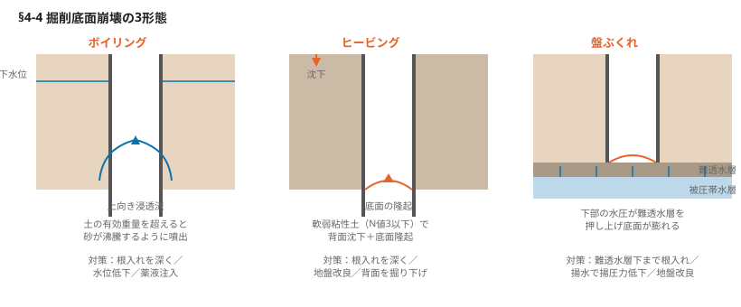
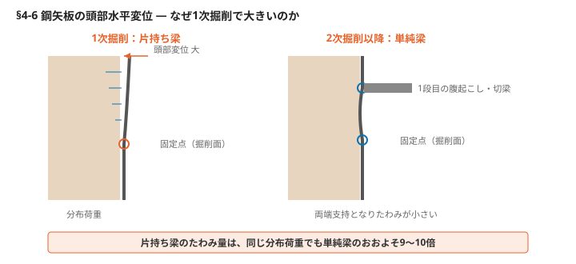

# §4 掘削（Excavation）

## この章の要旨

- 市街地での土留め壁は、詳細な現地調査を実施し、その結果を活用して立案する
- 現場の条件や掘削深さに適した土留め壁や、山留め材の組合せを選択する
- 土留め壁は地下水位の影響を受けることが多いため、変位計測の実施も計画する
- 掘削工夫により、掘削作業や手順などの作業効率を向上させる
- 河道掘削では、掘削方法や手順などのセオリーに基づき、施工計画を立案する

---

## 4-1 事前調査① 周辺環境

市街地の大規模掘削では、近隣建物・地下埋設物・交通機能の遮断・周辺の枯渇といった多様な災害リスクが発生する。土留め工法の選定、補助工法の必要性の検討、計測管理計画の策定に、詳細な事前調査が不可欠。

### 搬入経路の状況

- 土留め壁材（鋼矢板や H形鋼）は**通常長さ5m程度**。現場まで運搬できるか事前に確認する
- 低床トレーラー等を使用して杭打機などを現地に運搬する際、道路の幅員や隘路に問題がないか確認する
- 上記の仮設材や重機の重量を持つ機材にも留意する

**搬入ルートの留意点**

- 架空線が存在する場合は、その高さを調査して把握する。特に重要には架空線がある
- スクールゾーンなど、通行時間に制限がある場合の経路に留意がある
- 道路に乾燥している場合、通行車両の振動による家屋への影響を考慮する。また通常とは異なり、一日に大量の生コンクリートを打ち込む場合の保安要員の配置計画についても検討する
- 交通誘導員の配置の要否を調査することが重要である

### 土留め壁や周辺の地下埋設物

- 調査の結果、地下埋設物がある場合は事業者へ連絡し、対処方法を協議する
- その場合、埋設ルートを変更する切り回しや、ルートを変更せずに吊り防護を施すなどの対応が考えられる
- 作業による埋設物の損傷を防ぐため、注意事項や中止基準を定め、事業者と協議する

### 地中障害物となり得る建物撤去や仮設工事用の残置物

- 地中障害物が存在する場合、土留め壁の施工が大幅に低下し、工事効率が大幅に低下する。市街地における掘削作業では、過去の建築物の基礎や仮設工事の痕跡を事前に確認し、必要に応じて撤去を実施する
- 仮設工事で使用された鋼矢板が残存していた過去の事例では、その撤去作業に多大な時間を要した

### 施工箇所の上空障害の有無や離隔距離

- 施工箇所では揚重機、杭打機などを使用するため、**作業範囲内に架空線などの離隔距離を確保する必要がある**
- 架空線にかかる電圧によって必要な離隔距離が異なる

| 電圧 | 必要離隔距離 |
|---|---|
| 100〜200V | 2.0 m以上 |
| 22,000V以下 | 3.0 m以上 |
| 66,000V以下 | 4.0 m以上 |

架空線の高さを事前に確認する。必要に応じて、電線防護管の設置を事業者に依頼する。

### 掘削工事が周辺環境に与える影響

- 掘削箇所に近接する建物やインフラの位置を事前に調査し、影響を及ぼす可能性がある場合は工法を選定する
- 近接構造物の基礎形式についても調査し、特に直接基礎の場合は、掘削による変位の影響を考慮した変位計測計画を立案する

### 土留め壁の施工に伴う騒音や振動が周辺環境に与える影響

- 土留め壁を施工する際、騒音や振動に対する苦情が多いため、慎重に施工方法を選定する
- 打込み速度を落とすだけでなく、引き抜き作業も同様に、地盤条件などに応じた配慮が必要である

### 学校、病院などの公共施設や近隣での騒音・振動に関する規制条例への対応

- 自治体による指定地域等では、騒音規制法および振動規制法の対象となる建設機械を使用し、特定建設作業を行う場合は、事前に当該自治体へ作業の届出を行う必要がある
- 騒音や振動に関する規制は、レベルの上限値だけでなく、作業時間についても制限が設けられているため十分な注意が求められる

---

## 4-2 事前調査② 土留め壁の設計条件

設計図書に示された土留め壁が指定仮設であっても、可能な限り現地調査を実施し、土質定数・地層構成・地下水位などを確認する。調査結果が設計条件と異なる場合は、変更について協議を行う必要がある。得られた情報は変位計測計画の策定に活用する。

**キーワード：土質定数（C、φ、γ、N値）／粘性土で地盤に傾斜がある場合／施工ヤードの地盤支持力**

### ボーリングによる土質定数の調査

- 土留め壁の剛性を評価するために必要なボーリングによる調査を実施する
- 複数のボーリングを実施することで、地盤の厚さや傾斜がある程度把握できることが多い
- 地質が粘性土で、かつ地盤に傾斜がある場合には、事前に取得できるデータの精度に留意する必要がある
- 仮設アンカーやグランドアンカーの支持力の確認を行う必要がある

### アンカーの定着

<!-- 要確認：この節はスキャンの判読が特に困難で、原文を再現できていない。以下は文脈から補完した内容。原本で必ず照合すること -->

- 地盤に傾斜がある場合、仮設アンカーの定着体を良好な地層に確保するには**定着長の延長**が必要になることがある
- 用地境界を越える場合や、アンカー体が将来の地下埋設物の障害となる場合は、**除去式アンカー**（PC鋼線を後から引き抜けるタイプ）の採用を検討する

### 地下水の有無と流速、および被圧の状況

- 掘削作業に際しては、帯水層や地下水からの流入による揚水を行うことがある。ディープウェルなどを用いて揚水を行うことがある。地下水位の低下により、周辺地盤の地盤沈下が懸念される。ウェルポイントの設置についても検討する

### 施工ヤードの地盤支持力の確認

- 重機や杭打機を使用する施工ヤードでは、機械重量に応じた地盤支持力が必要になる。重機の転倒事故が想定されるため、簡易支持力測定器などを用いて計測する
- 地盤改良や敷鉄板など、地盤の支持力を確保する

---

## 4-3 土留め壁変位が許容値を超えた場合の措置

土留め壁の変位が許容値を超えると、工事を継続することはできない。設計時に想定した土質条件や壁背面の地下水位が、実際とは異なっていることがある。現場の状況と初期設計条件との変更を明確に把握したうえで、仮設設計の見直しを行う必要がある。

ただし、土留め壁の施工が既に完了している場合は、土留め壁の種類や根入れ長などを変更することは困難であるため、適用可能な対策には限りがある。

### 適用可能な対策

| 対策 | 内容 |
|---|---|
| **部材アップや切梁の段数増設** | 現状の腹起こしや切梁材の部材アップで確認が必要 |
| **頭つなぎ** | 土留め壁の頭部にH形鋼などによるボルト接続の埋め込みを行う（§4-6 図3、4参照）。鋼矢板の頭部から下方15〜30cmまでの範囲を連結して固定することで、断面2次モーメントを高めて断面の効率を向上させる |
| **グランドアンカーの設置** | 剛性が確保できる場合。アンカーの引張力を地中に埋め込んで固定する（1本当たり数十kN）。ただしアンカー体が残置される場合、用地境界や地下埋設物の障害となる |
| **除去式アンカー** | 定着長が長くなる場合。土留め壁背面に用地境界がある場合。周辺の地下水位が存在し、土留め壁内へ流入している場合は先行して掘削する |
| **セメント系地盤改良工法** | 土留め壁背面の変位を抑制し、底面部の地盤改良を先行して実施する |
| **薬液注入** | 地盤の透水性を低下させ、地下水の流入を抑える。ただし周辺環境（地下水質・近接構造物）への影響を慎重に評価する |
| **一時的な埋戻し** | 変位が進行して危険な場合、掘削部を一時的に埋め戻して土圧のバランスを回復させる方法が最も確実。ただし再掘削の費用が発生する |

<!-- 要確認：上記2行はスキャンの判読が不安定で、原文では別の項目だった可能性がある。特に「薬液注入」と「埋戻し」の対応関係は原本で照合のこと -->

### 留意事項

- 既に掘削作業の段階であるため、掘削土を場外に搬出しているとその後の埋戻し費用が新たに発生する。**そのため対策を立案する際は、周囲の影響を考慮したうえで、方法を比較的検討し、コストを最小限にとどめる**
- 近接した建物や構造物、地下埋設物が存在する場合、変位による影響調査を優先的に行う必要がある
- 工事再開に向け、計画の見直しを行う

---

## 4-4 掘削底面崩壊の形態と対策

掘削が進行し床付け付近に近づくと、地下水や土砂が噴出することがある。掘削底面からの崩壊によるものであり、**3つの形態が存在する**。各形態に応じた対策を迅速に決定する。

| 形態 | 発生条件 | メカニズム |
|---|---|---|
| **ボイリング** | 地下水位の高い地域（河川や海の近く） | 遮水性の高い土留め壁（鋼矢板やソイルセメント壁）を使用した場合、水位差により上向きの浸透流によって土の有効重量を超えると、掘削底面のせん断抵抗力が失われ、まるで沸騰するように土砂が噴出する |
| **ヒービング** | 掘削底面付近に軟弱な粘性土が存在する場合（N値3以下）。特に沖積粘性土地盤 | 土留め壁にかかる土の重さや、含水比の高い地表面の上載荷重によって、掘削底面の隆起、土留め壁の背面沈下が起こり、最終的には土留め壁の崩壊に至る |
| **盤ぶくれ** | 掘削底面付近に難透水層があり、その下部に高水圧の透水層（被圧帯水層）がある場合 | 難透水層は直接掘削底面に作用しないが、その下部の水圧が難透水層を押し上げ、掘削底面が膨れ上がる。最終的には破壊が生じる |

### 対策

| ボイリング | ヒービング | 盤ぶくれ |
|---|---|---|
| 土留め壁の根入れを深くして水圧に対する安定性（有効重量）を増加させる | 土留め壁の根入れを深くして背面からの土圧に対する安定性を増加させる | 土留め壁を難透水層の下部まで根入れする |
| ディープウェルやウェルポイント工法を用いて地下水位を低下させ、浸透圧の発生を抑制する | 掘削前に土留め壁外側部、掘削底面の地盤改良を行う | 地下水を汲み上げて揚圧力を低下させる |
| 薬液注入による地盤改良を行い、地盤の透水性を低下させ地盤沈下を抑制する | 土留め壁背面の地盤を掘り下げることで、背面からの土圧を軽減する | 難透水層より深い地盤の地盤改良を行い、一般的に広く用いられている対策である／遮水性のある土留め壁を使用し、被圧帯水層を遮断する |

▶ 図参照：ボイリング／ヒービング／盤ぶくれ（原本 p.88-89）

---

## 4-5 土留め壁、山留支保工の計測計画と事前の対策

変位計測は、主に土留め壁や山留支保工などの仮設構造物における変位、土圧、水圧などを対象に計測する。周辺に既設の構造物が存在する場合は、変位や傾斜なども計測する。

**キーワード：主に仮設構造物を計測／既設構造物も計測／大雨による臨時の計測**

### 計測項目と計測機器

<!-- 要確認：下表の○印の配置はスキャン（低解像度）からの読み取りで、推定を含む。実務で参照する前に原本で照合すること -->

**表 計測目的に使用する計測機器**（○が対応）

| 使用機器／計測機器 | 土留め壁 変位 | 土圧 | 水圧 | 山留支保工 変形（たわみ） | 軸力（応力） | 応力 | 部材温度 | 既設構造物 変位 | 傾斜 | 変形 | 応力 |
|---|---|---|---|---|---|---|---|---|---|---|---|
| レベル | ○ | | | | | | | ○ | | | |
| トランシット | ○ | | | | | | | ○ | | | |
| 水糸 | ○ | | | | | | | ○ | | | |
| 下げ振り | ○ | | | | | | | | | | |
| 沈下計 | ○ | | | | | | | ○ | | | |
| 傾斜計 | ○ | | | | | | | | ○ | | |
| 歪み計 | | | | ○ | ○ | | | | | ○ | ○ |
| 土圧計・水圧計 | | ○ | ○ | | | | | | | | |
| ロードセル | | | | | ○ | ○ | | | | | ○ |
| 温度計 | | | | | | | ○ | | | | |

### 計測時期と留意点

- 工事開始前に計測で得た初期値を確認し、掘削作業中は毎日、掘削作業終了後は週一回程度、土留め壁や山留支保工の計測を実施する
- 計測中や計測後に大雨が降った場合は、土留め壁背面の水位が上昇し、大きな壁体変位が発生する可能性が高いため、再度臨時の計測を行う必要がある
- 地震が発生した際は、その後速やかに計測を行う
- 土留め壁からの湧水によってディープウェルやポンプを用いて集水し、ポンプ排水を行っている場合は、近隣の井戸の水位が低下することがある。このため、地下水位の計測は1カ所に限定せず、広範囲にわたる複数カ所で行うことが望ましい
- 気温の上昇により切梁が膨張すると、土留め壁にかかる応力が増加するため、**切梁材の表面温度と軸力の関係を早期に把握する必要がある**
- 鋼矢板の頭部は、切梁を架設するまでの間に大きな変位が生じることがあるため、変位抑制対策を講じることが重要である（頭つなぎなど）

▶ 図参照：計測機器の設置例（原本 p.90-91）

---

## 4-6 鋼矢板の頭部水平変位の対策例

鋼矢板の変位は**1次掘削時に起こる**ことが多い。矢板頭部の水平変位に関連して起こることが多い。変位の拡大を防ぐためにも、対策を講じる必要がある。

### 頭部変位が大きくなる理由

- 1次掘削における鋼矢板の変位は、**片持ち梁**における分布荷重の影響を受ける（図1）
- 一方、2次掘削以降は1段目の腹起こしと掘削面を固定点として単純梁モデルとして扱われる（図2）
- 同程度の分布荷重がかかる場合でも、**片持ち梁として支持された鋼矢板のたわみ量は、単純梁と比較しておおよそ9〜10倍に達する**
- このため、掘削初期における頭部の水平変位は特に大きくなる傾向がある

- 水平変位が管理基準値を超過した場合には、速やかに適切な対策を講じる必要がある

### 対策例

- 土留め壁の平面上中央部分は1次掘削時に変位が顕著になるため、鋼矢板の上部をブルマンボルト等でH形鋼を接合して一体化させる（図3、4）
- C形鋼を矢板に溶接して接合する頭つなぎを施す。変位を抑制する
- 他に余裕がある場合は、図5に示したように、控え杭およびタイロッド方式を採用することが可能である。一方、工事コストが増加するため、この方法は効果が大きくなる傾向がある

▶ 図参照：H形鋼による頭つなぎ／C形鋼による頭つなぎ／控え杭による頭部変位抑制（原本 p.92-93）

---

## 4-7 建設目的物完成後の埋戻し、土留め壁の撤去

建設目的物の完成後も、埋戻しや土留め壁の撤去段階で予期しない問題は起こり得る。**最終段階であっても注意深く施工を行う必要がある。**

### 埋戻し

- 構造物の埋戻し時に締固めが不十分であると、供用後の沈下リスクが高くなる。例えば、擁壁の背面を埋め戻す際に転圧が行われると、道路を走行する際に**橋梁手前で段差が生じ、通行時に支障をきたす**
- 狭い箇所や締固めが困難な箇所があるため、人力による作業が必要となる。図1に示すような人力で締固めを行う箇所が存在する
- また、鋼矢板の凹凸部では、転圧機械の十分な使用ができない
- 鋼矢板の引抜き後、このような状況における上方制限下での締固め方法について、どのように対処すべきかが課題となる（図2）

### 土留め壁の引抜き跡

- 土留め壁の引抜きに伴って発生する空隙への対策としては、砂を用いてバイブロハンマなどを用いて周囲地盤の締固めを実施する
- **鋼矢板を引き抜くと、断面積分の空隙が発生する。また粘性の高い土壌では、鋼矢板やH形鋼を引き抜く際に付着した土砂も一緒に引き上げられることが多い（図3）**
- この空隙に相当する体積分の空隙が地中に生じるので注意する

▶ 図参照：鋼矢板の凹部分／火打ち材の直下／鋼矢板引抜き時の付着土砂（原本 p.94-95）

---

## 4-8 河道掘削のセオリー

河川に堆積物が増加すると大雨時に水位が上昇し、洪水リスクが高まるため、水位を低下させることを目的として河道掘削が行われる。**河道掘削は水中での掘削作業**である。このために、水中以外の川岸や砂州を含めた範囲の土砂を取り除く工事である。

### 作業手順と掘削方法

河道掘削は、施工によって下流の流下能力に著しく不均衡となることを避けるため、下流側から掘削を行うことが原則となる。掘削効果を迅速に発揮させる**①筋掘り、水中の掘削土量を抑える②スライス掘削、③壺掘り**の3つの方法がある。

| 方法 | 内容 | 適用 |
|---|---|---|
| **① 筋掘り** | 澪筋（みおすじ：河川内で水が流れている部分）に接近して掘削し、水中の掘削土量を抑える | 治水効果を早期に発現させる。ただし水中に再堆積しやすく、工事を再度有効とする際は再施工の必要性を検討する |
| **② スライス掘削** | 地山の頂部から扇状に段階的に掘削を行う手法 | 繰り返し掘削することが望ましい。施工時期に掘削可能となるよう配慮された手順である。数年度にわたる工事において特に有効 |
| **③ 壺掘り** | 水際の地山を最終部分に残置して掘削することで、施工中の湧水流出を抑制し、有効な施工手順である | 単年度で実施されることが多い地方自治体工事で広く採用されている |

### 留意事項

- 掘削した土砂は乾燥させ、場内に仮置きして、必要に応じて場外に搬出される。この際、必要に応じて湧水の流出を防ぐため、底面脱水・強制脱水・トレンチの設置などの対策を講じる
- 支障となる立木は伐採し、根系を極力残さないなど、生態系に配慮する
- 河床の掘削を実施する場合は、多様な自然環境を保護する観点から、**現況の澪筋（浅い凹凸）を平行移動（スライドダウン）させ、元の河床に近い形状を再現する**
- **縦断勾配** — 平均河床高に基づく平行移動を基本とする。現況の縦断勾配を確認し、必要に応じて施工箇所の上流部および下流部の河床勾配や標高を基準とし、適切な縦断勾配を確保する

▶ 図参照：筋掘り／スライス掘削／壺掘り（原本 p.96-97）

---

## 4-9 切梁の盛替え

土留め壁や山留め材の切梁材が躯体構築作業に支障を来す場合、盛替え梁を新たに設置した後に既設の切梁を撤去する方法が有効。

### 盛替え梁の設置

- 土留め壁や山留め壁と土留め材の設置が終わり、コンクリート壁などの躯体を構築する段階で、切梁が障害となるケースがある
- 図1に示すように盛替え梁を設置することが有効である
- 通常、盛替え梁は埋め戻し土に残置されることが多く、丸太などの木材を使用することが多い。ただし、土中に残置された木材は腐食しやすく、経年による地盤沈下の原因になるため、**盛替え木材には防腐剤を注入するなどの対策を講じる必要がある**

▶ 図参照：切梁の盛替え（原本 p.98）

---

**＜原本の参考資料＞** 日本道路協会「道路土工 仮設構造物工指針」1999年／土木学会「仮設構造物の計画と施工」2010年
