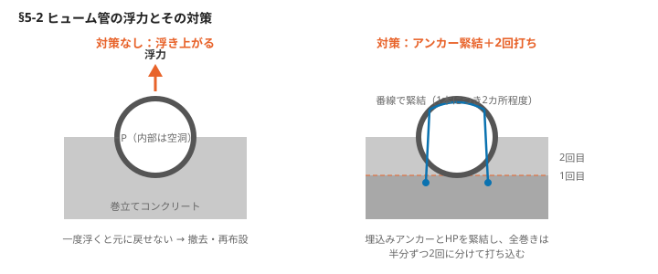

# §5 管（Pipes）

## この章の要旨

- ライフラインを支える上下水道は、道路下の埋設管で構築されている
- 近年、長期化する管の漏水等によって、突発的な道路陥没事故が相次いでいる
- 各工法の施工手順や管理方法を守って、高品質で高寿命な構造物の促進が求められる

---

## 5-1 推進工法の種類と特徴

推進工法は先頭を掘進機が掘り進め、円筒状の推進管（コンクリート管・鋼管・ダクタイル管）を後続で油圧ジャッキで押していく工法。開削できない場所で採用され、地盤条件・補助工法の有無・作業ヤードの確保・騒音や振動対策などを含めて経済性を総合的に判断して選定する。

**キーワード：大中口径管 800〜3,000mm／小口径管 700mm以下／鋼製管・改築推進**

### 分類の全体像

```
推進工法
├─ 大中口径管推進工法（口径 800〜3,000mm）
│   ├─ 開放型 ── 刃口推進工法
│   └─ 密閉型 ── 泥水式推進工法／土圧式推進工法／泥濃式推進工法
├─ 小口径管推進工法（口径 700mm以下）
│   ├─ 高耐荷力方式 ── 圧入式／オーガー式／泥水式／泥土圧式
│   └─ 低耐荷力方式 ── 圧入式／オーガー式／泥土圧式
├─ 鋼製管推進工法
└─ 改築推進工法（取付管推進工法を含む）
```

<!-- 要確認：以下に挙げる各工法の固有名詞（商品名・工法名）は、スキャンからの読み取りで誤字の可能性が高い。工法選定の資料として使う前に必ず原本で照合すること -->

### 大中口径管推進工法

切羽が開放状態になっているかどうかで**開放型と密閉型**に分かれる。

**1）開放型 — 刃口推進工法**
- 推進管の先端に刃口を装着し、開放された切羽を人力で重機で掘削。トロバケット等で掘削した土砂を搬出する
- 刃口が開放されているので、切羽地山の自立が必要条件。自立が困難な場合は、薬液注入工法などの補助工法が必要

**2-1）密閉型 — 泥水式推進工法**
- 掘進機のカッターチャンバー内に泥水を送り、切羽の安定を保ちながら掘削・推進する
- 掘削した土砂は泥水と共に坑外の泥水処理設備に流体輸送し、泥水を再分離して土砂を搬出する
- 主な工法：アルティミット工法／アンカロモール工法／コスミック工法／ハイブリッドモール工法／ユニコーン工法／ミクロ工法

**2-2）密閉型 — 土圧式推進工法**
- 掘削した土砂をスクリューコンベアで排土量を調整しながら、切羽の圧力で土砂の安定を保つ
- 主な工法：ヘルトコンベア／泥土圧ボンプ／アルティミット工法／コスミック工法／CMT工法

**2-3）密閉型 — 泥濃式推進工法**
- カッターチャンバー内の掘削土砂に高濃度泥水を注入し、流動化させて切羽の安定を保ちながら掘削・推進する
- 掘削した土砂は、排土バルブの開閉により間欠的に排出する。吸引により可能な大きな礫まで排出できる
- 主な工法：エスエスモール工法／コマンド工法／サタケモール工法／ラムサス工法／超泥バランスシールド工法／ヒューム管推進工法／ベルスモール工法

### 小口径管推進工法

口径700mm以下。**推進管や誘導管を先導体により作業を行う。**

**1）高耐荷力方式** — 管に対して直接推進力を加えて施工する
- 圧入式：アイアンモール工法
- オーガー式：アイアンモール工法／ホリンツガー工法
- 泥水式：アンカロモール工法／コブラス工法／ジャット工法／ミクロ工法／ユニコーン工法
- 泥土圧式：アイアンモール工法／エースモール工法／ドルフィン工法／ブレストシールド工法

**2）低耐荷力方式** — 推進管には周囲の土に対する抵抗力のみを負担させ、推進のために推進力伝達ロッドを用いる
- 圧入式：DRM工法／スピーダ工法
- オーガー式：アイアンモール工法／エンピライナー工法
- 泥水式：アンカロモール工法／ベルス工法／ユニコーン DH-ES工法
- 泥土圧式：アイアンモール工法／エンピライナー工法

### 鋼製管推進工法

鋼製のさや管を作成し進める工法。遠隔操作により掘進する。
主な工法：ヘビーモール工法／ロックマン工法／インパクト工法／ハードロック工法／グランエース工法／SH工法／DRM工法

### 改築推進工法

既設の管渠を壊しつつ、新たな管渠を埋設する。
主な工法：エースモール工法／リバース工法／ベルスライス工法／CMT改築推進工法

---

## 5-2 ヒューム管・塩ビ管の浮力対策

**HP（ヒューム管）の布設後にコンクリートを打ち込むと浮力が働き、HPが浮き上がってしまう** — 土木技術者の多くが経験しているはずの失敗。一度浮き上がったHPは元の位置に戻せないため、撤去して再度布設することになる。

**キーワード：浮力の発生／番線で緊結／全巻きコンクリート2回に分けて**

### 浮き上がり防止策

- HPの内部は空洞なので、布設後に周囲にコンクリートを打ち込むと**浮力が発生する**
- そのため、事前に打ち込んだコンクリートにアンカー（鉄筋や番線）を埋め込み、HP布設後にそのアンカーとHPを番線で緊結し、浮力を抑制する
- **1本につき2カ所程度の緊結を行う。全巻き（360度の巻き立て）は浮力が大きくなるため、先に予定の半分程度を打ち込み、コンクリートの硬化前に二度目に打ち込むことで、浮き上がりを防ぐことができる**

### 凝結と硬化のタイミング（→§1-3参照）

| | 貫入抵抗値 | 練混ぜ後の時間 |
|---|---|---|
| 始発 | 3.5 N/mm² | 約2〜4時間 |
| 終結 | 28 N/mm² | 約4〜6時間 |



▶ 図参照：コンクリート打込み時の浮力／HP巻立てコンクリート時の浮力防止（原本 p.102-103）

---

## 5-3 開削・管布設・サービス管・人孔築造工事

HP（ヒューム管）の布設やサービス管の取付けにおける不具合は、地下水等が管内に流入し、道路の陥没などの深刻な事故を引き起こす。近年こうした事故が多発しており、施工不良が原因となっている。

**キーワード：不等沈下防止の梯子胴木／人孔周囲締固め／土留め壁引抜き後の締固め、埋戻し**

### HP布設

<!-- 要確認：この節の冒頭部はスキャンの判読が不安定で、原文の論旨を再現できていない。梯子胴木基礎の適用条件は原本で確認のこと -->

- 軟弱地盤では、HP布設後の沈下が問題になる。**土かぶり厚が薄い場合や地盤が軟弱な場合には、不等沈下を防止するために梯子胴木などによる基礎を施工する**（写真1）
- 陥没事故などによる各種基礎を行った際に、施工前後の沈下や道路面の凹凸が生じることがある
- **土留め壁引き抜き後に人孔の接続部などで同周囲の埋め戻しが不十分であるおそれがあるため、締固めを行う（図1）**
- HPが沈下する場合、HP沈下により壁にひび割れが生じる。漏水の原因となる可能性がある

### 接続管（サービス管）

- 接続管は、一般的に接着剤を用いて本管と一体化されるが、埋め戻し作業やその後の圧密沈下により接合部が開くことにより、漏水の原因となる場合がある
- コンクリートで巻き立てて一体化させることが望ましいが、それが困難な場合でも番線で締め付けた後に周囲を丁寧に締め固める（図2）

▶ 図参照：梯子胴木基礎／人孔周りのHP接合部／接続管の取付け（原本 p.104-105）

---

## 5-4 推進工事の留意点

推進工事は専門工事業者に任せがちだが、道路の陥没などを引き起こさないためにも、**推進工事に関する知識を習得し、現場対応力を高めることが重要**である。

**キーワード：発進立坑の土質／掘進土量と排土量の管理／地盤の変状を測定**

### 推進前の確認

- 土質に適した掘進機であるかを確認する。特に先端のカッタービット形状は重要
- **発進立坑の土質と、推進する深さの土質が一致しているかを確認する**（ボーリング柱状図の土質と照合）。急曲線の場合は推進に適した掘進機であるか確認する
- 長距離推進の場合は曲がりや止水性の耐摩耗性についてチェックする
- **推進工事の中で最も危険な作業は、深く狭い立坑内での作業である。**作業手順を事前に詳細まで確認し、地山の自立や止水性を確認しながら段階的に進める。一気に全面を開削してはならない（→§11-5参照）

<!-- 要確認：上記は原文の趣旨をこう読んだが、スキャンの判読が不安定。原本で照合のこと -->

### 掘進中の確認

- 計画通りの推進力か確認する。元押し推進力が計画値を上回ると、推進管にひび割れが発生する。周面摩擦力が計画値を上回る場合は、二次注入を行い元押し推進力を低減させる
- 線形が設計通りであることを確認する。平面線形および高低線形について、滑らかな曲線であること
- **切羽圧を計画通りに管理する。自然水圧＋20kPaが標準である（自然水圧＋高さ2mの水圧）**
- **掘進土量と排土量が計画通りであることを、日々管理する。土砂の過剰な取り込みは、地盤沈下につながる**
- 推進工事で泥濃式推進では、残土量または産業廃棄物が発生する可能性があるため、十分に注意を要する。泥水式推進では泥漿添加の濃度を管理する
- 周辺地盤の変状を測定・管理する。推進路線上の**測点（一般的には20m間隔程度）**についてチェックする
- 施工後の推進路線の沈下や地盤変状の有無を確認する。**要注意箇所にグラウトホールを開けて、逆止弁を設けた箇所に注入する**

▶ 図参照：発進立坑での土質確認／掘進土量と排土量の比較（掘進土量＝排土量／原本 p.106-107）

---

**＜原本の参考資料＞** 経済調査会「推進工事用機械器具等基礎価格表」2025年度版
