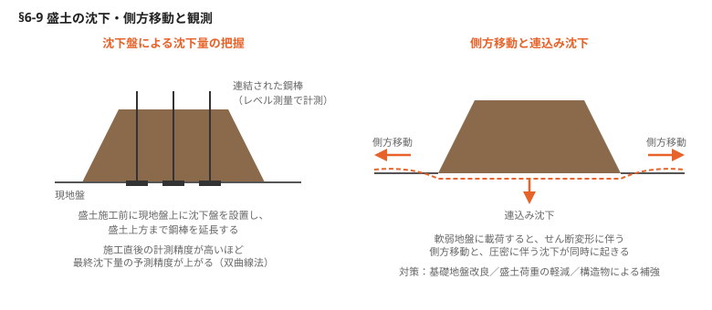

# §6 のり面・切土・盛土（Slope）

## この章の要旨

- のり面工事は排水工事や植生等による表面保護を早期に行い、のり面の浸食を防ぐ
- 崩落やすべりの兆候があれば抑止工、ロックボルト工等を適用する
- のり面工の各種構造物の特性を理解し、手戻りのない現場運営を行う
- 大型土のう積み工は勘に頼った施工ではなく、標準図に基づいた積み方を行う
- 盛土工事は土質と締固め管理がポイント。沈下予測精度を高め、最終沈下量を予測する

---

## 6-1 のり面保護工の種類

我が国は国土の約70%が山地で、地震が多発する。のり面の安定を図ることが重要な課題である。しかし、のり面工事は土砂崩れ等のリスクが伴い、施工中また施工後ののり面が崩落する可能性もある。周辺地域には住宅地に影響を及ぼす可能性もある。**施工中は、のり面の変状を注意深く観察し、崩壊の前兆を見逃さないよう、現場での判断が求められる。**

**表 のり面保護工の種類**

| 種類 | 工法 |
|---|---|
| **植生工** | 種子散布工、厚層基材吹付工、植生マット工、客土吹付工 |
| **構造物工** | 吹付枠工（フリーフレーム）、モルタル・コンクリート吹付工、ロックボルト工、グランドアンカー工、抑止杭工、ブロック積工、擁壁工 |
| **排水工** | 地表排水工、地下排水工 |

### 植生工

- 植生工は、のり面の土をしっかりと結びつけることで土砂崩れなどを防ぐ役割もある
- 植物の根の作用によりのり面の表面部を保護し、安定を図ることができる
- そのメリットは、周囲の自然環境の保全、温暖化対策に寄与する点があるほか、のり面の緑化を図ることである
- 苗木を植える場合は「水やり」などの手間が必要になる。それを行わないと枯れてしまう可能性がある。さらに、苗木が成長すると道路の境界を妨げることがある。**強風による倒木の危険性もあるため、使用が制限されることがある**

### 構造物工

- 構造物工は、ブロック積擁壁や布団かご等を用いてのり面の安定を図る方法として設計・施工される
- 構造物の重量を利用してのり面の安定を図る方法として、切土のり面や自然斜面に適用し、切土量土の適用可能な布製型枠工、のり面用にはコンクリート枠工がある
- のり面の表面を保護する目的として、モルタルやコンクリートの吹付工、地中深部の滑り防止にはロックボルト工、グランドアンカー工、抑止杭工などがある
<!-- 要確認：補強土壁に関する以下の記述は、スキャンの判読が困難で原文を再現できていない。一般的な技術内容で補完したもの。原本で必ず照合すること -->

- 用地に制約があり、かつ擁壁を構築する場合には**補強土壁**を適用する方法がある。コンクリート擁壁と比較して背面の必要断面が小さく、施工スピードが速いという利点がある
- ただし、**アンカープレートやストリップ材と盛土材との摩擦力によって安定を保つ構造**であるため、盛土材の選定と入念な締固めが不可欠となる

### 排水工

- 排水工は、のり面工において、のり面の表層部における風化、浸食、崩壊を防ぐ。安定を図る上で重要である
- 表流水を流すのり面に浸食による溝を防ぐ
- 地表を流れる水による浸食を防ぐことに加え、地表水や地中に雨水等の浸透を防ぐことによる侵食を防ぐことも重要である
- 地表の排水が、地中の排水も重要である。特に長大なのり面の施工中は、地下水位の測定を行い、その動向を把握して、滑り層への影響を把握する
- 地中への浸透水が増加し、滑り抵抗力が低下することにより崩壊を招くことがある
- 表流水による地中への浸透水の遮断や、水平ボーリングを用いて地下水位の低下を促進する方法を併用することで、対策効果は大きくなる

---

## 6-2 のり面保護工① 植生工

切土や盛土ののり面を放置しておくと、いわゆる裸地で放置しておくと、浸食や崩壊の可能性が高くなるため、のり面防護工などの用途に応じて多様な工法が存在する。それぞれの工法の特性を理解し、地形・地質・上下の環境、さらには気候条件を考慮して工法を選択する。

| 工法 | 内容 | 適用の目安 |
|---|---|---|
| **種子散布工** | 土砂質の切土や盛土の表面に種子を吹き付ける。短時間で広範囲の施工が可能。経済的 | 吹付けに使用する主な材料は、種子、水、高度化成肥料、木質繊維（ファイバー）。緑色の着色材を用いるのが一般的。既に施工した箇所が判別できるようになる。冬季は活着が悪く、融雪に伴う流出のおそれがある |
| **厚層基材吹付工（植生基材吹付工）** | のり面の表面を全面清掃した後、ラス金網を全面に張り、その上に3〜10cm程度の植生基材を吹き付ける | 硬い岩質で種子を吹き付けても活着しない場合に適用。土質区分によって厚さが異なる：**軟岩4〜6cm、強風化岩3〜5cm、硬岩は7cm程度**。接着剤を利用してのり面表面を確保する必要が厳しい |
| **植生マット工** | 肥料袋や基材を、土壌改良材や種子等の生育基盤が充填された植生マットをのり面上に施工する | 年間を通じて施工が可能。施工直後から安定して自然災害時の崩落リスクが高まる。地区と比較して安価。構造物工などののり面の用途にコストが高くなる場合もある |
| **客土吹付工** | 肥料および種子を、比較的硬いい状態の吹付けで活着できても客土は少なく、融雪の際は難しい | 客土厚は1〜3cm程度。補助的な材料として表面にラス金網、またはネットを設置し、ノズルの先端で圧送、または種子散布よりも高い発芽率が期待できる |

▶ 図参照：植生マット（原本 p.112-113）

---

## 6-3 のり面保護工② 枠工

のり面工は、のり面の状況に応じてプレキャストや現場打ちコンクリート枠工などを設置することにより、のり面の崩壊や浸食を防ぐ。この工法はのり面工事の多くに適用され、植生工やグランドアンカー、ロックボルト等の抑止工構造物との組合せでも利用されている。

| 工法 | 内容 | 特徴 |
|---|---|---|
| **吹付のり枠工（フリーフレーム）** | 切土のり面や自然斜面に連続斜面上に連続したコンクリート枠を設置する工法。コンクリート枠の重さによってのり面の安定を図る | 必要に応じて植生工などを組み合わせ、自然環境との調和が図れる。急傾斜のあるのり面に対して有効となる。深い凹み面にはグランドアンカー工を併用する。地中の滑り面に対するのり面表層の安定性を向上させる目的でも適用される |
| **のり枠ブロック工** | 盛土ののり面の保護工として、プレキャストコンクリート製のブロックが主に使用されるが、プラスチック製のものも軽量である利点を活かして適用されている | 約1×1mの枠目が連続して構成されており、枠目の4辺を個別のプレキャスト部材で組み立てるプレキャスト枠と、4辺の部材があらかじめ一体化されたブロック枠の2種類がある。降雨対策として、枠内に種子散布し緑化を行うことが一般的である |
| **布製型枠工** | 切土と盛土の両方に適用可能。施工に使用する枠の型枠を工場で製作し、のり面の合成繊維布を使用している | 高強度かつ透水性を有するため、軽量で取り扱いやすく、曲面でも扱いやすい。型枠は透水性を持ち、コンクリート（あるいはモルタル）を打ち込んだ後、余分な水分を排出することで、高強度かつ高密度のコンクリート体を形成する。のり面上部で布製型枠を吊り下げ、地中に単管パイプを打ち込む等の支持杭を必要とする |

▶ 図参照：吹付のり枠工（施工後／数年後）／布製型枠工（原本 p.114-115）

---

## 6-4 のり面保護工③ 吹付工・ロックボルト工、他

モルタルやコンクリートの吹付工は、のり面に浸透する雨水を遮断し、のり面の崩壊や風化を防止することを目的とする。また、小規模な浮石や落石の防止にも役立つ。吹付工だけでは、水抜きなど多様な用途に適用できない場合には、ロックボルト、グランドアンカー、抑止杭を併用した工法を用いる。

| 工法 | 内容 | 留意点 |
|---|---|---|
| **モルタル・コンクリート吹付工** | のり面にラス金網を全面に設置し、その上にモルタルやコンクリートを吹き付ける | 吹付けの厚さは **8〜10cm**。コンクリート吹付工では **10〜20cmの厚さ**で適用される。のり面の保護や小規模な浮石・落石の防止に役立つ。岩盤の風化にも多様な効果を得る。表面にモルタルやコンクリートの浸透を防ぐことで、目視による変状の観察が容易になる |
| **ロックボルト工** | 比較的浅い部分に滑り面が位置するのり面に、鉄筋等の短い棒状鋼材を多数挿入する工法 | 補強材の長さはグランドアンカーより短いため、崩壊規模の小さい斜面の滑落防止に用いる。ロックボルトの挿入によって、斜面の岩塊にはセメントグラウトを充填して一体化し、補強材との面全体を一体化し、補強効果がさらに高まる |
| **グランドアンカー工** | のり面表層部からPC鋼線を挿入。グラウトを注入して所定の張力を加えることで、地中の岩盤と地表の構造物を強固に連結する | 削孔径は **115〜135mm程度**。PC鋼線の長さは、想定される地中の滑り面よりも深い位置（定着部）に決定される。定着率（設計上の張力に対する実際の張力）は **100%とはせず、通常は設計上の張力に対する残存する実際の張力が30%程度**。表面の支圧板は、吹付けのり枠工を採用することが一般的だが、のり面が最も不安定な状態にさらされるおそれがある |
| **抑止杭工** | のり面の下端部付近で一定の間隔で鋼管等を打設して滑り杭を形成して施工する方法 | 杭の間隔は **一般的には2〜4m程度**が崩壊を防ぐ。滑り面より深い位置に打設して抵抗させる。地盤が軟弱な地盤や、多数の亀裂によって移動層が細かく分断されているような地盤には適用できない |

▶ 図参照：ロックボルトによる保護工／グランドアンカーによる保護工／抑止杭による保護工（原本 p.116-117）

---

## 6-5 切土のり面施工時の排水計画

切土のり面の施工を急ぐあまり、排水工事が後回しになり、未施工の状態で激しい降雨に見舞われると、のり面が崩壊しやすくなる。**そのため、のり面工事は常に排水工事と表面防護工（植生など）を次順に施工する。**

### 表面排水

- 1面ごとの切土工事を完成させ、直ちに小段排水や縦排水等の表面排水を施工する（図1）
- のり面の排水工事が後回しになると、コンクリート二次製品の運搬は場重量となり、工事コストは上昇する
- 施工の途中や下方の未施工箇所にも仮排水施設を設け、放流水による浸食を受ける箇所を発生させることもあり得る
- 設計に排水計画にない場合はのり面の浸食やのり肩部からの流入対策として仮排水施設を設ける
- 仮排水の計画にあたっては、地形を考慮して、十分な容量ものり面排水施設を設ける
- 切土作業中、雨水の浸透を防ぐ
- のり面の計画時、翌日の降雨が予測される場合は、作業終了時にブルーシート等で覆うなど浸食対策を最小限に留める
- のり面の土砂からの雨水がのり面に流入しないよう、のり肩部の土のうやラウンディング等による対策を講じる（図2）
- 切土施工中の雨水は土砂を含み流出するため、直接放流は既存の排水施設の目詰まりや等の原因となり機能を低下させる。**このため一時的に仮設沈砂池等に集水し、上澄み水を排出する**

### 地中排水

- のり面の変位は地下水位が深く関与している。そのため、降雨時に地中に浸透した水位を早期に低下させることが変位抑止に効果的である
- その際は水平水抜き管による地中排水を実施すると良い
- のり面に対して水平ボーリングを行い、保孔管（SGP管またはVP管 **φ75mm程度**）を挿入する（図4）

▶ 図参照：切土のり面排水／のり面の降雨対策／のり肩部の雨水流入対策／水平水抜き孔（原本 p.118-119）

---

## 6-6 耐候性大型土のう積層工法

耐候性大型土のうを使用した積層工法は、迅速な施工と撤去が可能であり、道路や河川工事の仮設工事や災害復旧工事で広く利用されている。一方、土のうの一部が崩れかねるという事故も発生している。**土のう積みは仮設工事であっても "感覚" に依存した施工ではなく、標準図に基づいた施工が必要である。**

**キーワード：仮締め切り天端幅3m以上／積層勾配 1：0.5／中詰め材は砂質土・礫質土**

### 仮締め切りと耐候性大型土のうを積層する際の留意点

- 河川などの仮締め切り天端の積み幅は3mとし、天端の高さは**3m以上**とし、遮水シートを敷設した際は土のう材との間に挟み込み、勾配は **1：0.5より緩い勾配**とする（図1、2）
- 大型土のうの積層勾配は **1：0.5**を基本とする
- 大型土のうの中詰め材は**砂質土または礫質土**が使用されるが、その配列に同じである
- 耐候性土のうを用いた仮締切工に対する安全性が異なる。**ただし、滑動および転倒に対する安全率が異なる**

### 耐候性大型土のう積層工法標準断面図

**中詰め材（砂質土）**

| 盛土高 | 安全率 Fs（滑動） | 安全率 Fs（転倒） | 偏心距離 e | 地盤反力 |
|---|---|---|---|---|
| H = 3.0 m | 2.85 > 1.20 | 1.51 > 1.20 | −0.42 < 0.333 | 46 kN/m² |
| H = 4.0 m | 1.89 > 1.20 | 1.21 > 1.20 | −0.45 < 0.333 | 62 kN/m² |
| H = 5.0 m | 1.43 > 1.20 | 2.00 > 1.20 | −0.84 < 0.667 | 77 kN/m² |
| H = 6.0 m | **1.14 < 1.20 ✗** | 1.72 > 1.20 | −0.93 < 0.667 | 92 kN/m² |

**中詰め材（礫質土）**

| 盛土高 | 安全率 Fs（滑動） | 安全率 Fs（転倒） | 偏心距離 e | 地盤反力 |
|---|---|---|---|---|
| H = 3.0 m | 3.10 > 1.20 | 1.71 > 1.20 | −0.46 < 0.333 | 52 kN/m² |
| H = 4.0 m | 2.06 > 1.20 | 1.37 > 1.20 | −0.51 < 0.333 | 70 kN/m² |
| H = 5.0 m | 1.55 > 1.20 | 2.27 > 1.20 | −0.89 < 0.667 | 87 kN/m² |
| H = 6.0 m | 1.24 > 1.20 | 1.95 > 1.20 | −0.99 < 0.667 | 104 kN/m² |

**表3 中詰め材（砂質土）・上載荷重あり**

| 盛土高 | 安全率 Fs（滑動） | 安全率 Fs（転倒） | 偏心距離 e | 地盤反力 |
|---|---|---|---|---|
| H = 4.0 m（壁高2.0m ＋ 上載2.0m） | 5.70 > 1.20 | 1.79 > 1.20 | −0.32 < 0.333 | 31 kN/m² |
| H = 5.0 m（壁高3.0m ＋ 上載2.0m） | 2.85 > 1.20 | 1.57 > 1.20 | −0.44 < 0.667 | 46 kN/m² |
| H = 6.0 m（壁高4.0m ＋ 上載2.0m） | 1.89 > 1.20 | 1.39 > 1.20 | −0.53 < 0.667 | 62 kN/m² |
| H = 6.0 m（壁高5.0m ＋ 上載1.0m） | 1.42 > 1.20 | 1.49 > 1.20 | −0.70 < 0.667 | 77 kN/m² |

**表4 中詰め材（礫質土）・上載荷重あり**

| 盛土高 | 安全率 Fs（滑動） | 安全率 Fs（転倒） | 偏心距離 e | 地盤反力 |
|---|---|---|---|---|
| H = 4.0 m（壁高2.0m ＋ 上載2.0m） | 6.20 > 1.20 | 2.02 > 1.20 | −0.34 < 0.333 | 35 kN/m² |
| H = 5.0 m（壁高3.0m ＋ 上載2.0m） | 3.10 > 1.20 | 1.77 > 1.20 | −0.48 < 0.667 | 52 kN/m² |
| H = 6.0 m（壁高4.0m ＋ 上載2.0m） | 2.06 > 1.20 | 1.57 > 1.20 | −0.58 < 0.667 | 70 kN/m² |
| H = 6.0 m（壁高5.0m ＋ 上載1.0m） | 1.54 > 1.20 | 1.69 > 1.20 | −0.76 < 0.667 | 87 kN/m² |

<!-- 要確認：表1〜4とも、「滑動」と「転倒」のどちらの行かはスキャンからの推定を含む（原本では内的安定性=圧縮耐力、外的安定性=滑動・転倒・支持力の入れ子構造）。安全率の数値そのものは読み取れているが、行のラベル対応は原本で照合すること -->

**H = 6.0 m の砂質土（上載なし）で滑動の安全率が 1.20 を下回る**点に注意。盛土高が高い場合は中詰め材の選択が効いてくる。

▶ 図参照：大型土のうを用いた仮締切工／土堤による仮締切工（原本 p.120-123）

---

## 6-7 盛土管理（品質規定方式・工法規定方式）と試験施工

盛土管理には**品質規定方式と工法規定方式**の2種類がある。

### 品質規定方式

- 発注者の定める品質を仕様書に明示し、締固めの方法については受注者に委ねることを定めている
- 管理方法は以下の3種類による管理方法がある
  - **最大乾燥密度による管理**（砂置換法、RI計器による方法）
  - **空気間隙率、飽和度による管理**（現場密度法、RI計器による方法）
  - **強度特性、変形特性による管理**（平板載荷試験、CBR試験、コーン貫入試験）

### 工法規定方式

- 締固め機械の種類、敷き均し厚さ、締固めの回数などを現場で試験施工を通じて確認し、その妥当性を検証する。工法そのものを仕様書に規定する方式である
- 試験施工は、締固めた締固め機械の種類、敷き均し厚さを検証しながら管理する。工法での効果を確認する
- 発注者が指定した工法に基づいて品質が確保できるかを確認する
- 試験施工で確認すべき項目は、敷き均し厚さ、ローラーの種類および走行回数など
- タスクメーターを用いて転圧機械の稼働時間を記録し、締固めが実施されたことを確認する
- 近年では、締固めに使用するローラーの走行軌跡をGNSS（全地球測位システム）などの技術を用いてデータ化し、可視化して管理する手法も導入されている

---

## 6-8 高盛土施工時の留意点

盛土工事では、使用する土質の管理が極めて重要である。また、締固め作業は端部までしっかりと転圧する必要があり、品質と施工の両面の管理が求められる。

**キーワード：排水勾配とのり面側マウンド／早期の表面保護／余盛部にも転圧**

### 施工上の留意点

- 施工前に盛土材のばらつき、局所的な地盤強度の違い、および土質に含まれる化学物質の影響を確認する
- 特に盛土基礎の地盤強度は、施工後の沈下や不同沈下のリスクを回避するため、プレロード地盤改良工法を検討する
- 土砂の運搬時における交通渋滞や事故のリスクを回避するため、影響を最小限となる制限を確認し、運搬ルートとなる工法で使用機械を選定する
- 盛土工事に伴う振動や騒音の影響を調査し、必要に応じて防振対策を講じる
- 盛土に必要な施工範囲ののり面工に位置する高盛土線などの高さや制限を最小限に、セメント系改良材からの溶出クロム等への対策を調整する

### 施工時の留意点と工夫

- 翌日の降雨が予想される場合は、当日の作業終了までに排水勾配を設け、のり面側にマウンドを施工して盛土のり面への降水の流出を防ぐ（図1）
- 雨水が浸透しないように、一時的に水の流出を防ぐ。上流水のみを放流する
- 仕上がりのり面保護を実施する。早期の表面保護を実施する
- **盛土端部までの転圧を行い、余盛部にも転圧を行う。転圧完了後にバックホウで余盛部をカットする（図2）**

▶ 図参照：盛土上段の降雨対策／転圧完了後余盛部をカット（原本 p.126-127）

---

## 6-9 盛土の動態観測

盛土の動態観測とは、盛土による沈下量を測定することを指す。また、側方地盤の流動化の変位が懸念される場所では、沈下盤に加えて変位杭などを設置し、側方地盤の変形量を観測する。

**キーワード：沈下盤計測／最終沈下量予測／側方移動と連込み沈下**

### 盛土の沈下管理

- 盛土内に設置された沈下盤の計測結果を基に、双曲線法などを用いて沈下の予測を行う
- **双曲線法**は、地盤沈下を予測するための計算手法の一つ。この手法は、経験に基づいた仮定から導かれたものではなく、双曲線法を用いている。目標とする沈下量に達するために必要な地盤が最終的に減少するという仮定に基づいている
- 盛土施工直後の計測精度を高めるほど、最終的な沈下量の予測精度が向上する
- **沈下盤（鋼板）**は、盛土施工前に現地地盤の上に設置する。盛土の上方まで延長する
- これを盛土の上方まで延長する。盛土が沈下盤の上に置かれると、土の荷重によって現地盤が押し下げられ、連結された鋼棒によって現地盤の沈下量を把握する（図1）
- 同時に沈下盤もレベル測量によって計測し、現地盤の沈下量を把握する

### 側方流動観測と対策

- 軟弱な地盤に盛土を載荷すると、周囲の地盤はせん断変形に伴う側方移動（地表面では隆起と水平変位）、および圧密に伴う沈下（連込み沈下）が発生する（図2）
- 観測地点には、地中変位計、側方地盤変位観測にも地表面変位測定杭を設置する（図3）
- 盛土の側方流動が発生した場合の対策は、以下の通りである
  - **盛土基礎地盤の改良**（バーチカルドレーン、固結工法、サンドコンパクションパイル工法など）
  - **盛土荷重の軽減**（軽量盛土＋EPSなど）
  - **構造物による補強**（抗基礎など）
- 変位計測による解析を実施し、側方流動を抑制できる工法を選定する

▶ 図参照：盛土の沈下盤設置／盛土の沈下・側方移動・連込み沈下／側方流動変位観測（原本 p.128-129）

---

## 6-10 手のひらで測る盛土材の含水比

盛土材の含水比は機器計測器にて把握するが、最適含水比の盛土材を手で握ってみて、その状態を覚えておく。

**キーワード：最適含水比の状態／手で最適含水比の感触／土が落ちない湿り具合**

### 手のひらは簡易含水比計測器

- 盛土材の含水比を測定することは、締固めを重視するので極めて重要である
- 現場では機器による計測器だけに依存せず、実際に盛土材に触れて、自らの手で握ることによって、最適含水比の盛土材がどのような状態であるかどうかを判断する（図1）
- **適切な含水比の盛土材であれば、握った際にその形状が保持される**
- 乾燥しすぎていれば、握ってもポロポロと崩れて落ちる
- 水が多すぎれば、握ったときに手のひらに水分が滲み出す

<!-- 要確認：上記の乾燥側／過湿側の判定表現は、スキャンの判読が不安定なため文脈から補完した。原本で照合のこと -->

▶ 図参照：最適含水比の簡易測定（原本 p.130）

---

**＜原本の参考資料＞** 土木研究センター「対候性大型土のう積層工法 設計・施工マニュアル 第2回改訂版」／日本道路協会「道路土工 切土工・斜面安定工指針」（同盛土工指針）平成21年度版／ロンタイ・フリーフレーム協会
