# 第4章　安全管理

## キーワードページへの補強状況

安全は何よりも優先されなければならない事項といえます。そのため、技術者は安全に関する法律の規定を守って業務を遂行する場面が多くあります。それだけではなく、リスクや危機に対する対応や未然防止対策の検討などを行う必要もあります。この章では、安全管理と安全法規、安全に関するリスクマネジメント、労働安全衛生管理、事故・災害の未然防止活動・技術、危機管理、システム安全工学手法に分けて説明を行います。

## 1. 安全管理と安全法規

安全に関しては、事故や災害が起きるたびにさまざまな形で対策や管理手法などが作られてきています。安全マネジメントシステムとしては、ISO 45001（労働安全衛生マネジメントシステム）やISO 31000（リスクマネジメント）が国際規格となっています。

### （1）安全文化

安全を維持していくためには、**安全文化**という考え方も重要になっています。安全文化という考え方は、チェルノブイリ原発事故の原因調査をきっかけとして国際原子力機関が提唱したものであるとされています。安全文化を組織内に広げていくためには、次の4つの文化を育成していく必要があると米国のJ.リーズンが提唱しています。

#### （a）報告する文化

自分の過ちやミスを報告する習慣や文化を組織内に育成していく必要があります。それを実現するためには、報告を収集する部門と処分を行う部門を分離する必要があります。また、報告が容易に行える手法も必要とされます。

#### （b）正義の文化

正義を重んじる組織を作っていくには、まず行われた行為の原因が、故意によるものか過失によるものかを区別する仕組みが必要となります。それによって、非難や処罰の対象や程度が明確になりますので、組織メンバーが正義を実行する意思決定が容易になります。

#### （c）柔軟な文化

安全を確立するために実行しなければならないことが、その条件によって変わってくるのはいうまでもありません。最近では、社会条件が急激に変化し、技術発展も急速であるため、そういった変化に対して柔軟に対処できる姿勢が必要となります。そのためには、柔軟性のない集中管理体制ではなく、分散した管理によって、さまざまな事態に柔軟に対抗できる組織文化が必要となります。

#### （d）学習する文化

安全性を高めていくためには、安全に関する情報を整備して、過去の経験から学ぶことができる体制を作らなくてはなりません。レッスンラーンと呼ばれる知識ベースから自由に技術者個人が知識を得て、教訓として生かしていく文化が必要となります。

---

### （2）製造物責任法（PL法）

かつて、消費者被害における訴訟では、被害者が損害賠償を請求するには、製造業者などの過失や不注意が原因で事故が起きたことを、被害者が証明しなければなりませんでした。しかし、この**製造物責任法**では、被害者が原因を特定することなく、欠陥があったという事実を証明するだけで、製造物の責任を問えるようになっています。

この法律の目的は、第１条に「この法律は、製造物の欠陥により人の生命、身体又は財産に係る被害が生じた場合における製造業者等の損害賠償の責任について定めることにより、被害者の保護を図り、もって国民生活の安定向上と国民経済の健全な発展に寄与すること」と示されています。

#### （a）製造物と欠陥

製造物は、「製造又は加工された動産」をいいますので、不動産については対象とされません。また、「欠陥」とは、製造物の特性や通常の使用形態において、その製造物が持っていなければならない安全性を欠いていることをいいます。その欠陥が発生する要因については、通常、次の3つがあると考えられています。

1. **設計上の欠陥**  
   設計上の欠陥とは、製造者等が設計段階で危険を低減または回避できたにもかかわらず、安全を軽んじて合理的な設計を採用した結果などによって、製造物全体が安全性に欠ける結果となった場合です。

2. **製造上の欠陥**  
   製造上の欠陥とは、製造業者等が、製造や加工の過程で注意義務を尽くしたかどうかにかかわらず、対象となった製造物が設計時の仕様を逸脱して製造や加工されたことによって、安全を損なった場合です。

3. **表示上の欠陥**  
   表示上の欠陥とは、合理的な説明、指示、警告などの表示がなされていれば対象製造物に起因する損害や危険を低減または回避できたにもかかわらず、そういった適切な情報を製造者が利用者に与えなかった場合です。

#### （b）製造業者等

「製造業者等」には下記の者があります。

1. 当該製造物を業として製造、加工または輸入した者（製造業者）
2. 当該製造物にその氏名、商号、商標その他の表示をした者または当該製造物にその製造業者と誤認させるような氏名等の表示をした者
3. 当該製造物の製造、加工、輸入または販売に係る形態その他の事情からみて、当該製造物にその実質的な製造業者と認めることができる氏名等の表示をした者

#### （c）製造物責任対象

製造業者等は、消費者に引き渡した製造物の欠陥によって、他人の生命、身体、財産を侵害したときは、これによって生じた損害を賠償しなければなりません。ただし、その損害が対象となる製造物だけである場合には、本法律の対象にはなりません。また、製造物が修理されたことによって生じた損害については対象とはなりませんし、ソフトウェア単体も対象とはなりません。しかし、ソフトウェアを用いている機械全体として損害を発生した場合には、本法律の対象となります。

ただし、対象となった製造物を引き渡した時点での科学や技術の知見では、その製造物に欠陥があると認識できなかった場合には、免責されます。また、被害者またはその法定代理人が**損害および賠償義務者を知った時から3年間**損害賠償の請求を行わないときや、製造業者が対象となる**製造物を引き渡した時から10年を経過したとき**も、時効によって消滅します。ただし、身体に蓄積した場合に人の健康を害するような物質によって発生する損害や、一定の潜伏期間が経過した後に症状が現れる損害については、**その損害が生じた時から起算**されます。

#### （d）被害者の証明すべきこと

被害者は、次の3点について証明することで、製造業者等の責任を問うことができます。

1. 製造物に欠陥が存在していたこと
2. 損害が発生したこと
3. 損害が製造物の欠陥により生じたこと

以上の認定に当たっては、個々の事案の内容、証拠の提出状況等によって、経験則や事実上の推定などを柔軟に活用することによって、被害者の立証負担の軽減が図られます。

---

### （3）消費生活用製品安全法

消費生活用製品安全法の目的は、第１条に「消費生活用製品による一般消費者の生命又は身体に対する危害の防止を図るため、特定製品の製造及び販売を規制するとともに、特定保守製品の適切な保守を促進し、併せて製品事故に関する情報の収集及び提供等の措置を講じ、もって一般消費者の利益を保護すること」と示されています。

この法律で、「特定製品」は、「消費生活用製品のうち、構造、材質、使用状況等からみて一般消費者の生命又は身体に対して特に危害を及ぼすおそれが多いと認められる製品」とされており、具体的には消費生活用製品安全法施行令第１条で次のものが示されています。なお、特定製品には、PSC（Product Safety of Consumer Products）マークを付けなければなりません。

> **【特定製品】**  
> 家庭用の圧力なべ及び圧力がま、乗車用ヘルメット、乳幼児用ベッド、登山用ロープ、携帯用レーザー応用装置、浴槽用温水循環器、石油給湯機、石油ふろがま、石油ストーブ、ライター、磁石製娯楽用品、吸収性合成樹脂製玩具

製品の安全については、製品を長期間使用することによって生じる経年劣化によって安全が確保できなくなる事例が多発していることから、特に重大な危害を及ぼす恐れのある9品目（特定保守製品）について、長期使用製品安全点検制度が設けられています。特定保守製品については、消費生活用製品安全法施行令第3条に規定されていますが、事故率が下がった製品については令和3年8月に削除されたため、現在は2品目となりました。

> **【特定保守製品】**  
> 石油給湯機、石油ふろがま

なお、経年劣化による重大事故の発生確率は高くないものの、事故件数が多い製品について消費者に注意喚起を促す、長期使用製品安全表示制度も設けられています。

---

### （4）消費者安全法

消費者安全法は、「消費者の消費生活における被害を防止し、その安全を確保するため、内閣総理大臣による基本方針の策定について定めるとともに、都道府県及び市区町村による消費生活相談等の事務の実施及び消費生活センターの設置、消費者事故等に関する情報の集約等、消費者安全調査委員会による消費者事故等の調査等の実施、消費者被害の発生又は拡大の防止のための措置その他の措置を講ずることにより、関係法律による措置と相まって、消費者が安心して安全で豊かな消費生活を営むことができる社会の実現に寄与する」ことを目的とした基本的な法律です。

第６条で、「内閣総理大臣は、消費者安全の確保に関する基本的な方針を定めなければならない。」とされており、平成28年4月に「消費安全の確保に関する基本的な方針」が出されています。

#### （a）消費生活相談等

国は、相談体制の空白地域解消、消費生活センターの設立促進、消費生活相談員の配置促進・資格保有率向上・研修参加率の向上、消費者教育の推進、協議会の設置について、各都道府県において目標が達成されるよう、その取組を支援していく。

#### （b）消費者事故等に関する情報の集約等

消費者事故等に関する情報の一元的な集約体制や分析機能を整備し、関係者間での迅速な情報共有、協働・協力関係を構築していくことが重要である。なお、消費者安全法第12条で、「行政機関の長、都道府県知事、市町村長及び国民生活センターの長は、重大事故等が発生した旨の情報を得たときは、直ちに、内閣総理大臣に対し、内閣府令で定めるところにより、その旨及び当該重大事故等の概要その他内閣府令で定める事項を通知しなければならない。」と規定されている。

---

### （5）消防法

消防法の目的は、第１条に「この法律は、火災を予防し、警戒し及び鎮圧し、国民の生命、身体及び財産を火災から保護するとともに、火災又は地震等の災害による被害を軽減するほか、災害等による傷病者の搬送を適切に行い、もって安寧秩序を保持し、社会公共の福祉の増進に資することを目的とする。」と示されています。

第２章の「火災の予防」では、第8条で施設における**防火管理者**に関する事項が定められています。第8条第1項では、「学校、病院、工場、事業場、興行場、百貨店、複合用途防火対象物その他多数の者が出入し、勤務し、又は居住する防火対象物で政令で定めるものの管理について権原を有する者は、政令で定める資格を有する者のうちから**防火管理者を定め**、政令で定めるところにより、当該防火対象物について消防計画の作成、当該消防計画に基づく消火、通報及び避難の訓練の実施、消防の用に供する設備、消防用水又は消火活動上必要な施設の点検及び整備、火気の使用又は取扱いに関する監督、避難又は防火上必要な構造及び設備の維持管理並びに収容人員の管理その他防火管理上必要な業務を行わせなければならない。」と規定されています。

また、同条第2項では、「権原を有する者は、同項の規定により防火管理者を定めたときは、遅滞なくその旨を所轄消防長又は消防署長に届け出なければならない。」と規定されています。

消防法第36条では、「火災以外の災害で政令で定めるものによる被害の軽減のため特に必要があると認められる建築物その他の工作物として政令で定めるものについて準用する。」と規定されています。この場合において、「防火管理者」は「防災管理者」と読み替えると規定していますので、地震等の自然災害にも対応することが求められます。

---

### （6）民法

民法においては、第709条の「不法行為による損害賠償」で、「故意又は過失によって他人の権利又は法律上保護される利益を侵害した者は、これによって生じた損害を賠償する責任を負う。」と明記されています。一方、契約不適合責任については、民法第415条の「債務不履行による損害賠償」で、売主に帰責事由なしの場合には、損害賠償はできないとされています。

なお、催告による解除に関しては、民法541条で「当事者の一方がその債務を履行しない場合において、相手方が相当の期間を定めてその履行の催告をし、その期間内に履行がないときは、相手方は、契約の解除をすることができる。」と規定されています。また、買主の追完請求権に関しては、民法第562条で、「引き渡された目的物が種類、品質又は数量に関して契約の内容に適合しないものであるときは、買主は、売主に対し、目的物の修補、代替物の引渡し又は不足分の引渡しによる履行の追完を請求することができる。」と規定されています。代金減額に関しては、民法第563条で、「買主が相当の期間を定めて履行の追完の催告をし、その期間内に履行の追完がないときは、買主は、その不適合の程度に応じて代金の減額を請求することができる。」と規定されています。

以上の内容を**図表4.1**に示します。

**図表4.1　契約不適合責任**

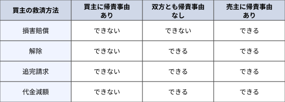

---

### （7）協調安全

安全の考え方は、当初は人の注意力や判断力に頼って「人の領域」の安全を確保してきました。この考え方をSafety0.0といいますが、この方法では、「機械の領域」や「人と機械の共存領域」ではリスクが高い状態となります。それに対して、機械に安全対策を施すことで「機械の領域」のリスクを下げるとともに、人と機械を隔離することで「人と機械の共存領域」をなくし、安全性を高めるという考え方がSafety1.0になります。

最近では、人と機械が共存して作業する環境が増えてきているため、Safety1.0での対応が困難となってきています。それに対応するのが**Safety2.0**で、人と機械と環境が協調することで、それぞれの領域だけではなく、共存領域においても高い安全性を確保することを可能とします。それを実現するために活用されると考えられるのが、IoTや人工知能などの技術になります。

---

### （8）新規科学技術分野の安全

最近では、バイオテクノロジー分野やコンピュータサイエンス分野等の新規科学技術分野では、「トランスサイエンス」という概念が注目されています。トランスサイエンス問題とは、「科学に問うことはできるが、科学によってのみでは答えることができない問題」と定義されています。そういった問題を、**倫理的・法的・社会的課題**（ELSI：Ethical, Legal and Social Implications/Issues）と捉え、社会の懸念を特定し、リスクや影響を分析・評価して、対応を検討する活動が求められています。

ライフサイエンスの急速な発展は、人類の福利向上に大きく貢献する一方で、人の尊厳や人権に関わるような生命倫理の課題を生じさせる可能性がありますので、未来の社会変革や経済・社会的な課題への対応を図るには、多様なステークホルダー間の対話と協働が必要です。

---

## 2. 安全に関するリスクマネジメント

リスクマネジメントは、リスクを定量的に捉える手法で、確率の考え方を用います。

### （1）リスク管理

リスク管理とは、組織やプロジェクトに潜在するリスクを把握し、そのリスクに対して使用可能なリソースを用いて効果的な対処法を検討し、それを実施するための技術体系です。リスク管理を実施する際は、組織やプロジェクトに関係する多様なリスクの存在を知り、それぞれのリスクに対して最適な分析・評価技術を用いてアセスメントを実施し、明確な対応方針に基づいて対策を検討する必要があります。リスクマネジメントに関する規格である「JIS Q31000 リスクマネジメント—原則及び指針」の前文では、次のような内容を示しています。

> この規格は、リスクのマネジメントを行い、意思を決定し、目的の設定及び達成を行い、並びにパフォーマンスの改善のために、組織における価値を創造し保護する人々が使用するためのものである。  
> あらゆる業態及び規模の組織は、自らの目的達成の成否を不確かにする外部及び内部の要素並びに影響力に直面している。  
> リスクマネジメントは、反復して行うものであり、戦略の決定、目的の達成及び十分な情報に基づいた決定に当たって組織を支援する。  
> リスクマネジメントは、組織統治及びリーダーシップの一部であり、あらゆるレベルで組織のマネジメントを行うことの基礎となる。リスクマネジメントは、マネジメントシステムの改善に寄与する。  
> リスクマネジメントは、組織に関連する全ての活動の一部であり、ステークホルダとのやり取りを含む。  
> リスクマネジメントは、人間の行動及び文化的要素を含めた組織の外部及び内部の状況を考慮するものである。  
> （後略）

---

### （2）リスクアセスメント

リスクアセスメントは、リスク管理の中核をなす活動であり、リスクを特定し、リスク分析とリスク評価をするプロセス全体をいいます。「JIS Q 0073 リスクマネジメント—用語」では、用語を次のように定義しています。

1. **リスク**  
   目的に対する不確かさの影響

2. **リスクマネジメント**  
   リスクについて、組織を指揮統制するための調整された活動

3. **リスク特定**  
   リスクを発見、認識及び記述するプロセス

4. **リスク分析**  
   リスクの特質を理解し、リスクレベルを決定するプロセス

5. **リスクレベル**  
   結果とその起こりやすさとの組合せとして表現される、リスク又は組み合わさったリスクの大きさ

6. **リスク評価**  
   リスク及び／又はその大きさが、受容可能か又は許容可能かを決定するために、リスク分析の結果をリスク基準と比較するプロセス

7. **コミュニケーション及び協議**  
   リスクの運用管理について、情報の提供、共有又は取得、及びステークホルダーとの対話を行うために、組織が継続的に及び繰り返し行うプロセス

8. **モニタリング**  
   要求又は期待されたパフォーマンスレベルとの差異を特定するために、状態を継続的に点検し、監督し、要点を押さえて観察し、又は決定すること

リスクアセスメントに関しては、厚生労働省から「危険性又は有害性等の調査等に関する指針」が出されており、対象としては、「建設物、設備、原材料、ガス、蒸気、粉じん等による、又は作業行動その他業務に起因する危険性又は有害性であって、労働者の就業に係る全てのものを対象とする。」としています。実施内容としては、次の事項を挙げています。

- Ａ　労働者の就業に係る危険性又は有害性の特定
- Ｂ　Ａにより特定された危険性又は有害性によって生ずるおそれのある負傷又は疾病の重篤度及び発生する可能性の度合の見積り
- Ｃ　Ｂの見積りに基づくリスクを低減するための優先度の設定及びリスクを低減するための措置内容の検討
- Ｄ　Ｃの優先度に対応したリスク低減措置の実施

実施体制としては、下記の人材を参画させるよう示しています。

- ⓐ　総括安全衛生管理者等、事業の実施を統括管理する者（事業場トップ）に調査等の実施を統括管理させること。
- ⓑ　事業場の安全管理者、衛生管理者等に調査等の実施を管理させること。
- ⓒ　安全衛生委員会等の活用等を通じ、労働者を参画させること。
- ⓓ　調査等の実施に当たっては、作業内容を詳しく把握している職長等に危険性又は有害性の特定、リスクの見積り、リスク低減措置の検討を行わせるように努めること。
- ⓔ　機械設備等に係る調査等の実施に当たっては、当該機械設備等に専門的な知識を有する者を参画させるように努めること。

実施時期に関しては、次の時期を挙げています。

1. 建設物を設置し、移転し、変更し、又は解体するとき。
2. 設備を新規に採用し、又は変更するとき。
3. 原材料を新規に採用し、又は変更するとき。
4. 作業方法又は作業手順を新規に採用し、又は変更するとき。
5. 労働災害が発生した場合であって、過去の調査等の内容に問題がある場合。
6. 前回の調査等から一定期間が経過し、機械設備等の経年による劣化、労働者の入れ替わり等に伴う労働者の安全衛生に係る知識経験の変化、新たな安全衛生に係る知見の集積等があった場合。

---

### （3）リスク対応

リスク値は下記の式で表されますので、リスク値を低減するには、被害額を少なくするか、被害が起きる発生確率を下げるか、その両方を下げるかという方法をとります。

$$\text{リスク値} = \text{【被害額】} \times \text{【被害が起きる発生確率】}$$

「JIS Q31000 リスクマネジメント—原則及び指針」では、リスク対応には、①リスク回避、②ある機会の追求のためのリスクの増加、③リスク源の除去、④起こりやすさの変更、⑤結果の変更、⑥他者とリスクの共有、⑦リスク保有があると示しています。なお、「リスク対応は、対象としたリスクを小さくするが、別のリスクを派生させることがある」とも示していますし、リスクを低減することはできても、リスクをゼロにする**絶対安全**にはできません。

通常、リスクを考える場合には、**図表4.2**のようなリスクマトリクスを用います。

**図表4.2　リスクマトリクス**

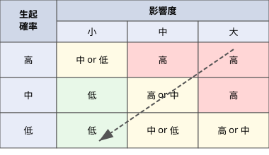

基本的な**リスク対応方針**は、リスク値が高い（右上の）事象をできるだけ低い（左下の）事象に持っていく検討を行うことです。一般的なリスク対応には、通常、次の4つの方法があります。

#### Ａ　リスク低減（軽減）

リスク値が高い場合にリスク低減をする方法としては、リスクの発生確率を下げるか、リスクの影響度（損害額）を少なくするか、その両方を下げる方法がとられます。

#### Ｂ　リスク移転（転嫁）

リスク移転の方法の1つとして、その実務の専門家（会社）に委託する方法があります。この方法では、専門家は専門知識や経験があるので、リスク値を低くする術を有しています。また、海難事故のように損害金額が大きいものについては、保険をかける方法が取られますが、これもリスク移転策になります。

#### Ｃ　リスク回避

リスク値が高く、リスクを軽減する具体的な対策がないと判断される場合には、リスク回避策がとられます。リスク回避には、現在実施しようとしている手法を違うものに変更するとか、その事業や投資自体を断念するなどの方法があります。

#### Ｄ　リスク保有（受容）

リスク保有は、積極的なリスク対策を実施する方が高くつく場合などに、リスク自体を受容（保有）して、リスク事象の監視を継続しながら、状況の変化に従って対策を考えるような、対策を先延ばしする方法になります。

なお、リスク対応に関しては、ALARPの原則という言葉がありますが、ALARPはas low as reasonably practicableの略であり、**リスクは合理的で実効可能な限りできるだけ低くしなければならない**という原則になります。

---

### （4）リスク認知のバイアス

リスクを受け入れるかどうかの判断をする個人や組織、社会のリスク認知には、さまざまなバイアスによって影響を受けます。そのバイアスによる影響度によって、社会的受容の判断が変わってきます。通常発生するバイアスには次のようなものがあります。

1. **正常性バイアス**：異常な状態を示す情報を得ても、正常であると解釈しようとする偏向
2. **楽観主義バイアス**：心理的なストレスを回避するために、楽観的に明るい方から見ようとする偏向
3. **カタストロフィー・バイアス**：きわめて稀にしか起きないが、壊滅的な被害をもたらすリスクに対して、過大な評価をする偏向
4. **ベテランバイアス**：経験が豊富な事象に対して、現在の状況を考慮せず経験を優先して判断する偏向
5. **バージンバイアス**：未経験な事象に対して、できるだけ正常であると判断する偏向

---

### （5）リスクコミュニケーション

リスクの社会的受容を得るためには、**リスクコミュニケーション**が重要となります。リスクコミュニケーションは、リスクの性質やリスクがもたらす正負両面の影響などについて、ステークホルダー間で意見や情報の交換を通じて、意思疎通と相互理解を図ることです。リスクに対する判断には個人差がありますので、特定のステークホルダーの利害によらない、科学的な根拠に基づいた独立性のある発信をすることが求められています。

文部科学省は、平成26年3月に安全・安心科学技術及び社会連携委員会から「リスクコミュニケーションの推進方策」を発表しています。本報告書第2項(2)では、リスクコミュニケーションを、「リスクのより適切なマネジメントのために、社会の各層が対話・共考・協働を通じて、多様な情報及び見方の共有を図る活動」と定義しています。

本報告書第2項(3)では、リスクコミュニケーションの目的を具体的に次の5分類としています。

1. 個人のリスク認知を変えリスク対処のために適切な行動に結びつけること（ステークホルダーの行動変容）
2. 地域社会において一般市民とともに潜在的な問題を掘り起こしてリスクのより適切なマネジメントにつなげていくこと（問題の発見と可視化）
3. ステークホルダー間で多様な価値観を調整しながら具体的な問題解決に寄与すること（異なる価値観の調整）
4. リスクを伴う不確定な事象に係る行政の意思決定について適切な手続を踏んで社会的合意の基盤を形成すること（リスクマネジメントに関する合意形成への参加）
5. 非常時の後に被害者や被災者の回復に寄り添うこと（被害の回復と未来に向けた一歩の支援）

リスクコミュニケーションにおいては、その方法が重要とされています。コミュニケーションの手段としては、新聞、雑誌、テレビ、ラジオ等のマスコミや、説明会などの対話方式、電子メディアを使う方式など、さまざまなものがあります。そのうち、マスコミは注意喚起型のリスクコミュニケーションに、対人的な媒体は合意形成型のリスクコミュニケーションに適しています。また、電子メディアは即時性や広域性に優れています。

リスクコミュニケーションにおいては、過程や対応経緯、対応者などのコミュニケーションのプロセス、内容、結果を記録し、保存することも必要です。

---

### （6）リスクベースメンテナンス

メンテナンスの対象となるシステムが大規模で複雑になると、考慮しなければならない機能や故障モードが多数になって、それらの重要度とメンテナンスの効果を的確に評価することが難しくなります。そういったシステムに対応する手法として**リスクベースメンテナンス（RBM）**があります。リスクベースメンテナンスは、設備やシステムの保全計画や検査計画の立案に際して、リスク評価を取り入れた手法であり、設備やシステムの信頼性向上と保全費の最適化を図る手法です。また、**リスクベース検査（RBI）**は、設備やシステムを要素レベルまで分類して不具合分析を行い、最適な検査手法や時期を検討して計画する手法です。リスクベースメンテナンスでは、故障の重要度を故障事例や寿命評価理論を基にして、リスク（＝発生確率×影響の大きさ）値で一元的に評価し、リスクの高低によって作業の順位付けをしますので、保全費の最適化が図れます。

---

## 3. 労働安全衛生管理

労働安全衛生管理は、企業活動において、職場の安全を確保するために行う管理活動で、そのためにいくつかの法律が定められています。

### （1）労働安全衛生法

労働安全衛生法は、「労働災害の防止のための**危害防止基準の確立、責任体制の明確化及び自主的活動の促進**の措置を講ずる等その防止に関する総合的計画的な対策を推進することにより職場における労働者の安全と健康を確保するとともに、快適な職場環境の形成を促進する」ことを目的とした法律です。

#### （a）事業者等の責務

労働安全衛生法では、「事業者等の責務」を第3条第1項で次のように示しています。

> 事業者は、単にこの法律で定める労働災害の防止のための最低基準を守るだけでなく、快適な職場環境の実現と労働条件の改善を通じて職場における労働者の安全と健康を確保するようにしなければならない。また、事業者は、国が実施する労働災害の防止に関する施策に協力するようにしなければならない。

#### （b）安全衛生管理体制

労働安全衛生法の第3章では、**安全衛生管理体制**を定めており、次のような管理者を示しています。

1. **総括安全衛生管理者（第10条）**  
   事業者は、労働安全衛生法施行令の第2条で定める規模の事業場ごと（例：建設業等100人、製造業等300人）に**総括安全衛生管理者**を選任し、その者に安全管理者、衛生管理者等の指揮をさせるとともに、次の業務を統括管理させなければなりません。
   - 労働者の危険または健康障害を防止するための措置
   - 労働者の安全または衛生のための教育の実施
   - 健康診断の実施その他健康の保持増進のための措置
   - 労働災害の原因の調査および再発防止対策
   - 労働災害を防止するため必要な業務で、厚生労働省令で定めるもの

2. **安全管理者（第11条）**  
   事業者は、常時50人以上の労働者を使用する事業場ごとに、厚生労働省令で定める資格を有する者のうちから**安全管理者**を選任し、その者に安全に係る技術的事項を管理させなければなりません。

3. **衛生管理者（第12条）**  
   事業者は、常時50人以上の労働者を使用する事業場ごとに、都道府県労働局長の免許を受けた者や資格を有する者のうちから**衛生管理者**を選任し、衛生に係る技術的事項を管理させなければなりません。

4. **産業医等（第13条）**  
   事業者は、常時50人以上の労働者を使用する事業場ごとに、医師のうちから**産業医**を選任し、その者に労働者の健康管理その他の厚生労働省令で定める事項を行わせなければなりません。

5. **安全委員会（第17条）**  
   事業者は、政令で定める業種・規模の事業場ごとに（建設業等は50人以上）、労働者の危険防止や労働災害の原因や再発防止対策で安全に係るものを調査審議させ、事業者に対し意見を述べさせるため、**安全委員会**を設けなければなりません。

6. **衛生委員会（第18条）**  
   事業者は、常時50人以上の労働者を使用する事業場ごとに、労働者の健康障害や労働災害の原因や再発防止対策で衛生に係るもの等を調査審議させ、事業者に対し意見を述べさせるため、**衛生委員会**を設けなければなりません。

7. **安全衛生委員会（第19条）**  
   事業者は、安全委員会と衛生委員会を設けなければならないときは、それぞれの委員会の設置に代えて、**安全衛生委員会**を設置することができます。

#### （c）労働者の危険または健康障害を防止するための措置

労働安全衛生法の第4章では、「労働者の危険又は健康障害を防止するための措置」を定めており、次のような内容を示しています。

1. 事業者は、次の危険を防止するため必要な措置を講じなければならない（第20条）
   - 機械、器具その他の設備による危険
   - 爆発性の物、発火性の物、引火性の物等による危険
   - 電気、熱その他のエネルギーによる危険

2. 事業者は、次の健康障害を防止するため必要な措置を講じなければならない（第22条）
   - 原材料、ガス、蒸気、粉じん、酸素欠乏空気、病原体等による健康障害
   - 放射線、高温、低温、超音波、騒音、振動、異常気圧等による健康障害
   - 計器監視、精密工作等の作業による健康障害
   - 排気、排液または残さい物による健康障害

3. 事業者は、労働者を就業させる建設物その他の作業場について、通路、床面、階段等の保全並びに換気、採光、照明、保温、防湿、休養、避難及び清潔に必要な措置その他労働者の健康、風紀及び生命の保持のために必要な措置を講じなければならない（第23条）

4. 事業者は、労働者の作業行動から生ずる労働災害を防止するため必要な措置を講じなければならない（第24条）

5. 事業者は、労働災害発生の急迫した危険があるときは、直ちに作業を中止し、労働者を作業場から退避させる等必要な措置を講じなければならない（第25条）

#### （d）機械等に関する規制

労働安全衛生法の第5章では、「機械等並びに危険物及び有害物に関する規制」を定めており、その第1節「機械等に関する規制」では、ボイラーやクレーン、エレベータなどの「特定機械等」については、次のような規制をかけています。

1. 製造の許可（第37条）
2. 製造時等検査等（第38条）
3. 個別検定（第44条）
4. 定期自主検査（第45条）

#### （e）化学物質のリスクアセスメント

平成28年6月の改正で、化学物質のリスクアセスメントが義務づけとなりました。対象となる化学物質は、安全データシート（SDS）の交付義務の対象である640物質となっています。**化学物質のリスクアセスメント**とは、化学物質の持つ危険性や有害性を特定し、それによる労働者への危険または健康被害を生じるおそれの程度を見積もり、リスクの低減対策を検討することです。そのため、リスクアセスメントは**図表4.3**に示す手順で行われます。

**図表4.3　化学物質のリスクアセスメントの流れ**

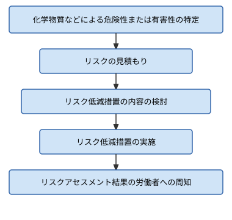

#### （f）労働者の就業に当たっての措置

労働者の就業に当たっての措置として第59条で**安全衛生教育**を定めており、「事業者は、労働者を雇い入れたときは、当該労働者に対し、厚生労働省令で定めるところにより、その従事する業務に関する安全又は衛生のための教育を行なわなければならない。」とされています。これが**雇入れ教育**になります。

また、第60条では、「事業者は、その事業場の業種が政令で定めるものに該当するときは、新たに職務につくこととなった職長その他の作業中の労働者を直接指揮又は監督する者に対し、安全又は衛生のための教育を行なわなければならない。」とされています。これが**送出し教育**になります。

#### （g）メンタルヘルス

メンタルヘルス対策は、労働安全衛生法第70条の2「健康の保持増進のための指針の公表等」に基づいて行われるものです。メンタルヘルスの予防については次の3段階があります。

1. **一次予防**（メンタルヘルス不調の未然防止）
   - メンタルヘルスケアを推進するための教育研修
   - 個人のストレス耐性を強める
   - 職場環境の把握と改善
   - ストレスの要因を抑止する

2. **二次予防**（メンタルヘルス不調の早期発見・早期治療）
   - 早期治療を行える状況をつくる
   - 従業員の兆候を読み取るために環境作りを行う
   - 早期相談体制の整備を行う
   - 日常からメンタルヘルスの啓蒙を行う

3. **三次予防**（メンタルヘルス不調者の職場復帰支援）
   - 発症した労働者の治療
   - 治療中の労働者の精神面のフォロー
   - 職場復帰する従業員に対する職場環境を整備する
   - 再発の予防を行う

なお、平成27年12月1日に、ストレスチェック制度が施行されました。**ストレスチェック制度**については、労働安全衛生法第66条の10第1項で、「事業者は、労働者に対し、厚生労働省令で定めるところにより、医師、保健師その他の厚生労働省令で定める者による心理的な負担の程度を把握するための検査を行わなければならない。」と規定されています。事業の規模については、労働安全衛生法施行令第5条で、「政令で定める規模の事業場は、**常時50人以上の労働者を使用する事業場**とする。」と規定されています。

ストレスチェック制度の目的は、次のとおりです。

- ⓐ　定期的に労働者のストレス状態をチェックし、自らのストレス状況の気づきを促し、不調のリスクを低減させる
- ⓑ　検査結果を集団ごとに集計・分析し、職場におけるストレス要因を評価して、職場環境の改善につなげる
- ⓒ　メンタル不調のリスクが高い労働者を早期に発見し、医師による面接指導につなげる

職場環境から発生している主な精神的な疾患を**図表4.4**に示します。

**図表4.4　精神的な疾患とその症状**

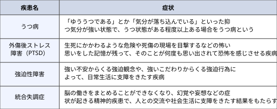

平成11年9月に、厚生労働省より「心理的負荷による精神障害等に係る業務上外の判断指針」が出され、心理的負荷による精神障害等についても労災の対象となっています。

#### （h）受動喫煙

受動喫煙に関しては、第68条の2で、「事業者は、室内又はこれに準ずる環境における労働者の受動喫煙を防止するため、当該事業者及び事業場の実情に応じ適切な措置を講ずるよう努めるものとする。」と規定されています。

#### （i）特別安全衛生改善計画

第78条第1項で、「厚生労働大臣は、重大な労働災害として厚生労働省令で定めるものが発生した場合において、重大な労働災害の再発を防止するため必要がある場合として厚生労働省令で定める場合に該当すると認めるときは、厚生労働省令で定めるところにより、事業者に対し、その事業場の安全又は衛生に関する改善計画を作成し、これを厚生労働大臣に提出すべきことを指示することができる。」と規定されています。

#### （j）墜落制止用器具

平成30年6月に労働安全衛生法施行令第13条第3項第28号の「安全帯」が「**墜落制止用器具**」に改められました。墜落制止用器具としては、ハーネス型（一本つり）と胴ベルト型（一本つり）がありますが、胴ベルト型（U字つり）は墜落制止機能がないため、墜落制止用器具に含まれないとされました。

また、労働安全衛生規則第36条「特別教育を必要とする業務」の第41号に、「高さが2メートル以上の箇所であって作業床を設けることが困難なところにおいて、墜落制止用器具のうちフルハーネス型のものを用いて行う作業に係る業務」が規定されましたので、使用に当たっては特別教育の受講が求められるようになっています。

#### （k）危険性又は有害性等の調査等に関する指針

本指針は、同法第28条の2に基づいて作成されたものです。第3項の「実施内容」では、次の内容を挙げています。

1. 労働者の就業に係る危険性又は有害性の特定
2. ①により特定された危険性又は有害性によって生ずるおそれのある負傷又は疾病の重篤度及び発生する可能性の度合の見積り
3. ②の見積りに基づくリスクを低減するための優先度の設定及びリスクを低減するための措置内容の検討
4. ③の優先度に対応したリスク低減措置の実施

リスク低減措置の検討及び実施については、1）危険な作業の廃止・変更等、設計や計画の段階から労働者の就業に係る危険性又は有害性を除去又は低減する措置、2）インターロック、局所排気装置等の工学的対策、3）マニュアルの整備等の管理的対策、4）個人用保護具の使用の優先順位で検討するとしています。

---

### （2）労働災害

労働災害は、労働安全衛生法第2条第1号で、「労働者の就業に係る建設物、設備、原材料、ガス、蒸気、粉じん等により、又は作業行動その他業務に起因して、労働者が負傷し、疾病にかかり、又は死亡することをいう。」と規定されています。

#### （a）労働災害統計

労働災害に関しては、**労働災害統計**がとられており、そこではいくつかの統計指標を用いますが、そのうち主なものは次のとおりです。

1. **度数率**  
   度数率は、100万延実労働時間当たりの労働災害による死傷者数であり、労働災害の頻度を表す指標で、次の式で求められます。

$$\text{度数率} = \frac{\text{労働災害による死傷者数}}{\text{延実労働時間数}} \times 1{,}000{,}000$$

2. **強度率**  
   強度率は、1,000延実労働時間当たりの実労働損失日数であり、災害の重さを表す指標で、次の式で求められます。

$$\text{強度率} = \frac{\text{実労働損失日数}}{\text{延実労働時間数}} \times 1{,}000$$

3. **年千人率**  
   年千人率は、1年間の労働者1,000人当たりに発生した死傷者数の割合を示す指標で、次の式で求められます。

$$\text{年千人率} = \frac{\text{1年間の死傷者数}}{\text{1年間の平均労働者数}} \times 1{,}000$$

#### （b）不安全行動

不安全行動については、厚生労働省が「労働者本人または関係者の安全を阻害する可能性のある行動を意図的に行う行為」と定義しています。また、「自らとった行動が、意図しない結果をもたらすこと」を「ヒューマンエラー」といいます。

労働災害の発生原因としては、①労働者の不安全行動の他、②機械や物の不安全状態があると厚生労働省は示しています。

#### （c）高齢者の労働安全

高齢者の労働安全に関しては、厚生労働省から「高年齢労働者の安全と健康確保のためのガイドライン」が策定されています。なお、**フレイル**とは、加齢とともに、筋力や認知機能等の心身の活力が低下し、生活機能障害や要介護状態等の危険性が高くなった状態で、**ロコモティブシンドローム**とは、年齢とともに骨や関節、筋肉等運動器の衰えが原因で「立つ」「歩く」といった機能（移動機能）が低下している状態のことをいいます。

#### （d）労働安全衛生マネジメントシステムに関する指針

労働安全衛生マネジメントシステム（OSHMS）に関しては、厚生労働省から「労働安全衛生マネジメントシステムに関する指針」がだされています。その中で、「労働安全衛生マネジメントシステムに関する指針の基本的な枠組み」が図表4.5のとおり示されています。

- 参考: [労働安全衛生マネジメントシステムに関する指針（厚生労働省）](https://www.mhlw.go.jp/bunya/roudoukijun/anzeneisei14/dl/ms_system.pdf)
- 参考: [OSHMS パンフレット（厚生労働省）](https://www.mhlw.go.jp/content/11200000/000591723.pdf)

---

### （3）公益通報者保護法

公益通報者保護法の目的は、第１条に次のように示されています。

> この法律は、公益通報をしたことを理由とする公益通報者の解雇の無効等並びに公益通報に関し事業者及び行政機関がとるべき措置を定めることにより、公益通報者の保護を図るとともに、国民の生命、身体、財産その他の利益の保護にかかわる法令の規定の遵守を図り、もって国民生活の安定及び社会経済の健全な発展に資することを目的とする。

#### （a）公益通報

公益通報に該当するのは、下記の条件にあったものです。

1. 通報者が労働者（正社員だけではなくパートやアルバイトも含む）であること
2. 不正の利益を得る目的や、他人に損害を加える目的などの不正な目的でないこと
3. 労務提供先などの役員、従業員、代理人などについて通報対象事実が生じるか、生じようとしていること
4. 通報先が下記の（c）項に示されたところであること

#### （d）保護の内容

公益通報をした人に対しては、次のような保護が与えられます。

1. 公益通報をしたことを理由として、事業者が行った解雇は無効とする。
2. 公益通報をしたことを理由として、事業者が行った労働者派遣契約の解除は無効とする。
3. 公益通報をしたことを理由として、降格、減給その他不利益な取扱いをしてはならない。
4. 公益通報をしたことを理由として、労働者派遣をする事業者に派遣労働者の交代を求めるなどの不利益な取扱いをしてはならない。
5. 公益通報をしたことを理由とする、一般職の国家公務員、裁判所職員、国会議員、自衛隊員、一般職の地方公務員に対する免職など不利益な取扱いを禁止する。

---

## 4. 事故・災害の未然防止活動・技術

安全を確保するために、定期点検活動や小集団活動、ヒヤリハット活動などの人的な活動が広く実施されています。しかし、設計では安全性を考慮していても、最終的にはシステムと人間との共同判断が行われなければなりません。また、逆に人間の行動においては間違いを完全に除去できませんので、そのような場合を想定して、フェールセーフやフールプルーフという考え方を取らなければなりません。そのような、**未然防止活動**として、下記のようなものがあります。

### （1）ハインリッヒの法則とヒヤリハット活動

**ハインリッヒの法則**とは、安全分野の先取りの原則として有名な法則で、アメリカの損保会社の技師であるハインリッヒ（1886－1962）が、1929年に過去に起こった労働災害事故約50万件を調査した結果から発表したものです。ことばで示すと、「1件の死亡事故のような重大な障害が発生したとすると、その背後には29件の軽度な障害と、災害統計には現れない300件の障害のない災害がある。」というものです。

**図表4.6　ハインリッヒの法則**

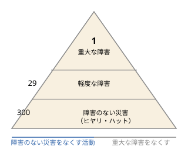

この法則が示したいことは、1件の重大事故や死亡事故を防ぐためには、図の一番底辺に示されていて報告として上がってこない、障害のない災害をなくしていくことが大切であるという点です。この障害のない災害を**ヒヤリハット**と呼んでおり、このヒヤリハットをなくすための活動が「ヒヤリハット活動」で、将来の重大災害につながる可能性のある重要な事故を発見できる活動となっています。

なお、ヒヤリハット活動は、可能な限り早期に報告させて、早期に対策を行うとともに、同様の業務を行っているチームにその情報を提供することも重要といわれています。

---

### （2）システムの高信頼化

システムの信頼化に関しては、次のような方策があります。

#### （a）フォールトアボイダンス

**フォールトアボイダンス**は、故障の可能性が十分に低く、高い信頼性を維持できるようにする考え方をいいます。具体的には、装置やシステム全体の故障確率を少なくする手法です。そのためには、装置やシステムを構成する部品の信頼性の向上や、品質管理や予防措置の徹底などの方法があります。

#### （b）フォルトトレランス

**フォルトトレランス**は、故障や誤動作が発生しても、機能的には正しい状態が維持できるようにしておく考え方をいいます。具体的には、一部の部品や機能に故障が発生した場合にも、全体機能を維持して、装置やシステムを稼動させるようにしておく手法です。

#### （c）フェールソフト

**フェールソフト**は、故障が発生した際に機能を完全に喪失するのではなく、可能な範囲で機能が維持できるようにする考え方をいいます。具体的には、100の機能を持った装置の一部が故障しても、50の機能だけは発揮できるようにしておく手法です。

#### （d）フールプルーフ

**フールプルーフ**は、人間が誤って不適切な操作を行っても、危険を生じさせないように、または正常な動作を妨害しないように、機械的または電気的に検知して実行できないようにしておく考え方をいいます。

#### （e）フェールセーフ

**フェールセーフ**は、装置や部品が故障した場合にも、その故障が大きな事故の原因になったり、新たな故障の引き金になったりしないように、安全な方向に制御する設計の考え方をいいます。人間によるミスは避けられないものとして、システムの信頼性を保持するフェールセーフ設計といいます。

#### （f）インターロック

機械安全の基本は、人と機械を隔離する**隔離安全**と機械を停止する**停止安全**になります。**インターロック**はフールプルーフの手法の1つで、一定の条件が整わないと、動作や機能を働かせない機構のことで、停止安全の手段の1つです。

インターロックには大きく分けて下記の2つがあります。

1. **安全確認型インターロック**  
   安全確認型インターロックは、安全が確認されている間だけ機械の運転を許可するシステムです。そのため、安全を確認できなければ起動しませんし、運転中に安全が確認できなくなれば、運転を停止します。安全確認のためのセンサが故障すると、運転は停止するので、フェールセーフとなります。

2. **危険検出型インターロック**  
   危険検出型インターロックは、危険を検出すれば機械の運転を停止するシステムです。危険を検出するセンサが故障すると、危険な状態になってもシステムは動作しませんので、危険な動作が継続するという欠点を持っています。

なお、**本質的安全設計方策**とは、ガード又は保護装置を使用しないで、機械の設計又は運転特性を変更することによって、危険源を除去する又は危険源に関連するリスクを低減する保護方策になります。

---

### （3）事故の4M要因分析

**事故の4M要因分析**とは、事故・災害の原因分析の際に、下記の視点から要因を抽出する手法です。

1. **Man（人）**  
   関与した人に関する要因（心理的要因、生理的要因、職場的要因など）

2. **Machine（設備）**  
   設備・機械等に関する要因（欠陥、整備不良、設計ミスなど）

3. **Media（作業環境）**  
   ManとMachineとの媒体に関する要因（作業環境、マニュアル、不適切手順設定など）

4. **Management（管理）**  
   管理システムに関する要因（規定、教育訓練、監理・監督など）

---

### （4）事故の4E対策

**事故の4E対策**とは、事故・災害の対策検討の際に、下記の視点から対策を検討する手法です。

1. **Engineering（工学的対策）**  
   管理システムに関する要因（規定、教育訓練、監理・監督など）

2. **Education（教育）**  
   関与した人に関する要因（心理的要因、生理的要因、職場的要因など）

3. **Enforcement（強調、強化）**  
   設備・機械等に関する要因（欠陥、整備不良、設計ミスなど）

4. **Example（模範）**  
   ManとMachineとの媒体に関する要因（作業環境、マニュアル、不適切手順設定など）

---

### （5）小集団活動

小集団活動は、第2章の「人的資源管理」第4項(3)の「QCサークル活動」でも説明したとおり、第一線の職場で働く人々が自主的に運営し、継続的に実施する活動です。小集団活動には、QCサークル活動以外に、従業員の創造工夫によって仕事の欠陥をゼロにし、顧客満足や製品の信頼性を高める**ZD（Zero Defects）運動**や、**改善提案活動**などがあります。

---

### （6）自主保安

#### （a）定期点検活動

定期点検活動は、事故や災害の発生を未然に防ぐための活動で、定期的な点検活動を定常業務の一部として行うものです。

#### （b）危険予知活動

日々の労働前にも、**危険予知（KY）活動**が積極的に職場で行われるようになっています。さらにKY活動が推進されるように、**危険予知訓練（KYT）**という研修も広く行われるようになってきています。危険予知訓練は、作業等にひそむ危険要因や引き起こす現象を認識する手法で、①現状把握、②本質追及、③対策樹立、④目標設定を行う4ラウンド法などが用いられます。作業前に職場で行われる**ツールボックスミーティング（TBM）**において、危険予知トレーニングが実施されます。

---

### （7）自動走行に関するガイドライン

平成28年5月に警察庁より、「自動走行システムに関する公道実証実験のためのガイドライン」が公表されました。公道実証実験を行う場合は、運転者となるテストドライバーは、法令に基づき運転に必要とされる運転免許を保有している必要があるとしており、交通事故又は交通違反が発生した場合には、テストドライバーが、常に運転者としての責任を負うことを認識する必要があるとしています。

令和2年9月に警察庁より公表された「自動運転の公道実証実験に係る道路使用許可基準」では、遠隔型自動運転システムの公道実証実験についても示されており、条件を満たせば、遠隔監視・操作者による走行も可能となっています。

---

## 5. 危機管理

一般的には、事故や危機等が起きないようにすることをリスク管理というのに対して、危機管理は、天災等の**緊急事態**が発生した後の活動を指す場合が多いようです。そのため、**危機管理の目的**は、不測の事態に対して適切な対応ができるようにすることです。

### （1）危機管理の対象事象

危機管理の対象事象は非常に多彩ですが、企業を対象にした**危機**の事例を挙げると**図表4.7**のような事項があります。

**図表4.7　企業の危機事例**

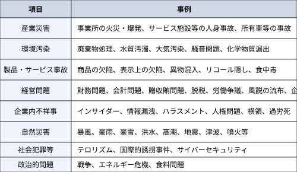

図表4.6に示すように、危機にはさまざまな種類や規模の違いがありますが、すべての危機に対応するという考え方として、**オールハザードアプローチ**があります。オールハザードアプローチは、ひとつの組織行動原則といわれています。

---

### （2）危機への対応

危機への対応については、次に示すそれぞれの段階での対応が事前に検討され準備されていなければなりません。なお、危機管理においては人の安全だけではなく、危機時の警備対策や**サイバーセキュリティ対策**も含めて検討する必要があります。

#### （a）平常時準備段階

危機管理に向けての準備段階は平常時に行われている必要があります。この活動が適切に実施されるためには、トップがまず危機管理に対する強い意志を示すことが重要とされています。

#### （b）事前作業段階

この段階では、想定される危機の洗い出しやその影響度合いを個々に検討し、その結果に基づいて、**危機管理計画**の策定や緊急対策本部等の**危機管理体制**の準備、危機発生時の連絡体制の整備などを行っていきます。

#### （c）緊急事態対応段階

この段階では、危機発生やその予兆の早期発見において迅速な行動が求められます。

#### （d）事後復旧段階

緊急事態が収束し始めたら、できるだけ短い時間で組織を平常状態に戻す必要があります。特に重要な点は、再発防止策の検討と早期の公表、信頼回復を図るための対応になります。

---

### （3）危機管理マニュアル

危機管理マニュアルは、危機発生時に要求される緊急時対応を円滑に実施するために策定されるものです。危機管理マニュアルの実効性を高めるためには、想定リスクを明確にするとともに、それぞれのリスクに対する判断基準や必要な活動項目を明確に記載する必要があります。

危機管理マニュアルは以下の要件を満たすように作成する必要があります。

1. 体系的・階層的に構成する
2. 対象事象や対応方針を明確にする
3. 対応組織や体制が明確である
4. 責任と権限が明確である
5. 見直しや改正の手続きが明確である

---

### （4）事業継続マネジメント

平成25年8月に内閣府が改定した『事業継続ガイドライン』によると、「大地震等の自然災害、感染性のまん延、テロ等の事件、大事故、サプライチェーン（供給網）の途絶、突発的な経営環境の変化など不測の事態が発生しても、重要な事業を中断させない、または中断しても可能な限り短い期間で復旧させるための方針、体制、手順等を示した計画のことを**事業継続計画（BCP：Business Continuity Plan）**と呼ぶ。」と示しています。

また、同ガイドラインでは、「BCP策定や維持・更新、事業継続を実現するための予算・資源の確保、事前対策の実施、取組を浸透させるための教育・訓練の実施、継続的な改善などを行う平常時からのマネジメント活動は、**事業継続マネジメント（BCM：Business Continuity Management）**と呼ばれ、経営レベルの戦略的活動として位置付けられるものである。」としています。

なお、事業継続マネジメントの国際規格として、ISO 22301（事業継続マネジメントシステム—要求事項）が発行されています。

**図表4.8　企業における従来の防災活動と事業継続マネジメントの比較**

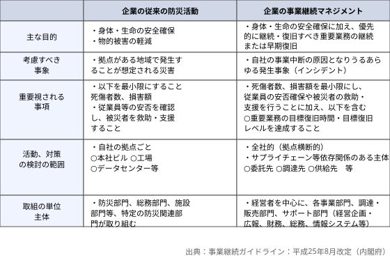

---

### （5）国土強靱化基本計画

国土強靱化基本計画は、強くしなやかな国民生活の実現を図るための防災・減災等に資する**国土強靱化基本法**（国土強靱化基本法）の第10条に従って定められた基本的な計画で、「国土強靱化に関する施策の総合的かつ計画的な推進を図るため、『国土強靱化』の基本方針及び国が果たすべき役割を踏まえ、国土強靱化に関する施策の基本的な計画を、国土強靱化基本計画以外の国土強靱化に係る国の計画等の指針となるべきもの」を定めています。

最新版の国土強靱化基本計画は、令和5年7月に公表されたものです。その第1章第1項に国土強靱化の理念として次のように示されています。

> いかなる災害等が発生しようとも、  
> ① 人命の保護が最大限図られること  
> ② 国家及び社会の重要な機能が致命的な障害を受けずに維持されること  
> ③ 国民の財産及び公共施設に係る被害の最小化  
> ④ 迅速な復旧復興  
> を基本目標として、「強さ」と「しなやかさ」を持った安全・安心な国土・地域・経済社会を構築するため「国土強靱化（ナショナル・レジリエンス）」を推進することとする。

---

### （6）津波防災地域づくりに関する法律

津波防災地域づくりに関する法律の目的は、第１条に次のように示されています。

> この法律は、津波による災害を防止し、又は軽減する効果が高く、将来にわたって安心して暮らすことのできる安全な地域の整備、利用及び保全（以下「津波防災地域づくり」という。）を総合的に推進することにより、津波による災害から国民の生命、身体及び財産の保護を図るため、国土交通大臣による基本指針の策定、市町村による推進計画の作成、推進計画区域における特別の措置及び一団地の津波防災拠点市街地形成施設に関する都市計画に関する事項について定めるとともに、津波防護施設の管理、津波災害警戒区域における警戒避難体制の整備並びに津波災害特別警戒区域における一定の開発行為及び建築物の建築等の制限に関する措置等について定め、もって公共の福祉の確保及び地域社会の健全な発展に寄与することを目的とする。

---

### （7）危機に対する法律

具体的な危機を想定して次のような法律が設けられています。

#### （a）国民保護法

国民保護法第44条で、「対策本部長は、武力攻撃から国民の生命、身体又は財産を保護するため緊急の必要があると認めるときは、基本指針及び対処基本方針で定めるところにより、警報を発令しなければならない。」と規定されています。

#### （b）気象業務法

気象業務法第13条の2で、「気象庁は、予想される現象が特に異常であるため重大な災害の起こるおそれが著しく大きい場合として降雨量その他に関し気象庁が定める基準に該当する場合には、政令の定めるところにより、その旨を示して、気象、地象、津波、高潮及び波浪についての一般の利用に適合する警報をしなければならない。」と規定されています。

#### （c）原子力災害対策特別措置法

原子力災害対策特別措置法第15条で、「原子力規制委員会は、次のいずれかに該当する場合において、原子力緊急事態が発生したと認めるときは、直ちに、内閣総理大臣に対し、その状況に関する必要な情報の報告を行うとともに、次項の規定による公示及び第三項の規定による指示の案を提出しなければならない。」と規定されています。

#### （d）新型インフルエンザ等対策特別措置法

新型インフルエンザ等対策特別措置法第20条の「政府対策本部長の権限」で、「政府対策本部長は、新型インフルエンザ等対策を的確かつ迅速に実施するため必要があると認めるときは、基本的対処方針に基づき、指定行政機関の長及び指定地方行政機関の長並びに前条の規定により権限を委任された当該指定行政機関の職員及び当該指定地方行政機関の職員、都道府県の知事その他の執行機関並びに指定公共機関に対し、指定行政機関、都道府県及び指定公共機関が実施する新型インフルエンザ等対策に関する総合調整を行うことができる。」と規定されています。

---

### （9）警戒レベル

自然災害に対する**警戒レベル**が「避難勧告等に関するガイドライン」として示されていますので、その内容を**図表4.9**に示します。

**図表4.9　警戒レベルを用いた避難勧告等の伝達**

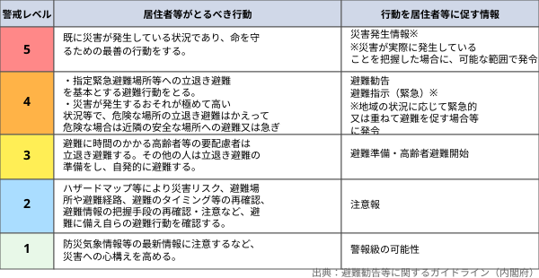

---

## 6. システム安全工学手法

安全性は、設計において非常に重要な要素です。もしも、人命に関わるような弊害がある場合には、優先して設計に変更を加えなければなりません。安全を損なう要素としては非常に多くのものがありますので、それらを抽出する作業は慎重に行わなければなりません。その要素を抽出する際によく用いられるものとして、チェックリストがあります。

### （1）システム安全工学手法

システム安全工学手法には次のようなものがあります。

#### （a）FMEA（Failure Mode and Effects Analysis）

**FMEA**は、「故障モード影響解析」のことで、設計の不完全な点や製品の潜在的欠陥を見つけるために、構成要素の**故障モード**を解析して、機器やシステム全体に与える影響を調べる帰納的解析手法です。FMEAの解析方法は部品などの要素を基準として行うために、ボトムアップ的な手法であり、一つの部品の故障がその上位の部品に与える影響を評価・分析して、トラブルの発生要因を追求するという地道な方法といえます。

**図表4.10　FMEA表の例**

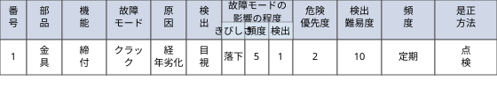

#### （b）フォールツリー分析（FTA：Fault Tree Analysis）

**フォールツリー分析（FTA）**は「故障の木解析」のことで、信頼性や安全性の面から好ましくない事象を取り上げ、その事象から原因となる事象と、その発生原因や発生確率を解析する手法です。**頂上事象**から始まって、一次事象、二次事象、…、n次事象と枝分かれして広がっていきます。その方法は、トップダウン的な方法であり、その形状が木の枝のように広がっていくため「故障の木」という名称になっています。

**図表4.11　FTAの例**

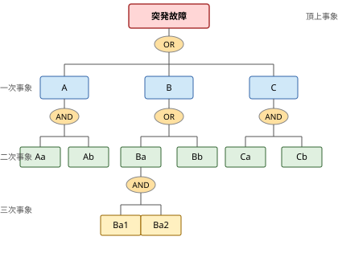

#### （c）イベントツリー分析（ETA：Event Tree Analysis）

**イベントツリー分析（ETA）**は、災害などの引き金になる重大な**初期事象（Event）**を設定し、それから結果として生じうる事象をシーケンスに列記していき、最終的に発生する災害とその発生確率を評価する手法です。各事象については、それが発生するかどうかをYES／NOで表し、それぞれのケースの発生確率を出して二分岐させていきます。

**図表4.12　ETAの例**

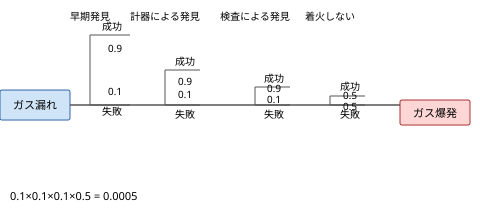

#### （d）HAZOP（Hazard and Operability Study）

**HAZOP**は、主に化学プラントの設計や運転において、どんな危険性があるかを明らかにする手法です。さまざまなプロセスパラメータのずれ（なし（no）・多い（more）・少ない（less）・逆に（reverse）・他の（other than）など）に対して、その原因とそれから発生する危険事象を解析して、それに対する改善策や対策を考えていきます。

**図表4.13　HAZOPの例**

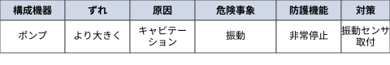

#### （e）チェックリスト

リスクに結びつくような事象についての**チェックリスト**を作成し、それを用いて実際の業務の条件や状況を一つひとつ調べることによって、リスク要因を見つけだす方式です。繰り返し行っている業務であれば、チェックリストも繰り返し改定されるので、その都度精度が増していき、利用効果の高いチェックリストとなっていきます。

---

### （2）ヒューマンエラー分析

**ヒューマンエラー**とは、「期待された行動からの逸脱行動」とされており、言い換えると、「意図しない（悪い）結果を生じる人間の行為」といえます。ヒューマンエラーの発生には複数の要因が絡んでいることが多いとされており、多角的な観点から分析する必要があります。要因としては、次のようなものが挙げられます。

1. **人的要因**：本人の健康状態や心理状態、身体的条件など
2. **機械要因**：機械の不具合や使いにくさなど
3. **環境要因**：作業環境や物理条件、人間関係など
4. **管理要因**：人や機械の管理状態、教育状態など

#### （a）トライポッド理論

トライポッド理論は、無数に存在する直接的過失よりも、11個の潜在的欠陥に注目したものです。11個の欠陥のタイプと具体的な例は**図表4.14**に示すとおりです。

**図表4.14　トライポッド理論の要因**

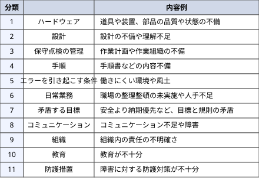

#### （b）ヒューマンエラー率予測技術（THERP：Technique for Human Error Rate Prediction）

**THERP**はアメリカのサンディア研究所で開発された手法で、システムの設計や運用の際における人間の信頼性を評価する手法です。具体的には、対象となる人間が一連の作業を遂行していく際に発生する可能性があるエラーを作業別に識別して、各段階における成功と失敗を、イベントツリー分析を用いて分析していく手法です。

#### （c）VTA（Variation Tree Analysis）

VTAは、作業がすべて通常どおりに進行していれば事故は起こらないとの考えの下で、正常な状態や判断、作業から外れたものを変動要因として探って、時間軸に沿って図式化して分析する手法です。

---

### （3）システム信頼度解析

技術には信頼性が強く求められます。信頼性をできるだけ高めていくという考え方は部品レベルでも実施されていますが、トータルシステムの面でも行われています。そのなかで広く用いられているのが**冗長化**です。冗長化とは、二重化対策などを行って、システム全体の信頼性を高める方法です。

信頼性計算では、**信頼性ブロック図**を用いますが、その基本は下記に示す直列システムと並列システムになります。

信頼性を計算する場合に与えられる条件としては、**信頼性（e）**と**故障率（f）**があります。これら2つの数字には次の関係があります。

$$e + f = 1$$

#### （a）直列システム

**図表4.15　直列システム**

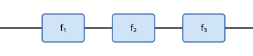

構成要素を直列に接続する直列システムの場合には、次のような計算式になります。

$$\text{システム故障率}(f_m) = 1 - (1-f_1) \times (1-f_2) \times (1-f_3)$$

すべての故障率（$f_1, f_2, f_3$）が0.1と仮定すると、システム故障率とシステム信頼性は次のようになります。

- システム故障率 ＝ $1 - 0.9^3 = 0.271$
- システム信頼性 ＝ $1 - 0.271 = 0.729$

#### （b）並列システム

**図表4.16　並列システム**

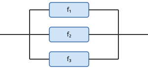

並列システムの場合の計算式は次のようになります。

$$\text{システム故障率}(f_m) = f_1 \times f_2 \times f_3$$

すべての故障率が0.1と仮定すると、システム故障率とシステム信頼性は次のようになります。

- システム故障率 ＝ $0.1^3 = 0.001$
- 信頼性 ＝ $1 - 0.001 = 0.999$

#### （c）MTTRとMTBF

信頼性ということでは、次のような用語も覚えておく必要があります。

1. **MTTR（Mean Time To Repair）**  
   MTTRは、修理開始からシステムが修復するまでの平均時間を示していますので、日本語では平均修復時間といいます。

2. **MTBF（Mean Time Between Failures）**  
   MTBFは、ある故障から次の故障までの間隔の平均時間ですので、日本語では平均故障間隔となります。MTBFの逆数（1/MTBF）が先の計算で使った故障率（$f$）になります。

3. **アベイラビリティ（Availability）**  
   アベイラビリティとは、JISで「要求された外部資源が用意されたと仮定したとき、アイテムが所定の条件下で、所定の時点、または期間中、要求機能を実行できる状態にある能力」と規定されています。

   アベイラビリティ（$A$）は、上述したMTTRとMTBFから求められます。

$$A = \frac{\text{MTBF}}{\text{MTBF} + \text{MTTR}}$$

#### （d）深層防護

なお、原子力発電所などの事故のようなシビアアクシデントへの対策には、**深層防護**という考え方を採るのが基本となります。**深層防護**とは、何重にも安全対策を施すことを意味します。具体的に、国際原子力機関では、原子力発電所の深層防護レベルを次のように示しています。

- レベル1：異常運転と不具合の防止
- レベル2：異常運転の制御と不具合の検知
- レベル3：設計基準内に事故を制御
- レベル4：事故進展の防止およびシビアアクシデントの影響の緩和を含む過酷なプラント状態の制御
- レベル5：放射性物質の大規模な放出による放射線影響の緩和

---

### （4）論理回路

論理回路は、通常2値論理回路を指します。論理回路を理解するには、論理変数の取りうるすべての入力値を列記して、それらすべての組み合わせについて真理値を記入した真理値表を理解するのが早道ですので、論理回路の記号と真理値表、論理式を示します。

#### （a）OR回路

**OR回路**は、入力端子のどれか1つが1であれば1となる論理回路で、**論理和**と呼ばれます。

**図表4.17　OR回路の記号と真理値表**

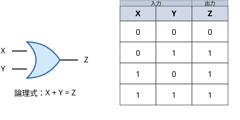

#### （b）AND回路

**AND回路**は、入力端子のすべてに1が入ったときに1となる論理回路で、**論理積**と呼ばれます。

**図表4.18　AND回路の記号と真理値表**

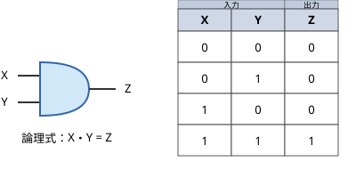

---

*以上、第4章「安全管理」の内容を文字起こしし、主要な図表をSVGで再現しました。*
