# Callout コンポーネント ギャラリー（全 12 種）

doboku-note の `<Callout>` コンポーネントは、2026-04-22 の Claude Design ハンドオフで zip 原設計に厳密準拠した形にリデザインされました。本ドキュメントは MDX 執筆者・コンテンツ生成エージェントが参照する**視覚リファレンス**です。

**真実源**:
- 実装: [`src/components/ui/Callout/Callout.tsx`](../../src/components/ui/Callout/Callout.tsx)
- 使用ガイド: [`.claude/knowledge/reference/content-principles.md`](../../.claude/knowledge/reference/content-principles.md) の「過剰装飾を避ける」節
- コンポーネント専用 README: [`src/components/ui/Callout/README.md`](../../src/components/ui/Callout/README.md)

---

## 共通デザイン仕様

すべての Callout は以下の構造を共有します:

- 左端に **3px のアクセントバー**（トーン別の色）
- 左上に **22px の円形アイコン**（トーン色背景 + 白アイコン、`lucide-react`）
- 任意の **タイトル**（`title` prop、トーン色 bold）
- 本文（`children`、ink-body 色）

「NOTE」「ポイント」等のラベルテキストは**描画しません**。型の識別は「アイコン + 色」で行い、スクリーンリーダーには `aria-label` で補完します。

---

## 汎用種別（5 種）

### `note`（メモ）

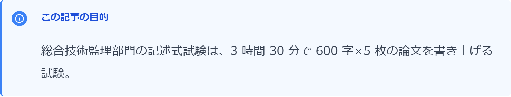

- **用途**: 事実の強調・補足情報
- **色**: 青系（blue-500）/ アイコン: `Info`
- **移行元**: 旧 `info` / `note` から統合

```mdx
<Callout type="note" title="この記事の目的">
  本文の記述...
</Callout>
```

---

### `tip`（ポイント）

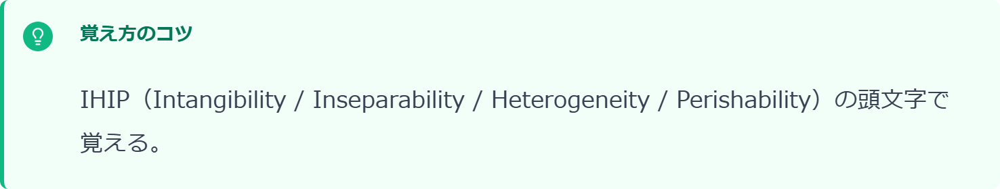

- **用途**: 学習コツ・覚え方のヒント
- **色**: 緑系（emerald-500）/ アイコン: `Lightbulb`

```mdx
<Callout type="tip" title="覚え方のコツ">
  本文の記述...
</Callout>
```

---

### `warn`（注意）

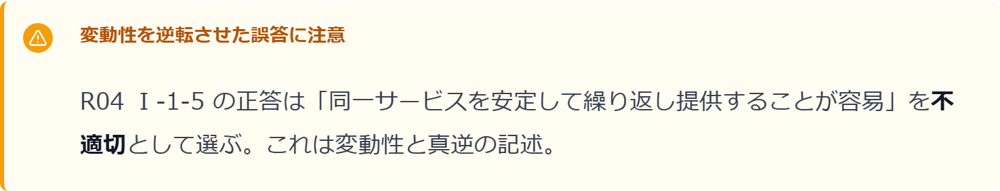

- **用途**: 行動への警告・頻出引っかけ
- **色**: 橙系（amber-500）/ アイコン: `AlertTriangle`
- **移行元**: 旧 `warning` / `caution` から統合

```mdx
<Callout type="warn" title="変動性を逆転させた誤答に注意">
  本文の記述...
</Callout>
```

---

### `danger`（重大リスク）

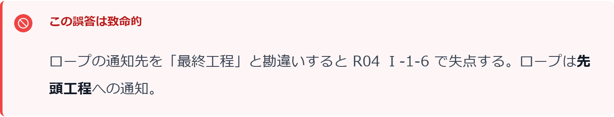

- **用途**: 致命的な誤解・重大な誤答
- **色**: 赤系（red-500）/ アイコン: `Ban`

```mdx
<Callout type="danger" title="この誤答は致命的">
  本文の記述...
</Callout>
```

---

### `success`（合格ライン）


- **用途**: 到達水準・達成条件の明示
- **色**: 緑系濃（green-500）/ アイコン: `CheckCircle`

```mdx
<Callout type="success" title="合格ラインの目安">
  本文の記述...
</Callout>
```

---

## ドメイン特化種別（7 種）

### `exam`（出題頻度）

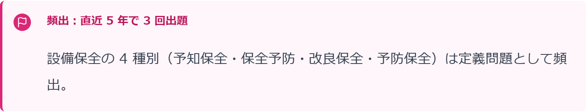

- **用途**: 本文中の出題頻度アクセント（「ここは出題頻度高」等の単発注意）
- **色**: 桃系（pink-600）/ アイコン: `Flag`
- **`<ExamPoint>` との使い分け**: `<ExamPoint>` は記事末尾の構造化総括、`<Callout type="exam">` は本文中の単発アクセント

```mdx
<Callout type="exam" title="頻出: 直近 5 年で 3 回出題">
  本文の記述...
</Callout>
```

---

### `formula`（公式）

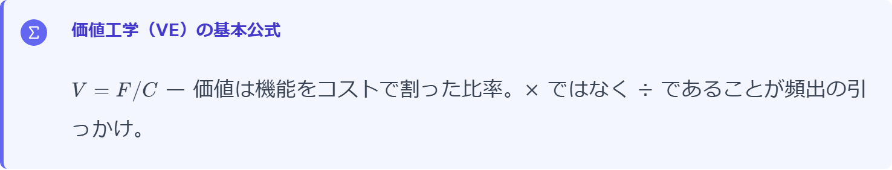

- **用途**: 公式・計算原理の強調
- **色**: 藍系（indigo-500）/ アイコン: `Sigma`

```mdx
<Callout type="formula" title="価値工学（VE）の基本公式">
  $V = F / C$ — 価値は機能をコストで割った比率
</Callout>
```

---

### `standard`（基準・規格）

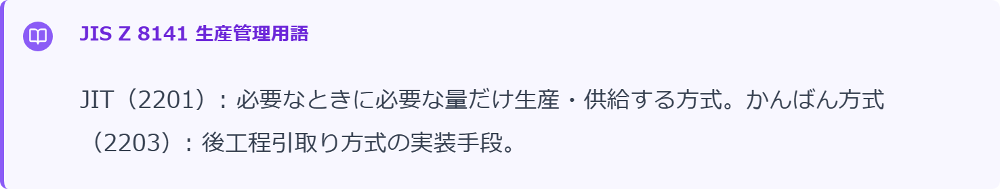

- **用途**: JIS / ISO / 法令条文の引用
- **色**: 紫系（violet-500）/ アイコン: `BookOpen`

```mdx
<Callout type="standard" title="JIS Z 8141 生産管理用語">
  JIT: 必要なときに必要な量だけ生産・供給する方式
</Callout>
```

---

### `example`（実例）

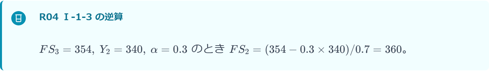

- **用途**: 具体的な計算例・事例・ケーススタディ
- **色**: 青緑系（cyan-600）/ アイコン: `Beaker`

```mdx
<Callout type="example" title="R04 Ⅰ-1-3 の逆算">
  $FS_3 = 354,\ Y_2 = 340,\ \alpha = 0.3 \Rightarrow FS_2 = 360$
</Callout>
```

---

### `reference`（参考文献）

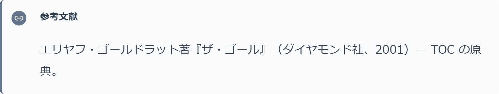

- **用途**: 書籍・論文への誘導（参考文献）。**外部 URL 一般・note 記事には使わない** — note 記事は `<NoteLink>`、一般外部 URL は `<LinkCard>`（→ `.claude/knowledge/reference/content-authoring.md` リンク系コンポーネントの使い分け）
- **色**: 灰系（slate-500）/ アイコン: `Link2`

```mdx
<Callout type="reference" title="参考文献">
  ゴールドラット著『ザ・ゴール』（ダイヤモンド社、2001）
</Callout>
```

---

### `faq`（よくある質問）

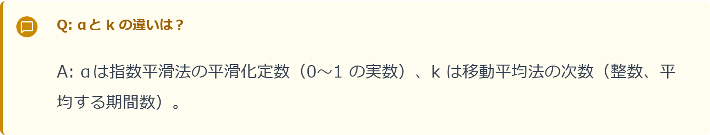

- **用途**: 受験者が繰り返し聞きがちな Q&A 形式
- **色**: 黄系（yellow-600）/ アイコン: `MessageSquare`

```mdx
<Callout type="faq" title="Q: αと k の違いは？">
  A: αは指数平滑法の平滑化定数、k は移動平均法の次数...
</Callout>
```

---

### `quote`（引用）

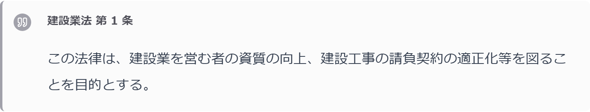

- **用途**: 原典文献の直接引用
- **色**: 中立灰（zinc-400）/ アイコン: `Quote`

```mdx
<Callout type="quote" title="建設業法 第 1 条">
  この法律は、建設業を営む者の資質の向上、建設工事の請負契約の適正化等...
</Callout>
```

---

## 使用上のルール

- **1 記事に Callout は 3 個以内**（メリハリ用・過剰装飾禁止）
- **タイトルは任意**（省略すると、アイコン + 色のみでミニマル表示）
- **タイトルの色はトーン色に自動適用**（左アクセントバー・アイコン・タイトルの 3 要素が同色で一体化）
- **絵文字は使わない**（❌✅💡🔑 等は禁止、Callout で表現する）
- **旧 type は個別の新 type へ自動変換**（`LEGACY_ALIASES`）: `info`→`note` / `warning`→`warn` / `caution`→`warn` / `point`→`tip` / `error`→`danger`。この対応表にない未知 type（`question` など完全に削除済みの旧 type を含む）だけが `note` へフォールバックする。新規執筆では旧 type を使わない

詳細な使用ガイド（どの論点にどの type を使うか）は [`.claude/knowledge/reference/content-principles.md`](../../.claude/knowledge/reference/content-principles.md) を参照してください。

---

## スクリーンショット再生成

デザインを変更した場合は以下で再生成できます:

1. `content/site/_dev-callout-gallery/article.mdx`（一時）に全 12 種を記述
2. `npm run dev` → `/docs/_dev-callout-gallery` で表示
3. Playwright（`/design-review --visual`）で各 `aside[data-callout]` を個別撮影
4. `docs/design/images/callout-{type}.png` に保存・コミット
5. 一時 MDX を削除
