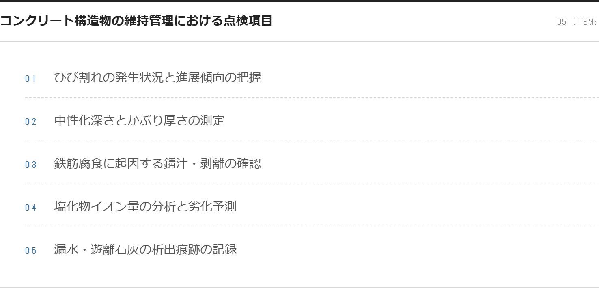
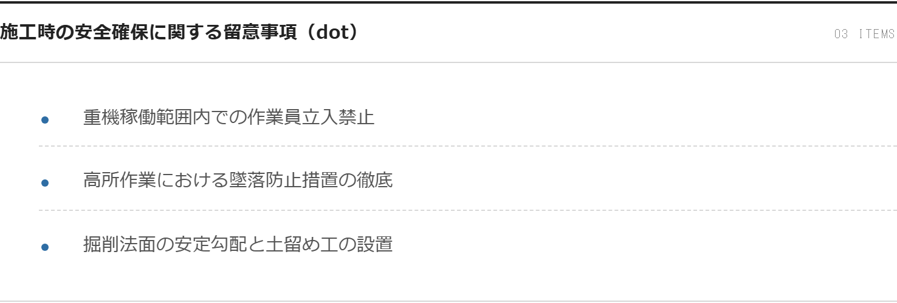
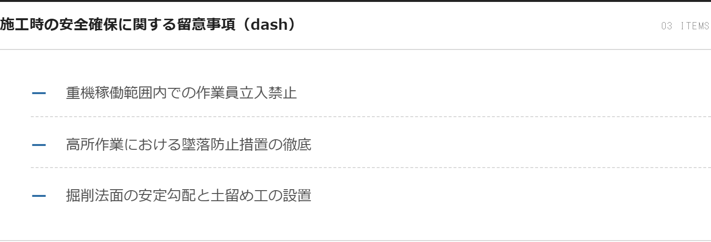
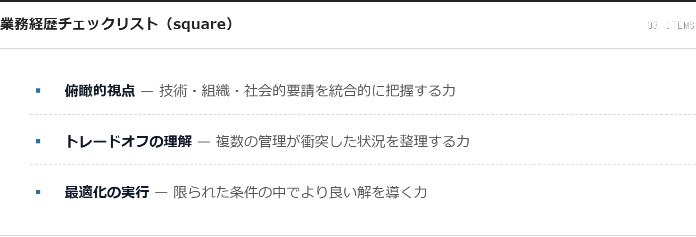
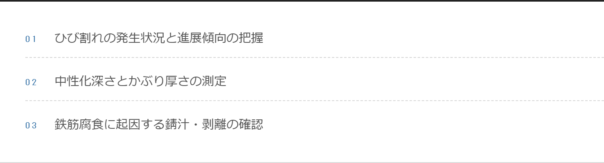

# SpecSheetList コンポーネント ギャラリー

doboku-note の `<SpecSheetList>` コンポーネントは、2026-04-22 の Claude Design ハンドオフ（box-handoff.zip）で導入された**仕様書調リスト**。点検項目・留意事項・手順などを整った体裁で列挙するための MDX コンポーネント。従来の `CustomOrderedList` / `CustomUnorderedList` を統合した単一コンポーネント。

**真実源**:
- 実装: [`src/components/ui/SpecSheetList/SpecSheetList.tsx`](../../src/components/ui/SpecSheetList/SpecSheetList.tsx)
- スタイル（CSS Modules）: [`src/components/ui/SpecSheetList/SpecSheetList.module.css`](../../src/components/ui/SpecSheetList/SpecSheetList.module.css)
- コンポーネント専用 README: [`src/components/ui/SpecSheetList/README.md`](../../src/components/ui/SpecSheetList/README.md)

---

## 共通デザイン仕様

- 上罫 **2px 実線**（`--ink`、`accent="brand"` 時は `--accent`）+ 外枠 1px（`--rule-soft`）
- 背景は `--paper`、角丸は `--radius-card-content`
- ヘッダー: タイトル（15px bold）
- 各行: `grid-template-columns: 20px 1fr` — 左マーカー + 右本文
- 行間の区切りは **破線 1px**（最終行のみ破線なし）
- 連番: system mono stack の `01` `02` でアクセントカラー（`--accent`）
- ダークモードは Editorial token の `.dark` 上書きで自動切替

---

## ordered（連番、01/02/03...）



- **用途**: 点検項目・手順・チェックリストなど順序のあるリスト
- **マーカー**: `01` `02` `03`... モノスペース連番、ブランドカラー

```mdx
<SpecSheetList
  title="コンクリート構造物の維持管理における点検項目"
  ordered
  items={[
    "ひび割れの発生状況と進展傾向の把握",
    "中性化深さとかぶり厚さの測定",
    "鉄筋腐食に起因する錆汁・剥離の確認",
    "塩化物イオン量の分析と劣化予測",
    "漏水・遊離石灰の析出痕跡の記録",
  ]}
/>
```

---

## unordered · dot



- **用途**: 順序を問わない一般的な箇条書き
- **マーカー**: 6px の円形ドット、ブランドカラー（デフォルト）

```mdx
<SpecSheetList
  title="施工時の安全確保に関する留意事項"
  ordered={false}
  marker="dot"
  items={[
    "重機稼働範囲内での作業員立入禁止",
    "高所作業における墜落防止措置の徹底",
    "掘削法面の安定勾配と土留め工の設置",
  ]}
/>
```

---

## unordered · dash



- **用途**: ミニマルな箇条書き（定義列挙・補足項目）
- **マーカー**: ダッシュ（—）

```mdx
<SpecSheetList
  title="補足項目"
  ordered={false}
  marker="dash"
  items={[...]}
/>
```

---

## unordered · square



- **用途**: チェックリスト風（旧 `CustomUnorderedList style="checklist"` の移行先）
- **マーカー**: 小さな四角（▪）

```mdx
<SpecSheetList
  title="業務経歴チェックリスト"
  ordered={false}
  marker="square"
  items={[...]}
/>
```

---

## ordered · タイトル省略



- **用途**: タイトルが不要・文脈で自明な場合
- **挙動**: ヘッダー（タイトル + カウント）が省略され、罫線とリストのみ表示

```mdx
<SpecSheetList
  ordered
  items={[...]}
/>
```

---

## Props

| Prop | Type | Default | 説明 |
|---|---|---|---|
| `title` | `string` | - | リストのタイトル（省略可） |
| `items` | `ListItem[]` | 必須 | `string` / `ReactNode` / `{ content: ReactNode }` |
| `ordered` | `boolean` | `true` | `true` = `<ol>` 連番、`false` = `<ul>` マーカー |
| `marker` | `"dot" \| "dash" \| "square"` | `"dot"` | unordered 時のマーカー形状 |
| `className` | `string` | `""` | 追加クラス名 |

## 旧コンポーネントからの移行（2026-04-22 実施済み）

| 旧書き方 | 新書き方 |
|---|---|
| `<CustomOrderedList title items />` | `<SpecSheetList title items ordered />` |
| `<CustomUnorderedList title items />` | `<SpecSheetList title items ordered={false} marker="dot" />` |
| `<CustomUnorderedList title style="checklist" items />` | `<SpecSheetList title items ordered={false} marker="square" />` |

既存 MDX 4 箇所（essay-exam-strategy × 2, exam-application-guide × 2）を移行済み。`CustomOrderedList` / `CustomUnorderedList` コンポーネント自体も削除済み。

---

## スクリーンショット再生成

デザインを変更した場合は以下で再生成できます:

1. 一時 MDX `content/site/_dev-speclist-gallery/article.mdx` に全バリエーションを記述（`published: true`）
2. `npm run dev` → `/docs/_dev-speclist-gallery` で表示
3. Playwright で `section[class*="SpecSheetList-module"][class*="root"]` を index 順に撮影
4. `docs/design/images/speclist-*.png` に保存・コミット
5. 一時 MDX を削除
