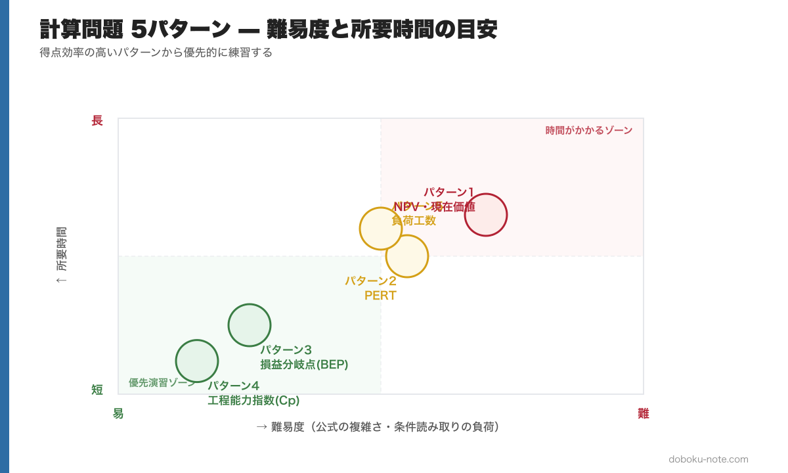
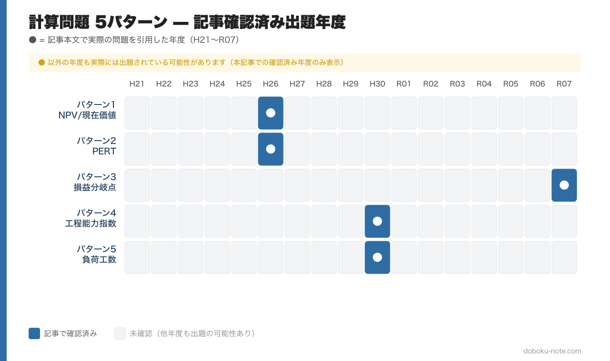

# 総監択一式 頻出計算問題 5パターン完全攻略｜毎年3〜5問を確実な得点源にする解法集

> **この記事でわかること**
> - 択一式で毎年出題される計算問題の5つの解法パターン
> - 各パターンの公式・解法手順と、実際の過去問による演習
> - 計算問題を「確実な得点源」にするための攻略法

---

計算問題は、総監択一式40問のうち毎年3~5問が出題されます。知識問題と異なり、解法パターンを押さえれば確実に正答できるため、合格者の多くが「落とさない問題」として重視しています。

本記事では、過去問の分析から抽出した 5 つの頻出パターンを、実際の出題を引用しながら解説していきます。各パターンに対し、**公式 → 解法手順 → 過去問演習 → よくある誤答パターン**の 4 段で整理しているので、順に読み進めれば計算問題を「考える前に手が動く」レベルまで定着します。

パターン4（工程能力指数）・パターン3（BEP）は公式当てはめで即答できるため、まずここから演習するのがおすすめです。パターン1（NPV）は条件の読み取りに時間がかかるため、基本を固めてから取り組みましょう。計算問題全体の出題分野・試験戦略については、[総合技術監理部門 合格戦略](https://doboku-note.com/docs/pe-comprehensive-management-exam-passing-strategy) も参考にしてください。

---

## パターン 1: NPV・現在価値計算

**出題分野: 経済性管理**

現在価値（PV）とは、将来のキャッシュフローを現在の価値に割り引いた金額のことです。NPV（正味現在価値）は、投資の経済性を評価する基本指標として、ほぼ毎年出題されます。

**基本公式**

将来時点tでのキャッシュフローCの現在価値:

PV = C / (1 + r)^t

- r: 割引率（年利率）
- t: 年数

毎年一定額Aが得られる場合の現在価値（年金現価係数を使用）:

PV = A x {1 - 1/(1+r)^n} / r

**解法の手順**

1. 各時点のキャッシュフロー（投資額・利益・残存価値）を整理します
2. すべてのキャッシュフローを「プロジェクト開始時点」の現在価値に換算します
3. 現在価値の合計を比較します（NPV > 0 なら投資は有利）

**過去問演習: 平成26年度 I-1-3**

問題: ある会社が機械を買取りかレンタルかで検討している。

条件:
- 考慮する期間: 3年
- 年利率: 10%
- 買取りの場合: 1年目の初めに1,000万円支払い、3年目の末に200万円で引き取ってもらえる
- レンタルの場合: 3年間、毎年の初めに均等に支払う

買取りによる現在価値に最も近くなる毎年のレンタル費用は?

選択肢: (1) 242万円 (2) 267万円 (3) 293万円 (4) 311万円 (5) 342万円

**解法**

まず買取りの現在価値を求めます。

3年目末の引取価格の現在価値:
K = 200 / (1.1)^3 = 200 / 1.331 = 150.26万円

買取りの正味現在価値:
P1 = 1,000 - 150.26 = 849.74万円

次にレンタルの現在価値を求めます。レンタルは毎年初め（期首）に支払うため、以下のようになります。
P2 = R + R/1.1 + R/(1.1)^2 = R x (1 + 0.9091 + 0.8264) = R x 2.7355

P1 = P2 とおくと:
R = 849.74 / 2.7355 = 311万円

**正答: (4) 311万円**

**得点のコツ**: 「年初支払い」か「年末支払い」かで現在価値の計算が変わります。問題文の条件を正確に読み取ることが最重要です。

類題は doboku-note の[平成26年度 択一式過去問](https://doboku-note.com/docs/pe-comprehensive-management-h26-primary)に解説付きで掲載しています。経済性管理の全体像は [経済性管理ピラー](https://doboku-note.com/docs/pe-comprehensive-management-economic-management-pillar) でまとめて確認できます。

## パターン2: PERT・クリティカルパス

**出題分野: 経済性管理（工程管理）**

PERT（Program Evaluation and Review Technique）は、プロジェクトの各作業の依存関係と所要時間から、最短完了時間とクリティカルパスを求める手法です。

**基本概念**

- 最早開始時刻（ES）: その作業を最も早く開始できる時刻
- 最早終了時刻（EF）: EF = ES + 所要時間
- 最遅終了時刻（LF）: その作業を最も遅くても終わらせなければならない時刻
- 最遅開始時刻（LS）: LS = LF - 所要時間
- トータルフロート（TF）: TF = LF - EF（余裕時間）
- クリティカルパス: TF = 0 の作業をつなげた経路（最長経路）

**解法の手順**

1. フォワードパス: 開始から終了に向かって、各作業のES・EFを求めます
2. バックワードパス: 終了から開始に向かって、各作業のLF・LSを求めます
3. TF = LF - EF で各作業の余裕時間を算出します
4. TF = 0 の作業を結んだ経路がクリティカルパスになります

**過去問演習: 平成26年度 I-1-4**

問題: あるプロジェクトの各作業の所要時間と先行作業が以下の通り。

| 作業名 | 所要時間 | 先行作業 |
|:---:|:---:|:---:|
| A | 2 | なし |
| B | 5 | なし |
| C | 7 | A, B |
| D | 4 | A, B |
| E | 1 | D |
| F | 6 | B |

**解法**

フォワードパス:
- A: ES=0, EF=2
- B: ES=0, EF=5
- C: ES=max(2, 5)=5, EF=12
- D: ES=max(2, 5)=5, EF=9
- E: ES=9, EF=10
- F: ES=5, EF=11

プロジェクト完了時刻=12。クリティカルパスはB→C（合計12）となります。

各選択肢を検証します。
1. 作業Aはクリティカルパス上にある → 誤り（B→Cが最長）
2. 作業Bの最遅終了時刻は6 → 誤り（LF=5: 12-7=5）
3. 作業Dの最早終了時刻は9 → 正しい（EF=5+4=9）
4. 作業Eの最早開始時刻は11 → 誤り（ES=9）
5. 作業Fのトータルフロートは2 → 誤り（TF=12-11=1）

**正答: (3)**

**得点のコツ**: 先行作業が複数ある場合、ESはその中の最大値をとります。ここを間違えると全体の計算がずれてしまうので注意してください。

PERT の類題も[平成26年度 択一式過去問](https://doboku-note.com/docs/pe-comprehensive-management-h26-primary)に収録されています。

## パターン3: 損益分岐点（BEP）

**出題分野: 経済性管理**

損益分岐点（Break-Even Point）は、売上高と総費用が等しくなる点のことで、利益がゼロになる売上高・売上数量を求める分析手法です。

**基本公式**

限界利益 = 販売価格 - 変動費（1個あたり）
限界利益率 = 限界利益 / 販売価格
変動費率 = 変動費 / 販売価格 = 1 - 限界利益率
損益分岐点売上高 = 固定費 / 限界利益率
目標利益達成売上高 = (固定費 + 目標利益) / 限界利益率

**過去問演習: 令和7年度 I-1-3**

問題: 企業Xが次期に販売する製品Yの条件は以下の通り。

- 販売価格: 1,000円/個
- 変動費: 400円/個
- 固定費: 384,000円
- 予定売上数量: 800個

この条件での損益分岐点の分析に関する記述のうち、最も適切なものは?

選択肢:
1. 売上数量が800個のときの利益は416,000円
2. 1個当たりの限界利益は520円
3. 変動費率は60%
4. 損益分岐点売上高は640,000円
5. 次期に利益150,000円を獲得するために必要な売上高は1,335,000円

**解法**

限界利益 = 1,000 - 400 = 600円/個
限界利益率 = 600 / 1,000 = 0.6（60%）
損益分岐点売上高 = 384,000 / 0.6 = 640,000円

各選択肢を検証していきます。
1. 利益 = (1,000 x 800) - (400 x 800) - 384,000 = 96,000円（416,000円ではない）
2. 限界利益 = 600円（520円ではない）
3. 変動費率 = 400 / 1,000 = 40%（60%は限界利益率であり混同）
4. 損益分岐点売上高 = 640,000円 --- 正しい
5. 必要売上高 = (384,000 + 150,000) / 0.6 = 890,000円（1,335,000円ではない）

**正答: (4)**

**得点のコツ**: 変動費率と限界利益率は補数の関係（合計100%）にあります。選択肢でこの2つを入れ替えた引っかけが頻出するので、必ず公式に当てはめて検算しましょう。

この問題の詳細解説は doboku-note の[令和7年度 択一式過去問](https://doboku-note.com/docs/pe-comprehensive-management-r07-primary)で確認できます。

## パターン4: 工程能力指数（Cp・Cpk）

**出題分野: 経済性管理（品質管理）**

工程能力指数は、製造工程が規格を満たす能力を定量的に評価する指標です。正規分布の性質と合わせて出題されます。

**基本公式**

Cp = (規格上限 - 規格下限) / (6 x 標準偏差)

Cpk = min{(規格上限 - 平均値) / (3 x 標準偏差), (平均値 - 規格下限) / (3 x 標準偏差)}

**正規分布との関係**

- Cp = 1.0 のとき、規格幅 = 6シグマ → 規格外の割合は約0.27%（両側合計）
- Cp = 1.33 のとき、規格幅 = 8シグマ → 規格外の割合は約0.006%
- 3シグマルール: 平均値から3シグマの範囲に全体の約99.73%が含まれる

**過去問演習: 平成30年度 I-1-1（選択肢3）**

問題の選択肢: 寸法規格が50+/-0.3mmである部品の寸法が平均50mm、標準偏差0.1mmの正規分布に従うとき、寸法規格を満たさない部品の全体に占める割合は1%以下である。

**解法**

規格幅 = 50.3 - 49.7 = 0.6mm
Cp = 0.6 / (6 x 0.1) = 1.0

Cp = 1.0 は規格幅が6シグマに等しいことを意味します。正規分布において、平均値から3シグマの範囲には約99.73%のデータが含まれます。つまり規格外の割合は約0.27%で、1%以下です。

**この選択肢は正しい（正答）です。**

**得点のコツ**: 「3シグマ = 99.73%」という数値を暗記しておけば、工程能力指数の問題は即座に判断できます。Cp = 1.0、Cp = 1.33、Cp = 1.67 の3段階を覚えておきましょう。

類題は doboku-note の[平成30年度 択一式過去問](https://doboku-note.com/docs/pe-comprehensive-management-h30-primary)に収録されています。

## パターン5: 負荷工数・残業時間の計算

**出題分野: 経済性管理（生産管理）**

負荷と能力のバランスを計算し、必要な残業時間を見積もる問題です。条件が多いですが、整理すれば四則演算で解けます。

**基本概念**

能力工数 = 作業者数 x 1日の就業時間 x 就業日数 x 出勤率
負荷工数 = 必要生産数 x 1個あたりの標準時間
必要生産数 = 計画良品数 / 良品率
総残業時間 = 負荷工数 - 能力工数

**過去問演習: 平成30年度 I-1-7**

問題: ある職場での来月の工数計算。以下の条件での総残業時間は?

条件:
- 作業者数: 10名
- 定時での1日あたり就業時間: 8時間
- 就業日数: 20日
- 作業者の平均出勤率: 95%
- 1人の作業者が1個を生産するための標準時間: 20分
- 来月の適合品の生産計画量: 4,900個
- 生産数量に対する適合品の数量の比率: 99%

選択肢: (1) 34時間 (2) 50時間 (3) 114時間 (4) 130時間 (5) 136時間

**解法**

能力工数 = 10名 x 8時間 x 20日 x 0.95 = 1,520時間

必要生産数 = 4,900 / 0.99 = 4,949.5 → 4,950個（端数切り上げ）

負荷工数 = 4,950 x (20/60) = 4,950 x 0.3333 = 1,650時間

総残業時間 = 1,650 - 1,520 = 130時間

**正答: (4) 130時間**

**得点のコツ**: 「分」を「時間」に換算する際のミス（20分 = 0.3333時間）と、良品率による必要生産数の割り戻し（計画良品数/良品率）がポイントです。条件を表に整理してから計算に入ると、見落としを防げます。

この問題の詳細解説は doboku-note の[平成30年度 択一式過去問](https://doboku-note.com/docs/pe-comprehensive-management-h30-primary)で確認できます。

## まとめ: 計算問題の攻略法

5つのパターンに共通する攻略法は以下の3点です。

1. **公式を正確に覚える** --- 応用力よりも基本公式の正確な記憶が重要です。試験本番で「公式がうろ覚え」では計算に入れません

2. **単位を揃える** --- 「分」と「時間」、「円」と「万円」、「年初」と「年末」。単位の不一致が計算ミスの最大原因になります

3. **選択肢から逆算する** --- 5択であることを活かしましょう。計算結果が選択肢のどれに最も近いかで判断できるため、端数処理に神経質になりすぎる必要はありません

計算問題はパターンが決まっているため、各パターン3~5問を演習すれば十分に対応できます。doboku-note には17年分の択一式過去問を全問解答解説付きで収録しているので、計算問題だけを横断的に演習する使い方もできます。まずは[試験インデックス](https://doboku-note.com/docs/pe-comprehensive-management-exam-index)から該当年度を選んで演習を始めてみましょう。

---

## 関連リソース

**doboku-note — 17 年分の過去問 + 650 キーワード解説（無料）**
https://doboku-note.com/category/pe-comprehensive-management

- 17 年分の択一式過去問（全問解答解説付き、計算問題だけを横断演習する使い方も可）
- 650 以上のキーワード解説ページ
- スマホ対応（通勤中の学習に最適）

**マガジン購入で割引（総監記述式 完全対策セット）**
- 本書 ¥980 + 総監の合否を分ける「トレードオフ思考」完全ガイド ¥1,200 + 総監記述式 論文骨子テンプレート ¥1,980 = 単品合計 ¥4,160
- セット価格 **¥3,480**（16% OFF）

**著者プロフィール**
土木技術者として 1 級土木施工管理技士・建設部門の技術士に合格後、2026 年に総合技術監理部門に挑戦。学習過程で蓄積した 700 キーワードの解説と 17 年分の過去問分析を doboku-note にて無料公開しています。
