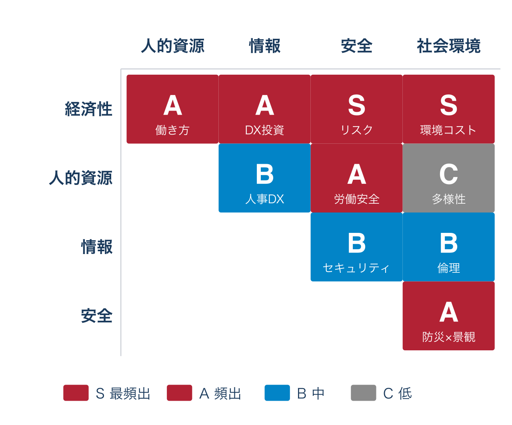
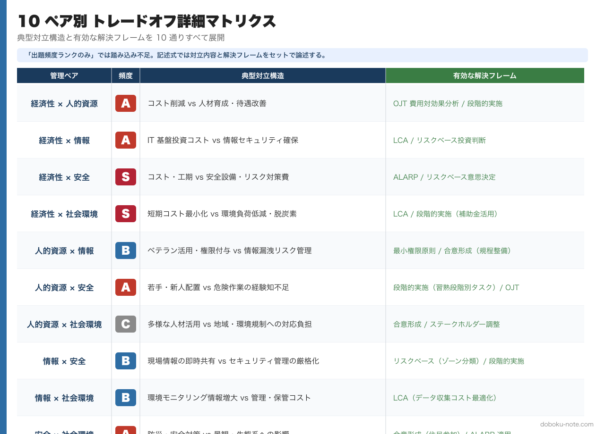
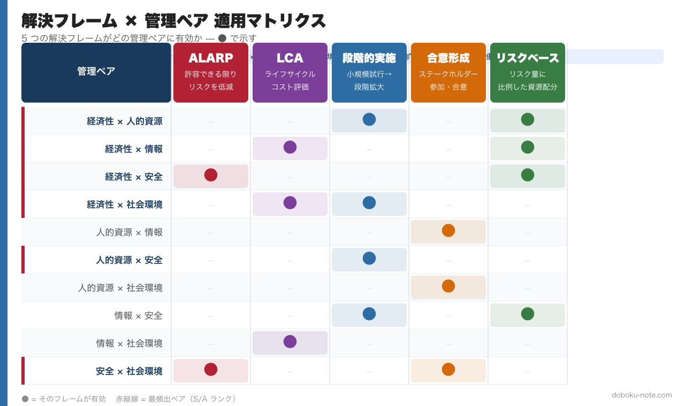

# 総監の合否を分ける「トレードオフ思考」完全ガイド｜5管理×10組み合わせのマトリクスで記述式を攻略

> **この記事でわかること**
> - トレードオフとは何か --- 5つの管理間の対立構造を正しく理解する
> - 5管理間トレードオフマトリクスの全体像（10通りの組み合わせ）
> - 日常業務と記述式答案でトレードオフ思考を使いこなす方法

---

総監試験の合否を分ける最大のポイントは「トレードオフ思考」だと言い切ってよいでしょう。択一式でも記述式でも口頭試験でも、5つの管理間で発生するトレードオフをどう認識し、どう調整するかが繰り返し問われます。

しかし、一般部門の合格者であっても「トレードオフ」という概念を正確に理解していないまま総監に挑む受験者は少なくありません。本記事では、トレードオフの基本から実践的な活用法まで、受験対策として必要な内容を体系的に整理していきます。

## 1. トレードオフとは何か

### 1.1 定義: 5つの管理間の対立構造

トレードオフとは、一方を改善しようとすると他方が悪化する関係のことです。総監の文脈では、**5つの管理（経済性管理・人的資源管理・情報管理・安全管理・社会環境管理）の間で生じる対立構造**を指します。

たとえば、土木工事で安全設備を充実させれば（安全管理の向上）、そのぶんコストが増加し工期が延びます（経済性管理の悪化）。これが最も典型的なトレードオフです。

ここで注意すべき点があります。**同一管理内での対立はトレードオフとは呼びません。** たとえば「品質を上げると工程が遅れる」は、どちらも経済性管理の範囲内の話であり、総監が求めるトレードオフには該当しません。試験で問われるのは、あくまで**異なる管理間**での対立です。

### 1.2 なぜトレードオフが総監の本質なのか

一般部門の技術士は、専門技術を深く掘り下げて最適な解決策を提示する能力が求められます。それに対して総監技術士は、業務全体を俯瞰し、複数の管理分野にまたがる要求事項を総合的に判断・調整する能力が求められます。

この「総合的な判断・調整」こそがトレードオフの処理にほかなりません。5 つの管理すべてを 100% 満たすことは現実には不可能であり、限られた資源の中でどの管理を優先し、どこで妥協するかを判断する --- それが総監技術士の仕事です。

本記事では、トレードオフを **(1) 具体例 3 選で実感 → (2) 5 管理 × 10 組み合わせのマトリクスで俯瞰 → (3) 第三の管理で解決する 4 段フレーム → (4) 日常業務での発見・記述式答案への組み込み** の順に体系化していきます。

## 2. トレードオフの具体例 3 選

抽象的な理解だけでは試験に対応できません。実務で発生する具体的なトレードオフを3つ示します。

### 例1: 土木工事の安全設備（経済性管理 vs 安全管理）

建設現場における安全設備の設置は、安全管理の根幹です。しかし、安全設備の充実はそのままコスト増と工期延長につながります。

- **経済性管理の要求**: コスト抑制・工期厳守
- **安全管理の要求**: 安全設備の万全な整備
- **対立の本質**: 安全性の確保がそのまま経済的負担になる

この対立は、あらゆる建設プロジェクトで日常的に発生します。総監技術士として重要なのは、この対立を「仕方のないもの」として受け流すのではなく、明確に認識した上で判断の根拠を示すことです。

### 例2: ベテラン活用と情報漏洩リスク（人的資源管理 vs 情報管理）

経験豊富なベテラン技術者に重要な業務を任せたい。しかし、アクセス権限を広く付与すればするほど、情報漏洩のリスクが高まります。

- **人的資源管理の要求**: ベテランの知識・経験を最大限に活用したい
- **情報管理の要求**: 情報セキュリティを確保し、漏洩リスクを最小化したい
- **対立の本質**: 人材活用と情報管理の厳格化が相反する

近年のDX推進やテレワーク普及に伴い、この種のトレードオフは増加傾向にあります。択一式でも出題されやすいテーマです。

### 例3: エネルギーの安定供給と環境負荷（経済性管理 vs 社会環境管理）

社会インフラの維持にはエネルギーの安定供給が不可欠ですが、化石燃料への依存は環境負荷を増大させます。

- **経済性管理の要求**: エネルギーの安定かつ経済的な供給
- **社会環境管理の要求**: 環境負荷の低減・脱炭素
- **対立の本質**: 短期的な経済合理性と長期的な環境保全が対立する

このトレードオフは社会全体のスケールで議論されるものですが、総監の記述式では個別のプロジェクトレベルに落とし込んで論じることが求められます。

## 3. 5 管理間トレードオフマトリクス

5 つの管理のあらゆる組み合わせ --- 全 10 通り --- でトレードオフが発生しえます。下図は、過去 10 年（H27〜R6）の記述式・択一複合問題における各ペアの **出題頻度** をヒートマップで示したものです（**S = 最頻出 / A = 頻出 / B = 中 / C = 低**）。

経済性管理を片側に含むペア 4 本（経済性 × 人的資源・情報・安全・社会環境）がすべて S または A で、これだけで全出題の約 6〜7 割を占めます。次いで安全 × 社会環境（防災 × 景観）と人的資源 × 安全（労働安全）が頻出。記述式対策では左上から右下に向けて優先度を下げて学習配分すれば効率的です。

出題頻度だけでなく、**各ペアで何が対立しているのか・どう解決するのか**まで把握することが記述式攻略の鍵です。下図に 10 通りすべての「典型対立構造」と「有効な解決フレーム」を展開しました。

以下、各管理間で生じる典型的な対立構造を表で整理します。

| | 人的資源管理 | 情報管理 | 安全管理 | 社会環境管理 |
|---|---|---|---|---|
| **経済性管理** | 能力向上の仕組みを作るとコスト増 | 情報基盤整備でコスト増 | 安全確保にはコスト増 | 環境負荷抑制にはコスト増 |
| **人的資源管理** | --- | 情報管理の厳格化がモチベーションに影響 | 安全確保の徹底が若手の経験機会を減らす | 環境配慮の徹底が若手の経験機会を減らす |
| **情報管理** | --- | --- | 安全確保の徹底で情報量が増大し管理が困難に | 環境状況把握に必要な情報量の増大 |
| **安全管理** | --- | --- | --- | 環境負荷抑制と安全確保が相反する場面がある |

このマトリクスを「暗記する」必要はありません。重要なのは、**自分の業務経験の中にこの10通りのどれが当てはまるかを考えられるようになること**です。記述式では、与えられた事例に対してこのマトリクスのどの部分が問われているかを素早く判断し、論述に組み込むことが求められます。

このマトリクスの詳細な解説や過去問出題パターンは、[doboku-note の 5 管理間トレードオフ解説ページ](https://doboku-note.com/docs/pe-comprehensive-management-management-tradeoffs)で確認できます。doboku-note では 17 年分の択一式・記述式データをもとに各ペアの頻出パターンを整理しています。

## 4. トレードオフ改善の考え方 --- 第三の管理で解決する

トレードオフを認識した次のステップは、それをどう「改善」するかです。ここで総監特有の発想が求められます。

### 4.1 二者間の調整ではなく、第三の視点を持ち込む

一般的なトレードオフの処理は「どちらかを優先し、もう一方を妥協する」というものです。しかし総監では、**対立する2つの管理とは別の管理の視点を持ち込むことで、対立そのものを緩和する**アプローチが評価されます。

たとえば、経済性管理と安全管理のトレードオフを考えてみましょう。「コストを優先して安全対策を削減する」でも「安全を優先してコスト超過を受け入れる」でもなく、**情報管理を活用**して現場調査を行い、費用対効果の高い安全機器を特定する --- というのが総監的な解決策です。

このように、ある管理間の対立を第三の管理の視点から解決する発想は、記述式で最も高く評価されるパターンです。

### 4.2 解決フレームの種類と使い分け

「第三の管理を持ち込む」といっても、具体的にどう持ち込むかが問われます。総監の記述式で頻出の解決フレームは次の 5 つです。

- **ALARP**（As Low As Reasonably Practicable）: リスクを合理的に可能な限り低減する。安全管理と経済性管理の対立に最も有効
- **LCA**（ライフサイクルコスト評価）: 初期コストだけでなく維持管理・廃棄まで含めた総コストで評価。経済性管理と社会環境管理の対立に有効
- **段階的実施**: 小規模な試行から始め、効果を確認しながら拡大。経済性管理と人的資源管理・情報管理の対立に有効
- **合意形成**: ステークホルダーを巻き込み、納得のもとで意思決定。人的資源管理・社会環境管理との対立に有効
- **リスクベース意思決定**: リスクの大きさに応じて資源を優先配分。経済性管理と安全管理の対立に有効

下図は、この 5 つのフレームが 10 の管理ペアに対してどう適用できるかをまとめたものです。

5 つの解決フレームの詳細な使い方や実際の記述例は、[doboku-note の記述式戦略ページ](https://doboku-note.com/docs/pe-comprehensive-management-essay-exam-strategy)にまとめています。答案の骨格として活用してください。

### 4.3 改善のステップ

トレードオフ改善の思考プロセスは、次のステップで整理できます。

1. **対立する2つの管理を明確にする** --- 「何と何が対立しているのか」を言語化する
2. **対立の原因を分析する** --- なぜ対立が生じているのか、制約条件は何か
3. **第三の管理を検討する** --- 残り3つの管理のうち、この対立を緩和できる視点はないか
4. **具体的な対策を提示する** --- 解決フレーム（ALARP / LCA / 段階的実施 等）を名指しして適用方法を示す
5. **残留リスクを評価する** --- 改善策を講じてもなお残るリスクを認識する

このステップは、記述式の答案構成にそのまま使えます。

## 5. 日常業務でトレードオフを見つける練習法

試験対策は机上の学習だけでは十分ではありません。日常業務の中にトレードオフを見出す習慣をつけることが、記述式対策に直結します。

### 5.1 キーワード置き換え法

毎日の業務で直面する課題を、キーワード集の用語に置き換えてみましょう。

たとえば、「今日の会議で人手不足の話が出た」という場面を、次のように変換します。

- 「人手不足」→ 人的資源管理における人材活用計画の課題
- 「残業を増やして対応しよう」→ 経済性管理（原価管理）との間にトレードオフが発生
- 「新人に任せるのは不安」→ 人的資源管理と安全管理のトレードオフ
- 「外注に出すか」→ 人的資源管理のアウトソーシング。ただし情報管理（機密保持）との対立も

日常のあらゆる業務判断には、意識すれば5つの管理間のトレードオフが潜んでいます。これを見つける目を養うことが、試験対策の最も効果的な方法です。

### 5.2 週1回の振り返り

毎週末に10分間、その週の業務を5つの管理の視点で振り返る習慣をつけてみてください。

具体的には、次の問いを自分に投げかけます。

- 今週、どの管理分野に最も時間を使ったか
- 異なる管理間で対立が発生した場面はなかったか
- その対立をどう判断したか。別の判断はあり得たか

この振り返りを半年続ければ、記述式で問われる「総監の視点による分析・提言」のストックが自然と蓄積されます。

## 6. 記述式での活用 --- トレードオフを答案の核に据える

### 6.1 記述式の出題構造

総監の記述式は、以下の構成で出題されます。

1. 事例の提示（建設プロジェクト等の具体的なシナリオ）
2. 5管理の視点での課題整理
3. 管理間のトレードオフの分析
4. 総合的な対策・提言

見てのとおり、トレードオフの分析は記述式の中核を成します。ここで説得力のある論述ができるかどうかが合否を分けます。

### 6.2 答案へのトレードオフの組み込み方

記述式の答案にトレードオフを組み込む際は、以下の構造が有効です。

**第1段階: 5管理の視点で課題を洗い出す**

与えられた事例を5つの管理の視点でスキャンし、各管理における課題を列挙します。この段階ではまだトレードオフに踏み込まず、個別の課題を整理しましょう。

**第2段階: トレードオフを特定する**

洗い出した課題の中から、異なる管理間で対立関係にあるものを特定します。マトリクスの10通りのうち、事例に最も関連するトレードオフを2〜3組選びます。

**第3段階: 第三の管理で解決策を提示する**

選んだトレードオフに対し、前述の「第三の管理で解決する」アプローチを適用します。具体的な管理技術の名称（PERT、リスクアセスメント、OJT等）を挙げながら、実現可能な対策を示します。

**第4段階: 残留リスクと継続的改善**

対策を講じた後にも残るリスクを明示し、モニタリングや改善の方向性を示します。ここまで書けると、答案の完成度は大きく上がります。

### 6.3 よくある失敗

- **トレードオフが同一管理内にとどまっている** --- 品質と工程のトレードオフ（いずれも経済性管理）を挙げてしまう。必ず異なる管理間の対立を示しましょう
- **トレードオフを認識するだけで終わっている** --- 対立を指摘しただけでは不十分です。改善策まで踏み込みましょう
- **解決策が一般論にとどまっている** --- 「安全に配慮する」ではなく、具体的な手法（リスクアセスメントの結果に基づく安全機器の選定等）を示しましょう

記述式答案でトレードオフをどう論述するかの実践的なテクニックは、[doboku-note の記述式戦略ページ](https://doboku-note.com/docs/pe-comprehensive-management-essay-exam-strategy)で詳解しています。また、過去問を使った実践的な対策は [択一式・記述式 過去問一覧](https://doboku-note.com/docs/pe-comprehensive-management-exam-index) から取り組めます。17 年分の過去問を解きながら、トレードオフ思考を鍛えてみてください。

なお、5 管理それぞれの守備範囲・典型キーワードを先に押さえておくと、マトリクスの理解が深まります。たとえば安全管理の ALARP や社会環境管理の LCA は、それぞれの管理ピラーで詳しく解説しています --- [安全管理ピラー](https://doboku-note.com/docs/pe-comprehensive-management-safety-management-pillar) / [社会環境管理ピラー](https://doboku-note.com/docs/pe-comprehensive-management-social-environment-management-pillar)。

---

トレードオフ思考は、試験対策としてだけでなく、実務における意思決定の質を高めるスキルでもあります。5つの管理のフレームワークを日常的に意識することで、総監技術士にふさわしい俯瞰的な判断力が身についていきます。試験勉強が実務能力の向上にもつながる --- それが総監試験の本質的な価値だと考えています。

---

## 関連リソース

**doboku-note — 17 年分の過去問 + 650 キーワード解説（無料）**
https://doboku-note.com/category/pe-comprehensive-management

- 17 年分の択一式過去問（全問解答解説付き）
- 650 以上のキーワード解説ページ
- 5 管理間トレードオフの解決フレーム（[詳細記事](https://doboku-note.com/docs/pe-comprehensive-management-management-tradeoffs)）
- スマホ対応（通勤中の学習に最適）

**マガジン購入で割引（総監記述式 完全対策セット）**
- 本書 ¥1,200 + 総監択一式 頻出計算問題 5 パターン完全攻略 ¥980 + 総監記述式 論文骨子テンプレート ¥1,980 = 単品合計 ¥4,160
- セット価格 **¥3,480**（16% OFF）

**著者プロフィール**
土木技術者として 1 級土木施工管理技士・建設部門の技術士に合格後、2026 年に総合技術監理部門に挑戦。学習過程で蓄積した 700 キーワードの解説と 17 年分の過去問分析を doboku-note にて無料公開しています。
