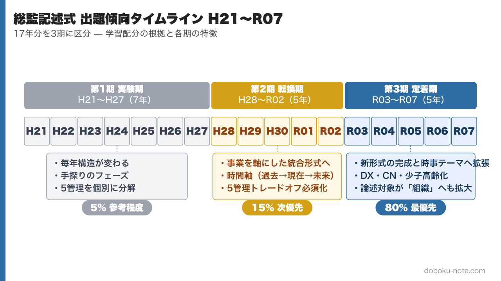
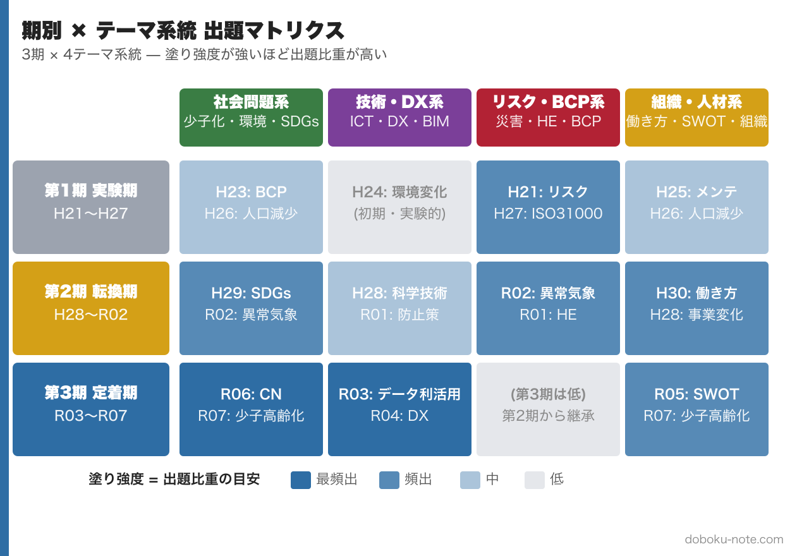
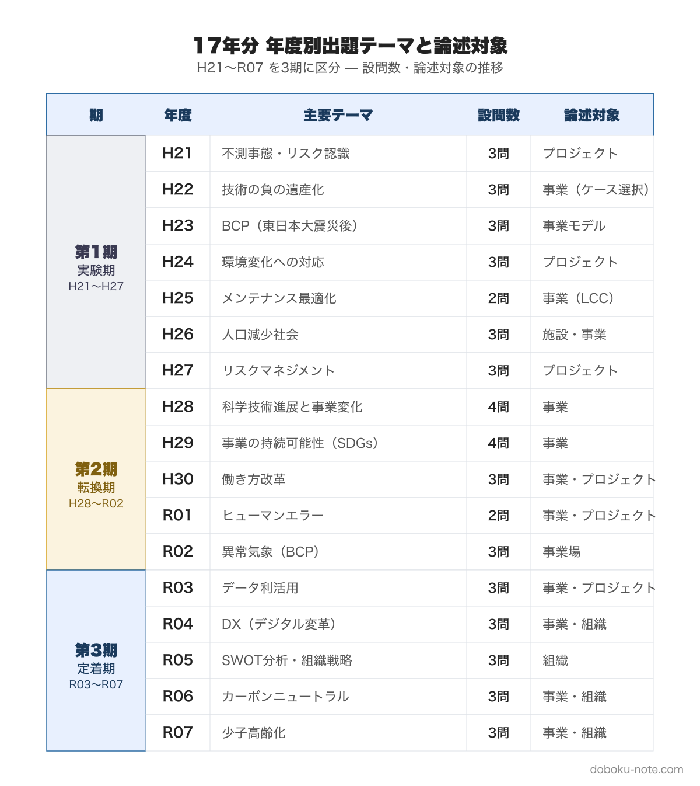

# 総監記述式 出題傾向の変遷マップ｜H21〜R07 17年分を3期に区分して読み解く完全ガイド

**この記事でわかること**

- 総監記述式（必須科目 I-2）の出題形式は 3〜5 年周期で大きく変化してきた --- その背景と作問委員任期との連動
- 17 年分を「実験期・転換期・定着期」の 3 期に区分したうえでの各期の特徴と共通点
- どの年度にどれだけの学習時間を投じるべきか --- 第 3 期 80%・第 2 期 15%・第 1 期 5% の根拠
- 過去問を読む推奨順序と、第 1 期の中から「現代に最も連結しやすい 2 年」の抽出

---

総監記述式必須問題は、表面的には毎年似たように見えて、実は作問委員の任期（平成 28 年度以前は 3 年、以降は 5 年）に連動して **出題スタイルが大きく入れ替わってきました**。古い年度を見ないと「現在の形式が何から変わってきたのか」という感覚が掴めず、逆に古い年度に時間を投じ過ぎると現代の形式練習が手薄になります。

本記事は 17 年分を 3 つの期に区分し、各期の特徴・共通点・現在の受験者への示唆を整理します。学習の優先順位付けと、過去問を読む順序の判断材料としてご活用ください。

【画像挿入位置】figure-1-timeline.png — 17年分を3期に区分したタイムライン

## 0. 結論サマリ（先に読みたい人向け）

時間がない方は、ここだけ押さえれば十分です。

- **学習配分の推奨**: 第 3 期（R03〜R07）に **80%**、第 2 期（H28〜R02）に **15%**、第 1 期（H21〜H27）は **5%** で十分
- **第 3 期の特徴**: DX・データ利活用・カーボンニュートラル・少子高齢化など **時事テーマを総監の枠組みで処理する形式** が定着。R08 もこの延長線上にあると推定される
- **第 2 期の役割**: 「事業を軸にした統合問題」の原点。形式の DNA を理解するために H28・H29・R02 の 3 年だけ読めば足りる
- **第 1 期から拾うべき 2 年**: H26（人口減少社会）と H23（BCP）。テーマがそのまま現代の論点に転用可能
- **作問委員任期との連動**: 平成 28 年度以前は **3 年任期**、以降は **5 年任期**。形式の変化はこの任期の節目で起きてきた

以下、3 期それぞれの特徴と過去問リンクを順に整理していきます。

---

## 1. なぜ 17 年分を俯瞰するのか

過去問学習を始めるとき、多くの受験者は「新しい年度だけ見ればよい」と考えがちです。しかし総監記述式は、作問委員の任期に連動して出題スタイルが切り替わるため、古い年度を見ないと「現在の形式が何から変わってきたのか」という感覚が掴めません。

また、過去のテーマは形式が違っても **現在の頻出テーマ（[BCP](https://doboku-note.com/docs/pe-comprehensive-management-business-continuity-plan)・[インフラ老朽化](https://doboku-note.com/docs/pe-comprehensive-management-aging-infrastructure)・[リスクマネジメント](https://doboku-note.com/docs/pe-comprehensive-management-risk-management-system)・人材不足など）の原点** になっているケースが多いです。各年度の「問い方の違い」と「テーマの普遍性」を切り分けて読むことが、学習効率を高める近道となります。

本記事は、17 年分の過去問を次の 3 期に区分して整理します。

- **第 1 期 H21〜H27（実験期）** --- 毎年構造が変わる手探りのフェーズ
- **第 2 期 H28〜R02（転換期）** --- 事業を軸にした統合形式への移行
- **第 3 期 R03〜R07（定着期）** --- 新形式の完成と時事テーマへの拡張

【ここからマガジン限定】

## 2. 17 年分の俯瞰マップ

下図は 17 年分を 3 期に区分し、各期のテーマ系統と出題比重を整理したものです。記述式の学習計画を立てる際の全体地図としてご活用ください。

【画像挿入位置】figure-2-theme-matrix.png — 期別×テーマ系統マトリクス（3期×4系統）

各年度の詳細（年度・主要テーマ・設問数・論述対象）は次の表で確認できます。

【画像挿入位置】figure-3-period-yearly-table.png — 17年分の年度別表（期×年度×テーマ×設問数×論述対象）

**補足: 作問委員任期との連動**

出題内容は **3〜5 年周期で変化** します。これは作問委員の任期が平成 28 年度以前は 3 年、以降は 5 年であることと対応しており、SUKIYAKI 塾も同様の分析を公開しています。上図で「期」が切り替わるポイントは、ほぼ作問委員の入れ替わりと一致します。

## 3. 第 1 期（H21〜H27）──実験期

この期は、記述式の問い方が **年ごとに大きく揺らいでいる** のが特徴です。「総監らしさ」をどう問題で表現するかを作問側が模索していた時期と解釈できます。

### 3.1 各年度のテーマと構造

**H21「不測事態・リスク認識」** --- プロジェクトで過去に発生した不測事態を取り上げ、影響と原因を分析し、将来への前提設定を [5 管理](https://doboku-note.com/docs/pe-comprehensive-management-management-tradeoffs)の観点から 3 つ選んで論じる。受験者の実経験に強く依拠する設問構成。

**H22「技術の負の遺産化」** --- エコカー・超高層ビル・大規模博物館という 3 つのケースから 1 つを選び、事業の社会的便益と、前提条件変化で顕在化するデメリットを評価する。**ケース選択式** の導入年。

**H23「BCP（東日本大震災後）」** --- 東日本大震災の直後に出題された、総監史上もっとも時事性が高い問題の 1 つ。製造業／建設業の 2 ケースから選び、事業モデルに対する脅威シナリオを 3 つ設定させる **シナリオ分析型**。

**H24「環境変化への対応」** --- 新製品開発／新システム開発／建設工事／地域開発計画から 1 つを選び、実施中に発生した課題に対する **複数案（3 案）比較検討** を求める。トレードオフ分析が明示的に要求された初期の年。

**H25「メンテナンス最適化」** --- [ライフサイクル](https://doboku-note.com/docs/pe-comprehensive-management-lifecycle-management)全体（計画・施工・運保）を 3 ステージに分けて課題を抽出させる **ライフサイクル分析型**。設問数が 2 問に圧縮され、1 問あたりの論述密度が上がった。

**H26「人口減少社会」** --- 施設更新計画を題材に、人口減少による社会影響と対応策を問う。**現代の頻出テーマ（R07）の原型** と言える問い方。

**H27「リスクマネジメント」** --- 国際イベントに関連するプロジェクトを取り上げ、ISO 31000 のリスクマネジメント枠組みに沿って主要リスク 4 つを特定・分析する。時間軸がイベント終了後まで拡張されている。

### 3.2 第 1 期の共通点と課題

- **5 管理を個別に分解する発想** が強く、統合的な俯瞰よりも「どの管理領域で何が起きるか」を 1 つずつ論じる構造
- **ケース選択式・シナリオ分析・複数案比較** など、毎年違う「仕掛け」が用意される。受験者は当日の問題を見るまで論文の骨格を決められず、対策が難しい年度が多い
- 問題文が短めで、受験者の裁量（事業設定・ケース選択）が大きい

**現在の受験者への示唆**: 第 1 期の過去問は「形式の練習」にはそのまま使えませんが、**各年のテーマ（リスク・メンテナンス・人口減少・BCP）は令和期と地続き** なので、論点抽出の訓練素材として読むと効果的です。特に H26（人口減少社会）と H23（BCP）は現代との接続性が高く、問題文と設問を確認するだけで十分な価値があります → [平成26年度 記述式（doboku-note）](https://doboku-note.com/docs/pe-comprehensive-management-h26-secondary)・[平成23年度 記述式](https://doboku-note.com/docs/pe-comprehensive-management-h23-secondary)

## 4. 第 2 期（H28〜R02）──転換期

この期で、総監記述式は **現在の基本形に相当する形式** へ大きく転換しました。SUKIYAKI 塾の分析では「2016〜2020 は体験業務・事業を題材に、事業継続リスクへの対応を問う期」と整理されています。

### 4.1 各年度のテーマと構造

**H28「科学技術進展と事業変化」** --- あなたが知る事業を 1 つ取り上げ、**最近の技術導入** が事業形態をどう変えたか、さらに **遠からぬ将来・さらに遠い将来** に想定される新技術との関係を論じる。設問数は 4 問に増え、時間軸が過去〜現在〜未来へ拡張された転換点。

**H29「事業の持続可能性（SDGs）」** --- 2015 年の [SDGs](https://doboku-note.com/docs/pe-comprehensive-management-sdgs) 採択を受け、事業を取り上げて **過去・現在・将来の課題** をそれぞれ詳述し、5 管理の視点から解決方策を提案する。H28 の時間軸拡張路線を継承。

**H30「働き方改革」** --- 平成 29 年の[働き方改革](https://doboku-note.com/docs/pe-comprehensive-management-work-life-balance)実行計画を背景に、事業・プロジェクトの現在の課題を 2 つ取り上げ、技術や方策で解決する道筋を論じる。**社会制度の変化と事業実務を接続** する設問。

**R01「ヒューマンエラー」** --- 事業・プロジェクトを 1 つ取り上げ、計画段階と実施段階それぞれで発生した[ヒューマンエラー](https://doboku-note.com/docs/pe-comprehensive-management-human-error-probability)事例を分析し、今後の新技術による防止策を提案する。設問数が 2 問に圧縮され、1 問あたりの論述密度が最大化した年。

**R02「異常気象（BCP）」** --- [異常な自然現象](https://doboku-note.com/docs/pe-comprehensive-management-disaster-prevention)（暴風・豪雨・地震・津波等）を 1 つ選び、事業場が受ける主要な被害 3 つ（A・B・C）と対策（A0/A1... のラベル付き）を示す。**ラベル付与形式** が新たに登場。

### 4.2 第 2 期の共通点

- 論述対象が **「事業」または「事業場」** に統一された（第 1 期の「プロジェクト単位」からの大転換）
- **時間軸の拡張**（過去 → 現在 → 未来）が定着
- 問題文が長く、受験者の裁量は狭まり、**論文の骨格を事前に準備できる** ようになった。第 1 期と比べて対策難易度は大幅に下がった
- **5 管理のトレードオフ分析** を答案内に盛り込むことが半ば必須化

**現在の受験者への示唆**: 第 2 期は現在の形式の原点であり、**そのまま答案練習に使える**。特に H30（働き方改革）・R01（ヒューマンエラー）・R02（BCP）は令和期の過去問として最も学習価値が高いです → [平成30年度 記述式（doboku-note）](https://doboku-note.com/docs/pe-comprehensive-management-h30-secondary)・[令和2年度 記述式](https://doboku-note.com/docs/pe-comprehensive-management-r02-secondary)

## 5. 第 3 期（R03〜R07）──定着期

第 2 期の形式を維持しつつ、時事性の高いテーマへ拡張した期です。本サイトが最も力を入れて模範論文例を掲載している範囲でもあります。

### 5.1 各年度のテーマ

**R03「データ利活用」** --- AI・IoT・ビッグデータを事業に取り入れる際の 5 管理視点を問う。第 2 期形式を維持。

**R04「DX（デジタル変革）」** --- 単なるデジタル化ではなく「変革」としての DX を、事業の変遷とともに論じる。R03 のデータ活用テーマを発展させた形。

**R05「SWOT 分析・組織戦略」** --- 論述対象が **「組織」** へシフトし、[SWOT 分析](https://doboku-note.com/docs/pe-comprehensive-management-swot-analysis)の枠組みをベースに組織戦略を立案させる構造。作問委員の入れ替わりを感じさせる新展開。

**R06「カーボンニュートラル」** --- 2050 年 [カーボンニュートラル](https://doboku-note.com/docs/pe-comprehensive-management-climate-change-decarbonization)に向けた事業戦略を 5 管理の視点から論じる。**社会環境管理の比重が増大** した年。

**R07「少子高齢化」** --- 日本社会全体の構造課題を事業に落とし込む問題。H26「人口減少社会」のリバイバルとも読めます。

### 5.2 第 3 期の特徴

- テーマは **DX・データ・CN・少子高齢化** など国策・時事課題に寄り、受験者には「日頃からニュースを追う力」が求められるようになった
- 論述対象は **「事業」「組織」** が主で、R05 から組織論が本格化
- 設問構造は 3 問に収斂。第 1 期のようなケース選択や複数案検討は姿を消し、**安定した定型** が完成している

**現在の受験者への示唆**: R03〜R07 は直近 5 年分として **最優先で学習すべき範囲** です。特に R04〜R07 は本サイトにも複数パターンの模範論文例を掲載しているので、自分の専門科目に近いものを参考にしてください。時事テーマへの対処法（「総監の枠組みで処理する」具体的な方法）は [記述式 論文戦略（doboku-note）](https://doboku-note.com/docs/pe-comprehensive-management-essay-exam-strategy) にまとめています。また直近の R07 過去問は [令和7年度 記述式（少子高齢化）](https://doboku-note.com/docs/pe-comprehensive-management-r07-secondary) から確認できます。

## 6. 受験者への実践的示唆

これから総監記述式を受験する人が、17 年分のうちどの年度にどれだけ時間を投じるべきか。本記事の分析を踏まえた推奨配分は次のとおりです。

- **最優先（80% の学習時間を投じる）**: R03〜R07 の直近 5 年分。現在の形式・テーマの中心
- **次優先（15%）**: H28〜R02 の第 2 期 5 年分。形式の原点を押さえる。特に H30・R01・R02 は頻出テーマの基礎として有効
- **参考程度（5%）**: H21〜H27 の第 1 期 7 年分。**そのままの形式練習には使えません** が、テーマ（BCP・リスクマネジメント・人口減少・メンテナンス）は現代と地続きなので、論点抽出の素材として 1〜2 年分だけ読むと理解が深まります

### 6.1 読む順番の推奨

1. まず **R07** から逆順に R03 まで読んで現在の形式を体得する
2. 次に **R02 → R01 → H30** と遡って形式の原点を確認する
3. 最後に余裕があれば **H25（メンテナンス最適化）・H27（リスクマネジメント）** を **参考資料** として読む（第 1 期の中で現代に最も連結しやすい 2 年）

## 7. 各年度ページへのリンク

各年度の問題文と、掲載済みの模範論文例は以下のリンクから参照できます（doboku-note サイト）。

### 7.1 第 3 期（R03〜R07）

- [令和 7 年度 記述式](https://doboku-note.com/docs/pe-comprehensive-management-r07-secondary) --- 少子高齢化
- [令和 6 年度 記述式](https://doboku-note.com/docs/pe-comprehensive-management-r06-secondary) --- カーボンニュートラル
- [令和 5 年度 記述式](https://doboku-note.com/docs/pe-comprehensive-management-r05-secondary) --- SWOT 分析・組織戦略
- [令和 4 年度 記述式](https://doboku-note.com/docs/pe-comprehensive-management-r04-secondary) --- DX
- [令和 3 年度 記述式](https://doboku-note.com/docs/pe-comprehensive-management-r03-secondary) --- データ利活用

### 7.2 第 2 期（H28〜R02）

- [令和 2 年度 記述式](https://doboku-note.com/docs/pe-comprehensive-management-r02-secondary) --- 異常気象（BCP）
- [令和元年度 記述式](https://doboku-note.com/docs/pe-comprehensive-management-r01-secondary) --- ヒューマンエラー
- [平成 30 年度 記述式](https://doboku-note.com/docs/pe-comprehensive-management-h30-secondary) --- 働き方改革
- [平成 29 年度 記述式](https://doboku-note.com/docs/pe-comprehensive-management-h29-secondary) --- 事業の持続可能性（SDGs）
- [平成 28 年度 記述式](https://doboku-note.com/docs/pe-comprehensive-management-h28-secondary) --- 科学技術進展と事業変化

### 7.3 第 1 期（H21〜H27）

- [平成 27 年度 記述式](https://doboku-note.com/docs/pe-comprehensive-management-h27-secondary) --- リスクマネジメント
- [平成 26 年度 記述式](https://doboku-note.com/docs/pe-comprehensive-management-h26-secondary) --- 人口減少社会
- [平成 25 年度 記述式](https://doboku-note.com/docs/pe-comprehensive-management-h25-secondary) --- メンテナンス最適化
- [平成 24 年度 記述式](https://doboku-note.com/docs/pe-comprehensive-management-h24-secondary) --- 環境変化への対応
- [平成 23 年度 記述式](https://doboku-note.com/docs/pe-comprehensive-management-h23-secondary) --- BCP
- [平成 22 年度 記述式](https://doboku-note.com/docs/pe-comprehensive-management-h22-secondary) --- 技術の負の遺産化
- [平成 21 年度 記述式](https://doboku-note.com/docs/pe-comprehensive-management-h21-secondary) --- 不測事態・リスク認識

## 8. まとめ

- 総監記述式は **3〜5 年周期で出題形式が変化** してきた。作問委員の任期と連動する
- **H28 を境に「事業を軸にした統合問題」** へ大転換し、現在の形式が定着した
- 学習の中心は **第 3 期（R03〜R07）**。第 2 期（H28〜R02）は形式の原点として押さえ、第 1 期（H21〜H27）は参考資料として 1〜2 年分に絞って読めば十分
- テーマ自体は形式と独立に普遍性を持っているため、第 1 期の「人口減少」「BCP」「リスクマネジメント」は現代の出題と地続きで、論点整理の素材として使える

本記事の分析を踏まえて、自分の受験時期と残り時間に合わせた学習配分を設計してください。

---

## 関連リソース

**doboku-note — 17 年分の過去問 + 650 キーワード解説（無料）**
https://doboku-note.com/category/pe-comprehensive-management

- 17 年分の論文過去問（H21〜R07 全題収録）
- 650 以上のキーワード解説ページ
- スマホ対応（通勤中の学習に最適）

**さらに深掘りする note**
- 総監記述式 論文骨子テンプレート｜テーマ駆動・5 管理横串フレームワーク（A-1）¥1,980 — 5 枚構成の章立て + 主要 5 テーマ × 5 管理マッピング集 + 定型フレーズ集
- 総監の合否を分ける「トレードオフ思考」完全ガイド ¥1,200 — テーマに依存しない解答型
- 【2026 年度予想】総監記述式 過去 13 年の全テーマを分析 ¥980 — R08 出題予測 5 案

**著者プロフィール**
土木技術者として 1 級土木施工管理技士・建設部門の技術士に合格後、2026 年に総合技術監理部門に挑戦。学習過程で蓄積した 700 キーワードの解説と 17 年分の過去問分析を doboku-note にて無料公開しています。
