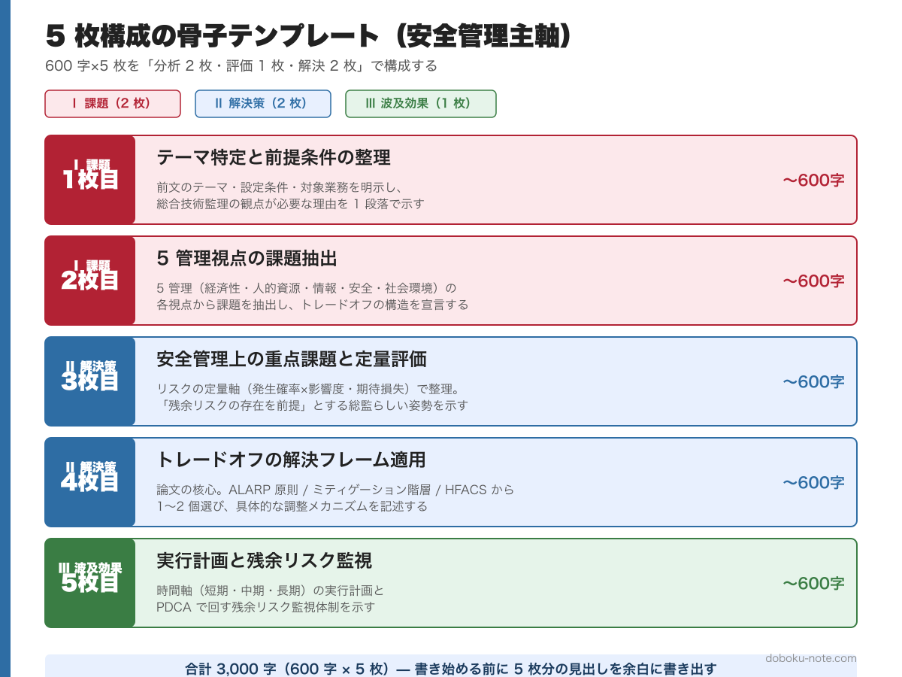
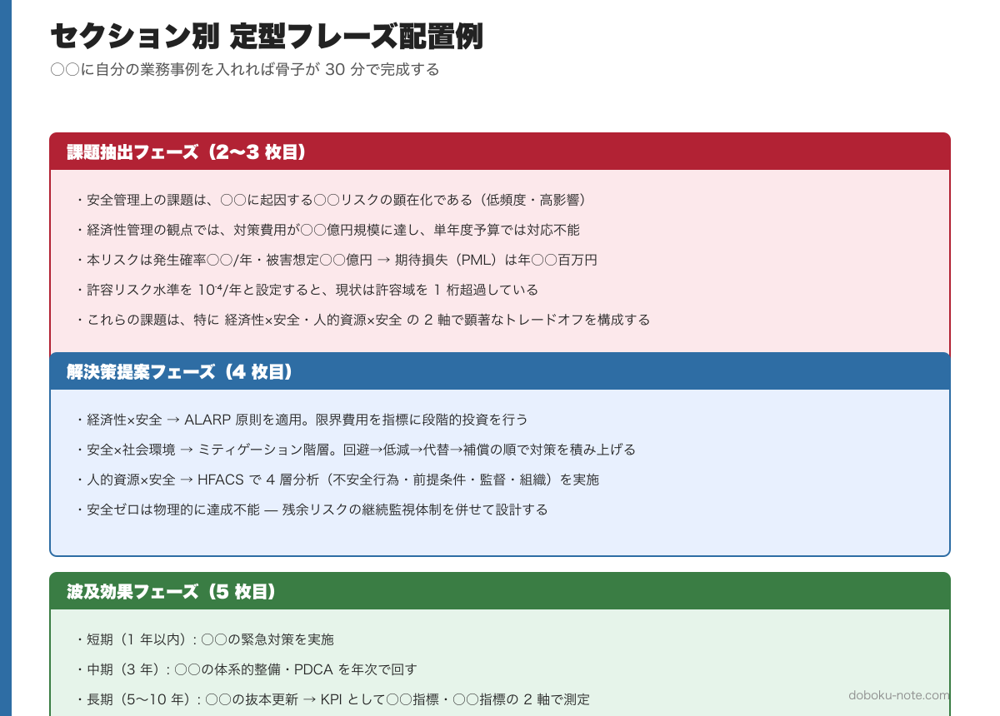

# 総監記述式 論文骨子テンプレート｜安全管理を軸にした 5 枚構成の章立て・定型フレーズ集

> **この記事でわかること**
> - 総監記述式で安全管理が主軸になる 3 パターンの出題と、その共通構造
> - 600 字×5 枚（3,000 字）を「分析 2 枚・評価 1 枚・解決 2 枚」で構築する骨子テンプレート
> - 各枚で使える定型フレーズ集（5 枚分、すべての段落を網羅）
> - ALARP 原則・ミティゲーション階層・HFACS を実際の論文でどう展開するか
> - 令和 2 年度（自然災害対策）を題材にした当てはめ例と、令和 6 年度への転用法

---

総監記述式の論文は、テーマが毎年変わっても **構造は一貫しています**。特に安全管理が主軸に据えられる出題（インフラ老朽化・災害対応・ヒューマンエラー等）は、過去 10 年で大きく 3 つのパターンに収束しており、いずれもトレードオフ解決フレーム（ALARP 原則・ミティゲーション階層・HFACS）のいずれかを適用すれば骨格が作れます。

本記事は、[記述式試験の解答戦略（三層構造と時間配分）](https://doboku-note.com/docs/pe-comprehensive-management-essay-exam-strategy) と [5 管理間トレードオフ 頻出パターン](https://doboku-note.com/docs/pe-comprehensive-management-management-tradeoffs) を結びつけ、**実際に書ける骨子** に落とし込むシリーズの第 1 弾です。600 字×5 枚の章立て、章ごとの定型フレーズ、過去問への当てはめ例を提示します。

## 1. 安全管理が主軸になる出題の型

過去 10 年（H27〜R6）の記述式で、**安全管理がテーマの中心に据えられる** 出題は大きく 3 パターンに収束します。いずれも経済性管理または社会環境管理とのトレードオフが必ず伴います。

- **インフラ老朽化と維持管理の優先順位づけ** --- 点検・補修・更新のリソースをどこに配分するか。代表例は [令和 6 年度 記述式](https://doboku-note.com/docs/pe-comprehensive-management-r06-secondary) の社会インフラ維持管理
- **自然災害・気候変動適応** --- 想定外力の引き上げとハード／ソフト対策の組み合わせ。代表例は [令和 2 年度 記述式](https://doboku-note.com/docs/pe-comprehensive-management-r02-secondary) の自然災害対策
- **品質・施工事故の再発防止** --- ヒューマンエラー・組織文化・技術伝承が絡む根本原因分析。近年は [令和 5 年度](https://doboku-note.com/docs/pe-comprehensive-management-r05-secondary) の働き方改革と接続した形で問われる

設問冒頭で「安全」「防災」「事故」「老朽化」「災害」のキーワードが前文に 3 回以上登場したら、本テンプレの適用対象と判断してください。安全管理の 5 管理内での位置づけやキーワード体系は doboku-note の解説ページで確認できます → [安全管理ピラー（リスクマネジメント・労働安全・危機管理）](https://doboku-note.com/docs/pe-comprehensive-management-safety-management-pillar)

本記事では、**5 枚構成の骨子テンプレート → 各枚で使える定型フレーズ集 → トレードオフ展開の標準パターン → 令和 2 年度を題材にした当てはめ例** までを順に提示します。骨子と定型フレーズを写経すれば、初学者でも 30 分で 1 題の論文骨子が完成するレベルまで持っていけます。

総監論文の骨格を理解する基本フレームは、下図の **三層構造（Ⅰ 管理対象 → Ⅱ 施策 → Ⅲ 将来展望と最大リスク）** です。本記事の 5 枚構成テンプレは、この三層構造を 5 枚の答案用紙に落とし込んだものになります。

## 2. 5 枚構成の骨子テンプレート

600 字×5 枚の配分は **分析 2 枚・評価 1 枚・解決 2 枚** を原則とします。書き始める前に 5 枚分の見出しを余白に書き出し、書きながら他の枚に戻らないことが時間管理の肝となります。

### 2.1 1 枚目：テーマ特定と前提条件の整理（〜600 字）

**書くべきこと** --- 前文から抽出したテーマ、設定条件、対象業務を明示し、なぜ総合技術監理の観点が必要かを 1 段落で示します。対象業務は自身の業務経歴から具体事例を 1 つ選び、規模・期間・関係者を端的に提示します。

**1 枚目の定型フレーズ**

- 本問のテーマは○○であり、○○・○○といった設定条件のもとで、総合技術監理の観点から分析と提言が求められている。
- 私が担当した○○（事業規模：○億円、期間：○年、関係者：○○）を題材として、以下に論じる。
- 本業務では安全管理が最上位の管理目標となるが、経済性管理・社会環境管理とのトレードオフが不可避であり、全体最適解の導出が論点となる。

### 2.2 2 枚目：5 管理視点の課題抽出（〜600 字）

**書くべきこと** --- 5 管理（経済性・人的資源・情報・安全・社会環境）の各視点から課題を 1〜2 項目ずつ抽出します。安全管理の課題を最も厚く、他 4 管理は各 1 項目で簡潔にまとめます。ここで **トレードオフの構造** を明示的に宣言します。

**2 枚目の定型フレーズ**

- 安全管理上の課題は、○○に起因する○○リスクの顕在化である。発生確率は低いが影響度が極めて大きい（低頻度・高影響）。
- 経済性管理の観点では、対策費用が○○億円規模に達し、単年度予算では対応不能となる制約がある。
- 人的資源管理の観点では、熟練技術者の退職により現場判断能力の継承が遅延している。
- 社会環境管理の観点では、工事に伴う騒音・振動・景観改変が住民合意の阻害要因となる。
- 情報管理の観点では、点検データの属人化と記録形式の不統一が意思決定の遅れを招いている。
- これらの課題は相互に独立ではなく、特に経済性×安全、人的資源×安全の 2 軸で顕著なトレードオフを構成する。

### 2.3 3 枚目：安全管理上の重点課題と定量評価（〜600 字）

**書くべきこと** --- 2 枚目で抽出した安全管理課題を、リスクの定量軸（発生確率×影響度、期待損失、F-N 曲線など）で整理します。「安全ゼロ」「絶対安全」という表現は避け、**残余リスクの存在を前提** とする総監らしい姿勢を示します。

**3 枚目の定型フレーズ**

- 本リスクは発生確率○○／年、被害想定○○億円であり、期待損失（PML）は年○○百万円と試算される。
- 許容リスク水準を 10⁻⁴／年と設定すると、現状は許容域を 1 桁超過しており、優先的対策が必要である。
- リスクマトリクス上では「影響度・大／発生確率・中」の象限に位置づけられ、予防対策と影響緩和策の併用が合理的である。
- なお安全ゼロは物理的に達成不能であり、残余リスクの継続監視体制を併せて設計する必要がある。

### 2.4 4 枚目：トレードオフの解決フレーム適用（〜600 字）

**書くべきこと** --- 論文の核心部。抽出したトレードオフに対して解決フレームを 1〜2 個選び、具体的な調整メカニズムを記述します。安全管理主軸の設問では以下の 3 フレームから選びます。

- **ALARP 原則** --- リスクを合理的に実行可能な水準まで下げ、追加コストが便益と見合わない領域は受容する。経済性×安全で最も汎用性が高い
- **ミティゲーション階層** --- 影響を回避→低減→代替→補償の順に検討する。安全×社会環境で有効
- **HFACS（Human Factors Analysis and Classification System）** --- 事故の人的要因を不安全行為・前提条件・監督・組織の 4 層で分析する。人的資源×安全で有効

**4 枚目の定型フレーズ**

- 経済性×安全のトレードオフに対しては、ALARP 原則を適用する。リスク低減の限界費用（1 人・年の死亡リスク削減に要する費用）を指標とし、○○万円／QALY を判断閾値として段階的投資を行う。
- 社会環境との衝突に対してはミティゲーション階層を適用し、まず影響回避ルートを 2 案検討したうえで、回避不能な場合に低減・代替・補償の順で対策を積み上げる。
- 人的要因に対しては HFACS で 4 層分析を行い、組織文化層への介入（安全優先の経営方針の明文化と評価制度への反映）を最上流対策として位置づける。
- いずれのフレームも単独では十分でなく、定量評価（3 枚目）と合意形成プロセスを併走させて初めて機能する。

### 2.5 5 枚目：実行計画と残余リスク監視（〜600 字）

**書くべきこと** --- 時間軸を入れた実行計画（短期／中期／長期）と、残余リスクの監視・見直し体制を示します。**総合技術監理の観点** という問いへの回答として、個別対策の羅列ではなく、PDCA で回す仕組みを提示することを意識してください。

**5 枚目の定型フレーズ**

- 短期（1 年以内）では○○の緊急対策を実施し、中期（3 年）で○○の体系的整備、長期（5〜10 年）で○○の抜本更新を計画する。
- 実施にあたっては PDCA サイクルを年次で回し、KPI として○○指標・○○指標の 2 軸で進捗を測定する。
- 残余リスクについては、モニタリング体制（点検頻度・閾値・報告ルート）を事前に設計し、閾値超過時の意思決定権者と対応手順を文書化する。
- 以上の実行計画により、経済性と社会環境との調和を保ちつつ、許容可能な安全水準を継続的に確保する。総合技術監理の観点はこの継続的調整プロセスそのものに宿る。

## 3. トレードオフ展開の標準パターン

安全管理を軸にした論文では、以下の 3 ペアのいずれかが必ず登場します。各ペアの解決フレームは [5 管理間トレードオフ 頻出パターン](https://doboku-note.com/docs/pe-comprehensive-management-management-tradeoffs) に詳述しているため、本テンプレでは **論文上の展開順序** のみ示します。

下図は「課題抽出・解決策提案・波及効果」の 3 フェーズごとに、枚で使える定型フレーズをまとめたものです。○○の部分を自分の業務事例に差し替えれば骨子が 30 分で完成します。

- **経済性×安全** --- 定量評価（3 枚目）→ ALARP 原則（4 枚目）→ 段階投資計画（5 枚目）の順に展開。B/C 分析と期待損失の両輪で根拠を示すのが定石
- **人的資源×安全** --- 事故事例の人的要因分析（2〜3 枚目）→ HFACS による組織層への遡及（4 枚目）→ 勤務間インターバル・VR 訓練・多言語対応（5 枚目）の順に展開
- **安全×社会環境** --- 防災と環境保全の価値対立の明示（2 枚目）→ ミティゲーション階層（4 枚目）→ 代替案 2〜3 案の住民合意プロセス（5 枚目）の順に展開

## 4. 過去問への当てはめ例（令和 2 年度・自然災害対策）

令和 2 年度の記述式は「自然災害の激甚化への対応」をテーマとし、安全管理と経済性管理のトレードオフが正面から問われました。本テンプレの骨子に当てはめると以下のようになります。

- **1 枚目**：テーマ = 激甚化する自然災害への適応、対象業務 = 自身が担当した河川改修または堤防耐震補強、前提 = 想定外力の引き上げ
- **2 枚目**：安全管理 = 想定外力超過時の氾濫リスク、経済性管理 = 堤防嵩上げの投資規模、人的資源管理 = 建設業の就業者減少による工期制約、情報管理 = 浸水シミュレーションの精度、社会環境管理 = 景観・生態系への影響
- **3 枚目**：現行堤防の超過確率と被害想定額、許容リスク水準との乖離、対策の優先順位マトリクス
- **4 枚目**：ALARP 原則で段階的嵩上げを選択、ミティゲーション階層で生態系影響を低減、情報管理（リアルタイム水位監視）で残余リスクをカバーする多重防御
- **5 枚目**：短期（排水機場増強）、中期（堤防部分嵩上げ）、長期（流域治水への移行）、KPI = 越水被害発生率・避難完了率

この構造は [令和 6 年度 記述式](https://doboku-note.com/docs/pe-comprehensive-management-r06-secondary) の社会インフラ維持管理にもそのまま転用可能です。テーマと対象業務を差し替えれば、骨子は共通で通用します。

## 5. テンプレの使い方

> **メモ: 学習フェーズでの運用**
>
> 1. 本テンプレを印刷またはノートに転記し、5 枚分の見出しを先に書く
> 2. 過去問を 1 題選び、骨子のみを 15 分で埋める練習を週 2 回繰り返す
> 3. 骨子が安定したら、定型フレーズを自分の業務経歴に合わせてカスタマイズする
> 4. 3 題分の骨子が溜まったら、1 題を選んで 3,000 字フル執筆し、時間配分を検証する

この骨子テンプレは他の 4 管理（経済性・人的資源・情報・社会環境）を主軸にする場合にも同じ 5 枚構成で応用できます。続編として各管理別のテンプレートを整備予定です。

## 6. 関連記事

- [記述式試験の解答戦略（三層構造と時間配分）](https://doboku-note.com/docs/pe-comprehensive-management-essay-exam-strategy)
- [5 管理間トレードオフ 頻出パターンと解決フレーム](https://doboku-note.com/docs/pe-comprehensive-management-management-tradeoffs)
- [安全管理ピラー（リスクマネジメント・労働安全・危機管理）](https://doboku-note.com/docs/pe-comprehensive-management-safety-management-pillar)
- [ALARP 原則](https://doboku-note.com/docs/pe-comprehensive-management-alarp-principle)
- [リスクアセスメント](https://doboku-note.com/docs/pe-comprehensive-management-risk-assessment)
- [インフラ老朽化](https://doboku-note.com/docs/pe-comprehensive-management-aging-infrastructure)
- [BCP（事業継続計画）](https://doboku-note.com/docs/pe-comprehensive-management-business-continuity-plan)

## 7. 参考資料

- 日本技術士会『技術士試験 技術部門別 受験ガイド 総合技術監理部門』最新版
- 文部科学省『総合技術監理キーワード集』
- 青本『技術士制度における総合技術監理部門の技術体系』

---

## 関連リソース

**doboku-note — 17 年分の過去問 + 650 キーワード解説（無料）**
https://doboku-note.com/category/pe-comprehensive-management

- 17 年分の論文過去問（解答骨子の詳細解析付き）
- 650 以上のキーワード解説ページ（ALARP・HFACS・ミティゲーション階層 等）
- スマホ対応（通勤中の学習に最適）

**マガジン購入で割引（総監記述式 完全対策セット）**
- 本書 ¥1,980 + 総監の合否を分ける「トレードオフ思考」完全ガイド ¥1,200 + 総監択一式 頻出計算問題 5 パターン完全攻略 ¥980 = 単品合計 ¥4,160
- セット価格 **¥3,480**（16% OFF）

**著者プロフィール**
土木技術者として 1 級土木施工管理技士・建設部門の技術士に合格後、2026 年に総合技術監理部門に挑戦。学習過程で蓄積した 700 キーワードの解説と 17 年分の過去問分析を doboku-note にて無料公開しています。
