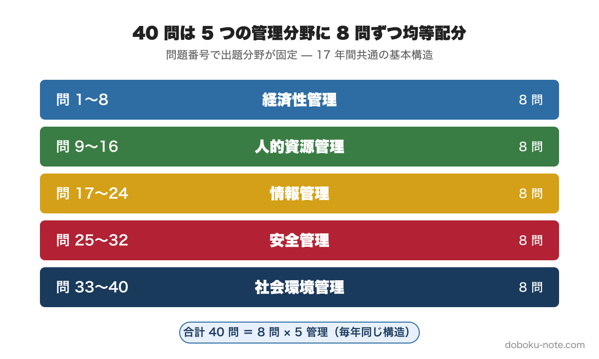
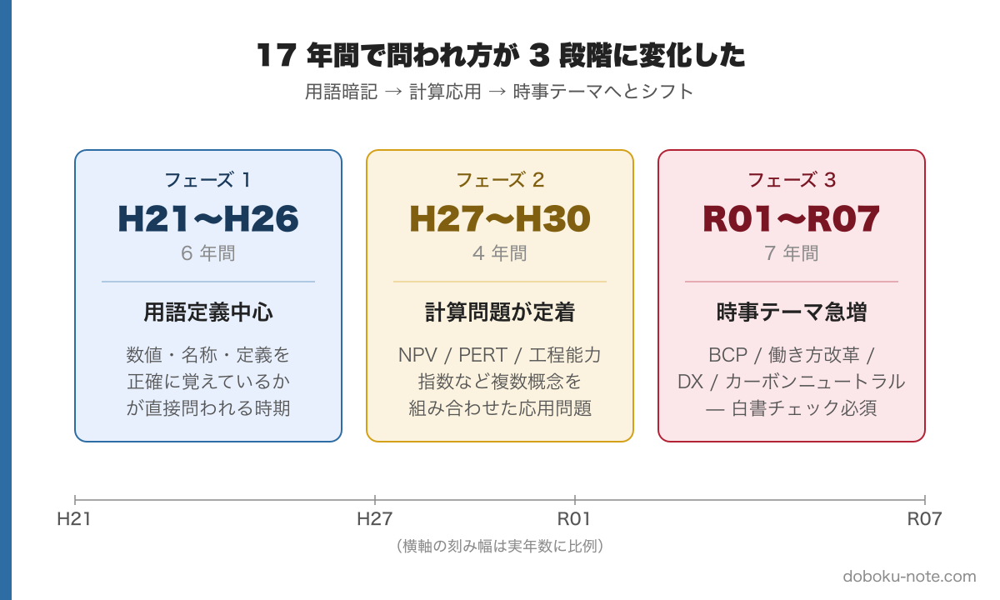

# 【学習優先順位がわかる】総監択一式17年分680問を徹底分析｜5管理分野別の頻出テーマと学習戦略

**この記事でわかること**

- 総監択一式40問の管理分野別配分（固定パターン）
- 5管理分野ごとの頻出テーマ一覧
- 学習の優先順位と効率的な進め方

---

## はじめに

技術士二次試験 総合技術監理部門の択一式は、毎年40問が出題されます。合格には記述式と合わせて60%以上が必要で、択一式だけで見れば24問以上の正答が目安になります。

「キーワード集を端から端まで覚える」のは非現実的です。5つの管理分野にまたがる膨大な範囲から効率よく得点するには、**出題パターンを知る**ことが最も有効な戦略になります。

そこで、平成21年度から令和7年度までの**17年分・全680問**を分析し、繰り返し出題されるテーマを特定しました。

---

## 40問の配分は完全に固定されている

まず知っておくべき基本構造があります。40問は5つの管理分野に**8問ずつ均等配分**されており、問題番号と分野の対応も17年間ほぼ共通です。境界的な問題で年度により ±1〜2 問の揺らぎはありますが、ブロック構造そのものは固定されています。

つまり、苦手な分野があっても最大8問の失点で済みます。逆に得意分野で8問中7〜8問取れれば、他の分野に余裕が生まれます。**問題番号を見れば分野が即座に分かる**ので、本番では得意分野から先に解くという時間配分も可能です。

---

## 5管理分野別 頻出テーマ

17年分の出題を分析すると、各管理分野ごとに繰り返し問われる定番テーマが見えてきます。以下、5つの管理分野ごとに頻出テーマを整理します。

### 経済性管理（問1〜8）

経済性管理の8問は過半が計算問題で、算術系を確実に押さえれば得点源になる分野です。事業企画・品質管理・工程管理・財務会計・設備管理・原価管理を横断的にカバーします。

- **投資評価・[NPV](https://doboku-note.com/docs/pe-comprehensive-management-npv-net-present-value)・現在価値計算** — 割引現在価値と年金現価係数の使い方
- **[品質管理](https://doboku-note.com/docs/pe-comprehensive-management-quality-control)・QC7つ道具** — [管理限界](https://doboku-note.com/docs/pe-comprehensive-management-control-limits)と規格値の違い、新QC7つ道具との区別
- **[PERT/CPM](https://doboku-note.com/docs/pe-comprehensive-management-pert-cpm)・クリティカルパス** — ネットワーク工程表・アロー・ダイアグラムからの計算
- **[工程能力指数](https://doboku-note.com/docs/pe-comprehensive-management-process-capability-index) Cpk** — 公式と判定基準
- **財務諸表（[貸借対照表](https://doboku-note.com/docs/pe-comprehensive-management-balance-sheet)・[損益計算書](https://doboku-note.com/docs/pe-comprehensive-management-income-statement)・[CF計算書](https://doboku-note.com/docs/pe-comprehensive-management-cash-flow-statement)）** — 3表の役割と構造、減価償却、CF計算書の3区分（営業・投資・財務）の区別
- **設備保全（[予防保全](https://doboku-note.com/docs/pe-comprehensive-management-preventive-maintenance)・[事後保全](https://doboku-note.com/docs/pe-comprehensive-management-corrective-maintenance)・[改良保全](https://doboku-note.com/docs/pe-comprehensive-management-improvement-maintenance)）** — 種類と適用場面、[バスタブカーブ](https://doboku-note.com/docs/pe-comprehensive-management-bathtub-curve)との関連
- **[PFI](https://doboku-note.com/docs/pe-comprehensive-management-pfi)・官民連携事業** — VFM（Value for Money）の概念、PFI事業のスキーム
- **[BCP](https://doboku-note.com/docs/pe-comprehensive-management-business-continuity-plan)・事業継続計画** — R05以降は連続出題、内閣府ガイドラインが土台
- **[ABC（活動基準原価計算）](https://doboku-note.com/docs/pe-comprehensive-management-activity-abc)** — 直接費と間接費の配賦方法
- **[損益分岐点分析](https://doboku-note.com/docs/pe-comprehensive-management-break-even-point)** — BEP = 固定費 ÷（1 − 変動費率）の計算
- **[デルファイ法](https://doboku-note.com/docs/pe-comprehensive-management-delphi-method)・[AHP](https://doboku-note.com/docs/pe-comprehensive-management-analytic-hierarchy-process)** — 問題解決手法の名称と手順の対応
- **[HACCP](https://doboku-note.com/docs/pe-comprehensive-management-haccp)** — 食品衛生分野の品質管理体系

### 人的資源管理（問9〜16）

人的資源管理は**動機づけ理論と労働法規**が二大柱です。動機づけ理論は組み合わせの逆転（X理論とY理論を入れ替える等）が定番の引っかけ、労働法規は数値（時間・日数）の正確な記憶が問われます。

- **動機づけ理論（[マズロー](https://doboku-note.com/docs/pe-comprehensive-management-maslow-hierarchy-of-needs)・[マグレガー](https://doboku-note.com/docs/pe-comprehensive-management-mcgregor-xy-theory)・[ハーズバーグ](https://doboku-note.com/docs/pe-comprehensive-management-herzberg-two-factor-theory)）** — [X理論とY理論](https://doboku-note.com/docs/pe-comprehensive-management-mcgregor-xy-theory)の逆転、[マズロー](https://doboku-note.com/docs/pe-comprehensive-management-maslow-hierarchy-of-needs)の5段階、[ハーズバーグ](https://doboku-note.com/docs/pe-comprehensive-management-herzberg-two-factor-theory)の衛生要因と動機づけ要因の区別
- **[労働基準法](https://doboku-note.com/docs/pe-comprehensive-management-labor-standards-act)の数値規定** — 法定労働時間（8時間/日、40時間/週）、有給休暇日数、時間外労働の上限
- **組織形態** — [職能別](https://doboku-note.com/docs/pe-comprehensive-management-functional-organization)・[事業部制](https://doboku-note.com/docs/pe-comprehensive-management-divisional-organization)・[マトリックス組織](https://doboku-note.com/docs/pe-comprehensive-management-matrix-organization)の特徴比較
- **[職務設計](https://doboku-note.com/docs/pe-comprehensive-management-job-design)** — ハックマン・オルダムモデルの5要素

### 情報管理（問17〜24）

情報管理は**統計手法・情報セキュリティ・知的財産**の3系統が定番です。算術平均と幾何平均・調和平均の使い分け、ゼロトラストなど近年の概念、著作権と産業財産権の区別が重点です。

- **[記述統計](https://doboku-note.com/docs/pe-comprehensive-management-descriptive-statistics)・統計手法** — 算術平均・幾何平均・調和平均の使い分け、標準偏差、正規分布
- **情報セキュリティ・[ISMS](https://doboku-note.com/docs/pe-comprehensive-management-isms-iso27001)・[ゼロトラスト](https://doboku-note.com/docs/pe-comprehensive-management-zero-trust)** — 認証制度、境界型セキュリティとゼロトラストの違い
- **知的財産（[産業財産権](https://doboku-note.com/docs/pe-comprehensive-management-industrial-property-rights)・[著作権](https://doboku-note.com/docs/pe-comprehensive-management-copyright)）** — 制度の概要、保護期間

### 安全管理（問25〜32）

安全管理は**労働安全衛生法と安全工学手法**が中心です。FMEA/FTA/ETA は名称と用途を取り違える引っかけが頻出、信頼性設計と保全性設計の用語逆転も定番です。製造物責任法（PL法）も安全分野として扱われます。

- **[労働安全衛生法](https://doboku-note.com/docs/pe-comprehensive-management-occupational-safety-act)・[リスクアセスメント](https://doboku-note.com/docs/pe-comprehensive-management-risk-assessment)** — 安全管理体制、[リスク評価](https://doboku-note.com/docs/pe-comprehensive-management-risk-assessment)の流れ
- **[FMEA](https://doboku-note.com/docs/pe-comprehensive-management-fmea)・[FTA](https://doboku-note.com/docs/pe-comprehensive-management-fta)・[ETA](https://doboku-note.com/docs/pe-comprehensive-management-eta)** — 故障モード影響解析・フォールトツリー・イベントツリーの違い
- **[信頼性設計・保全性設計](https://doboku-note.com/docs/pe-comprehensive-management-reliability-maintainability-design)** — 用語の対応関係（引っかけ頻出）
- **[PL法](https://doboku-note.com/docs/pe-comprehensive-management-product-liability-act)・製造物責任** — 免責要件、対象範囲

### 社会環境管理（問33〜40）

社会環境管理は**環境法規と地球環境問題**が中心です。R01以降はカーボンニュートラルや循環型社会など時事テーマが急増しており、白書（環境白書等）に目を通しておくと取りこぼしを防げます。

- **[環境影響評価](https://doboku-note.com/docs/pe-comprehensive-management-environmental-impact-assessment)（EIA）** — 制度の概要、対象事業、手続きの流れ
- **[環境基本法](https://doboku-note.com/docs/pe-comprehensive-management-environmental-basic-act)・[環境基本計画](https://doboku-note.com/docs/pe-comprehensive-management-environmental-basic-plan)** — 基本理念、第六次環境基本計画
- **[循環型社会形成推進基本法](https://doboku-note.com/docs/pe-comprehensive-management-circular-society-basic-act)・[廃棄物処理法](https://doboku-note.com/docs/pe-comprehensive-management-waste-management-act)** — 3R、廃棄物の分類
- **[カーボンニュートラル](https://doboku-note.com/docs/pe-comprehensive-management-carbon-pricing)・カーボンプライシング** — 環境税、排出権取引
- **[気候変動・脱炭素社会](https://doboku-note.com/docs/pe-comprehensive-management-climate-change-decarbonization)** — パリ協定、温対法

---

## 年度による出題傾向の変化

出題分野の配分は固定でも、17年間で出題の「質」は3段階で変化してきました。

特にR01以降は**キーワード集だけでは対応しきれない時事問題**が増えています。[BCP](https://doboku-note.com/docs/pe-comprehensive-management-business-continuity-plan)、働き方改革、DX、[カーボンニュートラル](https://doboku-note.com/docs/pe-comprehensive-management-carbon-pricing)といった近年のキーワードは、関係省庁の白書（情報通信白書、環境白書等）にも目を通しておくと取りこぼしを防げます。

---

## 引っかけパターン6種

17年分を通じて繰り返し使われる引っかけパターンを整理しました。これを知っておくと、選択肢を絞り込む速度が上がります。R03〜R07 の解答解説から実例を抽出しています。

**1. 用語の定義を逆にする**（同一カテゴリ内で対立する2概念を入れ替える）
- [信頼性設計 ↔ 保全性設計](https://doboku-note.com/docs/pe-comprehensive-management-reliability-maintainability-design) — 設計段階での予防と故障後の保全を逆に（[R05 Ⅰ-1-3](https://doboku-note.com/docs/pe-comprehensive-management-r05-primary#1-3)）
- [QC7つ道具 ↔ 新QC7つ道具](https://doboku-note.com/docs/pe-comprehensive-management-quality-control#七つ道具の見分け方) — マトリックスデータ解析法は新QC側
- [X理論 ↔ Y理論](https://doboku-note.com/docs/pe-comprehensive-management-mcgregor-xy-theory) — マグレガー
- 系統図法（目的→手段の展開）↔ 連関図法（要因の因果関係）— 新QC七つ道具内の混同（[R06 Ⅰ-1-8](https://doboku-note.com/docs/pe-comprehensive-management-r06-primary#1-8)）

**2. 数式・指標の要素を入れ替える**（演算子・分子分母・計算式の取替え）
- 管理限界を「規格値に設定する」→ 誤り（[R07 Ⅰ-1-2](https://doboku-note.com/docs/pe-comprehensive-management-r07-primary#1-2)）
- [損益分岐点](https://doboku-note.com/docs/pe-comprehensive-management-break-even-point)の分子と分母を逆にする
- VEの価値 = 機能 ÷ コストを「機能 × コスト」に（[R04 Ⅰ-1-2](https://doboku-note.com/docs/pe-comprehensive-management-r04-primary#1-2)）
- 線形計画法の目的関数を「線形結合（和）」ではなく「積」と書く（[R07 Ⅰ-1-6](https://doboku-note.com/docs/pe-comprehensive-management-r07-primary#1-6)）

**3. 法令の数値を微妙にずらす**
- 有給休暇「6ヶ月」を「1年」にする
- 労働時間「40時間/週」を「44時間/週」にする
- [労働基準法](https://doboku-note.com/docs/pe-comprehensive-management-labor-standards-act) 36協定の上限（45h/月、360h/年）を別の数値にする

**4. 範囲・構成要素を入れ替える**（包含関係の操作）
- [BCM](https://doboku-note.com/docs/pe-comprehensive-management-business-continuity-plan)の対象範囲「委託先・調達先・供給先も含む」を「含まない」に（[R07 Ⅰ-1-1](https://doboku-note.com/docs/pe-comprehensive-management-r07-primary#1-1)）
- [CF計算書](https://doboku-note.com/docs/pe-comprehensive-management-cash-flow-statement)の3区分（営業・投資・財務）に「社会貢献活動」を加える（[R07 Ⅰ-1-7](https://doboku-note.com/docs/pe-comprehensive-management-r07-primary#1-7)）
- 減価償却資産は建物附属設備・機械装置・器具備品・車両運搬具すべて対象（一部のみと書くと誤り）（[R07 Ⅰ-1-7](https://doboku-note.com/docs/pe-comprehensive-management-r07-primary#1-7)）

**5. 「すべて」「のみ」「常に」など絶対化表現で例外を無視する**
- 「BCMの対象は自社の人的・物的被害のみ」→ 実は委託先・調達先も含む（[R07 Ⅰ-1-1](https://doboku-note.com/docs/pe-comprehensive-management-r07-primary#1-1)）
- 「不合理な待遇差禁止は努力義務」→ 実は法的禁止規定（強度の誤認）（[R04 Ⅰ-1-10](https://doboku-note.com/docs/pe-comprehensive-management-r04-primary#1-10)）
- 「変形労働時間制で労働者が労働時間を自由決定できる」→ フレックスタイム制との混同（変形労働時間制は労使協定で事前に定める）（[R04 Ⅰ-1-9](https://doboku-note.com/docs/pe-comprehensive-management-r04-primary#1-9)）

**6. 手順・順序や責任主体を入れ替える**
- PDCA の C（Check）と A（Action）を逆にする／プロセス完了後に修正と書く
- スケジュール計算式（最遅開始時刻 = 最早開始時刻 + 全余裕時間）の式を逆転させる（[R04 Ⅰ-1-8](https://doboku-note.com/docs/pe-comprehensive-management-r04-primary#1-8)）
- 健康診断「[事業者](https://doboku-note.com/docs/pe-comprehensive-management-occupational-safety-act)が個々の労働者の検査結果を直接入手」→ 実はプライバシー保護で集計結果のみ（[R07 Ⅰ-1-11](https://doboku-note.com/docs/pe-comprehensive-management-r07-primary#1-11)）

---

## 学習の優先順位

まとめると、効率的な学習順序は以下の通りです。

1. **苦手分野の頻出テーマから先に潰す** — 5管理のうちスコアが伸び悩む分野の上記リスト上位を優先
2. **計算問題を3パターン練習** — [NPV](https://doboku-note.com/docs/pe-comprehensive-management-npv-net-present-value)、[PERT](https://doboku-note.com/docs/pe-comprehensive-management-pert-cpm)、[損益分岐点](https://doboku-note.com/docs/pe-comprehensive-management-break-even-point) は出れば確実に解ける形にしておく
3. **動機づけ理論と労働法規の数値** — 暗記の質で得点が決まる定番領域
4. **直近5年の過去問を解く** — 時事問題（BCP、カーボンニュートラル等）の傾向を把握
5. **引っかけパターンを覚える** — 用語逆転・数式入れ替え・法令数値ずらし・範囲操作・絶対化表現・順序入替の6パターン（後述）

24問正答（60%）を確実に取るには、各分野で6〜7割（5問前後）取る安定型の学習が現実的です。

---

## 関連リソース

この記事で紹介した 17 年分（H21〜R07）の全 680 問について、解答・解説付きの過去問演習ができるサイトを運営しています。

**doboku-note — 17 年分の過去問 + 650 キーワード解説（無料）**
https://doboku-note.com/category/pe-comprehensive-management

- 17 年分の択一式過去問（全問解答解説付き）
- 650 以上のキーワード解説ページ
- スマホ対応（通勤中の学習に最適）

各設問の解説からキーワードページへのリンクが付いているので、不明点をすぐに確認できます。

**note のおすすめ続編**
- 総監択一式 頻出計算問題 5 パターン完全攻略 ¥980 — [NPV](https://doboku-note.com/docs/pe-comprehensive-management-npv-net-present-value)・[PERT](https://doboku-note.com/docs/pe-comprehensive-management-pert-cpm)・[損益分岐点](https://doboku-note.com/docs/pe-comprehensive-management-break-even-point)・[工程能力指数](https://doboku-note.com/docs/pe-comprehensive-management-process-capability-index)・負荷工数の解法
- 【17 年分を解いた実感】年度別難易度ランキング（無料） — 初受験者が優先して解くべき過去問
- 【2026 年最新】総監キーワード集 2026 の変更点と学び直す優先順位（無料）
