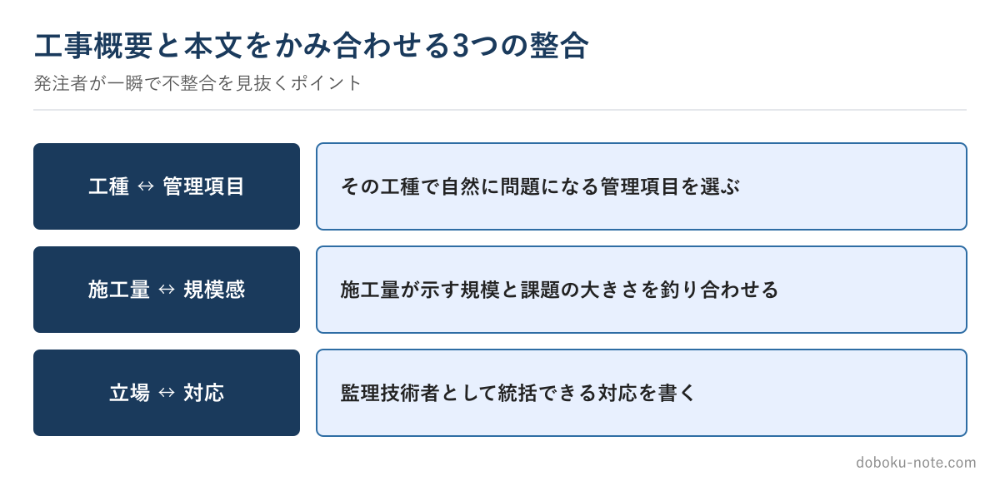

# 【1級土木施工管理技士】施工経験記述「工事概要」の書き方 — なぜ概要欄で減点されるのか

**こんな人のための記事です**

- 1級の施工経験記述で「工事概要」をどう書けばよいか迷っている
- 規模の大きい工事の概要を、本文とどう整合させるか分からない
- 工事概要が原因で減点されると聞いて不安

**この記事でわかること**

- 工事概要が「本文の前提条件」である理由
- 発注者・採点側が概要欄で見ている3つの整合
- 監理技術者レベルで施工量・立場をどう書くか

---

筆者は元・地方自治体の土木職（発注者）で、1級土木施工管理技士を保有しています。発注者として大規模工事の施工計画書を確認してきた経験から言うと、1級の施工経験記述では「工事概要」と本文の整合の崩れが、2級以上に目立ちます。

規模が大きいぶん、概要と本文の食い違いが大きく見えるからです。

工事概要は採点側にとって**本文を読むための前提条件**です。記入項目の一覧はサイトの無料解説に譲り、この記事では「**なぜ概要で減点されるのか**」に絞ります。

<!-- cta:pack-top -->
自分の工事に近い「想定工事」を選んで5管理すべての完成答案をそろえるなら、想定工事100×5管理を全網羅した完全攻略パックが最短です。

https://note.com/dobokunote/m/m8290970a7f05

## 採点側が概要で見ている3つの整合

**工種と管理項目の整合**——書く管理項目（品質・安全・工程・施工計画・環境対策）が、その工種で自然に問題になるか。橋梁下部工で品質、大規模土工で工程、というように工種と課題がかみ合っているか。

**施工量と課題の規模感の整合**——施工量が示す規模と、本文の課題の大きさが釣り合っているか。1級では「橋長○m」「掘削土量○万m3」「トンネル延長○m」など、工事の規模が伝わる数量を入れます。

**立場と対応の整合**——監理技術者・現場代理人など、あなたの立場でその対応を判断・統括できるか。1級は施工計画・全体統括に関わる立場で書けるのが強みです。

## 大規模工事の概要でやりがちな失敗

**施工量を「一式」で済ませる**——規模が伝わりません。悪い例「橋梁工　一式」。直すなら「**PC橋上部工・橋長45m・3径間連続、床版面積○m2**」のように、構造形式と規模が分かる数量を入れます。

**工種と本文の管理項目がずれる**——概要は上部工なのに本文で地盤改良を語る、といったズレに注意します。

**立場を曖昧にする**——監理技術者として施工計画や品質・安全の統括に関わった立場を明確にすると、対応の説得力が増します。施工経験記述は「自分が経験した工事」が大前提で、経験していない工事と判明すれば失格です。

立場を盛らず、実際に関わった範囲で書きます。

## 発注者は「概要の数行」で本文を予想する

発注者として大規模工事の施工計画書を見るとき、工事名・構造形式・施工量の数行で「この工事ならこういう技術的課題があったはずだ」と中身を予想します。経験ある採点者も同じです。

だから概要と本文が食い違うと「本当にこの工事をやったのか」という疑いが生まれ、逆に概要から予想したとおりの課題が出てくると「現場を統括した人の答案だ」と信頼されます。概要は信頼の入り口です。

## 概要から本文まで一貫した答案を見て掴む

工事概要でつまずく人の多くは、「概要と本文が一本でつながった監理技術者レベルの答案」を見たことがありません。完成答案を見ると、概要の施工量から本文の課題が自然に出てくるつながり方が体でわかります。

品質・安全・工程・施工計画・環境対策の5管理それぞれに、工事概要から本文まで一貫させたフル完成答案をまとめた有料マガジンを用意しています。各答案に置換ガイドと採点者視点を付けています。

https://note.com/dobokunote/m/m150c9db08902

## 関連リソース

**施工経験記述 出題傾向と対策**（無料・doboku-note）

https://doboku-note.com/docs/civil-construction-1-secondary-experience-writing-guide

**施工経験記述 改善例**（無料・doboku-note）

https://doboku-note.com/docs/civil-construction-1-secondary-experience-writing-examples

**1級土木 施工経験記述 完成答案集**（5管理／概要〜本文まで一貫したフル答案）

https://note.com/dobokunote/m/m150c9db08902

工事概要が固まったら、次は答案全体の進め方です。[第2次検定のはじめ方](https://doboku-note.com/docs/civil-construction-1-secondary-getting-started?utm_source=note&utm_medium=referral&utm_campaign=c1-essay-outline&utm_content=secondary-getting-started)に学習順をまとめています。

---

<!-- cta:civil-mokuji -->
1級・2級土木のほかの記事・経験記述の答案集は「土木もくじ」から一覧できます。

上位資格の分析力・発注者の採点眼・合格者の当事者性で、あなたの答案を合格ラインへ引き上げます。

https://note.com/dobokunote/n/n4fde0f62dc20