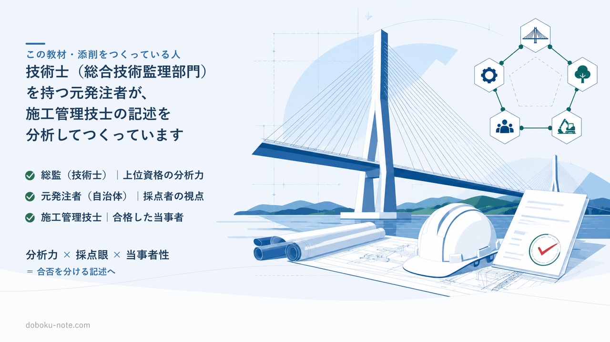

# 1級土木 施工経験記述｜完全攻略パック 総合案内（想定工事100 索引）

1級土木施工管理技士 第2次検定 問題1（施工経験記述）の完全攻略パックの総合案内です。

想定工事100件を9工種で整理し、それぞれで品質・工程・安全・施工計画・環境対策の5管理をどう書くかを、監理技術者レベルの完成答案で示します。

本記事は「工事起点の索引」です。まず自分の現場に近い工事を選び、その工事ページで5管理の書き分けを一望してください。

## この索引の使い方

1. 下の9工種から、自分が実際に担当した現場に近い工事を1つ選ぶ。
2. その工事ページで、5管理（品質／工程／安全／施工計画／環境）の完成答案を読む。
3. 各答案末尾の「置換ガイド」に沿って、自分の現場の数値・条件へ置き換える。

令和6年度以降の2テーマ必答にも、各工事ページの早見表で対応できます。

## 全体をまとめて手に入れる

100工事すべてと工事起点索引を1つにまとめた買い切りパックです。単品を積み上げるより大きくお得に、9工種を横断して学べます。

https://note.com/dobokunote/m/m8290970a7f05

1工事ずつ試したい場合は、下の各リンクから単品でも購入できます。

## 土工・盛土・造成（14工事）

盛土・切土・軟弱地盤対策など、出題頻度の高い土工系。

- [道路改良 高盛土](https://note.com/dobokunote/n/n86f490c51a22)
- [河川堤防 築堤盛土](https://note.com/dobokunote/n/naff9988e7fff)
- [宅地造成 大規模切盛土](https://note.com/dobokunote/n/n7203a2b394f5)
- [高速道路 路体・路床盛土](https://note.com/dobokunote/n/n7f1e1a6ee660)
- [サンドドレーン＋段階載荷盛土（軟弱地盤改良）](https://note.com/dobokunote/n/ncde3b9d285f1)
- [セメント改良土盛土](https://note.com/dobokunote/n/n76f739b0ad18)
- [山間部切土法面 地すべり対策](https://note.com/dobokunote/n/n0bd5fdbbc004)
- [補強土壁（テールアルメ）盛土](https://note.com/dobokunote/n/n69bb08fc5191)
- [擁壁背面 裏込め盛土](https://note.com/dobokunote/n/nc63a21791ffb)
- [空港用地造成](https://note.com/dobokunote/n/n2be2e3fc6868)
- [傾斜地 段切り盛土](https://note.com/dobokunote/n/n26d6074c6d57)
- [深層混合処理＋盛土](https://note.com/dobokunote/n/n81495fd414b9)
- [高含水比粘性土 盛土](https://note.com/dobokunote/n/na226c3b5005c)
- [寒冷地路床 凍上抑制](https://note.com/dobokunote/n/naddfd1d4e15e)

## コンクリート工（12工事）

マスコン・水密性・暑中寒中など、コンクリートの品質を主軸に。

- [橋脚フーチング マスコン](https://note.com/dobokunote/n/n45d1b70f72d4)
- [場所打ち杭 杭体コンクリート打設](https://note.com/dobokunote/n/n5845dba48847)
- [RCボックスカルバート](https://note.com/dobokunote/n/nb87df89003be)
- [逆T式擁壁 コンクリート工](https://note.com/dobokunote/n/ncf90a484fa7b)
- [砂防堰堤 本体マスコン](https://note.com/dobokunote/n/n012233737721)
- [水路トンネル 覆工コンクリート](https://note.com/dobokunote/n/n5d9174475072)
- [下水処理場 水槽RC](https://note.com/dobokunote/n/n8d98d7fc24cc)
- [暑中コンクリート打設](https://note.com/dobokunote/n/nbdabaf02577f)
- [寒中コンクリート（冬季打設）5管理 完成答案](https://note.com/dobokunote/n/nae80802d7745)
- [PC橋上部工（場所打ち）](https://note.com/dobokunote/n/n99401cb09ff7)
- [根固めブロック 製作・据付](https://note.com/dobokunote/n/ndc3ef27c1c96)
- [高流動コンクリート 過密配筋部充填](https://note.com/dobokunote/n/nf7acd3284c3b)

## 基礎・杭工（10工事）

場所打ち杭・既製杭・ケーソンなど、基礎工の施工管理。

- [場所打ち杭（オールケーシング）橋脚基礎 5管理完成答案](https://note.com/dobokunote/n/n82708ba23aa3)
- [場所打ち杭（アースドリル）杭施工全体](https://note.com/dobokunote/n/nd69cdad6bb90)
- [PHC杭打込み（既製杭）橋台基礎 5管理完成答案](https://note.com/dobokunote/n/ne2cde72491e1)
- [鋼管杭 中掘り工法](https://note.com/dobokunote/n/nc4161b5e5a62)
- [鋼管矢板 井筒基礎（河川橋脚）](https://note.com/dobokunote/n/n775701822f2a)
- [ニューマチックケーソン基礎](https://note.com/dobokunote/n/ne93129340f5e)
- [深礎杭（人力掘削）](https://note.com/dobokunote/n/n907964073daa)
- [鋼管ソイルセメント杭](https://note.com/dobokunote/n/nf9367ea2132d)
- [橋台直接基礎（支持地盤確認）5管理完成答案](https://note.com/dobokunote/n/nc3d0593d6f35)
- [既製杭＋地盤改良 中掘り根固め](https://note.com/dobokunote/n/n3a61f3d3d8ea)

## 道路・舗装（14工事）

アスファルト・コンクリート舗装、道路改良・修繕の定番。

- [アスファルト舗装新設](https://note.com/dobokunote/n/n63432ef424d4)
- [アスファルト舗装 打換え修繕](https://note.com/dobokunote/n/na97871fcd60a)
- [コンクリート舗装（版）](https://note.com/dobokunote/n/nbac6aa6b3f81)
- [道路改良 拡幅・線形改良](https://note.com/dobokunote/n/nea625059d389)
- [切土法面を伴う道路改良](https://note.com/dobokunote/n/n9d9a77c66392)
- [排水性舗装の施工](https://note.com/dobokunote/n/ndc8adfdfae71)
- [橋面舗装（床版上）](https://note.com/dobokunote/n/n4760c5ab311f)
- [路上路盤再生](https://note.com/dobokunote/n/n8e317f5c5fb6)
- [街路改良 共同溝](https://note.com/dobokunote/n/n83288d2fe5ae)
- [電線共同溝整備（無電柱化）](https://note.com/dobokunote/n/n8977d8654f1f)
- [交差点改良（平面）](https://note.com/dobokunote/n/nc46a4823b2f5)
- [歩道整備 バリアフリー化](https://note.com/dobokunote/n/n9319d225e6b4)
- [トンネル坑内舗装 5管理 完成答案](https://note.com/dobokunote/n/n90763a77e3e4)
- [積雪寒冷地 舗装工事](https://note.com/dobokunote/n/n252fdfb14e54)

## 河川・海岸・港湾（12工事）

護岸・築堤・樋門・ケーソンなど、水際の工事。

- [河川護岸 ブロック張](https://note.com/dobokunote/n/n662eef264e46)
- [河川築堤 堤防新設](https://note.com/dobokunote/n/n86ee145c5e3b)
- [樋門・樋管設置](https://note.com/dobokunote/n/n11df5e8d6823)
- [水門設置工事](https://note.com/dobokunote/n/n7f8c31699672)
- [河道掘削 しゅんせつ](https://note.com/dobokunote/n/n5a5d809d5625)
- [床止め・落差工](https://note.com/dobokunote/n/n303285048c47)
- [海岸護岸 消波工](https://note.com/dobokunote/n/n7fcbcfadec69)
- [海岸堤防嵩上げ](https://note.com/dobokunote/n/n67eec123cebd)
- [港湾岸壁 ケーソン据付](https://note.com/dobokunote/n/ne9c8276808fb)
- [防波堤築造](https://note.com/dobokunote/n/nb51be2a4130e)
- [河川橋梁橋脚 仮締切](https://note.com/dobokunote/n/ndd06c675316f)
- [砂防堰堤 基礎・本体](https://note.com/dobokunote/n/nf55150fd95eb)

## 上下水道・管渠（12工事）

開削・推進・シールドなど、管路と処理施設。

- [下水道管渠 開削](https://note.com/dobokunote/n/n95b8ce3b533d)
- [下水道シールド](https://note.com/dobokunote/n/nc09226fe426d)
- [推進工法（小口径）](https://note.com/dobokunote/n/nc15645654273)
- [推進工法（中大口径）](https://note.com/dobokunote/n/n91f317323f26)
- [雨水幹線築造](https://note.com/dobokunote/n/nad043a19a950)
- [上水道配水管布設 開削](https://note.com/dobokunote/n/n6ad7cff8c5bd)
- [浄水場 沈澱池築造](https://note.com/dobokunote/n/n33b4a04c2a48)
- [下水処理場 反応槽](https://note.com/dobokunote/n/n8e2d91f53546)
- [マンホールポンプ場](https://note.com/dobokunote/n/n3b5442ae592e)
- [既設管更生工事](https://note.com/dobokunote/n/nc574609c496e)
- [水道管 不断水工事](https://note.com/dobokunote/n/ndebed29132e6)
- [雨水貯留施設（地下）](https://note.com/dobokunote/n/n6c05b3ad862e)

## 橋梁・構造物（12工事）

橋台橋脚・桁架設・耐震補強・非開削。

- [橋台躯体 逆T式](https://note.com/dobokunote/n/n859527f1749e)
- [橋脚躯体（張出し）](https://note.com/dobokunote/n/n863c0ff7981d)
- [PC桁架設（クレーン）](https://note.com/dobokunote/n/n9250e3f2aa37)
- [鋼桁架設（送出し工法）](https://note.com/dobokunote/n/n195e97d885ec)
- [床版取替（更新）](https://note.com/dobokunote/n/n0492278697ca)
- [橋梁耐震補強](https://note.com/dobokunote/n/n3dafb9f9b8cc)
- [既設橋 撤去・架替](https://note.com/dobokunote/n/n7ed27921d202)
- [連続立体交差 鉄道高架](https://note.com/dobokunote/n/nd23afbeecb2c)
- [横断歩道橋設置](https://note.com/dobokunote/n/nb8b8b9533bcc)
- [カルバート非開削（推進）](https://note.com/dobokunote/n/n1fec875cca5d)
- [高架橋 RC橋脚](https://note.com/dobokunote/n/nb44e8c218401)
- [鋼管矢板 橋脚基礎](https://note.com/dobokunote/n/nf44492754254)

## トンネル（8工事）

NATM・覆工・支保工・都市部開削。

- [山岳トンネルNATM 5管理 完成答案](https://note.com/dobokunote/n/n3dd143707c2e)
- [山岳トンネル 機械掘削](https://note.com/dobokunote/n/n016d5d32f40e)
- [道路トンネル 覆工コンクリート](https://note.com/dobokunote/n/n1508fe92f8e7)
- [トンネル坑口部 明かり巻](https://note.com/dobokunote/n/n43f65aacea35)
- [都市部トンネル 開削工事](https://note.com/dobokunote/n/nc6b40febb3b5)
- [水路トンネル](https://note.com/dobokunote/n/ne97861cf9e95)
- [トンネル支保工 吹付・ロックボルト](https://note.com/dobokunote/n/necb7a6c74083)
- [トンネル補修 漏水・覆工剥落](https://note.com/dobokunote/n/n40e40788b6dd)

## 専門（6工事）

共同溝・電線共同溝など、専門構造物。

- [共同溝 プレキャストボックス](https://note.com/dobokunote/n/n7a3da95e5f33)
- [電線共同溝（特殊部）](https://note.com/dobokunote/n/ne1b74ba128d9)
- [鉄道近接 土留め・仮設工事](https://note.com/dobokunote/n/nc3b2d838cbe4)
- [大規模造成 流域貯留](https://note.com/dobokunote/n/nb4a699d8bf84)
- [法面対策 吹付・グラウンドアンカー](https://note.com/dobokunote/n/neb6bff7cd3a4)
- [軟弱地盤 薬液注入工法](https://note.com/dobokunote/n/na4e520d3137d)

## まとめ

自分の現場に最も近い1工事を選び、5管理の書き分けと置換ガイドで「自分の答案」に仕上げてください。

全体を一気に押さえたい方は、完全攻略パックが最短です。

上位資格の分析力・発注者の採点眼・合格者の当事者性で、あなたの答案を合格ラインへ引き上げます。

https://note.com/dobokunote/m/m8290970a7f05

工事を選ぶ前に記述の型を押さえたい方は、[施工経験記述 出題傾向と書き方](https://doboku-note.com/docs/civil-construction-1-secondary-experience-writing-guide?utm_source=note&utm_medium=referral&utm_campaign=civil1-keiken-pack-index&utm_content=experience-writing-guide)を無料で公開しています。

---

<!-- cta:civil-mokuji -->
1級・2級土木のほかの記事・経験記述の答案集は「土木もくじ」から一覧できます。

https://note.com/dobokunote/n/n4fde0f62dc20
