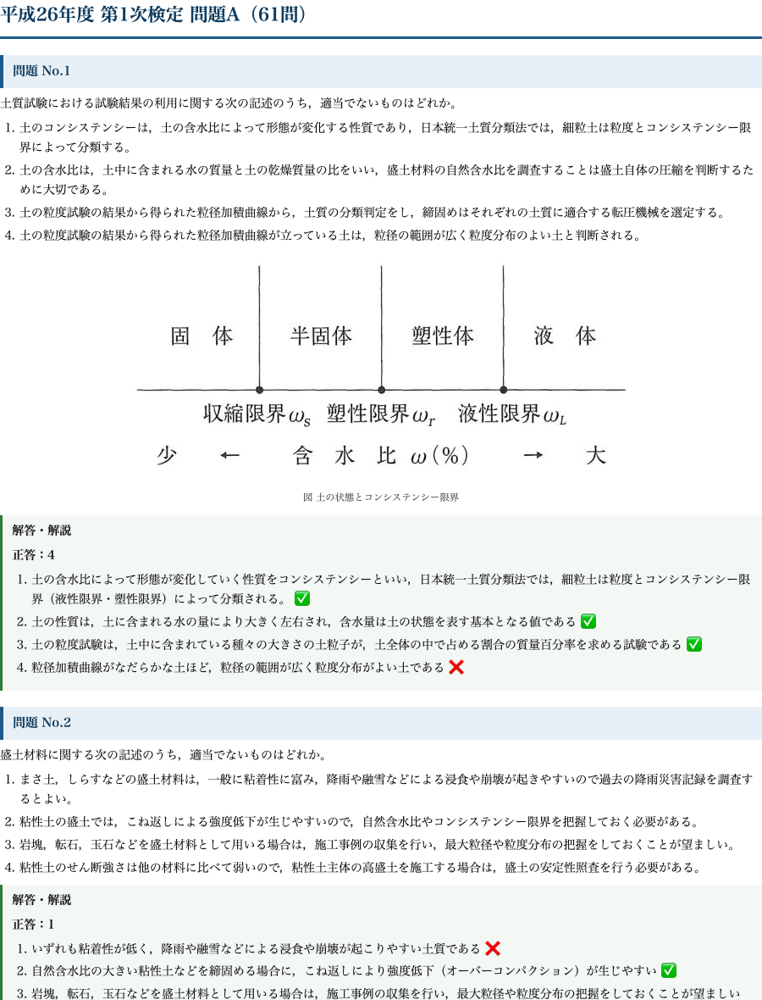

# 1級土木 第1次検定｜過去問PDF（平成26〜令和7年度 全12年分 全1162問・全選択肢解説）

**こんな人のための記事です**

- 1級土木施工管理技士の第1次検定を、過去問を回して確実に突破したい
- 市販の過去問集は「正解の肢」しか載っておらず、なぜ他の肢が誤りなのかが分からない
- スマホやタブレット、印刷して、通勤・昼休み・直前期に紙で高速に回したい

1級土木の第1次検定は、過去問と同じ論点が手を替え品を替え繰り返し出題されます。合格の最短ルートは「新しい問題を解く」ことではなく、**過去問を、全部の選択肢について『なぜ正しいか・なぜ誤りか』まで言えるようにする**ことです。

市販の過去問集の多くは、正解番号と正解肢の簡単な説明しか載っていません。しかし本試験で問われるのは「適当でないものはどれか」という消去法の判断です。**4つの肢すべての正誤を根拠から説明できて、はじめて本番でどの肢が来ても迷わなくなります。**

この教材は、平成26年度から令和7年度までの問題A・問題B、**全1162問を1問残らず収録し、4つの選択肢すべてに正誤の理由を付けた**A4印刷用PDFです。サイトの無料解説をベースに、紙で回せるよう再編集しました。

<!-- cta:civil-1-primary-ronten -->
過去問を解くだけでなく、過去12年の出題頻度から「どの分野を優先するか」まで決めたい方は、1級土木 第1次検定「出る順 合格ノート」もあわせてご覧ください。

https://note.com/dobokunote/n/nec34238ca6d6

## 収録内容

- **平成26〜令和7年度 全12年分・問題A/問題Bの全1162問**（第1次検定の全分野＝土木一般・専門土木・法規・共通工学・施工管理法）
- **全問・全選択肢に正誤の理由を明記**（正解肢だけでなく、誤りの肢がなぜ誤りかまで）
- 図が必要な問題は図版つきで収録、計算問題は考え方つき
- A4・通しページ番号つきの印刷用PDF（印刷しても、タブレットで開いても読める版面）
- 出典・著作権・免責を明記（過去問の著作権は実施団体に帰属。解答・解説・編集は当方オリジナル）

## 中身サンプル

実際の紙面はこの品質です（平成26年度 問題Aの冒頭）。

たとえば非計算問題は、次のように4肢すべてに根拠が付きます。

> **問題 No.2　盛土材料に関する次の記述のうち、適当でないものはどれか。**

> 選択肢1　まさ土、しらすなどの盛土材料は、一般に粘着性に富み、降雨や融雪などによる浸食や崩壊が起きやすいので過去の降雨災害記録を調査するとよい。

> 選択肢2　粘性土の盛土では、こね返しによる強度低下が生じやすいので、自然含水比やコンシステンシー限界を把握しておく必要がある。

> 選択肢3　岩塊、転石、玉石などを盛土材料として用いる場合は、施工事例の収集を行い、最大粒径や粒度分布の把握をしておくことが望ましい。

> 選択肢4　粘性土のせん断強さは他の材料に比べて弱いので、粘性土主体の高盛土を施工する場合は、盛土の安定性照査を行う必要がある。

**正解: (1)**

1. まさ土・しらすは粘着性に乏しく、降雨や融雪で浸食・崩壊が起こりやすい土質。「粘着性に富み」が誤り
2. 自然含水比の大きい粘性土を締固めると、こね返しにより強度低下（オーバーコンパクション）が生じやすい
3. 岩塊・転石・玉石を用いる場合は、施工事例の収集で最大粒径や粒度分布を把握しておくのが望ましい
4. 粘性土はせん断強さが弱いため、高盛土では盛土の安定性照査が必要

このように、正解番号を覚えるのではなく「1が誤りなのは、まさ土・しらすを『粘着性に富む』とすり替えているから」まで言えるようにするのが、本番で崩れない解き方です。全1162問がこの粒度で解説されています。

<!-- cta:civil-mokuji -->
1級・2級土木のほかの記事・経験記述の答案集は「土木もくじ」から一覧できます。

https://note.com/dobokunote/n/n4fde0f62dc20

## PDF のダウンロードと使い方

ここから先で、全1162問・全選択肢解説のA4印刷用PDF（この記事の末尾に添付）をダウンロードできます。以下は、直前期までにこのPDFを合格力に変える回し方です。

**1周目：分野の地図をつくる**（試験2〜3か月前）

まずは通しで1周し、各問の解説まで読みます。ここでは正答率は気にせず、「どの分野で・どんな論点が・どんな聞かれ方をするか」を体に入れるのが目的です。誤った肢の理由まで読むことで、1問から4つの知識が入ります。

**2周目：落とした肢だけを狩る**（試験1か月前）

2周目は、1周目で理由を言えなかった肢にだけ印をつけ、その肢の周辺知識を解説で埋めます。「正解した問題」でも、他の3肢の理由が言えなければ未修得として扱います。第1次検定は問題Aから多くの必須問題、問題Bから選択問題という構成なので、自分が選ぶ分野を早めに固めておくと効率が上がります。

**3周目・直前期：印のついた肢を高速反復**

印のついた肢だけを、移動時間や昼休みに高速で回します。紙のPDFなので、電波もアプリも要りません。試験前日は、各分野の冒頭数問だけを流し読みして「聞かれ方」を思い出せば十分です。

この3周で、過去12年に出た論点はほぼ網羅できます。新しい問題集に手を広げるより、この1162問を「全肢説明できる」状態にするほうが、合格に直結します。

## 出典・免責

本教材は、一般財団法人 全国建設研修センターが実施する1級土木施工管理技術検定（第1次検定）の過去問題を出典としています。問題文の著作権は出典元に帰属します。解答・解説および複数年度の編集・再構成は著者（doboku-note）によるものです。

本教材は正確を期して作成していますが、内容を保証するものではありません。法令・基準は改正されることがあるため、受験にあたっては必ず最新の一次情報をご確認ください。

---

<!-- cta:civil-mokuji -->
1級・2級土木のほかの記事・経験記述の答案集は「土木もくじ」から一覧できます。

上位資格の分析力・発注者の採点眼・合格者の当事者性で、あなたの答案を合格ラインへ引き上げます。

https://note.com/dobokunote/n/n4fde0f62dc20
