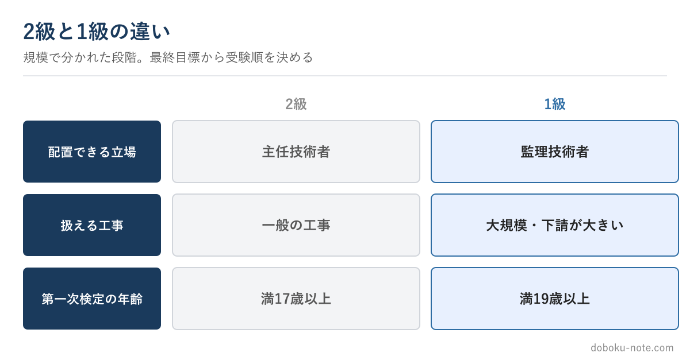

# 【土木施工管理技士】2級と1級、どちらから受けるべきか — 受験順の判断

**こんな人のための記事です**

- 土木施工管理技士を受けたいが、2級と1級のどちらから受けるか迷っている
- 級によって何が変わるのか整理したい
- 自分の状況でどちらが得かを判断したい

**この記事でわかること**

- 1級と2級は「別の試験」ではなく段階であること
- どちらから受けるのが向いているかの判断軸
- 発注者から見た、現場での級の違い

---

筆者は元・地方自治体の土木職（発注者）で、1級土木施工管理技士を保有しています。発注者として現場の技術者と接する中で、「2級と1級、どちらから受けるべきか」はよく相談される話でした。

結論から言うと、**正解は人によって違い、受験資格と急ぎ具合で決まります**。判断軸を整理します。

## 1級と2級は「別の試験」ではなく段階

まず押さえたいのは、1級と2級は競合する別資格ではなく、扱える工事の規模で分かれた段階だということです。

2級土木施工管理技士は**主任技術者**として、1級土木施工管理技士は**監理技術者**として配置できます。大規模で下請金額の大きい工事の監理技術者になれるのが1級、という違いです。

つまり最終的に1級を目指す人にとって、2級は通過点にもなり得ます。

## どちらから受けるのが向いているか

判断軸は主に2つです。

**受験資格を満たすか**——1級・2級それぞれに受験資格があります。1級の受験資格を満たすなら、最終目標が1級である人は1級から狙う価値があります。まだ満たさないなら、先に2級を取って実務を積むルートが現実的です。

**急いで「技士」が必要か**——昇進・配置・手当などで早く資格が要るなら、合格しやすい2級を先に確保するのが手堅い選択です。一方、時間に余裕があり最終的に1級が目標なら、回り道を減らす意味で1級に直接挑む判断もあります。

迷ったら2級から、というのは堅実な原則です。2級で記述試験の感覚をつかんでおくと、1級の対策がスムーズになります。

## 制度改正で「一次は早く取れる」ようになった

令和6年度の制度改正で、第一次検定は実務経験なし（年齢要件のみ）で受けられるようになりました。これは受験順の自由度を上げています。

実務経験が浅いうちでも一次に合格して「技士補」になっておき、実務経験を積んでから二次に進む、という設計が取りやすくなりました。級ごとの正確な受験資格は年度で更新されるため、最終確認は公式の受検案内で行ってください。

## 発注者から見た現場での違い

発注者の目線で言えば、2級と1級の差は「任せられる工事の規模」に直結します。監理技術者を必要とする規模の工事では1級が要る。だから1級は、扱える仕事の幅をはっきり広げます。

ただし、2級でも主任技術者として多くの現場を担えます。「いずれ1級」を見据えつつ、まず2級で実績と自信をつけるのは、遠回りではなく着実な順路です。自分のキャリアの段階に合わせて選べばよいのです。

## まとめ

- 1級（監理技術者）と2級（主任技術者）は規模で分かれた段階
- 1級の受験資格を満たし最終目標が1級なら1級から、迷うなら2級から
- 制度改正で一次は早く取れる。技士補を先に確保する設計も有効
- 正確な受験資格は公式の受検案内で確認する

## 関連リソース

**2級土木施工管理技士の過去問解説・テキスト**（無料・doboku-note）

[過去問解説・テキストの一覧を見る](https://doboku-note.com/docs/civil-construction-2-guide-exam-overview?utm_source=note&utm_medium=referral&utm_campaign=2c-vs-1c-order&utm_content=exam-overview)

**2級土木 受験資格の全体像**（実務経験・経過措置）

https://note.com/dobokunote/n/n6e6db14f4dfc

## 資格を取ったら市場価値はどう変わる？

級の順番と並んで気になるのが「取った後どう効くか」です。2級を取ると主任技術者として配置でき、1級（監理技術者）まで進むと扱える工事の規模と待遇の上限が大きく変わります。1級取得後の市場価値は[1級土木施工管理技士の市場価値（転職・年収・独立）](https://doboku-note.com/docs/civil-construction-1-guide-market-value?utm_source=note&utm_medium=referral&utm_campaign=2c-vs-1c-order&utm_content=market-value)に、2級取得でできることは[2級土木を取ると何ができる？（年収・転職・1級への道）](https://doboku-note.com/docs/civil-construction-2-guide-career?utm_source=note&utm_medium=referral&utm_campaign=2c-vs-1c-order&utm_content=career)にまとめました。

**PR**：以下はアフィリエイト広告を含みます。

すでに実務経験があり、級の取得を機に条件を見直したい方は、建設・施工管理に特化した転職エージェントの無料キャリア面談で、いまの経験・資格で狙える求人と想定年収を確認できます。登録・相談は無料で、在職中でも動くかは提示された条件を見てから決められます。

https://px.a8.net/svt/ejp?a8mat=4B5OO5+FHBA2+5B0Y+NTJWY

---

<!-- cta:civil-mokuji -->
1級・2級土木のほかの記事・経験記述の答案集は「土木もくじ」から一覧できます。

https://note.com/dobokunote/n/n4fde0f62dc20