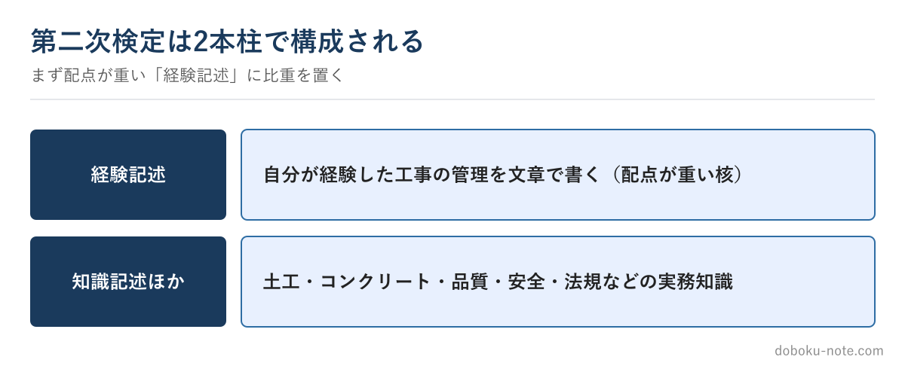

# 【2級土木施工管理技士】第二次検定は何が問われるか — 全体像と対策の順番

**こんな人のための記事です**

- 第一次検定の次に控える第二次検定の全体像を知りたい
- 二次は何が問われ、どこから対策すべきか分からない
- 限られた時間で効率よく二次を準備したい

**この記事でわかること**

- 第二次検定の2本柱（施工経験記述と施工管理の知識記述）
- どこに対策の比重を置くべきか
- 着手の順番

---

筆者は元・地方自治体の土木職（発注者）で、1級土木施工管理技士を保有しています。第二次検定は、第一次検定とは性質がまるで違う試験です。

一次が知識を広く問う択一中心なのに対し、二次は**書いて答える**試験。ここで戸惑う人が多いので、全体像と対策の順番を整理します。各問題の正確な構成は年度で変わるため、最新の出題はサイトの年度別過去問で確認してください。

<!-- cta:pack-top -->
自分の工事に近い「想定工事」を選んで5管理すべての完成答案をそろえるなら、2級の想定工事×5管理をそろえた想定工事バンクが最短です。

https://note.com/dobokunote/m/m8554e87ca6ec

## 二次は「経験記述」と「知識の記述」の2本柱

第二次検定は、大きく2つの要素で構成されます。

一つは**施工経験記述**（問題1）。自分が実際に経験した土木工事について、安全・品質・工程などの管理をどう行ったかを文章で書きます。これは唯一無二の、あなた自身の経験が問われる部分です。

もう一つは**施工管理の知識を問う記述・選択問題**。土工、コンクリート、品質管理、安全管理、施工計画、関係法規など、施工管理の実務知識を問われます。一次で覚えた知識を、解答として書ける・選べる形にしておく必要があります。

## 対策の比重は「経験記述」に置く

限られた時間なら、まず**施工経験記述に比重を置く**のが定石です。

理由は、経験記述が配点上も重く、かつ「自分の経験を文章化する」という準備に時間がかかる部分だからです。知識問題は一次の延長で積み上げやすいのに対し、経験記述はゼロから自分の工事を題材に組み立て、推敲を重ねる必要があります。直前の詰め込みが最も効きにくいのが経験記述です。

## 着手の順番

おすすめの順番はこうです。

1. **経験記述の題材を決める**——自分が経験した工事を選び、どの管理項目で書くかを早めに固める
2. **経験記述の骨子を書いて寝かせる**——課題→検討→対応→結果の骨子を作り、推敲を繰り返す
3. **知識記述を過去問で固める**——一次の知識を、記述・選択で答えられる形に仕上げる
4. **直前に通し練習**——時間配分を含めて本番形式で確認する

経験記述を早く動かし、知識問題を後半で仕上げる。この順番が、働きながらの受験では最も無理がありません。

## 経験記述は「完成形」を一度見ておく

経験記述は、手本を見ずに自己流で書くと、課題と対応がつながらない・一般論になる、といった失敗に陥りがちです。完成した答案を一度通して読むと、評価される密度が体でわかり、自分の答案の不足に気づけるようになります。

施工経験記述の書き方の詳細や、安全・品質・工程それぞれのフル完成答案は、別の記事と教材にまとめています。

## 関連リソース

**施工経験記述 出題傾向と対策**（無料・doboku-note）

https://doboku-note.com/docs/civil-construction-2-secondary-experience-writing-guide

**2級土木施工管理技士の年度別 過去問解説**（無料・doboku-note）

https://doboku-note.com/?utm_source=note&utm_medium=referral&utm_campaign=2c-secondary-overview

**2級土木 施工経験記述 完成答案集**（安全・品質・工程のフル答案）

https://note.com/dobokunote/m/m1881a9578027

全体像をつかんだら、実際の文章の水準は[2級 施工経験記述の記述例](https://doboku-note.com/docs/civil-construction-2-secondary-experience-writing-examples?utm_source=note&utm_medium=referral&utm_campaign=2c-secondary-overview&utm_content=experience-writing-examples)で確認できます。

---

<!-- cta:civil-mokuji -->
1級・2級土木のほかの記事・経験記述の答案集は「土木もくじ」から一覧できます。

上位資格の分析力・発注者の採点眼・合格者の当事者性で、あなたの答案を合格ラインへ引き上げます。

https://note.com/dobokunote/n/n4fde0f62dc20
