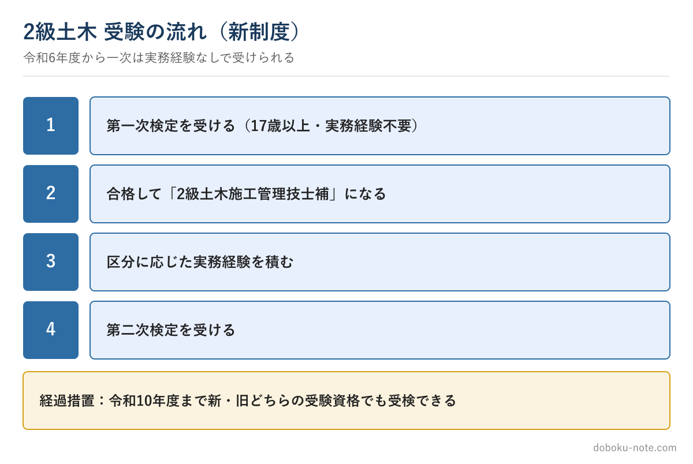

# 【2級土木施工管理技士】受験資格はこう変わった — 一次は17歳から、二次は実務経験で

**こんな人のための記事です**

- 2級土木施工管理技士を受けたいが、自分が受験資格を満たすか分からない
- 令和6年度の制度改正で何が変わったのか知りたい
- 実務経験が足りるか不安

**この記事でわかること**

- 第一次検定が「実務経験なし」で受けられるようになったこと
- 第二次検定は「学歴」ではなく「一次合格後の実務経験」で受ける仕組み
- 旧制度でも受けられる経過措置と、正確な年数の確認先

---

筆者は元・地方自治体の土木職（発注者）で、1級土木施工管理技士を保有しています。発注者の立場で、若手から「自分は受験資格を満たすのか」とよく聞かれました。

令和6年度の制度改正で受験資格が大きく変わり、ここでつまずく人が増えています。この記事で全体像を整理します。

なお、必要な実務経験の**正確な年数は年度ごとに更新される**ため、最終確認は必ず試験実施団体（全国建設研修センター）の最新の「受検の手引」で行ってください。この記事は仕組みの全体像をつかむためのものです。

<!-- cta:pack-top -->
自分の工事に近い「想定工事」を選んで5管理すべての完成答案をそろえるなら、2級の想定工事×5管理をそろえた想定工事バンクが最短です。

https://note.com/dobokunote/m/m8554e87ca6ec

## 第一次検定：実務経験なしで受けられるようになった

最大の変更点はここです。令和6年度の改正により、**第一次検定は、受検する年度内に17歳以上であれば、学歴も実務経験も問わず受けられる**ようになりました。

以前は学歴に応じた実務経験が必要でしたが、今は実務経験がなくても一次を受けられます。学生や、土木の仕事に就いて間もない人でも、まず一次に挑戦できる。

一次に合格すれば「2級土木施工管理技士補」となり、その後の二次受験につながります。「経験が浅いから無理」と諦めていた人こそ、まず一次から動けます。

## 第二次検定：学歴ではなく「一次合格後の実務経験」で受ける

第二次検定の新しい受験資格は、**学歴・学科を問わず、第一次検定などの合格後に一定の実務経験を積むこと**で得られます。

実務経験年数は、「2級第一次検定の合格後」「1級第一次検定の合格後」「2級第二次検定（旧実地試験を含む）の合格後」「土木の技術士第二次試験の合格後」といった区分ごとに定められています。区分によって必要年数が違うため、自分がどの区分に当たるかを確認するのが第一歩です。

旧制度にあった「指導監督的実務経験」の要件は、新受験資格ではなくなりました。

## 経過措置：当面は旧資格でも受けられる

制度がいきなり切り替わると不利になる人が出るため、**令和6年度から令和10年度までの5年間は経過措置**として、新受験資格・旧受験資格のどちらでも受験できます。

すでに学歴ベースの旧資格で受験要件を満たしている人は、その枠でも受けられます。自分にとって有利なほうを選べる期間なので、両方の条件を確認しておくとよいでしょう。

## 実務経験で迷ったら

「この経験は実務経験に含まれるのか」で迷う人は多いです。認められる工事の種別や経験の数え方は、受検の手引に具体的に示されています。自己判断で申し込むと、後で要件を満たさないと判明する事態になりかねません。

確認の順番は、(1) 自分が新・旧どちらの受験資格で受けるかを決める、(2) その区分で必要な実務経験年数を手引で確認する、(3) 自分の経験がその要件に当てはまるかを照合する、です。

**正確な要件は必ず公式の受検案内で確認してください。**

https://www.jctc.jp/exam/guide/dbk-2/

## まとめ

- 第一次検定は受検年度に17歳以上なら実務経験不要で受けられる
- 第二次検定は学歴でなく「一次合格後などの実務経験」で受ける（区分ごとに年数が違う）
- 令和10年度までは新旧どちらの受験資格でも受験可
- 正確な年数・認められる経験は公式の受検の手引で確認する

受験資格を満たす見通しが立ったら、次は学習設計です。二次の核となる施工経験記述は早めに着手するほど効きます。

## 関連リソース

**2級土木施工管理技士の過去問解説・テキスト**（無料・doboku-note）

https://doboku-note.com/?utm_source=note&utm_medium=referral&utm_campaign=2c-eligibility

**2級土木 第1次検定 過去問PDF**（令和3〜7年度 前期後期 全630問・全選択肢解説）— まず一次を突破したい人の演習教材

https://note.com/dobokunote/n/n4963f45bd6f8

[施工経験記述 出題傾向と対策（無料・doboku-note）](https://doboku-note.com/docs/civil-construction-2-secondary-experience-writing-guide?utm_source=note&utm_medium=referral&utm_campaign=2c-eligibility&utm_content=secondary-writing-guide)

**2級土木 施工経験記述 完成答案集**（二次の経験記述フル答案）

https://note.com/dobokunote/m/m1881a9578027

---

<!-- cta:civil-mokuji -->
1級・2級土木のほかの記事・経験記述の答案集は「土木もくじ」から一覧できます。

https://note.com/dobokunote/n/n4fde0f62dc20
