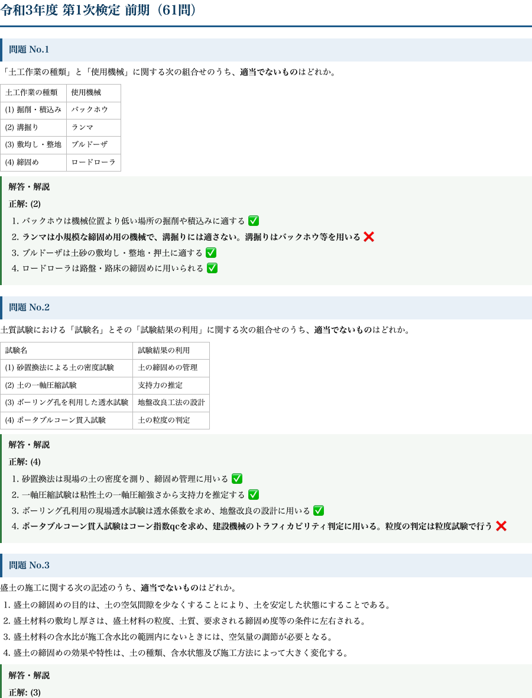

# 2級土木 第1次検定｜過去問PDF（令和3〜7年度 前期後期 全630問・全選択肢解説）

**こんな人のための記事です**

- 2級土木施工管理技士の第1次検定（学科）を、過去問を回して確実に突破したい
- 市販の過去問集は「正解の肢」しか載っておらず、なぜ他の肢が誤りなのかが分からない
- スマホやタブレット、印刷して、通勤・昼休み・直前期に紙で高速に回したい

2級土木の第1次検定は、過去問と同じ論点が手を替え品を替え繰り返し出題されます。合格の最短ルートは「新しい問題を解く」ことではなく、**過去問を、全部の選択肢について『なぜ正しいか・なぜ誤りか』まで言えるようにする**ことです。

市販の過去問集の多くは、正解番号と正解肢の簡単な説明しか載っていません。しかし本試験で問われるのは「適当でないものはどれか」という消去法の判断です。**4つの肢すべての正誤を根拠から説明できて、はじめて本番でどの肢が来ても迷わなくなります。**

この教材は、令和3年度から令和7年度までの前期・後期、**全630問を1問残らず収録し、4つの選択肢すべてに正誤の理由を付けた**A4印刷用PDFです。サイトの無料解説をベースに、紙で回せるよう再編集しました。

## 収録内容

- **令和3〜7年度 前期・後期の全10回・全630問**（第1次検定の全分野＝土工・コンクリート・構造・施工管理・法規ほか）
- **全問・全選択肢に正誤の理由を明記**（正解肢だけでなく、誤りの肢がなぜ誤りかまで）
- 組合せ問題は表で整理、水準測量など計算問題は途中式つき
- A4・通しページ番号つきの印刷用PDF（印刷しても、タブレットで開いても読める版面）
- 出典・著作権・免責を明記（過去問の著作権は実施団体に帰属。解答・解説・編集は当方オリジナル）

## 中身サンプル

実際の紙面はこの品質です（令和3年度前期の冒頭）。

たとえば非計算問題は、次のように4肢すべてに根拠が付きます。

> **問題 No.3　盛土の施工に関する次の記述のうち、適当でないものはどれか。**

> 選択肢1　盛土の締固めの目的は、土の空気間隙を少なくすることにより、土を安定した状態にすることである。

> 選択肢2　盛土材料の敷均し厚さは、盛土材料の粒度、土質、要求される締固め度等の条件に左右される。

> 選択肢3　盛土材料の含水比が施工含水比の範囲内にないときには、空気量の調節が必要となる。

> 選択肢4　盛土の締固めの効果や特性は、土の種類、含水状態及び施工方法によって大きく変化する。

**正解: (3)**

1. 締固めにより空気間隙を減らし土を安定させるのは正しい
2. 敷均し厚さは粒度・土質・要求締固め度で決まる
3. 含水比が施工含水比の範囲外のときは「含水量の調節（曝気乾燥や散水）」を行うのが原則で、空気量の調節は誤り
4. 締固め効果は土質・含水状態・施工方法で変化する

このように、正解番号を覚えるのではなく「3が誤りなのは含水量調節を空気量調節とすり替えているから」まで言えるようにするのが、本番で崩れない解き方です。全630問がこの粒度で解説されています。

<!-- cta:civil-mokuji -->
1級・2級土木のほかの記事・経験記述の答案集は「土木もくじ」から一覧できます。

https://note.com/dobokunote/n/n4fde0f62dc20

## PDF のダウンロードと使い方

ここから先で、全630問・全選択肢解説のA4印刷用PDF（この記事の末尾に添付）をダウンロードできます。以下は、直前期までにこのPDFを合格力に変える回し方です。

**1周目：分野の地図をつくる**（試験2〜3か月前）

まずは通しで1周し、各問の解説まで読みます。ここでは正答率は気にせず、「どの分野で・どんな論点が・どんな聞かれ方をするか」を体に入れるのが目的です。誤った肢の理由まで読むことで、1問から4つの知識が入ります。

**2周目：落とした肢だけを狩る**（試験1か月前）

2周目は、1周目で理由を言えなかった肢にだけ印をつけ、その肢の周辺知識を解説で埋めます。「正解した問題」でも、他の3肢の理由が言えなければ未修得として扱います。

**3周目・直前期：印のついた肢を高速反復**

印のついた肢だけを、移動時間や昼休みに高速で回します。紙のPDFなので、電波もアプリも要りません。試験前日は、各分野の冒頭数問だけを流し読みして「聞かれ方」を思い出せば十分です。

この3周で、過去5年に出た論点はほぼ網羅できます。新しい問題集に手を広げるより、この630問を「全肢説明できる」状態にするほうが、合格に直結します。

## 出典・免責

本教材は、一般財団法人 全国建設研修センターが実施する2級土木施工管理技術検定（第1次検定）の過去問題を出典としています。問題文の著作権は出典元に帰属します。解答・解説および複数年度の編集・再構成は著者（doboku-note）によるものです。

本教材は正確を期して作成していますが、内容を保証するものではありません。法令・基準は改正されることがあるため、受験にあたっては必ず最新の一次情報をご確認ください。

---

<!-- cta:civil-mokuji -->
1級・2級土木のほかの記事・経験記述の答案集は「土木もくじ」から一覧できます。

上位資格の分析力・発注者の採点眼・合格者の当事者性で、あなたの答案を合格ラインへ引き上げます。

https://note.com/dobokunote/n/n4fde0f62dc20
