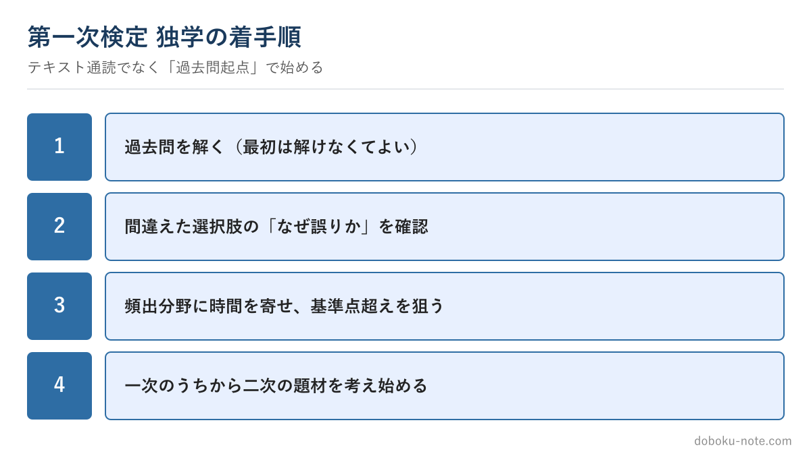

# 【2級土木施工管理技士】第一次検定を独学で突破する — 何から手をつけるか

**こんな人のための記事です**

- 2級土木の第一次検定を独学で受けたい
- 範囲が広くて、どこから手をつければいいか分からない
- 効率よく合格ラインを超えたい

**この記事でわかること**

- 一次はテキスト通読でなく「過去問起点」で始める理由
- 頻出分野に時間を寄せる絞り込み方
- 一次のうちから二次の助走を始める意味

---

筆者は元・地方自治体の土木職（発注者）で、1級土木施工管理技士を保有しています。第一次検定は範囲が広く、独学だと「どこから手をつけるか」で迷いがちです。

制度改正で一次は実務経験なし（年齢要件のみ）で受けられるようになり、受ける人の幅も広がりました。最短で合格ラインに乗せる始め方を示します。

## テキスト通読ではなく「過去問起点」で始める

独学で最もありがちな失敗は、分厚いテキストを最初のページから読み始めることです。範囲が広いので、たいてい途中で力尽きます。

正解は逆で、**まず過去問を解く**ことから始めます。最初は解けなくて当然です。

解いて、間違えた選択肢について「なぜ誤りなのか」を確認する。これを繰り返すうちに、出題の形と頻出分野が見えてきます。テキストは、過去問で出た箇所を確認するための辞書として使う——この順序が、限られた時間では圧倒的に効率的です。

## 頻出分野に時間を寄せる

一次は出題分野が広い一方で、毎年よく問われる分野とそうでない分野があります。**頻出分野を確実にし、出題の薄い分野に深入りしない**のが時間配分の鉄則です。

合格は満点ではなく基準点を超えること。取れるところを確実に取り、難問は割り切る。

過去問を何年分か解くと、自分が得点源にすべき分野と、捨ててもよい分野の見当がついてきます。その地図に沿って時間を配るのが、独学の勝ち筋です。

## 暗記はツールで効率化する

紛らわしい用語や数値の暗記は、独学だと孤独で続きにくい部分です。ここはAIや学習アプリで効率化できます。

間違えた選択肢の理由をその場で確認したり、紛らわしい用語の違いを一度に整理させたりすると、調べ物の時間が大きく縮みます。AIを使った勉強法は別の記事にまとめています。

## 一次のうちから二次の助走を始める

見落とされがちですが、一次の勉強中から**二次の施工経験記述の題材を考え始める**と、後がとても楽になります。

経験記述は自分の工事を題材にするため、準備に時間がかかります。一次の知識を学びながら「この管理項目なら、あの現場が書けそうだ」と当たりをつけておくだけで、一次合格後のスタートが早まります。

一次と二次を完全に分断せず、一次のうちに二次へ橋を架けておくのが、合格までの総時間を縮めるコツです。

## まとめ

- 一次は過去問起点で始める。テキストは辞書として使う
- 頻出分野に時間を寄せ、基準点超えを狙う
- 暗記はAI・アプリで効率化する
- 一次のうちから二次の題材を考え始める

## 関連リソース

[2級土木施工管理技士の過去問解説・テキスト（無料・doboku-note）](https://doboku-note.com/docs/civil-construction-2-guide-exam-overview?utm_source=note&utm_medium=referral&utm_campaign=2c-primary-selfstudy&utm_content=exam-overview)

**2級土木 施工経験記述 完成答案集**（二次対策のフル答案）

https://note.com/dobokunote/m/m1881a9578027

---

<!-- cta:civil-mokuji -->
1級・2級土木のほかの記事・経験記述の答案集は「土木もくじ」から一覧できます。

上位資格の分析力・発注者の採点眼・合格者の当事者性で、あなたの答案を合格ラインへ引き上げます。

https://note.com/dobokunote/n/n4fde0f62dc20