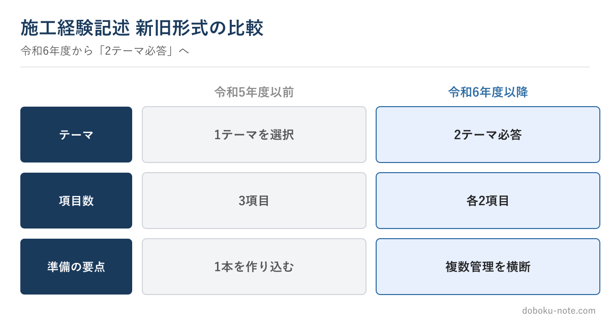

# 【2級土木施工管理技士】施工経験記述 令和6年 新形式への備え方 — 2テーマ必答で準備はどう変わるか

**こんな人のための記事です**

- 令和6年度から施工経験記述の形式が変わったと聞いた
- 旧形式向けの対策のまま準備していて不安
- 2テーマ必答にどう備えればいいか分からない

**この記事でわかること**

- 旧形式と新形式の違い（早見）
- 「効かなくなった準備」と「効くようになった準備」
- 一つの工事を複数管理で語る「持ちネタ」の作り方

---

筆者は元・地方自治体の土木職（発注者）で、1級土木施工管理技士を保有しています。令和6年度の出題形式の見直しを受けて、準備のしかたを変える必要が出てきました。

まず、新旧の違いを一覧にします。形式の正確な仕様はサイトの無料解説に譲り、この記事ではその先、「**形式が変わったことで準備をどう変えるべきか**」という実践の話に絞ります。

一行で言えば、従来の「**一つの完成答案を丸暗記する**」やり方が通用しにくくなった、ということです。

<!-- cta:pack-top -->
自分の工事に近い「想定工事」を選んで5管理すべての完成答案をそろえるなら、2級の想定工事×5管理をそろえた想定工事バンクが最短です。

https://note.com/dobokunote/m/m8554e87ca6ec

## 効かなくなった準備・効くようになった準備

旧来の対策の典型は、「自分の鉄板の工事を一つ決め、一つの管理項目で完璧な答案を一本作り込んで暗記する」でした。本番でその一本を再現すれば戦えたからです。

新形式では、指定された複数の管理項目に答える必要があるため、**一本の丸暗記では穴が出ます**。指定された側のテーマで持ちネタがないと、その場でひねり出すことになり、答案が薄くなります。

逆に効くようになったのは、「**一つの工事を、複数の管理項目から語れるように準備しておく**」やり方です。同じ工事でも、安全の側面・品質の側面・工程の側面はそれぞれ存在します。

一つの現場を多面的に整理しておけば、どの項目を指定されても対応できます。

## 一つの工事を多面的に棚卸しする — 具体例

たとえば「河川護岸工事」を題材にするなら、管理項目ごとにこう棚卸しします。

- 安全管理：護岸ブロック据付での重機と作業員の輻輳をどう防いだか
- 品質管理：ブロックの据付精度・基礎コンクリートの出来形をどう管理したか
- 工程管理：出水期前に完了させるため、工程の制約をどう調整したか

このように、一つの現場から3つの管理項目の骨子を引き出しておく。完成文まで作り込まなくてよいので、課題→検討→対応の骨子だけを項目数だけ持っておきます。

これが新形式の「持ちネタ」です。本番では、指定されたテーマに合わせて、用意した骨子から該当するものを引き出して肉付けします。

## 各2項目で薄くなりやすい点

新形式は項目が分かれるぶん、1項目あたりに割ける字数が限られます。ここで起きやすいのが「**全部が浅くなる**」失敗です。

対策は、各項目で「課題→なぜその対応を選んだか→対応→結果」のうち、特に**検討**（判断の理由）を一文でも入れること。やったことの羅列ではなく、判断の理由が入ると、短い字数でも主任技術者としての力量が伝わります。

限られた字数の中で何を残すかが、新形式の勝負どころです。

## 多面的な持ちネタを「完成形」で確認する

新形式に強い準備とは、結局「一つの工事を複数の管理項目から語る引き出し」を持つことです。とはいえ、自分一人で各項目の完成イメージを作るのは難しい。

安全・品質・工程の3管理それぞれに、複数工種のフル完成答案をまとめた有料マガジンを用意しています。「同じような現場をこの管理項目で書くとこうなる」という完成形が項目別にそろうので、自分の持ちネタを多面化する型として使えます。

各答案に置換ガイドと採点者視点を付けています（丸写しは失格につながるため、必ず自分の経験に置き換える前提です）。

https://note.com/dobokunote/m/m1881a9578027

## 関連リソース

**施工経験記述 出題傾向と対策**（無料・doboku-note｜令和6年 形式見直しの仕様）

https://doboku-note.com/docs/civil-construction-2-secondary-experience-writing-guide

**施工経験記述 改善例**（無料・doboku-note）

https://doboku-note.com/docs/civil-construction-2-secondary-experience-writing-examples

**2級土木 施工経験記述 完成答案集**（3管理別フル答案・新旧形式対応）

https://note.com/dobokunote/m/m1881a9578027

---

<!-- cta:civil-mokuji -->
1級・2級土木のほかの記事・経験記述の答案集は「土木もくじ」から一覧できます。

上位資格の分析力・発注者の採点眼・合格者の当事者性で、あなたの答案を合格ラインへ引き上げます。

https://note.com/dobokunote/n/n4fde0f62dc20