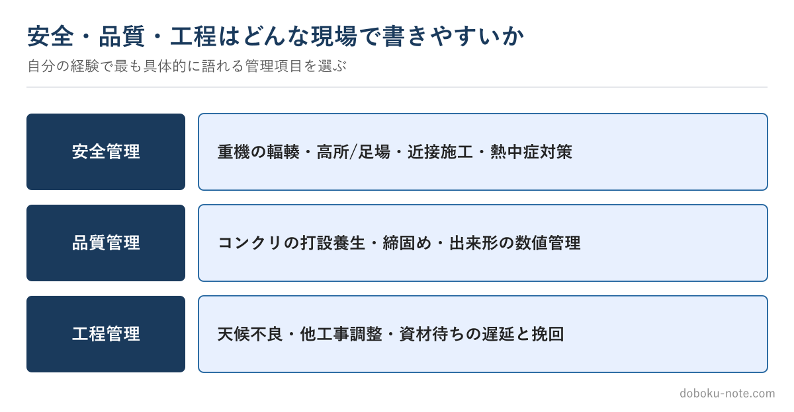

# 【2級土木施工管理技士】施工経験記述は「安全・品質・工程」どれで書くか — 題材選びで半分決まる

**こんな人のための記事です**

- 施工経験記述を安全・品質・工程のどれで書くか迷っている
- どの工事を題材にすれば書きやすいか分からない
- 書き始めてから「この題材では書きにくい」と気づくことが多い

**この記事でわかること**

- 管理項目は「現場の事実」から逆算して選ぶべき理由
- 安全・品質・工程それぞれが書きやすい現場と、書ける課題の例
- 令和6年の新形式で有利になる題材の持ち方

---

筆者は元・地方自治体の土木職（発注者）で、1級土木施工管理技士を保有しています。施工経験記述というと答案の書き方に目が向きがちですが、本番の出来を大きく左右するのは、書き始める前の「**題材選び**」です。

ここでの題材選びとは、「どの工事を」「どの管理項目（安全・品質・工程）で書くか」の組み合わせを決めることです。同じ実力でも、この選び方しだいで書きやすさがまるで変わります。

出題形式の基本はサイトの無料解説に譲り、この記事は題材選びの考え方に絞ります。

<!-- cta:pack-top -->
自分の工事に近い「想定工事」を選んで5管理すべての完成答案をそろえるなら、2級の想定工事×5管理をそろえた想定工事バンクが最短です。

https://note.com/dobokunote/m/m8554e87ca6ec

## 管理項目は「現場の事実」から逆算する

よくある失敗は、「品質管理で書きたい」と先に決めてしまい、後から無理に品質の課題をひねり出すことです。これだと一般論になりがちで、薄い答案になります。

正しい順序は逆で、まず**自分が経験した工事で実際に苦労したこと**を思い出し、それがどの管理項目に当たるかを後から決めます。実際に困った出来事には、課題・検討・対応が初めから備わっています。

事実から逆算すれば、書く材料は最初からそろっているのです。

## 3管理それぞれが書きやすい現場

自分の経験工事を思い浮かべ、「いちばん具体的に語れるのはどれか」で選ぶと外しません。

**安全管理**が書きやすいのは、危険の予測と対策が明確に語れる現場です。たとえば「掘削法面の崩壊リスクに対し、法面勾配を見直し、土留めの変位を計測しながら掘削した」のように、危険と対策がセットで出てくる現場が向きます。

**品質管理**は、規格・基準に対して数値で管理した経験がある現場が向きます。「寒中コンクリートで養生温度を管理した」「盛土の締固め度を試験で確認しながら施工した」など、数値が入ると一気に具体的になります。

**工程管理**は、遅れの要因をどう分析し、どう挽回したかが語れる現場が向きます。「出水期前の完了が必須で、雨天中止を見込んで工程を組み替えた」といった、工程上の判断が見える現場です。

## 「課題が立てやすい工事」を選ぶ

複数の工事経験がある場合は、**課題が立てやすい工事**を選びます。課題が立てやすいとは、当時あなたが現場条件を踏まえて何かを判断した経験がある、ということです。

上司の指示に従っただけ、定型どおりに進んだだけの工事は、知識としては書けても当事者性が出ません。小さくても「自分が考えて対応した」経験のある工事のほうが、答案に厚みが出ます。

役職の高さは関係ありません。担当者として調査・検討・調整に関わった経験があれば、立派な題材になります。

## 新形式では「複数項目で書ける工事」が有利

令和6年度からの新形式は複数の管理項目に答える必要があるため、**一つの工事を安全・品質・工程の複数面から語れる**と有利です。

一件の工事を選んだら、その現場の安全面・品質面・工程面それぞれで「困ったこと」を棚卸ししておきます。どの項目を指定されても、その工事から引き出せる状態を作っておくのが、新形式での題材選びの肝です。

## 「書きやすい題材の完成形」を見て基準を持つ

題材選びがうまくなる近道は、「この工種・この管理項目だと、完成した答案はこのくらいの密度になる」という基準を持つことです。基準があれば、自分の題材が書ききれるかを選ぶ前に判断できます。

安全・品質・工程の3管理それぞれに、複数工種のフル完成答案をまとめた有料マガジンを用意しています。管理項目別・工種別に完成形がそろうので、「自分のあの工事なら、この項目で書けそうだ」という当たりがつけやすくなります。

https://note.com/dobokunote/m/m1881a9578027

## 関連リソース

**施工経験記述 出題傾向と対策**（無料・doboku-note）

https://doboku-note.com/docs/civil-construction-2-secondary-experience-writing-guide

**施工経験記述 改善例**（無料・doboku-note｜工種×テーマ別の記入例）

https://doboku-note.com/docs/civil-construction-2-secondary-experience-writing-examples

**2級土木 施工経験記述 完成答案集**（管理項目別・工種別のフル答案）

https://note.com/dobokunote/m/m1881a9578027

テーマ選びの前に試験全体の構成を確認したい方は[2級土木施工管理技士の全体像](https://doboku-note.com/docs/civil-construction-2-guide-overview?utm_source=note&utm_medium=referral&utm_campaign=2c-essay-theme&utm_content=civil2-overview)をご覧ください。

---

<!-- cta:civil-mokuji -->
1級・2級土木のほかの記事・経験記述の答案集は「土木もくじ」から一覧できます。

上位資格の分析力・発注者の採点眼・合格者の当事者性で、あなたの答案を合格ラインへ引き上げます。

https://note.com/dobokunote/n/n4fde0f62dc20