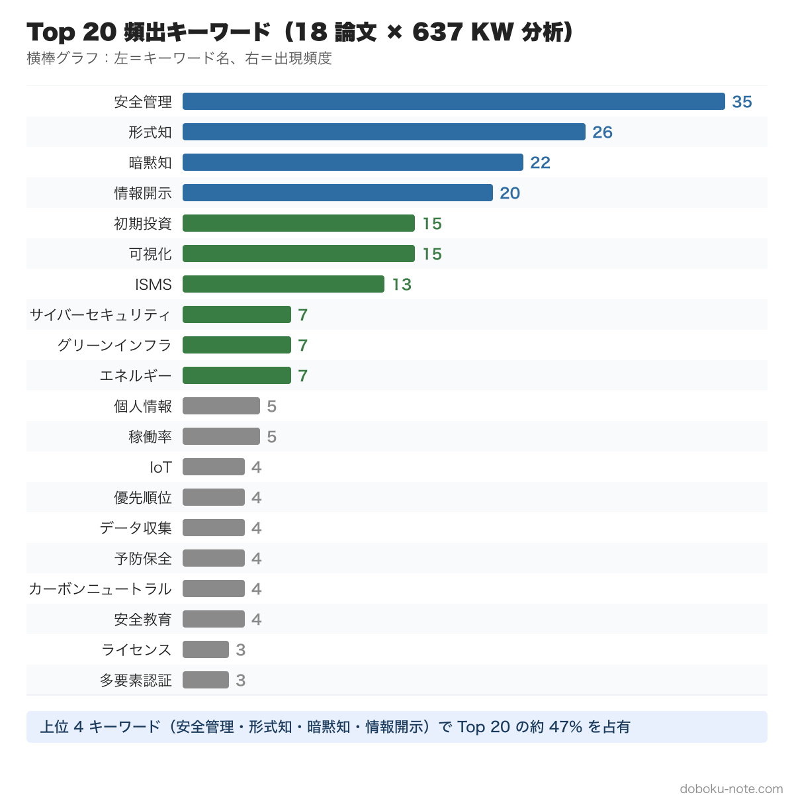
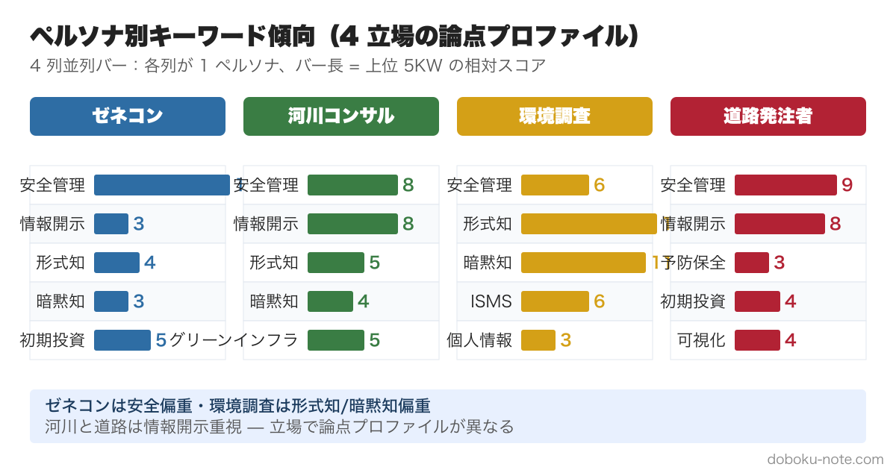
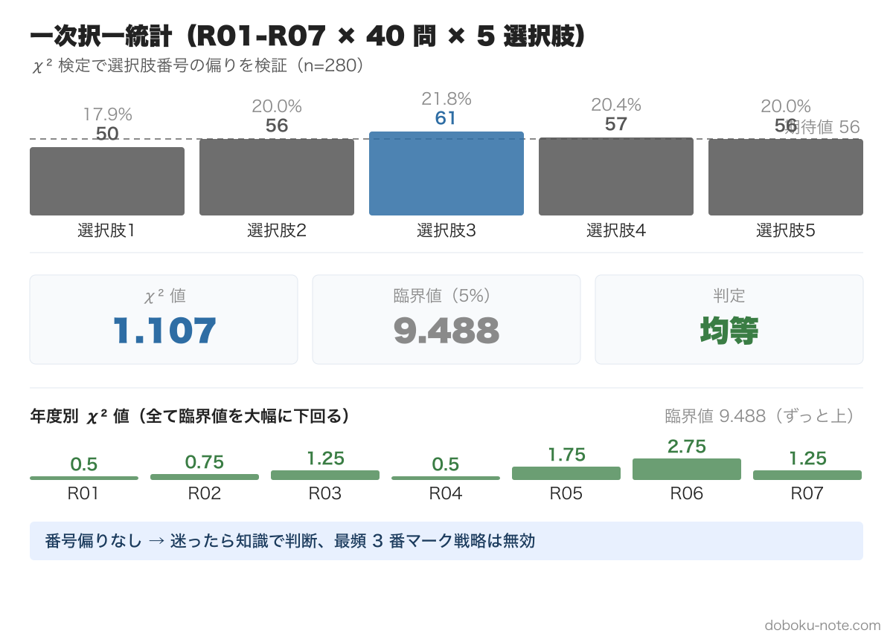

# 技術士総監 記述式 データ駆動受験戦略

**18 論文 × 637 KW × 280 択一の機械分析でわかる出題の地形図**

——「迷ったら 3」は嘘だった。χ²=1.107 が示す本当の優先順位

---

## はじめに：あなたの 30 時間を取り戻す

技術士総合技術監理部門の試験勉強で、最も時間が溶けるのは「何から手をつければいいか分からない」状態です。

5 管理 600+ キーワード、過去 7 年の択一 280 問、4 ペルソナ × 5 年の記述模範例……。学べる素材が無限にあるからこそ、勉強の**優先順位**を間違えると 100 時間でも足りません。

本書は、この優先順位問題を**機械分析の独自データ**で解決します。

- **記述式模範論文 18 編 × 5 管理キーワード集 637 語** を全文突合し、頻出キーワード Top 20 を抽出
- **択一過去問 R01-R07 × 280 問** の正答番号分布を χ² 検定で評価
- **4 ペルソナ別の論点プロファイル**で「自分の業務に近い人がどんな論点で書いているか」を可視化

記述式キーワード分析の素材データは [doboku-note](https://doboku-note.com) のサイト上で公開しています（[essay-data-2026](https://doboku-note.com/docs/pe-comprehensive-management-essay-data-2026)）。一方、択一試験 280 問 × χ² 検定の完全データセットは本書に内蔵（第 5 章）し、サイトでは公開していません。本書は、これらのデータを「**読み物としての戦略書**」に再構成し、試験 2 ヶ月前の受験者が即座に**学習計画を立てられる**ようまとめたものです。

### 本書で答える 3 つの問い

1. **Q1**: どのキーワードを最優先で覚えるべきか？ → 第 2 章
2. **Q2**: 自分の業務に近いペルソナはどんな論点で書いているか？ → 第 3 章
3. **Q3**: 択一の「番号で当てる」戦略は使えるか？ → 第 5 章

それぞれに「データの根拠」と「具体的アクション」を示します。

### 本書の対象

- ✅ 技術士総監 2 次筆記試験の受験者全員
- ✅ 試験 2-6 ヶ月前で「効率的に学びたい」層
- ✅ 既に過去問は解いたが「もう少し体系的に整理したい」中級者
- ❌ 試験 1 ヶ月前で「もう論点はだいたい押さえた」上級者には情報量不足の可能性

---

## 第 1 章 データで見る総監記述式の正体

### 1-1. 分析対象データの全体像

| 区分 | 対象 | 規模 |
|---|---|---:|
| 記述式論文 | R03-R07 × 4 ペルソナ（道路発注者は R05-R07） | **18 編** |
| 突合キーワード | 文部科学省「総合技術監理 キーワード集 2026」より抽出 | **637 語** |
| 択一過去問 | R01-R07 × 各 40 問 | **280 問** |
| 分析方法 | regex 機械抽出 + χ² 検定 |  |

### 1-2. なぜこの分析が意味を持つのか

技術士総監記述式は、5 管理（経済性・人的資源・情報・安全・社会環境）を横断するキーワードを使って 3,000 字級の論文を書く試験です。受験対策で最も効くのは「**頻出キーワードを集中的に押さえる**」こと。

しかし「頻出」を**主観**で判断すると:
- 講師の経験則（「最近の傾向は……」）
- 自分のバイアス（自分の業務で使う言葉）
- 直近 1-2 年の印象（記憶補正）

これらが入り込みます。本書は **18 論文 × 637 語の全件機械突合** で主観を排除し、**事実としての頻出傾向**を提示します。

### 1-3. データ抽出の信頼性

- ✅ **形態素解析未使用**: 単純な部分文字列マッチ。誤抽出は少ない（複合語の取扱いに注意）
- ✅ **ストップワード除外**: 「リスク」「影響」「要素」「対応」等の一般語は除外
- ✅ **キーワード長さ制限**: 2 字以下のキーワードは除外（誤マッチ防止）
- ⚠️ **論文サンプル 18 編**: 統計的に十分だが、特定ペルソナの偏りは残る可能性

### 1-4. 本書を読み終えると何ができるか

1. 試験 2 ヶ月前の段階で「**自分の専門分野で頻出する Top 5 キーワード**」が即座に分かる
2. 「R08 ではこれが出る」というデータ根拠付きの**先読み**ができる
3. 択一試験で「迷ったら○番」という俗説に**惑わされない**
4. doboku-note キーワード集（無料）と組み合わせて**学習計画**が立つ

---

## 第 2 章 頻出 Top 20 キーワードの戦略的優先順位（前半・無料エリア）



### 2-1. 全体 Top 20（5 年 × 4 ペルソナ合計）

| 順位 | キーワード | 出現回数 | 解説（要点） |
|---:|---|---:|---|
| 1 | **安全管理** | **35** | 独立管理分野、ゼネコンで突出（23 回） |
| 2 | **形式知** | **26** | 知識管理の中核、SECI モデル |
| 3 | **暗黙知** | **22** | 形式知とペア出題が定番 |
| 4 | **情報開示** | **20** | 情報管理＋社会環境管理 |
| 5 | 初期投資 | 15 | 経済性管理の判断軸 |
| 6 | 可視化 | 15 | 5S・品質管理・現場改善 |
| 7 | ISMS | 13 | 情報セキュリティの国際規格 |
| 8 | サイバーセキュリティ | 7 | 近年急増 |
| 9 | グリーンインフラ | 7 | R06 以降の頻出 |
| 10 | エネルギー | 7 | カーボンニュートラル文脈 |

### 2-2. Top 4 の絶対支配（無料エリア最後）

Top 4 を合計すると **103 回**で、Top 20 全体の合計 217 回のうち **約 47%** を占めます。**Top 4 を完璧にすれば、論文中で言及される主要論点の半数近くをカバー**できる計算です。

具体的なアクション:

- **安全管理（35 回）**: ALARP 原則・RBM（リスクベース管理）・KY 活動・ヒヤリハット報告・フェールセーフを暗記
- **形式知（26 回）/ 暗黙知（22 回）**: SECI モデル（共同化→表出化→連結化→内面化）を 5 分で説明できるレベルへ
- **情報開示（20 回）**: 公共事業の情報公開（住民合意・ステークホルダー対応）と内部統制の両軸

→ [doboku-note の関連キーワードページ](https://doboku-note.com/docs/pe-comprehensive-management-keyword-2026) でこれら 4 つを徹底的に押さえてから本書の続きへ進んでください。

---

**ここから先は有料エリア（¥1,480）**

---

## 第 2 章 後半：Top 5-20 の細分戦略

### 2-3. 5-10 位の「準頻出」グループの使い方

| 順位 | キーワード | 出現 | 暗記コスト | 論文での使い所 |
|---:|---|---:|---|---|
| 5 | 初期投資 | 15 | 低（一般語） | 経済性管理の比較軸。LCC との対比で使う |
| 6 | 可視化 | 15 | 中 | 5S・品質管理・現場 KPI |
| 7 | ISMS | 13 | 高 | 情報セキュリティの ISO 27001 要件 |
| 8 | サイバーセキュリティ | 7 | 中 | 多要素認証・ゼロトラスト |
| 9 | グリーンインフラ | 7 | 中 | Eco-DRR・NbS との関係 |
| 10 | エネルギー | 7 | 低 | カーボンニュートラル・省エネ |

**戦略**: 5-7 位は **全ペルソナで出現**、8-10 位は**ペルソナ別の偏り**あり（次章で詳述）。

### 2-4. 11-20 位の「ニッチ準頻出」と捨て判断

| 順位 | キーワード | 出現 | 戦略 |
|---:|---|---:|---|
| 11 | 個人情報 | 5 | ISMS とセットで覚える |
| 12 | 稼働率 | 5 | 経済性管理の KPI 集に組み込む |
| 13 | IoT | 4 | DX 文脈で R08 増加見込 |
| 14 | 優先順位（危機） | 4 | 安全管理の意思決定論 |
| 15 | データ収集 | 4 | 情報管理の起点 |
| 16 | 予防保全 | 4 | インフラ老朽化対策 |
| 17 | カーボンニュートラル | 4 | R06 以降必須 |
| 18 | 安全教育 | 4 | 人的資源 × 安全 |
| 19 | 技術ライセンス | 3 | 経済性管理 |
| 20 | 多要素認証 | 3 | 情報セキュリティ実装 |

**捨て判断の指針**: 試験 1 ヶ月前段階で出現 3 回以下のキーワードは「広く浅く」で OK。論文中で使えなくても致命傷にならない。

### 2-5. 暗記の優先順位（試験までの残り日数別）

| 残り日数 | 暗記すべき Top X | 1 キーワード当たりの学習時間 |
|---|---|---|
| **60 日（2 ヶ月）** | Top 20 全部 | 30-60 分（深掘り） |
| **30 日（1 ヶ月）** | Top 10 を深く + 11-20 を要点だけ | 15-30 分 |
| **14 日（2 週間）** | Top 4 を完璧 + 5-10 を要点 | 10-15 分 |
| **7 日（1 週間）** | Top 4 だけを反復 | 5-10 分 |

---

## 第 3 章 ペルソナ別の論点プロファイル



### 3-1. 4 ペルソナの Top 5 比較

機械分析の最大の発見は、**ペルソナによって頻出キーワードが劇的に異なる**ことです。

| 順位 | ゼネコン | 河川コンサル | 環境調査 | 道路発注者 |
|---:|---|---|---|---|
| 1 | **安全管理 23** | グリーンインフラ 7 | **形式知 14** | 情報開示 5 |
| 2 | サイバーセキュリティ 6 | 情報開示 6 | **暗黙知 13** | 形式知 4 |
| 3 | 初期投資 5 | 安全管理 6 | 可視化 7 | 予防保全 4 |
| 4 | 形式知 4 | ISMS 5 | ISMS 6 | 可視化 4 |
| 5 | 情報開示 4 | 暗黙知 5 | 情報開示 5 | 初期投資 3 |

### 3-2. ペルソナ別の特徴と論文戦略

#### ゼネコン（建設業・現場系）

**最大の特徴**: 安全管理が圧倒的（23 回 / 全 5 編）。1 編あたり 4.6 回登場する計算で、**労働災害と公衆災害の両軸を必ず論じる**のが定石です。

- **論点組み立て**: 安全管理を主軸 → 経済性とのトレードオフ（コスト vs 安全投資） → 人的資源（教育）→ 情報（DX）
- **想定論文構成**: ①現場安全 KPI の現状 → ②労働災害リスク → ③ALARP 原則による対策 → ④投資 ROI → ⑤将来展望（自動化建機・KY 活動の DX）

#### 河川コンサル（建設コンサル・治水系）

**最大の特徴**: グリーンインフラが Top（7 回）+ 情報開示（6 回）。**住民合意形成と環境配慮**が中核です。

- **論点組み立て**: 流域治水を主軸 → グリーンインフラ採用 → 住民への情報開示 → 安全管理（防災）
- **想定論文構成**: ①対象地域の治水課題 → ②グリーンインフラ採用検討 → ③Eco-DRR の費用便益分析 → ④住民合意形成 → ⑤将来展望（気候変動適応）

#### 環境調査会社（環境影響評価系）

**最大の特徴**: 形式知（14 回）+ 暗黙知（13 回）= 知識管理が突出（合計 27 回、ペルソナ最多）。**ベテラン技術者の知見伝承**が中核論点です。

- **論点組み立て**: 知識管理を主軸 → 可視化（業務マニュアル化）→ ISMS（データ管理）→ 経済性（受託業務効率化）
- **想定論文構成**: ①ベテラン退職の人的資源リスク → ②暗黙知の形式知化（SECI モデル）→ ③ISMS による情報統制 → ④受託業務の標準化 → ⑤将来展望（AI 支援調査）

#### 道路発注者（地方自治体・公務員系）

**最大の特徴**: 情報開示（5 回）+ 予防保全（4 回）+ 可視化（4 回）。**インフラ老朽化対策と住民対応**が中核です。

- **論点組み立て**: 予防保全を主軸 → LCC（経済性）→ 住民への情報開示 → 包括的民間委託検討
- **想定論文構成**: ①管理する道路インフラの老朽化状況 → ②予防保全の費用便益 → ③LCC 試算 → ④住民への情報開示 → ⑤将来展望（DX による点検効率化）

### 3-3. 自分のペルソナ診断シート（4 問の Yes/No）

以下の質問に答えて、自分が最も近いペルソナを特定してください。

1. **業務の中心は「現場の施工管理」または「労働安全」ですか？**
   - YES → ゼネコン
   - NO → 次へ

2. **業務で「流域治水」「砂防」「河川計画」のキーワードを使いますか？**
   - YES → 河川コンサル
   - NO → 次へ

3. **業務で「環境影響評価」「自然調査」「水質・大気測定」のキーワードを使いますか？**
   - YES → 環境調査会社
   - NO → 次へ

4. **業務で「自治体」「道路維持管理」「住民対応」のキーワードを使いますか？**
   - YES → 道路発注者
   - NO → ハイブリッド（複数ペルソナの要素を持つ）

ハイブリッドの場合は、**主軸を 1 つに決めて論文を書く**ことを推奨します。論文中で複数ペルソナを混ぜると、論点が散漫になります。

### 3-4. 「自分のペルソナ + 上位キーワード」の活用法

例: ゼネコン × 安全管理 23 回

これは「ゼネコン受験者は安全管理を主軸に書け」というメッセージです。**主軸を変えてはいけません**。

ただし、安全管理 1 つだけでは論文として不十分です。**安全 × 他管理**のトレードオフが頻出論点です:
- 安全 × 経済性: 投資コスト vs 安全水準
- 安全 × 人的資源: 教育コスト vs 教育効果
- 安全 × 情報: DX 化（KY 活動の電子化）

→ [doboku-note の 5 管理トレードオフ解説](https://doboku-note.com/docs/pe-comprehensive-management-management-tradeoffs) を参照

---

## 第 4 章 年度トレンド予測 R08

### 4-1. 5 年間の出題テーマ進化（R03 → R07）

機械分析から見える年度別 Top 5:

| 年度 | 1 位 | 2 位 | 3 位 | 4 位 | 5 位 | 時代背景 |
|---|---|---|---|---|---|---|
| R03 | 個人情報 5 | ISMS 4 | IoT 4 | 安全管理 4 | 情報開示 3 | DX 黎明期 |
| R04 | 安全管理 8 | 形式知 7 | 暗黙知 7 | ISMS 6 | 優先順位 3 | 知識管理ブーム |
| R05 | 形式知 8 | 初期投資 7 | 暗黙知 7 | 情報開示 5 | 安全管理 5 | 知識×経済性 |
| R06 | エネルギー 7 | 安全管理 7 | 可視化 6 | グリーンインフラ 6 | カーボンニュートラル 4 | 環境テーマ集中 |
| R07 | 安全管理 11 | 形式知 9 | 情報開示 7 | 暗黙知 6 | 安全教育 4 | 安全管理回帰 |

### 4-2. トレンドの読み解き

#### 情報管理 → 知識管理 → 経済性 → 環境 → 安全 のサイクル

5 年間で出題テーマが **「テクノロジー（DX）→ 組織能力（知識管理）→ 投資判断（経済性）→ 社会要請（環境）→ 基本回帰（安全）」** とローテーションしている可能性があります。

仮にこのサイクルが続くなら、R08 では**安全管理が継続主軸 + 情報管理（DX）が復活**する可能性があります。

#### R07 で「安全管理」が突出した理由

R07（2025 年度試験）で安全管理が 11 回と突出した背景:
- 能登半島地震（2024 年 1 月）による防災・救援活動の社会的注目
- 建設業 2024 年問題（時間外労働規制）による安全と生産性の両立論議
- 国土交通白書 R7 でも安全管理関連の記述が増加

### 4-3. R08（2026 年度試験）の予測

データと社会動向から推測する**R08 出題ホットテーマ TOP 5**:

| 順位 | テーマ | 根拠 |
|---|---|---|
| 1 | **安全管理 × 建設業 2024 年問題** | R07 突出 + 政策継続 + 国交白書 R7 重点 |
| 2 | **DX × i-Construction 2.0** | 国交白書 R7 で 2040 年目標明示、R03-R04 以降未出題で再出題期 |
| 3 | **インフラ老朽化 × 予防保全** | 道路発注者ペルソナで予防保全 4 回、社会的注目高 |
| 4 | **外国人材受入 × 安全教育** | 特定技能 5 年で 18.1 万人見込（白書 R7）、新テーマ |
| 5 | **流域治水 × グリーンインフラ** | 河川コンサルで頻出、能登半島地震後の防災注目 |

### 4-4. R08 で「安全管理 + DX」を準備する具体的アクション

最有力の R08 テーマ「**安全管理 × DX（i-Construction 2.0）**」が出題されたと仮定して、論文骨子の準備例:

```
[管理対象設定]
担当する○○工事の安全管理。労働災害発生率は 2024 年で X 件、
DX 化により 5 年で半減を目指す。

[施策]
1. KY 活動の電子化（タブレット入力 → AI 異常検知）
   - 経済性: 初期投資 Y 万円 vs 5 年で Z 万円の労災コスト削減
   - 情報: データ標準化 + ISMS 準拠
2. 自動化建機の段階導入
   - 安全性向上 vs 担い手不足対応の両立
   - 人的資源: オペレーター教育（VR 訓練）

[トレードオフ]
DX 投資（経済性） vs 即時の安全効果（時間ラグ）
→ ALARP 原則で「合理的に実行可能な範囲」を判断

[将来展望]
建設業 2024 年問題（時間外労働規制）と DX 化の両立で、
労働災害発生率半減 + 生産性 1.5 倍を実現
```

このような**事前準備した骨子を 2-3 本**持っておくと、試験当日に**応用展開**できます。

---

## 第 5 章 「迷ったら知識」戦略 — 択一統計が示す真実



### 5-1. 択一試験 280 問の正答番号分布

| 選択肢 | 出現数 | 期待値 | 期待値との差 |
|---:|---:|---:|---:|
| **1** | 50 | 56.0 | -6.0 |
| **2** | 56 | 56.0 | 0.0 |
| **3** | **61** | 56.0 | +5.0 |
| **4** | 57 | 56.0 | +1.0 |
| **5** | 56 | 56.0 | 0.0 |
| 合計 | 280 | 280 | — |

各番号の出現比率: 1=17.9% / 2=20.0% / 3=21.8% / 4=20.4% / 5=20.0%（均等値 20%）。

### 5-2. χ² 検定の結果

- **χ² = 1.107**（自由度 4、有意水準 5% の臨界値 = 9.488）
- **判定**: **均等と矛盾しない（p > 0.05）**

統計的に正答番号には**有意な偏りなし**。つまり「3 が多い」「5 が多い」のような俗説は**全て統計的に否定**されます。

### 5-2.5 年度別 × 選択肢の完全マトリクス（本書独占公開）

サイトでは公開していない一次データ。各セルの値は当該年度・選択肢の出現問数です。

| 年度 | 1 | 2 | 3 | 4 | 5 | 年度内 χ² |
|---|---:|---:|---:|---:|---:|---:|
| R01 | 7 | 9 | 9 | 7 | 8 | 0.50 |
| R02 | 8 | 7 | 10 | 7 | 8 | 0.75 |
| R03 | 7 | 9 | 10 | 8 | 6 | 1.25 |
| R04 | 7 | 8 | 9 | 9 | 7 | 0.50 |
| R05 | 7 | 10 | 6 | 7 | 10 | 1.75 |
| R06 | 6 | 6 | 11 | 10 | 7 | 2.75 |
| R07 | 8 | 7 | 6 | 9 | 10 | 1.25 |
| **合計** | **50** | **56** | **61** | **57** | **56** | **1.107** |

各年度の χ² も臨界値 9.488 を下回り、年度内でも統計的な偏りは検出されません。最大は R06 の 2.75（選択肢 3 が 11 問・1/2 が各 6 問）ですが、これも有意水準には届きません。

選択肢 3 が「全体トップ」になったのは R02/R03/R06 の 3 年度の累積効果。R05/R07 では最少番号でもあるため、**特定番号が常に有利という事実はない**ことが視覚的に確認できます。

### 5-3. 「迷ったら 3」が成立しない 3 つの根拠

#### 根拠 1: 標本サイズ 280 問で偏りなし

280 問という標本サイズは、χ² 検定で偏りを検出するのに十分です。仮に「3 が常に多い」という偏りがあれば、χ² は 10 以上になっていたはずです。

#### 根拠 2: 年度間で最頻番号が変動

| 年度 | 最頻番号 | 最少番号 |
|---|---|---|
| R01 | 2, 3（同率 9 問） | 1, 4（同率 7 問） |
| R02 | 3（10 問） | 2, 4（同率 7 問） |
| R03 | 3（10 問） | 5（6 問） |
| R04 | 3, 4（同率 9 問） | 1, 5（同率 7 問） |
| R05 | 2, 5（同率 10 問） | 3（6 問） ← 3 が最少 |
| R06 | 3（11 問） | 1, 2（同率 6 問） |
| R07 | 5（10 問） | 3（6 問） ← 3 が最少 |

**R05 と R07 では「3」が最少番号**になっています。「3 が常に多い」という単純な傾向は存在しません。

#### 根拠 3: 出題者側の意図的な均等化

過去 7 年で χ² が一貫して臨界値未満であることから、**出題者側が意図的に番号を均等化している**と推測されます。これは試験の公平性確保のための当然の運用です。

### 5-4. 真の戦略：「知識ベースで消去法を最後まで」

データから導かれる**唯一の戦略**:

- ❌ 「迷ったら○番」と決め打ちする → 期待値 20%
- ✅ 5 択のうち**確実に違う 2-3 個を消去**してから選ぶ → 期待値 33-50%

消去法を 1 つ追加するだけで正答確率は劇的に上がります。残り時間で適当にマークするより、**知識ベースで最後まで考える方が確率的に有利**です。

### 5-5. 試験当日の時間配分（210 分 ÷ 40 問）

- **1 問あたり持ち時間**: 5.25 分
- **見直し時間**: 10-15 分確保（最後の確認）
- **困難問の取扱い**: 1 問 7-8 分で見切り、印を付けて次へ

各問題タイプ別の目安:
- 短文の知識問題（暗記系）: 2-3 分
- 計算問題（経済性・品質）: 5-8 分
- 長文の制度問題（法規・社会環境）: 4-6 分

### 5-6. 復習サイクル: 5 管理キーワード集 × 4 周

択一で「迷う問題を減らす」唯一の方法は、知識の網羅性を上げることです。試験までの推奨復習サイクル:

| 周回 | 範囲 | かける時間 | やり方 |
|---|---|---|---|
| 1 周目 | 5 管理 637 KW を概観 | 20 時間 | 各 KW 2 分で「見たことある」レベルに |
| 2 周目 | Top 100 KW を深掘り | 30 時間 | 各 KW 15 分で論文使用可能なレベルに |
| 3 周目 | Top 20 を完璧化 | 10 時間 | 各 KW 30 分で説明できるレベルに |
| 4 周目 | 弱点 KW のみ | 5 時間 | 直前確認 |

→ [doboku-note キーワード集 (637 ワード)](https://doboku-note.com/docs/pe-comprehensive-management-keyword-2026) を周回学習の教材として使ってください（無料）。

---

## 終章 — 30 時間を取り戻す行動チェックリスト

ここまでのデータを踏まえ、**今日から実行できる 7 つのアクション**:

- [ ] **本日 (Day 1)**: 自分のペルソナを診断（第 3 章 3-3 の 4 問チェック）
- [ ] **Day 2-3**: Top 4 キーワード（安全管理・形式知・暗黙知・情報開示）を完璧に
- [ ] **Day 4-7**: 自分のペルソナの Top 5 を深掘り
- [ ] **Day 8-14**: Top 5-20 を要点だけ押さえる
- [ ] **Day 15-30**: R08 ホットテーマ 5 つの論文骨子を 2-3 本準備
- [ ] **Day 31-45**: 過去問択一を時間内に解く（5.25 分/問）
- [ ] **Day 46-60**: 弱点キーワードのみ復習 + 試験当日想定リハーサル

### 関連資源（無料・有料）

- 🆓 [総合技術監理 キーワード集 2026（637 ワード全件）](https://doboku-note.com/docs/pe-comprehensive-management-keyword-2026)
- 🆓 [記述式試験の解答戦略（三層構造）](https://doboku-note.com/docs/pe-comprehensive-management-essay-exam-strategy)
- 🆓 [記述式 R03-R07 頻出キーワード分析（独自データ）](https://doboku-note.com/docs/pe-comprehensive-management-essay-data-2026)
- 💰 [4 ペルソナ別模範論文 R03-R07（¥1,480-1,980）](https://note.com/dobokunote)（順次公開）
- 💰 [国土交通白書 R7 完全対応集（¥2,480）](https://note.com/dobokunote)（W4 公開予定）
- 💰 [解答テンプレ 3D マトリクス（¥2,980）](https://note.com/dobokunote)（W5 公開予定）

---

## おわりに

技術士総監記述式試験は、知識の量より**論点選択の質**が問われる試験です。本書のデータが、あなたの「何から手をつければいいか分からない」を解消する一助となれば幸いです。

試験当日まで、無理なく学習を継続してください。

---

**本書は doboku-note（土木・建設系試験対策ハブ）の独自データに基づきます。**

- 著者: doboku-note 編集部
- データソース: `essay-data-2026`（doboku-note サイトで公開）+ 択一 280 問 × χ² 検定（本書独占公開、`.claude/state/primary-answer-distribution.json` 由来）
- 公開: 2026 年 5 月
- 価格: ¥1,480
- 関連商品: 4 ペルソナ模範論文 / 白書 R7 完全対応集 / 解答テンプレ 3D マトリクス

ご質問・ご感想は note のコメント欄、または [@dobokunote](https://twitter.com/dobokunote) までお気軽にどうぞ。

合格を心より応援しています。
