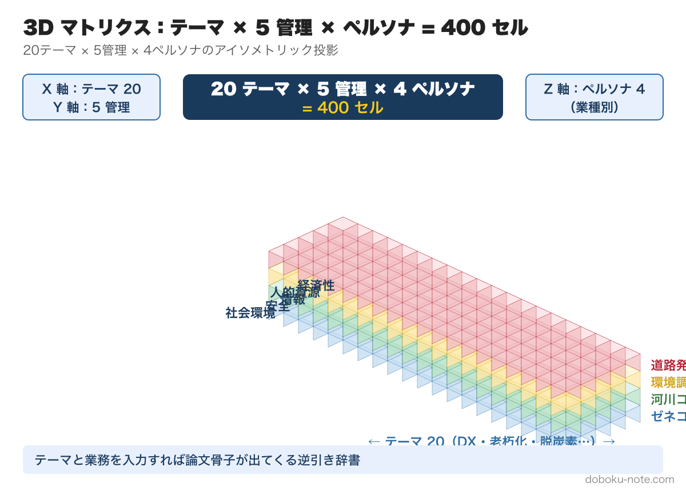
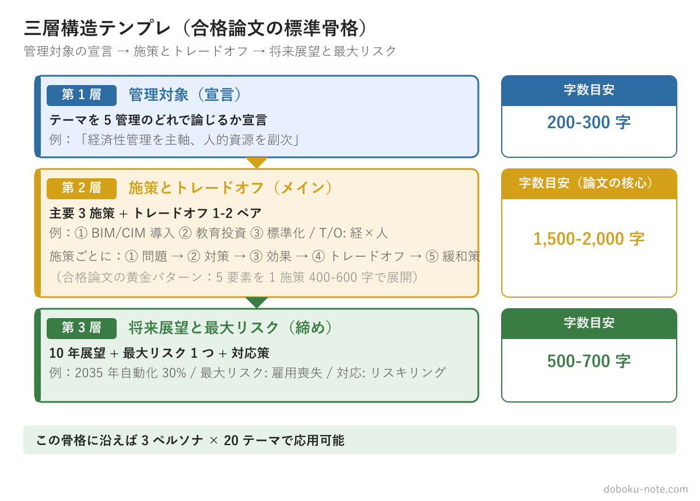
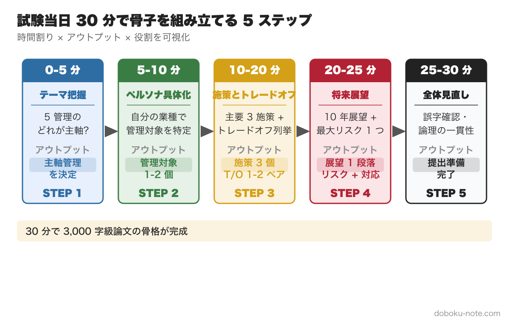

# 技術士総監 記述式 解答テンプレ完全攻略
## テーマ × 5 管理 × 業務領域の 3D マトリクスで論文骨子が 5 分で組める

---

# 第 1 章 3D マトリクスの読み方

## なぜ「○○管理軸」で固定すると失敗するのか

総監記述式の学習を始めると、多くの受験者が最初に「安全管理が得意だから、安全軸でテンプレを作ろう」あるいは「うちの会社はコスト管理が重要だから、経済性軸で論文を固定しよう」という発想に至ります。これは自然な発想ですが、実際には高い確率で失敗します。

なぜか。総監記述式試験が問うのは「特定の管理を深く掘り下げる専門性」ではなく、「複数の管理が衝突する局面で、俯瞰的に最適解を導く能力」だからです。「安全管理軸で固定した論文」は、安全に関する記述は充実しているものの、経済性や社会環境との衝突が薄くなり、「総監らしい俯瞰」が失われます。結果として、採点者から見ると「単なる安全担当者の論文」に映り、合格水準に届かない。

この問題は「安全」に限りません。「DX」を切り口にして全テーマに適用しようとする受験者も同様の罠に落ちます。令和4年度（DX推進）の年は得意だが、令和7年度（少子高齢化）が出たら応用できないというパターンです。

テンプレを「○○管理軸」または「○○テーマ軸」の一軸で固定することの根本的な問題は、論文が「知っている知識を並べる場」になることです。総監論文の本質は「未知のテーマが出ても、5 管理の視点で論点を組み立て直せる能力」の証明です。その能力を示すには、テーマが変わっても適用できる「思考の骨格」が必要です。その骨格が 3D マトリクスです。



## 3 軸の交差点が論文骨子の最小単位

本書の核心は、論文骨子を「テーマ軸 × 5 管理軸 × ペルソナ軸」の 3 次元で考えることです。

**テーマ軸（20 種）** は、試験問題が提示する社会課題です。DX 推進・インフラ老朽化・脱炭素・担い手不足・防災など、近年の出題で繰り返し登場する 20 テーマを本書で網羅します。これは「試験が問うこと」の軸です。

**5 管理軸** は、経済性・人的資源・情報・安全・社会環境の 5 つです。これは「総監として論じるべき視点」の軸です。テーマが何であれ、この 5 軸のうち最低 2 軸（主役管理と副役管理）を扱い、かつその衝突（トレードオフ）を明示することが求められます。

**ペルソナ軸（4 種）** は、受験者自身の業務背景です。同じ「DX 推進」というテーマでも、ゼネコン工事部長が論じる DX と、河川コンサルの部長が論じる DX では、管理対象・前提条件・取れる施策・発生するトレードオフがすべて異なります。論文の説得力は「自分の業務に根ざした具体性」から生まれます。

3 軸の交差点、つまり「DX × 経済性 × ゼネコン」というセルが、論文骨子の最小単位です。このセルには、次の要素が収まります。

- 管理対象として設定すべき具体的な事業・組織の範囲
- 施策の典型パターン（このテーマ・この管理・このペルソナなら何をするか）
- 生じるトレードオフ（どの管理と衝突するか）
- 将来展望の方向（どの課題が将来的に顕在化するか）

本書は 20 テーマ × 5 管理 × 4 ペルソナ = 400 セルをカバーする逆引き辞書として設計されています。テーマが決まり、自分のペルソナが決まり、主役管理が決まれば、論文骨子の 8 割が埋まります。

## 試験当日の参照フロー

試験当日、問題文を受け取ってから論文骨子を確定するまでの流れを具体的に示します。本書の使い方は、この 4 ステップに沿って設計されています。

**ステップ 1: テーマを特定する（5 分）**

問題文の前文を読み、今年のテーマが 20 テーマのどれに相当するかを確認します。完全に一致しないこともありますが、「最も近いテーマ」を特定します。例えば「令和7年度の少子高齢化」は、本書では「担い手不足（テーマ 4）」「外国人材活用（テーマ 15）」「人材育成・キャリア（テーマ 14）」の複合と捉えます。

テーマの特定は本書第 2 章の「テーマ別テンプレ」を参照します。

**ステップ 2: 自分のペルソナを確認する（1 分）**

本書の 4 ペルソナ（ゼネコン / 河川コンサル / 環境調査 / 道路発注者）のうち、自分が最も近いものを確認します。これは試験前に決めておくものです。試験当日に悩まないこと。

**ステップ 3: 最も問われている 5 管理を選ぶ（5 分）**

問題文の設問文（要求事項）を読み、5 管理のうち「主役」と「副役」を選びます。主役は「この設問が正面から問うている管理」、副役は「施策の実施によってトレードオフが生じる管理」です。本書第 3 章の「5 管理別テンプレ」を参照します。

**ステップ 4: 該当セルを辞書で引いて骨子展開する（10 分）**

ステップ 1〜3 で特定した「テーマ × 管理 × ペルソナ」のセルを本書第 2 章で引きます。セルに収録されている「施策の典型 3 パターン」「トレードオフ」「将来展望」を骨子として使い、自分の業務の具体例を当てはめます。

この 4 ステップで、事前検討 60 分のうち最初の 20 分を本書参照に当て、残り 40 分で自分の言葉に置き換える作業をします。

## 本書の使い方（図解の読み方）

本書の構成は次のとおりです。

```
第 1 章（本章）: 3D マトリクスの全体像と使い方フロー
第 2 章: テーマ別テンプレ 20 種（縦軸からの入口）
第 3 章: 5 管理別テンプレ 5 種（横軸からの入口）
第 4 章: ペルソナ別「自分の論点」発見シート（奥行き軸からの入口）
第 5 章: 三層構造への当てはめ手順
第 6 章: トレードオフ候補テーブル
```

第 2 章は「今年の出題テーマからスタートする人」向けです。テーマが判明したら第 2 章の該当テーマを開き、骨子の型を確認します。

第 3 章は「5 管理の扱い方を強化したい人」「施策記述でトレードオフが書けない人」向けです。管理軸の視点から論じ方の型を習得するために使います。

第 4 章は「管理対象と前提条件（論文の 1 枚目）が毎回ぼやける人」向けです。自分のペルソナを固定し、使える論点を整理します。

第 5 章・第 6 章は、骨子を三層構造に組み上げる実践手順と、頻出トレードオフの使い分け早見表です。

本書は「通読して暗記する」使い方を想定していません。「試験前 2 週間で第 2・3 章を流し読みし、試験当日に辞書として引く」が正しい使い方です。

読むコンテンツではなく、使うコンテンツとして設計されています。

---

※ 図版（3D マトリクス全体像・試験当日フロー）は付録 PDF に収録しています。

---

# 第 2 章 テーマ別テンプレ 20 種

各テーマに対し、論文骨子の型を提示します。「型」であり「模範解答」ではありません。ここに示す構成要素を自分の業務・経験に置き換えて使うことが前提です。

---

### 1. DX 推進（i-Construction）

**背景・社会的位置づけ**: 建設生産プロセス全体のデジタル化（i-Construction / BIM/CIM）が国策として推進され、令和4年度の出題テーマとなった最頻出領域。

**管理対象設定の選択肢**:
- 選択肢 A: 複数現場を統括する土木支店の施工情報管理（ゼネコン向け）
- 選択肢 B: 河川整備計画の設計・調査プロセス（コンサル向け）
- 選択肢 C: 発注者 CIM 要件の整備と維持管理データ連携（発注者向け）

**施策の典型 3 パターン**:
- パターン 1（経済性軸）: 建機 IoT・施工出来形データの自動取得による検査工数削減と投資回収計画の策定
- パターン 2（人的資源軸）: DX 推進担当者の育成と現場技術者向けデジタルリテラシー研修プログラムの段階的展開
- パターン 3（情報軸）: BIM/CIM モデルの設計・施工・維持管理への一貫活用と情報セキュリティ管理規程の整備

**将来展望の典型 2 パターン**:
- 短期（3 年）: 特定業務での PoC から全工程展開へ。施工データの標準フォーマット化と協力会社との連携体制確立
- 長期（10 年）: AI 活用による自律施工・無人検査の部分導入。ただしシステム依存リスクと属人知識の喪失リスクが顕在化する

**頻出トレードオフ**: 経済性（初期投資負担） × 情報（セキュリティ・データ品質）

**論文 600 字構成のひな型**:
- 1 段落: 管理対象（○○事業部）と DX の現状・前提条件（現状の課題: 紙ベース帳票・検査の属人化）（100 字）
- 2 段落: 課題提示（DX 推進に伴う初期投資負担と既存業務慣行との乖離）（150 字）
- 3 段落: 施策（BIM/CIM 段階導入計画、担当者育成プログラム、情報管理規程の整備）（200 字）
- 4 段落: トレードオフ（初期投資回収と情報セキュリティ確保の両立が管理課題となる）（100 字）
- 5 段落: 将来展望（データ駆動施工の拡張とシステム依存リスク管理が中長期の課題となる）（50 字）

---

### 2. インフラ老朽化

**背景・社会的位置づけ**: 高度経済成長期に整備された道路・橋梁・河川構造物等が一斉に更新時期を迎え、予防保全への転換が急務。予算制約と優先順位付けが核心的論点。

**管理対象設定の選択肢**:
- 選択肢 A: 管内橋梁・舗装の長寿命化計画策定と修繕優先順位管理（発注者向け）
- 選択肢 B: 維持修繕業務の設計・点検・診断プロセス（コンサル向け）
- 選択肢 C: 維持修繕工事の原価管理と技術力維持（ゼネコン向け）

**施策の典型 3 パターン**:
- パターン 1（経済性軸）: LCC（ライフサイクルコスト）評価に基づく修繕優先順位の策定と予算の平準化（事後保全から予防保全への移行によるコスト最適化）
- パターン 2（情報軸）: 点検データのデータベース化・劣化予測モデルの構築による計画的維持管理の実現
- パターン 3（安全軸）: 緊急度評価基準の設定と通行規制・迂回措置のためのリスクベースマネジメント（RBM）適用

**将来展望の典型 2 パターン**:
- 短期（3 年）: 点検・診断の標準化と技術者育成。ドローン・AI 画像診断の試験的導入
- 長期（10 年）: 人口減少下での機能集約（撤去・統廃合）判断と住民合意形成プロセスが本格的な管理課題になる

**頻出トレードオフ**: 経済性（予防保全コスト） × 安全（損傷進行リスク）

**論文 600 字構成のひな型**:
- 1 段落: 管内構造物の劣化進行状況と予算制約の現状（100 字）
- 2 段落: 課題提示（修繕必要量 > 予算の構造的不足と優先順位付けの困難）（150 字）
- 3 段落: 施策（LCC 評価による修繕計画策定、データベース構築、緊急度判定基準の設定）（200 字）
- 4 段落: トレードオフ（予防保全への投資と短期予算制約の衝突、安全確保の下限管理が課題）（100 字）
- 5 段落: 将来展望（機能集約・撤去判断という新たな意思決定フレームが必要になる）（50 字）

---

### 3. 脱炭素・CN（カーボンニュートラル）

**背景・社会的位置づけ**: 2050 年カーボンニュートラルを受け、建設分野では施工段階の CO2 排出削減・低炭素資材の採用・SCOPE 3 管理が求められる。令和6年度の出題テーマ。

**管理対象設定の選択肢**:
- 選択肢 A: 施工段階の CO2 排出量管理と低炭素施工計画（ゼネコン向け）
- 選択肢 B: 計画・設計段階での LCA（ライフサイクルアセスメント）の適用（コンサル向け）
- 選択肢 C: 発注仕様への CN 要件組み込みとサプライチェーン管理（発注者向け）

**施策の典型 3 パターン**:
- パターン 1（経済性軸）: 電動建機・低炭素コンクリートの段階的導入とコスト増加分の発注者との分担ルール整備
- パターン 2（社会環境軸）: CO2 排出量の可視化・第三者検証体制の構築と住民・発注者への情報開示
- パターン 3（情報軸）: 資材調達から施工までの CO2 排出量データ収集基盤（SCOPE 3 管理システム）の整備

**将来展望の典型 2 パターン**:
- 短期（3 年）: CO2 可視化の標準化と主要施工プロセスの電動化・省エネ化
- 長期（10 年）: CN 施工が競争上の前提条件となり、対応できない事業者の市場退出リスクが顕在化する

**頻出トレードオフ**: 経済性（コスト増加） × 社会環境（CN 達成義務）

**論文 600 字構成のひな型**:
- 1 段落: 組織の CO2 排出現状と 2050 CN 目標のギャップ（100 字）
- 2 段落: 課題提示（低炭素施工のコスト増加と競争力維持の両立困難）（150 字）
- 3 段落: 施策（電動建機導入計画、CO2 可視化システム構築、発注者との費用分担交渉）（200 字）
- 4 段落: トレードオフ（コスト増加による採算悪化リスクと CN 対応遅延による受注機会喪失リスクの衝突）（100 字）
- 5 段落: 将来展望（CN 対応が競争参加の前提条件化し、サプライチェーン管理が新たな管理軸となる）（50 字）

---

### 4. 担い手不足

**背景・社会的位置づけ**: 建設業の若手入職者減少・高齢技術者の大量離職が同時進行。令和7年度（少子高齢化）の主要論点。2024 年問題（時間外規制）とも直結する。

**管理対象設定の選択肢**:
- 選択肢 A: 土木支店の採用・定着・育成プログラム管理（ゼネコン向け）
- 選択肢 B: 技術者ポートフォリオ管理と専門技術継承計画（コンサル向け）
- 選択肢 C: 発注者側の設計・積算・監督業務の技術者育成と業務効率化（発注者向け）

**施策の典型 3 パターン**:
- パターン 1（人的資源軸）: 採用対象の多様化（女性・外国人・未経験者）と職場環境改善によるリテンション向上
- パターン 2（情報軸）: OJT ノウハウのマニュアル化・映像化による暗黙知の形式知化と育成期間の短縮
- パターン 3（経済性軸）: 自動化建機・ICT 施工の活用による一人当たり生産性向上と人員規模の適正化

**将来展望の典型 2 パターン**:
- 短期（3 年）: 採用多様化と ICT 化の同時進行。外国人技術者・技能者の受け入れ体制整備
- 長期（10 年）: 技術者総数が構造的に不足し、業務選択（受注案件の絞込み・統廃合）が迫られる局面になる

**頻出トレードオフ**: 人的資源（技術者育成コスト） × 経済性（短期採算）

**論文 600 字構成のひな型**:
- 1 段落: 組織の技術者年齢構成と離職率の現状（100 字）
- 2 段落: 課題提示（採用難・育成コスト・知識喪失リスクの三重苦）（150 字）
- 3 段落: 施策（多様採用計画、暗黙知形式知化プログラム、ICT 生産性向上投資）（200 字）
- 4 段落: トレードオフ（育成投資と短期採算圧力の衝突、外国人活用と技術安全管理の両立）（100 字）
- 5 段落: 将来展望（担い手不足が構造的定着し、業務範囲の戦略的絞込みが不可避となる）（50 字）

---

### 5. 防災・流域治水

**背景・社会的位置づけ**: 気候変動に伴う降雨強度の増大を受け、流域全体での治水対策（流域治水）が新たな政策軸となった。自治体・住民・農業者等の多主体連携が論点の核心。

**管理対象設定の選択肢**:
- 選択肢 A: 河川整備計画・流域治水計画の立案と関係者調整（コンサル向け）
- 選択肢 B: ダム・堤防等のインフラ管理と洪水時対応体制（発注者向け）
- 選択肢 C: グリーンインフラを含む多様な治水施策の設計（環境調査向け）

**施策の典型 3 パターン**:
- パターン 1（安全軸）: ハード整備（堤防強化・遊水地設置）と避難行動支援（ハザードマップ更新・タイムライン整備）の組み合わせ
- パターン 2（社会環境軸）: 農地・市街地での貯留浸透機能向上（田んぼダム・透水性舗装）と土地利用規制の合意形成プロセス設計
- パターン 3（経済性軸）: 治水効果の費用対効果分析（B/C 評価）と段階整備による予算平準化

**将来展望の典型 2 パターン**:
- 短期（3 年）: 流域治水協議会の設置と関係主体間の役割分担明確化
- 長期（10 年）: 気候変動の進行に伴い、現行の計画規模（確率規模）の見直しと適応的管理への転換が求められる

**頻出トレードオフ**: 安全（治水目標） × 社会環境（農地・土地利用規制への住民合意）

**論文 600 字構成のひな型**:
- 1 段落: 流域の治水現状と気候変動を踏まえた計画外力の変化（100 字）
- 2 段落: 課題提示（多主体連携と合意形成の困難、予算制約下での対策優先順位付け）（150 字）
- 3 段落: 施策（ハード整備と非構造的対策の組み合わせ、流域治水協議会の運営設計）（200 字）
- 4 段落: トレードオフ（安全目標達成と農地・土地利用規制への住民合意の衝突）（100 字）
- 5 段落: 将来展望（適応的管理の制度化と気候変動シナリオへの継続的見直しが必要になる）（50 字）

---

### 6. 安全管理（労働災害・公衆災害）

**背景・社会的位置づけ**: 建設業は全産業中で労働災害死者数が最多。高所・重機・地下工事などのリスクに加え、公衆災害（第三者被害）防止が発注者・施工者双方の責任となる。

**管理対象設定の選択肢**:
- 選択肢 A: 複数現場を管轄する土木支店の安全管理体制（ゼネコン向け）
- 選択肢 B: 発注者としての設計段階リスク評価と施工業者への安全要求管理（発注者向け）
- 選択肢 C: 河川工事・砂防工事における自然災害リスクと作業員安全管理（コンサル/発注者向け）

**施策の典型 3 パターン**:
- パターン 1（安全軸）: リスクアセスメントの現場定着（作業前 RA の標準化）と KY 活動の実効化
- パターン 2（情報軸）: 建機稼働データ・作業者位置情報を活用した接触事故防止システムの導入
- パターン 3（人的資源軸）: 安全教育プログラムの体系化と管理者・作業者それぞれへの安全意識醸成研修

**将来展望の典型 2 パターン**:
- 短期（3 年）: 重機・高所作業の ICT 活用による接触事故・墜落事故の定量的削減目標設定
- 長期（10 年）: 担い手不足下での安全管理水準維持が構造的課題となり、自動化・遠隔施工の拡大が必要になる

**頻出トレードオフ**: 安全（対策コスト・工期余裕） × 経済性（採算・工程）

**論文 600 字構成のひな型**:
- 1 段落: 組織の労働災害発生状況と直近のリスク環境（100 字）
- 2 段落: 課題提示（リスクアセスメントの形骸化と現場管理者の負荷増大）（150 字）
- 3 段落: 施策（RA 標準化・ICT 活用安全管理・安全教育体系の整備）（200 字）
- 4 段落: トレードオフ（安全対策の追加コスト・工程余裕と採算圧力の衝突管理）（100 字）
- 5 段落: 将来展望（担い手減少と安全水準維持の両立が中長期的な構造課題となる）（50 字）

---

### 7. BCP / BCM

**背景・社会的位置づけ**: 自然災害・感染症・サイバー攻撃など、組織の事業継続を脅かすリスクが多様化。建設業では、被災時の早期復旧対応力と自社事業の継続性確保の両立が求められる。

**管理対象設定の選択肢**:
- 選択肢 A: 土木支店の BCP 策定と訓練・見直しサイクル管理（ゼネコン向け）
- 選択肢 B: 発注者の維持管理業務継続計画と委託先 BCP 確認（発注者向け）
- 選択肢 C: コンサル業務継続（設計・調査業務のリモート化）と外部連携（コンサル向け）

**施策の典型 3 パターン**:
- パターン 1（安全軸）: 優先業務の特定（RTO/RPO 設定）と代替手段・代替拠点の確保
- パターン 2（情報軸）: 重要データのバックアップ体制とリモートアクセス環境の整備
- パターン 3（人的資源軸）: 緊急時指揮系統の明確化と代替要員の訓練・権限移譲ルール整備

**将来展望の典型 2 パターン**:
- 短期（3 年）: BCP の文書化から実際の訓練・検証サイクルへの転換。サプライチェーン上の取引先 BCP 確認
- 長期（10 年）: 気候変動による自然災害の大型化・頻発化に伴い、BCP の前提シナリオ見直しと適応的更新が常態化する

**頻出トレードオフ**: 安全（事業継続確保） × 経済性（BCP 投資対効果）

**論文 600 字構成のひな型**:
- 1 段落: 組織の BCP 現状（策定状況・訓練実施状況）と想定リスク（100 字）
- 2 段落: 課題提示（BCP の形骸化・実行可能性の未検証・サプライチェーンリスクの未把握）（150 字）
- 3 段落: 施策（優先業務特定・代替拠点確保・訓練サイクル確立・情報バックアップ整備）（200 字）
- 4 段落: トレードオフ（BCP 整備コストと通常業務リソースの競合管理）（100 字）
- 5 段落: 将来展望（自然災害増大に伴うシナリオ更新の常態化と BCM サイクルの制度化が必要）（50 字）

---

### 8. 知識管理（暗黙知 → 形式知）

**背景・社会的位置づけ**: 熟練技術者の大量退職に伴い、組織内に蓄積された経験・ノウハウ（暗黙知）の喪失リスクが高まっている。知識の形式知化・組織学習の促進が喫緊の課題。

**管理対象設定の選択肢**:
- 選択肢 A: 施工ノウハウ（特殊工法・地盤対応の経験則）の体系化（ゼネコン向け）
- 選択肢 B: 調査・設計の技術判断根拠と現地観察の記録化（コンサル向け）
- 選択肢 C: 環境調査の現地判断（種の同定・生息環境評価）の標準化（環境調査向け）

**施策の典型 3 パターン**:
- パターン 1（情報軸）: 作業手順・判断基準のマニュアル化とデジタルアーカイブ化（動画・図解を含む）
- パターン 2（人的資源軸）: ベテラン技術者と若手のペア制 OJT プログラムと振り返り記録の制度化
- パターン 3（経済性軸）: 技術継承投資の優先順位付け（業務重要度 × 属人化度のマトリクス評価）

**将来展望の典型 2 パターン**:
- 短期（3 年）: ベテラン退職前の集中的な知識移転プログラムと形式知化データベースの構築
- 長期（10 年）: AI を活用した知識検索・応用支援システムの導入。ただしシステム管理コストと利用率の持続的管理が課題になる

**頻出トレードオフ**: 情報（知識の形式知化） × 人的資源（ベテランの時間負荷）

**論文 600 字構成のひな型**:
- 1 段落: 組織の年齢構成と暗黙知の属人化状況（100 字）
- 2 段落: 課題提示（ベテラン退職による技術喪失リスクと形式知化の困難）（150 字）
- 3 段落: 施策（マニュアル化・動画化・OJT ペア制・技術継承優先度評価）（200 字）
- 4 段落: トレードオフ（ベテランの形式知化作業負荷と通常業務の競合管理）（100 字）
- 5 段落: 将来展望（AI 活用による知識検索支援の段階的導入と持続的管理の必要性）（50 字）

---

### 9. 情報セキュリティ

**背景・社会的位置づけ**: 建設業の DX 化進展に伴い、施工データ・設計図書・入札情報等の漏洩リスクが高まる。サイバー攻撃・内部不正・クラウド管理の不備が主要脅威。

**管理対象設定の選択肢**:
- 選択肢 A: 施工現場での BIM/CIM データ・建機 IoT 情報の管理（ゼネコン向け）
- 選択肢 B: 業務委託の成果品（設計図書・調査データ）の管理と協力会社連携（コンサル向け）
- 選択肢 C: 発注者の入札・契約・施設管理情報の保護（発注者向け）

**施策の典型 3 パターン**:
- パターン 1（情報軸）: 情報資産の分類・アクセス権限設定とセキュリティポリシーの整備（ISO 27001 準拠）
- パターン 2（人的資源軸）: 全職員向けセキュリティ教育の定期実施とインシデント報告・対応訓練の制度化
- パターン 3（経済性軸）: セキュリティ投資の優先順位付け（重要情報資産への集中投資と低リスク領域の合理化）

**将来展望の典型 2 パターン**:
- 短期（3 年）: クラウド活用の拡大に伴うアクセス管理強化と協力会社を含むサプライチェーン全体のセキュリティ確認
- 長期（10 年）: AI・量子コンピュータの普及に伴う新たな脅威への対応と、技術変化に追随する継続的なポリシー更新が必要になる

**頻出トレードオフ**: 情報（セキュリティ強化） × 経済性（投資負担・業務効率）

**論文 600 字構成のひな型**:
- 1 段落: 組織のデジタル化現状と主要な情報資産・脅威の特定（100 字）
- 2 段落: 課題提示（DX 推進とセキュリティ確保の両立困難、協力会社管理の難しさ）（150 字）
- 3 段落: 施策（情報資産分類・アクセス権限管理・定期教育・インシデント訓練の体系化）（200 字）
- 4 段落: トレードオフ（セキュリティ強化による業務効率低下と投資負担の管理）（100 字）
- 5 段落: 将来展望（技術変化への継続的追随と供給連鎖全体のセキュリティ管理の高度化）（50 字）

---

### 10. 環境保全・自然共生

**背景・社会的位置づけ**: 生物多様性保全・自然共生社会の実現が国際公約（昆明・モントリオール枠組み）として位置づけられ、建設事業の環境影響評価・緑化・生態系配慮設計が強化されている。

**管理対象設定の選択肢**:
- 選択肢 A: 環境影響評価と保護種対策の設計・モニタリング（環境調査向け）
- 選択肢 B: 河川環境計画における生物生息環境の保全設計（コンサル向け）
- 選択肢 C: 発注者としての環境配慮設計基準の整備と業者指導（発注者向け）

**施策の典型 3 パターン**:
- パターン 1（社会環境軸）: 自然共生サイト認定の取得と地域住民・NPO との協働モニタリング体制構築
- パターン 2（情報軸）: 生物多様性データベースの整備と影響評価の標準化（定量的評価指標の導入）
- パターン 3（経済性軸）: 環境配慮コスト（保護種対策・緑化工）の LCA 組み込みと費用対効果の可視化

**将来展望の典型 2 パターン**:
- 短期（3 年）: 自然資本の定量評価手法（TNFD 等）の業務適用と報告体制の整備
- 長期（10 年）: 気候変動と生物多様性の複合的影響が顕在化し、適応的管理への転換と継続的モニタリングが不可欠になる

**頻出トレードオフ**: 社会環境（自然保護） × 経済性（工期・コスト）

**論文 600 字構成のひな型**:
- 1 段落: 事業の環境影響の概要と主要な保全対象（100 字）
- 2 段落: 課題提示（環境保全要求の高度化と工程・コスト制約の衝突）（150 字）
- 3 段落: 施策（保護種対策設計・協働モニタリング・自然共生サイト認定の取得）（200 字）
- 4 段落: トレードオフ（自然保護の徹底と工期・コスト制約の管理、TNFD 対応コストの負担）（100 字）
- 5 段落: 将来展望（気候変動との複合影響への適応的管理と継続モニタリングの制度化が課題）（50 字）

---

### 11. 品質管理

**背景・社会的位置づけ**: 建設工事の品質確保は発注者・施工者双方の基本責務。近年は施工不良の早期発見（非破壊検査・センサー活用）と品質記録のデジタル化が進む。

**管理対象設定の選択肢**:
- 選択肢 A: 施工工程での品質管理計画と下請管理（ゼネコン向け）
- 選択肢 B: 設計段階での品質基準設定と照査体制（コンサル向け）
- 選択肢 C: 発注者としての成果品検査基準と施工中モニタリング（発注者向け）

**施策の典型 3 パターン**:
- パターン 1（情報軸）: 施工出来形・材料品質のデジタル記録（センサー・写真 AI 判定）による検査工数削減と品質トレーサビリティ確保
- パターン 2（人的資源軸）: 品質管理担当者の育成と下請業者への品質教育・指導体制の整備
- パターン 3（経済性軸）: 品質コスト（失敗コスト vs. 予防コスト）の分析と最適な品質管理投資水準の設定

**将来展望の典型 2 パターン**:
- 短期（3 年）: 品質記録のデジタル化と AI 活用による異常早期検知の試験導入
- 長期（10 年）: 品質管理の自動化が進む一方、システム依存リスクと技術者の品質判断力の維持が新たな管理課題になる

**頻出トレードオフ**: 品質（検査コスト・工期余裕） × 経済性（採算）

**論文 600 字構成のひな型**:
- 1 段落: 組織の品質管理体制と近年の品質トラブル傾向（100 字）
- 2 段落: 課題提示（品質管理の属人化・記録の紙ベース管理・下請品質の管理困難）（150 字）
- 3 段落: 施策（デジタル品質記録・AI 検査導入・品質担当者育成・下請指導体制整備）（200 字）
- 4 段落: トレードオフ（品質確保コスト・工期余裕と採算圧力の衝突管理）（100 字）
- 5 段落: 将来展望（品質管理の自動化と技術者の判断力維持の両立が中長期の管理課題となる）（50 字）

---

### 12. コスト管理（LCC / 予算）

**背景・社会的位置づけ**: 公共投資予算の制約下で最大の価値を実現するため、初期コストだけでなくライフサイクルコスト（LCC）に基づく意思決定が求められる。民間では採算管理の高度化が課題。

**管理対象設定の選択肢**:
- 選択肢 A: 工事原価管理と採算改善（ゼネコン向け）
- 選択肢 B: 業務費見積精度向上と工数管理（コンサル向け）
- 選択肢 C: 事業費 LCC 評価と予算配分・平準化（発注者向け）

**施策の典型 3 パターン**:
- パターン 1（経済性軸）: LCC 評価の導入による初期投資と維持管理費の総合最適化（事後保全から予防保全への転換の費用根拠）
- パターン 2（情報軸）: コスト実績データの蓄積・分析による見積精度向上と工程別原価管理の高度化
- パターン 3（社会環境軸）: 住民・議会への LCC 比較情報の開示と予算配分への透明性確保

**将来展望の典型 2 パターン**:
- 短期（3 年）: コスト実績データベースの整備と積算・見積の標準化・AI 活用による精度向上
- 長期（10 年）: インフレ・資材費高騰を前提とした動的な LCC 見直しと財政制約下での事業優先順位の常時更新が必要になる

**頻出トレードオフ**: 経済性（コスト最適化） × 安全（品質・耐久性の確保）

**論文 600 字構成のひな型**:
- 1 段落: 組織のコスト管理の現状（原価管理手法・LCC 適用状況）（100 字）
- 2 段落: 課題提示（LCC 評価の未適用・原価管理の属人化・コスト実績の未蓄積）（150 字）
- 3 段落: 施策（LCC 評価体制整備・コストデータベース構築・見積標準化・住民への情報開示）（200 字）
- 4 段落: トレードオフ（コスト削減と品質・安全確保の両立、LCC 長期予測の不確実性管理）（100 字）
- 5 段落: 将来展望（インフレ・物価変動を前提とした動的 LCC 見直しが常態的に必要となる）（50 字）

---

### 13. 工程管理（クリティカルパス）

**背景・社会的位置づけ**: 工期遵守は契約上の基本義務であり、複数工種が錯綜する土木工事ではクリティカルパスの管理と工程リスクへの予防的対応が合否を分ける。2024 年問題（時間外規制）とも連動。

**管理対象設定の選択肢**:
- 選択肢 A: 複数工種が絡む大型土木工事の工程統括（ゼネコン向け）
- 選択肢 B: 設計・調査の工程管理と成果品納期管理（コンサル向け）
- 選択肢 C: 発注者としての事業工程管理と用地・設計・施工の調整（発注者向け）

**施策の典型 3 パターン**:
- パターン 1（情報軸）: クリティカルパス分析の可視化・リアルタイム更新と進捗共有の仕組み整備
- パターン 2（人的資源軸）: 工程管理担当の専任配置と時間外規制を考慮した人員・工程の再設計
- パターン 3（経済性軸）: 工程遅延リスクの定量化（遅延 1 日当たりコスト算定）と工程予備の適切な設定

**将来展望の典型 2 パターン**:
- 短期（3 年）: デジタル工程管理ツールの導入と協力会社との工程共有リアルタイム化
- 長期（10 年）: 時間外規制の強化に伴い、工期設定そのものの見直し（発注者・施工者双方の慣行変革）が迫られる

**頻出トレードオフ**: 経済性（工期短縮・コスト削減） × 安全（無理な工程が引き起こすリスク）

**論文 600 字構成のひな型**:
- 1 段落: 工事・業務の規模と工程上の主要制約条件（100 字）
- 2 段落: 課題提示（工程遅延リスクの前倒し特定困難と時間外規制下での人員確保）（150 字）
- 3 段落: 施策（クリティカルパス可視化・リアルタイム共有・専任工程管理者配置・予備工程の設定）（200 字）
- 4 段落: トレードオフ（工程短縮と安全確保・品質確保の衝突、残業規制と進捗管理の矛盾）（100 字）
- 5 段落: 将来展望（工期設定慣行の抜本見直しと発注者・施工者双方の意識変革が不可避になる）（50 字）

---

### 14. 人材育成・キャリア

**背景・社会的位置づけ**: 技術者のキャリア自律化（ジョブ型雇用の浸透・副業解禁）と組織の育成責任が並立する中、育成と定着の両方を設計することが求められる。

**管理対象設定の選択肢**:
- 選択肢 A: 技術職のキャリアパス設計と成長支援プログラム（ゼネコン・コンサル向け）
- 選択肢 B: 発注者組織での技術継承と委託化後の技術力維持（発注者向け）
- 選択肢 C: 女性・若手技術者の定着促進と多様なキャリアルートの整備（全属性）

**施策の典型 3 パターン**:
- パターン 1（人的資源軸）: 個人の強みを踏まえたキャリアパス設計と目標設定・評価サイクルの整備
- パターン 2（経済性軸）: 育成投資の優先対象の明確化（コアスキル × ハイポテンシャル人材）と育成 ROI の測定
- パターン 3（情報軸）: キャリア情報の可視化（社内人材データベース）とスキルマップに基づく育成計画の策定

**将来展望の典型 2 パターン**:
- 短期（3 年）: 個人のキャリア自律を支援する制度（社内公募・副業・社外研修）の整備と定着率の改善
- 長期（10 年）: 技術変化のスピードが加速し、継続的なリスキリングが組織運営の前提条件になる

**頻出トレードオフ**: 人的資源（育成投資） × 経済性（育成コスト・離職リスク）

**論文 600 字構成のひな型**:
- 1 段落: 組織の人材構成・離職率・育成体制の現状（100 字）
- 2 段落: 課題提示（育成への投資と離職による損失リスク、キャリア多様化への対応の遅れ）（150 字）
- 3 段落: 施策（キャリアパス設計・社内公募制度・スキルマップ整備・育成 ROI 測定）（200 字）
- 4 段落: トレードオフ（育成投資と離職リスク・即戦力需要の衝突、長期育成と短期採算の矛盾）（100 字）
- 5 段落: 将来展望（継続的リスキリングが組織運営の前提条件化し、学習する組織の設計が必要になる）（50 字）

---

### 15. 外国人材活用

**背景・社会的位置づけ**: 建設業の深刻な担い手不足を補う手段として外国人技能実習・特定技能制度が活用されているが、安全管理・言語バリア・文化差異への対応が課題となっている。

**管理対象設定の選択肢**:
- 選択肢 A: 外国人技能者の受け入れ・育成・安全管理体制（ゼネコン・専門工事業者向け）
- 選択肢 B: 発注者としての外国人労働者が関わる工事の安全要件設定（発注者向け）
- 選択肢 C: 多言語対応ノウハウの形式知化と組織展開（環境調査・コンサル向け）

**施策の典型 3 パターン**:
- パターン 1（安全軸）: 多言語対応安全教育（ビジュアル教材・通訳配置）と外国人技術者への KY 活動の徹底
- パターン 2（人的資源軸）: 受け入れ担当者の育成と外国人技術者のキャリア成長支援（技能検定受験支援）
- パターン 3（情報軸）: 作業手順の多言語化・映像化と施工管理情報の多言語共有ツールの整備

**将来展望の典型 2 パターン**:
- 短期（3 年）: 受け入れ体制の標準化と多言語安全教育の業界共通化
- 長期（10 年）: 外国人技術者が基幹人材として活躍する組織文化の確立と、多様性マネジメントが競争優位の源泉になる

**頻出トレードオフ**: 人的資源（外国人活用による即戦力確保） × 安全（言語バリアによる安全リスク増大）

**論文 600 字構成のひな型**:
- 1 段落: 組織の外国人受け入れ現状と主要課題（言語・文化・安全）（100 字）
- 2 段落: 課題提示（言語バリアによる安全リスクと育成コスト・定着率の課題）（150 字）
- 3 段落: 施策（多言語安全教育・受け入れ担当育成・作業手順の多言語化・キャリア支援）（200 字）
- 4 段落: トレードオフ（安全確保と活用コスト、短期即戦力確保と長期定着投資の衝突）（100 字）
- 5 段落: 将来展望（外国人技術者の基幹人材化と多様性マネジメントが組織競争力の核となる）（50 字）

---

### 16. 組織マネジメント

**背景・社会的位置づけ**: 建設業における組織の複雑化（マトリクス組織・PMO・グループ経営）の中で、意思決定の迅速化と権限委譲・情報共有の適切な設計が求められる。

**管理対象設定の選択肢**:
- 選択肢 A: 複数現場・複数部門を統括する土木支店の組織設計（ゼネコン向け）
- 選択肢 B: 業務分野をまたぐプロジェクトチームのマネジメント（コンサル向け）
- 選択肢 C: 委託先・協定機関との連携体制設計（発注者向け）

**施策の典型 3 パターン**:
- パターン 1（人的資源軸）: 権限委譲の明確化と現場マネジャーの意思決定スピード向上、マネジャー育成プログラムの整備
- パターン 2（情報軸）: 組織内の情報共有プラットフォーム整備と意思決定プロセスの可視化（会議体設計・記録共有）
- パターン 3（経済性軸）: 組織構造の最適化（重複機能の整理・間接コスト削減）と ROI に基づく組織投資判断

**将来展望の典型 2 パターン**:
- 短期（3 年）: フラット化・アジャイル化への移行と従来型階層管理との混在管理
- 長期（10 年）: AI・自動化の進展により管理職の役割が監督から意思決定支援・文化形成にシフトし、組織設計の根本的な見直しが必要になる

**頻出トレードオフ**: 人的資源（組織の自律性・権限委譲） × 情報（統制・報告管理）

**論文 600 字構成のひな型**:
- 1 段落: 組織の現在の構造・規模と主要な管理課題（100 字）
- 2 段落: 課題提示（意思決定の遅延・情報共有不全・権限と責任の不一致）（150 字）
- 3 段落: 施策（権限委譲の明確化・情報共有プラットフォーム整備・マネジャー育成）（200 字）
- 4 段落: トレードオフ（自律性拡大と管理統制の両立、変革コストと短期業務継続の衝突）（100 字）
- 5 段落: 将来展望（AI 活用により管理職の役割が変容し、組織設計の継続的な見直しが必要になる）（50 字）

---

### 17. 法規制対応

**背景・社会的位置づけ**: 建設業に関わる法規制は建設業法・労働安全衛生法・環境関連法令・品確法など多岐にわたり、改正頻度も高い。コンプライアンス管理の体系化が組織課題となっている。

**管理対象設定の選択肢**:
- 選択肢 A: 施工段階の法令遵守管理体制（建設業法・安全衛生法）（ゼネコン向け）
- 選択肢 B: 環境関連法令（環境影響評価法・自然公園法等）の業務適用（コンサル・環境調査向け）
- 選択肢 C: 発注者側のコンプライアンス管理と入札・契約の適正化（発注者向け）

**施策の典型 3 パターン**:
- パターン 1（情報軸）: 法令改正情報の収集・整理・周知体制の整備（法改正データベース・定期研修）
- パターン 2（人的資源軸）: 担当者の法令知識向上と資格取得支援、コンプライアンス担当者の配置
- パターン 3（経済性軸）: 法令対応コストの計画的予算化と違反リスクコストの定量評価

**将来展望の典型 2 パターン**:
- 短期（3 年）: 主要法令の改正動向の継続的モニタリングと対応計画の前倒し策定
- 長期（10 年）: デジタル化・CN・生物多様性保全に関する新規規制が増加し、法令対応が業務の常設機能として定着する

**頻出トレードオフ**: 社会環境（法令遵守） × 経済性（対応コスト・業務効率）

**論文 600 字構成のひな型**:
- 1 段落: 組織が対応する主要法令の範囲と直近の改正状況（100 字）
- 2 段落: 課題提示（法改正への対応遅延リスクと担当者負担の増大）（150 字）
- 3 段落: 施策（法令データベース整備・定期研修・コンプライアンス担当配置・対応コスト予算化）（200 字）
- 4 段落: トレードオフ（法令遵守の徹底と対応コスト・業務効率の両立管理）（100 字）
- 5 段落: 将来展望（新規規制増加に伴い法令対応が常設機能化し、継続的な組織能力の維持が必要）（50 字）

---

### 18. 住民合意形成

**背景・社会的位置づけ**: 公共事業の社会的受容性確保のため、計画段階からの住民参加・丁寧な情報公開・対話プロセスの設計が求められる。反対運動・遅延リスクの管理が核心。

**管理対象設定の選択肢**:
- 選択肢 A: 河川・道路・防災事業の計画段階住民説明と意見取り込み（コンサル・発注者向け）
- 選択肢 B: 施工段階の近隣住民への工事情報提供と苦情対応（ゼネコン向け）
- 選択肢 C: 環境影響評価の住民意見手続きと事業修正の管理（環境調査・発注者向け）

**施策の典型 3 パターン**:
- パターン 1（社会環境軸）: 計画段階での住民ワークショップ・オープンハウスの設計と意見の計画反映プロセスの明文化
- パターン 2（情報軸）: 工事・事業情報の分かりやすい公開（ウェブ・説明会・回覧板）と問い合わせ対応体制の整備
- パターン 3（経済性軸）: 合意形成の遅延が工程・コストに与えるリスクの定量化と計画段階への合意形成予算の組み込み

**将来展望の典型 2 パターン**:
- 短期（3 年）: SNS・ウェブ公聴会などのデジタル合意形成ツールの活用と参加者層の拡大
- 長期（10 年）: 人口減少下で事業の必要性説明が困難になる局面が増加し、合意形成の専門能力が組織の戦略的資産になる

**頻出トレードオフ**: 社会環境（住民合意・参加） × 経済性（工程遅延・合意形成コスト）

**論文 600 字構成のひな型**:
- 1 段落: 事業の概要と主要な利害関係者・反対リスクの状況（100 字）
- 2 段落: 課題提示（合意形成の遅延リスクと多様な利害関係者間の調整困難）（150 字）
- 3 段落: 施策（住民ワークショップ設計・デジタル公開・問い合わせ対応体制・合意形成予算確保）（200 字）
- 4 段落: トレードオフ（合意形成の充実と工程・コスト制約の衝突管理）（100 字）
- 5 段落: 将来展望（合意形成能力が組織の戦略的資産となり、専門人材の育成が不可欠になる）（50 字）

---

### 19. リスクアセスメント

**背景・社会的位置づけ**: 建設プロジェクトに内在する多様なリスク（技術・コスト・工程・安全・環境）を事前に特定・評価・対応することで、プロジェクト成果の予測可能性を高める体系的手法。

**管理対象設定の選択肢**:
- 選択肢 A: 大型施工プロジェクトのリスク登録簿管理（ゼネコン向け）
- 選択肢 B: 設計・調査業務のリスクマネジメント計画（コンサル向け）
- 選択肢 C: 事業全体のリスクアセスメントと発注者のリスク分担設計（発注者向け）

**施策の典型 3 パターン**:
- パターン 1（安全軸）: リスク登録簿の整備と定期的な更新・重大リスクへの予防策実施（ALARP 原則の適用）
- パターン 2（情報軸）: リスク情報の組織的共有（過去プロジェクトの教訓データベース）と早期警戒指標の設定
- パターン 3（経済性軸）: リスクの定量評価（期待コスト算定）と予備費・予備工程の適切な設定

**将来展望の典型 2 パターン**:
- 短期（3 年）: リスクアセスメントの業務定着（形骸化からの脱却）と担当者育成
- 長期（10 年）: AI を活用したリスク予測・早期警戒システムの導入と人間とシステムの役割分担設計が求められる

**頻出トレードオフ**: 安全（リスク低減） × 経済性（リスク対応コスト・予備費）

**論文 600 字構成のひな型**:
- 1 段落: 対象プロジェクトの規模・特性と主要リスクの概観（100 字）
- 2 段落: 課題提示（リスクアセスメントの形骸化・リスク情報共有の不足）（150 字）
- 3 段落: 施策（リスク登録簿整備・教訓データベース構築・ALARP 適用・予備費設定）（200 字）
- 4 段落: トレードオフ（リスク低減への投資と予備費負担・コスト圧力の衝突管理）（100 字）
- 5 段落: 将来展望（AI リスク予測システムの導入と人間の判断との適切な役割分担設計が必要）（50 字）

---

### 20. データ活用（AI / ビッグデータ）

**背景・社会的位置づけ**: 建設現場・インフラ点検・気象データなど大量データの収集が可能になり、AI・機械学習による意思決定支援・異常検知・需要予測の実用化が進む。令和3年度（データ利活用）と連動。

**管理対象設定の選択肢**:
- 選択肢 A: 施工データ・建機 IoT データの統合活用（ゼネコン向け）
- 選択肢 B: 調査・設計業務でのデータ分析・AI 活用（コンサル向け）
- 選択肢 C: インフラ点検・維持管理データの統合と AI 診断活用（発注者向け）

**施策の典型 3 パターン**:
- パターン 1（情報軸）: データ収集・蓄積基盤の整備（標準フォーマット化・クラウド化）と AI モデルの段階的活用
- パターン 2（経済性軸）: データ活用の優先領域特定（効果大 × 実現性高の領域から着手）と PoC による ROI 実証
- パターン 3（人的資源軸）: データ活用人材（データサイエンティスト・AI エンジニア）の育成と外部専門家との協働体制

**将来展望の典型 2 パターン**:
- 短期（3 年）: 特定領域での AI 活用の実績積み上げと横展開のための標準化
- 長期（10 年）: データに基づく意思決定が組織の標準となり、AI 判断と人間判断の責任境界の設計が新たな管理課題になる

**頻出トレードオフ**: 情報（データ活用の拡大） × 安全（AI 誤判断・データ品質リスク）

**論文 600 字構成のひな型**:
- 1 段落: 組織のデータ活用現状（収集範囲・分析能力・活用実績）（100 字）
- 2 段落: 課題提示（データの断絶・標準化不足・活用人材の不足）（150 字）
- 3 段落: 施策（データ基盤整備・優先領域での PoC・データ人材育成・外部連携）（200 字）
- 4 段落: トレードオフ（AI 活用の拡大とデータ品質・誤判断リスクの管理、投資対効果の不確実性）（100 字）
- 5 段落: 将来展望（AI 判断と人間判断の責任境界の設計が組織の新たな統治課題になる）（50 字）

---

# 第 3 章 5 管理別テンプレ 5 種

第 2 章がテーマからの入口であるのに対し、本章は「管理の視点」からの入口です。試験問題を読んで「どの管理を主軸にするか」を決めた後、その管理をどう論じるかの型を確認するために使います。

5 管理のどれを「主役」にするかは、試験問題の要求事項（設問文）が決めます。しかし「副役」として必ず触れる必要のある管理と、主役との衝突（トレードオフ）を意識するには、各管理の特性を理解しておく必要があります。

---

### 1. 経済性管理

**主要キーワード**: LCC（ライフサイクルコスト） / 初期投資 / 採算性 / ROI / 投資回収期間 / 原価管理 / 費用対効果（B/C） / 予算配分 / コスト最適化 / 予防保全 vs. 事後保全

**典型的論点**: 投資判断（予防保全 vs. 事後保全、短期コスト vs. 長期コスト） / コスト最適化（削減とリスクのトレードオフ） / 予算制約下での優先順位付け

**トレードオフ相手**: 安全（コスト削減が安全水準を下げるリスク） / 社会環境（コスト優先が環境・社会要件を犠牲にするリスク） / 人的資源（採算圧力が育成投資を抑制するリスク）

**論文中の登場頻度**: 高（全テーマで必ず「コスト」の側面が問われる）

**典型的論じ方**:
経済性管理を論じる際は「初期投資か LCC か」を最初に明確にすることが重要です。短期的なコスト削減と長期的なコスト最適化は必ずしも一致しません。「安く済ませた結果、後でより大きなコストが発生する」構造を意識し、投資と効果の時間軸を合わせて論じます。また「採算性は大切だが、それだけを追求すると安全・品質・社会要件を損なう」というトレードオフを必ず書き、その管理方法を示すことで総監らしい視点になります。数値を使う場合は概算でよいので根拠のある数字を入れると具体性が増します（例：「初期投資 X 円に対し、5 年間の維持管理費削減効果 Y 円、ROI 約 Z%」）。

**失敗パターン**:
「コストを削減する」「予算内で収める」という方針レベルの記述で終わり、具体的な手法（LCC 評価・ROI 算定・予算平準化）と管理上の工夫（誰が何を判断するか）が書けていない。また、コスト削減の効果だけを書いてトレードオフ（安全・品質への影響）を書き忘れる失敗が多い。

---

### 2. 人的資源管理

**主要キーワード**: 担い手不足 / 働き方改革 / 2024 年問題 / キャリア開発 / 多様性・ダイバーシティ / 暗黙知移転 / OJT / リスキリング / 外国人材 / 時間外規制

**典型的論点**: 採用・育成・定着の三位一体管理 / 知識継承（暗黙知の形式知化） / 多様な人材（女性・外国人・高齢者）の活用と安全・品質管理の両立

**トレードオフ相手**: 経済性（育成投資コスト vs. 短期採算・離職リスク） / 情報（知識管理・記録化の負荷） / 安全（外国人・未経験者の安全リスク管理）

**論文中の登場頻度**: 高（担い手不足・少子高齢化系テーマでは主役になる）

**典型的論じ方**:
人的資源管理を論じる際は「採用・育成・定着」の三段階のどこに課題があるかを明確にすることが出発点です。「人が足りない」という事実を述べるだけでなく「なぜ採用できないか・なぜ定着しないか・どうすれば育成できるか」の因果を踏まえた施策を書きます。また「人を増やす」施策だけでなく「一人当たり生産性を上げる（ICT・自動化）」施策を合わせて論じると、経済性管理との連携が生まれます。トレードオフとして「育成投資と短期採算」「多様人材活用と安全管理」を意識して書くと深みが出ます。将来展望では、担い手不足が構造的に続く前提のもと、業務範囲の絞込みや業態変革が迫られる中長期像を描くと説得力が増します。

**失敗パターン**:
「人材育成を強化する」「研修を実施する」という方針レベルで止まり、誰を・どのような手法で・どの期間で育成するかの具体性がない。また、人的資源管理を単独で論じて、経済性（コスト）・安全（育成中の安全リスク）とのトレードオフを書き忘れる。

---

### 3. 情報管理

**主要キーワード**: DX / BIM/CIM / データ標準化 / セキュリティ / ナレッジマネジメント / クラウド / IoT / AI / 情報共有 / アクセス権限

**典型的論点**: 情報の収集・蓄積・共有・活用の 4 段階管理 / 情報セキュリティ（機密性・完全性・可用性） / データ品質管理（ガベージイン・ガベージアウト問題）

**トレードオフ相手**: 経済性（システム投資コスト） / 安全（情報共有とセキュリティの衝突） / 人的資源（デジタルリテラシー格差・操作負荷）

**論文中の登場頻度**: 高（DX・データ活用・知識管理テーマでは主役になる）

**典型的論じ方**:
情報管理を論じる際は「情報の収集・蓄積・共有・活用」のサイクルを意識し、どのステップに課題があるかを明確にします。情報管理の最大の落とし穴は「情報を集めただけ・システムを導入しただけ」になることです。「情報が活用されない・判断につながらない」状況を防ぐための管理方法（利用ルール・権限設計・定期レビュー）を施策として書くことが重要です。セキュリティとの衝突は必ずトレードオフとして書きます（「情報を広く共有する」と「アクセスを制限してセキュリティを守る」は矛盾する）。将来展望では AI 活用の拡大に伴うリスク（AI 誤判断・データ汚染）を最大リスクとして論じると総監らしい視点になります。

**失敗パターン**:
「DX を推進する」「情報共有を強化する」という方針だけで、具体的なシステム設計・ルール・権限管理が書けていない。また、情報活用の効果だけを書いてセキュリティリスク（トレードオフ）を書き忘れる。

---

### 4. 安全管理

**主要キーワード**: リスクアセスメント / ALARP（合理的に実行可能な限り低減） / RBM（リスクベースマネジメント） / KY 活動 / ヒューマンエラー / 公衆災害 / 労働災害 / BCP / 残留リスク

**典型的論点**: リスクの特定・評価・対応の 3 段階サイクル / 施策の効果と残留リスクの管理 / ヒューマンエラー防止（手順・環境・文化の三層対策）

**トレードオフ相手**: 経済性（安全対策コスト vs. 採算・工程） / 工程（安全確保のための作業停止・工程余裕 vs. 工期厳守） / 情報（安全情報の共有 vs. セキュリティ）

**論文中の登場頻度**: 非常に高（全テーマで「安全への影響」は必ず問われる）

**典型的論じ方**:
安全管理を論じる際は「リスクアセスメント（特定・評価・対応）→残留リスクの管理」のサイクルを軸に展開します。重要なのは「ゼロリスクは不可能」という前提です。ALARP 原則（合理的に実行可能な限り低減した上で、残留リスクを管理する）を意識した記述が総監らしい安全管理になります。施策は「ハード対策（設備・機器の改良）」と「ソフト対策（教育・手順・文化）」の組み合わせで論じます。トレードオフとして「安全対策のコスト・工期余裕と採算・工程の衝突」を書き、「安全の下限を守りながら最適化する」管理方法を示すと評価されます。将来展望では、担い手不足下での安全水準維持という構造的難題を最大リスクとして論じると説得力があります。

**失敗パターン**:
「安全を確保する」「事故ゼロを目指す」という精神論レベルの記述で止まり、具体的なリスクアセスメント手法・対応策・管理体制が書けていない。また、安全対策の徹底だけを書いてコスト・工程とのトレードオフを書き忘れる。

---

### 5. 社会環境管理

**主要キーワード**: 住民合意 / 環境影響評価 / 持続可能性（SDGs） / カーボンニュートラル / 生物多様性（TNFD） / 外部不経済の内部化 / ステークホルダー管理 / 社会的受容性

**典型的論点**: ステークホルダーへの影響評価と合意形成 / 外部不経済（コスト化されない環境・社会影響）の認識と対応 / 持続可能性の長期的担保

**トレードオフ相手**: 経済性（環境・社会対応コスト vs. 採算） / 工程（住民合意・環境手続きの期間 vs. 工期） / 安全（環境保全措置と工事安全の競合）

**論文中の登場頻度**: 高（公共事業・環境テーマでは主役になる）

**典型的論じ方**:
社会環境管理を論じる際は「誰が影響を受けるか（ステークホルダーの特定）」→「どのような影響があるか（定性・定量評価）」→「どう対応するか（緩和・代替・補償）」の流れで論じます。「住民理解を得る」という表現では弱く、「計画段階から住民参加を設け、意見を計画に反映する具体的プロセス」を示すことが重要です。外部不経済（騒音・振動・生態系影響等、直接コストに表れない影響）を把握・対応することが総監の視点です。トレードオフとして「社会環境対応と経済性・工程の衝突」を書き、合意形成の遅延が工期・コストに与えるリスクをあらかじめ管理する施策を示すと評価されます。将来展望では、環境規制強化・社会的透明性要求の高まりの中で、社会環境管理が競争参加の前提条件になる中長期像を描くと説得力があります。

**失敗パターン**:
「環境に配慮する」「住民の理解を得る」という方針だけで、具体的な調査手法・合意形成プロセス・モニタリング方法が書けていない。また、社会環境への配慮を単独で論じて、経済性・工程との衝突（トレードオフ）を書き忘れる。

---

以上、第 1 章〜第 3 章の本文ドラフトです。

第 4 章（ペルソナ別発見シート）・第 5 章（三層構造への当てはめ手順）・第 6 章（トレードオフ候補テーブル）は別セッションで執筆します。
# 第 4-6 章 ドラフト — 解答テンプレ集 3D マトリクス

---

## 第 4 章　ペルソナ別「自分の論点」発見シート

論文を書くとき、「どのトレードオフを中核に据えるか」に悩む受験者は多い。その悩みの根本は、業務経験が「自分の言葉」に変換されていないことにある。本章では 4 つのペルソナ（ゼネコン土木支店、河川コンサル、環境調査事務所、道路発注者）ごとに、自業務から論点を掘り起こすための質問プロンプトと推奨フローを提示する。自分のペルソナに対応するシートを使い、論文を書く前に「自分の論点リスト」を埋めることが、本章のゴールである。

---

### 1. ゼネコン土木支店（工事部長クラス）

**典型業務**: 売上 1,000〜3,000 億円規模の大手ゼネコン土木支店において、道路・橋梁・トンネル等の元請施工を統括し、複数現場の安全衛生・採算・工程を同時管理する。

**頻出キーワード Top 5**（doboku-note 総監キーワード集より）:

1. 安全管理・公衆災害防止（ゼネコン論文の頻出キーワード合計の約 3 割超を占有、最頻出）
2. 担い手不足・働き方改革（2024 年問題、週休 2 日の影響）
3. DX 推進・i-Construction（BIM/CIM、建機 IoT）
4. 知識継承・暗黙知の形式知化（熟練技術者退職対応）
5. カーボンニュートラル・低炭素施工（CN、建設副産物）

**自業務診断 質問 10 個**:

1. 直近 3 年間で労働災害または公衆災害が発生・未遂になった件数と主因は何か。
2. 現場の平均残業時間は週休 2 日制導入後にどれだけ変化したか。変化した場合、工期と採算にどう影響しているか。
3. ベテラン技術者の退職が 3 年以内に予定されている現場はいくつあるか。後継者は特定済みか。
4. BIM/CIM または建機 IoT を本格導入している現場は全体の何割か。導入していない現場の主な阻害要因は何か。
5. 外国人技能者は現在何名在籍し、安全教育はどの言語で、どの方法で実施しているか。
6. 週休 2 日制を導入した現場で、工期延長要因となった工種は何か。その工種に代替施工法や外注化の余地はあるか。
7. 直近 5 年間で最も採算を圧迫したリスクは何か（資材費騰貴・天候不順・設計変更・労務費上昇のいずれか）。
8. グリーンコンクリートや電動建機の採用を検討したことはあるか。阻害要因はコスト・調達・発注者承認のいずれか。
9. 現場ごとに蓄積された施工データは本店・支店で共有されているか。共有できていない場合の主な原因は何か。
10. BCP として「大規模災害発生時の道路啓開」「資材調達ルートの途絶」に対して事前に手順書を整備しているか。

**論点組み立ての推奨フロー**:

- ステップ 1: 質問 1〜2 の回答から「安全×経済性」「安全×人的資源」の 2 ペアのどちらが自分の業務でより切実かを決める。
- ステップ 2: 質問 3〜4 の回答から「人的資源×情報」のトレードオフに具体的な数値（退職予定者数・導入率）を当てはめる。
- ステップ 3: 質問 7〜8 の回答から「経済性×社会環境（CN）」が論文の将来展望に使えるかを確認する。
- ステップ 4: 主トレードオフ（ステップ 1 で決めたペア）を三層構造の「施策」に据え、ステップ 2・3 の要素を補助論点として配置する。

**典型的トレードオフ 3 パターン**:

- パターン A: 安全管理 × 経済性管理 — 労災ゼロのための追加人員・設備投資が採算を圧迫する。ALARP 原則で許容水準を定義し、リスクベース判断で予算配分を合理化する。
- パターン B: 人的資源管理 × 経済性管理 — 週休 2 日・残業規制で工期が延びると請負単価が固定のまま原価が増加する。段階的実施（試行現場 → 全社展開）と工種別の繁閑平準化で対応する。
- パターン C: 情報管理 × 人的資源管理 — 施工データの個別現場管理が続く中でベテランが退職すると知識が散逸する。BIM/CIM を暗黙知継承ツールとして活用し、データを組織資産化する。

---

### 2. 河川コンサル（河川・砂防部長クラス）

**典型業務**: 売上 100〜300 億円規模の中堅建設コンサルタント河川・砂防部門において、河川整備計画・治水計画・流域治水・気候変動適応計画の策定と住民説明を統括する。

**頻出キーワード Top 5**（doboku-note 総監キーワード集より）:

1. グリーンインフラ・自然再興（河川生態系・ブルーカーボン）
2. 情報開示・住民合意形成（パブリックインボルブメント、流域治水）
3. 安全管理・治水安全度（土砂災害予兆検知、現地調査時の労災）
4. 気候変動適応・流域連携（All-hazard、流域委員会）
5. 属人化解消・若手育成（GIS・水文データの継承）

**自業務診断 質問 10 個**:

1. 担当流域で近年（5 年以内）に発生した洪水・土砂災害の規模と、当初の治水安全度想定との乖離はどのくらいか。
2. グリーンインフラ（遊水地・氾濫原保全・河川自然再生）を採用した計画はあるか。採用した場合、事業費評価はどのように行ったか。
3. 住民説明会を年間何回実施し、反対意見が出た場合の対処プロセスはどう設計しているか。
4. 流域内の市町村や農業水利関係者との定期的な情報共有の仕組みはあるか。あるとすれば形式（会議・Web・GIS プラットフォーム）は何か。
5. 水文・地形データは部門内でどのように管理され、後任者が引き継げる状態になっているか。
6. 気候変動シナリオ（RCP4.5・RCP8.5 など）を計画に組み込んだことがあるか。発注者の理解はどの程度か。
7. 現地調査（河川・斜面）で労働安全衛生上の危険（出水・滑落・野生動物）を経験したことはあるか。その対策は書面化されているか。
8. 属人化が進んでいるリスクの高い技術者は誰で、その知識の形式知化はどの程度進んでいるか。
9. 流域治水の文脈で、農地・住宅地の一時的氾濫許容（氾濫原化）を計画に盛り込んだ事例はあるか。地域合意はどのように形成したか。
10. 発注者（地方整備局・都道府県）との業務上の最大の齟齬は何か。技術的意見と行政的判断が対立した局面はあるか。

**論点組み立ての推奨フロー**:

- ステップ 1: 質問 1・6 の回答から「安全管理（治水）×社会環境管理（流域連携）」または「安全×経済性（追加事業費）」のどちらを主軸にするかを選ぶ。
- ステップ 2: 質問 2・9 の回答から、グリーンインフラや氾濫原保全が「経済性×社会環境」のトレードオフとして論文に使えるか確認する。
- ステップ 3: 質問 5・8 の回答から、属人化リスクを「人的資源×情報」の補助論点として使えるか確認する。
- ステップ 4: 主論点（ステップ 1）× 補助論点（ステップ 2・3）を三層構造の各層に割り当て、各層に数値（洪水規模・住民参加回数・若手比率）を一つ以上入れる。

**典型的トレードオフ 3 パターン**:

- パターン A: 安全管理 × 社会環境管理 — 治水安全度向上のための堤防嵩上げが景観・生態系・農地利用と衝突する。ミティゲーション階層（回避→低減→代替→補償）と代替案の透明比較で合意形成する。
- パターン B: 経済性管理 × 社会環境管理 — グリーンインフラの初期導入コストが従来工法より高く、発注者に費用対効果を説明しにくい。LCA（生態系サービス・防災機能の経済価値）で長期便益を定量化する。
- パターン C: 人的資源管理 × 情報管理 — 流域 GIS データと水文解析の暗黙知が特定技術者に集中し、退職で途絶するリスクがある。GIS クラウド＋ナレッジベース整備で形式知化する。

---

### 3. 環境調査事務所（部長クラス）

**典型業務**: 正社員 15 名・外注含め 25 名規模の地方拠点・中小環境調査事務所において、環境影響評価・希少動植物調査・森林資源調査・土砂災害防災支援を統括管理する。

**頻出キーワード Top 5**（doboku-note 総監キーワード集より）:

1. 形式知化・ナレッジマネジメント（暗黙知継承が最重要課題）
2. 暗黙知・属人化リスク（小規模組織での技術継承困難）
3. 経済性制約・財務体力（中小企業の IT 投資余力不足）
4. UAV・GIS・AI 活用（省力化と新規受注の両立）
5. 環境影響評価・住民合意（社会環境管理の核心）

**自業務診断 質問 10 個**:

1. 過去 3 年間で「担当者がいなければ遂行不可能だった業務」は何件あるか。その技術者が退職した場合の影響をどう評価しているか。
2. 調査データ（フィールドノート・写真・測定値）は現在どのような形式で保管され、5 年後に後任者が参照できる状態か。
3. UAV（ドローン）・GIS・AI 画像解析を導入している業務領域と、導入していない領域の違いは何か。阻害要因はコスト・人材・発注者理解のいずれか。
4. 環境影響評価の住民説明会で最も反論が多かった論点は何か。その対応策は書面化されているか。
5. 外注個人事業者の品質管理はどのように行っているか。発注者品質基準を外注先に落とし込む仕組みはあるか。
6. 希少種発見時の追加調査が業務範囲外になった場合、発注者との協議はどのように進めるか。そのコスト負担は誰が持つか。
7. 現地調査での安全事故（滑落・熱中症・ハチ・クマ遭遇）のヒヤリハットは年間何件記録されているか。対策はどの程度形式化されているか。
8. 近年の受注案件で「脱炭素・カーボンニュートラル関連」の業務は全体の何割か。今後 3 年での変化を予測しているか。
9. 新卒採用または中途採用で直近 3 年間に入社した技術者は何名か。定着率と早期離職の要因を把握しているか。
10. 官公庁以外の民間顧客（ディベロッパー・エネルギー会社・林業会社等）からの受注比率はどのくらいか。依存度の偏りをどう評価しているか。

**論点組み立ての推奨フロー**:

- ステップ 1: 質問 1・2 の回答から「人的資源管理（属人化）×情報管理（形式知化）」を主トレードオフに設定する（このペルソナの最重要論点）。
- ステップ 2: 質問 3・8 の回答から「経済性管理（IT 投資余力）×情報管理（DX）」の補助トレードオフを設定する。
- ステップ 3: 質問 4・6 の回答から「社会環境管理（住民合意・環境保全）×経済性管理（業務範囲外コスト）」の論点を将来展望に使えるか確認する。
- ステップ 4: 主論点から始まる「現在（属人化リスク顕在）→ 近い将来（形式知化施策）→ 将来（AI 連携・持続可能体制）」の三層を組み立て、各層に具体的件数・比率を添える。

**典型的トレードオフ 3 パターン**:

- パターン A: 人的資源管理 × 情報管理 — ベテランの暗黙知が業務の根幹を担う中、データ化・マニュアル化への時間投資が日常業務を圧迫する。業務外時間での知識共有会・動画マニュアル・GIS テンプレ整備で段階的に解消する。
- パターン B: 経済性管理 × 情報管理 — UAV・AI 解析の導入初期費用が中小企業の財務を圧迫する。サブスクリプション型ツールへの切替と、1 案件でのPoC 実施後に全体展開する段階的投資で対応する。
- パターン C: 人的資源管理 × 社会環境管理 — 地域密着型の住民対話業務は属人スキルへの依存度が高く、担当者交代時に合意形成の継続性が断絶するリスクがある。対話議事録の標準フォーマット化と引継手順書で組織知に変換する。

---

### 4. 道路発注者（地方公共団体 道路担当、課長補佐クラス）

**典型業務**: 都道府県・政令市の道路担当部署において、橋梁長寿命化修繕・バイパス新設・法面落石対策の発注・監督・予算編成を担い、地元住民・業者・上位機関との調整を統括する。

**頻出キーワード Top 5**（doboku-note 総監キーワード集より）:

1. 情報開示・パブリックインボルブメント（住民説明会・通行止め調整）
2. 予防保全・アセットマネジメント（インフラ老朽化対応）
3. 経済性管理・予算制約（財政難・費用便益分析）
4. 安全管理・公衆災害防止（第三者安全・道路閉鎖）
5. ICT 施工・発注革新（BIM/CIM、施工省人化）

**自業務診断 質問 10 個**:

1. 管内の橋梁・トンネルのうち、健全度区分 II 以下（経過観察要）の割合と、今後 10 年での補修費の総見積はどのくらいか。
2. 予防保全を優先すべき施設と事後保全で対応する施設を分ける基準（リスクベース）は明文化されているか。
3. 住民説明会で反対意見が出た場合、計画変更した実績はあるか。変更しなかった場合の根拠をどのように示したか。
4. BIM/CIM・ICT 施工を発注仕様に盛り込んでいる工事の割合はどのくらいか。受注業者の対応状況はどう把握しているか。
5. 包括委託（複数施設の一括維持管理委託）を導入しているか。していない場合、阻害要因は何か（予算・契約制度・技術評価能力）。
6. 工事中の通行止め・交通規制による地域経済・住民生活への影響をどのように評価・公表しているか。
7. 担当業務で最も多く発生する「計画変更」の原因は何か（用地買収・地中障害・設計変更・予算減・住民反対）。
8. 熟練道路技術者の退職予定が今後 5 年以内に集中しているか。後任者への業務引継の手順書・マニュアルは整備されているか。
9. 脱炭素・カーボンニュートラルの文脈で、管内道路事業への要求（低炭素材料・電動建機仕様）が発注条件に入っているか。
10. 法面落石・斜面崩壊リスクの高い箇所の把握と優先度付けは最新の地質リスク評価に基づいているか。評価の更新頻度はどのくらいか。

**論点組み立ての推奨フロー**:

- ステップ 1: 質問 1・2 の回答から「経済性管理（予算制約）×安全管理（施設劣化リスク）」の主論点を設定し、リスクベースの予防保全優先順位付けを「施策」に据える。
- ステップ 2: 質問 3・6 の回答から「社会環境管理（住民合意・情報開示）」を補助論点として設定し、PI プロセスを施策の一つに加える。
- ステップ 3: 質問 5・8 の回答から「人的資源管理（技術継承）×情報管理（ICT 活用）」を将来展望の論拠として使えるかを確認する。
- ステップ 4: 「管内橋梁○○橋の○○割が健全度 II 以下、補修費は XX 億円/10 年」のような具体数値を管理対象設定（論文第 1 枚目）に組み込み、トレードオフの切実さを定量的に示す。

**典型的トレードオフ 3 パターン**:

- パターン A: 経済性管理 × 安全管理 — 予算制約の中で全橋梁を一律に補修できないため、安全水準の優先順位付けが不可避。リスクベースメンテナンス（RBM）で高リスク施設への集中投資を合理化し、残余リスクは監視体制で管理する。
- パターン B: 経済性管理 × 社会環境管理 — バイパス整備の工事中通行止めが地域経済・通学路に影響する。工期短縮の追加コストと住民合意コストを比較し、夜間・休日集中施工への段階移行で対応する。
- パターン C: 情報管理 × 人的資源管理 — ICT 施工の発注仕様化が進む中、道路担当部署内に BIM/CIM を技術評価できる人材が不足している。外部コンサルへの評価委託と内部研修の組み合わせで対応する。

---

## 第 5 章　三層構造への当てはめ手順



### 5-1. 三層構造の復習

技術士総合技術監理部門の必須科目（記述式）は、令和 3 年度以降「三層構造」と呼ばれる統一形式が定着している。三層とは「管理対象（現在の状況）→ 施策（近い将来の対応）→ 将来展望（さらに先の姿）」の三段階を指す。試験問題は「現状を踏まえ課題を整理し、施策を論じ、将来の姿を述べよ」という形で出題され、この三層に沿って論じることが最低限の構成要件である。

三層構造が重要な理由は、採点者が論文を読む順序と一致しているからだ。採点者は最初の 600 字（第 1 枚目）で「この受験者の管理対象は何か」を把握し、次の 600〜1200 字（第 2〜3 枚目）で「どの施策を選び、なぜトレードオフを乗り越えられるのか」を確認し、最後の 600〜1200 字（第 4〜5 枚目）で「将来展望は論理的に接続しているか」を判断する。三層が明確であれば、採点者は論旨を追いやすく、採点基準の各項目に得点を割り当てやすい。

三層構造は「時間軸」の設計でもある。管理対象は「現在」、施策は「3〜5 年の近未来」、将来展望は「10〜20 年後」と時間軸を分けることで、論文全体に一貫したストーリーラインが生まれる。本章では 3D マトリクスのセルを三層に変換する具体的な手順を示す。

---

### 5-2. セルから三層構造への変換ロジック

3D マトリクスの「セル」は「テーマ × 5 管理 × ペルソナ」の交差点であり、そのセルには論点・キーワード・トレードオフが収納されている。このセルを三層構造に変換するには、以下の変換ロジックを使う。

**変換ロジックの 3 ステップ**:

第一に、「テーマ軸」のセルを「管理対象の社会的文脈」として第 1 層（管理対象）に変換する。たとえばテーマが「インフラ老朽化」なら、「管内橋梁 500 橋のうち健全度区分 II 以下が 40%、今後 10 年の補修費需要は年間○億円だが予算は○億円しかない」という形で管理対象の現在の課題を定量的に設定する。

第二に、「5 管理軸」のセルを「施策のトレードオフ構造と解決策」として第 2 層（施策）に変換する。たとえば「経済性×安全」ペアなら、ALARP 原則によるリスク許容水準の設定とリスクベース判断による優先順位付けを施策として展開する。5 管理軸のセルが持つトレードオフの「対立する 2 面」を明示した上で、解決フレームを選んで施策に落とし込む。

第三に、「ペルソナ軸」のセルを「将来展望の具体的な担い手と成果」として第 3 層（将来展望）に変換する。ゼネコンペルソナなら「2035 年に自律施工建機が全現場の○割を担い、熟練技術者は監視・判断業務に特化する」という形で、自分の立場から見た 10〜20 年後の姿を描く。ペルソナが明確であれば、将来展望が抽象論にならない。

この 3 ステップにより、マトリクスの 1 セル（テーマ + 管理 + ペルソナ）が論文の骨格に直結する。論文を書く前にこの変換を紙の上で行うことで、試験当日の 30 分間の骨子組み立てが体系的に進む。

---



### 5-3. 試験当日の 30 分骨子組み立てフロー

試験本番では問題用紙が配布されてから回答用紙に筆を入れるまでの 30 分が最も重要な時間である。この 30 分で骨子を確定できれば、残りの時間は「骨子を文章に変換する作業」に集中できる。以下は実践的な 30 分フローである。

**ステップ 1（0〜5 分）: テーマの読解と自分のセルの特定**

問題文を精読し、「今年のテーマは何か」「自分が選ぶ管理対象（事業）は何か」「主役のトレードオフは経済性 × 何か」を 3 点確定する。3D マトリクスでいえば「テーマ軸の座標」と「ペルソナ軸の座標」を決める段階である。問題文の設問に「現状 → 課題 → 施策 → 展望」の型が求められているかを確認し、設問の要求構造を把握する。

**ステップ 2（5〜12 分）: 管理対象の具体化と数値の確認**

選んだ管理対象（事業）について、「規模・背景数値」「現在の課題（トレードオフの片側）」「対応できていない理由（トレードオフのもう一方）」の 3 点をメモ書きで確定する。数値は具体的でなくてもよい（「約 400 橋」「20%」程度で十分）。ここで「管理対象が自分の実務と整合しているか」を最終確認する。

**ステップ 3（12〜20 分）: 施策の選択と対立構造の明示**

主論点のトレードオフ（例: 経済性 × 安全）に対して使う「解決フレーム」（ALARP / リスクベース / LCA / 段階的実施 / 合意形成の 5 つから 1 つ選択）を確定する。施策は 2〜3 個を選ぶ。各施策について「対立の一方（例: 安全水準の確保）をどう達成するか」「対立の他方（例: 費用の抑制）との調整をどう示すか」をメモに書く。施策が単一管理の話に偏っていないかをこの段階で確認する。

**ステップ 4（20〜27 分）: 将来展望のデザイン**

「3〜5 年後」と「10〜20 年後」を分けて将来展望を設計する。3〜5 年後は施策の結果として達成できる具体的な状態（例: 「AI 点検で点検コストを 30% 削減」）、10〜20 年後は社会的な波及効果と自分の立場からの寄与（例: 「インフラ長寿命化により LCC を○割削減し、将来世代の財政負担を軽減する」）を書く。将来展望が「抽象論になっていないか」を自問し、具体的な指標・主体・時間軸が入っているかを確認する。

**ステップ 5（27〜30 分）: 全体の論旨チェック**

三層（管理対象→施策→将来展望）が時間軸的に一貫しているか、トレードオフが施策で解消されているか、第 5 枚目（将来展望）が第 1 枚目（管理対象の課題）への回答になっているかを 30 秒で確認する。論旨が閉じていれば骨子確定、問題があれば施策の優先順位を入れ替える。

---

### 5-4. 失敗例 5 ケースと改善例

**失敗 1: 管理対象が抽象的**

- 失敗例: 「我が国の建設業全体における労働力不足問題を取り上げる」と書いた。
- 問題点: 論文の舞台が「我が国全体」では、自分の権限で何ができるかが示せない。採点者は「この受験者が具体的に何を管理しているのか」が分からず、施策の実現可能性も評価できない。5 管理の「調整」が空中戦になる。
- 改善例: 「私が統括する○○土木支店（土木支店 500 名規模）における、担い手不足に起因する工程超過と採算悪化を管理対象とする。直近 3 年間の残業時間は一人当たり月平均 XX 時間、若手離職率は XX% で、技術伝承のリスクが顕在化している」と書く。管理対象の「組織・事業」「規模」「現状数値」「課題」の 4 点セットを第 1 枚目に収める。

**失敗 2: 施策が単一管理に偏る**

- 失敗例: 「安全管理の観点から、全作業員に対して月 1 回の安全教育を実施する。加えて新たに安全専任監視員を 2 名配置する。安全管理パトロールを週 1 回から週 3 回に増やす」と 3 施策すべてが安全管理の話になっている。
- 問題点: 総監の本質は「複数の管理の最適化」であり、1 つの管理に施策が集中すると採点者に「総監的視点がない」と判断される。安全管理を強化すれば経済性管理（人件費増）・人的資源管理（要員負担）との矛盾が生じるが、それへの言及がない。
- 改善例: 「安全管理（リスクアセスメント強化）× 経済性管理（コスト抑制）のトレードオフを解消するため、ALARP 原則に基づきリスクの高い工種に安全投資を集中し（安全管理）、低リスク工種はチェックリスト化で省人化する（経済性管理）。また、VR 安全教育の導入で教育時間を短縮しながら品質を向上させる（人的資源管理との調整）」と 3 管理が相互に絡む施策に組み替える。

**失敗 3: トレードオフがない**

- 失敗例: 「インフラ老朽化への対応として、定期点検の DX 化、予防保全の推進、LCC 最適化の 3 施策を実施する。これにより安全性が向上し、コストも削減される」と書いた。
- 問題点: DX 化・予防保全・LCC 最適化はすべて「良いこと」として羅列されており、何かを犠牲にして何かを得るという構造がない。総監の試験は「矛盾する管理の調整」を問うため、トレードオフのない論文は採点基準を満たさない。
- 改善例: 「予防保全への転換により長期 LCC は削減できるが（経済性管理・長期視点）、初年度の一括点検費用・補修費が短期予算を逼迫する（経済性管理・短期視点）。この矛盾を解消するため、リスクベースで点検対象を絞り込み（高リスク施設から優先）、年度をまたぐ段階的な予算執行計画を立案する」と、具体的な対立構造と解消方針を明示する。

**失敗 4: 将来展望が抽象論**

- 失敗例: 「これらの施策により、持続可能なインフラ管理が実現し、将来世代に豊かな社会基盤を引き継ぐことができる」と締めた。
- 問題点: 「持続可能な」「豊かな社会基盤」は何も言っていないに等しい。採点者は「具体的に何が変わるのか」「誰が・いつまでに・何を達成するのか」を読みたい。将来展望が抽象論に終わると、論文全体の説得力が急落する。
- 改善例: 「2035 年までに AI 活用点検が管内橋梁の 80% に適用され、点検コストを現状比 30% 削減する。2050 年には LCC 最適化による維持管理費の平準化が実現し、年度予算変動幅を現状の ±40% から ±15% 以内に抑制する。これにより地方財政の持続可能性を高め、人口減少下でも必要なインフラ水準を維持できる道路管理体制を構築する」と数値・主体・時間軸・社会的意義を明記する。

**失敗 5: 数値が一切ない**

- 失敗例: 「担い手不足は深刻であり、技術継承が急務だ。デジタル化が必要であり、体制整備が求められる」と全文定性表現で書いた。
- 問題点: 総監の採点基準には「定量的な評価・根拠の明示」が含まれており、数値ゼロの論文は採点者に「実態把握が不十分」と判断される。「深刻」「急務」「必要」だけでは他の受験者との差別化も難しい。
- 改善例: 「建設業全体の就業者は 2023 年時点で約 483 万人（2000 年比 25% 減）、55 歳以上が 36% を占める一方で 29 歳以下は 12% にとどまる（国土交通省 2024 年次報告）。自支店でも過去 3 年間に中途退職した技術者 XX 名のうち XX% が入社 3 年以内であり、若手定着が最大課題である。ICT 建機導入現場での生産性指標は XX% 向上しているが、未導入現場が XX% を占める」のように、公知データと自社データを組み合わせて根拠を持たせる。

---

### 5-5. 答案構成テンプレ（600 字×5 枚 = 3,000 字）

総監記述式は A4 用紙 5 枚（600 字/枚）の論文形式が標準である。以下は各枚の役割と盛り込むべき要素を示した構成テンプレである。このテンプレに自分の数値・事例・フレームを当てはめることで、試験当日の執筆効率が大幅に上がる。

**第 1 枚（600 字）: 管理対象と現状課題**

- 管理対象（事業・組織）の定義: 名称・規模・業務領域・立場を 2〜3 行で設定する。
- 現状の課題: 主論点となるトレードオフの「対立の片側」を数値で示す（例: 「補修費需要年間○億円、予算○億円」「健全度 II 以下の橋梁 XX%」）。
- トレードオフの明示: 「○○管理と○○管理がトレードオフ関係にある」と明示する。

**第 2〜3 枚（1,200 字）: 施策（トレードオフの解消）**

- 解決フレームの宣言: 使うフレーム（ALARP / リスクベース / LCA / 段階的実施 / 合意形成）を名指しで示す。
- 施策 1（主管理 A の強化）: 対立の一方に対する具体的な施策を示す。根拠となる数値・手順を入れる。
- 施策 2（主管理 B との調整）: 施策 1 が管理 B に与える負の影響とその軽減策を示す。
- 施策 3（補助管理との整合）: 施策 1・2 が第 3 の管理に与える影響と調整策を示す（3 管理以上を使う場合）。

**第 4 枚（600 字）: 3〜5 年後の達成状態**

- 施策の達成指標: 各施策の 3〜5 年後の定量目標を示す（例: 「点検コスト XX% 削減」「若手定着率 XX%」）。
- 組織体制の変化: 施策実施後の体制・体系がどう変わるかを示す。
- 残余リスクの監視: 完全解消できないリスクの監視体制と見直しトリガーを明記する（総監的視点の核心）。

**第 5 枚（600 字）: 将来展望（10〜20 年後）**

- 社会的文脈への接続: 施策の結果が産業・地域・社会にどう波及するかを示す。
- 指標・時間軸・主体の明記: 「20XX 年までに、○○において、○○が○○%達成される」の形で書く。
- 論文全体の回答: 最初の管理対象で提示した課題が将来展望の段階でどう解消されているかを示し、論旨を閉じる。

---

## 第 6 章　トレードオフ候補テーブル

5 管理間のトレードオフは理論的に 10 通り（5C2）存在するが、記述式論文で実際に問われるパターンは絞られる。本章では頻出 6 ペアと、近年の出題傾向で重要性が増している拡張 10 ペアを合わせた 16 ペアについて、各ペアの典型テーマ・過去問例・対立構造・解決パターン・落とし穴を整理する。本章は試験前日に「今年のテーマと自分のペルソナに最も近いペア」を確認するための逆引き早見表として活用されたい。

---

### 1. 経済性管理 × 安全管理

**典型テーマ**: インフラ老朽化対策 / 橋梁長寿命化 / LCC 最適化 / 予防保全

**過去問例**: R05 II-2（SWOT・組織戦略、安全投資の優先度）、R07 必須 I-2（少子高齢化・維持管理人員不足）

**対立構造**:

- 経済性管理側: 予算制約の中で全施設を均一に補修・点検することは不可能。投資回収が見込めない施設への過剰投資を避け、費用対効果を最大化する必要がある。
- 安全管理側: インフラ劣化を放置すれば公衆災害リスクが増大する。「お金がないから安全を妥協する」は発注者の立場では許容されない。

**解決の方向性 3 パターン**:

- パターン 1（リスクベース判断）: 発生確率×影響度のリスクマトリクスで施設を分類し、高リスク施設に投資を集中する。全体リスクの 80% を占める上位 20% の施設に予算を優先配分することで、コスト効率を最大化する。
- パターン 2（ALARP 原則）: リスクを「許容不能・ALARP・許容可能」の 3 層で定義し、ALARP 領域の施設には費用便益分析（B/C）で投資水準を決定する。「安全ゼロ」を主張せず、残余リスクは監視体制で管理することを論文で明示する。
- パターン 3（段階的実施）: 全施設一括補修を避け、緊急対応・短期補修・中期架替えの 3 段階で年度分散する。財政的な一時負担を平準化しつつ、安全水準を段階的に引き上げる。

**論文中の登場頻度**: 高

**書き方の落とし穴**: 「安全を最優先し、予算が足りなければ増額を求める」という主張は採点者に「総監的視点がない」と判断される。ALARP で残余リスクの受容を明示することが総監技術者らしい論述の必須要件。

---

### 2. 経済性管理 × 社会環境管理

**典型テーマ**: カーボンニュートラル / 環境配慮施工 / 建設副産物の循環利用 / 景観保全

**過去問例**: R06 必須 II-1（2050 年 CN 実現）、R04 II-1（DX 推進・環境配慮）

**対立構造**:

- 経済性管理側: 低炭素コンクリート・再生材料・グリーン購入は従来材料より高価格で、発注者・受注者の短期コストを増加させる。
- 社会環境管理側: CN 達成・生態系保全・景観維持は社会的要請であり、長期的には外部不経済（CO2 排出・環境破壊）を内部化した方がトータルコストは低い。

**解決の方向性 3 パターン**:

- パターン 1（LCA・外部不経済の内部化）: 設計〜廃棄までの全工程でコストと環境負荷を一体評価（LCA）し、炭素価格を内部化することで初期コスト増が将来利益で相殺されることを定量的に示す。
- パターン 2（合意形成・情報開示）: 代替案（従来工法・低炭素工法）のコスト・CO2 削減効果を住民・発注者に透明に開示し、社会的価値の高い選択肢への合意を形成する。
- パターン 3（段階的実施）: 一現場でのグリーン施工の PoC でコスト増分を実測し、削減効果が閾値を超えた段階で全案件展開する。SaaS 活用で初期投資を変動費化し撤退リスクを抑える。

**論文中の登場頻度**: 高

**書き方の落とし穴**: 「環境を優先し多少のコスト増は仕方ない」と書くと総監的視点が薄れる。LCA の数値（例: 「LCC で 15 年後に逆転」）を示し、長期経済合理性と環境目標の両立を論証することが重要。

---

### 3. 経済性管理 × 人的資源管理

**典型テーマ**: 働き方改革・2024 年問題 / 担い手不足 / 技術継承 / 週休 2 日制

**過去問例**: R07 必須 I-2（少子高齢化・担い手確保）、R05 II-2（SWOT・組織戦略）

**対立構造**:

- 経済性管理側: 週休 2 日制・残業規制の導入で工期が延び、固定原価が増加する。教育投資・育成コストは単年度費用として計上されるため、短期の財務悪化要因になる。
- 人的資源管理側: 過酷な労働環境を放置すれば優秀な技術者が流出し、長期的な生産性と組織能力が低下する。人的資本への投資不足は中長期の競争力を損なう。

**解決の方向性 3 パターン**:

- パターン 1（段階的実施・工種別最適化）: 週休 2 日を一律導入せず、工種別の繁閑を分析して平準化する。繁忙期の一部工種だけを残業容認とし、閑散期に代休を集中させる段階移行で採算への影響を最小化する。
- パターン 2（人的資本投資の長期評価）: 教育費用を単年度費用ではなく 3〜5 年の人的資本投資として評価し、生産性向上・離職抑制の効果を定量化して投資判断の根拠とする。
- パターン 3（DX による省人化）: ICT 施工・自律施工建機・AI 設計支援の導入により、1 人当たりの業務量を増やすことで人員不足を技術で補い、働き方改革と採算の両立を図る。

**論文中の登場頻度**: 高

**書き方の落とし穴**: 「ICT を導入すれば人手不足は解決する」と書くと因果関係が飛躍する。ICT 導入にも人員と教育コストが必要であることを認めた上で、段階的な移行計画と費用回収の時間軸を示すことが採点者への信頼感につながる。

---

### 4. 経済性管理 × 情報管理

**典型テーマ**: DX 推進 / i-Construction / BIM/CIM / 生成 AI 活用

**過去問例**: R04 必須 II-1（DX 推進計画・タスクフォース）、R03 必須（データ利活用）

**対立構造**:

- 経済性管理側: BIM/CIM 導入・建機 IoT 整備・AI ツール契約の初期費用と保守費が財務を圧迫する。費用対効果が明確でない段階での大型 IT 投資はリスクが高い。
- 情報管理側: データ活用による業務効率化・手戻り削減・属人性解消は中長期的に大きな価値を持つ。投資を先送りし続けると、競合との情報格差が拡大し受注競争力が低下する。

**解決の方向性 3 パターン**:

- パターン 1（PoC → 段階展開）: まず 1 現場で試行導入し、工数削減・手戻り削減・品質向上の効果を実測する。閾値を超えた段階で全社展開するゲート方式を採用し、投資リスクを限定する。
- パターン 2（SaaS・サブスク化）: ソフトウェア資産の固定資産化を避け、SaaS・月額サブスクリプションに切り替えることで初期投資を変動費化し、費用対効果が確認できない場合の撤退を容易にする。
- パターン 3（情報資産の定量評価）: DX の便益（工数削減時間×単価、手戻り削減コスト、属人性解消による引継コスト削減）を金額換算し、投資対効果（ROI）を算出することで経営判断の根拠を提供する。

**論文中の登場頻度**: 高

**書き方の落とし穴**: 「DX 化を推進することで生産性が向上する」のような結論先行の記述は説得力がない。具体的な業務プロセス（どの工程がデジタル化され、何時間が削減されるか）を示さないと、採点者に実態把握がないと判断される。

---

### 5. 安全管理 × 社会環境管理

**典型テーマ**: 流域治水 / 防災と環境保全 / 堤防整備と景観・生態系 / 災害廃棄物処理

**過去問例**: R05 必須 I-2（気候変動・流域治水）、R06 I-2（CN × 防災）

**対立構造**:

- 安全管理側: 治水安全度の向上のために堤防を嵩上げし、排水機場を増強し、避難施設を整備する必要がある。人命・財産の保護は最優先価値である。
- 社会環境管理側: 堤防嵩上げは河川の景観・生態系を変え、農地・住宅への影響をもたらす。大規模掘削・コンクリート化は自然環境を不可逆的に変化させる可能性がある。

**解決の方向性 3 パターン**:

- パターン 1（ミティゲーション階層）: 環境影響を「回避→低減→代替→補償」の優先順位で評価する。まず影響を避けられないか検討し、避けられない場合は低減策、それも不可の場合は生態系補償（代替生息地の整備等）を講じる。
- パターン 2（グリーンインフラ・自然共生型施設）: 従来の土木構造物（コンクリート堤防）と、遊水池・湿地保全・氾濫原保護のグリーンインフラを組み合わせる。安全機能を確保しながら生態系サービスを保全するハイブリッド設計を採用する。
- パターン 3（合意形成・代替案の透明比較）: 治水案の複数の代替案（嵩上げ高さ別・工法別）をコスト・安全度・環境影響の 3 軸で住民に開示し、流域全体での合意を形成する。住民参加型計画立案（PI）を早期段階から組み込む。

**論文中の登場頻度**: 高

**書き方の落とし穴**: 「防災は環境より優先する」と断言する論文は総監的視点として不十分。両者を「比較可能な形に定量化」し、最終的な選択の根拠を示すことが採点者の求める論じ方である。

---

### 6. 人的資源管理 × 安全管理

**典型テーマ**: 外国人材活用と安全教育 / 長時間労働と疲労エラー / 若手育成中の KY 形骸化

**過去問例**: R07 必須 I-2（少子高齢化・外国人材・安全確保）

**対立構造**:

- 人的資源管理側: 担い手不足を補うために外国人技能者の活用拡大・若手の早期戦力化が急務。ただし教育期間中は安全知識が不十分な状態で現場に立つことになる。
- 安全管理側: 言語バリアのある外国人作業員への指示伝達が不十分だと事故リスクが急増する。経験の浅い若手が多い現場は KY 活動の形骸化・ヒューマンエラーのリスクが高い。

**解決の方向性 3 パターン**:

- パターン 1（多言語対応・ピクトグラム化）: 安全指示書・KY シートを多言語（英語・中国語・タガログ語等）および図示（ピクトグラム）で作成する。ウェアラブル翻訳デバイスを現場に導入し、リアルタイムの意思疎通を確保する。
- パターン 2（VR・AR 安全教育）: 座学では伝わらない体感的なリスクを VR シミュレーションで事前に経験させる。言語に依存しない体験型教育により、外国人・若手の安全意識を早期に底上げする。
- パターン 3（HFACS 分析・ダブルチェック体制）: 事故・ヒヤリハットを HFACS（人的要因分析分類システム）で 4 層（外部環境・組織影響・不安全な監督・前提条件・不安全な行為）に分類し、構造的な再発防止策を設計する。技能習熟度に応じたペアワーク体制で若手の単独作業リスクを制限する。

**論文中の登場頻度**: 高

**書き方の落とし穴**: 「外国人を採用する場合は日本語を習得させる」という論点は現実的でなく、採点者に実務感覚がないと判断される。言語バリアを技術（翻訳デバイス・ピクトグラム・VR）で補う具体的手法を示すことが重要。

---

### 7. 情報管理 × 安全管理

**典型テーマ**: サイバーセキュリティ / OT セキュリティ（制御系システム） / BCP における情報インフラ

**過去問例**: R02 必須（事業継続、情報システム冗長化）

**対立構造**:

- 情報管理（セキュリティ強化）側: 建設現場の制御システム・施工管理クラウドへのサイバー攻撃リスクが顕在化。セキュリティ強化（多要素認証・ゼロトラスト）と情報資産の保護が不可欠。
- 安全管理（可用性確保）側: セキュリティ認証の強化は現場作業者の即時アクセスを妨げ、緊急時の情報取得遅延が作業安全に影響する。認証の過度な強化は逆に安全リスクを生む。

**解決の方向性 3 パターン**:

- パターン 1（多層防御・ゾーン分割）: 施工管理クラウドを「緊急対応ゾーン（安全優先・簡易認証）」と「設計情報ゾーン（セキュリティ優先・強認証）」に分割し、アクセスポリシーを目的別に最適化する。
- パターン 2（インシデント訓練・BCP 統合）: サイバー攻撃によるシステム停止を想定した訓練（レッドチーム演習）を実施し、紙ベースの緊急手順書を並行整備して情報依存度を分散する。
- パターン 3（冗長化と自動フェイルオーバー）: クラウドシステムの MTBF・MTTR を設計仕様として規定し、冗長化構成で可用性 99.9% 以上を確保する。セキュリティ強化と可用性を同時に設計仕様に盛り込む。

**論文中の登場頻度**: 中

**書き方の落とし穴**: セキュリティを強化する施策だけを並べると、可用性（現場での即時利用性）との矛盾に触れない論文になる。CIA 三属性（機密性・完全性・可用性）のトレードオフを明示することが総監的な情報管理論述の核心。

---

### 8. 情報管理 × 人的資源管理

**典型テーマ**: DX 教育・デジタル人材育成 / 人事データ活用と監視懸念 / リモートワークの孤立化

**過去問例**: R04 必須（DX 推進計画・タスクフォース組成）

**対立構造**:

- 情報管理側: 人事データ・施工実績データの分析で、人員配置の最適化・生産性評価・スキルマップが可能になる。データドリブンな人事管理が組織能力を向上させる。
- 人的資源管理側: 過度な業績監視・データ収集は従業員のプライバシー侵害と感じられ、エンゲージメント低下・優秀人材の流出につながる。管理強化がかえって人材マネジメントを悪化させる。

**解決の方向性 3 パターン**:

- パターン 1（同意取得の手続化・目的限定）: 人事データの収集範囲・利用目的を就業規則に明記し、従業員の同意を取得した上で活用する。人事評価への利用を明確にしないデータは収集しないルールを設ける。
- パターン 2（パルスサーベイ・エンゲージメント計測）: 人事データ分析の副作用（監視感）をパルスサーベイ（月次の短時間アンケート）で定点観測し、エンゲージメント指標を可視化する。分析と対話を組み合わせる。
- パターン 3（DX 教育プログラムの段階設計）: デジタルスキルの習得を強制でなくキャリア支援として位置づけ、習熟度別の学習コースと資格取得奨励金でモチベーションを維持しながら底上げを図る。

**論文中の登場頻度**: 中

**書き方の落とし穴**: DX 教育の必要性だけを述べると、既存業務との時間の競合（現場作業で手が離せない）への対応が欠落する。教育時間の確保と現場業務の平準化をセットで論じることが実務的説得力を生む。

---

### 9. 安全管理 × 経済性管理（BCP 投資）

**典型テーマ**: BCP 整備 / 事業継続計画の費用対効果 / 自然災害対応費用

**過去問例**: R02 必須（感染症・自然災害の事業継続）

**対立構造**:

- 安全管理側: 大規模災害・感染症・サイバー攻撃などのリスクに備えた BCP（事業継続計画）の整備は組織の存続に不可欠。訓練・設備・冗長化への先行投資が必要。
- 経済性管理側: BCP 整備は発生確率が低い事象への「保険投資」であり、短期の収益に直接貢献しない。平時のコスト削減圧力の中で BCP 予算は削られやすい。

**解決の方向性 3 パターン**:

- パターン 1（期待損失と保険価値の比較）: 「リスク発生確率 × 損失額 = 期待損失」を算出し、BCP 整備費用と比較する。期待損失が整備費を上回る事象に絞って優先投資する。
- パターン 2（段階的 BCP 整備）: 全リスクへの完全 BCP を一括整備するのではなく、事業影響度（BIA: Business Impact Analysis）でリスクを優先順位付けし、最高優先度リスクから順次整備する。
- パターン 3（外部連携・共同 BCP）: 同業他社・業界団体・自治体との相互支援協定（MOU）を活用し、単独での設備投資を抑えながら実質的な事業継続能力を確保する。

**論文中の登場頻度**: 中

**書き方の落とし穴**: 「BCP は重要だから整備すべき」という結論先行の論述では、経済性管理との調整が示せない。BIA と期待損失の概念を使って「どこまで投資するか」の判断軸を示すことが総監的視点の証明になる。

---

### 10. 社会環境管理 × 人的資源管理

**典型テーマ**: 住民参加型メンテナンス / 地域雇用との連携 / ダイバーシティ推進

**過去問例**: R06 I-2（地域共生・社会環境）

**対立構造**:

- 社会環境管理側: 地域住民の参加型メンテナンス・地元雇用優先・社会的包摂（女性・高齢者・障がい者の活躍）は地域社会との信頼関係構築と多様な視点の獲得につながる。
- 人的資源管理側: 地域住民の参加は技術水準のばらつきを生み、品質管理が難しくなる。多様な人材の採用・配置は職場環境の整備と追加教育コストを必要とする。

**解決の方向性 3 パターン**:

- パターン 1（住民参加型メンテナンスの役割分担設計）: 住民が担う業務（草刈り・清掃・軽微な施設点検）と専門技術者が担う業務（構造診断・補修設計）を明確に分離する。住民作業の品質基準をマニュアル化し、技術者が定期的に確認するハイブリッド体制を構築する。
- パターン 2（地産地消型人材活用）: 地域の建設業者・NPO・農協を巻き込んだ包括委託で地元雇用を創出しつつ、発注者側の技術指導体制で品質水準を担保する。
- パターン 3（D&I 指標の設定と開示）: 女性管理職比率・外国人技術者比率・障がい者雇用率をKPI として設定し、年次報告書で公開する。指標の透明化が組織内の自律的改善を促す。

**論文中の登場頻度**: 中

**書き方の落とし穴**: 「地域雇用を優先する」だけでは、技術水準の担保がどうなるかへの答えがない。地元人材の能力向上プログラムと発注者の技術指導体制をセットで示すことが採点者の納得を得る論じ方。

---

### 11. 経済性管理 × 経済性管理（短期投資 vs 長期投資）

**典型テーマ**: 予防保全 vs 事後保全 / 短期コスト削減 vs LCC 最適化 / PoC 投資 vs 全社展開

**過去問例**: R07 I-2（インフラ維持管理の中長期計画）

**対立構造**:

- 短期経済性: 当期の予算制約・会計年度の縛りの中で、即効性のある施策を優先し年度末決算の健全性を維持する。
- 長期経済性: 短期的に赤字・無収入でも、将来の大規模修繕費削減・LCC 改善・技術優位の獲得に先行投資することが長期的に合理的。

**解決の方向性 3 パターン**:

- パターン 1（LCC 評価と年度分散）: LCC（ライフサイクルコスト）で長期便益を定量化し、複数年にわたる段階投資計画を策定する。単年度主義の予算制度下でも中期計画として上位方針に位置づけることで、持続的な投資を可能にする。
- パターン 2（PPP・コンセッションによる平準化）: 民間資金（PPP・コンセッション方式）を活用し、公的な単年度予算の制約を緩和する。民間の長期視点・効率化インセンティブを活用して LCC 最適化を実現する。
- パターン 3（成果報酬型契約）: 維持管理を成果報酬型（アウトカム型）契約で発注し、民間事業者に長期的な施設品質維持のインセンティブを与える。

**論文中の登場頻度**: 中

**書き方の落とし穴**: 「長期的に見れば予防保全の方が安い」だけでは、短期予算が確保できない現実への対応が示せない。予算年度の制約と中長期計画の整合を取るための具体的な制度的手段（中期財政計画・PPP等）を論じることが採点者への説得になる。

---

### 12. 情報管理 × 社会環境管理

**典型テーマ**: 情報開示・透明性 / 個人情報保護と公益データ活用 / 生成 AI の倫理・著作権

**過去問例**: R03 必須（データ利活用・プライバシー保護）

**対立構造**:

- 情報管理（セキュリティ・個人情報保護）側: 施設利用者データ・住民情報・業務データは個人情報保護法・GDPRの枠内で厳格に管理する必要がある。無制限の開示は情報漏洩リスクを生む。
- 社会環境管理（情報公開・透明性）側: インフラの安全性・維持管理状況・予算執行に関する情報は住民への説明責任の観点から積極的に開示すべき。情報の非対称性が住民不信を招く。

**解決の方向性 3 パターン**:

- パターン 1（データの匿名化・集計開示）: 個人識別情報を含まない集計データ（地点別通行量・劣化度分布・修繕進捗率など）を公開し、プライバシー保護と情報透明性を両立する。
- パターン 2（段階的開示・利害関係者別）: 一般住民向けには要約情報、専門的評価を行う第三者委員会向けには詳細データを開示する。情報の開示水準を受取手の役割・必要性に応じて設計する。
- パターン 3（倫理審査・AI ガバナンス）: 生成 AI を活用した設計支援・住民対話システムに対して、利用範囲・出力の検証・著作権処理について倫理審査会で事前承認を得るプロセスを整備する。

**論文中の登場頻度**: 中

**書き方の落とし穴**: 「情報開示を進める」と「個人情報を守る」を両方書いて終わると、具体的な調整方法がない論文になる。匿名化・集計化・開示水準の段階設計など具体的な調整手段を示すことが論述の完成度を上げる。

---

### 13. 安全管理 × 情報管理（IoT センサ vs サイバーリスク）

**典型テーマ**: インフラ IoT センサ活用 / 遠隔監視システムの脆弱性 / スマート施設管理

**過去問例**: R04 II-1（DX × セキュリティ）

**対立構造**:

- 安全管理（IoT 活用による監視強化）側: 橋梁・トンネル・法面に IoT センサを設置し、異常を自動検知することで点検コストを削減し、危険事象の早期発見が可能になる。
- 情報管理（サイバーセキュリティ）側: IoT デバイスはサイバー攻撃の侵入口になりやすい。施設制御システムへの不正アクセスは物理的な安全リスク（誤作動・制御不能）を引き起こす可能性がある。

**解決の方向性 3 パターン**:

- パターン 1（ネットワーク分離・エアギャップ設計）: IoT センサのデータ収集ネットワークを、施設制御システムと物理的に分離（エアギャップ）する。センサのデータは一方向送信のみとし、外部からの制御信号を受け付けない設計にする。
- パターン 2（デバイス認証・ファームウェア管理）: IoT デバイスに固有の認証証明書を付与し、不正デバイスの接続を排除する。ファームウェアの定期自動更新を義務付け、脆弱性を速やかに修正する体制を維持する。
- パターン 3（インシデント対応 BCP への組み込み）: IoT 系システムへのサイバー攻撃を想定したインシデント対応訓練を年 1 回実施し、攻撃時の手動切替手順・孤立運用手順を BCP に明記する。

**論文中の登場頻度**: 中

**書き方の落とし穴**: IoT の導入メリット（コスト削減・早期検知）だけを論じると、セキュリティリスクへの対応が欠落した片面論文になる。OT（操作技術）とIT（情報技術）の境界管理を意識したセキュリティ設計を論じることが採点者の評価ポイント。

---

### 14. 人的資源管理 × 社会環境管理（働き方改革 vs 地域環境）

**典型テーマ**: 夜間工事削減と騒音低減 / 工期短縮と地域生活影響 / 働き方改革と工事期間長期化

**過去問例**: R07 I-2（少子高齢化・地域社会との共生）

**対立構造**:

- 人的資源管理（働き方改革）側: 週休 2 日・夜間作業削減・長時間労働の排除は作業員の健康維持と担い手確保に不可欠。労働環境の改善なくして若手の入職促進はない。
- 社会環境管理（地域生活への影響）側: 昼間作業への移行は交通渋滞・騒音・周辺住民への影響を増大させる。夜間工事削減で工期が延びると地域住民の不便期間が長くなる。

**解決の方向性 3 パターン**:

- パターン 1（施工期間の平準化・工法変更）: 昼間作業でも騒音基準内に収まる工法（低振動工法・防音シート強化）への変更と、作業時間の繁閑に応じた平準化スケジュールで影響を最小化する。
- パターン 2（地域住民との事前合意・補償設計）: 施工前に周辺住民との協議会を設置し、受容可能な時間帯・騒音水準・工期について合意を形成する。補償措置（防音窓設置補助等）を条件に合意を得る。
- パターン 3（工程の ICT 最適化）: デジタルツイン・4D シミュレーションで施工シーケンスを最適化し、同等の安全水準を維持しながら実稼働時間を短縮する。人的資源管理の要求と地域影響軽減を同時に達成する。

---

## 付録：関連リソース

### doboku-note 無料コンテンツ（深掘り学習用）

本書の理解を深めるための無料記事:

- [総合技術監理 キーワード集 2026（全 637 ワード）](https://doboku-note.com/docs/pe-comprehensive-management-keyword-2026) — 5 管理の全キーワードを体系的に網羅（本書第 4 章ペルソナ別 Top 5 の選定元）
- [記述式試験の解答戦略（三層構造）](https://doboku-note.com/docs/pe-comprehensive-management-essay-exam-strategy) — 本書第 5 章の元となる三層構造の方法論解説
- [5 管理トレードオフ 頻出 6 ペア](https://doboku-note.com/docs/pe-comprehensive-management-management-tradeoffs) — 本書第 6 章の元データ
- [4 ペルソナ別 模範論文ハブ](https://doboku-note.com/docs/pe-comprehensive-management-pattern-essay-river-consultant) — 本書第 4 章の業務別実例

### doboku-note 有料コンテンツ（実戦適用）

本書と組み合わせるとさらに効果的:

- **国土交通白書 R7 完全対応集（¥2,480）** — 本書第 2 章 20 テンプレの「テーマ×政策」を白書原典で深掘り
- **4 ペルソナ別模範論文 R03-R07（¥1,480-1,980 × 4）** — 本書第 4 章の業務別論点を実例で確認

### 試験当日の使い方（提出前最終チェック 5 ステップ）

本書のテンプレを試験当日に活用するための実戦フロー:

1. **問題確認 5 分**: 試験問題のテーマを特定（第 2 章 20 テーマ一覧で照合）
2. **ペルソナ確認 5 分**: 自分のペルソナで該当セルを思い出す（第 4 章 4 ペルソナ）
3. **三層構造の骨子 30 分**: 第 5 章の手順で骨子を組み立て（30 分骨子フロー準拠）
4. **トレードオフ選定 10 分**: 第 6 章 16 ペアから 1-2 ペアを選ぶ + 骨子に組み込む
5. **答案執筆 150 分**: 600 字 × 5 枚 = 3,000 字（30 分/枚）
6. **最終見直し 10 分**: 誤字脱字・トレードオフ抜けチェック

合計 **210 分（試験時間 3.5 時間）**。essay-exam-strategy 記載の標準ペースと整合。

### ご質問・ご感想

本書をお読みいただきありがとうございました。改善要望やご質問は note のコメント欄、または [@dobokunote](https://twitter.com/dobokunote) までお気軽にどうぞ。

合格を心より応援しています。

---

**本書は doboku-note（土木・建設系試験対策ハブ）の独自データに基づきます。**

- 著者: doboku-note 編集部
- 公開: 2026 年 6 月
- 価格: ¥2,980（PDF 付録 3 種含む）
- 関連商品: 4 ペルソナ模範論文 / 白書 R7 完全対応集

**論文中の登場頻度**: 中

**書き方の落とし穴**: 「夜間工事を昼間に変える」という解決策だけでは、昼間の騒音・渋滞への対応が欠落する。解決策の実施が別のトレードオフを生む場合、その二次的影響への対応まで論じることが採点者に「総監的思考」と評価される。

---

### 15. 品質管理 × 経済性管理（品質投資 vs ROI）

**典型テーマ**: 品質保証体制整備コスト / 検査・試験費用の最適化 / 品質不良による手戻りコスト

**過去問例**: R05 II-2（SWOT・品質戦略）

**対立構造**:

- 品質管理（品質保証・検査強化）側: 施工品質の確保は竣工後の不具合・補修コストを削減し、発注者・社会への信頼を維持する。品質体制の整備（試験・検査・文書化）に投資することで長期コストは下がる。
- 経済性管理（短期コスト圧縮）側: 試験・検査の頻度増加は直接費を増大させる。品質管理文書の作成は事務工数を増やす。短期原価圧縮の観点では、品質管理費は「余剰コスト」に見えやすい。

**解決の方向性 3 パターン**:

- パターン 1（品質コストの 4 分類分析）: 品質コストを「予防コスト・評価コスト・内部失敗コスト・外部失敗コスト」の 4 つで分析する。予防・評価への投資増が内部・外部失敗コストを大幅に削減することを定量的に示す（品質コスト最適化）。
- パターン 2（リスクベース検査）: 全工程を均一に検査するのではなく、重要工程・隠れ部位・過去に不具合が多かった工種を重点検査し、影響度の低い箇所は自主管理に委ねる。検査効率と品質確保を両立する。
- パターン 3（ICT 品質管理・自動化）: 出来形計測（3D スキャン）・コンクリート品質管理（IoT 計測）・写真管理（AI タグ付け）の自動化で検査工数を削減しながら記録の精度を向上させる。

**論文中の登場頻度**: 中

**書き方の落とし穴**: 「品質は最優先」という主張では、経済性管理との調整が示せない。品質コストの 4 分類で「予防投資が総コストを下げる」という数値的論証を入れることで、経済性管理の視点を兼ね備えた総監らしい論述になる。

---

### 16. 工程管理 × 安全管理（突貫工事 vs 安全確保）

**典型テーマ**: 工期厳守プレッシャーと安全基準の競合 / クリティカルパスと仮設工の安全水準 / 天候リスクと工程復旧

**過去問例**: R07 II-2（少子高齢化・工程管理・担い手不足）

**対立構造**:

- 工程管理（工期厳守）側: 供用開始日・発注者の財政年度・後続工事との調整などにより、工期遅延は契約違反・追加費用・社会的信頼の失墜を招く。クリティカルパス上の作業は絶対に遅らせられない。
- 安全管理（安全基準の確保）側: 工期挽回のための突貫工事（時間外労働・夜間連続作業・作業員増員）は疲労によるヒューマンエラーリスクを増大させる。仮設工の設置期間短縮は構造的な安全マージンを削る。

**解決の方向性 3 パターン**:

- パターン 1（工程リスク管理・余裕時間の事前設計）: クリティカルパスの各アクティビティにリスク係数を設定し、工程の余裕時間（フロート）をリスク高の工程に事前配分する。工期初期から分散投資しておくことで、工期末の突貫回避余地を作る。
- パターン 2（勤務間インターバルの確保）: 工期挽回局面でも勤務間インターバル（最低 11 時間の休息）を制度化し、疲労エラーの発生を構造的に抑制する。夜間作業と昼間作業をローテーションする複数班体制を設計する。
- パターン 3（工期変更申請の早期判断）: 工期遅延リスクが顕在化した段階で速やかに発注者に工期変更を申請し、突貫工事による安全リスクを回避する。「遅延の早期申告」が発注者との信頼を守りつつ安全を確保する総監的判断であることを論文で明示する。

**論文中の登場頻度**: 中

**書き方の落とし穴**: 「工期を守るために安全を妥協した」という論述は総監として最低の評価になる。逆に「安全のため工期を守れない」だけでも経営的判断力がないと見なされる。発注者への早期申告・工程設計の改善・安全と工期の両立策を示すことが採点者の求める論述。
