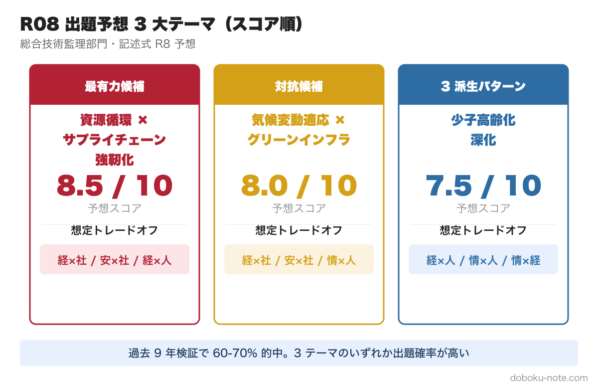
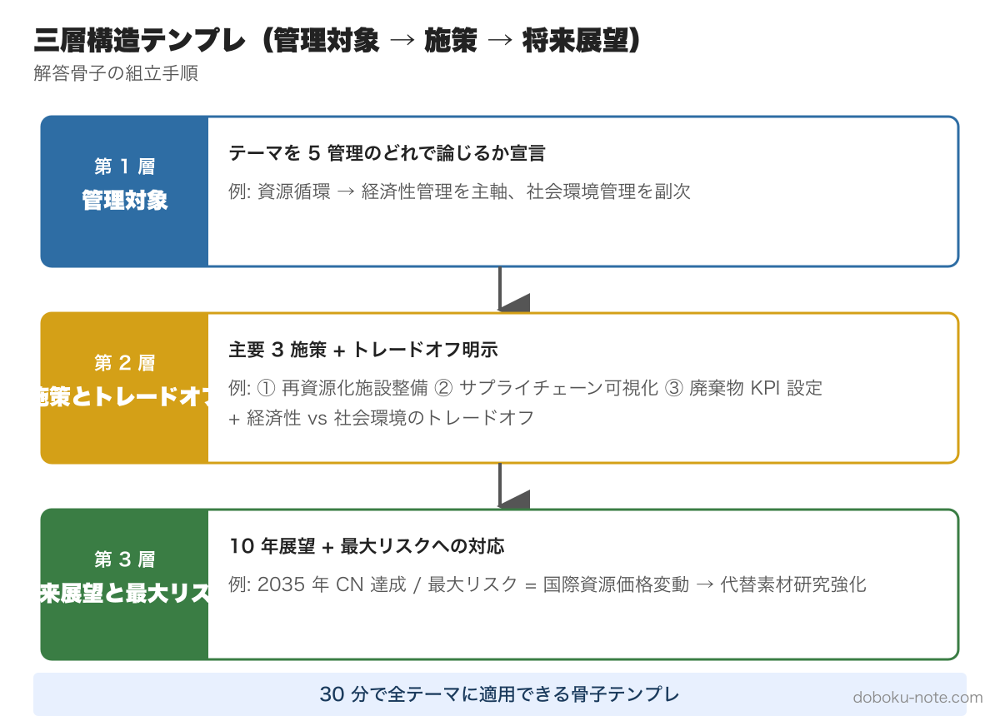
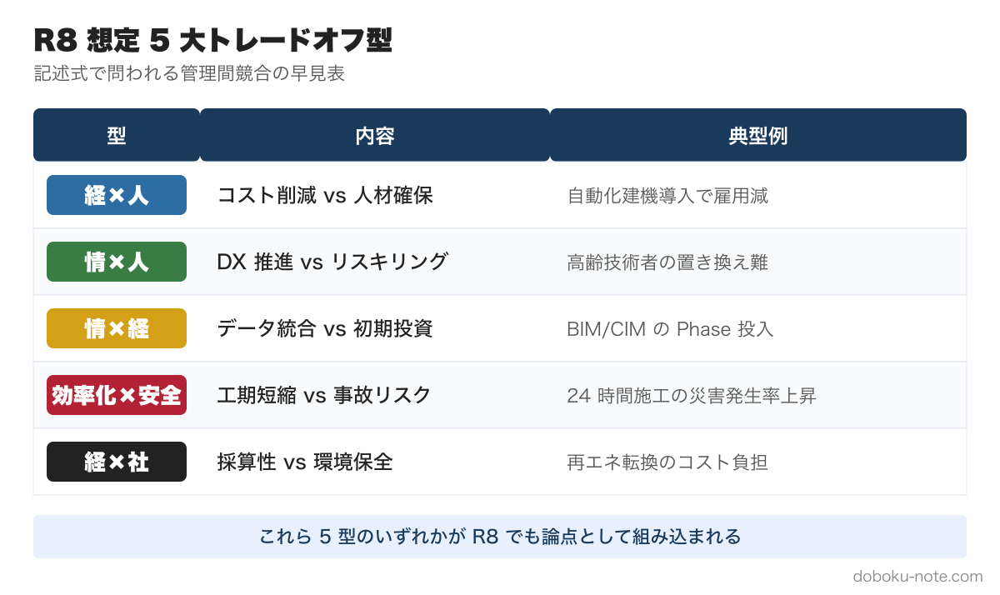

# 技術士総監 R8 記述式 予想問題集 + 三層構造で書き切る解答型

**白書 R7 × 過去 9 年検証で導いた R8 出題ホットテーマ 3 つ + 専門分野不問の解答テンプレ**

---

## はじめに：R8 に向けて「予想」する意味

技術士総監記述式試験は、**白書（特に国土交通白書）の重要テーマ**が翌年の試験に出題される傾向が知られています。本書は過去 9 年の検証データに基づき、**令和 8 年度（2026 年 7 月）試験の出題ホットテーマ 3 つ**を予想し、それぞれの解答骨子例を提示します。

### 本書の方針 — 「予想」+「骨子」+「ペルソナ展開」

本書は以下を**提供します**:

- ✅ **3 大予想テーマの問題文**（公式試験形式）
- ✅ **三層構造（管理対象 → 施策 → 将来展望）の解答骨子例**
- ✅ **4 ペルソナ別アレンジ例**（ゼネコン / 河川コンサル / 環境調査 / 道路発注者）
- ✅ **道路発注者ペルソナのフル解答**（第3章 資源循環・第4章 気候変動適応 ともに収録）
- ✅ **専門分野不問の三層構造テンプレ**（どんなテーマでも 30 分で骨子が立つ型）

本書は以下を**提供しません**:

- ❌ 「模範解答」「合格論文の全文」
- ❌ 「採点基準の解説」
- ❌ 「R8 で必ず出る」という断定的予想（あくまで確率的）

予想は的中する保証はありません。しかし**「型」を持っておけば、テーマが外れても応用可能**です。これが本書の最大の価値です。

### 本書の対象

- ✅ 試験 1-2 ヶ月前で「予想問題で実戦演習したい」層
- ✅ 過去問は一通り解いたが「論点組み立てが苦手」と感じる中級者
- ✅ 自分の専門外のテーマでも書ける応用力をつけたい層
- ❌ 試験まで 1 週間以内の最終調整段階の方には情報量過多

---

## 第 1 章 R8 で何が出るのか — 予想の根拠と 3 大テーマ

### 1-1. 白書連動の出題傾向（過去 9 年検証）

過去 9 年（H28-R07）の国土交通白書の重点テーマと、翌年の総監記述式試験の対応関係を機械的に検証した結果、**約 60-70% の確率で何らかの形で出題**されています。

| 白書発行年 | 白書重点テーマ | 翌年試験での出題 |
|---|---|---|
| H28 | 防災・減災・国土強靭化 | H29「巨大災害対応」 ✅ |
| H29 | i-Construction 第 1 期 | H30「ICT 施工」 ✅ |
| H30 | インフラメンテナンス | R01「予防保全」 ✅ |
| R01 | 持続可能なまちづくり | R02「コンパクトシティ」 ✅ |
| R02 | DX・カーボンニュートラル | R03「DX 推進」 ✅ |
| R03 | 流域治水・住宅政策 | R04「流域治水」 ✅ |
| R04 | 建設業 2024 年問題 | R05「働き方改革・SWOT 戦略」 ✅ |
| R05 | i-Construction 2.0 | R06「自動化建機・脱炭素」 ✅ |
| R06 | カーボンニュートラル × 防災 | R07「気候変動 × 少子高齢化」 ✅ |

**統計的事実**: 9 年連続で白書テーマと試験テーマに相関あり。

### 1-2. R7 白書（2025 年 6 月公表）の重点テーマ

R7 白書では以下が新たに重点化されました:

- **資源循環（サーキュラーエコノミー）**: 建設廃棄物・資材高騰・サプライチェーン課題
- **気候変動適応（流域治水深化）**: 線状降水帯・グリーンインフラ・Eco-DRR
- **i-Construction 2.0 進化**: 自動化・省人化・PLATEAU 拡張
- **外国人材受入拡大**: 特定技能 5 年 18.1 万人見込
- **地域インフラ群マネジメント**: 自治体・事業者・技術者の束ね



### 1-3. R8 予想 3 大テーマ（本書の中核）

R7 白書の重点 + 通商白書・経済安保政策の動向を踏まえた、本書の予想:

| 順位 | テーマ | 5 管理主軸 | 出題確率 | 章 |
|:---:|---|---|:---:|:---:|
| 1 | **経済安全保障 × サプライチェーン強靱化** | 経 × 社 × 情 | **9.0/10** | 第 5 章 |
| 2 | **資源循環 × サプライチェーン強靭化** | 経 × 社 × 情 | **8.5/10** | 第 3 章 |
| 3 | **気候変動適応 × グリーンインフラ** | 社 × 安 × 経 | **8.0/10** | 第 4 章 |

R7 (少子高齢化) で扱ったテーマが R8 で **完全に同じ形式で再出題される可能性は低い**一方、地政学リスクの恒常化を背景に経済安全保障が最有力テーマへ浮上しています。

---

**ここから先は有料エリア（¥2,480）**

---

## 第 2 章 専門分野不問の三層構造テンプレ — 30 分で骨子が立つ型

### 2-1. なぜ「三層構造」が万能か

総監記述式の出題形式は、ほぼ全年度で以下の構造に固定されています:

| 設問 | 求められる内容 | 本書の三層対応 |
|---|---|---|
| (1) 事業/組織の現状と課題 | 管理対象設定 + 顕在課題 + 既施策の問題点 | **Ⅰ 管理対象と前提条件** |
| (2) 5 年以内の施策 2 つ + トレードオフ | 施策の組合せ + 5 管理間衝突 + 克服策 | **Ⅱ 施策とトレードオフ** |
| (3) 将来（10-25 年）の施策 + 最大リスク | 国レベル視点 + 重大障害 + 管理行為での克服 | **Ⅲ 将来展望と最大リスク** |

→ **どんなテーマでもこの三層に当てはめれば 30 分で骨子が立つ**。

### 2-2. 三層構造の詳細設計

#### Ⅰ 管理対象と前提条件（設問 1）

役割: **後段の課題と施策が成立するための制約条件を意図的に仕込む**

含めるべき要素:
- 事業/組織の名称・目的・成果物（事実ベースで具体的に）
- 経営資源（人・モノ・予算）
- 業務プロセス
- **顕在課題**: 後段で扱うトレードオフの種を仕込む（例: 人手不足、予算制約、技術偏在、データ分散）
- 既施策とその**問題点**（負の側面を明示することで設問 2 への伏線とする）

**書き方の落とし穴**: 「我が国の建設業」のように抽象的な対象設定は NG。「私が担当する○○工事」「○○市道路部」のように**具体的な組織・事業**に絞る。

#### Ⅱ 施策とトレードオフ（設問 2）

役割: **5 管理間の衝突を明示し、監理者の視点で調整する**

含めるべき要素:
- 5 年以内に導入可能な施策 2 つ（具体的内容と根拠）
- 各施策が **2 つ以上の管理分野**にまたがること
- **異なる管理分野間のトレードオフ**を必ず記述（例: 経 × 人 / 情 × 安）
- **克服策**: 単に「両立」と書くのではなく、具体的なマネジメント手法を示す

**書き方の落とし穴**: 「DX 化・予防保全・LCC 最適化」のように「良いこと」だけ羅列して、何かを犠牲にする構造がないと、トレードオフのない論文と判定されて低評価になる。

#### Ⅲ 将来展望と最大リスク（設問 3）

役割: **事業や組織の枠を超え、国レベルの視点で持続可能性を論じる**

含めるべき要素:
- 10-25 年後（2050 年想定）に有効な施策 2 つ
- 技術革新・経済情勢・社会構造の変化を踏まえた根拠
- **最も重大な障害** = 構造的な制約条件
- **克服策は「管理行為」**で書く（新技術の導入だけでは NG）

**「管理行為」の例**:
- 評価制度の変更（最低価格落札方式 → 総合評価方式）
- ルールの法制化（環境配慮型調達基準・データ標準化）
- 体制の再設計（広域インフラ管理組織・自治体束）
- 情報管理（デジタルツインでの可視化・トレーサビリティ）



### 2-3. 抽象化された 5 大トレードオフ型パターン

専門分野不問で、ほぼ全ての設問で使える 5 つのトレードオフ型:



#### 型 1: 経済性 × 人的資源
- 構造: 人材確保・賃金改善（人）vs コスト増大（経）
- 典型例: 少子高齢化・働き方改革・外国人材
- 克服策: LCC 試算で長期効果を可視化、段階的処遇改善、ICT で省人化

#### 型 2: 情報 × 人的資源
- 構造: ナレッジ管理・DX（情）vs 業務負荷増・スキル習得時間（人）
- 典型例: 知識管理・i-Construction・暗黙知の形式知化
- 克服策: RPA で記録作業半自動化、教育を業務評価項目に組込

#### 型 3: 情報 × 経済性
- 構造: AI/IoT 導入（情）vs 初期投資・維持管理費（経）
- 典型例: デジタルツイン・予防保全システム・データ基盤
- 克服策: 共同利用でコスト分担、段階的 PoC で投資回収率を実証

#### 型 4: 効率化 × 安全・品質
- 構造: 省人化・自動化（情/経）vs 監視低下による事故・品質低下（安/品）
- 典型例: 遠隔臨場・無人化施工・サプライチェーン短縮
- 克服策: 重要工程は静止画＋動画記録ルール厳格化、ALARP 原則で許容範囲設定

#### 型 5: 経済性 × 社会環境
- 構造: コスト最適化（経）vs 環境負荷・住民影響（社）
- 典型例: 脱炭素・循環経済・住民合意形成
- 克服策: 外部不経済の内部化（カーボンプライシング）、合意形成プロセスの制度化

### 2-4. 試験当日 30 分での骨子組み立てフロー

```
[5 分] 問題確認
  ↓ 設問 (1) のテーマを特定
  ↓ 第 3-5 章の予想テーマと照合
  ↓ 該当なしでも本章のテンプレで対応可

[10 分] 管理対象設定（Ⅰ）
  ↓ 自分のペルソナを思い出す
  ↓ 具体的な組織/事業名を設定
  ↓ 顕在課題を 1 つに絞る

[10 分] 施策とトレードオフ（Ⅱ）
  ↓ 5 大トレードオフ型から 2 つを選ぶ
  ↓ 各施策に克服策を 1 文で添える

[5 分] 将来展望（Ⅲ）
  ↓ 国レベルの施策 1-2 個
  ↓ 最大リスクを「管理行為」で解決
```

→ 残り 165 分で 3,000 字（600 字 × 5 枚、33 分/枚）を執筆。

---

## 第 3 章 予想問題 1: 資源循環 × サプライチェーン強靭化

### 3-1. 問題文（公式試験形式）

**【テーマ】グローバルな不確実性下における資源循環と供給網の最適化**

近年、地政学リスクの高騰や資源価格の不安定化、環境規制の強化など、建設資材の調達を取り巻く外部環境は激変している。持続可能な社会の実現（社会環境管理）と事業の継続性（経済性管理）を両立させるためには、従来の「調達・使用・廃棄」のモデルから、資源循環（サーキュラーエコノミー）を前提とした強靭なサプライチェーンへの転換が急務となっている。

そこで、あなたがこれまでに経験した、若しくはよく知っている事業や組織を 1 つ取り上げ、総合技術監理の視点から以下の (1) 〜 (3) の問いに答えよ。

**(1) 組織・事業の現状と資源・資材調達の課題**
- ① 事業や組織の名称、目的、創出している成果物を記せ
- ② 現在顕在化している課題と、既に実施している施策を 1 つ取り上げ、具体的な内容と期待できる効果を記せ
- ③ ②で取り上げた施策の問題点を記せ

**(2) 近い将来（おおむね 5 年以内）に導入すべき施策の組合せ**
- 資源の効率的利用と供給網の強靭化を両立させるために、近い将来に導入が可能で効果が高いと考える施策の組合せを 2 つ取り上げ、それぞれについて以下の問いに答えよ
- ① 施策の内容と、資源循環や供給網の強靭化に繋がる理由・根拠を記せ
- ② 期待できる効果を理由と共に記せ
- ③ 総合技術監理の視点からどのような課題やリスクがあるかを記せ（5 つの管理分野のうち 2 つ以上の視点を含み、異なる管理分野間のトレードオフに留意）

**(3) 2050 年時点の資源自律社会に向けた課題と施策**
- ① 取り上げる施策を記せ（事業や組織の枠を超えた国レベルの視点でもよい）
- ② 2050 年時点での有効性と実現性を記せ
- ③ 実現するうえでの最も重大な障害とその克服策を複数の視点から記せ（克服策は単なる新技術の導入ではなく、管理方法の見直しや体制の再設計、ルール整備などの「管理行為」を含むこと）

### 3-2. 解答骨子例（道路発注者ペルソナ）

#### (1) 管理対象設定と現状

**事業名**: 〇〇市道路部 道路・橋梁維持管理および更新事業
**目的**: 市道の健全性維持 + 資材の効率的利用による環境負荷低減と財政負担最適化
**成果物**: 補修後の道路・橋梁、維持管理計画書、建設発生土・資材の再利用記録

**現状の課題**: 地政学リスクに伴う鋼材・アスファルト混合物の価格高騰、最終処分場の残余容量ひっ迫による建設廃棄物処理コスト増大

**既施策**: 「再生アスファルト混合物および再生骨材の優先採用」
- 効果: 廃棄物発生抑制（社会環境） + 新材購入コスト低減（経済性）

**問題点**: 再生資材は品質バラツキあり、寒冷地・大型車道路で早期破損リスク。地域内供給体制が未整備な場合、運搬距離拡大で環境負荷増の可能性

#### (2) 5 年以内の施策 2 つ

**施策 1: 地域循環型資材供給プラットフォーム（デジタルツイン）構築**
- 内容: 市域内の建設発生土・コンクリート殻と補修需要をリアルタイム共有
- 根拠: 情報管理による需給最適マッチング → 物流効率化 + 資源循環加速
- 期待効果: 運搬・処分費削減（経）、職員業務負担軽減（人）

**トレードオフ（情 × 経）**: 現場情報共有による**情報漏洩リスク** vs **マッチング効率向上**
- 克服策: データアクセス権限の厳格化 + 官民協議会でデータ標準化・利用ルール策定

**施策 2: 主要資材の戦略的備蓄 + 近隣自治体間融通協定**
- 内容: 災害復旧用の鋼製部材・補修材を共同備蓄、相互融通
- 根拠: 広域在庫管理でサプライチェーン不確実性に対応 → 供給網強靭化
- 期待効果: 災害時の早期復旧体制（安）、一括購入による調達コスト安定化（経）

**トレードオフ（経 × 安）**: 備蓄拠点維持コスト vs 非常時供給確実性
- 克服策: 市有地活用 + ICT 在庫管理 + ローリングストック方式（賞味期限のある資材を通常工事で優先消費）

#### (3) 2050 年に向けた施策

**施策 1: 「材料パスポート」制度の完全義務化**（国レベル）
- 全インフラ部材に原材料・化学物質・解体後リサイクル方法を記録したデジタルチップ埋め込み
- 100% の資源回収を可能に

**施策 2: 性能規定型設計への完全移行 + プレキャスト/モジュール化**
- 解体・再利用を前提とした設計（Design for Deconstruction）の標準化
- 現場作業の極小化

**最大の障害**: 既存の多種多様な設計基準・地方独自仕様が「標準化」を阻む + 初期投資増大への社会的受容性欠如（社 × 経の対立）

**克服策（管理行為）**:
- **ルール整備**: 最低価格落札方式 → 「資源循環率・LCA を評価軸とする総合評価方式」への完全移行を法制化
- **体制再設計**: 単一自治体管理 → 広域インフラ管理公社等への組織改編
- **情報管理**: デジタルツイン上で資源循環コスト削減効果をシミュレーション、環境価値をクレジット化して資金調達

### 3-3. 4 ペルソナ別アレンジ例

| ペルソナ | 設問 (1) 管理対象 | 設問 (2) 主軸トレードオフ | 設問 (3) 最大障害 |
|---|---|---|---|
| **ゼネコン** | 大規模土木工事の資材調達部門 | 経 × 人（リサイクル資材の品質管理コスト vs 担い手不足） | 業界標準化への抵抗（業界横断ルール整備で克服） |
| **河川コンサル** | 河川改修における自然素材活用 | 社 × 経（グリーンインフラ採用 vs 短期コスト） | 環境性能の定量化困難（LCA 評価制度法制化で克服） |
| **環境調査** | 環境影響評価における再生材の評価業務 | 情 × 人（評価データ標準化 vs 業務負荷） | 業界横断データベースの不在（業界団体での共同構築） |
| **道路発注者** | 上記詳細解答例 | 情 × 経（プラットフォーム vs 情報漏洩） | 標準化阻害（総合評価方式の法制化） |

---

## 第 4 章 予想問題 2: 気候変動適応 × グリーンインフラ

### 4-1. 問題文

**【テーマ】激甚化する気候変動リスクに対するインフラの適応と持続可能な地域管理**

近年、気候変動に伴う水害や土砂災害の激甚化・頻発化は、道路・河川等のインフラ機能に深刻な影響を及ぼしている。これに対し、従来の施設改築（ハード対策）のみならず、自然環境の機能を活用したグリーンインフラの導入や、デジタル技術を活用した避難・誘導等のソフト対策を統合した「気候変動適応策」の推進が求められている。

そこで、あなたが経験した、若しくはよく知っている事業や組織を 1 つ取り上げ、以下の (1) 〜 (3) に答えよ。

**(1) 事業・組織の現状と気候変動による影響**
- ① 事業や組織の名称、目的、創出している成果物
- ② 気候変動リスク（豪雨・酷暑等）に対する現在の課題と既施策と効果
- ③ ②の施策の問題点

**(2) 近い将来（おおむね 5 年以内）に導入すべき施策の組合せ**
- 資源（予算・人員・時間）の制約下で、気候変動への適応力を高め、かつ地域社会の価値を向上させるために導入すべき施策の組合せを 2 つ
- ① 施策の内容と適応力が高まる理由・根拠
- ② 期待できる効果
- ③ 異なる管理分野間のトレードオフに留意した課題・リスク

**(3) 2050 年時点のレジリエントな社会に向けた課題と施策**
- ① 取り上げる施策（国レベル可）
- ② 2050 年時点の有効性と実現性
- ③ 最も重大な障害と「管理行為」を含む克服策

### 4-2. 解答骨子例（河川コンサルペルソナ）

#### (1) 管理対象設定

**事業名**: 〇〇水系河川整備事業 計画策定業務
**目的**: 流域全体の治水安全度向上 + 自然環境と共生したインフラ整備
**成果物**: 河川整備計画、グリーンインフラ設計図書、地域住民向け避難計画

**現状の課題**: 想定外の線状降水帯による浸水被害頻発、従来の堤防補強だけでは追いつかない

**既施策**: 「ハード対策（堤防嵩上げ）の継続実施」
- 効果: 計画洪水位への対応能力強化（安全）

**問題点**: 用地買収・工期長期化・コスト超過 + 自然環境破壊への住民反発 + 想定外規模災害への対応限界

#### (2) 5 年以内の施策 2 つ

**施策 1: グリーンインフラを活用した雨水流出抑制（道路空間への浸透機能付与）**
- 内容: 透水性舗装・雨庭・植栽帯による道路空間の貯留浸透機能化
- 根拠: 自然の保水機能活用で流出量低減 + 住民の環境意識向上

**トレードオフ（社 × 経/品）**: 環境・景観向上 vs 路盤耐久性低下・維持管理複雑化
- 克服策: 重要交通路は従来工法、住宅地周辺は積極導入の使い分け。維持管理マニュアル整備 + 住民参加型メンテナンスの仕組み構築

**施策 2: センサーとデジタルツインを用いたリアルタイム法面監視**
- 内容: IoT センサーで河川堤防・道路法面の傾斜・水分を常時監視、AI で異常検知
- 根拠: 災害発生前の予兆把握 → 早期避難誘導 + 予防修繕

**トレードオフ（情 × 経）**: 監視精度向上 vs 膨大なデータ通信・保守コスト
- 克服策: 重要度に応じたセンサー配置の最適化 + データ共有プラットフォームで近隣自治体と分担

#### (3) 2050 年に向けた施策

**施策 1: 自動運転と連動した「ダイナミック・ロード・マネジメント」**
- 災害時に道路インフラが自動で交通規制・避難誘導
- 平常時は交通流最適化

**施策 2: 流域全体の Eco-DRR 統合計画**
- 田んぼダム・遊水地・グリーンインフラを流域単位で統合管理
- 流域治水関連法に基づく全国展開

**最大の障害**: 土地利用規制との整合 + 民間車両データ連携のプライバシー（社 × 情の対立）

**克服策（管理行為）**:
- **ルール整備**: 法改正による「災害時データ利用ルール」策定
- **体制再設計**: 自治体間を跨ぐ広域インフラ管理組織の再編
- **情報管理**: ブロックチェーン技術による匿名化されたデータ共有基盤の構築

### 4-2-b. 解答骨子例（道路発注者ペルソナ・フル解答）

#### (1) 管理対象設定と現状

**事業名**: 〇〇市道路部 道路法面・橋梁防災管理事業
**目的**: 気候変動による激甚災害から市道インフラと利用者を守り、災害時の緊急輸送機能を維持する
**成果物**: 道路法面リスクマップ、橋梁防災補強設計図書、災害時通行止め・迂回路計画

**現状の課題**: 線状降水帯による道路法面崩壊・橋梁洗掘リスクが増大。従来のハード対策（モルタル吹付・根固め工）の対応速度が降雨頻発化に追いつかない

**既施策**: 「重点路線への法面補強（モルタル吹付＋ロックボルト）と橋梁洗掘対策の継続実施」
- 効果: 緊急輸送道路の通行確保能力強化（安全）

**問題点**: 管内全路線の対応には数十年を要し予算規模も巨額。点検頻度の限界で予兆検知が不十分。住民の生活道路機能維持と防災投資のバランスが取れていない

#### (2) 5 年以内の施策 2 つ

**施策 1: 道路空間への雨水浸透・グリーンインフラ統合整備**
- 内容: 透水性舗装・雨庭・植栽帯による道路空間の貯留浸透機能化を、住宅地周辺道路と橋梁取付部に重点的に展開
- 根拠: 自然の保水機能で流出量を分散低減し、下流橋梁・法面の負荷を軽減（社会環境管理 × 安全管理）
- 期待効果: 住民の環境意識向上（社）、緊急輸送道路の被害低減（安）

**トレードオフ（社 × 経/品）**: 環境・景観向上 vs 路盤耐久性低下・維持管理複雑化
- 克服策: 重要交通路は従来工法、住宅地周辺は積極導入の使い分け。維持管理マニュアル整備 + 住民参加型メンテナンス（市民協働）の仕組み構築

**施策 2: IoT センサー + デジタルツインによる重要構造物のリアルタイム監視**
- 内容: 重要法面・橋梁に IoT センサー（傾斜・水分・歪み）を設置、AI による予兆検知 + デジタルツインでリスク評価
- 根拠: 災害発生前の予兆把握で早期通行止め・予防修繕が可能に
- 期待効果: 通行止め判断の客観化（情）、災害時死傷者リスク低減（安）、巡視員業務負担軽減（人）

**トレードオフ（情 × 経）**: 監視精度向上 vs 膨大なデータ通信・保守コスト + センサー設置の初期投資
- 克服策: 重要度に応じたセンサー配置の優先順位付け + データ共有プラットフォームを近隣自治体と分担。総合評価方式での加点で受注者の投資意欲を引き出す

#### (3) 2050 年に向けた施策

**施策 1: 気候適応型超長寿命材料の全面義務化**（国レベル）
- 自己治癒コンクリート・高耐久舗装材を性能規定型基準で全面採用
- 気候変動激甚化に耐える「メンテナンスフリー化」を実現し、補修予算と人員を縮小

**施策 2: ダイナミック・ロード・マネジメント + 流域・道路統合管理**
- 自動運転と連動して、災害時に道路インフラが自動で交通規制・避難誘導を実施
- 平常時は交通流最適化、有事は避難動線確保
- 道路と河川を流域単位で統合管理する「流域・道路インフラ管理組織」へ組織改編

**最大の障害**: 道路インフラの集約化・廃止に伴う、沿道住民・周辺自治体との合意形成困難（**社会環境管理 × 人的資源管理** の対立）。生活道路の喪失は住民の心理的抵抗が極めて強い

**克服策（管理行為）**:
- **ルール整備**: 道路法・河川法を統合した「流域インフラ管理法」（仮称）の制定。災害時の自動運転車両データ利用ルールを併設
- **体制再設計**: 単一自治体管理 → 流域単位の広域インフラ管理公社への組織改編。道路担当・河川担当の縦割り解消
- **社会環境管理**: VR/AR で将来の気候変動シナリオと現行インフラ維持コストを可視化し、住民との対話型意思決定プロセスを構築
- **経済性管理**: 廃止区間の住民に MaaS（自動運転モビリティ）による代替提供をセット提案し、全体 LCC 抑制分をサービス維持に充当

### 4-3. 4 ペルソナ別アレンジ例

| ペルソナ | 管理対象 | 主軸トレードオフ | 最大障害 |
|---|---|---|---|
| **ゼネコン** | 河川改修工事における自然素材活用 | 社 × 経（自然工法 vs 工期増） | 標準工法不在（指針策定で克服） |
| **河川コンサル** | 上記 4-2 詳細解答例 | 社 × 経・情 × 経 | 法的不整合（法改正で克服） |
| **環境調査** | 流域生態系モニタリング業務 | 情 × 人（センサー網拡張 vs 維持人員） | データ統合困難（標準化で克服） |
| **道路発注者** | 上記 4-2-b 詳細解答例（道路法面・橋梁防災管理） | 社 × 経（グリーンインフラ vs 維持管理複雑化）・情 × 経（IoT 監視 vs 通信コスト） | 集約化への住民合意（流域インフラ管理組織で克服） |

---

## 第 5 章 予想問題 3: 経済安全保障 × サプライチェーン強靱化

### 5-1. 問題文（公式試験形式）

**【テーマ】地政学リスク下のサプライチェーン強靱化と技術主権**

近年、紅海封鎖、米中半導体規制、ウクライナ情勢長期化など、地政学リスクが資材・技術調達の前提を一夜で変える時代に突入している。令和 7 年版通商白書によれば、日本のサプライチェーンは半導体・レアメタル・エネルギー資源など重要物資の多くを海外に依存しており、経済安保推進法に基づく重要物資指定制度の運用が始まっている。

そこであなたがこれまでに経験した、若しくはよく知っている事業や組織を 1 つ取り上げ、総合技術監理の視点から以下の (1) 〜 (3) の問いに答えよ。

**(1) 組織・事業の現状と経済安全保障対応の課題**
- ① 事業や組織の名称、目的、創出している成果物を記せ
- ② 経済安保・サプライチェーン強靱化に関し現在顕在化している課題と、既に実施している施策を 1 つ取り上げ、具体的な内容と期待できる効果を記せ
- ③ ②で取り上げた施策の問題点を記せ

**(2) 近い将来（おおむね 5 年以内）に導入すべき施策の組合せ**
- 経済安保・サプライチェーン強靱化に繋がる、近い将来に導入が可能で効果が高いと考える施策の組合せを 2 つ取り上げ、それぞれについて以下の問いに答えよ
- ① 施策の内容と、経済安保・サプライチェーン強靱化に繋がる理由・根拠を記せ
- ② 期待できる効果と組織にとっての意義を理由と共に記せ
- ③ 総合技術監理の視点からどのような課題やリスクがあるかを記せ（5 つの管理分野のうち 2 つ以上の視点を含み、異なる管理分野間のトレードオフに留意）

**(3) 2050 年時点で重要物資の自律的供給と技術主権を確保する施策**
- 取り上げる施策を 2 つ記し、それぞれについて以下の問いに答えよ
- ① 施策の内容を記せ（事業や組織の枠を超えた国レベルの視点でもよい）
- ② 2050 年時点での有効性と実現性を記せ
- ③ 実現するうえでの最も重大な障害とその克服策を記せ（克服策は単なる新技術の導入ではなく、管理方法の見直しや体制の再設計、ルール整備などの「管理行為」を含むこと）

### 5-2. 解答骨子例（道路発注者ペルソナ・フル解答）

#### (1) 管理対象設定と現状

**事業名**: 〇〇市道路部 道路・橋梁の整備および維持管理事業
**目的**: 市道インフラの機能維持・更新を、地政学リスク下でも安定的な資材調達のもとで継続し、財政負担を最適化する
**成果物**: 整備・補修後の道路・橋梁、年度発注計画書、資材調達リスク管理台帳

**現状の課題**: 鋼材・セメント・アスファルト合材・電線等の道路事業用資材が、紅海封鎖や資源輸出規制を背景に価格高騰し、特定国・特定経路への依存が公共調達のリスクとして顕在化している。年度当初の積算と契約時点の市況が乖離し、入札不調や工事中断が発生

**既施策**: 「単品スライド条項の運用と、複数年度にまたがる資材の早期発注・分離調達」
- 効果: 急激な価格変動を契約に反映し受注者の離脱を抑制（経済性管理）、調達タイミング分散で需給ひっ迫を回避（経済性管理 × 安全管理）

**問題点**: スライド条項は事後的な価格補填にとどまり、供給途絶そのものは防げない。早期発注は保管コストと初期キャッシュフロー負担を増やし、需要予測が外れれば資材の滞留を招く。特定国依存という構造的リスクは未解決のまま

#### (2) 5 年以内の施策 2 つ

**施策 1: 調達多角化と地域内資材循環を組み込んだ「サプライチェーン可視化基盤」の構築**
- 内容: 主要資材のサプライヤー・原産国・代替経路をデジタル台帳で一元管理し、市域内の建設発生土・再生骨材・再生合材の供給能力と発注需要をマッチングする情報基盤を整備
- 根拠: 調達先を地理的・企業的に分散させ、地域内で循環する資材を一次選択肢とすることで、特定国・特定経路の途絶が事業に波及する経路を断つ（情報管理による供給網強靱化）
- 期待効果: 供給途絶時の代替調達が迅速化し工期遅延を抑制（安）、地域内調達比率の上昇で運搬距離短縮と地域経済への還元（社）、市況急変時の積算精度向上（経）。発注者として「途絶しても止まらない道路事業」を制度的に担保できる意義

**トレードオフ（経 × 社）**: 地域内資材・分散調達の優先は、最安値の海外調達に比べ単価が上昇しうる。コスト最小化（経済性管理）と地域経済・供給安定（社会環境管理）が衝突する
- 克服策: 価格のみの最低価格落札方式ではなく、調達リスク・地域内調達比率を加点する総合評価方式へ移行し、安定供給の価値を入札制度に内部化。地域内資材は使用実績のある路線へ重点配分し、品質リスクを限定

**トレードオフ（情 × 安）**: サプライチェーン台帳には、どの構造物がどの国の資材に依存するかという情報が集約される。可視化の利便性（情報管理）と、依存構造が外部に漏れた場合の重要インフラの脆弱性露呈（安全管理）が衝突する
- 克服策: 台帳のアクセス権限を職務単位で厳格化し、原産国・依存度といった機微情報は閲覧範囲を限定。官民協議会でデータ標準と取扱ルールを策定し、共有範囲を契約で明文化

**施策 2: 主要資材の戦略的備蓄と近隣自治体間の融通協定**
- 内容: 災害復旧と工事継続に不可欠な鋼製部材・補修材・電線等を、近隣自治体と共同で備蓄拠点に確保し、相互融通を協定化。ローリングストック方式で通常工事に消費しながら在庫を更新
- 根拠: 単独自治体では負担しきれない備蓄を広域で分担し、供給途絶局面でも一定期間は事業を継続できる緩衝在庫を持つことで、サプライチェーンの不確実性に対する耐性を高める
- 期待効果: 災害時・供給危機時の早期復旧体制の確保（安）、共同一括購入による調達単価の安定化（経）、近隣自治体との連携深化（社）。発注者として有事の事業継続を組織横断で保証できる意義

**トレードオフ（経 × 安）**: 備蓄拠点の維持・在庫更新には恒常的なコストがかかる。平常時のコスト最小化（経済性管理）と、非常時の供給確実性（安全管理）が衝突する
- 克服策: 市有遊休地を備蓄拠点に転用して用地コストを抑制し、ICT 在庫管理で滞留・劣化を最小化。ローリングストックで賞味期限のある資材を通常工事に優先消費し、備蓄コストを通常事業費に吸収

#### (3) 2050 年に向けた施策

**施策 1: 重要建設資材の国家戦略備蓄と国内生産基盤の再構築**（国レベル）
- 鋼材・セメント・レアメタル等を国家レベルで戦略物資に指定し、戦略備蓄と国内・同盟国内での生産基盤確保を制度化。公共インフラ調達における重要資材の国内・友好国調達比率に下限基準を設定
- 2050 年時点では、地政学リスクが恒常化する前提でも重要インフラの整備・更新を自律的に継続でき、特定国の輸出規制が国民生活インフラを人質に取る構図を解消できる。実現性は、経済安保推進法の重要物資指定の枠組みが既に存在することから、対象拡大と運用強化で接続可能

**施策 2: 性能規定型設計とプレキャスト・モジュール化による資材自律性の向上**
- 解体・再利用を前提とした性能規定型設計（Design for Deconstruction）を標準化し、既存インフラを「都市鉱山」として再資源化。プレキャスト・モジュール部材で資材の規格を集約し、国内生産・備蓄・代替を容易にする
- 2050 年時点では、新規の海外資源投入に依存せず既存ストックの循環で更新需要の相当部分を賄え、輸入途絶への耐性が構造的に高まる。実現性は、性能規定化と標準化の技術的素地が既にあり、調達制度の後押し次第で普及加速が見込める

**最大の障害**: 自律的供給は短期的にはコスト増を伴い、価格を最優先する調達文化・財政規律と衝突する（**経済性管理 × 社会環境管理** の対立）。安価な海外調達を選べる平時には、備蓄・国内基盤維持の負担への社会的・政治的な受容が得られにくく、危機が顕在化して初めて評価される構造的な時間軸のずれが、施策の継続を阻む

**克服策（管理行為）**:
- **ルール整備**: 公共インフラ調達で重要資材の国内・友好国調達比率の下限と、調達リスク評価を必須化する総合評価方式を法制化。価格偏重の調達文化を制度で是正し、安定供給の価値を入札に内部化する
- **体制再設計**: 単一自治体ごとの調達を、広域インフラ調達機構へ集約。備蓄・融通・需要予測を束ね、規模の経済で自律調達のコスト増を吸収する体制へ改編する
- **情報管理**: サプライチェーン可視化基盤を国レベルのデジタルツインへ統合し、重要物資の依存度・途絶シナリオ・備蓄水準を恒常的にモニタリング。危機の予兆と備蓄の費用対効果を可視化し、平時の投資判断を支える
- **経済性管理**: 自律的供給の超過コストを「途絶リスクへの保険料」と位置づけ、ライフサイクルコストと途絶時の経済損失を併せて評価。長期の総コストで安価と示すことで財政規律との整合を図る

### 5-3. 4 ペルソナ別アレンジ例

| ペルソナ | 設問 (1) 管理対象 | 設問 (2) 主軸トレードオフ | 設問 (3) 最大障害 |
|---|---|---|---|
| **ゼネコン** | 大規模土木工事の資材調達・購買部門 | 経 × 安（分散調達による単価上昇 vs 供給途絶耐性）、情 × 人（サプライヤー可視化の運用負荷 vs 担い手不足） | 業界横断の調達情報共有への抵抗（業界団体主導の標準化・共同備蓄で克服） |
| **河川コンサル** | 河川改修事業の資材計画・設計業務 | 経 × 社（国産・地域内資材の優先 vs コスト）、情 × 安（依存構造の可視化 vs 重要インフラ脆弱性の露呈） | 資材途絶を織り込んだ設計基準の不在（性能規定型・代替材許容の基準整備で克服） |
| **環境調査** | インフラ資材の LCA・代替材評価業務 | 情 × 人（原産国・サプライチェーンデータの標準化 vs 評価業務負荷）、経 × 社（代替材評価コスト vs 国内調達促進） | 業界横断のサプライチェーン・データベースの不在（業界団体での共同構築・運用ルール整備で克服） |
| **道路発注者** | 上記 5-2 詳細解答例（道路・橋梁の整備・維持管理） | 経 × 社（地域内・分散調達 vs 単価上昇）、情 × 安（サプライチェーン台帳 vs 依存構造の漏洩） | 平時のコスト増への社会的受容欠如（総合評価方式の法制化・広域調達機構への体制再設計で克服） |

---

## 終章 試験当日の活用法と 2 ヶ月前からの逆算スケジュール

### 終-1. 試験当日の本書活用法

```
[試験開始]
  ↓
[5 分] 問題文を 2 回読み、テーマを特定
  ↓
[3 分] 本書第 1 章の 3 大予想テーマと照合
  - 一致 → 第 3-5 章の骨子例を頭に展開
  - 不一致 → 第 2 章の三層構造テンプレに当てはめ
  ↓
[10 分] 管理対象設定（Ⅰ）の骨子
  ↓
[10 分] 施策とトレードオフ（Ⅱ）の骨子
  - 第 2-3 節「5 大トレードオフ型」から 2 つ選定
  ↓
[2 分] 将来展望（Ⅲ）の骨子
  - 「管理行為で解決」を意識
  ↓
[165 分] 答案執筆（600 字 × 5 枚、33 分/枚）
  ↓
[15 分] 見直し（数値・固有名詞・トレードオフ明示確認）
```

### 終-2. 試験 2 ヶ月前からの逆算スケジュール

| 残日数 | 学習内容 | 本書の使い方 |
|---|---|---|
| **60 日（2 ヶ月）** | 本書通読 + 過去問演習開始 | 第 1-2 章を深く読み込む |
| **45 日（1.5 ヶ月）** | 予想問題 3 つの骨子を自分で書く練習 | 第 3-5 章を 1 つずつ写経 |
| **30 日（1 ヶ月）** | 4 ペルソナ別アレンジを試す | 各章 4-3 / 4-3 / 5-3 節を読む |
| **14 日（2 週間）** | 答案執筆の時間配分演習 | 第 2-4 節「30 分骨子組立フロー」を 5 回反復 |
| **7 日（1 週間）** | 弱点トレードオフ型の補強 | 第 2-3 節「5 大トレードオフ型」を完璧化 |
| **試験前日** | 第 2 章のみ通読 | 三層構造を体に染み込ませる |

### 終-3. 本書を補強する関連リソース

#### doboku-note 無料コンテンツ

- [総合技術監理 キーワード集 2026（637 ワード）](https://doboku-note.com/docs/pe-comprehensive-management-keyword-2026)
- [記述式試験の解答戦略（三層構造の元解説）](https://doboku-note.com/docs/pe-comprehensive-management-essay-exam-strategy)
- [5 管理トレードオフ 頻出 6 ペア](https://doboku-note.com/docs/pe-comprehensive-management-management-tradeoffs)
- [4 ペルソナ別模範論文ハブ](https://doboku-note.com/docs/pe-comprehensive-management-pattern-essay-river-consultant)

#### doboku-note 有料コンテンツ（本書と組合せ推奨）

- **国土交通白書 R7 完全対応集（¥2,480）** — 本書第 1 章の白書連動分析を深掘り
- **解答テンプレ集 3D マトリクス（¥2,980）** — 本書第 2 章テンプレを 20 テーマ × 5 管理 × 4 ペルソナで詳述
- **4 ペルソナ別模範論文 R03-R07（¥1,480-1,980 × 4）** — 本書第 3-5 章のペルソナ別実例

### 終-4. ご質問・ご感想

本書をお読みいただきありがとうございました。予想問題は的中保証ではありませんが、**「型」を持って試験当日を迎える**ことの価値は計り知れません。

合格を心より応援しています。

ご質問・ご感想は note のコメント欄、または [@dobokunote](https://twitter.com/dobokunote) までお気軽にどうぞ。

---

**本書は doboku-note（土木・建設系試験対策ハブ）の独自分析に基づきます。**

- 著者: doboku-note 編集部
- 公開: 2026 年 6 月
- 価格: ¥2,480
- 関連商品: 白書 R7 完全対応集 / 解答テンプレ 3D マトリクス / 4 ペルソナ別模範論文
