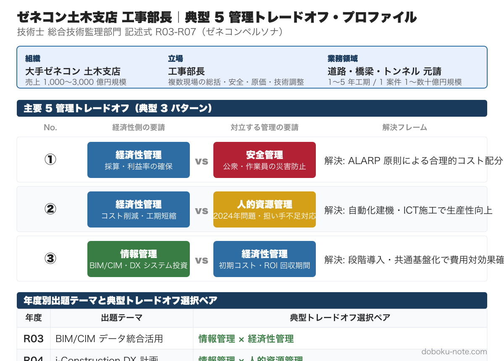

# 令和4年度 総監記述式 模範論文｜ゼネコン版（DX 推進計画）

**こんな人のための記事です**

- 大手ゼネコン土木支店の技術者として総監記述式を受験する
- R4 の「DX 推進」テーマで「i-Construction の延長」と「自動運転による業態変革」の境界をどう切り分けるか迷っている
- 設問（３）の 13 週タスクフォース工程設計で「関係機関打合せ」を最重要に置く根拠を組み立てたい
- 5 か年計画の最大障害を「自動化と人作業の混在による安全リスク」で論じる構成を知りたい

**この記事でわかること**

- 令和4年度 必須科目（DX）の **3,000 字級フル模範論文（ゼネコン版）**
- ICT 施工から自動運転建機・支店オペレーションセンターへの業態変革
- 13 週工程（現状診断 3 週・実現目標 3 週・取組内容 4 週・関係機関 2 週・取りまとめ 1 週）と「関係機関打合せを最重要に置く」根拠
- 5 管理間トレードオフを「**安全×経済性×情報**（DX 取組）」「**安全×情報×経済性**（最大障害）」で立てる王道パターン
- 採点者視点でのチェックポイント（4 項目）

---

ゼネコンペルソナの過去 5 年分（R03-R07）をセットにした **magazine ¥1,980（単品 5 本 ¥2,500 → 21%OFF）** もあわせてご覧ください。

https://note.com/dobokunote/m/PLACEHOLDER_GC_MAGAZINE

---

技術士総合技術監理部門 令和4年度 記述式試験（テーマ：DX）を、**大手ゼネコン土木支店の工事部長** の立場で解いた模範論文。設問の三層構造（過去から現在の利用変遷 → 現在の DX 取組 → 13 週で策定する 5 か年 DX 推進計画）に対応し、各段階で 5 管理間トレードオフを明示する。

> 本論文は「自分の業務経験を活かして 3,000 字を書ききる」ためのテンプレートとして提示します。**そのまま暗記するのではなく、自分の支店規模・業務領域・経験事例に置き換えて再構成する** 前提で読んでください。R4 は (3) でタスクフォース運営の工程設計が問われており、**プロジェクトマネジメントとリスクマネジメントの両輪を示せるか** が採点ポイントです。

## 想定する管理対象と前提条件

| 項目 | 設定 |
|---|---|
| 事業名 | ○○建設 △△土木支店 土木事業部 |
| 規模 | 売上 1,000〜3,000 億円規模の大手ゼネコン、土木支店 500 名規模 |
| 業務領域 | 道路・橋梁・トンネル等の元請施工 |
| 立場 | 工事部長（複数現場の総括、安全衛生管理、原価管理、技術調整）。本論文では DX 推進タスクフォースのリーダーを兼務 |
| 前提条件 | i-Construction による ICT 施工は標準化済み、BIM/CIM は大型案件で部分導入、自動化建機・遠隔施工は試行段階、来年度から 5 か年の DX 推進計画を策定するタスクフォースが立ち上がる |

ゼネコンペルソナの他の管理対象パターンへの置き換えは [ゼネコン向け 模範論文ハブ](https://doboku-note.com/docs/pe-comprehensive-management-pattern-essay-general-contractor?utm_source=note&utm_medium=referral&utm_campaign=essay-gc-r04) を参照してください。

## 設問（１）事業や組織の内容とデジタル技術の利用の変遷

### 組織の概要・役割・立場

○○建設 △△土木支店 土木事業部であり、道路・橋梁・トンネル等の元請施工を行う。私は工事部長として複数現場の総括、安全衛生管理、原価管理、技術調整を担当し、本タスクフォースではリーダーを務める。

### 経営資源・アウトプット・業務プロセス

- **経営資源**: 技術員・施工管理職員 500 名、自社保有の特殊建機、本社技術研究所、全国 10 支店ネットワーク
- **アウトプット**: 各種土木構造物の竣工物、施工計画書、品質記録、安全衛生記録、技術提案書
- **業務プロセス**: 受注 → 詳細設計協議 → 施工計画策定 → 仮設・本体工事 → 検査 → 引渡し → 維持管理（1〜5 年）

### 過去のデジタル技術利用の変遷

- **初期段階（10 年前）**: 紙の施工図、手書きの施工管理日誌、CAD は本社設計部のみ。重機オペレータは経験と勘で施工、出来形管理はトータルステーション目視。報告書は事務所で手書き → 印刷
- **現在の利用状況**: 全現場で 3D マシンガイダンス・ドローン測量、出来形は ICT で電子納品、BIM/CIM は大型橋梁・トンネル案件で部分導入、施工管理ソフト（Andpad 等）の導入で日報・写真共有がクラウド化
- **得られた効用**: ICT 施工で土工系の作業人員が 20〜30% 削減、ドローン測量で出来形管理が大幅効率化、施工管理ソフトで遠隔監督が可能となり週休 2 日への移行が進んだ
- **副作用**: BIM/CIM の操作スキルが特定社員に集中し属人化、施工データが現場ごとに孤立しナレッジ蓄積が断片化、ICT 機器の維持管理コスト増、現場代理人の IT リテラシー差で運用品質にばらつき

## 設問（２）DX としての取組

### 取組の概要・活用デジタル技術・変革の内容

直近に始まる取組として、**「自動運転建機群と支店オペレーションセンターによる複数現場一元監視」** を取り上げる。

- **概要**: 自動運転バックホウ・ダンプ・転圧ローラを複数現場に配備し、支店内に設置するオペレーションセンターから一元監視・遠隔操縦する。現場代理人は安全管理・対外折衝に専念できる
- **活用デジタル技術**: 自動運転建機（GNSS + LiDAR + AI）、5G/6G 通信、デジタルツイン現場、AI 異常検知、施工データプラットフォーム
- **変革の内容**: 「現場ごとに完結する施工」から「複数現場をオペレーションセンターから一元運用する施工」への業態変革。1 人の経験豊富な技術者が複数現場を担当できる体制に転換し、担い手不足下でも生産能力を維持する

### 利点と問題点

**利点**:
- **経済性管理**: 直接作業員数の大幅削減、夜間・狭隘現場の稼働拡大、特殊技能者の希少資源活用
- **情報管理**: 全現場の施工データが標準化されてオペレーションセンターに集約され、ナレッジ蓄積と分析が高度化する
- **人的資源管理**: 重労働・危険作業から解放され、若手・女性・高齢者でも操作可能な作業領域が拡大する
- **安全管理**: 危険作業の遠隔化により労災が大幅減少する

**問題点**:
- **安全管理**: 自動化と人作業が混在する現場では衝突・巻込みリスクが新たに発生する。通信遮断時のフェイルセーフ設計が必須
- **経済性管理**: 自動運転建機・オペレーションセンターの初期投資は支店全体で 10〜20 億円規模、回収には 5〜7 年を要する
- **情報管理**: サイバーセキュリティリスク（建機の遠隔乗っ取り）、現場データの機密保持、自動化判断の説明可能性

## 設問（３）DX 推進計画とタスクフォース

### タスクフォースの中核メンバー

5 名で構成する。

- **リーダー**: 工事部長（私）。支店全体俯瞰、本社調整、対発注者折衝
- **メンバー A**: 中堅技術士（建設部門・施工計画）。技術領域の選定、施工計画への DX 適用判断
- **メンバー B**: 若手技術者（情報処理技術者試験 取得済）。データ基盤・自動運転建機の実装、AI モデル設計
- **メンバー C**: 経理・原価管理担当。投資計画、原価管理、ROI 評価、補助金申請
- **メンバー D（外部）**: 本社技術研究所のシニア研究員 + 主要建機メーカーの技術員。先進技術の知見と建機開発側の視点

### 13 週のスケジュール

| 工程 | 時期 | 期間 | 内容 |
|---|---|---|---|
| 現状診断 | W1〜3 | 3 週 | 現業務プロセス棚卸、属人化マップ作成、ICT 資産棚卸、現場ヒアリング |
| 実現目標設定 | W4〜6 | 3 週 | 5 か年で達成すべき定量目標（自動化率・労働生産性・採算）の設定、KPI 設計 |
| 取組内容検討 | W7〜10 | 4 週 | 個別取組（自動運転建機・センター設備・教育・標準化）の優先順位付けと予算配分 |
| 関係機関打合せ | W11〜12 | 2 週 | 本社・主要発注者・主要建機メーカー・主要協力会社へのヒアリング、補助金確認 |
| 計画取りまとめ | W13 | 1 週 | 推進体制・予算・KPI・撤退条件を盛り込んだ最終計画書の取りまとめ |

### 最重要工程とその理由

**最重要工程は「関係機関打合せ（W11〜12）」** である。理由は、ゼネコンの DX は **発注者・本社・建機メーカー・専門工事業者の合意なくして成立しない** ためである。発注者の仕様書改訂、本社の投資承認、建機メーカーの技術提供、協力会社の標準化合意が揃わないと、計画は机上の空論になる。13 週という短期間でも、ここに 2 週を確保し、複数機関と並行して合意形成を進める優先度は揺るがない。

### 仮説：実現目標・取組内容・最大障害・克服策

**実現目標（5 か年）**:
- 全土工系現場の自動運転建機適用率 50% 以上
- 労働生産性（実働時間あたり出来高）を基準年比 1.5 倍
- 直接作業員数を基準年比 30% 削減（離職分を補う）

**取組内容**:
1. 自動運転建機の段階導入（補助金 + リース活用）
2. 支店オペレーションセンターの設置と運用体制構築
3. 全現場の標準化・データプラットフォーム構築
4. 現場代理人・技術員の DX 教育プログラム整備
5. 主要協力会社との共同 DX 推進アライアンス

**最大の障害**: **「自動化と人作業の混在による安全リスク」**。自動化建機の導入で生産性は上がるが、人作業との混在現場で予期せぬ事故が発生すると、人命被害だけでなくブランドと発注者信頼が一気に失墜する。これは安全管理（公衆災害・労災）と情報管理（自動化システムの信頼性）と経済性管理（事故対応コスト・契約損失）が同時に変動する複合リスクである。

**克服策**:
- **安全管理**: 自動化エリアと人作業エリアの物理分離、ISO 国際規格に準拠した安全認証、フェイルセーフ設計の三層防御を支店標準として整備する
- **情報管理**: サイバーセキュリティ ISO 準拠運用、自動運転建機の AI 判断根拠の記録・監査、通信遮断時の安全停止プロトコル整備
- **経済性管理**: 段階導入で投資リスクを限定し、各段階で安全実績を発注者・本社に開示して信頼を積み上げる
- **トレードオフの解消**: 安全管理（事故防止）× 情報管理（システム信頼）× 経済性管理（投資回収）の三者を、KPI（無事故時間・システム稼働率・労働生産性）で同時に追跡し、四半期毎に進捗確認する

## トレードオフと解決フレームの整理

本論文で論じたトレードオフを、頻出ペアの枠組みで再整理する。

| 設問 | 論じたトレードオフ | 解決フレーム |
|---|---|---|
| (2) DX 取組 | 安全管理 × 経済性管理 × 情報管理 | 物理分離 + ISO 準拠 + 段階導入 |
| (3) 最大障害 | 安全管理 × 情報管理 × 経済性管理 | [段階的実施](https://doboku-note.com/docs/pe-comprehensive-management-management-tradeoffs?utm_source=note&utm_medium=referral&utm_campaign=essay-gc-r04#段階的実施) + KPI 連動 |
| (3) 工程設計 | 経済性（短工期）× 社会環境（合意形成） | 関係機関打合せに 2 週確保（最重要工程） |

## 採点者視点でのチェックポイント

R4 ゼネコン版は「i-Construction の延長 → 自動運転による業態変革 → 安全リスクとの両立」の三段で書く。採点者がチェックする 4 点：

- (1) では過去のデジタル技術利用と現在の状況を変遷として描き、「副作用」（属人化・データ孤立）を明示する。これが (2)(3) の伏線になる
- (2) では「ICT 施工 → 自動運転建機」のように業態変革を伴う取組を選ぶ。単なるツール導入は DX ではないため減点対象
- (3) のタスクフォース工程は時期・期間・内容を表で示し、最重要工程を選んで根拠を述べる。「関係機関打合せ」を最重要に置くとゼネコンの実態が立つ
- 最大障害は「自動化と人作業の混在による安全リスク」のように複数管理にまたがる構造的リスクを選ぶ。技術論だけの障害は採点者から見て浅い

---

## doboku-note の関連ガイド

- [ゼネコン向け 模範論文ハブ](https://doboku-note.com/docs/pe-comprehensive-management-pattern-essay-general-contractor?utm_source=note&utm_medium=referral&utm_campaign=essay-gc-r04) — 共通ペルソナと R3〜R7 の年度別模範論文の起点
- [令和4年度 総監記述式 過去問解説](https://doboku-note.com/docs/pe-comprehensive-management-r04-secondary?utm_source=note&utm_medium=referral&utm_campaign=essay-gc-r04) — 必須科目の問題文全文と他ペルソナの模範論文例
- [5 管理間トレードオフ 頻出パターンと解決フレーム](https://doboku-note.com/docs/pe-comprehensive-management-management-tradeoffs?utm_source=note&utm_medium=referral&utm_campaign=essay-gc-r04) — 段階的実施・KPI 連動などのフレーム集

---

## magazine セット販売のお知らせ

ゼネコンペルソナの過去 5 年分（R03-R07）の模範論文を全 5 本セットにした magazine を販売しています。

- 単品: 各 ¥500 × 5 = ¥2,500
- magazine セット: **¥1,980（21%OFF）**

R03（データ利活用）/ R04（DX）/ R05（SWOT）/ R06（カーボンニュートラル）/ R07（少子高齢化）と、テーマは毎年異なりますが、**ゼネコン土木支店として書ける論点とトレードオフは共通パターン** があります。5 年分をまとめて読むことで、テーマが変わっても応用できる「自分用テンプレート」が構築できます。

https://note.com/dobokunote/m/PLACEHOLDER_GC_MAGAZINE
